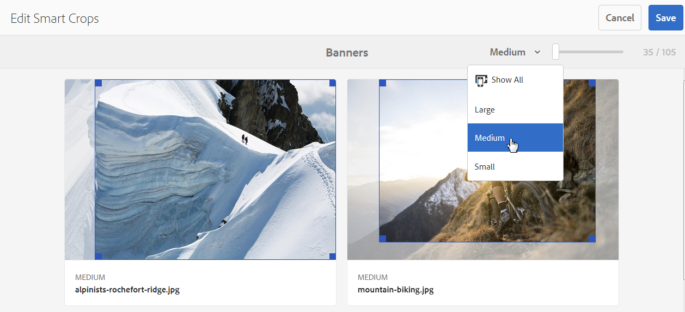

# Dynamic Media 이미지 프로필 {#image-profiles}

이미지를 업로드할 때 폴더에 이미지 프로필을 적용하여 업로드 시 이미지를 자동으로 자를 수 있습니다.

>[!IMPORTANT]
>
>이미지 프로필은 PDF, 애니메이션 GIF 또는 INDD(Adobe InDesign) 파일에 적용할 수 없습니다.

## [언샵 마스크] 옵션 {#unsharp-mask}

이미지 프로필을 만들 때 **[!UICONTROL 언샵 마스크]** 옵션을 사용하여 다운샘플링된 최종 이미지의 선명하게 하기 필터 효과를 미세 조정할 수 있습니다. 효과의 강도, 효과의 반경(픽셀 단위) 및 무시되는 대비 임계값을 제어할 수 있습니다. 이 효과는 Adobe Photoshop의 &quot;언샵 마스크&quot; 필터와 동일한 옵션을 사용합니다.

>[!NOTE]
>
>언샵 마스크는 50% 이상 다운샘플링되는 PTIFF(피라미드형 tiff) 내의 축소된 렌디션에만 적용됩니다. 언샵 마스크는 ptiff 내의 가장 큰 렌디션에 영향을 주지 않습니다. 반면 썸네일과 같은 작은 크기의 렌디션은 변경되며(그리고 언샵 마스크 표시).

**[!UICONTROL 언샵 마스크]**&#x200B;에는 다음과 같은 필터링 옵션이 있습니다.

<table>
 <tbody>
  <tr>
   <td><strong>옵션</strong></td>
   <td><strong>설명</strong></td>
  </tr>
  <tr>
   <td>양</td>
   <td>가장자리 픽셀에 적용된 대비의 양을 제어합니다. 기본값은 1.75입니다. 고해상도 이미지의 경우 최대 5까지 늘릴 수 있습니다. 양을 필터 강도를 나타내는 척도로 간주합니다. 범위는 0~5입니다.</td>
  </tr>
  <tr>
   <td>반경</td>
   <td>선명하게 하기가 적용되는 가장자리 픽셀 주위의 픽셀 수를 결정합니다. 고해상도 이미지의 경우 1~2를 입력합니다. 낮은 값은 가장자리 픽셀만 선명하게 하고 높은 값은 넓은 폭의 픽셀을 선명하게 합니다. 올바른 값은 이미지의 크기에 따라 다릅니다. 기본값은 0.2입니다. 범위는 0~250입니다.</td>
  </tr>
  <tr>
   <td>임계값</td>
   <td>
언샵 마스크 필터가 적용될 때 무시할 수 있도록 대비 범위를 결정합니다. 이 옵션은 가장자리 픽셀로 간주하기 위해 선명해진 픽셀이 주위와 얼마나 달라야 하는지 제어합니다. 이 임계값을 충족하는 픽셀만 선명하게 됩니다. 소음이 발생하지 않도록 하려면 0-255 사이의 값으로 실험하십시오.
 </td>
  </tr>
 </tbody>
</table>

선명하게 하기는 [이미지 선명하게 하기](/help/assets/dynamic-media/assets/sharpening_images.pdf)에 설명되어 있습니다.

## 자르기 옵션 {#crop-options}

이미지에 스마트 자르기를 구현하면 Adobe은 다음 모범 사례를 권장하며 다음 제한을 적용합니다.

| 에셋 - 제한 유형 | 모범 사례 | 제한 적용됨 |
| --- | --- | --- |
| **이미지** - 이미지당 스마트 자르기 수 | 5 | 100 |

[Dynamic Media 제한 사항](/help/assets/dynamic-media/limitations.md)도 참조하세요.

<!-- CQDOC-16069 for the paragraph directly below -->

스마트 자르기 좌표는 종횡비에 따라 다릅니다. 이미지 프로필의 스마트 자르기 설정의 경우 이미지 프로필에 추가된 치수에 대해 종횡비가 동일하면 동일한 종횡비가 Dynamic Media으로 전송됩니다. Adobe은 동일한 자르기 영역을 사용하는 것을 권장합니다. 이렇게 하면 이미지 프로필에 사용된 다양한 차원에 영향을 주지 않습니다.

생성하는 각 스마트 자르기 생성에는 추가 처리가 필요합니다. 예를 들어 5개 이상의 스마트 자르기 종횡비를 추가하면 에셋 수집률이 느려질 수 있습니다. 또한 시스템의 부하가 증가할 수 있습니다. 스마트 자르기는 폴더 수준에서 적용할 수 있으므로 Adobe은 필요한 폴더에 대해서만 사용을 권장합니다.

**이미지 프로필에서 스마트 자르기 정의에 대한 지침**
스마트 자르기 사용을 제어하고 자르기 처리 시간 및 저장을 최적화하려면 Adobe에서 다음 지침 및 팁을 권장합니다.

* 스마트 자르기가 적용되는 이미지 자산은 최소 50x50픽셀 이상이어야 합니다.
* 이상적으로 이미지당 10~15개의 스마트 자르기를 사용하여 화면 비율 및 처리 시간을 최적화합니다.
* 최종 사용이 아닌 자르기 차원을 기반으로 스마트 자르기 이름을 지정합니다. 이렇게 하면 여러 페이지에서 단일 차원이 사용되는 중복을 최적화하는 데 도움이 됩니다.
* 모든 폴더 또는 모든 에셋에 적용되는 일반적인 스마트 자르기 프로필 대신 특정 폴더 및 하위 폴더에 대한 페이지 단위/에셋 유형 단위 이미지 프로필을 만듭니다.
* 하위 폴더에 적용하는 이미지 프로필은 폴더에 적용되는 이미지 프로필을 무시합니다.
* 이미지 프로필에 중복된 스마트 자르기 차원이 있으면 안 됩니다.
* 스마트 자르기 옵션이 설정된 명명된 이미지 프로필 복제는 허용되지 않습니다.

[픽셀 자르기]와 [스마트 자르기]의 두 가지 이미지 자르기 옵션이 있습니다. 색상 및 이미지 견본 만들기를 자동화하거나 대상 해상도 전체에서 자르기 콘텐츠를 보존하도록 선택할 수도 있습니다.

>[!IMPORTANT]
>
>Adobe은 생성된 자르기 및 색상 견본을 검토하여 브랜드와 값에 적합하고 적합한지 확인할 것을 권장합니다.

| 옵션 | 사용 시기 | 설명 |
| --- | --- | --- |
| **[!UICONTROL 픽셀 자르기]** | 차원만 기준으로 이미지를 대량으로 자릅니다. | **[!UICONTROL 자르기 옵션]** 드롭다운 목록에서 **[!UICONTROL 픽셀 자르기]**&#x200B;를 선택합니다. 이미지의 측면을 자르려면 이미지의 모든 측면 또는 각 측면에서 자를 픽셀 수를 입력합니다. 이미지가 잘리는 정도는 이미지 파일의 ppi(인치당 픽셀) 설정에 따라 달라집니다. 이미지 프로필 픽셀 자르기는 다음과 같은 방식으로 렌더링됩니다. · 값은 위쪽, 아래쪽, 왼쪽 및 오른쪽입니다. · 왼쪽 상단은 `0,0`(으)로 간주되며 여기서 픽셀 자르기가 계산됩니다. · 자르기 시작점: 왼쪽이 X이고 위쪽이 Y · 수평 계산: 원본 이미지의 수평 픽셀 크기에서 왼쪽을 뺀 다음 오른쪽을 뺀 값입니다. · 세로 계산: 세로 픽셀 높이에서 위쪽을 뺀 다음 아래쪽을 뺀 값입니다. 예를 들어 4000 x 3000픽셀 이미지가 있다고 가정합니다. Top=250, Bottom=500, Left=300, Right=700 값을 사용합니다. 왼쪽 위(300,250)에서 (4000-300-700, 3000-250-500 또는 3000,2250)의 채우기 공간을 사용하여 자릅니다. |
| **[!UICONTROL 스마트 자르기]** | 시각적 초점을 기반으로 이미지를 대량 자릅니다. | 스마트 자르기는 Adobe Sensei에서 인공 지능의 힘을 사용하여 대량으로 빠르게 이미지 자르기를 자동화합니다. 스마트 자르기는 화면 크기에 관계없이 모든 이미지의 초점을 자동으로 감지하고 자르기하여 원하는 관심 영역을 얻습니다. **[!UICONTROL 자르기 옵션]** 드롭다운 목록에서 **[!UICONTROL 스마트 자르기]**&#x200B;를 선택한 다음 **[!UICONTROL 응답형 이미지 자르기]**&#x200B;의 오른쪽에 있는 기능을 활성화(켜기)하십시오. 기본 중단점 크기(**[!UICONTROL 크게]**, **[!UICONTROL Medium]**, **[!UICONTROL 작게]**)는 모바일 및 태블릿 장치, 데스크톱, 배너에서 대부분의 이미지에 사용되는 전체 크기 범위를 포함합니다. 원하는 경우 크게, Medium 및 작음의 기본 이름을 편집할 수 있습니다. 중단점을 더 추가하려면 **[!UICONTROL 자르기 추가]**&#x200B;를 선택하고, 자르기 항목을 삭제하려면 [휴지통] 아이콘을 선택하십시오. |
| **[!UICONTROL 색상 및 이미지 견본]** | 벌크는 각 이미지에 대한 이미지 견본을 생성합니다. | **참고**: 스마트 견본은 Dynamic Media Classic에서 지원되지 않습니다. 색상 또는 질감을 표시하는 제품 이미지에서 고품질 견본을 자동으로 찾아 생성합니다. **[!UICONTROL 자르기 옵션]** 드롭다운 목록에서 **[!UICONTROL 스마트 자르기]**&#x200B;를 선택합니다. 그런 다음 **[!UICONTROL 색상 및 이미지 견본]**&#x200B;의 오른쪽에서 기능을 활성화(켜기)합니다. **[!UICONTROL 너비]** 및 **[!UICONTROL 높이]** 텍스트 상자에 픽셀 값을 입력하십시오. 렌디션 레일에서 모든 이미지 자르기를 사용할 수 있지만 견본은 **[!UICONTROL URL 복사]** 기능을 통해서만 사용됩니다. 자신만의 보기 구성 요소를 사용하여 사이트에서 견본을 렌더링합니다. 이 규칙의 예외는 회전 배너입니다. Dynamic Media은 회전 배너에 사용되는 견본의 보기 구성 요소를 제공합니다.  **이미지 견본 사용** &#x200B;이미지 견본의 URL은 간단합니다. `/is/image/company/&lt;asset_name&gt;:Swatch` 여기서 `:Swatch`은(는) 자산 요청에 추가됩니다.  **색상 견본을 사용하여** &#x200B;색상 견본을 사용하려면 다음과 같이 `req=userdata`을(를) 요청합니다. `/is/image/&lt;company_name&gt;/&lt;swatch_asset_name&gt;:Swatch?req=userdata`  예를 들어, Dynamic Media Classic의 견본 자산은 다음과 같습니다. `https://my.company.com:8080/is/image/DemoCo/Sleek:Swatch` 다음은 견본 자산의 해당 `req=userdata` URL입니다. `https://my.company.com:8080/is/image/DemoCo/Sleek:Swatch?req=userdata` 다음 `req=userdata` 응답은 다음과 같습니다. `SmartCropDef=Swatch` `SmartCropHeight=200.0` `SmartCropRect=0.421671,0.389815,0.0848564,0.0592593,200,200` `SmartCropType=Swatch` `SmartCropWidth=200.0` `SmartSwatchColor=0xA56DB2` 다음 각 URL 예제와 같이 XML 또는 JSON 형식으로 `req=userdata` 응답을 요청할 수도 있습니다. ·`https://my.company.com</code>:8080/is/image/DemoCo/Sleek:Swatch?req=userdata,json` ·`https://my.company.com:8080/is/image/DemoCo/Sleek:Swatch?req=userdata,xml`  **참고**: 색상 견본을 요청하고 `SmartSwatchColor` 특성을 구문 분석하려면 자체 WCM 구성 요소를 만들어야 합니다(24비트 RGB 16진수 값으로 표시됨).뷰어 참조 가이드의  [`userdata`](https://experienceleague.adobe.com/en/docs/dynamic-media-developer-resources/image-serving-api/image-serving-api/http-protocol-reference/command-reference/req/r-userdata)도 참조하세요. |
| **[!UICONTROL 대상 해상도 전체에서 자르기 콘텐츠 유지]** | 동일한 종횡비에 걸쳐 자르기 콘텐츠 유지 | 스마트 자르기 프로필을 만들 때 사용합니다. 다른 해상도의 지정된 종횡비에 대해 초점을 유지하면서 새 자르기 콘텐츠를 생성하려면 이 옵션의 선택을 취소하십시오.  이 옵션의 선택을 취소하려면 원본 이미지 해상도가 스마트 자르기 프로필에 대해 정의한 해상도보다 큰지 확인하십시오.  예를 들어, 종횡비를 600 x 600(큼), 400 x 400(Medium) 및 300 x 300(작음)으로 설정했다고 가정합니다. 대상 해상도 전체에서 자르기 콘텐츠 유지&#x200B;]**옵션이 *선택됨*인 경우 이미지의 다음 샘플 출력과 유사한 세 해상도에서 동일한 자르기 결과가 표시됩니다(설명용으로만 해당).   대상 해상도 전체에서 자르기 콘텐츠 유지]** 옵션이 *선택 해제됨*&#x200B;인 경우 이미지의 다음 샘플 출력과 유사한 세 해상도에서 자르기 콘텐츠가 새로 표시됩니다(설명용으로만 해당). **[!UICONTROL **[!UICONTROL  |

### 스마트 자르기 및 색상 견본에 대해 지원되는 이미지 파일 형식

지원되는 최대 입력 파일 크기 해상도는 16K입니다.

>[!NOTE]
>
>16K 해상도는 가로 약 16,000픽셀의 디스플레이 해상도입니다. 가장 일반적으로 논의되는 16K 해상도는 15360 × 8640으로, 각 차원에서 8K UHD의 픽셀 카운트가 총 4배 많은 픽셀에 대해 두 배가 된다. 이 해상도는 1억3270만 화소로 4K 해상도의 16배, 1080p 해상도의 64배 화소가 들어간다.

| 이미지 형식 | 대소문자를 구분하지 않는 파일 확장명 | MIME 유형 | 지원되는 입력 색상 공간 | 지원되는 최대 입력 파일 크기 | 지원되는 이미지 형식 |
| --- | --- | --- | --- | --- | --- |
| BMP | `.bmp` | image/bmp | sRGB | 4GB | 예 |
| CMYK | | | | | 예 |
| EPS | | | | | 아니요 |
| GIF | `.gif` | image/gif | sRGB | 15GB | 예. 애니메이션 GIF의 첫 번째 프레임이 렌디션에 사용됩니다. 첫 번째 프레임은 구성하거나 변경할 수 없습니다. |
| JPEG | `.jpg` 및 `.jpeg` | image/jpeg | sRGB | 15GB | 예 |
| PNG | `.png` | image/png | sRGB | 15GB | 예 |
| PSD | `.psd` | image/vnd.adobe.photoshop | sRGB CMYK | 2GB | 예 |
| SVG | | | | | 아니요 |
| TIFF | `.tif` 및 `.tiff` | image/tiff | sRGB CMYK | 4GB | 예 |
| WebP/Animated WebP | | | | | 아니요 |

## Dynamic Media 이미지 프로필 만들기 {#creating-image-profiles}

다른 자산 유형에 대한 고급 처리 매개 변수를 정의하려면 [자산 처리 구성](config-dm.md#configuring-asset-processing)을 참조하십시오.

[Dynamic Media 이미지 프로필 및 비디오 프로필 정보](/help/assets/dynamic-media/about-image-video-profiles.md)를 참조하세요.

처리 프로필 사용을 위한 [디지털 Assets 구성 모범 사례](/help/assets/organize-assets.md)도 참조하세요.

**Dynamic Media 이미지 프로필을 만들려면:**

1. Adobe Experience Manager 로고를 선택하고 **[!UICONTROL 도구]** > **[!UICONTROL Assets]** > **[!UICONTROL 이미지 프로필]**&#x200B;로 이동합니다.
1. 이미지 프로필을 추가하려면 **[!UICONTROL 만들기]**&#x200B;를 선택하세요.
1. 언샵 마스크, 자르기, 색상 견본 또는 둘 다에 대한 프로파일 이름과 값을 입력합니다.

   >[!TIP]
   >
   >의도한 목적에 맞는 프로필 이름을 사용합니다. 예를 들어 견본만 생성하는 프로파일을 만들려고 한다고 가정합니다. 즉, 스마트 자르기가 비활성화되고(꺼짐), 색상 및 이미지 견본이 활성화됩니다(켜짐). 이러한 경우 프로필 이름 &quot;스마트 색상 견본&quot;을 사용할 수 있습니다.

   See also [Smart Crop and Smart Swatch Options](#crop-options) and [Unsharp Mask](#unsharp-mask).

   

1. **[!UICONTROL 저장]**&#x200B;을 선택합니다. 생성된 프로파일은 사용 가능한 프로파일 목록에 나타납니다.

## Dynamic Media 이미지 프로필 편집 또는 삭제 {#editing-or-deleting-image-profiles}

1. Experience Manager 로고를 선택하고 **[!UICONTROL 도구]** > **[!UICONTROL Assets]** > **[!UICONTROL 이미지 프로필]**&#x200B;로 이동합니다.
1. 편집하거나 제거할 이미지 프로필을 선택합니다. 편집하려면 **[!UICONTROL 이미지 처리 프로필 편집]**&#x200B;을 선택하세요. 제거하려면 **[!UICONTROL 이미지 처리 프로필 삭제]**&#x200B;를 선택하십시오.

   

1. 편집하는 경우 변경 사항을 저장합니다. 삭제하는 경우 프로필을 제거할지 확인합니다.

## 폴더에 Dynamic Media 이미지 프로필 적용 {#applying-an-image-profile-to-folders}

폴더에 이미지 프로필을 할당하면 하위 폴더는 자동으로 상위 폴더에서 프로필을 상속합니다. 따라서 폴더에 하나의 이미지 프로필만 할당할 수 있습니다. 따라서 에셋을 업로드, 저장, 사용 및 보관하는 의 폴더 구조를 신중하게 고려하십시오.

폴더에 다른 이미지 프로필을 할당하면 새 프로필이 이전 프로필을 재정의합니다. 이전의 기존 폴더 자산은 변경되지 않습니다. 새 프로필은 나중에 폴더에 추가되는 에셋에 적용됩니다.

프로필이 할당된 폴더에는 카드에 프로필 이름이 표시됩니다.

<!-- When you add smart crop to an existing Image Profile, you need to re-trigger the [DAM Update Asset workflow](assets-workflow.md) if you want to generate crops for existing assets in your asset repository. -->

이미지 프로필을 특정 폴더에 적용하거나 모든 에셋에 전역적으로 적용할 수 있습니다.

나중에 변경한 기존 이미지 프로필이 이미 있는 폴더에서 에셋을 재처리할 수 있습니다. 처리 프로필을 편집한 후 [폴더에서 자산 재처리](/help/assets/dynamic-media/about-image-video-profiles.md#reprocessing-assets)를 참조하십시오.

### 특정 폴더에 Dynamic Media 이미지 프로필 적용 {#applying-image-profiles-to-specific-folders}

**[!UICONTROL 도구]** 메뉴에서 폴더에 이미지 프로필을 적용하거나, 폴더에 있는 경우 **[!UICONTROL 속성]**&#x200B;에서 적용할 수 있습니다.

지정된 프로필이 있는 폴더에는 폴더 이름 바로 아래에 프로필 이름이 표시됩니다.

나중에 변경한 기존 비디오 프로필이 이미 있는 폴더에서 에셋을 재처리할 수 있습니다. 처리 프로필을 편집한 후 [폴더에서 자산 재처리](/help/assets/dynamic-media/about-image-video-profiles.md#reprocessing-assets)를 참조하십시오.

#### 프로필 사용자 인터페이스에서 폴더에 Dynamic Media 이미지 프로필 적용 {#applying-image-profiles-to-folders-from-profiles-user-interface}

1. Experience Manager 로고를 선택하고 **[!UICONTROL 도구]** > **[!UICONTROL Assets]** > **[!UICONTROL 이미지 프로필]**&#x200B;로 이동합니다.
1. 폴더 또는 여러 폴더에 적용할 이미지 프로필을 선택합니다.

   

1. **[!UICONTROL 폴더에 처리 프로필 적용]**&#x200B;을 선택하고 새로 업로드한 자산을 받는 데 사용할 폴더 또는 여러 폴더를 선택한 다음 **[!UICONTROL 적용]**&#x200B;을 선택합니다. 지정된 프로필이 있는 폴더에는 폴더 이름 바로 아래에 프로필 이름이 표시됩니다.

#### 속성에서 폴더에 Dynamic Media 이미지 프로필 적용 {#applying-image-profiles-to-folders-from-properties}

1. Experience Manager 로고를 선택하고 **[!UICONTROL Assets]**(으)로 이동합니다.
1. 이미지 프로필을 적용할 *폴더*(자산이 아님)으로 이동합니다.
1. 현재 보기에 따라 다음 중 하나를 수행합니다.
   * 카드 보기에서 포인터를 폴더 위에 놓은 다음 확인 표시를 선택하여 선택합니다.
   * 열 보기 또는 목록 보기에서 폴더 이름 왼쪽에 있는 확인란을 선택합니다.
1. 도구 모음에서 **[!UICONTROL 속성]**&#x200B;을 선택합니다.
1. **[!UICONTROL Dynamic Media 처리]** 탭을 선택합니다.
1. **[!UICONTROL 이미지 프로필]**&#x200B;의 **[!UICONTROL 프로필 이름]** 드롭다운 목록에서 적용할 프로필을 선택합니다.
1. 페이지의 오른쪽 상단 모서리에서 **[!UICONTROL 저장 및 닫기]**&#x200B;를 선택합니다. 지정된 프로필이 있는 폴더에는 폴더 이름 바로 아래에 프로필 이름이 표시됩니다.

   

### Dynamic Media 이미지 프로필을 전체적으로 적용 {#applying-an-image-profile-globally}

폴더에 프로파일을 적용하는 것 외에도 전체적으로 프로파일을 적용할 수 있습니다. 모든 폴더의 Experience Manager Assets에 업로드된 모든 컨텐츠에 선택한 프로필이 적용됩니다.

나중에 변경한 기존 비디오 프로필이 이미 있는 폴더에서 에셋을 재처리할 수 있습니다. 처리 프로필을 편집한 후 [폴더에서 자산 재처리](/help/assets/dynamic-media/about-image-video-profiles.md#reprocessing-assets)를 참조하십시오.

**Dynamic Media 이미지 프로필을 전역적으로 적용하려면:**

1. 다음 중 하나를 수행하십시오.

   * `https://&lt;AEM server&gt;/mnt/overlay/dam/gui/content/assets/foldersharewizard.html/content/dam`(으)로 이동하여 적절한 프로필을 적용하고 **[!UICONTROL 저장]**&#x200B;을(를) 선택합니다.

     

   * `/content/dam/jcr:content` CRXDE Lite으로 이동합니다.

     `imageProfile:/conf/global/settings/dam/adminui-extension/imageprofile/<name of image profile>` 속성을 추가하고 **[!UICONTROL 모두 저장]**&#x200B;을 선택합니다.

     

## 단일 이미지의 스마트 자르기 또는 스마트 색상 견본 편집 {#editing-the-smart-crop-or-smart-swatch-of-a-single-image}

>[!IMPORTANT]
>
>Adobe은 생성된 스마트 자르기 및 스마트 색상 견본을 검토하여 브랜드와 값에 적합하고 적합한지 확인할 것을 권장합니다.

이미지의 초점을 미세 조정하려면 맞춤을 수동으로 조정하거나 스마트 자르기 창의 크기를 조정할 수 있습니다.

스마트 자르기 를 편집하고 저장하면 특정 이미지에 대해 자르기 를 사용하는 모든 곳에서 변경 사항이 전파됩니다.

>[!IMPORTANT]
>
>자산의 스마트 자르기 창을 수동으로 조정하면 변경 사항이 저장됩니다. 이러한 편집 내용은 나중에 자산을 재처리하는 경우에도 그대로 유지됩니다. 그러나 이미지 프로필의 **[!UICONTROL 응답형 이미지 자르기]** 영역에서 폭, 높이 또는 두 가지 모두를 편집하면 해당 에셋이 재처리됩니다.
>[폴더에서 Dynamic Media 자산 재처리](/help/assets/dynamic-media/about-image-video-profiles.md#reprocessing-assets)를 참조하십시오.

필요한 경우 스마트 자르기를 다시 실행하여 추가 자르기를 다시 생성합니다.

[여러 이미지의 스마트 자르기 또는 스마트 색상 견본 편집](#editing-the-smart-crop-or-smart-swatch-of-multiple-images)도 참조하세요.

**단일 이미지의 스마트 자르기 또는 스마트 견본을 편집하려면:**

1. Experience Manager 로고를 선택하고 **[!UICONTROL Assets]**(으)로 이동한 다음 스마트 자르기 또는 스마트 견본 이미지 프로필이 적용된 폴더로 이동합니다.
1. 컨텐츠를 열려면 폴더를 선택합니다.
1. 조정할 스마트 자르기 또는 스마트 색상 견본의 이미지를 선택합니다.
1. 도구 모음에서 **[!UICONTROL 스마트 자르기]**&#x200B;를 선택합니다.

   >[!TIP]
   >
   >핫키 `s`을(를) 사용하여 스마트 자르기 또는 스마트 견본을 편집하십시오.

1. 다음 중 하나를 수행합니다.

   * 페이지의 오른쪽 상단 모서리 근처에서 슬라이더 막대를 왼쪽이나 오른쪽으로 드래그하여 이미지 표시를 늘리거나 줄입니다.
   * 이미지에서 모퉁이 핸들을 드래그하여 자르기 또는 견본에서 볼 수 있는 영역의 크기를 조정합니다.
   * 이미지에서 상자/견본을 새 위치로 드래그합니다. 이미지 견본만 편집할 수 있습니다. 색상 견본은 정적입니다.
   * 이미지의 오른쪽 상단 모서리 근처에서 **[!UICONTROL 되돌리기]**&#x200B;를 선택하여 모든 편집 내용을 취소하고 원래 자르기 또는 견본을 복원합니다.
   * 키보드 화살표 키를 사용하여 프레임 크기를 자르거나 이미지 위치를 변경하거나 둘 다 수행합니다.

1. 페이지의 오른쪽 상단 모서리에서 **[!UICONTROL 저장]**&#x200B;을 선택한 다음 **[!UICONTROL 닫기]**&#x200B;를 선택하여 자산 폴더로 돌아갑니다.

## 여러 이미지의 스마트 자르기 또는 스마트 색상 견본 편집 {#editing-the-smart-crop-or-smart-swatch-of-multiple-images}

>[!IMPORTANT]
>
>Adobe은 생성된 스마트 자르기 및 스마트 색상 견본을 검토하여 브랜드와 값에 적합하고 적합한지 확인할 것을 권장합니다.

스마트 자르기를 포함하는 이미지 프로필을 폴더에 적용하면 해당 폴더의 모든 이미지에 자르기가 적용됩니다. 필요한 경우 수동으로 정렬을 조정하거나 여러 이미지에서 스마트 자르기 창의 크기를 조정하여 해당 초점을 미세 조정할 수 있습니다.

스마트 자르기 를 편집하고 저장하면 특정 이미지에 대해 자르기 를 사용하는 모든 곳에서 변경 사항이 전파됩니다.

>[!IMPORTANT]
>
>여러 에셋의 스마트 자르기 창을 수동으로 조정하면 변경 사항이 저장됩니다. 이러한 편집 내용은 나중에 자산을 재처리하는 경우에도 그대로 유지됩니다. 단, 이미지 프로필의 **[!UICONTROL 반응형 이미지 자르기]** 영역에서 폭, 높이 또는 두 가지 모두를 편집하면 해당 자산이 재처리됩니다.
>[폴더에서 Dynamic Media 자산 재처리](/help/assets/dynamic-media/about-image-video-profiles.md#reprocessing-assets)를 참조하십시오.

필요한 경우 스마트 자르기를 다시 실행하여 추가 자르기를 다시 생성합니다.

**여러 이미지의 스마트 자르기 또는 스마트 견본을 편집하려면:**

1. Experience Manager 로고를 선택하고 **[!UICONTROL Assets]**(으)로 이동한 다음 스마트 자르기 또는 스마트 견본 이미지 프로필이 적용된 폴더로 이동합니다.
1. 폴더에서 **[!UICONTROL 추가 작업]**(...) 아이콘을 선택한 다음 **[!UICONTROL 스마트 자르기]**&#x200B;를 선택합니다.

1. **[!UICONTROL 스마트 자르기 편집]** 페이지에서 다음 중 하나를 실행하십시오.

   * 페이지에서 이미지 보기 크기를 조정합니다.

     중단점 이름 드롭다운 목록의 오른쪽에 있는 슬라이더 막대를 왼쪽 또는 오른쪽으로 드래그하여 볼 수 있는 이미지 표시의 크기를 변경합니다.

     

   * 중단점 이름을 기반으로 볼 수 있는 이미지 목록을 필터링합니다. 아래 예에서는 이미지가 중단점 이름 &quot;Medium&quot;에서 필터링됩니다.

     페이지의 오른쪽 상단 모서리 근처에 있는 드롭다운 목록에서 표시되는 이미지를 필터링할 중단점 이름을 선택합니다. (위의 이미지를 참조하십시오.)

     

   * 스마트 자르기 상자의 크기를 조정합니다. 다음 중 하나를 수행합니다.

      * 이미지에 스마트 자르기 또는 스마트 색상 견본만 있는 경우 이미지에서 자르기 상자의 모서리 핸들을 드래그합니다. 자르기 중 볼 수 있는 영역의 크기를 조정합니다.
      * 이미지에 스마트 자르기와 스마트 색상 견본이 모두 있는 경우 이미지에서 자르기 상자의 모서리 핸들을 드래그합니다. 자르기 중 볼 수 있는 영역의 크기를 조정합니다. 또는 이미지 아래의 스마트 색상 견본을 선택한 다음(색상 견본은 정적임) 자르기 상자의 모서리 핸들을 드래그합니다. 견본에서 볼 수 있는 영역의 크기를 조정합니다.

     .

   * 스마트 자르기 상자를 이동합니다. 다음 중 하나를 수행합니다.

      * 이미지에 스마트 자르기 또는 스마트 색상 견본만 있는 경우 이미지에서 자르기 상자를 새 위치로 드래그합니다.
      * 이미지에 스마트 자르기와 스마트 색상 견본이 모두 있는 경우 이미지에서 스마트 자르기 상자를 새 위치로 드래그합니다. 또는 이미지 아래에서 스마트 색상 견본을 선택한 다음(색상 견본은 정적임) 스마트 색상 견본 자르기 상자를 새 위치로 드래그합니다.

     

   * 모든 편집 내용을 실행 취소하고 원래 스마트 자르기 또는 스마트 색상 견본을 복원합니다(현재 편집 세션에만 적용됨).

     이미지 위에서 **[!UICONTROL 되돌리기]**&#x200B;를 선택합니다.

     

1. 페이지의 오른쪽 상단 모서리에서 **[!UICONTROL 저장]**&#x200B;을 선택한 다음 **[!UICONTROL 닫기]**&#x200B;를 선택하여 자산 폴더로 돌아갑니다.

## 폴더에서 이미지 프로필 제거 {#removing-an-image-profile-from-folders}

폴더에서 이미지 프로필을 제거하면 하위 폴더는 자동으로 상위 폴더에서 프로필 제거를 상속합니다. 그러나 폴더 내에서 발생한 모든 파일 처리는 그대로 유지됩니다.

**[!UICONTROL 도구]** 메뉴의 폴더 또는 **[!UICONTROL 속성]**&#x200B;에서 이미지 프로필을 제거할 수 있습니다.

### 프로필 사용자 인터페이스를 통해 폴더에서 Dynamic Media 이미지 프로필 제거 {#removing-image-profiles-from-folders-via-profiles-user-interface}

1. Experience Manager 로고를 선택하고 **[!UICONTROL 도구]** > **[!UICONTROL Assets]** > **[!UICONTROL 이미지 프로필]**&#x200B;로 이동합니다.
1. 폴더 또는 여러 폴더에서 제거할 이미지 프로필을 선택합니다.
1. **[!UICONTROL 폴더에서 처리 프로필 제거]**&#x200B;를 선택하고 프로필을 제거하는 데 사용할 폴더 또는 여러 폴더를 선택한 다음 **[!UICONTROL 제거]**&#x200B;를 선택합니다.

   이름이 더 이상 폴더 이름 아래에 표시되지 않으므로 이미지 프로필이 더 이상 폴더에 적용되지 않는지 확인할 수 있습니다.

### 속성을 통해 폴더에서 Dynamic Media 이미지 프로필 제거 {#removing-image-profiles-from-folders-via-properties}

1. Experience Manager 로고를 선택하고 **[!UICONTROL Assets]**&#x200B;을(를) 탐색한 다음 이미지 프로필을 제거할 폴더로 이동합니다.
1. 폴더에서 확인 표시를 선택하여 선택한 다음 **[!UICONTROL 속성]**&#x200B;을 선택합니다.
1. **[!UICONTROL 이미지 프로필]** 탭을 선택합니다.
1. **[!UICONTROL 프로필 이름]** 드롭다운 목록에서 **[!UICONTROL 없음]**&#x200B;을 선택한 다음 **[!UICONTROL 저장 및 닫기]**&#x200B;를 선택합니다.

   지정된 프로필이 있는 폴더에는 폴더 이름 바로 아래에 프로필 이름이 표시됩니다.
