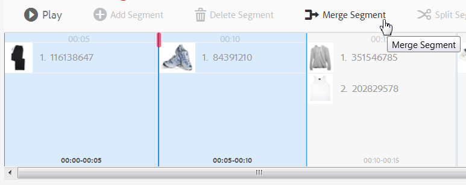

# 대화형 비디오{#interactive-videos}

비디오에서 바로 전환을 유도하는 대화형 비디오를 쉽게 만들 수 있습니다. 이 비디오는 구매 가능한 비디오라고도 합니다. 비디오에 대한 고객 참여는 비디오 플레이어와 함께 비디오에 포함된 내용을 기반으로 관련 서비스, 정보 또는 제품 썸네일을 보기 위해 스크롤하는 패널에서 수행됩니다. 고객은 썸네일을 선택하여 서비스에 직접 연결하거나, 제품을 장바구니에 추가하여 즉시 구매하거나, 웹 페이지에 연결하여 자세한 내용을 확인할 수 있습니다.

비디오가 종료되면 모든 오퍼링에 대한 시각적 요약이 표시되어 콜 투 액션을 유도합니다. 고객은 원하는 항목을 선택할 수 있는 또 다른 기회가 있습니다. 이와 같이 실행 가능하고 구체적인 경험은 고객 참여 및 전환을 증가시킵니다.

참조: [대화형 이미지](/help/assets/dynamic-media/interactive-images.md).

## 대화형 비디오 실행 중 {#interactive-video-in-action}

대화형 구매 가능한 비디오를 보려면 을 선택합니다. [라이브 데모](https://landing.adobe.com/en/na/dynamic-media/ctir-2755/live-demos.html)로 스크롤합니다. **[!UICONTROL 쇼퍼블 미디어]** 페이지에서 을 선택한 다음 쇼퍼블 비디오를 선택하여 재생을 시작합니다.

* 재생 중에 비디오에서 제품이 사용되면 동일한 제품이 오른쪽에 썸네일 이미지로 나타납니다.

* 비디오를 일시 중지하고 제품의 빠른 보기를 열려면 썸네일을 선택합니다. 예를 들어, 믹서의 360도 회전 보기를 경험하려면 비디오에서 KitchenAid 썸네일 이미지를 선택하고, 믹서 세부 정보를 보려면 확대합니다.

참조: [Dynamic Media에서 대화형 비디오 사용](https://experienceleague.adobe.com/docs/experience-manager-learn/assets/dynamic-media/dynamic-media-interactive-video-feature-video-use.html#dynamic-media)

<!-- 

There was a link here that showed the video frame of an interactive video and when the reader selected the frame the video would play https://experienceleague.adobe.com/tools/dynamic-media-demo/shoppable-video/AXIS/index.html. This must now call a new interactive video

-->

<!-- 

[A frame from an interactive, shoppable video](assets/chlimage_1-126.png) *A video frame capture from an interactive, shoppable video.*

-->

>[!NOTE]
>
>사용자가 썸네일 이미지를 선택할 때 웹 페이지를 시작하는 대화형 비디오를 만드는 경우 일부 장치에서 팝업 웹 페이지가 열리지 않도록 차단합니다. 이러한 경우 장치에서 팝업 차단 설정을 변경합니다. 예를 들어 Apple iPhone 6에서 **[!UICONTROL 설정]** > **[!UICONTROL Safari]** > **[!UICONTROL 팝업 차단]**&#x200B;을 클릭한 다음 컨트롤을 다음으로 밀기 **[!UICONTROL 끔]**. 이제 대화형 비디오를 재생하고 썸네일을 선택하면 팝업을 열겠다는 메시지가 표시됩니다. 수락하면 웹 페이지가 열립니다.

### 대화형 비디오가 만들어지는 방식 보기 {#watch-how-interactive-videos-are-created}

다음 내용에 대해 살펴보기 [대화형 비디오를 만드는 방법](https://s7d5.scene7.com/s7viewers/html5/VideoViewer.html?videoserverurl=https://s7d5.scene7.com/is/content/&amp;emailurl=https://s7d5.scene7.com/s7/emailFriend&amp;serverUrl=https://s7d5.scene7.com/is/image/&amp;config=Scene7SharedAssets/Universal_HTML5_Video_social&amp;contenturl=https://s7d5.scene7.com/skins/&amp;asset=S7tutorials/InteractiveVideo)(7분 30초).
비디오 연습이 Assets on Demand로 브랜딩되었지만, 원칙과 단계는 Adobe Experience Manager Assets의 대화형 비디오에 여전히 적용됩니다.

### Adobe 고객 성공 웨비나 {#adobe-customer-success-webinar}

다음 [Experience Manager Assets에서 대화형 비디오, 링크 공유 및 YouTube 공유 사용](https://adobecustomersuccess.adobeconnect.com/p1yxzdo4aec/) 웨비나는 대화형 비디오 및 기타 기능을 사용하여 전환 기반 이벤트를 비디오 마케팅 콘텐츠에 연결하는 방법을 설명합니다.

## 빠른 시작: 대화형 비디오 {#quick-start-interactive-videos}

다음 단계별 워크플로 설명은 Dynamic Media에서 대화형 비디오를 빠르게 시작하고 실행하는 데 도움이 되도록 설계되었습니다.

다음 항목을 찾습니다. **예** 일부 빠른 시작 작업 내 제목 여기에는 이를 기반으로 하는 간단한 자습서가 포함되어 있습니다 [다음을 수행하는 데모 웹 페이지 시작 *다음이 아님* 인터랙티브가 아직 추가됨](https://experienceleague.adobe.com/tools/dynamic-media-demo/shoppable-video/john-lewis/landing-0.html).

The **Examples** help to illustrate the steps of integrating interactive videos on your own website.

마지막 예제 섹션에서 자습서를 마치면 [완전히 통합된 대화형 비디오가 포함된 최종 데모 웹 페이지는 다음과 같이 표시됩니다](https://experienceleague.adobe.com/tools/dynamic-media-demo/shoppable-video/john-lewis/landing-3.html).

대화형 비디오 단계:

1. **(선택 사항) Quickview 변수 식별** - 기존 Quickview 구현에서 사용하는 동적 변수를 식별하여 시작합니다. 대화형 비디오를 만들 때 변수를 사용하여 제품 썸네일을 해당 제품 빠른 보기에 매핑합니다. 다음을 참조하십시오 [(선택 사항) Quickview 변수 식별](#optional-identifying-quickview-variables).
   **이 단계는 다음 내용이 모두 참인 경우에만 필요합니다.**
   * 빠른 보기 로 트리거하여 비디오에 대화형 기능을 추가하려는 경우
   * Experience Manager 구현은 다음을 수행합니다 *아님* IBM® WebSphere® Commerce, Elastic Path, SAP Hybris 또는 Intershop과 같은 모든 eCommerce 솔루션에서 제품 데이터를 Experience Manager으로 가져오려면 eCommerce 통합 프레임워크를 사용합니다.

1. **(선택 사항) 대화형 비디오 뷰어 사전 설정 만들기** - 비디오 스크러버 및 대화형 썸네일과 같이 플레이어를 구성하는 다양한 구성 요소의 모양과 동작을 사용자 지정합니다.
곧바로 사용할 수 있는 대화형 비디오 뷰어 사전 설정을 사용하려는 경우 자체 대화형 비디오 뷰어 사전 설정을 만들 필요가 없습니다 `Shoppable_Video_Light` 또는 `Shoppable_Video_Dark` 대신,
다음을 참조하십시오 [뷰어 사전 설정 만들기](/help/assets/dynamic-media/managing-viewer-presets.md#creating-a-new-viewer-preset) (선택 사항) 및 [대화형 뷰어 사전 설정 만들기에 대한 특수 고려 사항](/help/assets/dynamic-media/managing-viewer-presets.md#special-considerations-for-creating-an-interactive-viewer-preset).

1. **비디오 및 관련 이미지 에셋 업로드** - 대화형으로 만들 비디오 및 관련 이미지를 업로드합니다.
다음을 참조하십시오 [비디오 및 관련 썸네일 에셋 업로드](#uploading-a-video-and-its-associated-thumbnail-assets).

   >[!NOTE]
   >
   >MXF 비디오 포맷은 Dynamic Media의 대화형 비디오에 사용할 수 없습니다 .

1. **비디오에 인터랙티브 추가** - 비디오에 하나 이상의 시간 세그먼트를 추가합니다. 그런 다음 해당 시간 세그먼트 내에서 이미지 썸네일을 연결합니다. 각 이미지 썸네일을 하이퍼링크, 빠른 보기 또는 경험 조각과 같은 작업에 할당합니다.
대화형 콘텐츠에 상대 URL이 있는 링크, 특히 Experience Manager Sites 페이지에 대한 링크가 있는 경우에는 URL 기반 연결 방법이 불가능합니다.
대화형 비디오 자산을 게시하여 완료합니다. 게시하면 복사하고 웹 사이트 랜딩 페이지에 적용하는 포함 코드 또는 URL이 만들어집니다. 다음을 참조하십시오 [비디오에 인터랙티브 추가](#adding-interactivity-to-your-video).
다음을 참조하십시오 [자산 게시](/help/assets/dynamic-media/publishing-dynamicmedia-assets.md).

1. **Experience Manager에서 웹 사이트 또는 웹 사이트에 대화형 비디오 추가** - Experience Manager Sites나 eCommerce 또는 둘 다 사용하는 경우 대화형 비디오를 Experience Manager의 웹 페이지에 추가합니다. 대화형 미디어 구성 요소를 페이지로 드래그합니다. 다음을 참조하십시오 [페이지에 Dynamic Media 에셋 추가](/help/assets/dynamic-media/adding-dynamic-media-assets-to-pages.md).
포함 코드 또는 URL을 사용하여 대화형 비디오를 웹 사이트 경험과 통합합니다. 다음을 참조하십시오 [웹 사이트와 대화형 비디오 통합](#integrating-an-interactive-video-with-your-website).
타사 WCM(Web Content Manager)을 사용하는 경우, 새 대화형 비디오를 웹 사이트에서 사용되는 기존 빠른 보기 구현과 통합해야 합니다. 다음을 참조하십시오 [기존 빠른 보기와 대화형 비디오 통합](#integrating-an-interactive-video-with-an-existing-quickview).
   [페이지에 Dynamic Media 에셋 추가](/help/assets/dynamic-media/adding-dynamic-media-assets-to-pages.md)

## (선택 사항) Quickview 변수 식별 {#optional-identifying-quickview-variables}

>[!NOTE]
>
>이 작업은 다음이 참인 경우에만 필요합니다.
>
>* 빠른 보기 로 트리거하여 비디오에 대화형 기능을 추가하려는 경우
>* Experience Manager 구현은 다음을 수행합니다 *아님* IBM® WebSphere® Commerce, Elastic Path, SAP Hybris 또는 Intershop과 같은 모든 eCommerce 솔루션에서 제품 데이터를 Experience Manager으로 가져오려면 eCommerce 통합 프레임워크를 사용합니다. <!-- See [eCommerce concepts in Experience Manager Assets](/help/sites-administering/concepts.md).-->
>
Experience Manager 구현에서 eCommerce를 사용하는 경우 이 작업을 건너뛰고 다음 작업으로 진행할 수 있습니다.

먼저 대화형 비디오 만들기 프로세스 중에 제품 썸네일을 해당 제품 빠른 보기에 매핑할 수 있도록 기존 빠른 보기 구현에서 사용되는 동적 변수를 식별합니다.

비디오에 시간 세그먼트를 추가할 때 세그먼트에 추가하는 각 썸네일에 SKU(Stock Keeping Unit) 및 추가 변수를 할당합니다. 이러한 변수는 나중에 올바른 Quickview 제품을 표시하는 데 사용됩니다.

제품 빠른 보기를 고유하게 트리거하는 데 필요한 변수를 올바르게 식별하는 것이 중요합니다.

때로는 기존 Quickview 구현을 담당하는 IT 전문가와 상담하는 것으로 충분합니다. 시스템에서 빠른 보기를 식별하는 최소 데이터 세트를 알 수 있습니다. 그러나 프론트엔드 코드의 기존 동작을 간단하게 분석할 수 있습니다.

대부분의 빠른 보기 구현은 다음 패러다임을 사용합니다.

* User activates a user interface element on the website. 예를 들어 &quot;빠른 보기&quot; 버튼을 선택합니다.
* 필요한 경우 웹 사이트에서 백엔드에 Ajax 요청을 전송하여 Quickview 데이터 또는 컨텐츠를 로드합니다.
* 빠른 보기 데이터는 웹 페이지에서의 렌더링을 준비하기 위해 콘텐츠로 변환됩니다.
* 마지막으로 프론트엔드 코드는 이러한 콘텐츠를 화면에서 시각적으로 렌더링합니다.

따라서 접근 방법은 Quickview가 구현된 기존 웹 사이트의 다른 영역을 방문하는 것입니다. 그런 다음 빠른 보기를 트리거하고 빠른 보기 데이터 또는 콘텐츠를 로드하기 위해 웹 페이지에서 전송하는 Ajax URL을 얻습니다.

일반적으로 특수 디버깅 도구를 사용할 필요가 없습니다. 최신 웹 브라우저에는 적절한 작업을 수행하는 웹 검사기가 있습니다. 다음은 웹 검사기를 포함하는 웹 브라우저의 몇 가지 예입니다.

* Google Chrome에서 모든 발신 HTTP 요청을 보려면 다음을 누르십시오. **F12** (Windows®) 또는 **Command+Options+I** (Mac) [개발자 도구] 패널을 연 다음 **네트워크** 탭.

* Firefox에서 를 눌러 Firebug 플러그인을 활성화할 수 있습니다 **F12** (Windows®) 또는 **Command+Option+I** (Mac) 및 사용 **[!UICONTROL Net]** 또는 내장된 Inspector 도구와 Network 탭을 사용할 수 있습니다.

* Internet Explorer에서 를 눌러 디버거 도구를 활성화합니다 **F12**.

브라우저에서 네트워크 모니터링이 켜지면 페이지에서 빠른 보기를 트리거합니다.

이제 네트워크 로그에서 Quickview Ajax URL을 찾아 기록된 URL을 복사하여 향후 분석할 수 있습니다. 일반적으로 빠른 보기를 트리거하면 서버로 전송되는 요청이 많이 있습니다. 일반적으로 Quickview Ajax URL은 목록의 첫 번째 URL 중 하나입니다. 복잡한 쿼리 문자열 부분 또는 경로가 있으며 응답 MIME 유형은 다음 중 하나입니다. `text/html`, `text/xml`, 또는 `text/javascript`.

이 프로세스 중에 다양한 제품 카테고리와 유형을 사용하여 웹 사이트의 다양한 영역을 방문하는 것이 중요합니다. 그 이유는 Quickview URL에는 주어진 웹 사이트 카테고리에 대해 공통적인 부분이 있지만, 웹 사이트의 다른 영역을 방문하는 경우에만 변경되기 때문입니다.

가장 간단한 경우, 빠른 보기 URL에 있는 유일한 변수 부분은 제품 SKU입니다. 이 경우 제품 SKU 값은 Experience Manager의 대화형 비디오에서 시간 세그먼트에 썸네일을 추가하는 데 필요한 유일한 데이터 조각입니다.

그러나 복잡한 경우 빠른 보기 URL에는 제품 SKU 외에도 카테고리 ID 및 색상 코드와 같은 다양한 요소가 있습니다. 이러한 경우 그러한 모든 요소는 Experience Manager의 썸네일 데이터 정의에서 별도의 변수가 됩니다.

다음 Quickview URL 및 결과 썸네일 변수 예를 생각해 보십시오.

<table>
  <tbody>
  <tr>
    <td><p>쿼리 문자열에 있는 단일 SKU.</p> </td>
    <td><p>기록된 빠른 보기 URL에는 다음이 포함됩니다.</p>
    <ul>
      <li><p><code>https://server/json?productId=866558&amp;source=100</code></p> </li>
      <li><p><code>https://server/json?productId=1196184&amp;source=100</code></p> </li>
      <li><p><code>https://server/json?productId=1081492&amp;source=100</code></p> </li>
      <li><p><code>https://server/json?productId=1898294&amp;source=100</code></p> </li>
    </ul> <p>URL에서 유일한 변수 부분은 <code>productId=</code> 쿼리 문자열 매개 변수이며 SKU 값입니다. 따라서 썸네일은 다음과 같은 값으로 채워진 SKU 필드만 필요합니다. <strong><code>866558</code></strong>, <strong><code>1196184</code></strong>, <strong><code>1081492</code></strong>, <strong><code>1898294</code></strong>.</p> </td>
  </tr>
  <tr>
    <td><p>URL 경로에 있는 단일 SKU.</p> </td>
    <td><p>기록된 빠른 보기 URL에는 다음이 포함됩니다.</p>
    <ul>
      <li><p><code>https://server/product/6422350843</code></p> </li>
      <li><p><code>https://server/product/1607745002</code></p> </li>
      <li><p><code>https://server/product/0086724882</code></p> </li>
    </ul> <p>변수 부분은 경로의 마지막 부분에 있으며, Experience Manager 썸네일의 SKU 값이 됩니다. <strong><code>6422350843</code></strong>, <strong><code>1607745002</code></strong>, <strong><code>0086724882</code></strong>.</p> </td>
  </tr>
  <tr>
    <td><p>쿼리 문자열의 SKU 및 카테고리 ID.</p> </td>
    <td><p>기록된 빠른 보기 URL에는 다음이 포함됩니다.</p>
    <ul>
      <li><p><code>https://server/quickView/product/?category=1100004&amp;prodId=305466</code></p> </li>
      <li><p><code>https://server/quickView/product/?category=1100004&amp;prodId=310181</code></p> </li>
      <li><p><code>https://server/quickView/product/?category=1740148&amp;prodId=308706</code></p> </li>
    </ul> <p>이 경우 URL에는 두 가지 다양한 부분이 있습니다. SKU는에 저장됩니다. <code>prodId</code> 매개 변수와 범주 ID는에 저장됩니다. <code>category=</code> 매개 변수.</p> <p>따라서 썸네일 정의는 쌍입니다. 즉, SKU 값과 라는 추가 변수입니다. <code>categoryId</code>. 결과 쌍은 다음과 같습니다.</p>
    <ul>
      <li>SKU: <code>305466</code> 및 <code>categoryId</code> 은(는) <code>1100004</code></li>
      <li>SKU: <code>310181</code> 및 <code>categoryId</code> 은(는) <code>1100004</code></li>
      <li>SKU: <code>308706</code> 및 <code>categoryId</code> 은(는) <code>1740148</code></li>
    </ul> <p> </p> </td>
  </tr>
  </tbody>
</table>

**예**

위의 접근 방식을 예제 웹 사이트에 적용하면 여러 제품 썸네일이 있는 웹 페이지가 있고 각 페이지에는 &quot;자세히 보기&quot; 버튼이 있습니다.

[https://experienceleague.adobe.com/tools/dynamic-media-demo/shoppable-video/john-lewis/landing-0.html](https://experienceleague.adobe.com/tools/dynamic-media-demo/shoppable-video/john-lewis/landing-0.html)

페이지에서 사용할 수 있는 모든 제품 빠른 보기를 활성화하면 백엔드에 대한 다음 빠른 보기 요청 목록을 가져옵니다.

* datafeed/candles-233396346.json
* datafeed/candles-233978050.json
* datafeed/candles-234024346.json
* datafeed/candles-234024356.json
* datafeed/candles-234024359.json
* datafeed/cushions-233939848.json
* datafeed/cushions-234019477.json
* datafeed/cushions-234019483.json
* datafeed/furniture-231747479.json
* datafeed/furniture-232625621.json
* datafeed/furniture-232625626.json
* datafeed/furniture-233939810.json
* datafeed/furniture-233939825.json
* datafeed/furniture-233939828.json
* datafeed/furniture-233939853.json
* datafeed/furniture-233940334.json
* datafeed/glassware-000064007.json
* datafeed/glassware-230722193.json
* datafeed/glassware-233916550.json
* datafeed/glassware-233916597.json

서버 호출을 살펴보면 제품별 정보는 요청 경로에만 있습니다. 또한 쿼리 문자열이 전혀 사용되지 않으며 두 가지 서로 다른 유형의 데이터가 포함됩니다.

* 첫 번째 유형은 양초, 방석, 가구, 유리제품 등이다. 이를 &quot;제품 범주&quot;라고 할 수 있습니다.
* 두 번째 유형은 제품 코드(예: 233916597)입니다. &quot;제품 SKU&quot;라고 가정할 수 있습니다.

이 정보가 주어지면 전체 Quickview URL의 패턴은 다음과 같습니다.

`/datafeed/$categoryId$-$SKU$.json`

이러한 분석을 기반으로 썸네일에 다음 두 변수를 사용할 수 있다고 결론을 내립니다. `categoryId` 및 `SKU`.

이제 비디오와 관련 썸네일 자산을 업로드할 준비가 되었습니다.

## (선택 사항) 대화형 비디오 뷰어 사전 설정 만들기 {#optional-creating-an-interactive-video-viewer-preset}

기본 제공 대화형 비디오 뷰어 사전 설정 유형 중 하나를 사용하려면 이 작업을 건너뛰고 다음 작업을 계속 진행할 수 있습니다 `Shoppable_Video_dark` 또는 `Shoppable_Video_light`.

작성 환경에서 축소판을 선택하면 빠른 보기 대화 상자의 미리보기가 나타납니다.


원할 경우 사용자 지정 대화형 비디오 뷰어 사전 설정을 만들 수 있습니다. 특히 비디오 플레이어의 스타일, 대화형 썸네일 및 비디오 끝에 표시되는 썸네일 격자 보기를 결정할 수 있습니다.

대화형 비디오 뷰어 사전 설정은 추가한 비디오와 모든 타임라인 세그먼트를 올바르게 렌더링합니다. 또한 미리보기 모드에서 제품 썸네일을 선택할 때 기본 빠른 보기 예를 사용하므로 게시하기 전에 상호 작용을 테스트할 수 있습니다.

After you save the viewer preset, its state is automatically set to **On **in the Viewer Presets page. This state means that it is visible in the Dynamic Media component and whenever you preview a video with it. Be sure you also manually publish your new viewer preset.

다음을 참조하십시오 [뷰어 사전 설정 만들기](/help/assets/dynamic-media/managing-viewer-presets.md#creating-a-new-viewer-preset) 자신만의 대화형 비디오 뷰어 사전 설정을 만들 수 있습니다.

## 비디오 및 관련 썸네일 에셋 업로드 {#uploading-a-video-and-its-associated-thumbnail-assets}

비디오 및 썸네일 에셋을 이미 업로드한 경우 진행하십시오. [비디오에 인터랙티브 추가](#adding-interactivity-to-your-video).

>[!NOTE]
>
MXF 비디오 포맷은 Dynamic Media의 대화형 비디오에 사용할 수 없습니다 .

잘못된 비디오나 이미지를 업로드했거나 업로드한 비디오나 이미지를 더 이상 필요하지 않게 삭제하려면 다음을 참조하십시오. [자산 삭제](/help/assets/manage-digital-assets.md#delete-assets).

비디오와 관련 썸네일 에셋을 업로드하려면:

1. 원하는 폴더에 비디오 및 관련 썸네일 에셋을 업로드합니다.

   다음을 참조하십시오 [에셋 업로드](/help/assets/manage-digital-assets.md).
다음을 참조하십시오 [FTP 작업 일정을 사용하여 자산 업로드](/help/assets/manage-digital-assets.md).

   이제 상호 작용을 비디오에 추가합니다.

## 비디오에 인터랙티브 추가 {#adding-interactivity-to-your-video}

[대화형 비디오 만들기] 페이지에서 바로 사용 가능한 시각적 편집기를 사용하여 비디오에 타임라인 세그먼트를 추가합니다.

타임라인 세그먼트를 추가한 후에는 각 세그먼트 내에 썸네일 이미지를 추가합니다. 추가하는 각 썸네일에 대해 작업을 적용합니다. 예를 들어, 썸네일에 빠른 보기를 적용하거나, 하이퍼링크 또는 경험 조각을 할당할 수 있습니다.

다음을 참조하십시오 [경험 조각](/help/sites-cloud/authoring/fundamentals/experience-fragments.md).

>[!NOTE]
>
뷰어를 경험 조각에 포함할 때 대화형 비디오의 소셜 미디어 공유 도구가 지원되지 않습니다. 대신 소셜 미디어 공유 도구가 없는 뷰어 사전 설정을 사용하거나 만들 수 있습니다. 이러한 뷰어 사전 설정을 사용하면 경험 조각에 성공적으로 포함할 수 있습니다.

>[!NOTE]
>
대화형 콘텐츠에 상대 URL이 있는 링크, 특히 Experience Manager Sites 페이지에 대한 링크가 있는 경우에는 URL 기반 연결 방법이 불가능합니다.

페이지의 오른쪽 상단 모서리 근처에 있는 실행 취소 및 재실행 옵션은 현재 생성/편집 세션 중에 지원됩니다.

대화형 비디오를 저장하면 비디오가 즉시 미리보기에 열립니다. 여기에서 대화형 비디오 뷰어 사전 설정을 선택하고 비디오를 재생하여 고객에게 표시되는 방식을 대략적으로 확인할 수 있습니다.

**비디오에 대화형 기능을 추가하려면:**

1. 에셋 보기에서 업로드하고 대화형으로 만들려는 비디오로 이동합니다.
1. 다음 중 하나를 수행하십시오.

   * 이미지를 마우스로 가리킨 다음, **[!UICONTROL 선택]** (확인 표시 아이콘) 도구 모음에서 를 선택합니다. **[!UICONTROL 편집]**.

   * 이미지를 마우스로 가리킨 다음, **[!UICONTROL 추가 작업]** (세 점 아이콘) **[!UICONTROL > 편집]**.

   * 세부 사항 보기 페이지에서 열려면 이미지를 선택합니다. 도구 모음에서 를 선택합니다. **[!UICONTROL 편집]**.

1. [대화형 비디오 만들기] 페이지에서 다음 중 하나를 수행합니다.

   * 비디오 재생을 시작하려면 **[!UICONTROL 재생]** 단추를 클릭합니다. 강조하려는 특정 제품, 서비스 또는 세부 정보가 표시되면 다음을 선택합니다. **[!UICONTROL 세그먼트 추가]** 을 클릭합니다. 비디오 끝에 도달할 때까지 반복합니다.

     추가하는 각 세그먼트에 대해 하나 이상의 썸네일 이미지를 할당할 수 있습니다. 그런 다음 이러한 썸네일을 고객이 구매할 수 있는 제품 빠른 보기 페이지 또는 웹 페이지에 연결하여 자세한 내용을 확인할 수 있습니다.

   * 비디오 재생을 시작하려면 **[!UICONTROL 재생]** 단추를 클릭합니다. 강조하려는 특정 제품, 서비스 또는 세부 정보가 표시되면 다음을 선택합니다. **[!UICONTROL 일시 중지]**. 선택 **[!UICONTROL 세그먼트 추가]**.

     비디오 끝에 도달할 때까지 세그먼트를 추가하려는 타임라인의 지점에서 비디오를 계속 재생하고 일시 중지합니다.

1. (선택 사항) **[!UICONTROL 타임라인 크기 슬라이더]** 확대하려면 왼쪽으로, 축소하려면 오른쪽으로 이동합니다. 이러한 작업을 통해 추가한 세그먼트에 대해 표시되는 세부 사항의 양을 제어할 수 있습니다.

   

   비디오 길이에 따라 세그먼트 지속 시간 의 기본값은 다음 값으로 설정됩니다.

   <table>
      <tbody>
        <tr>
        <td><strong>비디오 길이가...</strong></td>
        <td><strong>세그먼트 기간 설정의 기본값은...입니다.</strong></td>
        </tr>
        <tr>
        <td>3분 이상</td>
        <td>60초</td>
        </tr>
        <tr>
        <td>2-3분</td>
        <td>30초</td>
        </tr>
        <tr>
        <td>1-2분</td>
        <td>20초<br /> </td>
        </tr>
        <tr>
        <td>30-60초</td>
        <td>10초</td>
        </tr>
        <tr>
        <td>30초 이하</td>
        <td>5초</td>
        </tr>
      </tbody>
    </table>

   비디오 타임라인에서는 사용할 수 있는 만큼의 화면 공간을 사용합니다. 따라서 브라우저 크기를 조정하면 추가한 세그먼트의 너비가 올바르게 유지됩니다.

   예를 들어 다음 세 스크린샷에서 동일한 비디오를 사용하고 있습니다. 각 세그먼트의 너비는 타임라인 배율 설정에 따라 변경됩니다.

   

   스크린샷 A

   위의 스크린샷 A는 29초 제품 비디오의 기본 보기를 보여 줍니다. 타임라인 배율은 기본값 5초로 설정됩니다.

   

   스크린샷 B

   위의 스크린샷 B에서 타임라인 크기 조절 슬라이더를 기본값 5초에서 3초로 드래그했습니다. 이제 개별 타임라인 크기 조절 타임스탬프가 모두 3초 간격으로 설정됩니다.

   

   스크린샷 C

   위의 스크린샷 C에서는 타임라인 크기 조정 설정이 8초로 이동되었습니다. 제품 썸네일이 포함된 세그먼트가 어떻게 축소되었는지 확인합니다. 이러한 방식으로 축소하는 것은 긴 비디오가 있고 일반적으로 페이지 너비에 맞는 더 많은 세그먼트에 대한 개요를 볼 수 있기를 원하는 경우 유용합니다.

1. (선택 사항) 다음 중 하나를 수행합니다.

   * 세그먼트의 시작 시간과 종료 시간을 조정하려면

     세그먼트를 선택한 다음 선행 또는 후행 파란색 타원을 드래그하여 각각 시작 또는 종료 시간을 조정합니다. 표시된 비디오 프레임은 조정에 따라 비디오에서 적절한 시간으로 이동합니다. 타임라인 세그먼트의 이동은 타임라인에서 인접한 세그먼트를 기준으로 제한됩니다. 최소 허용 세그먼트 시간은 1초입니다.

     다음 탐색 단축키를 사용하여 비디오 세그먼트를 빠르게 확인하고 세부 조정할 수 있습니다.

      * 해당 세그먼트의 시작 부분까지 직접 비디오를 찾아보려면 앞에 있는 파란색 타원을 선택합니다.
      * 해당 세그먼트의 끝까지 직접 비디오를 찾아보려면 후행 파란색 타원을 선택합니다.
      * 비디오 재생을 해당 세그먼트의 시작으로 되돌리려면 전체 세그먼트를 선택합니다.

   

   타임라인 세그먼트 끝 위치 변경

   * 세그먼트를 삭제하려면

     타임라인에 있는 마지막 세그먼트를 선택한 다음 도구 모음에서 를 선택합니다. **[!UICONTROL 세그먼트 삭제]**. 둘 이상의 세그먼트를 선택한 경우 세그먼트 삭제 기능이 비활성화됩니다.

     마지막 세그먼트만 삭제할 수 있습니다. 예를 들어 타임라인에서 모든 세그먼트를 삭제하려면 항상 마지막 세그먼트를 선택한 다음 를 선택해야 합니다 **[!UICONTROL 세그먼트 삭제]**.

1. 하나 이상의 썸네일 이미지를 연결할 시간 세그먼트를 선택합니다.
1. 비디오 오른쪽에서 **[!UICONTROL 콘텐츠]** 탭.
1. 콘텐츠 탭에서 을(를) 선택합니다. **[!UICONTROL 에셋 선택]**&#x200B;그런 다음 비디오에 사용할 모든 이미지 에셋을 찾아 선택합니다. 선택한 에셋이 콘텐츠 탭의 에셋 선택기 패널에 추가됩니다.

1. 컨텐츠 탭 아래의 자산 선택기에서 다음 중 하나를 수행합니다.

   <table>
      <tbody>
        <tr>
        <td>선택한 타임라인 세그먼트에 축소판을 연결하려면</td>
        <td><p>오른쪽의 에셋 선택기 패널에서 이미지를 선택합니다.</p> <p>타임라인 세그먼트에 원하는 만큼 썸네일을 추가할 수 있습니다. 선택하는 각 이미지에 대해 자산 선택기의 이미지 위에 확인 표시가 나타납니다.</p> </td>
        </tr>
        <tr>
        <td>선택한 타임라인 세그먼트에서 축소판을 제거하려면</td>
        <td><p>다음 중 하나를 수행합니다.</p>
          <ul>
          <li>에셋 선택기 패널에서 확인 표시가 있는 이미지를 선택하여 선택을 취소합니다. 이미지 자산이 타임라인 세그먼트에서 제거됩니다.<br /> </li>
          <li>선택한 타임라인 세그먼트에서 이미지를 선택한 다음 도구 모음에서 를 선택합니다. <strong>제품 삭제</strong>.</li>
          </ul> </td>
        </tr>
      </tbody>
    </table>

   

   에셋 선택기 패널에서 이미지를 선택하면 선택한 타임라인 세그먼트에 이미지가 추가됩니다.

1. 타임라인 세그먼트 중 하나에서 단일 썸네일 이미지를 선택한 다음 **[!UICONTROL 작업]** 탭.
1. 다음 중 하나를 수행합니다.
   <table> 
    <tbody> 
      <tr> 
      <td>선택한 썸네일 이미지를 빠른 보기에 연결하려면</td> 
      <td><p>Action Type에서 <strong>빠른 보기</strong>.</p> <p>Experience Manager Sites 및 Ecommerce 고객의 경우:</p> 
       <ul> 
       <li>SKU 값 텍스트 필드는 선택한 제품의 SKU(Stock Keeping Unit)로 미리 채워집니다. SKU는 제공하는 각 고유 제품 또는 서비스에 대한 고유 식별자입니다. 이 필드는 이미지가 Experience Manager Commerce의 제품과 연결될 때 자동으로 채워집니다.</li> 
       <li>미리 채워진 SKU가 올바르지 않은 경우 제품 선택기 아이콘(돋보기)을 선택하여 제품 선택 페이지를 엽니다. 사용할 제품을 선택한 다음 페이지의 오른쪽 상단에 있는 확인 표시를 선택합니다. 대화형 비디오 편집기로 돌아갑니다.</li> 
       </ul> <p> 다음과 같은 경우 <em>아님</em> Experience Manager Sites 또는 Ecommerce 고객</p> 
       <ul> 
       <li>다음을 참조하십시오 <a href="/help/assets/dynamic-media/carousel-banners.md#identifying-hotspot-and-image-map-variables">핫스팟 변수 식별</a>. 이러한 변수를 정의해야 합니다.</li> 
       <li>기본적으로 이 SKU 필드는 이미지 에셋의 파일 이름을 확장명 없이 사용합니다. SKU를 기반으로 하는 파일에 대한 표준 명명 규칙을 따르는 경우 일반적으로 이 필드는 추가 편집이 필요하지 않습니다. </li> 
       <li>그렇지 않으면 기본값을 편집하고 올바른 SKU 값을 입력하십시오. SKU 값 텍스트 필드에 제품의 SKU(Stock Keeping Unit)를 입력합니다. 이 SKU는 제공하는 각 고유 제품이나 서비스에 대한 고유 식별자입니다. 입력한 SKU 값은 빠른 보기 템플릿의 변수 부분을 자동으로 입력하므로 선택한 이미지를 특정 SKU의 빠른 보기와 연결해야 한다는 것을 시스템에서 알 수 있습니다.</li> 
       </ul> <p>(선택 사항) Quickview 내에 제품을 추가로 식별하는 데 사용해야 하는 다른 변수가 있는 경우 다음을 선택합니다. <strong>일반 변수 추가</strong>. 텍스트 필드에 추가 변수를 지정합니다. 예를 들어, <code>category=Womens</code> 는 추가된 변수입니다.</p> <p> </p> </td> 
      </tr> 
      <tr> 
      <td>선택한 썸네일 이미지를 하이퍼링크와 연결하려면</td> 
      <td><p>Action Type에서 <strong>하이퍼링크</strong>을 클릭하고 다음 중 하나를 수행합니다.</p> 
       <ul> 
       <li>Experience Manager Sites 고객인 경우 사이트 선택기 아이콘(폴더)을 선택하여 웹 페이지로 이동합니다. 대화형 콘텐츠에 상대 URL이 있는 링크, 특히 Experience Manager Sites 페이지에 대한 링크가 있는 경우에는 URL 기반 연결 방법이 불가능합니다.</li> 
       <li>독립형 Dynamic Media 고객인 경우 HREF 텍스트 필드에 연결된 웹 페이지에 대한 전체 URL 경로를 지정합니다.</li> 
       </ul> <p>링크를 새 브라우저 탭에서 열지 또는 현재 탭에서 열지를 지정해야 합니다.</p> </td> 
      </tr> 
      <tr> 
      <td>선택한 썸네일 이미지를 경험 조각과 연결하려면</td> 
      <td><p>Action Type에서 <strong>경험 조각</strong>을 클릭한 후 다음을 수행합니다.<p> 
       <ul> 
       <li>Experience Manager Sites 고객인 경우 검색 아이콘(돋보기)을 선택하여 경험 조각 페이지를 엽니다. 사용할 경험 조각을 선택한 다음 를 선택합니다 <strong>이전 페이지의 [액션] 패널로 돌아가려면 </strong>페이지의 오른쪽 상단 모서리에서 을 참조하십시오.<br /> 다음을 참조하십시오 <a href="/help/sites-cloud/authoring/fundamentals/experience-fragments.md">경험 조각</a>.</li> 
      </ul> 
       <ul> 
       <li>경험 조각이 비디오에 나타나는 대로 경험 조각의 너비와 높이를 지정합니다.</li>
       </ul><strong>참고</strong>: 뷰어를 경험 조각에 포함할 때 대화형 비디오의 소셜 미디어 공유 도구가 지원되지 않습니다. 대신 소셜 미디어 공유 도구가 없는 뷰어 사전 설정을 사용하거나 만들 수 있습니다. 이러한 뷰어 사전 설정을 사용하면 경험 조각에 성공적으로 포함할 수 있습니다.</p></tr>&lt; 
      <tr> 
      <td>이미 썸네일 이미지에 할당된 작업을 편집하려면</td> 
      <td>타임라인 세그먼트 내에서 텍스트 레이블 오른쪽에 체인 링크가 있는 썸네일 이미지를 선택합니다. 체인 링크는 작업이 할당되었음을 나타냅니다. 변경하려면 <strong>작업</strong> 탭.</td> 
      </tr> 
      <tr> 
      <td>축소판 이미지의 텍스트 레이블을 변경하려면</td> 
      <td><p>기본적으로 텍스트 레이블은 축소판 이미지의 <code>Title</code> 메타데이터 필드. If <code>Title</code> 가 없으며 썸네일 이미지의 파일 이름이 확장자 없이 대신 사용됩니다.</p> <p>축소판 이미지의 텍스트 레이블을 변경하려면 <strong>작업 </strong>표시되는 이미지 에셋 바로 아래에 있는 탭에서 원하는 텍스트를 입력합니다. 아래 이미지를 참조하십시오.</p> <p>새 텍스트 레이블은 비디오 플레이어 자체와 타임라인 세그먼트에 표시되는 썸네일 텍스트에서만 사용됩니다. 레이블 변경은 썸네일 이미지의 제목 메타데이터 필드나 파일 이름에 영향을 주지 않습니다.</p> </td> 
      </tr> 
      <tr> 
      <td>변경 사항을 되돌리려면</td> 
      <td>페이지의 오른쪽 상단 모서리 근처에서 을 선택합니다. <strong>실행 취소</strong> 또는 <strong>다시 실행</strong>.</td> 
      </tr> 
    </tbody> 
   </table>

   

   썸네일 이미지에 새 텍스트 레이블이 추가됩니다.

1. 다음 중 하나를 수행하십시오.

   * 6~11단계를 반복하여 비디오의 타임라인 세그먼트에 썸네일 이미지를 더 추가합니다.
   * 선택적 13단계로 진행합니다.

1. (선택 사항) 다음 중 하나를 수행합니다.

   * **[!UICONTROL 세그먼트 병합]** - 인접한 두 세그먼트(제품 썸네일이 할당되거나 할당되지 않은 세그먼트)를 하나의 세그먼트로 결합할 수 있습니다.

     타임라인에서 하나로 병합할 둘 이상의 연속 세그먼트를 선택합니다. 아래 이미지에서 선택한 두 세그먼트에 파란색 타원형 드래그 핸들이 없습니다.

     선택 **[!UICONTROL 세그먼트 병합]** 을 클릭합니다.

   

   선택한 5초 세그먼트 2개를 10초 세그먼트 1개로 병합합니다.

   * **[!UICONTROL 세그먼트 분할]** - 단일 세그먼트를 2개의 동일한 시간 세그먼트로 나눌 수 있습니다. 이미 세그먼트에 지정된 제품 썸네일이 있는 경우 썸네일은 왼쪽 세그먼트에 결합됩니다.

     타임라인에서 반으로 나눌 세그먼트를 선택한 다음 을 선택합니다 **[!UICONTROL 세그먼트 분할]** 을 클릭합니다.

     두 개 이상의 세그먼트를 선택하면 **[!UICONTROL 세그먼트 분할]** 기능.

   

   선택한 10초 세그먼트를 각각 5초의 두 세그먼트로 분할합니다.

1. 의 오른쪽 상단 모서리 근처 **[!UICONTROL 대화형 비디오 만들기]** 페이지에 비디오와 함께 사용되는 현재 선택한 뷰어 사전 설정 이름이 표시됩니다. 다른 뷰어 사전 설정을 선택하려면 이름을 선택합니다.

   예를 들어 `Shoppable_Video_light` 뷰어 사전 설정을 사용하면 비디오 옆에 흰색 표시 영역이 있는 비디오를 재생할 수 있습니다. 표시 영역은 재생 중에 선택 가능한 썸네일 이미지가 표시되는 위치입니다. 다음 `Shoppable_Video_dark` 뷰어 사전 설정을 사용하면 비디오 옆에 검정색 표시 영역이 있는 비디오를 재생할 수 있습니다.

   자신만의 대화형 비디오 뷰어 사전 설정을 만든 경우, 선택할 수 있는 사전 설정 목록에 해당 사전 설정이 표시됩니다.

   완료되면 다음을 선택합니다. **[!UICONTROL 저장]**.

   >[!NOTE]
   >
   When you save your interactive video, an associated `.vtt` file is automatically saved with it. 다음 `.vtt` 파일이 `_VTT` 루트에 있는 폴더 **[!UICONTROL 에셋]**. The file and folder is necessary for your interactive video to play correctly on your website. As such, do not move, edit, or delete the `_VTT` folder or its contents.

1. 대화형 비디오를 게시합니다. 게시하면 포함 코드 또는 URL이 만들어지므로 이를 복사하여 웹 사이트 경험에 붙여넣을 수 있습니다.

   빠른 보기에서 인터랙티브를 추가한 경우에는 포함 코드만 사용하고, 하이퍼링크로 연결된 웹 페이지에서 인터랙티브를 추가한 경우에는 게시된 URL도 사용할 수 있습니다. 그러나 대화형 콘텐츠에 상대 URL이 있는 링크, 특히 Experience Manager Sites 페이지에 대한 링크가 있는 경우에는 URL 기반 연결 방법이 불가능합니다.

   다음을 참조하십시오 [자산 게시](publishing-dynamicmedia-assets.md).

   >[!NOTE]
   >
   빠른 보기에서 구매 가능한 비디오를 게시하려면 상거래 영역에서 비디오의 각 관련 이미지 에셋도 별도로 게시해야 합니다.

   타임라인 세그먼트를 추가하고 대화형 비디오를 게시하면 기존 웹 사이트 랜딩 페이지에 추가할 수 있습니다. 다음을 참조하십시오 [웹 사이트와 대화형 비디오 통합](#integrating-an-interactive-video-with-your-website).

## 대화형 비디오 자산 게시 {#publishing-interactive-video-assets}

다음을 참조하십시오 [자산 게시](/help/assets/dynamic-media/publishing-dynamicmedia-assets.md) 대화형 비디오 자산을 게시하는 방법에 대한 자세한 내용을 참조하십시오.

## 웹 사이트와 대화형 비디오 통합 {#integrating-an-interactive-video-with-your-website}

비디오를 업로드하고, 타임라인 세그먼트를 추가하고, 대화형 비디오를 게시하면 이제 기존 웹 사이트에 추가할 준비가 된 것입니다.

Experience Manager Sites 고객의 경우 대화형 미디어 구성 요소를 페이지로 드래그하여 대화형 비디오를 추가할 수 있습니다. 다음을 참조하십시오 [페이지에 Dynamic Media 에셋 추가](/help/assets/dynamic-media/adding-dynamic-media-assets-to-pages.md).

독립형 Experience Manager Assets 고객인 경우 이 섹션에 설명된 대로 대화형 비디오를 웹 사이트에 수동으로 추가할 수 있습니다.

1. 게시된 대화형 비디오의 포함 코드 또는 URL을 복사합니다.
다음을 참조하십시오 [웹 페이지에 비디오 또는 이미지 뷰어 포함](/help/assets/dynamic-media/embed-code.md).
빠른 보기에서 인터랙티브를 추가한 경우에는 포함 코드만 사용하고, 하이퍼링크로 연결된 웹 페이지에서 인터랙티브를 추가한 경우에는 게시된 URL도 사용할 수 있습니다. 그러나 대화형 콘텐츠에 상대 URL이 있는 링크, 특히 Experience Manager Sites 페이지에 대한 링크가 있는 경우에는 URL 기반 연결 방법이 불가능합니다.

1. 대상의 웹 페이지 코드에서 정적 비디오의 위치를 식별합니다.
1. 정적 비디오를 제거하고 있는 대로 코드를 Experience Manager Assets에서 복사한 포함 코드 또는 URL로 바꿉니다.
복사된 포함 코드는 응답형 환경에 대해 설정되므로, 정적 비디오가 이전에 사용했던 영역에 자동으로 맞습니다.

>[!NOTE]
>
이 시점에서 하이퍼링크가 설정된 웹 페이지만 사용하여 인터랙티브를 추가했다면 완료됩니다.
>
그러나 빠른 보기를 트리거하기 위해 대화형 활동을 추가한 경우 대화형 비디오 옆에 있는 썸네일은 표시용으로만 사용되며 기존 빠른 보기와 아직 통합되지 않았습니다. 이 경우 대화형 비디오를 웹 사이트의 기존 빠른 보기와 통합해야 합니다.

**예**

데모 웹 사이트 사용 예:

[https://experienceleague.adobe.com/tools/dynamic-media-demo/shoppable-video/john-lewis/landing-0.html](https://experienceleague.adobe.com/tools/dynamic-media-demo/shoppable-video/john-lewis/landing-0.html)

비디오 포함 코드는 표준입니다.

```js {.line-numbers}
<style type="text/css">
 #s7video_div.s7videoviewer{
   width:100%;
   height:auto;
 }
</style>

<script type="text/javascript" src="https://demos-pub.assetsadobe.com/etc/dam/viewers/s7viewers/html5/js/VideoViewer.js"></script>
<div id="s7video_div"></div>
<script type="text/javascript">
 var s7videoviewer = new s7viewers.VideoViewer({
  "containerId" : "s7video_div",
  "params" : {
   "serverurl" : "https://adobedemo62-h.assetsadobe.com/is/image",
   "contenturl" : "https://demos-pub.assetsadobe.com/",
   "config" : "/etc/dam/presets/viewer/Video",
   "config2": "/etc/dam/presets/analytics",
   "videoserverurl": "https://gateway-na.assetsadobe.com/DMGateway/public/demoCo",
   "posterimage": "/content/dam/marketing/shoppable-video/john-lewis/shoppable-video-john-lewis-2014.mp4",
   "asset" : "/content/dam/marketing/shoppable-video/john-lewis/shoppable-video-john-lewis-2014.mp4" }
 }).init();
</script>
```

통합은 Experience Manager에서 비디오 포함 코드를 제거하고 대화형 비디오 포함 코드로 바꾸는 것만큼 간단합니다. 다음 URL에서 결과를 볼 수 있습니다. 페이지에 있는 대화형 비디오를 표시하지만 기존 빠른 보기와 아직 통합되지 않았습니다.

[https://experienceleague.adobe.com/tools/dynamic-media-demo/shoppable-video/john-lewis/landing-1.html](https://experienceleague.adobe.com/tools/dynamic-media-demo/shoppable-video/john-lewis/landing-1.html)

## 기존 빠른 보기와 대화형 비디오 통합 {#integrating-an-interactive-video-with-an-existing-quickview}

>[!NOTE]
>
이 작업은 독립형 Experience Manager Assets 고객인 경우에만 적용됩니다.

이 프로세스의 마지막 단계는 대화형 비디오를 웹 사이트에서 사용되는 기존 Quickview 구현과 통합하는 것입니다. 모든 경우에 작동하는 통합 솔루션은 없습니다. 모든 Quickview 구현은 고유합니다. 따라서 프론트엔드 IT 담당자의 지원을 포함하는 구체적인 접근 방식이 필요합니다.

기존 빠른 보기 구현은 일반적으로 웹 페이지에서 다음 순서로 발생하는 상호 관련된 작업 체인을 나타냅니다.

1. 사용자가 웹 사이트의 사용자 인터페이스에서 요소를 트리거합니다.
1. 프론트엔드 코드는 1단계에서 트리거된 사용자 인터페이스 요소를 기반으로 Quickview URL을 가져옵니다.
1. 프론트엔드 코드는 2단계에서 얻은 URL을 사용하여 AJAX 요청을 보냅니다.
1. 백엔드 로직은 해당 Quickview 데이터 또는 컨텐츠를 프론트엔드 코드로 다시 반환합니다.
1. 프론트엔드 코드는 Quickview 데이터 또는 콘텐츠를 로드합니다.
1. 선택적으로, 프론트엔드 코드는 로드된 Quickview 데이터를 HTML 표시로 변환합니다.
1. 프론트엔드 코드는 모달 대화 상자 또는 패널을 표시하고 사용자의 화면에서 HTML 콘텐츠를 렌더링합니다.

이러한 호출은 임의의 단계에서 웹 페이지 논리에 의해 호출될 수 있는 독립적인 공개 API 호출을 나타내지 않습니다. 대신 모든 다음 단계가 이전 단계의 마지막 단계(콜백)에서 숨겨지는 체인 호출입니다.

대화형 비디오가 1단계, 부분적으로 2단계를 대체하는 것과 동시에, 사용자가 대화형 비디오 내의 썸네일을 선택할 때, 그러한 사용자 상호작용은 뷰어에 의해 처리된다. 뷰어는 이전에 Experience Manager에 추가된 모든 썸네일 데이터를 포함하는 웹 페이지에 이벤트를 반환합니다.

이러한 이벤트 처리기에서 프론트엔드 코드는 다음을 수행합니다.

* 대화형 비디오에서 내보내는 이벤트를 수신합니다.
* 썸네일 데이터를 기반으로 빠른 보기 URL을 구성합니다.
* 백엔드에서 Quickview를 로드하고 화면에 렌더링하여 표시하는 프로세스를 트리거합니다.

또한 대화형 비디오 뷰어는 전체 화면 작업 모드를 지원합니다. 사용자가 전체 화면을 종료하지 않고 썸네일을 선택하여 빠른 보기를 트리거합니다. 이 기능을 사용하려면 빠른 보기 모달 대화 상자가 뷰어의 컨테이너에 연결되도록 프론트엔드 코드를 변경합니다. 뷰어가 전체 화면 모드에 있는 경우 사용할 수 없는 문서 BODY 또는 기타 웹 페이지 요소를 추가하지 마십시오. 이 작업을 수행하는 코드는 뷰어가 페이지에 로드된 후 전송되는 한 개 이상의 뷰어 콜백을 수신합니다.

Experience Manager에서 반환한 포함 코드에 이미 사용할 준비가 된 이벤트 처리기가 있습니다. 이것은 다음 강조 표시된 코드 조각에 표시된 대로 주석으로 처리됩니다.

```js {.line-numbers}
<style type="text/css">
 #s7interactivevideo_div.s7interactivevideoviewer{
   width:100%;
   height:auto;
 }
</style>
<script type="text/javascript" src="https://demos-pub.assetsadobe.com/etc/dam/viewers/s7viewers/html5/js/InteractiveVideoViewer.js"></script>

<div id="s7interactivevideo_div"></div>
<script type="text/javascript">
 var s7interactivevideoviewer = new s7viewers.InteractiveVideoViewer({
  "containerId" : "s7interactivevideo_div",
  "params" : {
   "serverurl" : "https://adobedemo62-h.assetsadobe.com/is/image",
   "contenturl" : "https://demos-pub.assetsadobe.com/",
   "config" : "/etc/dam/presets/viewer/Shoppable_Video_light",
   "config2": "/etc/dam/presets/analytics",
   "videoserverurl": "https://gateway-na.assetsadobe.com/DMGateway/public/demoCo",
   "interactivedata": "content/dam/_VTT/marketing/shoppable-video/john-lewis/shoppable-video-john-lewis-2014.mp4.svideo.vtt",
   "VideoPlayer.contenturl": "https://adobedemo62-h.assetsadobe.com/is/content",
   "asset" : "/content/dam/marketing/shoppable-video/john-lewis/shoppable-video-john-lewis-2014.mp4" }
 })
 /* // Example of interactive video event for quickview.
   s7interactivevideoviewer.setHandlers({
   "quickViewActivate": function(inData) {
     var sku=inData.sku; //SKU for product ID
    //To pass other parameter from the hotspot, you need to add custom parameter during the hotspot setup as parameterName=value
    loadQuickView(sku); //Replace this call with your quickview plugin
    //See your quickviewer plugin for the quickview call
    },
"initComplete":function() {
    //--- Attach quickview pop-up to viewer container so pop-up works in fullscreen mode ---
    var popup = document.getElementById('quickview_div'); // get custom quickview container
    popup.parentNode.removeChild(popup); // remove it from current DOM
    var sdkContainerId = s7interactivevideoviewer.getComponent("container").getInnerContainerId(); // get viewer container component
    var inner_container = document.getElementById(sdkContainerId);
    inner_container.appendChild(popup); //Attach custom quickview container to viewer
    }
   });
 */
 s7interactivevideoviewer.init();
</script>
```

따라서 위에서 강조 표시된 코드 조각의 주석 처리를 제거하고 더미 처리기 본문을 특정 웹 페이지와 관련된 코드로 바꾸기만 하면 됩니다.

표준 포함 코드에는 두 개의 기본 콜백 핸들러가 있습니다. `quickViewActivate` 및 `initComplete`. 다음 `quickViewActivate` 처리기는 뷰어에서 썸네일을 선택하면 트리거됩니다. 이 플러그인을 사용하여 뷰어를 빠른 보기 활성화 논리와 통합합니다. 다음 `initComplete` 처리기는 뷰어가 페이지에 로드될 때 한 번만 트리거됩니다. 이 처리기는 웹 페이지 DOM에서 빠른 보기 대화 상자 위치를 조정하는 데 사용됩니다.

빠른 보기 URL을 구성하는 프로세스는 이 항목의 앞부분에서 다룬 썸네일 변수를 식별하는 프로세스와 반대입니다. 이전에 식별한 Quickview URL 의 예를 사용하면 각 사례에서 Quickview URL이 구성되는 방식을 확인할 수 있습니다.

<table>
  <tbody>
  <tr>
    <td><p>쿼리 문자열에 있는 단일 SKU</p> </td>
    <td><code class="code">s7interactivevideoviewer.setHandlers({
      "quickViewActivate": function(inData) {
      var quickViewUrl = "https://server/json?productId=" + inData.sku + "&amp;source=100";
      },
      });</code></td>
  </tr>
  <tr>
    <td>URL 경로에 있는 단일 SKU</td>
    <td><code class="code">s7interactivevideoviewer.setHandlers({
      "quickViewActivate": function(inData) {
      var quickViewUrl = "https://server/product/" + inData.sku;
      },
      });</code></td>
  </tr>
  <tr>
    <td><p>쿼리 문자열의 SKU 및 카테고리 ID</p> </td>
    <td><code class="code">s7interactivevideoviewer.setHandlers({
      "quickViewActivate": function(inData) {
      var quickViewUrl = "https://server/quickView/product/?category=" + inData.categoryId + "&amp;prodId=" + inData.sku;
      },
      });</code></td>
  </tr>
  </tbody>
</table>

빠른 보기 URL을 트리거하고 빠른 보기 패널을 활성화하는 마지막 단계는 IT 부서의 프론트엔드 IT 직원의 지원이 필요할 수 있습니다. 바로 사용 가능한 빠른 보기 URL을 가지고 적절한 단계에서 빠른 보기 구현을 정확하게 트리거하는 방법을 가장 잘 알고 있는 지식을 보유하고 있습니다.

이러한 단계를 데모 웹 사이트에 적용하여 대화형 비디오를 Quickview 코드와 완전히 통합하는 방법을 확인할 수 있습니다. 이 항목의 앞부분에서 빠른 보기 URL의 구조는 다음과 같이 식별되었습니다.

```xml {.line-numbers}
/datafeed/$CategoryId$-$SKU$.json
```

내에서 이 URL을 쉽게 재구성할 수 있습니다. `quickViewActivate` 핸들러 사용 `categoryId` 및 `sku` 에서 사용할 수 있는 필드 `inData` 다음과 같이 뷰어 코드를 통해 처리기에 전달된 개체

```js {.line-numbers}
var sku=inData.sku;
var categoryId=inData.categoryId;
var quickViewUrl = "datafeed/" + categoryId + "-" + sku + ".json";
```

데모 웹 사이트에서 간단한 을 사용하여 빠른 보기 대화 상자를 트리거하고 있습니다. `loadQuickView()` 함수 호출. 이 함수는 Quickview 데이터 URL인 인수를 하나만 사용합니다. 따라서 대화형 비디오를 통합하는 마지막 단계는 다음 코드 행을 `quickViewActivate` 핸들러:

```xml {.line-numbers}
loadQuickView(quickViewUrl);
```

마지막으로 빠른 보기 대화 상자가 뷰어의 컨테이너 요소에 연결되어 있는지 확인합니다. 포함 코드 기본값은 이 기능을 수행하는 샘플 단계를 제공합니다. 뷰어의 컨테이너 요소에 대한 참조를 가져오려면 다음 코드 행을 사용할 수 있습니다.

```js {.line-numbers}
var sdkContainerId = s7interactivevideoviewer.getComponent("container").getInnerContainerId(); // get viewer container component
var inner_container = document.getElementById(sdkContainerId);
```

위치 `inner_container` 은(는) 다음에 대한 참조입니다. `DIV` 뷰어에서 관리하는 요소입니다. 이 대화 상자를 하위 대화 상자로 만들 수 있습니다 `DIV`.

모달 대화 상자 요소를 실제로 찾아 위의 컨테이너에 연결하는 단계는 대소문자를 구분합니다. 다시 필요한 빠른 보기 구현에 익숙한 프론트엔드 개발자의 도움을 요청할 수 있습니다.

샘플 웹 사이트의 경우, Quickview 모달 대화 상자는 다음과 같이 구현됩니다. `DIV` 문서에 직접 첨부된 빠른 보기 모달 ID 사용 `BODY`. 따라서 이 대화 상자를 뷰어의 컨테이너로 이동하는 코드는 다음과 같이 간단합니다.

```js {.line-numbers}
var sdkContainerId = s7interactivevideoviewer.getComponent("container").getInnerContainerId(); // get viewer container component
var inner_container = document.getElementById(sdkContainerId);
inner_container.appendChild(document.getElementById("quickview-modal"));
```

전체 소스 코드는 다음과 같습니다.

```javascript {.line-numbers}
<style type="text/css">
 #s7interactivevideo_div.s7interactivevideoviewer{
   width:100%;
   height:auto;
 }
</style>
<script type="text/javascript" src="https://demos-pub.assetsadobe.com/etc/dam/viewers/s7viewers/html5/js/InteractiveVideoViewer.js"></script>

<div id="s7interactivevideo_div"></div>
<script type="text/javascript">
 var s7interactivevideoviewer = new s7viewers.InteractiveVideoViewer({
  "containerId" : "s7interactivevideo_div",
  "params" : {
   "serverurl" : "https://adobedemo62-h.assetsadobe.com/is/image",
   "contenturl" : "https://demos-pub.assetsadobe.com/",
   "config" : "/etc/dam/presets/viewer/Shoppable_Video_light",
   "videoserverurl": "https://gateway-na.assetsadobe.com/DMGateway/public/demoCo",
   "interactivedata": "content/dam/_VTT/marketing/shoppable-video/john-lewis/shoppable-video-john-lewis-2014.mp4.svideo.vtt",
   "VideoPlayer.contenturl": "https://adobedemo62-h.assetsadobe.com/is/content",
   "asset" : "/content/dam/marketing/shoppable-video/john-lewis/shoppable-video-john-lewis-2014.mp4" }
 })
 // Example of interactive video event for quickview.
   s7interactivevideoviewer.setHandlers({
   "quickViewActivate": function(inData) {
     var sku=inData.sku; //SKU for product ID
     var categoryId=inData.categoryId; //categoryId
    var quickViewUrl = "datafeed/" + categoryId + "-" + sku + ".json";
    loadQuickView(quickViewUrl);
    },
   "initComplete":function() {
    //--- Attach quickview pop-up to viewer container so pop-up works in fullscreen mode ---
    var sdkContainerId = s7interactivevideoviewer.getComponent("container").getInnerContainerId(); // get viewer container component
    var inner_container = document.getElementById(sdkContainerId);
    inner_container.appendChild(document.getElementById("quickview-modal"));
    }
   });
 s7interactivevideoviewer.init();
</script>
```

완전히 통합된 대화형 비디오가 포함된 최종 데모 웹 사이트는 다음과 같이 표시됩니다.

[https://experienceleague.adobe.com/tools/dynamic-media-demo/shoppable-video/john-lewis/landing-3.html](https://experienceleague.adobe.com/tools/dynamic-media-demo/shoppable-video/john-lewis/landing-3.html)

## 빠른 보기를 사용하여 사용자 지정 팝업 Windows® 만들기 {#using-quickviews-to-create-custom-pop-ups}

다음을 참조하십시오 [빠른 보기를 사용하여 사용자 지정 팝업 Windows® 만들기](/help/assets/dynamic-media/custom-pop-ups.md).
