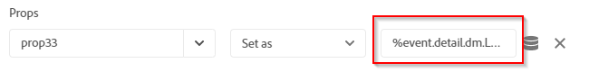

# Adobe Analytics 및 Adobe Launch와 Dynamic Media Viewer 통합 {#integrating-dynamic-media-viewers-with-adobe-analytics-and-adobe-launch}

## Adobe Analytics 및 Adobe Launch와 다이내믹 미디어 뷰어는 어떤 제품입니까? {#what-is-dynamic-media-viewers-integration-with-adobe-analytics-and-adobe-launch}

The new *Dynamic Media Viewers* extension for Adobe Launch, along with the recent release of Dynamic Media Viewers 5.13, lets customers of Dynamic Media, Adobe Analytics, and Adobe Launch to use events and data specific for the Dynamic Media Viewers in their Adobe Launch configuration.

이 통합은 Adobe Analytics을 통해 웹 사이트에서 Dynamic Media Viewer의 사용을 추적할 수 있음을 의미합니다. 동시에 Adobe 또는 서드파티로부터 오는 다른 Launch 확장 프로그램과 함께 뷰어에서 노출되는 이벤트와 데이터를 사용할 수 있습니다.

익스텐션에 대한 자세한 내용은 [Experience Platform Launch 사용](https://docs.adobe.com/content/help/en/launch/using/extensions-ref/overview.html) 안내서의 Adobe 익스텐션을 참조하십시오.

**본 문서를 읽어야 하는 사용자:** 사이트 관리자, AEM 플랫폼 개발자 및 운영 그룹의 개발자

### 통합의 제한 사항 {#limitations-of-the-integration}

* Dynamic Media 뷰어에 대한 Adobe 실행 통합이 AEM 작성자 노드에서 작동하지 않습니다. WCM 페이지가 게시될 때까지 추적 내용을 볼 수 없습니다.
* 다이내믹 미디어 뷰어에 대한 Adobe 실행 통합은 &quot;팝업&quot; 작업 모드에서 지원되지 않습니다. 여기서 [자산 세부 사항] 페이지의 &quot;URL&quot; 단추를 사용하여 뷰어 URL을 얻습니다.
* Adobe 시작 통합을 이전 뷰어 분석 통합(매개 변수 방법)과 동시에 사용할 수 `config2=` 없습니다.
* 비디오 추적 지원은 추적 개요에 설명된 바와 같이 핵심 재생 추적으로만 [제한됩니다](https://docs.adobe.com/content/help/en/media-analytics/using/sdk-implement/track-av-playback/track-core-overview.html). 특히 QoS, 광고, 장/세그먼트 또는 오류 추적은 지원되지 않습니다.
* 데이터 요소에 대한 저장소 기간 구성은 *다이내믹 미디어 뷰어 확장 기능을 사용하는 데이터 요소에 대해 지원되지 않습니다* . 저장소 지속 시간을 없음으로 **[!UICONTROL 설정해야 합니다]**.

### 통합에 대한 사용 사례 {#use-cases-for-the-integration}

Adobe Launch와의 통합을 위한 주요 사용 사례는 AEM Assets과 AEM Sites을 모두 사용하는 고객입니다. 이러한 시나리오에서 AEM 작성자 노드와 Adobe 론치 간의 표준 통합을 설정한 다음 사이트 인스턴스를 Adobe 론치 속성과 연결할 수 있습니다. 이후 사이트 페이지에 추가된 모든 Dynamic Media WCM 구성 요소는 뷰어의 데이터 및 이벤트를 추적합니다.

AEM Sites [의 Dynamic Media 뷰어 추적 정보를 참조하십시오](https://wiki.corp.adobe.com/display/~oufimtse/Dynamic+Media+Viewers+integration+with+Adobe+Launch#DynamicMediaViewersintegrationwithAdobeLaunch-TrackingDynamicMediaViewersinAEMSites).

통합이 지원하는 보조 사용 사례는 AEM Assets 전용 또는 Dynamic Media Classic을 사용하는 고객입니다. 이러한 경우 뷰어에 대한 포함 코드를 입수하여 웹 사이트 페이지에 추가합니다. 그런 다음 Adobe 론치에서 Adobe 실행 라이브러리 프로덕션 URL을 가져와 웹 페이지 코드에 수동으로 추가합니다.

포함 코드 [를 사용하여 Dynamic Media 뷰어 추적 정보를 참조하십시오](https://wiki.corp.adobe.com/display/~oufimtse/Dynamic+Media+Viewers+integration+with+Adobe+Launch#DynamicMediaViewersintegrationwithAdobeLaunch-TrackingDynamicMediaViewersusingEmbedcode).

## 통합에서 데이터 및 이벤트 추적 작동 방식 {#how-data-and-event-tracking-works-in-the-integration}

통합은 두 가지 개별 및 독립적인 Dynamic Media 뷰어 추적 유형을 활용합니다. *오디오 및 비디오용 Adobe Analytics* 및 *Adobe Analytics*.

### Adobe Analytics 사용 추적 정보  {#about-tracking-using-adobe-analytics}

Adobe Analytics을 사용하면 최종 사용자가 웹 사이트에서 Dynamic Media Viewers와 상호 작용할 때 수행되는 작업을 추적할 수 있습니다. 또한 Adobe Analytics을 사용하여 뷰어별 데이터를 추적할 수 있습니다. 예를 들어, 보기 로드 이벤트를 자산 이름, 발생한 모든 확대/축소 작업, 비디오 재생 작업 등과 함께 추적하고 기록할 수 있습니다.

Adobe 론치에서 *데이터 요소* 및 *규칙* 개념은 함께 사용하여 Adobe Analytics 추적을 활성화합니다.

#### Adobe 실행의 데이터 요소 정보 {#about-data-elements-in-adobe-launch}

Adobe 론치의 데이터 요소는 값이 정적으로 정의되거나 웹 페이지 또는 다이내믹 미디어 뷰어 데이터의 상태에 따라 동적으로 계산되는 명명된 속성입니다.

데이터 요소 정의에 사용할 수 있는 옵션은 Adobe 론치 속성에 설치된 확장 목록에 따라 다릅니다. &quot;코어&quot; 익스텐션은 사전 설치되어 있으며 모든 구성에서 즉시 사용할 수 있습니다. 이 &quot;코어&quot; 확장을 사용하면 쿠키, JavaScript 코드, 쿼리 문자열 및 기타 많은 소스에서 나오는 데이터 요소를 정의할 수 있습니다.

Adobe Analytics 추적을 위해서는 익스텐션 [설치 및 설정에 설명된 대로 몇 개의 추가 익스텐션을 설치해야 합니다](#installing-and-setup-of-extensions). 다이내믹 미디어 뷰어 확장은 동적 뷰어 이벤트의 인수인 데이터 요소를 정의하는 기능을 추가합니다. 예를 들어, 뷰어 유형이나 로드 시 뷰어에서 보고한 자산 이름, 최종 사용자가 확대/축소할 때 보고되는 확대/축소 수준 등을 참조할 수 있습니다.

Dynamic Media Viewer 확장은 자동으로 데이터 요소의 값을 최신 상태로 유지합니다.

정의한 후에는 데이터 요소 선택기 위젯을 사용하여 데이터 요소를 Adobe 실행 UI의 다른 위치에서 사용할 수 있습니다. 특히, 다이내믹 미디어 뷰어 추적의 목적으로 정의된 데이터 요소는 규칙의 Adobe Analytics 확장 프로그램의 변수 설정 동작에서 참조됩니다(아래 참조).

자세한 내용은 [Experience Platform Launch 사용 안내서의 데이터 요소](https://docs.adobe.com/content/help/ko-KR/launch/using/reference/manage-resources/data-elements.html) 를 참조하십시오.

#### Adobe 론치의 규칙 정보 {#about-rules-in-adobe-launch}

Adobe 론치의 규칙은 규칙을 구성하는 세 영역을 정의하는 불가지성 구성입니다. *이벤트*, *조건*&#x200B;및 *작업*:

* *이벤트* (있는 경우)는 규칙 트리거 시기를 Adobe 론치에 알립니다.
* *조건* (if)은 규칙을 트리거할 때 허용하거나 허용하지 않을 추가 제한 사항을 Adobe 론치에 알립니다.
* *작업* (그런 다음) 규칙이 트리거될 때 수행할 작업을 Adobe 론치에 알립니다.

이벤트, 조건 및 작업 섹션에서 사용할 수 있는 옵션은 Adobe 실행 속성에 설치된 확장명에 따라 다릅니다. Core ** 익스텐션은 사전 설치되어 있으며 모든 구성에서 바로 사용할 수 있습니다. 익스텐션은 초점 변경, 키 누르기, 양식 제출 등 기본적인 브라우저 수준 작업과 같은 이벤트 관련 옵션을 제공합니다. 또한 쿠키 값, 브라우저 유형 등과 같은 조건에 대한 옵션도 포함되어 있습니다. 작업의 경우 사용자 지정 코드 옵션만 사용할 수 있습니다.

Adobe Analytics 추적을 수행하려면 확장 기능 [설치 및 설정에 설명된 대로 몇 개의 추가 익스텐션이 설치되어 있어야 합니다](#installing-and-setup-of-extensions). 구체적으로:

* 다이내믹 미디어 뷰어 확장은 지원되는 이벤트 목록을 뷰어 로드, 자산 교환, 확대 및 비디오 재생과 같은 다이내믹 미디어 뷰어에만 해당되는 이벤트로 확장합니다.
* Adobe Analytics 익스텐션은 데이터를 추적 서버로 전송하는 데 필요한 두 가지 작업으로 지원되는 작업 목록을 확장합니다. *변수* 및 *전송 비콘*&#x200B;설정

Dynamic Media 뷰어를 추적하려면 다음 유형의 뷰어를 사용할 수 있습니다.

* 다이내믹 미디어 뷰어 확장, 코어 확장 또는 기타 확장 프로그램의 이벤트입니다.
* 규칙 정의의 조건. 또는 조건 영역을 비워 둘 수도 있습니다.

작업 섹션에서 변수 *설정 작업이* 필요합니다. 이 작업은 Adobe Analytics에서 추적 변수를 데이터로 채우는 방법을 알려줍니다. 동시에 변수 *설정* 작업은 추적 서버로 아무 것도 전송하지 않습니다.

변수 *설정* 작업 뒤에 비콘 *보내기 작업이* 와야 합니다. 비콘 *보내기* 작업은 실제로 데이터를 분석 추적 서버로 보냅니다. 변수 *설정* 및 비콘 *보내기*&#x200B;작업 모두 Adobe Analytics 확장에서 가져옵니다.

자세한 내용은 [Experience Platform Launch](https://docs.adobe.com/content/help/ko-KR/launch/using/reference/manage-resources/rules.html) 사용 안내서의 규칙을 참조하십시오.

#### 샘플 구성 {#sample-configuration}

Adobe Launch 내의 다음 샘플 구성은 뷰어 로드 시 자산 이름을 추적하는 방법을 보여줍니다.

1. [ **[!UICONTROL 데이터 요소]** ] 탭에서 Dynamic Media Viewers 확장 `AssetName` 에서 이벤트 `asset` 매개 변수를 참조하는 데이터 요소 `LOAD` 를 정의합니다.

   

1. 규칙 **[!UICONTROL 탭에서 규칙]** TrackAssetOnLoad *를 정의합니다*.

   이 규칙에서, **[!UICONTROL 이벤트]** 필드는 Dynamic Media Viewers **** 확장의LOAD이벤트를 사용합니다.

   

1. 작업 구성에는 Adobe Analytics 확장자의 두 가지 작업 유형이 있습니다.

   *선택한 분석 변수를 데이터*&#x200B;요소의 값에 매핑하는 변수 `AssetName` 설정

   *추적 정보를 Adobe Analytics으로 보내는 비콘*&#x200B;전송.

   

1. 결과 규칙 구성은 다음과 같습니다.

   

### 오디오 및 비디오용 Adobe Analytics 정보 {#about-adobe-analytics-for-audio-and-video}

Experience Cloud 계정에서 오디오 및 비디오에 Adobe Analytics을 사용하도록 구독하면 *다이내믹 미디어 뷰어 확장 설정에서 비디오 추적을 활성화하기에 충분합니다* . 비디오 지표를 Adobe Analytics에서 사용할 수 있게 됩니다. 비디오 추적은 오디오 및 비디오용 Adobe 미디어 분석 확장 기능에 따라 다릅니다.

확장 [설치 및 설정을 참조하십시오](#installing-and-setup-of-extensions).

현재 비디오 추적 지원은 추적 개요에 설명된 대로 &quot;핵심 재생&quot; 추적으로만 [제한됩니다](https://docs.adobe.com/content/help/en/media-analytics/using/sdk-implement/track-av-playback/track-core-overview.html). 특히 QoS, 광고, 장/세그먼트 또는 오류 추적은 지원되지 않습니다.

## 다이내믹 미디어 뷰어 확장 사용 {#using-the-dynamic-media-viewers-extension}

통합에 [대한 사용 사례에서](#use-cases-for-the-integration)언급했듯이, AEM Sites의 새로운 Adobe 실행 통합을 통해 Dynamic Media 뷰어를 추적하고 포함 코드를 사용할 수 있습니다.

### AEM Sites에서 다이내믹 미디어 뷰어 추적 {#tracking-dynamic-media-viewers-in-aem-sites}

AEM Sites에서 Dynamic Media 뷰어를 추적하려면 [모든 통합 부분](#configuring-all-the-integration-pieces) 구성 섹션에 나열된 모든 단계를 수행해야 합니다. 특히 IMS 구성과 Adobe Launch Cloud 구성을 만들어야 합니다.

적절한 구성을 따르면, Dynamic Media에서 지원하는 WCM 구성 요소를 사용하여 사이트 페이지에 추가하는 모든 Dynamic Media 뷰어는 자동으로 Adobe Analytics으로, 또는 비디오용 Adobe Analytics으로, 또는 두 가지 모두를 추적합니다.

Adobe [사이트를 사용하여 페이지에 Dynamic Media 자산 추가를 참조하십시오](/help/assets/dynamic-media/adding-dynamic-media-assets-to-pages.md).

### 포함 코드를 사용하여 Dynamic Media 뷰어 추적 {#tracking-dynamic-media-viewers-using-embed-code}

AEM Sites을 사용하지 않거나 Dynamic Media 뷰어를 AEM Sites 외부의 웹 페이지 또는 둘 다에 포함하지 않는 고객은 여전히 Adobe 론치 통합을 사용할 수 있습니다.

[Adobe Analytics 구성] 및 [Adobe 시작 구성] [섹션에서](#configuring-adobe-analytics-for-the-integration) 구성 [단계를 완료해야](#configuring-adobe-launch-for-the-integration) 합니다. 그러나 AEM 관련 구성 단계는 필요하지 않습니다.

적절한 구성을 통해 Dynamic Media 뷰어를 사용하여 웹 페이지에 Adobe 실행 지원을 추가할 수 있습니다.

Adobe [실행 라이브러리 포함 코드](https://docs.adobe.com/content/help/en/launch/using/implement/configure/implement-the-launch-install-code.html) 사용 방법에 대한 자세한 내용은 론치 포함 코드 추가를 참조하십시오.

AEM [Dynamic Media의 포함 코드 기능을 사용하는 방법에 대한 자세한 내용은 웹 페이지에](/help/assets/dynamic-media/embed-code.md) 비디오 또는 이미지 뷰어 포함을 참조하십시오.

**포함 코드를 사용하여 Dynamic Media 뷰어를 추적하려면**

1. Dynamic Media 뷰어를 포함할 웹 페이지가 준비되었습니다.
1. Adobe 론치에 먼저 로그인하여 Adobe 시작 라이브러리에 대한 포함 코드를 얻습니다(Adobe 론치 [구성 참조](#configuring-adobe-launch-for-the-integration)).
1. 속성 **[!UICONTROL 을]**&#x200B;클릭한 다음 환경 **[!UICONTROL 탭을]** 클릭합니다.
1. 웹 페이지의 환경과 관련된 환경 수준을 선택합니다. 그런 다음 **[!UICONTROL 설치]** 열에서 상자 아이콘을 클릭합니다.
1. **[!UICONTROL 웹 설치 지침]** 대화 상자에서 전체 Adobe 실행 라이브러리 포함 코드를 주변 `<script/>` 태그와 함께 복사합니다.

## Dynamic Media Viewers 확장 참조 안내서 {#reference-guide-for-the-dynamic-media-viewers-extension}

### 다이내믹 미디어 뷰어 구성 정보 {#about-the-dynamic-media-viewers-configuration}

아래의 모든 조건이 참인 경우 Dynamic Media Viewer 익스텐션은 Adobe 실행 라이브러리와 자동으로 통합됩니다.

* Adobe 시작 라이브러리 글로벌 개체( `_satellite`)가 페이지에 있습니다.
* Dynamic Media Viewers 확장 기능 `_dmviewers_v001()` `_satellite`은

* `config2=` 뷰어 매개 변수가 지정되지 않았습니다. 즉, 뷰어는 기존 Analytics 통합을 사용하지 않습니다.

또한 뷰어 구성에서 매개 변수를 지정하여 뷰어에서 Adobe 실행 통합을 명시적으로 비활성화하는 옵션이 `launch=0` 있습니다. 이 매개 변수의 기본값은 입니다 `1`.

### Dynamic Media Viewers 확장 구성 {#configuring-the-dynamic-media-viewers-extension}

Dynamic Media Viewers 확장 기능에 대한 유일한 구성 옵션은 오디오 및 비디오용 **[!UICONTROL Adobe 미디어 분석 활성화입니다]**.

이 옵션을 선택(활성화 또는 &quot;활성화&quot;)하고, 오디오 및 비디오용 Adobe 미디어 분석 확장 기능이 설치되고 올바르게 구성된 경우 비디오 재생 지표가 오디오 및 비디오용 Adobe Analytics 솔루션으로 전송됩니다. 이 옵션을 비활성화하면 비디오 추적이 꺼집니다.

오디오 및 비디오용 Adobe 미디어 분석 확장 프로그램을 설치하지 *않고* 이 옵션을 활성화하면 옵션이 적용되지 않습니다.

### 다이내믹 미디어 뷰어 확장의 데이터 요소 정보 {#about-data-elements-in-the-dynamic-media-viewers-extension}

다이내믹 미디어 뷰어 확장이 제공하는 데이터 요소 유형은 데이터 요소 유형 **[!UICONTROL 드롭다운]** 목록의 **[!UICONTROL 뷰어]** 이벤트뿐입니다.

이 옵션을 선택하면 데이터 요소 편집기가 두 개의 필드가 있는 양식을 렌더링합니다.

* **[!UICONTROL DM 뷰어 이벤트 데이터 유형]** - 인수가 있는 Dynamic Media Viewers 확장 프로그램에서 지원하는 모든 뷰어 이벤트와 특수 **[!UICONTROL COMMON]** 항목을 식별하는 드롭다운 목록입니다. COMMON **** 항목은 뷰어에서 보낸 모든 유형의 이벤트에 공통으로 사용되는 이벤트 매개 변수 목록을 나타냅니다.
* **[!UICONTROL 추적 매개 변수]** - 선택한 Dynamic Media 뷰어 이벤트의 인수입니다.

각 [뷰어 유형별로 지원되는 이벤트 목록은 Dynamic Media Viewers 참조 안내서](https://docs.adobe.com/content/help/en/dynamic-media-developer-resources/library/viewers-aem-assets-dmc/c-html5-s7-aem-asset-viewers.html) 를 참조하십시오. 특정 뷰어 섹션으로 이동한 다음 Adobe Analytics 추적 지원 하위 섹션을 클릭합니다. 현재 다이내믹 미디어 뷰어 참조 가이드는 이벤트 인수를 문서화하지 않습니다.

이제 다이내믹 미디어 뷰어 *데이터 요소의 라이프사이클을 고려해 보겠습니다*. 이러한 데이터 요소의 값은 페이지에서 해당 Dynamic Media 뷰어 이벤트가 발생한 후에 채워집니다. 예를 들어 데이터 요소가 **[!UICONTROL LOAD]** 이벤트 및 해당 &quot;asset&quot; 인수를 가리키면, 뷰어가 LOAD 이벤트를 처음 실행한 후 해당 데이터 요소의 값이 유효한 데이터를 받게 됩니다. 데이터 요소가 **[!UICONTROL ZOOM]** 이벤트 및 &quot;scale&quot; 인수를 가리키면 뷰어가 처음 **[!UICONTROL ZOOM]** 이벤트를 보낼 때까지 해당 데이터 요소의 값은 비어 있게 됩니다.

마찬가지로, 뷰어가 페이지에서 해당 이벤트를 전송하면 데이터 요소의 값이 자동으로 업데이트됩니다. 값 업데이트는 특정 이벤트가 규칙 구성에 지정되지 않은 경우에도 발생합니다. 예를 들어 ZOOM 이벤트의 &quot; **[!UICONTROL scale&quot; 매개 변수에 대해 데이터 요소]** ZoomScale이 정의되지만 규칙 구성에 있는 유일한 규칙은 **[!UICONTROL LOAD]** 이벤트에 의해 트리거되는 경우 사용자가 뷰어 내에서 확대/축소 **[!UICONTROL 를]** 실행할 때마다ZoomScale값이 계속 업데이트됩니다.

모든 Dynamic Media 뷰어는 웹 페이지에서 고유한 식별자를 가집니다. 데이터 요소는 값 자체와 값을 채운 뷰어를 추적합니다. 즉, 동일한 페이지에 여러 명의 뷰어가 있고 **[!UICONTROL LOAD]** 이벤트와 그 &quot;asset&quot; 인수를 가리키는 **[!UICONTROL AssetName]** 데이터 요소가 있는 경우 **[!UICONTROL AssetName]** 데이터 요소는 페이지에서 로드된 각 뷰어와 연결된 에셋 이름 컬렉션을 유지 관리합니다.

데이터 요소에서 반환하는 정확한 값은 컨텍스트에 따라 다릅니다. Dynamic Media 뷰어 이벤트에 의해 트리거된 규칙에서 데이터 요소가 요청되면 규칙을 시작한 뷰어에 대해 데이터 요소 값이 반환됩니다. 그리고 다른 Adobe 실행 확장 프로그램에서 이벤트에 의해 트리거된 규칙에서 데이터 요소가 요청되는 경우 데이터 요소의 값은 이 데이터 요소를 마지막으로 업데이트하는 뷰어의 값입니다.

**다음 샘플 설정을 고려해 보십시오**.

* 두 개의 Dynamic Media 확대/축소 뷰어가 있는 웹 페이지; viewer1 *및* viewer2 *로 참조합니다*.

* **[!UICONTROL ZoomScale]** 데이터 요소는 **[!UICONTROL ZOOM]** 이벤트와 해당 &quot;scale&quot; 인수를 가리킵니다.
* **[!UICONTROL 다음을 사용하여 TrackPan]** 규칙:

   * Dynamic Media Viewer **[!UICONTROL PAN]** 이벤트를 트리거로 사용합니다.
   * ZoomScale 데이터 **[!UICONTROL 요소의]** 값을 Adobe Analytics으로 전송합니다.

* 
   * **[!UICONTROL TrackKey]** Rule with the following:

   * 핵심 Adobe 실행 확장 프로그램의 키 인쇄 이벤트를 트리거로 사용합니다.
   * ZoomScale 데이터 **[!UICONTROL 요소의]** 값을 Adobe Analytics으로 전송합니다.

이제 최종 사용자가 두 명의 뷰어와 함께 웹 페이지를 로드한다고 가정합니다. viewer1 *에서는* 50% 크기로 확대됩니다. 그런 다음 *viewer2에서* 25% 크기로 확대됩니다. viewer1 *에서*&#x200B;이미지 주위에 이동하고 마지막으로 키보드에서 키를 누릅니다.

최종 사용자의 활동은 Adobe Analytics에 대해 다음과 같은 두 개의 추적 호출을 만듭니다.

* 첫 번째 호출은 사용자가 **[!UICONTROL viewer1에서 이동할 때 TrackPan]** 규칙이 트리거되기 때문에 *발생합니다*. 데이터 요소는 규칙이 **[!UICONTROL viewer1]** 에 의해 트리거되고 해당 크기 조절 값을 가져오기 때문에 해당 호출은 50%를 *ZoomScale* 데이터 요소 값으로 전송합니다.
* 두 번째 호출은 사용자가 **[!UICONTROL 키보드에서]** 키를 눌렀을 때 TrackKey 규칙이 트리거되기 때문에 발생합니다. 이 호출은 뷰어에서 규칙이 트리거되지 않았기 때문에 **[!UICONTROL ZoomScale]** 데이터 요소의 값으로 25%를 전송합니다. 따라서 데이터 요소는 최신 값을 반환합니다.

위에 설정된 샘플 세트는 데이터 요소 값의 수명 에도 영향을 줍니다. Dynamic Media Viewer에서 관리하는 데이터 요소의 값은 뷰어 자체가 웹 페이지에서 처리된 후에도 Adobe 실행 라이브러리 코드에 저장됩니다. 즉, Dynamic Media Viewer 이외의 확장 프로그램에서 트리거되는 규칙이 있고 이러한 데이터 요소를 참조하는 경우, 뷰어가 더 이상 웹 페이지에 표시되지 않더라도 데이터 요소는 마지막으로 알려진 값을 반환합니다.

어떤 경우든, 다이내믹 미디어 뷰어를 기반으로 하는 데이터 요소의 값은 로컬 저장소 또는 서버에 저장되지 않습니다. 대신 클라이언트측 Adobe 실행 라이브러리에만 보관됩니다. 이러한 데이터 요소의 값은 웹 페이지가 다시 로드될 때 사라집니다.

일반적으로 데이터 요소 편집기는 [저장소 기간 선택을 지원합니다](https://docs.adobe.com/content/help/ko-KR/launch/using/reference/manage-resources/data-elements.html#create-a-data-element). 그러나 Dynamic Media Viewers 확장 기능을 사용하는 데이터 요소는 [없음]의 저장 기간 옵션만 **[!UICONTROL 지원합니다]**. 사용자 인터페이스에서 다른 값을 설정할 수 있지만 이 경우에는 데이터 요소 동작이 정의되지 않습니다. 확장자는 데이터 요소의 값을 직접 관리합니다. 전체 뷰어 수명 주기 동안 뷰어 이벤트 인수의 값을 유지하는 데이터 요소입니다.

### 다이내믹 미디어 뷰어 확장의 규칙 정보 {#about-rules-in-the-dynamic-media-viewers-extension}

규칙 편집기에서 확장 기능은 이벤트 편집기에 대한 새 구성 옵션을 추가합니다. 또한 에서는 미리 구성된 데이터 요소를 사용하는 대신 작업 편집기에서 이벤트 매개 변수를 간단한 옵션으로 수동으로 참조하는 옵션을 제공합니다.

#### 이벤트 편집기 정보 {#about-the-events-editor}

이벤트 편집기에서, 다이내믹 미디어 뷰어 익스텐션은 **[!UICONTROL 뷰어 이벤트라는 새]** 이벤트 유형을 **[!UICONTROL 추가합니다]**.

이 옵션을 선택하면 이벤트 편집기가 드롭다운 **[!UICONTROL Dynamic Media 뷰어 이벤트를]**&#x200B;렌더링하여 Dynamic Media 뷰어에서 지원하는 모든 사용 가능한 이벤트를 나열합니다.

#### 액션 편집기 정보 {#about-the-actions-editor}

다이내믹 미디어 뷰어 확장 기능을 사용하면 다이내믹 미디어 뷰어의 이벤트 매개 변수를 사용하여 Adobe Analytics 확장 프로그램의 변수 설정 편집기의 분석 변수에 매핑할 수 있습니다.

이렇게 하는 가장 간단한 방법은 다음 2단계 프로세스를 완료하는 것입니다.

* 먼저 하나 이상의 데이터 요소를 정의합니다. 여기서 각 데이터 요소는 다이내믹 미디어 뷰어 이벤트의 매개 변수를 나타냅니다.
* 마지막으로, Adobe Analytics 확장의 변수 설정 편집기에서 데이터 요소 선택기 아이콘(세 개의 스택된 디스크)을 클릭하여 데이터 요소 선택 대화 상자를 연 다음, 여기에서 데이터 요소를 선택합니다.

하지만 대체 방법을 사용하고 데이터 요소 생성을 무시할 수 있습니다. 퍼센트(%) 기호로 둘러싸인 Analytics 변수 할당의 **[!UICONTROL 값]** 입력 필드에 이벤트 인수의 정규화된 이름을 입력하여 Dynamic Media Viewer 이벤트의 인수를 직접 참조할 수 있습니다. 예,

`%event.detail.dm.LOAD.asset%`

데이터 요소 사용과 직접 이벤트 인수 참조 간에는 중요한 차이가 있습니다. 데이터 요소의 경우, 변수 설정 작업을 트리거하는 이벤트가 문제가 되지 않으며, 규칙을 트리거하는 이벤트는 동적 뷰어와 관련되지 않을 수 있습니다(핵심 확장자에서 웹 페이지에서 마우스 클릭처럼). 그러나 직접 인수 참조를 사용할 때는 규칙을 트리거하는 이벤트가 참조하는 이벤트 인수와 일치하는지 확인해야 합니다.

예를 들어, 참조 `%event.detail.dm.LOAD.asset%` 는 Dynamic Media Viewer 확장 프로그램의 **[!UICONTROL LOAD]** 이벤트에 의해 규칙이 트리거되는 경우 올바른 자산 이름을 반환합니다. 하지만 다른 이벤트에 대해 빈 값을 반환합니다.

다음 표에는 Dynamic Media Viewer 이벤트와 지원되는 인수가 나와 있습니다.

<table>
 <tbody>
  <tr>
   <td>뷰어 이벤트 이름</td>
   <td>인수 참조</td>
  </tr>
  <tr>
   <td><code>COMMON</code></td>
   <td><code>%event.detail.dm.objID%</code></td>
  </tr>
  <tr>
   <td> </td>
   <td><code>%event.detail.dm.compClass%</code></td>
  </tr>
  <tr>
   <td> </td>
   <td><code>%event.detail.dm.instName%</code></td>
  </tr>
  <tr>
   <td> </td>
   <td><code>%event.detail.dm.timeStamp%</code></td>
  </tr>
  <tr>
   <td><code>BANNER</code> </td>
   <td><code>%event.detail.dm.BANNER.asset%</code></td>
  </tr>
  <tr>
   <td> </td>
   <td><code>%event.detail.dm.BANNER.frame%</code></td>
  </tr>
  <tr>
   <td> </td>
   <td><code>%event.detail.dm.BANNER.label%</code></td>
  </tr>
  <tr>
   <td><code>HREF</code></td>
   <td><code>%event.detail.dm.HREF.rollover%</code></td>
  </tr>
  <tr>
   <td><code>ITEM</code></td>
   <td><code>%event.detail.dm.ITEM.rollover%</code></td>
  </tr>
  <tr>
   <td><code>LOAD</code></td>
   <td><code>%event.detail.dm.LOAD.applicationname%</code></td>
  </tr>
  <tr>
   <td><strong> </strong></td>
   <td><code>%event.detail.dm.LOAD.asset%</code></td>
  </tr>
  <tr>
   <td><strong> </strong></td>
   <td><code>%event.detail.dm.LOAD.company%</code></td>
  </tr>
  <tr>
   <td><strong> </strong></td>
   <td><code>%event.detail.dm.LOAD.sdkversion%</code></td>
  </tr>
  <tr>
   <td><strong> </strong></td>
   <td><code>%event.detail.dm.LOAD.viewertype%</code></td>
  </tr>
  <tr>
   <td><strong> </strong></td>
   <td><code>%event.detail.dm.LOAD.viewerversion%</code></td>
  </tr>
  <tr>
   <td><code>METADATA</code></td>
   <td><code>%event.detail.dm.METADATA.length%</code></td>
  </tr>
  <tr>
   <td> </td>
   <td><code>%event.detail.dm.METADATA.type%</code></td>
  </tr>
  <tr>
   <td><code>MILESTONE</code></td>
   <td><code>%event.detail.dm.MILESTONE.milestone%</code></td>
  </tr>
  <tr>
   <td><code>PAGE</code></td>
   <td><code>%event.detail.dm.PAGE.frame%</code></td>
  </tr>
  <tr>
   <td> </td>
   <td><code>%event.detail.dm.PAGE.label%</code></td>
  </tr>
  <tr>
   <td><code>PAUSE</code></td>
   <td><code>%event.detail.dm.PAUSE.timestamp%</code></td>
  </tr>
  <tr>
   <td><code>PLAY</code></td>
   <td><code>%event.detail.dm.PLAY.timestamp%</code></td>
  </tr>
  <tr>
   <td><code>SPIN</code></td>
   <td><code>%event.detail.dm.SPIN.framenumber%</code></td>
  </tr>
  <tr>
   <td><code>STOP</code></td>
   <td><code>%event.detail.dm.STOP.timestamp%</code></td>
  </tr>
  <tr>
   <td><code>SWAP</code></td>
   <td><code>%event.detail.dm.SWAP.asset%</code></td>
  </tr>
  <tr>
   <td><code>SWATCH</code></td>
   <td><code>%event.detail.dm.SWATCH.frame%</code></td>
  </tr>
  <tr>
   <td> </td>
   <td><code>%event.detail.dm.SWATCH.label%</code></td>
  </tr>
  <tr>
   <td><code>TARG</code></td>
   <td><code>%event.detail.dm.TARG.frame%</code></td>
  </tr>
  <tr>
   <td> </td>
   <td><code>%event.detail.dm.TARG.label%</code></td>
  </tr>
  <tr>
   <td><code>ZOOM</code></td>
   <td><code>%event.detail.dm.ZOOM.scale%</code></td>
  </tr>
 </tbody>
</table>

## 모든 통합 부분 구성 {#configuring-all-the-integration-pieces}

**시작하기 전에**

아직 이러한 작업을 수행하지 않은 경우 통합 사항을 이해할 수 있도록 이 섹션 이전에 모든 설명서를 철저히 검토하는 것이 좋습니다.

이 섹션에서는 오디오 및 비디오용 Adobe Analytics 및 Adobe Analytics과 Dynamic Media 뷰어를 통합하는 데 필요한 구성 단계를 설명합니다. Adobe 실행에서 다른 목적으로 Dynamic Media Viewers 익스텐션을 사용하는 것은 가능하지만, 이러한 시나리오는 이 설명서에서 다루지 않습니다.

다음 Adobe 제품에서 통합을 구성합니다.

* Adobe Analytics - 추적 변수 및 보고서를 구성합니다.
* Adobe 시작 - 속성, 하나 이상의 규칙 및 하나 이상의 데이터 요소를 정의하여 뷰어 추적을 활성화합니다.

또한 이 통합 솔루션이 AEM Sites과 함께 사용되는 경우 다음 구성도 수행해야 합니다.

* Adobe I/O 콘솔 - Adobe 시작을 위한 통합이 만들어집니다.
* AEM 작성자 노드 - IMS 구성 및 Adobe Launch cloud 구성

구성의 일부로, Adobe Analytics 및 Adobe 론치가 이미 활성화된 Adobe Experience Cloud의 회사에 액세스할 수 있어야 합니다.

## 통합을 위해 Adobe Analytics 구성 {#configuring-adobe-analytics-for-the-integration}

Adobe Analytics을 구성한 후 통합에 대해 다음과 같이 설정됩니다.

* 보고서 세트가 제자리에 있고 선택됩니다.
* 분석 변수를 사용하여 추적 데이터를 받을 수 있습니다.
* Adobe Analytics 내에서 수집된 데이터를 보는 데 보고서를 사용할 수 있습니다.

Analytics [구현 안내서를 참조하십시오](https://docs.adobe.com/content/help/en/analytics/implementation/home.html).

**통합을 위해 Adobe Analytics을 구성하려면 다음을 수행하십시오**.

1. 먼저 Experience Cloud [홈 페이지에서 Adobe Analytics에 액세스하십시오](https://exc-home.experiencecloud.adobe.com/exc-home/home.html#/). 메뉴 모음에서 페이지의 오른쪽 위 모서리 근처에 있는 솔루션 아이콘(세 개 점 테이블 세 개)을 클릭한 다음 **[!UICONTROL 분석을 클릭합니다]**.

   

   이제 보고서 세트를 선택합니다.

### 보고서 세트 선택 {#selecting-a-report-suite}

1. Adobe Analytics 페이지의 오른쪽 위 모서리 근처에 있는 **[!UICONTROL 보고서]** 검색 필드 오른쪽의 드롭다운 목록에서 올바른 보고서 세트를 선택합니다. 사용할 수 있는 보고서 세트가 여러 개 있고 사용할 보고서 세트가 확실치 않은 경우에는 사용할 보고서 세트를 선택하는 데 도움이 되는 Adobe Analytics 관리자에게 문의하십시오.

   아래 그림에서 사용자가 DynamicMediaViewersExtensionDoc라는 *보고서 세트를 만들어* 드롭다운 목록에서 선택했습니다. 보고서 세트 이름은 그림 용도로만 사용됩니다. 선택하는 보고서 세트의 이름은 달라집니다.

   사용할 수 있는 보고서 세트가 없는 경우, 사용자나 Adobe Analytics 관리자가 보고서 세트를 만든 후 구성을 계속 진행할 수 있습니다.

   보고서 [및 보고서 세트](https://docs.adobe.com/content/help/en/analytics/implementation/analytics-basics/ref-reports-report-suites.html) 및 [보고서 세트 만들기를 참조하십시오](https://docs.adobe.com/content/help/en/analytics/admin/admin-console/create-report-suite.html).

   Adobe Analytics에서 보고서 세트는 **[!UICONTROL 관리 > 보고서 세트에서 관리됩니다]**.

   

   이제 Adobe Analytics 변수를 설정합니다.

### Adobe Analytics 변수 설정 {#setting-up-adobe-analytics-variables}

1. 이제 웹 페이지에서 동적 미디어 뷰어 동작을 추적하는 데 사용할 하나 이상의 Adobe Analytics 변수를 지정합니다.

   Adobe Analytics에서 지원하는 모든 유형의 변수를 사용할 수 있습니다. 변수 유형(예: 사용자 지정 트래픽 [prop], 전환 [eVar])에 대한 결정은 Analytics 구현의 특정 요구 사항에 의해 파생되어야 합니다.

   prop [및 eVar 개요를 참조하십시오](https://docs.adobe.com/content/help/en/analytics/implementation/analytics-basics/traffic-props-evars/props-evars.html).

   이 문서의 경우 웹 페이지에서 작업이 발생한 후 몇 분 내에 Analytics 보고서에서 사용할 수 있기 때문에 사용자 지정 트래픽(prop) 변수만 사용됩니다.

   새 사용자 지정 트래픽 변수를 활성화하려면 Adobe Analytics의 도구 모음에서 관리 > **[!UICONTROL 보고서 세트를 클릭합니다]**.

1. 보고서 **[!UICONTROL 세트 관리자]** 페이지에서 올바른 보고서를 선택한 다음 도구 모음에서 설정 **[!UICONTROL 편집 > 트래픽 > 트래픽 변수를 클릭합니다]**.
1. 여기에서 사용하지 않은 변수를 선택하고, 설명형 이름( **[!UICONTROL 뷰어 자산(prop 30)]**&#x200B;을 지정하고, [사용] 열에서 콤보 상자를 &quot;사용&quot;으로 변경합니다.

   다음 스크린샷은 뷰어에서 사용하는 자산 이름을 추적하는 사용자 지정 트래픽 변수( **[!UICONTROL prop30]**)의 예입니다.

   

1. 변수 목록 하단에서 저장을 **[!UICONTROL 클릭합니다]**.

### 보고서 설정 {#setting-up-a-report}

1. 일반적으로 Adobe Analytics에서 보고서를 설정하는 것은 특정 프로젝트 요구에 의해 수행됩니다. 따라서 세부 보고서 설정은 이 통합의 범위를 벗어납니다.

   하지만 Adobe Analytics 변수 설정에서 사용자 지정 트래픽 변수를 설정한 후 사용자 지정 트래픽 보고서를 Adobe Analytics에서 자동으로 사용할 수 있게 **[되는 것은 충분히 알 수 있습니다](#setting-up-adobe-analytics-variables)**.

   예를 들어 **[!UICONTROL 뷰어 자산(prop 30)]** 변수에 대한 보고서는 사용자 지정 트래픽 > 사용자 지정 트래픽 21-30 > 뷰어 자산(prop 30)의 보고서 메뉴 **[!UICONTROL 에서 사용할 수 있습니다]**.

   뷰어 자산(prop 30)이 **[!UICONTROL 만들어진 후]** 바로 이 보고서를 방문하면 데이터가 표시되지 않습니다. 이 경우 통합 시 필요합니다.

   

## 통합을 위한 Adobe 시작 구성 {#configuring-adobe-launch-for-the-integration}

Adobe 시작을 구성한 후 통합에 대해 다음과 같은 설정이 됩니다.

* 새 속성을 만들어 모든 구성을 함께 유지합니다.
* 확장 프로그램의 설치 및 설정 속성에 설치된 모든 확장 프로그램의 클라이언트측 코드가 라이브러리로 컴파일됩니다. 이 라이브러리는 나중에 웹 페이지에서 사용됩니다.
* 데이터 요소 및 규칙 구성. 이 구성은 Dynamic Media 뷰어에서 캡처할 데이터, 추적 로직을 트리거할 시기 및 Adobe Analytics에서 뷰어의 데이터를 보낼 위치를 정의합니다.
* 라이브러리 게시.

**통합에 대한 Adobe 시작을 구성하려면**:

1. 먼저 Experience Cloud [홈 페이지에서 Adobe 론치에 액세스하십시오](https://exc-home.experiencecloud.adobe.com/exc-home/home.html#/). 메뉴 모음에서 페이지의 오른쪽 위 모서리 근처에 있는 솔루션 아이콘(세 개 점 테이블 세 개)을 클릭한 다음 **[!UICONTROL 론치를 클릭합니다]**.

   Adobe 론치를 직접 [열 수도 있습니다](https://launch.adobe.com/).

   

### Adobe 론치에서 속성 만들기 {#creating-a-property-in-adobe-launch}

Adobe 론치의 속성은 모든 설정을 함께 유지하는 이름이 지정된 구성입니다. 구성 설정의 라이브러리가 생성되고 다른 환경 수준(개발, 스테이징 및 프로덕션)에 게시됩니다.

속성 [만들기를 참조하십시오](https://docs.adobe.com/content/help/en/launch/using/implement/configure/create-a-property.html).

1. Adobe 론치에서 **[!UICONTROL 새 속성을 클릭합니다]**.
1. 속성 **[!UICONTROL 만들기]** 대화 상자의 **[!UICONTROL 이름]** 필드에 웹 사이트의 제목과 같은 설명형 이름을 입력합니다. 예, `DynamicMediaViewersProp.`
1. 도메인 **[!UICONTROL 필드에]** 웹 사이트의 도메인을 입력합니다.
1. 고급 **[!UICONTROL 옵션]** 드롭다운에서 **** 사용하고자 하는 확장 프로그램(이 경우 *Dynamic Media Viewers*)이 아직 출시되지 않은 경우에 대비해 익스텐션 개발을 위해 구성(나중에 수정할 수 없음)을활성화합니다.

   

1. **[!UICONTROL 저장]**&#x200B;을 클릭합니다.

   새로 만든 속성을 클릭한 다음 확장 *설치 및 설정으로 진행합니다*.

### 확장 프로그램 설치 및 설정 {#installing-and-setup-of-extensions}

Adobe 론치에서 사용 가능한 모든 익스텐션은 **[!UICONTROL 확장 > 카탈로그 아래에 나열되어 있습니다]**.

확장 프로그램을 설치하려면 [설치]를 **[!UICONTROL 클릭합니다]**. 필요한 경우 일회성 확장 구성을 수행한 다음 **[!UICONTROL 저장을 클릭합니다]**.

필요한 경우 다음 익스텐션을 설치하고 구성해야 합니다.

* (필수) *Experience Cloud ID 서비스* 확장

추가 구성은 필요하지 않습니다. 제안된 값에 대해 적용합니다. 완료되면 [저장]을 **[!UICONTROL 클릭합니다]**.

Experience Cloud [ID 서비스 확장을 참조하십시오](https://docs.adobe.com/content/help/en/launch/using/extensions-ref/adobe-extension/id-service-extension/overview.html).

* (필수) *Adobe Analytics* 확장

이 확장을 구성하려면 먼저 Adobe Analytics의 **[!UICONTROL 관리 > 보고서 세트]**&#x200B;아래의 **[!UICONTROL 보고서 세트 ID 열 헤더 아래에 있는 보고서 세트 ID가]** 필요합니다.

(데모용으로만 사용할 경우, 다음 스크린샷에서는 **[!UICONTROL DynamicMediaViewersExtensionDoc]** 보고서 세트의 보고서 세트 ID가 사용됩니다. 이 ID는 이전 보고서 세트 선택 [에서 만들어지고](#selecting-a-report-suite) 사용되었습니다.)

확장 설치 페이지에서 **[!UICONTROL 개발 보고서 세트]** 필드, 스테이징 보고서 세트 **[!UICONTROL 필드 및]** 프로덕션 보고서 세트 **[!UICONTROL 필드에 보고서 세트 ID를]** 입력합니다.

*비디오 추적을 사용하려는 경우에만 다음 항목을 구성합니다.*

확장 **[!UICONTROL 설치]** 페이지에서 **[!UICONTROL 일반을]**&#x200B;확장한 다음 추적 서버를 지정합니다. 추적 서버는 템플릿 `<trackingNamespace>.sc.omtrdc.net`을 따릅니다. 여기서 `<trackingNamespace>` 는 제공 이메일에서 얻은 정보입니다.

**[!UICONTROL 저장]**&#x200B;을 클릭합니다.

Adobe Analytics 익스텐션을 [참조하십시오](https://docs.adobe.com/content/help/en/launch/using/extensions-ref/adobe-extension/analytics-extension/overview.html).

* (선택 사항입니다. 비디오 추적이 필요한 경우에만 필요) 오디오 및 비디오용 *Adobe 미디어* 분석 확장

추적 서버 필드를 채웁니다. 오디오 및 비디오용 *Adobe 미디어* 분석 확장 기능을 위한 추적 서버는 Adobe Analytics에 사용되는 추적 서버와 다릅니다. 템플릿 `<trackingNamespace>.hb.omtrdc.net`을 따릅니다. 여기서 `<trackingNamespace>` 는 제공 이메일의 정보입니다.

다른 모든 필드는 선택 사항입니다.

오디오 및 비디오 [확장 Adobe 미디어 분석을 참조하십시오](https://docs.adobe.com/content/help/en/launch/using/extensions-ref/adobe-extension/media-analytics-extension/overview.html).

* (필수) *다이내믹 미디어 뷰어* 확장

비디오 **[!UICONTROL 하트비트 추적을 활성화(켜기)하려면 비디오용]** Adobe Analytics 활성화를 선택합니다.

이 작성 시 *다이내믹 미디어 뷰어* 확장 기능은 개발을 위해 Adobe 실행 속성을 만든 경우에만 사용할 수 있습니다.

Adobe [론치에서 속성 만들기를 참조하십시오](#creating-a-property-in-adobe-launch).

Extension을 설치하고 설치한 후 최소 5개의 Extension(비디오를 추적하지 않는 경우 4개)이 Extension > Installed 영역에 나열됩니다.

### 데이터 요소 및 규칙 설정 {#setting-up-data-elements-and-rules}

Adobe 론치에서 Dynamic Media 뷰어를 추적하는 데 필요한 데이터 요소 및 규칙을 만듭니다.

Adobe [론치의 추적에 대한 개요는 통합에서](#how-data-and-event-tracking-works-in-the-integration) 데이터 및 이벤트 추적이 작동하는 방식을 참조하십시오.

뷰어 [로드](#sample-configuration) 시 자산 이름을 추적하는 방법을 보여주는 Adobe 론치의 샘플 구성에 대한 샘플 구성을 참조하십시오.

익스텐션 [기능에 대한 자세한 내용은 Dynamic Media Viewers 확장](#configuring-the-dynamic-media-viewers-extension) 구성을 참조하십시오.

### 라이브러리 게시 {#publishing-a-library}

Adobe 시작 구성(속성, 확장, 규칙 및 데이터 요소 설정 포함)을 변경하려면 이러한 변경 사항을 *게시해야* 합니다. Adobe 론치에 게시는 속성 구성 아래의 게시 탭에서 수행됩니다.

Adobe 실행에는 여러 개발 환경, 하나의 스테이징 환경 및 하나의 프로덕션 환경이 있을 수 있습니다. 기본적으로 AEM의 Adobe Launch Cloud 구성은 AEM 작성자 노드를 Adobe Launch의 스테이지 환경으로, AEM 게시 노드를 Adobe Launch의 프로덕션 환경에 가리킵니다. 이 정렬은 기본 AEM 설정을 사용할 경우, Adobe 론치 라이브러리를 스테이징 환경에 게시하여 AEM 작성자에서 사용한 다음 AEM 게시에서 사용할 수 있도록 프로덕션 환경에 게시해야 한다는 것을 의미합니다.

Adobe [실행 환경에](https://docs.adobe.com/content/help/en/launch/using/reference/publish/environments.html) 대한 자세한 내용은 환경을 참조하십시오.

라이브러리를 게시하려면 다음 두 단계가 포함됩니다.

* 라이브러리에 필요한 모든 변경 사항(새 내용 및 업데이트)을 포함하여 새 라이브러리를 추가 및 작성합니다.
* 다른 환경 수준(개발에서 스테이징 및 프로덕션으로)을 통해 라이브러리 이동

#### 새 라이브러리 추가 및 작성 {#adding-and-building-a-new-library}

1. Adobe 론치에서 게시 탭을 처음 열면 라이브러리 목록이 비어 있습니다.

   왼쪽 열에서 새 라이브러리 **[!UICONTROL 추가를 클릭합니다]**.

   

1. 새 라이브러리 만들기 페이지의 **[!UICONTROL 이름]** 필드에 새 라이브러리의 설명형 이름을 입력합니다. 예,

   *DynamicMediaViewersLib*

   환경 드롭다운 목록에서 환경 수준을 선택합니다. 처음에는 개발 수준만 선택할 수 있습니다. 페이지의 왼쪽 하단에서 변경된 모든 리소스 **[!UICONTROL 추가를 클릭합니다]**.

   

1. 페이지의 오른쪽 위 모서리 근처에 있는 [ **[!UICONTROL 저장 및 개발]을 클릭합니다]**.

   몇 분 안에 라이브러리가 만들어지고 사용할 준비가 됩니다.

   

   >[!NOTE]
   >
   >다음에 Adobe 시작 구성을 변경할 때 **[!UICONTROL 속성]** 구성 아래의 **[!UICONTROL 게시]** 탭으로 이동한 다음 이전에 만든 라이브러리를클릭합니다.
   >
   >
   >라이브러리 게시 화면에서 **[!UICONTROL 변경된 모든 리소스]**&#x200B;추가를 클릭한 다음 **[!UICONTROL 저장을 클릭하여 개발을]**&#x200B;수행합니다.

#### 환경 수준을 통해 라이브러리 이동 {#moving-a-library-up-through-environment-levels}

1. 새 라이브러리가 추가되면 처음에는 개발 환경에 배치됩니다. 스테이징 환경 수준(제출된 열에 해당)으로 이동하려면 라이브러리의 드롭다운 메뉴에서 승인을 위해 **[!UICONTROL 제출을 클릭합니다]**.

   

1. 확인 대화 상자에서 제출을 **[!UICONTROL 클릭합니다]**.

   라이브러리가 [제출됨] 열로 이동한 후 라이브러리의 드롭다운 메뉴에서 [스테이징에 **[!UICONTROL 대한 빌드]를 클릭합니다]**.

   

1. 유사한 프로세스에 따라 라이브러리를 스테이징 환경에서 프로덕션 환경(게시된 열)으로 이동합니다.

   먼저 드롭다운 메뉴에서 게시 **[!UICONTROL 승인을 클릭합니다]**.

   

1. 드롭다운 메뉴에서 제작 및 **[!UICONTROL 출판을 클릭합니다]**.

   

   Adobe [론치의](https://docs.adobe.com/content/help/en/launch/using/reference/publish/overview.html) 게시 프로세스에 대한 자세한 내용은 게시를 참조하십시오.

## 통합을 위해 Adobe Experience Manager 구성 {#configuring-adobe-experience-manager-for-the-integration}

<!-- Prerequisites lost below should be verified by Sasha -->

전제 조건:

* AEM에서는 작성자 및 게시 인스턴스를 모두 실행합니다.
* AEM 작성자 노드가 Dynamic Media에 설정되어 있습니다. <!-- Scene7 run mode (dynamicmedia_s7) -->
* Dynamic Media WCM 구성 요소는 AEM Sites에서 활성화됩니다.

AEM 구성은 다음 두 가지 주요 단계로 구성됩니다.

* AEM IMS 구성
* Adobe Launch Cloud 구성.

### AEM IMS 구성 {#configuring-aem-ims}

1. AEM 작성기에서 도구 아이콘(망치)을 클릭한 다음 **[!UICONTROL 보안 > Adobe IMS 구성을 클릭합니다]**.

   

1. Adobe IMC 구성 페이지의 왼쪽 위 모퉁이에서 만들기를 **[!UICONTROL 클릭합니다]**.
1. Adobe IMS **[!UICONTROL 기술 계정 구성]** 페이지의 **[!UICONTROL 클라우드 솔루션]** 드롭다운 목록에서 **[!UICONTROL Adobe 시작을 클릭합니다]**.
1. 새 인증서 **[!UICONTROL 를]**&#x200B;만든 다음 텍스트 필드에 인증서에 대한 의미 있는 값을 입력합니다. 예: *AdobeLaunchIMSCert*. **[!UICONTROL 인증서 만들기]**&#x200B;를 클릭합니다.

   다음 정보 메시지가 표시됩니다.

   *유효한 액세스 토큰을 검색하려면 새 인증서의 공개 키를 Adobe I/O!의 기술 계정에 추가해야 합니다*.

   Click **[!UICONTROL OK]** to dismiss the Info dialog box.

   

1. 공개 키 **[!UICONTROL 다운로드를]** 클릭하여 공개 키 파일(`*.crt`)을 로컬 시스템에 다운로드합니다.

   >[!NOTE]
   >
   >이 경우 ***Adobe IMS 기술 계정 구성*** **** 페이지를 엽니다. ***페이지를 닫지*** 말고 ***다음을 클릭하지*** 마십시오. 이 페이지는 나중에 단계에서 다시 표시됩니다.

   

1. 새 브라우저 탭에서 [Adobe I/O 콘솔로 이동합니다](https://console.adobe.io/integrations).

1. Adobe **[!UICONTROL I/O 콘솔 통합]** 페이지에서 오른쪽 위 모서리에 있는 [ **[!UICONTROL 새 통합]을 클릭합니다]**.
1. 새 통합 **[!UICONTROL 만들기]** 대화 상자에서 **[!UICONTROL API]** 라디오 단추 **[!UICONTROL 액세스가 선택되어 있는지 확인하고]**&#x200B;계속을 클릭합니다.

   

1. 두 번째 **[!UICONTROL 새 통합]** 만들기 페이지에서 **[!UICONTROL Experience Platform Launch API]** 라디오 단추를 활성화(켜기)합니다. 페이지의 오른쪽 아래 모서리에서 **[!UICONTROL 계속을 클릭합니다]**.

   

1. 세 번째 **[!UICONTROL 새 통합]** 만들기 페이지에서 다음을 수행합니다.

   * 이름 **[!UICONTROL 필드에]** 설명형 이름을 입력합니다. 예: *DynamicMediaViewersIO*.

   * 설명 **** 필드에 통합에 대한 설명을 입력합니다.

   * 공개 **[!UICONTROL 키 인증서]** 영역에서 이전에 다운로드한 공개 키 파일(`*.crt`)을 업로드합니다.

   * Experience Platform Launch **[!UICONTROL API]** 역할 선택 머리글 아래에서 **[!UICONTROL 관리를 선택합니다]**.

   * Experience Platform Launch API **[!UICONTROL 용 제품 프로필을 하나 이상]** 선택 머리글 아래에서 **[!UICONTROL Launch - &lt;your_company_name>이라는 제품 프로필을 선택합니다]**.

   

1. Click **[!UICONTROL Create integration]**.
1. 통합 **[!UICONTROL 생성]** 페이지에서 **[!UICONTROL 계속을 클릭하여 통합 세부 사항을 확인합니다]**.

   

1. 다음과 유사한 통합 세부 사항 페이지가 나타납니다.

   >[!NOTE]
   >
   >***이 통합 세부 정보 페이지를 엽니다***. 개요 **[!UICONTROL 및]** JWT **** 탭의 다양한 정보가 즉시 필요합니다.

   
   _통합 세부 정보 페이지_

1. 이전에 열어 둔 **[!UICONTROL Adobe IMS 기술 계정 구성]** 페이지로 돌아갑니다. 페이지의 오른쪽 위 모서리에서 **[!UICONTROL 다음]** 을 클릭하여 **[!UICONTROL Adobe IMS 기술 계정 구성]** 창의 **[!UICONTROL 계정]** 페이지를엽니다.

   (페이지를 실수로 앞쪽으로 닫은 경우 AEM 작성자로 돌아간 다음 **[!UICONTROL 도구 > 보안 > Adobe IMS 구성 을 클릭합니다]**. **[!UICONTROL 만들기]**&#x200B;를 클릭합니다. **[!UICONTROL 클라우드 솔루션]** 드롭다운 목록에서 **[!UICONTROL Adobe 시작을 선택합니다]**. 인증서 **** 드롭다운 목록에서 이전에 만든 인증서의 이름을 선택합니다.

   
   _Adobe IMS 기술 계정 구성 - 인증서 페이지_

1. 계정 **** 페이지에는 이전 단계의 통합 세부 정보 페이지에서 얻은 정보를 사용하여 작성해야 하는 다섯 개의 필드가 있습니다.

   
   _Adobe IMS 기술 계정 구성 - 계정 페이지_

1. 계정 **[!UICONTROL 페이지에서]** 다음 필드를 입력합니다.

   * **[!UICONTROL 제목]** - 설명 계정 제목을 입력합니다.
   * **[!UICONTROL 인증 서버]** - 이전에 연 통합 세부 정보 페이지로 돌아갑니다. Click the **[!UICONTROL JWT]** tab. 경로 없이 아래 강조 표시된 서버 이름을 복사합니다.

(예제 서버 이름은 그림 용도로만 사용됩니다)   계정 **[!UICONTROL 페이지로 돌아가서]** 해당 필드에 이름을 붙여 넣습니다.
예를 들어, `https://ims-na1.adobelogin.com/`(예제 서버 이름은 그림 용으로만 사용됨)

   
   _통합 세부 정보 페이지 - JWT 탭_

1. **[!UICONTROL API 키]** - 통합 세부 사항 페이지로 돌아갑니다. [ **[!UICONTROL 개요]** ] 탭을 클릭한 다음 **[!UICONTROL API 키(클라이언트 ID)]** 필드 오른쪽에 있는 **[!UICONTROL 복사를 클릭합니다]**.

   계정 **[!UICONTROL 페이지로 돌아가서]** 키를 각 필드에 붙여 넣습니다.

   
   _통합 세부 정보 페이지_

1. **[!UICONTROL 클라이언트 암호]**- 통합 세부 사항 페이지로 돌아갑니다. [ **[!UICONTROL 개요]** ] 탭에서 **[!UICONTROL 클라이언트 암호 검색을 클릭합니다]**. 클라이언트 **[!UICONTROL 암호]** 필드 오른쪽에서 **[!UICONTROL 복사를 클릭합니다]**.

   계정 **[!UICONTROL 페이지로 돌아가서]** 키를 각 필드에 붙여 넣습니다.

1. **[!UICONTROL 페이로드]** - 통합 세부 사항 페이지로 돌아갑니다. JWT **** 탭의 JWT 페이로드 필드에서 전체 JSON 개체 코드를 복사합니다.

   계정 **[!UICONTROL 페이지로 돌아가서]** 코드를 각 필드에 붙여 넣습니다.

   
   _통합 세부 정보 페이지 - JWT 탭_

   모든 필드가 채워진 계정 페이지는 다음과 비슷합니다.

   

1. 계정 페이지의 오른쪽 위 모서리 근처에 있는 **[!UICONTROL 만들기를]** **[!UICONTROL 클릭합니다]**.

   AEM IMS가 구성된 경우 이제 **[!UICONTROL Adobe IMS 구성 아래에 새 IMSAccount가 나열됩니다]**.

   

## 통합을 위한 Adobe Launch Cloud 구성 {#configuring-adobe-launch-cloud-for-the-integration}

1. AEM 작성자의 왼쪽 위 모서리 근처에 있는 도구 아이콘(망치)을 클릭한 다음 **[!UICONTROL Cloud Services > Adobe 실행 구성을 클릭합니다]**.

   

1. [ **[!UICONTROL Adobe 실행 구성]** ] 페이지의 왼쪽 패널에서 Adobe 실행 구성을 적용할 AEM 사이트를 선택합니다.

   일러스트레이션만을 위해 아래 스크린샷에서 **[!UICONTROL We.Retail]** 사이트가 선택됩니다.

   

1. 페이지의 왼쪽 위 모서리 근처에 있는 만들기를 **[!UICONTROL 클릭합니다]**.
1. Adobe 실행 구성 **[!UICONTROL 만들기]** 창의 **[!UICONTROL 일반]** 페이지(1/3페이지)에서 다음 필드를 채웁니다.

   * **[!UICONTROL 제목]** - 설명 구성 제목을 입력합니다. 예, `We.Retail Launch cloud configuration`.

   * **[!UICONTROL 연결된 Adobe IMS 구성]** - AEM IMS 구성에서 이전에 만든 IMS 구성을 [선택합니다.](#configuring-aem-ims).

   * **[!UICONTROL 회사]** - **[!UICONTROL 회사]** 드롭다운 목록에서 Experience Cloud 회사를 선택합니다. 목록이 자동으로 채워집니다.

   * **[!UICONTROL 속성]** - 속성 드롭다운 목록에서 이전에 만든 Adobe 실행 속성을 선택합니다. 목록이 자동으로 채워집니다.
   모든 필드를 완료한 후 **[!UICONTROL 일반]** 페이지는 다음과 비슷합니다.

   

1. 왼쪽 위 모서리 근처에 있는 [ **[!UICONTROL 다음]을 클릭합니다]**.
1. Adobe 시작 구성 **[!UICONTROL 만들기]** 창의 준비 **[!UICONTROL 페이지(2/3 페이지)에서 다음 필드를]** 채웁니다.

   라이브러리 **[!UICONTROL URI]** 필드에서 Adobe 시작 라이브러리의 스테이징 버전의 위치를 확인합니다. AEM은 이 필드를 자동으로 채웁니다.

   일러스트레이션 목적으로만 이 단계에서는 Adobe CDN에 배포된 Adobe 실행 라이브러리를 사용합니다.

   >[!NOTE]
   >
   >자동 채워진 라이브러리 URI(Uniform Resource Identifier)의 형식이 아닌지 확인하십시오. 필요한 경우 URI가 프로토콜 상대 URI를 나타내도록 수정합니다. 즉, 이중 슬래시에서 시작됩니다.
   >
   >
   >예: `//assets.adobetm.com/launch-xxxx`.

   스테이징 **** 페이지는 다음과 유사해야 합니다. [라이브러리 **[!UICONTROL 비동기식으로]** 보관 **[!UICONTROL 및]** 로드 라이브러리] ***옵션은*** 설정되지않습니다.

   

1. 오른쪽 위 모서리 근처에 있는 **[!UICONTROL 다음을 클릭합니다]**.
1. Adobe 시작 구성 **[!UICONTROL 만들기]** 창의 **[!UICONTROL 프로덕션]** 페이지(3/3 페이지)에서 필요한 경우, 자동 채워진 프로덕션 **[!UICONTROL URI를 이전]** 스테이징페이지에서 수행한 것과 유사한 방식으로 수정합니다.
1. 오른쪽 위 모서리 근처에 있는 만들기를 **[!UICONTROL 클릭합니다]**.

   이제 새 Adobe Launch Cloud 구성이 만들어지고 웹 사이트 옆에 나열됩니다.

1. 새 Adobe Launch Cloud 구성을 선택합니다(선택한 구성 제목 왼쪽에 확인 표시가 나타납니다). 도구 모음에서 게시를 **[!UICONTROL 클릭합니다]**.

   

현재 AEM 작성자는 Adobe 론치와 Dynamic Media Viewer의 통합을 지원하지 않습니다.

하지만 AEM 게시 노드에서 지원됩니다. AEM 게시에서는 Adobe Launch 클라우드 구성의 기본 설정을 사용하여 Adobe 론치의 프로덕션 환경을 사용합니다. 따라서 테스트 중에 매번 개발 환경에서 프로덕션 환경까지 Adobe 실행 라이브러리 업데이트를 푸시해야 합니다.

위의 AEM 게시를 위한 Adobe Launch Cloud 구성에서 Adobe 론치 라이브러리의 개발 또는 스테이징 URL을 지정하여 이 제한 사항을 해결할 수 있습니다. 이렇게 하면 AEM 게시 노드가 Adobe 론치 라이브러리의 개발 또는 스테이징 버전을 사용하게 됩니다.

Adobe [Launch Cloud 구성 설정에 대한 자세한 내용은 Adobe I/O를](https://helpx.adobe.com/experience-manager/using/aem_launch_adobeio_integration.html) 통해 AEM과 Adobe 시작을 참조하십시오.