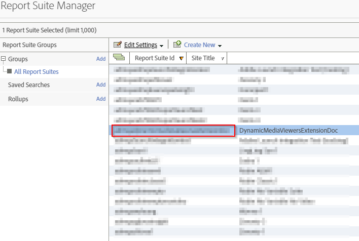
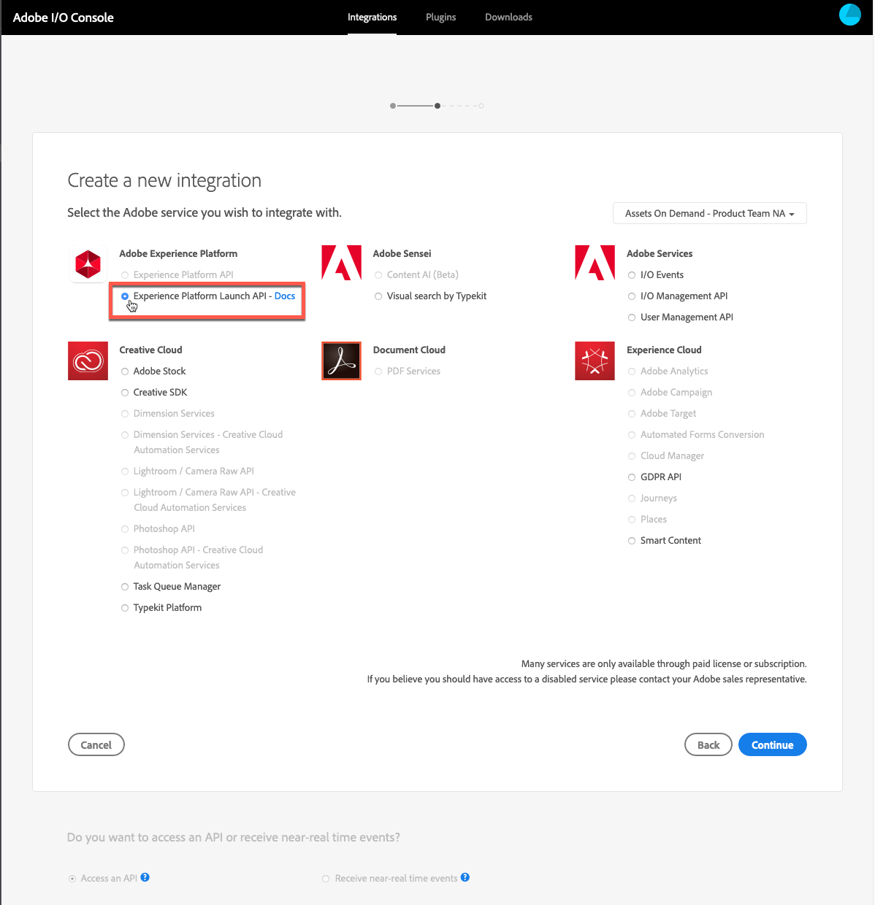

# Dynamic Media 뷰어를 Adobe Analytics 및 Experience Platform Launch {#integrating-dynamic-media-viewers-with-adobe-analytics-and-adobe-launch}과 통합

## Dynamic Media 뷰어와 Adobe Analytics 및 Experience Platform Launch의 통합은 무엇입니까?{#what-is-dynamic-media-viewers-integration-with-adobe-analytics-and-adobe-launch}

<!-- Leave this hidden path here; it points to the topic source from Sasha https://wiki.corp.adobe.com/pages/viewpage.action?spaceKey=~oufimtse&title=Dynamic+Media+Viewers+integration+with+Adobe+Launch -->

platform launch 및 Dynamic Media 뷰어 5.13용 새 *Dynamic Media 뷰어* 확장을 사용하면 Adobe Analytics 및 Platform launch 고객은 Platform launch 구성에 있는 뷰어별 이벤트와 데이터를 사용할 수 있습니다.

이러한 통합은 Adobe Analytics을 사용하여 웹 사이트에서 Dynamic Media 뷰어의 사용을 추적할 수 있음을 의미합니다. 동시에 Adobe 또는 제3자로부터 제공되는 기타 Platform launch 확장 프로그램과 함께 뷰어에 의해 노출된 이벤트와 데이터를 사용할 수 있습니다.

확장 기능에 대한 자세한 내용은 Experience Platform Launch 사용 안내서의 [Adobe 확장](https://experienceleague.adobe.com/docs/launch/using/extensions-ref/overview.html#adobe-extension)을 참조하십시오.

**이 항목은** 사이트 관리자, Adobe Experience Manager 플랫폼의 개발자 및 운영 인력을 대상으로 합니다.

### 통합 제한 사항 {#limitations-of-the-integration}

* Dynamic Media 뷰어에 대한 Experience Platform Launch 통합은 Experience Manager 작성자 노드에서 작동하지 않습니다. WCM 페이지가 게시될 때까지 추적 내용을 볼 수 없습니다.
* Dynamic Media 뷰어에 대한 Experience Platform Launch 통합은 &quot;팝업&quot; 작업 모드에서 지원되지 않습니다. 여기서 [자산 세부 사항] 페이지의 &quot;URL&quot; 단추를 사용하여 뷰어 URL을 가져옵니다.
* Experience Platform Launch 통합은 이전 뷰어 Analytics 통합과 동시에 사용할 수 없습니다(`config2=` 매개 변수).
* 비디오 추적 지원은 [추적 개요](https://experienceleague.adobe.com/docs/media-analytics/using/sdk-implement/track-av-playback/track-core-overview.html#player-events)에 설명된 대로 핵심 재생 추적으로만 제한됩니다. 특히 QoS, 광고, 장/세그먼트 또는 오류 추적은 지원되지 않습니다.
* 데이터 요소에 대한 저장소 기간 구성은 *Dynamic Media 뷰어* 확장 기능을 사용하는 데이터 요소에 대해 지원되지 않습니다. 저장소 기간은 **[!UICONTROL None]**&#x200B;으로 설정해야 합니다.

### 통합 {#use-cases-for-the-integration} 사용 사례

Experience Platform Launch과의 통합에 대한 주요 사용 사례는 Experience Manager 자산 및 Experience Manager 사이트를 모두 사용하는 고객입니다. 이러한 시나리오에서는 Experience Manager 작성자 노드와 Experience Platform Launch 간의 표준 통합을 설정한 다음 사이트 인스턴스를 Experience Platform Launch 속성과 연결할 수 있습니다. 이후에는 사이트 페이지에 추가된 모든 Dynamic Media WCM 구성 요소가 뷰어의 데이터 및 이벤트를 추적합니다.

Experience Manager 사이트](#tracking-dynamic-media-viewers-in-aem-sites)에서 Dynamic Media 뷰어 추적을 참조하십시오.[

통합이 지원하는 보조 사용 사례는 Experience Manager 자산만 사용하는 고객이나 Dynamic Media Classic을 사용하는 고객입니다. 이러한 경우 뷰어용 포함 코드를 입수하여 웹 사이트 페이지에 추가합니다. 그런 다음 Experience Platform Launch에서 Experience Platform Launch 라이브러리 프로덕션 URL을 가져와 웹 페이지 코드에 수동으로 추가합니다.

포함 코드](#tracking-dynamic-media-viewers-using-embed-code)를 사용하여 Dynamic Media 뷰어 추적을 참조하십시오.[

## 통합 {#how-data-and-event-tracking-works-in-the-integration}에서 데이터 및 이벤트 추적이 작동하는 방식

통합은 Dynamic Media 뷰어 추적의 두 가지 개별 유형과 독립적인 유형을 활용합니다.*Adobe Analytics* 및 *오디오 및 비디오용 Adobe Analytics*.

### Adobe Analytics {#about-tracking-using-adobe-analytics} 사용 추적 정보

Adobe Analytics을 사용하면 최종 사용자가 웹 사이트에서 Dynamic Media 뷰어와 상호 작용할 때 수행되는 작업을 추적할 수 있습니다. 또한 Adobe Analytics을 사용하여 뷰어별 데이터를 추적할 수 있습니다. 예를 들어 자산 이름, 발생한 확대/축소 작업 및 비디오 재생 작업과 함께 보기 로드 이벤트를 추적하고 기록할 수 있습니다.

Experience Platform Launch에서 *데이터 요소* 및 *규칙*&#x200B;의 개념이 함께 작동하여 Adobe Analytics 추적을 활성화합니다.

#### Experience Platform Launch {#about-data-elements-in-adobe-launch}의 데이터 요소 정보

Experience Platform Launch의 데이터 요소는 값이 정적으로 정의되거나 웹 페이지 또는 Dynamic Media 뷰어 데이터의 상태에 따라 동적으로 계산되는 명명된 속성입니다.

데이터 요소 정의에 사용할 수 있는 옵션은 Experience Platform Launch 속성에 설치된 확장 목록에 따라 다릅니다. &quot;코어&quot; 익스텐션은 사전 설치되어 있으며 모든 구성에서 즉시 사용할 수 있습니다. 이 &quot;코어&quot; 확장을 사용하면 쿠키, JavaScript 코드, 쿼리 문자열 및 기타 많은 소스에서 나오는 값을 데이터 요소를 정의할 수 있습니다.

Adobe Analytics 추적의 경우 [Extension 설치 및 설정](#installing-and-setup-of-extensions)에 설명된 대로 다른 여러 확장을 설치해야 합니다. Dynamic Media 뷰어 확장은 Dynamic Viewer 이벤트의 인수인 데이터 요소를 정의하는 기능을 추가합니다. 예를 들어 로드 시 뷰어에서 보고한 뷰어 유형 또는 자산 이름, 최종 사용자가 확대/축소하면 보고되는 확대/축소 수준 등을 참조할 수 있습니다.

Dynamic Media 뷰어 확장은 자동으로 데이터 요소의 값을 최신 상태로 유지합니다.

데이터 요소를 정의한 후에는 데이터 요소 선택기 위젯을 사용하여 Experience Platform Launch UI의 다른 위치에서 데이터 요소를 사용할 수 있습니다. 특히, Dynamic Media 뷰어 추적의 목적으로 정의된 데이터 요소는 규칙에서 Adobe Analytics 확장 프로그램의 변수 설정 동작에 의해 참조됩니다(아래 참조).

Experience Platform Launch 사용 안내서의 [데이터 요소](https://experienceleague.adobe.com/docs/launch/using/reference/manage-resources/data-elements.html#reference)를 참조하십시오.

#### Experience Platform Launch {#about-rules-in-adobe-launch}의 규칙 정보

Experience Platform Launch의 규칙은 규칙을 구성하는 3개의 영역을 정의하는 독립적인 구성입니다.*이벤트*, *조건* 및 *액션*:

* *이벤트* (if)는 규칙을 트리거할 시기를 Experience Platform Launch에 알립니다.
* *조건* (if)은 규칙을 트리거할 때 허용하거나 허용하지 않을 다른 제한 사항을 Experience Platform Launch에 알립니다.
* *작업* (그런 다음)은 규칙이 트리거될 때 수행할 작업을 Experience Platform Launch에 알려줍니다.

이벤트, 조건 및 작업 섹션에서 사용할 수 있는 옵션은 Experience Platform Launch 속성에 설치된 확장에 따라 다릅니다. *Core* 확장이 사전 설치되어 있으며 모든 구성에서 즉시 사용할 수 있습니다. 익스텐션은 포커스 변경, 키 누르기 및 양식 제출 등을 포함하는 기본 브라우저 수준 동작과 같은 이벤트에 대한 여러 옵션을 제공합니다. 또한 쿠키 값, 브라우저 유형 등과 같은 조건에 대한 옵션도 포함되어 있습니다. 작업의 경우 사용자 지정 코드 옵션만 사용할 수 있습니다.

Adobe Analytics 추적을 수행하려면 [Extension 설치 및 설정](#installing-and-setup-of-extensions)에 설명된 대로 다른 확장 기능을 설치해야 합니다. 구체적으로:

* Dynamic Media 뷰어 익스텐션은 지원되는 이벤트 목록을 뷰어 로드, 에셋 교체, 확대 및 비디오 재생과 같은 Dynamic Media 뷰어 전용으로 확장되는 이벤트로 확장합니다.
* Adobe Analytics 익스텐션은 데이터를 추적 서버로 전송하는 데 필요한 2가지 작업으로 지원되는 작업 목록을 확장합니다.*변수* 및 *비콘 보내기*&#x200B;를 설정합니다.

Dynamic Media 뷰어를 추적하기 위해 다음 유형의 항목을 사용할 수 있습니다.

* Dynamic Media 뷰어 확장, 코어 확장 또는 기타 확장 프로그램의 이벤트입니다.
* 규칙 정의의 조건. 또는 조건 영역을 비워 둘 수 있습니다.

작업 섹션에서 *변수 설정* 작업이 필요합니다. 이 작업은 Adobe Analytics에서 추적 변수를 데이터로 채우는 방법을 설명합니다. 동시에 *변수 설정* 동작은 추적 서버로 아무 것도 전송하지 않습니다.

*변수 설정* 액션 뒤에 *비콘 보내기* 작업이 와야 합니다. *비콘 보내기* 작업은 실제로 데이터를 분석 추적 서버로 보냅니다. 두 작업 모두, *변수 설정* 및 *비콘 전송*&#x200B;은 Adobe Analytics 확장 프로그램에서 가져옵니다.

Experience Platform Launch 사용 안내서의 [규칙](https://experienceleague.adobe.com/docs/launch/using/reference/manage-resources/rules.html#reference)을 참조하십시오.

#### 샘플 구성 {#sample-configuration}

Experience Platform Launch 내의 다음 샘플 구성은 뷰어 로드 시 자산 이름을 추적하는 방법을 보여 줍니다.

1. **[!UICONTROL 데이터 요소]** 탭에서 Dynamic Media 뷰어 확장 프로그램에서 `LOAD` 이벤트의 `asset` 매개 변수를 참조하는 데이터 요소 `AssetName`를 정의합니다.

   

1. **[!UICONTROL 규칙]** 탭에서 규칙 *TrackAssetOnLoad*&#x200B;을 정의합니다.

   이 규칙에서, **[!UICONTROL 이벤트]** 필드는 Dynamic Media 뷰어 확장의 **[!UICONTROL LOAD]** 이벤트를 사용합니다.

   

1. 작업 구성에는 Adobe Analytics 확장 버전에서 두 가지 작업 유형이 있습니다.

   *선택한 분석 변수를* 데이터 요소 값에 매핑하는 변수를  `AssetName` 설정합니다.

   *Adobe Analytics에 추적 정보를 보내는 비콘* 보내기

   

1. 결과 규칙 구성은 다음과 같습니다.

   

### 오디오 및 비디오용 Adobe Analytics 정보 {#about-adobe-analytics-for-audio-and-video}

Experience Cloud 계정이 오디오 및 비디오에 Adobe Analytics 사용을 구독하는 경우 *Dynamic Media 뷰어* 확장 설정에서 비디오 추적을 활성화하기에 충분합니다. 비디오 지표를 Adobe Analytics에서 사용할 수 있게 됩니다. 비디오 추적은 오디오 및 비디오용 Adobe Medium 분석 확장이 있는지에 따라 다릅니다.

[확장 설치 및 설정](#installing-and-setup-of-extensions)을 참조하십시오.

현재 비디오 추적 지원은 [추적 개요](https://experienceleague.adobe.com/docs/media-analytics/using/sdk-implement/track-av-playback/track-core-overview.html#player-events)에 설명된 대로 &quot;핵심 재생&quot; 추적으로만 제한됩니다. 특히 QoS, 광고, 장/세그먼트 또는 오류 추적은 지원되지 않습니다.

## Dynamic Media 뷰어 확장 사용 {#using-the-dynamic-media-viewers-extension}

[통합 사용 사례](#use-cases-for-the-integration)에 언급된 대로, Experience Manager 사이트의 새 Experience Platform Launch 통합으로 Dynamic Media 뷰어를 추적하고 포함 코드를 사용할 수 있습니다.

### Experience Manager 사이트에서 Dynamic Media 뷰어 추적 {#tracking-dynamic-media-viewers-in-aem-sites}

Experience Manager 사이트에서 Dynamic Media 뷰어를 추적하려면 [모든 통합 부분 구성](#configuring-all-the-integration-pieces) 섹션 아래에 나열된 모든 단계를 수행해야 합니다. 특히 IMS 구성과 Experience Platform Launch 클라우드 구성을 만들어야 합니다.

적절한 구성을 따르면 Dynamic Media에서 지원하는 WCM 구성 요소를 사용하여 사이트 페이지에 추가하는 모든 Dynamic Media 뷰어는 Adobe Analytics 또는 비디오용 Adobe Analytics 또는 두 가지 모두에 대한 데이터를 자동으로 추적합니다.

Adobe 사이트](/help/assets/dynamic-media/adding-dynamic-media-assets-to-pages.md)를 사용하여 페이지에 Dynamic Media 자산 추가를 참조하십시오.[

### 포함 코드 {#tracking-dynamic-media-viewers-using-embed-code}을(를) 사용하여 Dynamic Media 뷰어 추적

Experience Manager 사이트를 사용하지 않거나 Dynamic Media 뷰어를 Experience Manager 사이트 외부의 웹 페이지에 포함시키거나 둘 다 Experience Platform Launch 통합을 사용할 수 있습니다.

[Adobe Analytics](#configuring-adobe-analytics-for-the-integration) 구성 및 [Experience Platform Launch 구성](#configuring-adobe-launch-for-the-integration) 섹션에서 구성 단계를 완료합니다. 그러나 Experience Manager 관련 구성 단계는 필요하지 않습니다.

적절한 구성을 따르면 Dynamic Media 뷰어가 있는 웹 페이지에 Experience Platform Launch 지원을 추가할 수 있습니다.

Experience Platform Launch 라이브러리 포함 코드 사용 방법에 대한 자세한 내용은 [Experience Platform Launch 포함 코드 추가](https://experienceleague.adobe.com/docs/launch-learn/implementing-in-websites-with-launch/configure-launch/launch-add-embed.html#configure-launch)를 참조하십시오.

Experience Manager Dynamic Media의 포함 코드 기능을 사용하는 방법에 대한 자세한 내용은 [웹 페이지에 비디오 또는 이미지 뷰어 포함](/help/assets/dynamic-media/embed-code.md)을 참조하십시오.

**포함 코드를 사용하여 Dynamic Media 뷰어를 추적하려면**:

1. Dynamic Media 뷰어를 포함할 준비가 된 웹 페이지를 만듭니다.
1. Experience Platform Launch에 먼저 로그인하여 Experience Platform Launch 라이브러리에 대한 포함 코드를 얻습니다([Experience Platform Launch 구성](#configuring-adobe-launch-for-the-integration) 참조).
1. **[!UICONTROL 속성]**&#x200B;을 클릭한 다음 **[!UICONTROL 환경]** 탭을 클릭합니다.
1. 웹 페이지의 환경과 관련된 환경 수준을 선택합니다. 그런 다음 **[!UICONTROL 설치]** 열에서 상자 아이콘을 클릭합니다.
1. **[!UICONTROL [웹 설치 지침]]** 대화 상자에서 전체 Experience Platform Launch 라이브러리 포함 코드를 주변 태그와 함께  `<script/>` 복사합니다.

## Dynamic Media 뷰어 확장 {#reference-guide-for-the-dynamic-media-viewers-extension}에 대한 참조 안내서

### Dynamic Media 뷰어 구성 정보 {#about-the-dynamic-media-viewers-configuration}

아래 조건이 true이면 Dynamic Media Viewer Extension이 Experience Platform Launch 라이브러리와 자동으로 통합됩니다.

* Experience Platform Launch 라이브러리 글로벌 개체( `_satellite`)가 페이지에 있습니다.
* Dynamic Media 뷰어 확장 함수 `_dmviewers_v001()`이(가) `_satellite`에 정의되어 있습니다.

* `config2=` 뷰어 매개 변수가 지정되지 않았습니다. 즉, 뷰어는 기존 Analytics 통합을 사용하지 않습니다.

또한 뷰어의 구성에서 `launch=0` 매개 변수를 지정하여 뷰어에서 Experience Platform Launch 통합을 명시적으로 비활성화하는 옵션이 있습니다. 이 매개 변수의 기본값은 `1`입니다.

### Dynamic Media 뷰어 확장 구성 {#configuring-the-dynamic-media-viewers-extension}

Dynamic Media 뷰어 확장 기능에 대한 유일한 구성 옵션은 **[!UICONTROL 오디오 및 비디오에 대한 Adobe Medium 분석 활성화]**&#x200B;입니다.

이 옵션을 선택(활성화)하고 오디오 및 비디오용 Adobe Medium Analytics 확장 기능이 설치 및 구성되면 비디오 재생 지표가 오디오 및 비디오용 Adobe Analytics 솔루션으로 전송됩니다. 이 옵션을 비활성화하면 비디오 추적이 꺼집니다.

오디오 및 비디오용 Adobe Medium Analytics 확장 프로그램을 설치하지 않고 *이(가) 옵션을 활성화하면 옵션이 아무런 영향을 주지 않습니다.*

### Dynamic Media 뷰어 확장 {#about-data-elements-in-the-dynamic-media-viewers-extension}의 데이터 요소 정보

Dynamic Media 뷰어 확장이 제공하는 데이터 요소 유형은 **[!UICONTROL 데이터 요소 유형]** 드롭다운 목록에서 **[!UICONTROL 뷰어 이벤트]**&#x200B;뿐입니다.

이 옵션을 선택하면 데이터 요소 편집기가 두 개의 필드가 있는 양식을 렌더링합니다.

* **[!UICONTROL DM 뷰어 이벤트 데이터 유형]**  - 인수가 있는 Dynamic Media 뷰어 확장이 지원하는 모든 뷰어 이벤트와 특수 COMMONitem을 식별하는  **** 드롭다운 목록입니다. **[!UICONTROL COMMON]** 항목은 뷰어에서 보낸 모든 유형의 이벤트에 공통으로 표시되는 이벤트 매개 변수 목록을 나타냅니다.
* **[!UICONTROL 추적 매개]**  변수 - 선택한 Dynamic Media 뷰어 이벤트의 인수입니다.

각 뷰어 유형별로 지원되는 이벤트 목록은 [Dynamic Media 뷰어 참조 안내서](https://experienceleague.adobe.com/docs/dynamic-media-developer-resources/library/viewers-aem-assets-dmc/c-html5-s7-aem-asset-viewers.html)를 참조하십시오.특정 뷰어 섹션으로 이동한 다음 Adobe Analytics 추적 지원 하위 섹션을 클릭합니다. 현재 Dynamic Media 뷰어 참조 안내서는 이벤트 인수를 문서화하지 않습니다.

이제 Dynamic Media 뷰어 *데이터 요소*&#x200B;의 라이프사이클을 고려하겠습니다. 이러한 데이터 요소의 값은 해당 Dynamic Media 뷰어 이벤트가 페이지에서 발생한 후에 채워집니다. 예를 들어 데이터 요소가 **[!UICONTROL LOAD]** 이벤트와 그 &quot;asset&quot; 인수를 가리키면 됩니다. 이러한 데이터 요소의 값은 뷰어가 처음으로 LOAD 이벤트를 실행한 후 유효한 데이터를 받습니다. 데이터 요소가 **[!UICONTROL ZOOM]** 이벤트와 그 &quot;scale&quot; 인수를 가리키는 경우 뷰어가 처음으로 **[!UICONTROL ZOOM]** 이벤트를 보낼 때까지 해당 데이터 요소의 값은 비어 있습니다.

마찬가지로 뷰어가 페이지에서 해당 이벤트를 전송하면 데이터 요소 값이 자동으로 업데이트됩니다. 값 업데이트는 규칙 구성에 특정 이벤트가 지정되지 않은 경우에도 발생합니다. 예를 들어 데이터 요소 **[!UICONTROL ZoomScale]**&#x200B;이 ZOOM 이벤트의 &quot;scale&quot; 매개 변수에 대해 정의되어 있다고 가정합니다. 하지만 규칙 구성에 있는 유일한 규칙은 **[!UICONTROL LOAD]** 이벤트에 의해 트리거됩니다. 사용자가 뷰어 내에서 확대/축소를 실행할 때마다 **[!UICONTROL ZoomScale]** 값이 계속 업데이트됩니다.

모든 Dynamic Media 뷰어는 웹 페이지에 고유한 식별자를 가집니다. 데이터 요소는 값 자체를 추적하고 값을 채운 뷰어를 추적합니다. 예를 들어 동일한 페이지에 여러 뷰어가 있고 **[!UICONTROL LOAD]** 이벤트와 그 &quot;asset&quot; 인수를 가리키는 **[!UICONTROL AssetName]** 데이터 요소가 있다고 가정합니다. **[!UICONTROL AssetName]** 데이터 요소는 페이지에 로드된 각 뷰어와 연결된 에셋 이름 컬렉션을 유지합니다.

데이터 요소에서 반환되는 정확한 값은 컨텍스트에 따라 다릅니다. Dynamic Media 뷰어 이벤트에 의해 트리거된 규칙에서 데이터 요소가 요청되면 규칙을 시작한 뷰어에 대해 데이터 요소 값이 반환됩니다. 또한 데이터 요소는 다른 Platform launch 확장의 이벤트로 트리거된 규칙에서 요청됩니다. 이때 데이터 요소의 값은 이 데이터 요소를 마지막으로 업데이트한 뷰어에서 가져옵니다.

**다음 샘플 설정을 고려해 보십시오**.

* 2개의 Dynamic Media 확대/축소 뷰어가 있는 웹 페이지:*viewer1* 및 *viewer2*.

* **[!UICONTROL ZoomScaleData]** 요소는 ZOOMevent 및  **** &quot;scale&quot; 인수를 가리킵니다.
* **[!UICONTROL 다음]** 과 함께 TrackPanRule:

   * Dynamic Media 뷰어 **[!UICONTROL PAN]** 이벤트를 트리거로 사용합니다.
   * **[!UICONTROL ZoomScale]** 데이터 요소의 값을 Adobe Analytics으로 보냅니다.

* **[!UICONTROL 다음]** 과 함께 TrackKeyRule:

   * 핵심 Experience Platform Launch 확장의 키 누르기 이벤트를 트리거로 사용합니다.
   * **[!UICONTROL ZoomScale]** 데이터 요소의 값을 Adobe Analytics으로 보냅니다.

이제 최종 사용자가 두 뷰어와 함께 웹 페이지를 로드한다고 가정합니다. *viewer1*&#x200B;에서는 50% 비율로 확대됩니다.그런 다음 *viewer2*&#x200B;에서 25% 비율로 확대합니다. *viewer1*&#x200B;에서는 이미지를 주위로 이동하고 마지막으로 키보드의 키를 누릅니다.

최종 사용자의 활동은 Adobe Analytics에 대해 다음과 같은 2개의 추적 호출을 만듭니다.

* 첫 번째 호출은 사용자가 *viewer1*&#x200B;에서 이동할 때 **[!UICONTROL TrackPan]** 규칙이 트리거되기 때문에 발생합니다. 데이터 요소는 규칙이 *viewer1*&#x200B;에 의해 트리거되고 해당 크기 조절 값을 가져오기 때문에 해당 호출은 **[!UICONTROL ZoomScale]** 데이터 요소의 값으로 50%를 전송합니다.
* 두 번째 호출은 사용자가 키보드에서 키를 누를 때 **[!UICONTROL TrackKey]** 규칙이 트리거되기 때문에 발생합니다. 규칙이 뷰어에 의해 트리거되지 않았으므로 이 호출은 **[!UICONTROL ZoomScale]** 데이터 요소의 값으로 25%를 전송합니다. 따라서 데이터 요소는 최신 값을 반환합니다.

위에 설정된 샘플 세트는 데이터 요소 값의 수명 부분에도 영향을 줍니다. Dynamic Media 뷰어에서 관리하는 데이터 요소의 값은 뷰어 자체가 웹 페이지에서 삭제된 후에도 Experience Platform Launch 라이브러리 코드에 저장됩니다. 이 기능은 Dynamic Media 뷰어가 아닌 확장명으로 트리거되는 규칙이 있고 이러한 데이터 요소를 참조하는 경우 데이터 요소는 마지막으로 알려진 값을 반환합니다. 뷰어가 웹 페이지에 더 이상 존재하지 않는 경우에도.

어떤 경우에도 Dynamic Media 뷰어에서 파생된 데이터 요소의 값은 로컬 저장소 또는 서버에 저장되지 않습니다.대신 클라이언트측 Experience Platform Launch 라이브러리에만 보관됩니다. 이러한 데이터 요소의 값은 웹 페이지가 다시 로드될 때 사라집니다.

일반적으로 데이터 요소 편집기는 [스토리지 기간 선택](https://experienceleague.adobe.com/docs/launch/using/reference/manage-resources/data-elements.html?lang=en#create-a-data-element)을 지원합니다. 그러나 Dynamic Media 뷰어 확장을 사용하는 데이터 요소는 **[!UICONTROL 없음]**&#x200B;의 저장 시간 옵션만 지원합니다. 사용자 인터페이스에서는 다른 값을 설정할 수 있지만 이 경우에는 데이터 요소 동작이 정의되지 않습니다. 확장은 데이터 요소의 값을 직접 관리합니다.전체 뷰어 수명 주기 동안 뷰어 이벤트 인수의 값을 유지하는 데이터 요소입니다.

### Dynamic Media 뷰어 확장 {#about-rules-in-the-dynamic-media-viewers-extension}의 규칙 정보

규칙 편집기에서 확장 프로그램은 이벤트 편집기에 대한 새 구성 옵션을 추가합니다. 또한 편집기에서는 미리 구성된 데이터 요소를 사용하는 대신 작업 편집기에서 이벤트 매개 변수를 간단한 옵션으로 수동으로 참조하는 옵션을 제공합니다.

#### 이벤트 편집기 {#about-the-events-editor} 정보

이벤트 편집기에서 Dynamic Media 뷰어 확장이 **[!UICONTROL 뷰어 이벤트]**&#x200B;라는 **[!UICONTROL 이벤트 유형]**&#x200B;을 추가합니다.

이 옵션을 선택하면 이벤트 편집기가 드롭다운 **[!UICONTROL Dynamic Media 뷰어 이벤트]**&#x200B;를 렌더링하여 Dynamic Media 뷰어에서 지원하는 모든 사용 가능한 이벤트를 나열합니다.

#### 작업 편집기 {#about-the-actions-editor} 정보

Dynamic Media 뷰어 확장 기능을 사용하면 Dynamic Media 뷰어의 이벤트 매개 변수를 사용하여 Adobe Analytics 확장 프로그램의 변수 설정 편집기에 있는 분석 변수에 매핑할 수 있습니다.

가장 간단한 방법은 다음 2단계 프로세스를 완료하는 것입니다.

* 먼저 하나 이상의 데이터 요소를 정의합니다. 각 데이터 요소는 Dynamic Media 뷰어 이벤트의 매개 변수를 나타냅니다.
* 마지막으로 Adobe Analytics 확장의 변수 설정 편집기에서 데이터 요소 선택기 아이콘(3개의 스택된 디스크)을 클릭하여 데이터 요소 선택 대화 상자를 연 다음, 여기에서 데이터 요소를 선택합니다.

그러나 대체 방법을 사용하고 데이터 요소 생성을 무시할 수 있습니다. Dynamic Media 뷰어 이벤트의 인수를 직접 참조할 수 있습니다. Analytics 변수 할당의 **[!UICONTROL value]** 입력 필드에 이벤트 인수의 정규화된 이름을 입력합니다. 퍼센트(%) 기호를 둘러싸야 합니다. 예,

`%event.detail.dm.LOAD.asset%`

데이터 요소 사용과 직접 이벤트 인수 참조 간에는 중요한 차이가 있습니다. 데이터 요소의 경우 변수 설정 작업을 트리거하는 이벤트는 중요하지 않습니다. 규칙을 트리거하는 이벤트는 Dynamic Viewer와 무관할 수 있습니다(예: Core Extension에서 웹 페이지 클릭). 그러나 직접 인수를 사용할 때는 규칙을 트리거하는 이벤트가 참조하는 이벤트 인수와 일치하는지 확인하는 것이 중요합니다.

예를 들어, Dynamic Media Viewer 확장의 **[!UICONTROL LOAD]** 이벤트에 의해 규칙이 트리거되는 경우 `%event.detail.dm.LOAD.asset%`을 참조하면 올바른 에셋 이름을 반환합니다. 그러나 다른 이벤트에 대해 빈 값을 반환합니다.

다음 표는 Dynamic Media 뷰어 이벤트와 지원되는 인수를 나열합니다.

<table>
 <tbody>
  <tr>
   <td>뷰어 이벤트 이름</td>
   <td>인수 참조</td>
  </tr>
  <tr>
   <td><code>COMMON</code></td>
   <td><code>%event.detail.dm.objID%</code></td>
  </tr>
  <tr>
   <td> </td>
   <td><code>%event.detail.dm.compClass%</code></td>
  </tr>
  <tr>
   <td> </td>
   <td><code>%event.detail.dm.instName%</code></td>
  </tr>
  <tr>
   <td> </td>
   <td><code>%event.detail.dm.timeStamp%</code></td>
  </tr>
  <tr>
   <td><code>BANNER</code> </td>
   <td><code>%event.detail.dm.BANNER.asset%</code></td>
  </tr>
  <tr>
   <td> </td>
   <td><code>%event.detail.dm.BANNER.frame%</code></td>
  </tr>
  <tr>
   <td> </td>
   <td><code>%event.detail.dm.BANNER.label%</code></td>
  </tr>
  <tr>
   <td><code>HREF</code></td>
   <td><code>%event.detail.dm.HREF.rollover%</code></td>
  </tr>
  <tr>
   <td><code>ITEM</code></td>
   <td><code>%event.detail.dm.ITEM.rollover%</code></td>
  </tr>
  <tr>
   <td><code>LOAD</code></td>
   <td><code>%event.detail.dm.LOAD.applicationname%</code></td>
  </tr>
  <tr>
   <td><strong> </strong></td>
   <td><code>%event.detail.dm.LOAD.asset%</code></td>
  </tr>
  <tr>
   <td><strong> </strong></td>
   <td><code>%event.detail.dm.LOAD.company%</code></td>
  </tr>
  <tr>
   <td><strong> </strong></td>
   <td><code>%event.detail.dm.LOAD.sdkversion%</code></td>
  </tr>
  <tr>
   <td><strong> </strong></td>
   <td><code>%event.detail.dm.LOAD.viewertype%</code></td>
  </tr>
  <tr>
   <td><strong> </strong></td>
   <td><code>%event.detail.dm.LOAD.viewerversion%</code></td>
  </tr>
  <tr>
   <td><code>METADATA</code></td>
   <td><code>%event.detail.dm.METADATA.length%</code></td>
  </tr>
  <tr>
   <td> </td>
   <td><code>%event.detail.dm.METADATA.type%</code></td>
  </tr>
  <tr>
   <td><code>MILESTONE</code></td>
   <td><code>%event.detail.dm.MILESTONE.milestone%</code></td>
  </tr>
  <tr>
   <td><code>PAGE</code></td>
   <td><code>%event.detail.dm.PAGE.frame%</code></td>
  </tr>
  <tr>
   <td> </td>
   <td><code>%event.detail.dm.PAGE.label%</code></td>
  </tr>
  <tr>
   <td><code>PAUSE</code></td>
   <td><code>%event.detail.dm.PAUSE.timestamp%</code></td>
  </tr>
  <tr>
   <td><code>PLAY</code></td>
   <td><code>%event.detail.dm.PLAY.timestamp%</code></td>
  </tr>
  <tr>
   <td><code>SPIN</code></td>
   <td><code>%event.detail.dm.SPIN.framenumber%</code></td>
  </tr>
  <tr>
   <td><code>STOP</code></td>
   <td><code>%event.detail.dm.STOP.timestamp%</code></td>
  </tr>
  <tr>
   <td><code>SWAP</code></td>
   <td><code>%event.detail.dm.SWAP.asset%</code></td>
  </tr>
  <tr>
   <td><code>SWATCH</code></td>
   <td><code>%event.detail.dm.SWATCH.frame%</code></td>
  </tr>
  <tr>
   <td> </td>
   <td><code>%event.detail.dm.SWATCH.label%</code></td>
  </tr>
  <tr>
   <td><code>TARG</code></td>
   <td><code>%event.detail.dm.TARG.frame%</code></td>
  </tr>
  <tr>
   <td> </td>
   <td><code>%event.detail.dm.TARG.label%</code></td>
  </tr>
  <tr>
   <td><code>ZOOM</code></td>
   <td><code>%event.detail.dm.ZOOM.scale%</code></td>
  </tr>
 </tbody>
</table>

## 모든 통합 부분 구성 {#configuring-all-the-integration-pieces}

**시작하기 전에**

Adobe은 전체 통합을 이해하도록 이 섹션 전에 모든 설명서를 철저히 검토할 것을 권장합니다.

이 섹션에서는 오디오 및 비디오용 Adobe Analytics 및 Adobe Analytics과 Dynamic Media 뷰어를 통합하는 데 필요한 구성 단계를 설명합니다. Experience Platform Launch에서 다른 목적으로 Dynamic Media 뷰어 확장 기능을 사용할 수는 있지만 이러한 시나리오는 이 설명서에서 다루지 않습니다.

다음 Adobe 제품을 사용하여 통합을 구성합니다.

* Adobe Analytics - 추적 변수 및 보고서를 구성하는 데 사용됩니다.
* Experience Platform Launch - 속성, 하나 이상의 규칙 및 하나 이상의 데이터 요소를 정의하여 뷰어 추적을 활성화하는 데 사용됩니다.

또한 이 통합 솔루션이 Experience Manager 사이트에서 사용되는 경우 다음 구성을 수행해야 합니다.

* Adobe I/O 콘솔 - Experience Platform Launch에 대한 통합이 생성됩니다.
* Experience Manager 작성자 노드 - IMS 구성 및 Experience Platform Launch 클라우드 구성

구성의 일부로 Adobe Analytics 및 Experience Platform Launch이 이미 활성화된 Adobe Experience Cloud의 회사에 대한 액세스 권한이 있어야 합니다.

## 통합 {#configuring-adobe-analytics-for-the-integration}에 대해 Adobe Analytics 구성

Adobe Analytics을 구성한 후 통합에 대해 다음과 같이 설정됩니다.

* 보고서 세트가 제자리에 있고 선택됩니다.
* 분석 변수를 사용하여 추적 데이터를 수신할 수 있습니다.
* Adobe Analytics 내에서 수집된 데이터를 보는 데 보고서를 사용할 수 있습니다.

[분석 구현 안내서](https://experienceleague.adobe.com/docs/analytics/implementation/home.html)도 참조하십시오.

**통합을 위해 Adobe Analytics을 구성하려면 다음을 수행하십시오**.

1. 먼저 Experience Cloud [홈 페이지](https://exc-home.experiencecloud.adobe.com/exc-home/home.html#/)에서 Adobe Analytics에 액세스하십시오. 메뉴 모음에서 페이지 오른쪽 위 모서리 근처에 있는 솔루션 아이콘(3 x 3 점 테이블)을 클릭한 다음 **[!UICONTROL 분석]**&#x200B;을 클릭합니다.

   

   이제 보고서 세트를 선택합니다.

### 보고서 세트 {#selecting-a-report-suite} 선택

1. Adobe Analytics 페이지의 오른쪽 위 모서리 근처에 있는 **[!UICONTROL 보고서 검색]** 필드 오른쪽의 드롭다운 목록에서 올바른 보고서 세트를 선택합니다. 사용할 수 있는 보고서 세트가 여러 개 있고 사용할 보고서 세트가 확실치 않은 경우에는 사용할 보고서 세트를 선택하는 데 도움이 되는 Adobe Analytics 관리자에게 문의하십시오.

   아래 그림에서 사용자가 *DynamicMediaViewersExtensionDoc*&#x200B;이라는 보고서 세트를 만들고 드롭다운 목록에서 이 보고서 세트를 선택했습니다. 보고서 세트 이름은 일러스트레이션용으로만 사용됩니다. 최종적으로 선택하는 보고서 세트의 이름은 사용자에게 달려 있습니다.

   사용할 수 있는 보고서 세트가 없는 경우, 사용자나 Adobe Analytics 관리자가 보고서 세트를 먼저 만든 후 구성을 계속 진행할 수 있습니다.

   [보고서 및 보고서 세트](https://experienceleague.adobe.com/docs/analytics/admin/manage-report-suites/report-suites-admin.html#manage-report-suites) 및 [보고서 세트 만들기](https://experienceleague.adobe.com/docs/analytics/admin/admin-console/create-report-suite.html#admin-console)를 참조하십시오.

   Adobe Analytics에서 보고서 세트는 **[!UICONTROL 관리 > 보고서 세트]**&#x200B;에서 관리됩니다.

   

   이제 Adobe Analytics 변수를 설정합니다.

### Adobe Analytics 변수 {#setting-up-adobe-analytics-variables} 설정

1. 웹 페이지에서 Dynamic Media 뷰어 동작을 추적하는 데 사용할 하나 이상의 Adobe Analytics 변수를 지정합니다.

   Adobe Analytics에서 지원하는 모든 유형의 변수를 사용할 수 있습니다. 변수 유형(예: 사용자 지정 트래픽 [prop], 전환 [eVar])에 대한 결정은 Analytics 구현의 특정 요구 사항에 의해 결정됩니다.

   [prop 및 eVar 개요](https://experienceleague.adobe.com/docs/analytics/implementation/vars/page-vars/evar.html#vars)를 참조하십시오.

   이 문서의 목적에 따라, 웹 페이지에서 작업이 발생한 후 몇 분 내에 Analytics 보고서에서 사용할 수 있기 때문에 사용자 지정 트래픽(prop) 변수만 사용됩니다.

   새 사용자 지정 트래픽 변수를 활성화하려면 Adobe Analytics의 도구 모음에서 **[!UICONTROL 관리 > 보고서 세트]**&#x200B;를 클릭합니다.

1. **[!UICONTROL 보고서 세트 관리자]** 페이지에서 올바른 보고서를 선택한 다음 도구 모음에서 **[!UICONTROL 설정 편집 > 트래픽 > 트래픽 변수]**&#x200B;를 클릭합니다.
1. 여기에서 사용하지 않는 변수를 선택하고, 설명형 이름( **[!UICONTROL 뷰어 자산(prop 30)]**)을 지정하고, 콤보 상자를 활성화됨 열에서 &quot;활성화됨&quot;으로 변경합니다.

   다음 스크린샷은 뷰어에서 사용하는 자산 이름을 추적하기 위한 사용자 지정 트래픽 변수( **[!UICONTROL prop30]**)의 예입니다.

   

1. 변수 목록 맨 아래에서 **[!UICONTROL 저장]**&#x200B;을 클릭합니다.

### 보고서 {#setting-up-a-report} 설정

1. 일반적으로 Adobe Analytics에서 보고서를 설정하는 것은 특정 프로젝트 요구에 의해 수행됩니다. 따라서 세부 보고서 설정은 이 통합의 범위를 벗어납니다.

   그러나 **[Adobe Analytics 변수 설정](#setting-up-adobe-analytics-variables)**&#x200B;에서 사용자 지정 트래픽 변수를 설정한 후 Adobe Analytics에서 사용자 지정 트래픽 보고서를 자동으로 사용할 수 있게 되는 것을 알기에 충분합니다.

   예를 들어 **[!UICONTROL 뷰어 에셋(prop 30)]** 변수에 대한 보고서는 **[!UICONTROL 사용자 지정 트래픽 > 사용자 지정 트래픽 21-30 > 뷰어 에셋(prop 30)]**&#x200B;의 보고서 메뉴에서 사용할 수 있습니다.

   **[!UICONTROL 뷰어 에셋(prop 30)]** 작성 후 바로 이 보고서를 방문하면 데이터가 표시되지 않습니다.통합에서 이 시점에서 필요합니다.

   

## 통합 {#configuring-adobe-launch-for-the-integration}에 대한 Experience Platform Launch 구성

Experience Platform Launch을 구성한 후 통합에 대해 다음과 같이 설정됩니다.

* 모든 구성을 함께 유지할 새 속성을 만듭니다.
* 확장 설치 및 설정 속성에 설치된 모든 확장의 클라이언트측 코드는 라이브러리로 컴파일됩니다. 이 라이브러리는 나중에 웹 페이지에서 사용됩니다.
* 데이터 요소 및 규칙 구성을 참조하십시오. 이 구성은 Dynamic Media 뷰어에서 캡처할 데이터, 추적 로직을 트리거할 시기 및 Adobe Analytics에서 뷰어 데이터를 보낼 위치를 정의합니다.
* 라이브러리 게시.

**통합에 대한 Experience Platform Launch을 구성하려면 다음을 수행하십시오**.

1. 먼저 Experience Cloud [홈 페이지](https://exc-home.experiencecloud.adobe.com/exc-home/home.html#/)에서 Experience Platform Launch에 액세스하십시오. 메뉴 모음에서 페이지 오른쪽 위 모서리 근처에 있는 솔루션 아이콘(3개 항목 테이블)을 클릭한 다음 **[!UICONTROL 실행]**&#x200B;을 클릭합니다.

   [Experience Platform Launch을 직접 열 수도 있습니다](https://launch.adobe.com/).

   

### Experience Platform Launch {#creating-a-property-in-adobe-launch}에서 속성 만들기

Experience Platform Launch의 속성은 모든 설정을 함께 유지하는 이름이 지정된 구성입니다. 구성 설정의 라이브러리가 생성되고 다른 환경 수준(개발, 스테이징 및 프로덕션)에 게시됩니다.

[론치 속성 만들기](https://experienceleague.adobe.com/docs/launch-learn/implementing-in-mobile-android-apps-with-launch/configure-launch/launch-create-a-property.html#configure-launch)를 참조하십시오.

1. Experience Platform Launch에서 **[!UICONTROL 새 속성]**&#x200B;을 클릭합니다.
1. **[!UICONTROL 속성 만들기]** 대화 상자의 **[!UICONTROL 이름]** 필드에 웹 사이트의 제목과 같은 설명형 이름을 입력합니다. 예, `DynamicMediaViewersProp.`
1. **[!UICONTROL 도메인]** 필드에 웹 사이트의 도메인을 입력합니다.
1. **[!UICONTROL 고급 옵션]** 드롭다운에서 사용하려는 확장 프로그램(이 경우 *Dynamic Media 뷰어*&#x200B;이(가) 아직 릴리스되지 않은 경우 **[!UICONTROL 확장 개발을 위한 구성(나중에 수정할 수 없음)]**&#x200B;을 활성화합니다.

   

1. **[!UICONTROL 저장]**&#x200B;을 클릭합니다.

   새로 만든 속성을 클릭한 다음 *확장 설치 및 설정*&#x200B;으로 진행합니다.

### {#installing-and-setup-of-extensions} 확장 설치 및 설정

Experience Platform Launch에서 사용 가능한 모든 확장이 **[!UICONTROL 확장 > 카탈로그]** 아래에 나열됩니다.

확장을 설치하려면 **[!UICONTROL 설치]**&#x200B;를 클릭합니다. 필요한 경우 1회 확장 구성을 수행한 다음 **[!UICONTROL 저장]**&#x200B;을 클릭합니다.

필요한 경우 다음 확장을 설치하고 구성해야 합니다.

* (필수) *Experience Cloud ID 서비스* 확장

추가 구성은 필요하지 않으며 제안된 값에 대해 승인합니다. 완료되면 **[!UICONTROL 저장]**&#x200B;을 클릭합니다.

[Experience Cloud ID 서비스 확장](https://experienceleague.adobe.com/docs/launch/using/extensions-ref/adobe-extension/id-service-extension/overview.html#extensions-ref)을 참조하십시오.

* (필수) *Adobe Analytics* 확장

이 확장을 구성하려면 **[!UICONTROL 관리 > 보고서 세트]** 아래의 Adobe Analytics에서 **[!UICONTROL 보고서 세트 ID]** 열 헤더 아래에 있는 보고서 세트 ID가 필요합니다.

(데모용으로만 사용하려면 다음 스크린샷에서 **[!UICONTROL DynamicMediaViewersExtensionDoc]** 보고서 세트의 보고서 세트 ID가 사용됩니다. 이 ID는 [보고서 세트 선택](#selecting-a-report-suite) 이전 버전에서 만들고 사용되었습니다.)

확장 설치 페이지에서 **[!UICONTROL 개발 보고서 세트]** 필드, **[!UICONTROL 스테이징 보고서 세트]** 필드 및 **[!UICONTROL 프로덕션 보고서 세트]** 필드에 보고서 세트 ID를 입력합니다.

*비디오 추적을 사용하려는 경우에만 다음 항목을 구성합니다.*

**[!UICONTROL 확장 설치]** 페이지에서 **[!UICONTROL 일반]**&#x200B;을 확장한 다음 추적 서버를 지정합니다. 추적 서버는 `<trackingNamespace>.sc.omtrdc.net` 템플릿을 따릅니다. 여기서 `<trackingNamespace>`은 프로비저닝 이메일에서 얻은 정보입니다.

**[!UICONTROL 저장]**&#x200B;을 클릭합니다.

[Adobe Analytics 확장](https://experienceleague.adobe.com/docs/launch/using/extensions-ref/adobe-extension/analytics-extension/overview.html#extensions-ref)을 참조하십시오.

* (선택 사항입니다. 비디오 추적이 필요한 경우에만 필요) *오디오 및 비디오용 Adobe Medium 분석* 확장

추적 서버 필드를 채웁니다. *오디오 및 비디오* 확장의 추적 서버는 Adobe Analytics에 사용되는 추적 서버와 다릅니다. 템플릿 `<trackingNamespace>.hb.omtrdc.net`을 따릅니다. 여기서 `<trackingNamespace>`은 프로비저닝 이메일의 정보입니다.

다른 모든 필드는 선택 사항입니다.

오디오 및 비디오 확장](https://experienceleague.adobe.com/docs/launch/using/extensions-ref/adobe-extension/media-analytics-extension/overview.html#extensions-ref)에 대한 Adobe Medium 분석을 참조하십시오.[

* (필수) *Dynamic Media 뷰어* 확장

비디오 하트비트 추적을 활성화(켜기)하려면 **[!UICONTROL 비디오용 Adobe Analytics 활성화]**&#x200B;를 선택합니다.

이 문서의 일부로, 개발을 위해 Experience Platform Launch 속성을 만든 경우에만 *Dynamic Media 뷰어* 확장을 사용할 수 있습니다.

[Experience Platform Launch](#creating-a-property-in-adobe-launch)에서 속성 만들기를 참조하십시오.

확장을 설치하고 설정한 후 최소 5개의 확장(비디오를 추적하지 않는 경우 4개)이 [확장] > [설치됨] 영역에 나열됩니다.

### 데이터 요소 및 규칙 설정 {#setting-up-data-elements-and-rules}

Experience Platform Launch에서 Dynamic Media 뷰어를 추적하는 데 필요한 데이터 요소 및 규칙을 만듭니다.

Experience Platform Launch에 대한 추적 개요를 보려면 [통합](#how-data-and-event-tracking-works-in-the-integration)에서 데이터 및 이벤트 추적이 작동하는 방식을 참조하십시오.

뷰어 로드 시 자산 이름을 추적하는 방법을 보여 주는 Experience Platform Launch의 샘플 구성에 대해서는 [샘플 구성](#sample-configuration)을 참조하십시오.

확장 기능에 대한 자세한 내용은 [Dynamic Media 뷰어 확장 구성](#configuring-the-dynamic-media-viewers-extension)을 참조하십시오.

### 라이브러리 {#publishing-a-library} 게시

Experience Platform Launch 구성(설정된 속성, 확장, 규칙 및 데이터 요소 포함)을 변경하려면 *게시*&#x200B;해야 합니다. Experience Platform Launch에 게시하는 작업은 속성 구성 아래의 게시 탭에서 수행됩니다.

platform launch에는 여러 개발 환경, 스테이징 환경 및 프로덕션 환경 하나가 포함될 수 있습니다. 기본적으로 Experience Manager의 Platform launch 클라우드 구성은 Experience Manager 작성자 노드를 Platform launch의 스테이지 환경으로 가리킵니다. Experience Manager 게시 노드는 Platform launch의 제작 환경을 가리킵니다. 즉, 기본 Experience Manager 설정을 사용할 때는 Platform launch 라이브러리를 스테이징 환경에 게시해야 합니다. 이렇게 하면 Experience Manager 작성자에서 사용할 수 있습니다. 그런 다음 Experience Manager 게시에서 사용할 수 있도록 프로덕션 환경에 게시할 수 있습니다.

Experience Platform Launch 환경에 대한 자세한 내용은 [환경](https://experienceleague.adobe.com/docs/launch/using/reference/publish/environments/environments.html#environment-types)을 참조하십시오.

라이브러리를 게시하려면 다음 2단계를 수행해야 합니다.

* 필요한 모든 변경 사항(새 내용 및 업데이트)을 라이브러리에 추가하여 새 라이브러리를 추가하고 만듭니다.
* 개발에서 스테이징 및 프로덕션에 이르는 다양한 환경 수준을 통해 라이브러리를 이동합니다.

#### 새 라이브러리 {#adding-and-building-a-new-library} 추가 및 구성

1. Experience Platform Launch에서 게시 탭을 처음 열면 라이브러리 목록이 비어 있습니다.

   왼쪽 열에서 **[!UICONTROL 새 라이브러리 추가]**&#x200B;를 클릭합니다.

   

1. 새 라이브러리 만들기 페이지의 **[!UICONTROL 이름]** 필드에 새 라이브러리에 대해 설명하는 이름을 입력합니다. 예,

   *DynamicMediaViewersLib*

   환경 드롭다운 목록에서 환경 수준을 선택합니다. 처음에는 [개발] 수준만 선택할 수 있습니다. 페이지의 왼쪽 하단에서 **[!UICONTROL 변경된 모든 리소스 추가]**&#x200B;를 클릭합니다.

   

1. 페이지의 오른쪽 위 모서리 근처에 있는 **[!UICONTROL 개발용으로 저장 및 빌드]**&#x200B;를 클릭합니다.

   몇 분 후에 라이브러리가 만들어지고 사용할 준비가 됩니다.

   

   >[!NOTE]
   >
   >다음에 Experience Platform Launch 구성을 변경할 때 **[!UICONTROL 속성]** 구성 아래의 **[!UICONTROL 게시]** 탭으로 이동한 다음 이전에 만든 라이브러리를 클릭합니다.
   >
   >
   >라이브러리 게시 화면에서 **[!UICONTROL 변경된 모든 리소스 추가]**&#x200B;를 클릭한 다음 **[!UICONTROL 개발용으로 저장 및 빌드]**&#x200B;를 클릭합니다.

#### 환경 수준 {#moving-a-library-up-through-environment-levels}을 통해 라이브러리 이동

1. 새 라이브러리가 추가되면 개발 환경에 해당 라이브러리가 있습니다. 스테이징 환경 수준(제출된 열에 해당)으로 이동하려면 라이브러리의 드롭다운 메뉴에서 **[!UICONTROL 승인을 위해 제출]**&#x200B;을 클릭합니다.

   

1. 확인 대화 상자에서 **[!UICONTROL 제출]**&#x200B;을 클릭합니다.

   라이브러리가 [제출됨] 열로 이동한 후 라이브러리의 드롭다운 메뉴에서 **[!UICONTROL 스테이징용 빌드]**&#x200B;를 클릭합니다.

   

1. 스테이징 환경에서 프로덕션 환경(게시된 열)으로 라이브러리를 이동하려면 유사한 프로세스를 따릅니다.

   먼저 드롭다운 메뉴에서 **[!UICONTROL 게시 승인]**&#x200B;을 클릭합니다.

   

1. 드롭다운 메뉴에서 **[!UICONTROL 제작 및 제작 게시]**&#x200B;를 클릭합니다.

   

   Experience Platform Launch의 게시 프로세스에 대한 자세한 내용은 [게시](https://experienceleague.adobe.com/docs/launch/using/reference/publish/overview.html#reference)을 참조하십시오.

## 통합 {#configuring-adobe-experience-manager-for-the-integration}에 대해 Adobe Experience Manager 구성

<!-- Prerequisites list below should be verified by Sasha -->

전제 조건:

* Experience Manager은 작성자 및 게시 인스턴스를 모두 실행합니다.
* Experience Manager 작성자 노드가 Dynamic Media에 설정되어 있습니다.<!-- Scene7 run mode (dynamicmedia_s7) -->
* Dynamic Media WCM 구성 요소는 Experience Manager 사이트에서 활성화됩니다.

Experience Manager 구성은 다음 2가지 주요 단계로 구성됩니다.

* Experience Manager IMS 구성
* Experience Platform Launch 클라우드 구성

### Experience Manager IMS를 구성하는 중입니다. {#configuring-aem-ims}

1. Experience Manager 작성자에서 도구 아이콘(망치)을 클릭한 다음 **[!UICONTROL 보안 > Adobe IMS 구성]**&#x200B;을 클릭합니다.

   

1. Adobe IMC 구성 페이지의 왼쪽 위 모서리 근처에 있는 **[!UICONTROL 만들기]**&#x200B;를 클릭합니다.
1. **[!UICONTROL Adobe IMS 기술 계정 구성]** 페이지의 **[!UICONTROL 클라우드 솔루션]** 드롭다운 목록에서 **[!UICONTROL Experience Platform Launch]**&#x200B;을 클릭합니다.
1. **[!UICONTROL 새 인증서 만들기]**&#x200B;를 활성화한 다음 텍스트 필드에 인증서에 대한 의미 있는 값을 입력합니다. 예: *AdobeLaunchIMSCert*. **[!UICONTROL 인증서 만들기]**&#x200B;를 클릭합니다.

   다음 정보 메시지가 표시됩니다.

   *유효한 액세스 토큰을 검색하려면 새 인증서의 공개 키를 Adobe I/O의 기술 계정에 추가해야 합니다.*

   정보 대화 상자를 닫으려면 **[!UICONTROL 확인]**&#x200B;을 클릭합니다.

   

1. 공개 키 파일(`*.crt`)을 로컬 시스템에 다운로드하려면 **[!UICONTROL 공개 키 다운로드]**&#x200B;를 클릭합니다.

   >[!NOTE]
   >
   >이 시점에서 ***Adobe IMS 열기***&#x200B;를 종료합니다. 기술 계정 구성&#x200B;]**페이지;***페이지를 닫지 말고******다음을 클릭하지 마십시오.**[!UICONTROL *** 이 페이지는 나중에 단계에서 다시 시작합니다.

   

1. 새 브라우저 탭에서 [Adobe I/O 콘솔](https://console.adobe.io/integrations)로 이동합니다.

1. 오른쪽 위 모서리 근처에 있는 **[!UICONTROL Adobe I/O 콘솔 통합]** 페이지에서 **[!UICONTROL 새 통합]**&#x200B;을 클릭합니다.
1. **[!UICONTROL 새 통합 만들기]** 대화 상자에서 **[!UICONTROL API]** 라디오 버튼이 선택되어 있는지 확인하고 **[!UICONTROL 계속]**&#x200B;을 클릭합니다.

   

1. 두 번째 **[!UICONTROL 새 통합 만들기]** 페이지에서 **[!UICONTROL Experience Platform Launch API]** 라디오 단추를 활성화(켜기)합니다. 페이지의 오른쪽 아래 모서리에서 **[!UICONTROL 계속]**&#x200B;을 클릭합니다.

   

1. 세 번째 **[!UICONTROL 새 통합 만들기]** 페이지에서 다음을 수행합니다.

   * **[!UICONTROL 이름]** 필드에 설명형 이름을 입력합니다. 예: *DynamicMediaViewersIO*.

   * **[!UICONTROL 설명]** 필드에 통합에 대한 설명을 입력합니다.

   * **[!UICONTROL 공개 키 인증서]** 영역에서 이전에 다운로드한 공개 키 파일(`*.crt`)을 업로드합니다.

   * **[!UICONTROL Experience Platform Launch API]** 머리글에서 **[!UICONTROL 관리]**&#x200B;를 선택합니다.

   * **[!UICONTROL Experience Platform Launch API]** 머리글에서 **[!UICONTROL Launch - &lt;your_company_name>]**&#x200B;이라는 제품 프로필을 선택합니다.

   

1. **[!UICONTROL 통합 만들기]**&#x200B;를 클릭합니다.
1. **[!UICONTROL 작성된 통합]** 페이지에서 **[!UICONTROL 계속 통합 세부 정보]**&#x200B;를 클릭합니다.

   

1. 다음과 유사한 통합 세부 사항 페이지가 나타납니다.

   >[!NOTE]
   >
   >***이 통합 세부 정보 페이지를 엽니다***. 잠시 후 **[!UICONTROL 개요]** 및 **[!UICONTROL JWT]** 탭의 다양한 정보가 필요합니다.

   
   _통합 세부 정보 페이지_

1. 이전에 열어 둔 **[!UICONTROL Adobe IMS 기술 계정 구성]** 페이지로 돌아갑니다. 페이지 오른쪽 맨 위에서 **[!UICONTROL 다음]**&#x200B;을 클릭하여 **[!UICONTROL Adobe IMS. 기술 계정 구성]** 창의 **[!UICONTROL 계정]** 페이지를 엽니다.

   (이전 페이지를 닫은 경우 Experience Manager 작성자로 돌아간 다음 **[!UICONTROL 도구 > 보안 > Adobe IMS 구성]**&#x200B;을 클릭합니다. **[!UICONTROL 만들기]**&#x200B;를 클릭합니다. **[!UICONTROL 클라우드 솔루션]** 드롭다운 목록에서 **[!UICONTROL Experience Platform Launch]**&#x200B;을 선택합니다. **[!UICONTROL 인증서]** 드롭다운 목록에서 이전에 만든 인증서의 이름을 선택합니다.

   
   _Adobe IMS 기술 계정 구성 - 인증서 페이지_

1. **[!UICONTROL 계정]** 페이지에는 이전 단계의 통합 세부 사항 페이지의 정보를 사용하여 작성해야 하는 5개의 필드가 있습니다.

   
   _Adobe IMS 기술 계정 구성 - 계정 페이지_

1. **[!UICONTROL 계정]** 페이지에서 다음 필드를 채웁니다.

   * **[!UICONTROL 제목]**  - 설명 계정 제목을 입력합니다.
   * **[!UICONTROL 인증 서버]**  - 이전에 연 통합 세부 사항 페이지로 돌아갑니다. **[!UICONTROL JWT]** 탭을 클릭합니다. 서버 이름(경로 없이)을 아래에서 강조 표시된 대로 복사합니다.

예제 서버 이름은 그림 용도로만 사용됩니다.   **[!UICONTROL 계정]** 페이지로 돌아가서 이름을 각 필드에 붙여 넣습니다.
예: `https://ims-na1.adobelogin.com/`
예제 서버 이름은 그림 용도로만 사용됩니다.

   
   _통합 세부 정보 페이지 - JWT 탭_

1. **[!UICONTROL API 키]**  - 통합 세부 사항 페이지로 돌아갑니다. **[!UICONTROL 개요]** 탭을 클릭한 다음 **[!UICONTROL API 키(클라이언트 ID)]** 필드의 오른쪽에 있는 **[!UICONTROL 복사]**&#x200B;를 클릭합니다.

   **[!UICONTROL 계정]** 페이지로 돌아가서 키를 각 필드에 붙여 넣습니다.

   
   _통합 세부 정보 페이지_

1. **[!UICONTROL 클라이언트 암호]** - 통합 세부 사항 페이지로 돌아갑니다. **[!UICONTROL 개요]** 탭에서 **[!UICONTROL 클라이언트 암호 검색]**&#x200B;을 클릭합니다. **[!UICONTROL 클라이언트 암호]** 필드의 오른쪽에서 **[!UICONTROL 복사]**&#x200B;를 클릭합니다.

   **[!UICONTROL 계정]** 페이지로 돌아가서 키를 각 필드에 붙여 넣습니다.

1. **[!UICONTROL 페이로드]**  - 통합 세부 사항 페이지로 돌아갑니다. **[!UICONTROL JWT]** 탭의 JWT 페이로드 필드에서 전체 JSON 개체 코드를 복사합니다.

   **[!UICONTROL 계정]** 페이지로 돌아가서 코드를 각 필드에 붙여 넣습니다.

   
   _통합 세부 정보 페이지 - JWT 탭_

   모든 필드가 채워진 계정 페이지는 다음과 비슷합니다.

   

1. **[!UICONTROL 계정]** 페이지의 오른쪽 위 모서리 근처에 있는 **[!UICONTROL 만들기]**&#x200B;를 클릭합니다.

   Experience Manager IMS가 구성된 경우 이제 **[!UICONTROL Adobe IMS 구성]** 아래에 새 IMSAccount가 나열됩니다.

   

## 통합 {#configuring-adobe-launch-cloud-for-the-integration}에 대한 Experience Platform Launch 클라우드 구성

1. Experience Manager 작성자의 왼쪽 위 모서리 근처에 있는 도구 아이콘(망치)을 클릭한 다음 **[!UICONTROL Cloud Services > Experience Platform Launch 구성]**&#x200B;을 클릭합니다.

   

1. **[!UICONTROL Experience Platform Launch 구성]** 페이지의 왼쪽 패널에서 Experience Platform Launch 구성을 적용할 Experience Manager 사이트를 선택합니다.

   일러스트레이션만을 위해 아래 스크린샷에서 **[!UICONTROL We.Retail]** 사이트가 선택됩니다.

   

1. 페이지의 왼쪽 위 모서리 근처에 있는 **[!UICONTROL 만들기]**&#x200B;를 클릭합니다.
1. **[!UICONTROL Experience Platform Launch 구성 만들기]** 창의 **[!UICONTROL 일반]** 페이지(1/3페이지)에서 다음 필드를 채웁니다.

   * **[!UICONTROL 제목]**  - 설명 구성 제목을 입력합니다. 예, `We.Retail Launch cloud configuration`.

   * **[!UICONTROL 연결된 Adobe IMS 구성]**  - Experience Manager IMS 구성에서 이전에 만든  [IMS 구성을 선택합니다.](#configuring-aem-ims).

   * **[!UICONTROL 회사]**  -  **** 회사 드롭다운 목록에서 Experience Cloud 회사를 선택합니다. 목록이 자동으로 채워집니다.

   * **[!UICONTROL 속성]**  - 속성 드롭다운 목록에서 이전에 만든 Experience Platform Launch 속성을 선택합니다. 목록이 자동으로 채워집니다.
   모든 필드를 완료한 후 **[!UICONTROL 일반]** 페이지는 다음과 같이 표시됩니다.

   

1. 왼쪽 위 모서리 근처에 있는 **[!UICONTROL 다음]**&#x200B;을 클릭합니다.
1. **[!UICONTROL Experience Platform Launch 구성 만들기]** 창의 **[!UICONTROL 스테이징]** 페이지(2/3페이지)에서 다음 필드를 채웁니다.

   **[!UICONTROL 라이브러리 URI]** 필드에서 Experience Platform Launch 라이브러리의 스테이징 버전의 위치를 확인합니다. Experience Manager은 이 필드를 자동으로 채웁니다.

   일러스트레이션 목적으로만 이 단계는 Adobe CDN에 배포된 Experience Platform Launch 라이브러리를 사용합니다.

   >[!NOTE]
   >
   >자동 채워진 라이브러리 URI(Uniform Resource Identifier)의 형식이 아닌지 확인하십시오. 필요한 경우 URI가 프로토콜 상대 URI를 나타내도록 수정합니다. 즉, 이중 슬래시에서 시작됩니다.
   >
   >
   >예: `//assets.adobetm.com/launch-xxxx`.

   **[!UICONTROL 스테이징]** 페이지가 다음과 유사한 것 같습니다. **[!UICONTROL 보관]** 및 **[!UICONTROL 비동기식으로 라이브러리 불러오기]** 옵션은 ***설정되지 않음***:

   

1. 오른쪽 위 모서리 근처에 있는 **[!UICONTROL 다음]**&#x200B;을 클릭합니다.
1. **[!UICONTROL Experience Platform Launch 구성 만들기]** 창의 **[!UICONTROL 프로덕션]** 페이지(3/3페이지)에서 필요에 따라 이전 **[!UICONTROL 스테이징]** 페이지에서 수행한 작업과 유사한 자동 채워진 프로덕션 URI를 수정합니다.
1. 오른쪽 위 모서리 근처에 있는 **[!UICONTROL 만들기]**&#x200B;를 클릭합니다.

   이제 새 Experience Platform Launch 클라우드 구성이 만들어지고 웹 사이트 옆에 나열됩니다.

1. 새 Experience Platform Launch 클라우드 구성을 선택합니다(선택 시 구성 제목 왼쪽에 확인 표시가 나타납니다). 도구 모음에서 **[!UICONTROL 게시]**&#x200B;를 클릭합니다.

   

현재 Experience Manager 작성자는 Experience Platform Launch과 Dynamic Media 뷰어 통합을 지원하지 않습니다.

그러나 Experience Manager 게시 노드에서 지원됩니다. Experience Platform Launch 클라우드 구성의 기본 설정을 사용하여 Experience Manager 게시는 Experience Platform Launch의 제작 환경을 사용합니다. 따라서 테스트 중에 매번 개발 환경에서 프로덕션 환경으로 Experience Platform Launch 라이브러리 업데이트를 푸시해야 합니다.

이 제한 사항을 해결할 수 있습니다. 위의 Experience Manager 게시를 위한 Experience Platform Launch 클라우드 구성에서 Experience Platform Launch 라이브러리의 개발 또는 스테이징 URL을 지정합니다. 이렇게 하면 Experience Manager 게시 노드가 Experience Platform Launch 라이브러리의 개발 또는 스테이징 버전을 사용하도록 됩니다.

Experience Platform Launch 클라우드 구성 설정에 대한 자세한 내용은 [Experience Platform Launch 및 Experience Manager 통합](https://experienceleague.adobe.com/docs/experience-manager-learn/sites/integrations/experience-platform-launch/overview.html#integrations)을 참조하십시오.