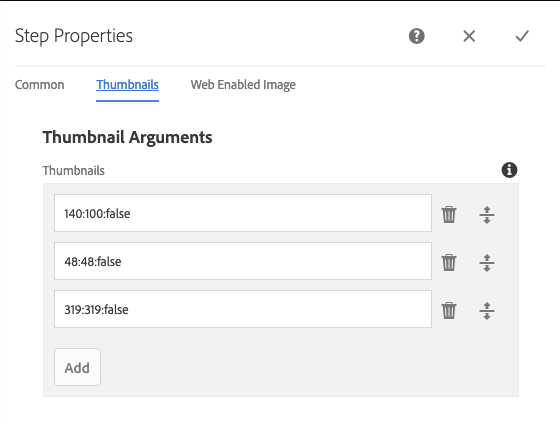
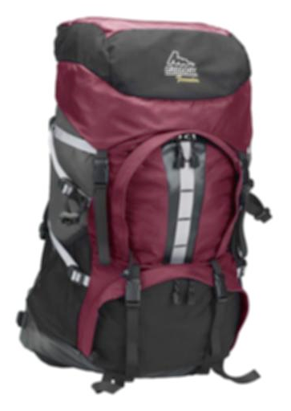
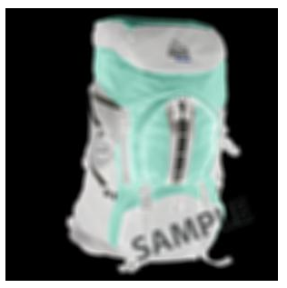

# Managing Image Presets{#managing-image-presets}

이미지 사전 설정을 사용하면 AEM Assets은 서로 다른 크기, 서로 다른 형식 또는 동적으로 생성된 기타 이미지 속성을 사용하여 이미지를 동적으로 전달할 수 있습니다. 각 이미지 사전 설정은 이미지 표시를 위한 크기 및 형식 지정 명령의 사전 정의된 컬렉션을 나타냅니다. When you create an Image Preset, you choose a size for image delivery. 또한 이미지를 볼 수 있도록 전달할 때 이미지의 모양이 최적화되도록 서식 명령을 선택합니다.

관리자는 에셋 내보내기를 위한 사전 설정을 만들 수 있습니다. 사용자는 이미지를 내보낼 때 사전 설정을 선택할 수 있으며 관리자가 지정한 사양에 맞게 이미지를 다시 포맷할 수 있습니다.

반응형 이미지 사전 설정을 만들 수도 있습니다. 응답형 이미지 사전 설정을 자산에 적용하는 경우, 해당 이미지 사전 설정이 표시된 장치나 화면 크기에 따라 달라집니다. RGB 또는 회색 외에 색상 공간에 CMYK를 사용하도록 이미지 사전 설정을 구성할 수 있습니다.

이 섹션에서는 이미지 사전 설정을 생성, 수정 및 일반적으로 관리하는 방법에 대해 설명합니다. 미리 볼 때마다 이미지에 이미지 사전 설정을 적용할 수 있습니다. See [Applying Image Presets](/help/assets/dynamic-media/image-presets.md).

>[!NOTE]
>
>스마트 이미징은 기존 이미지 사전 설정에서 작동하며 마지막 전달 순간에 인텔리전스를 사용하여 브라우저 또는 네트워크 연결 속도에 따라 이미지 파일 크기를 더 줄입니다. 자세한 [내용은 스마트](/help/assets/dynamic-media/imaging-faq.md) 이미징을 참조하십시오.

## 이미지 사전 설정 이해 {#understanding-image-presets}

매크로와 마찬가지로 이미지 사전 설정은 이름 아래에 저장된 크기 및 서식 지정 명령의 사전 정의된 모음입니다. 이미지 사전 설정이 작동하는 방식을 이해하려면 웹 사이트에서 각 제품 이미지가 서로 다른 크기, 서로 다른 형식 및 데스크탑 및 모바일 전달의 압축 속도로 나타나야 한다고 가정합니다.

두 개의 이미지 사전 설정을 만들 수 있습니다.하나는 데스크탑 버전의 경우 500 x 500픽셀이고 다른 하나는 모바일 버전의 경우 150 x 150픽셀입니다. 두 개의 이미지 사전 설정 `Enlarge` 을 만듭니다. 하나는 500x500픽셀의 이미지를 표시하기 위해 호출되고 다른 하나는 150 x 150픽셀의 이미지 `Thumbnail` 를 표시하기 위해 호출됩니다. AEM은 이미지 `Enlarge` 를 크기와 `Thumbnail` 크기로 확대하기 위해 이미지 사전 설정과 축소판 이미지 사전 설정의 정의를 찾습니다. 그런 다음 AEM은 각 이미지 사전 설정의 크기와 형식 사양에 맞게 이미지를 동적으로 생성합니다.

이미지를 동적으로 전달할 때 크기가 축소되면 선명도와 세부 묘사가 손실될 수 있습니다. 이러한 이유로 각 이미지 사전 설정에는 특정 크기로 전달될 때 이미지를 최적화하기 위한 서식 지정 컨트롤이 포함되어 있습니다. 이러한 컨트롤을 사용하면 웹 사이트 또는 애플리케이션에 이미지를 전달할 때 선명하고 명확하게 이미지를 전달할 수 있습니다.

관리자는 이미지 사전 설정을 만들 수 있습니다. 이미지 사전 설정을 만들려면 처음부터 시작하거나 기존 이미지 사전 설정을 사용하여 새 이름으로 저장할 수 있습니다.

## Managing Image Presets {#managing-image-presets-1}

AEM 로고를 탭하거나 클릭하여 글로벌 탐색 콘솔에 액세스한 다음 도구 아이콘을 탭 또는 클릭하고 **[!UICONTROL 자산 > 이미지 사전 설정으로 이동하여 AEM에서 이미지 사전 설정을 관리합니다]**.


>[!NOTE]
>
>에셋을 미리 보거나 전달할 때 만드는 모든 이미지 사전 설정을 동적 표현물로 사용할 수도 있습니다.
>
>이미지 사전 설정이 자동으로 게시되므로 이미지 사전 설정을 게시할 필요는 *없습니다* .
>
>See [Publishing Image Presets.](#publishing-image-presets)

>[!NOTE]
>
>자산의 세부 정보 보기에서 표현물을 선택하면 **[!UICONTROL 다양한]** 표현물이 표시됩니다. 표시되는 이미지 사전 설정 수를 늘리거나 줄일 수 있습니다. 표시되는 [이미지 사전 설정 수 증가를 참조하십시오](#increasing-or-decreasing-the-number-of-image-presets-that-display).

### Adobe Illustrator(AI), Postscript(EPS) 및 PDF 파일 포맷 {#adobe-illustrator-ai-postscript-eps-and-pdf-file-formats}

AI, EPS 및 PDF 파일의 섭취를 지원하여 이러한 파일 포맷의 동적 변환을 생성하려는 경우, 이미지 사전 설정을 만들기 전에 다음 정보를 검토할 수 있습니다.

Adobe Illustrator의 파일 포맷은 PDF의 변형입니다. AEM Assets의 맥락에서 주요한 차이점은 다음과 같습니다.

* Adobe Illustrator 문서는 여러 레이어가 있는 단일 페이지로 구성됩니다. 각 레이어는 기본 Illustrator 에셋 아래에 있는 PNG 하위 에셋으로 추출됩니다.
* PDF 문서는 하나 이상의 페이지로 구성됩니다. 각 페이지는 주 다중 페이지 PDF 문서 아래에 단일 페이지 PDF 하위 자산으로 추출됩니다.

하위 자산은 전체 워크플로우 내의 `Create Sub Asset process` 구성 요소에 의해 `DAM Update Asset` 만들어집니다. 워크플로우 내에서 이 프로세스 구성 요소를 보려면 **[!UICONTROL 도구 > 워크플로우 > 모델 > DAM 자산 업데이트 > 편집을 누릅니다]**.

<!-- See also [Viewing pages of a multi-page file](/help/assets/manage-linked-subassets.md#view-pages-of-a-multi-page-file). -->

자산을 열고 콘텐츠 메뉴를 누른 다음 **[!UICONTROL 하위 자산]** 또는 **[!UICONTROL 페이지를 선택하면 하위 자산이나 페이지를 볼 수 있습니다]**. 하위 자산은 실제 자산입니다. 즉, PDF 페이지는 워크플로우 구성 요소에 의해 `Create Sub Asset` 추출됩니다. 그런 다음 기본 자산 아래 `page1.pdf`에, `page2.pdf`등으로 저장됩니다. 저장된 후에는 워크플로우가 `DAM Update Asset` 처리합니다.

Dynamic Media를 사용하여 AI, EPS 또는 PDF 파일에 대한 동적 변환을 미리 보고 생성하려면 다음 처리 단계가 필요합니다.

1. 워크플로우에서 `DAM Update Asset` 프로세스 구성 요소는 구성된 해상도를 사용하여 원본 자산의 첫 페이지를 `Rasterize PDF/AI Image Preview Rendition` `cqdam.preview.png` 변환으로 래스터화합니다.

1. 그런 다음 `cqdam.preview.png` 변환은 워크플로우 내의 `Dynamic Media Process Image Assets` 프로세스 구성 요소로 PTIFF로 최적화됩니다.

>[!NOTE]
>
>DAM 자산 업데이트 워크플로우에서 EPS 축소판 **[!UICONTROL 단계는 EPS 파일의 축소판을]** 생성합니다.

#### PDF/AI/EPS 에셋 메타데이터 속성 {#pdf-ai-eps-asset-metadata-properties}

| **메타데이터 속성** | **설명** |
|---|---|
| dam:Physicalwidthin인치 | 문서 너비(인치) |
| dam:Physicalheight | 문서 높이(인치) |

워크플로우 `Rasterize PDF/AI Image Preview Rendition` 를 통해 프로세스 구성 요소 옵션에 `DAM Update Asset` 액세스합니다.

왼쪽 상단에 있는 Adobe Experience Manager을 누르고 도구 > **[!UICONTROL 워크플로우 > 모델로 이동합니다]**. 워크플로우 모델 페이지에서 **[!UICONTROL DAM 자산]**&#x200B;업데이트를 선택한 다음 도구 모음에서 **[!UICONTROL 편집을 탭합니다]**. DAM 자산 업데이트 워크플로우 페이지에서 프로세스 구성 요소를 두 번 눌러 해당 단계 속성 대화 상자를 엽니다. `Rasterize PDF/AI Image Preview Rendition`

#### Rasterize PDF/AI Image Preview Rendition options {#rasterize-pdf-ai-image-preview-rendition-options}


PDF 또는 AI 워크플로우 래스터화를 위한 인수

<table>
 <tbody>
  <tr>
   <td><strong>프로세스 인수</strong></td>
   <td><strong>기본 설정</strong></td>
   <td><strong>설명</strong></td>
  </tr>
  <tr>
   <td>MIME 유형</td>
   <td><p>application/pdf</p> <p>application/postscript</p> <p>응용 프로그램/illustrator<br /> </p> </td>
   <td>PDF 또는 Illustrator 문서로 간주되는 문서 MIME 형식의 목록입니다.<br /> </td>
  </tr>
  <tr>
   <td>최대 너비</td>
   <td>2048</td>
   <td>생성된 미리 보기 변환의 최대 너비(픽셀 단위)<br /> </td>
  </tr>
  <tr>
   <td>최대 높이</td>
   <td>2048</td>
   <td>생성된 미리 보기 변환의 최대 높이(픽셀 단위)<br /> </td>
  </tr>
  <tr>
   <td>해상도</td>
   <td>72</td>
   <td>첫 번째 페이지를 ppi(인치당 픽셀)로 래스터화하는 해상도입니다.</td>
  </tr>
 </tbody>
</table>

기본 프로세스 인수를 사용하여 PDF/AI 문서의 첫 페이지는 72ppi로 래스터화되며 생성된 미리 보기 이미지의 크기는 2048 x 2048픽셀입니다. 일반적인 배포의 경우 해상도를 최소 150ppi 이상으로 높일 수 있습니다. 예를 들어 300ppi의 미국 문자 크기 문서는 최대 너비 및 높이가 각각 2550 x 3300픽셀이어야 합니다.

최대 너비 및 최대 높이는 래스터화할 해상도를 제한합니다. 예를 들어 최대값이 변경되지 않고 해상도가 300ppi로 설정된 경우 미국 문자 문서는 186ppi로 래스터화됩니다. 즉, 문서는 1581 x 2046픽셀입니다.

프로세스 구성 요소의 `Rasterize PDF/AI Image Preview Rendition` 최대값은 메모리에 지나치게 큰 이미지를 만들지 않도록 정의됩니다. 이러한 큰 이미지는 JVM에 제공된 메모리를 오버플로할 수 있습니다(Java Virtual Machine). 구성된 병렬 워크플로우의 수를 관리할 수 있는 충분한 메모리를 JVM에 제공하려면 각 JVM이 구성된 최대 크기로 이미지를 만들 수 있도록 주의해야 합니다.

### InDesign(INDD) 파일 포맷 {#indesign-indd-file-format}

이 파일 포맷의 동적 변환을 생성할 수 있도록 INDD 파일 섭취를 지원하려는 경우 이미지 사전 설정을 만들기 전에 다음 정보를 검토할 수 있습니다.

InDesign 파일의 경우, 하위 자산은 Adobe InDesign 서버가 AEM과 통합된 경우에만 추출됩니다. 참조된 자산은 메타데이터를 기반으로 연결됩니다. 연결에 InDesign Server이 필요하지 않습니다. 그러나 InDesign 파일과 참조된 자산 사이에 링크를 만들기 위해 InDesign 파일을 처리하기 전에 참조된 자산이 AEM 내에 있어야 합니다.

<!-- See [Integrating AEM Assets with InDesign Server](/help/assets/indesign.md). -->

워크플로우의 미디어 추출 프로세스 구성 요소는 InDesign 파일을 처리하기 위해 미리 구성된 여러 개의 확장 스크립트를 `DAM Update Asset` 실행합니다.


DAM 자산 업데이트 워크플로우에서 미디어 추출 프로세스 구성 요소의 인수에서 ExtendScript 경로

다음 스크립트는 Dynamic Media 통합에서 사용됩니다.

<table>
 <tbody>
  <tr>
   <td><strong>스크립트 이름 확장</strong></td>
   <td><strong>기본값</strong></td>
   <td><strong>설명</strong></td>
  </tr>
  <tr>
   <td>ThumbnailExport.jsx</td>
   <td>예</td>
   <td>최적화된 300ppi <code>thumbnail.jpg</code> 변환을 생성하여 프로세스 구성 요소별로 PTIFF 변환으로 <code>Dynamic Media Process Image Assets</code> 변환합니다.<br /> </td>
  </tr>
  <tr>
   <td>JPEGPagesExport.jsx</td>
   <td>예</td>
   <td>각 페이지에 대해 300ppi JPEG 하위 자산을 생성합니다. JPEG 하위 자산은 InDesign 자산 아래에 저장된 실제 자산입니다. 또한 워크플로우에서 최적화된 PTIFF로 <code>DAM Update Asset</code> 전환됩니다.<br /> </td>
  </tr>
  <tr>
   <td>PDFPagesExport.jsx</td>
   <td>아니오</td>
   <td>각 페이지에 대한 PDF 하위 자산을 생성합니다. PDF 하위 자산은 앞에서 설명한 대로 처리됩니다. PDF에는 단일 페이지만 포함되어 있으므로 하위 에셋이 생성되지 않습니다.<br /> </td>
  </tr>
 </tbody>
</table>

### 이미지 축소판 크기 구성 {#configuring-image-thumbnail-size}

DAM 자산 업데이트 워크플로우에서 이러한 설정을 구성하여 축소판의 크기를 **[!UICONTROL 구성할 수]** 있습니다. 워크플로우에서는 이미지 자산의 축소판 크기를 구성할 수 있는 두 가지 단계가 있습니다. 정적 축소판 생성을 위한 동적 이미지 에셋과&#x200B;**[!UICONTROL 다른(]**&#x200B;프로세스 축소판&#x200B;**[!UICONTROL )는 동적 미디어 프로세스 이미지 에셋]**&#x200B;에 사용되거나 다른 모든 프로세스에서 축소판을 생성하지 못할 경우 *둘* 모두에 동일한 설정이 있어야 합니다.

[ **[!UICONTROL 다이내믹 미디어 프로세스 이미지 자산]** ] 단계에서는 이미지 서버에서 축소판을 생성하며 이 구성은 [ **[!UICONTROL 프로세스 축소판]** ] 단계에 적용된 구성과 독립적입니다. 축소판 **[!UICONTROL 처리 단계를 통해]** 축소판을 생성하는 것은 축소판을 만드는 데 가장 느리지만 메모리를 많이 사용하는 방법입니다.

축소판 크기 조정은 다음 형식으로 정의됩니다. **[!UICONTROL width:height:center]**(예: *80:80:false)입니다*. 너비와 높이는 축소판의 크기(픽셀 단위)를 결정합니다.center 값은 false 또는 true이고, true로 설정된 경우 축소판 이미지의 크기가 구성에 지정된 대로 정확하게 지정됩니다. 크기가 조정된 이미지가 더 작은 경우 축소판 내에서 가운데에 표시됩니다.

>[!NOTE]
>
>* EPS 파일의 축소판 크기는 축소판 그림 아래의 **[!UICONTROL 인수]** 탭에서 EPS 축소판 **[!UICONTROL 단계에서]** 구성합니다.
   >
   >
* 비디오의 축소판 크기는 [인수] 아래의 [ **[!UICONTROL 프로세스]** ] **[!UICONTROL 탭에서 []** mpeg 축소판 ** 단계에서]**&#x200B;구성합니다.

>


**이미지 축소판 크기를 구성하려면**

1. 도구 **[!UICONTROL > 워크플로우 > 모델 > DAM 자산 업데이트 > 편집을 누릅니다]**.
1. Dynamic **[!UICONTROL Media Process Image Assets]** 단계를 누르고 **[!UICONTROL 축소판]** 탭을 누릅니다. 필요에 따라 축소판 크기를 변경한 다음 **[!UICONTROL 확인을 누릅니다]**.

   

1. [축소판 **[!UICONTROL 처리]** ] 단계를 누른 다음 [축소판] **[!UICONTROL 탭을]** 누릅니다. 필요에 따라 축소판 크기를 변경한 다음 **[!UICONTROL 확인을 누릅니다]**.

   >[!NOTE]
   >
   >[ **[!UICONTROL 프로세스 축소판]** ] 단계의 thumbnails 인수 값은 [ **[!UICONTROL 다이내믹 미디어 프로세스 이미지 자산] 단계의 축소판]** 인수와 일치해야 합니다.

1. 저장을 **[!UICONTROL 눌러]** 워크플로우에 변경 사항을 저장합니다.

### 표시되는 이미지 사전 설정 수 증가 또는 감소 {#increasing-or-decreasing-the-number-of-image-presets-that-display}

만든 이미지 사전 설정은 자산을 미리 볼 때 동적 표현물로 사용할 수 있습니다. AEM에서는 세부 사항 보기 > 표현물에서 자산을 볼 때 다양한 **[!UICONTROL 동적 표현물을 보여줍니다]**. 표시되는 표현물의 제한을 늘리거나 줄일 수 있습니다.

**표시되는 이미지 사전 설정 수를 늘리거나 줄이려면**

1. CRXDE Lite(https://localhost:4502/crx/de)으로[이동합니다](https://localhost:4502/crx/de).
1. Navigate to the image preset listing node at `/libs/dam/gui/coral/content/commons/sidepanels/imagepresetsdetail/imgagepresetslist`

   

1. 한도 **** 속성에서 기본적으로 15로 설정된 **[!UICONTROL 값]**&#x200B;을 원하는 수로 변경합니다.
1. Navigate to the image preset datasource at `/libs/dam/gui/coral/content/commons/sidepanels/imagepresetsdetail/imgagepresetslist/datasource`

   

1. limit 속성에서 숫자를 원하는 숫자로 변경합니다(예: `{empty requestPathInfo.selectors[1] ? "20" : requestPathInfo.selectors[1]}`
1. 모두 **[!UICONTROL 저장을 누릅니다]**.

### 이미지 사전 설정 만들기 {#creating-image-presets}

이미지 사전 설정을 만들면 미리 보거나 게시할 때 이미지에 이러한 설정을 적용할 수 있습니다.

>[!NOTE]
>
>Internet Explorer 9를 사용하는 경우 사전 설정을 만들면 저장 직후 사전 설정 목록에 사전 설정이 나타나지 않습니다. 이 문제를 해결하려면 IE9용 캐시를 비활성화하십시오.

AI, PDF 및 EPS 파일의 통합 기능을 지원하기 위해 이러한 파일 포맷의 동적 변환을 생성하려는 경우, 이미지 사전 설정을 만들기 전에 다음 정보를 검토할 수 있습니다.
자세한 내용은 [Adobe Illustrator(AI), Postscript(EPS) 및 PDF 파일 형식을 참조하십시오](#adobe-illustrator-ai-postscript-eps-and-pdf-file-formats).

이 파일 포맷의 동적 변환을 생성할 수 있도록 INDD 파일 섭취를 지원하려는 경우 이미지 사전 설정을 만들기 전에 다음 정보를 검토할 수 있습니다.
INDD( [InDesign) 파일 형식을 참조하십시오](#indesign-indd-file-format).

**이미지 사전 설정을 만들려면**

1. AEM에서 AEM 로고를 눌러 글로벌 탐색 콘솔에 액세스한 다음 **[!UICONTROL 도구 > 자산 > 이미지 사전 설정을 누릅니다]**.
1. **[!UICONTROL 만들기]**&#x200B;를 클릭합니다. 이미지 **[!UICONTROL 사전 설정 편집]** 창이 열립니다.

   

   >[!NOTE]
   >
   >이 이미지 사전 설정이 응답하도록 하려면 **[!UICONTROL 너비]** 및 **[!UICONTROL 높이]** 필드의 값을 지운 다음 비워 두십시오.

1. 이름을 포함하여 **[!UICONTROL 기본]** 및 **[!UICONTROL 고급]** 탭에 적절한 값을 입력합니다. 이 옵션은 [이미지 사전 설정 옵션에 요약되어 있습니다](#image-preset-options). 사전 설정은 왼쪽 창에 나타나며 다른 에셋과 동시에 사용할 수 있습니다.

   

1. **[!UICONTROL 저장]**&#x200B;을 클릭합니다.

### 반응형 이미지 사전 설정 만들기 {#creating-a-responsive-image-preset}

반응형 이미지 사전 설정을 만들려면 이미지 사전 설정 [만들기에서 단계를 수행합니다](#creating-image-presets). 이미지 사전 설정 **[!UICONTROL 편집]** 창에서 높이와 너비를 입력할 때 값을 지운 후 비워 둡니다.

이 이미지 사전 설정이 응답적이라고 AEM에 알려줍니다. 다른 값을 적절히 조정할 수 있습니다.

>[!NOTE]
>
>자산에 이미지 사전 설정을 적용할 때 **[!UICONTROL URL]** 및 **[!UICONTROL RESS]** 단추를 보려면 자산을 게시해야 합니다.
>
>
>
>이미지 사전 설정과 이미지 자산은 자동으로 게시됩니다.

### 이미지 사전 설정 옵션 {#image-preset-options}

이미지 사전 설정을 만들거나 편집할 때 이 섹션에 설명된 옵션이 있습니다. 또한 Adobe은 다음과 같은 &quot;우수 사례&quot; 옵션을 선택하여 시작할 것을 권장합니다.

* **[!UICONTROL 형식]** (**[!UICONTROL 기본]** 탭) - **[!UICONTROL JPEG]** 또는 요구 사항을 충족하는 다른 형식을 선택합니다. 모든 웹 브라우저는 JPEG 이미지 형식을 지원합니다.작은 파일 크기와 이미지 품질 간의 적절한 균형을 제공합니다. 그러나 JPEG 형식 이미지는 압축 설정이 너무 낮으면 원치 않는 이미지 가공물을 가져올 수 있는 손실 압축 체계를 사용합니다. 이러한 이유로 Adobe은 압축 품질을 75로 설정하는 것이 좋습니다. 이 설정은 이미지 품질과 작은 파일 크기 간의 적절한 균형을 제공합니다.

* **[!UICONTROL 단순 선명]** 활성화 - [ **[!UICONTROL 간단한 선명하게 하기]** 설정]을 선택하지 마십시오(이 선명 효과 필터는 [언샵 마스크] 설정에 비해 더 적은 컨트롤을 제공합니다).

* **[!UICONTROL 선명하게 하기:리샘플링 모드]** - **[!UICONTROL Bi-Cubic을 선택합니다]**.

#### 기본 탭 옵션 {#basic-tab-options}

<table>
 <tbody>
  <tr>
   <td><strong>필드</strong></td>
   <td><strong>설명</strong></td>
  </tr>
  <tr>
   <td><strong>이름</strong></td>
   <td>공백 없이 수사적 이름을 입력합니다. 사용자가 이미지 사전 설정을 식별하는 데 도움이 되도록 이름에 이미지 크기 사양을 포함해야 합니다.</td>
  </tr>
  <tr>
   <td><strong>폭과 높이</strong></td>
   <td>이미지가 전달되는 크기의 픽셀을 입력합니다. 너비와 높이는 0픽셀보다 커야 합니다. 값이 0이면 사전 설정이 만들어지지 않습니다. 두 값이 모두 비어 있으면 응답형 이미지 사전 설정이 만들어집니다.</td>
  </tr>
  <tr>
   <td><strong>형식</strong></td>
   <td><p>메뉴에서 형식을 선택합니다.</p> <p>JPEG <strong>를</strong> 선택하면 다음과 같은 추가 옵션이 제공됩니다.</p>
    <ul>
     <li><strong>품질</strong> - JPEG 압축 수준을 제어합니다. 이 설정은 파일 크기와 이미지 품질 모두에 영향을 줍니다. JPEG 품질 척도는 1-100입니다. 슬라이더를 드래그하면 비율이 표시됩니다.</li>
     <li><strong>JPG 색차 다운샘플링</strong> 활성화 - 눈은 고주파 광도보다 고주파 색상 정보에 덜 민감하므로 JPEG 이미지는 이미지 정보를 광도 및 색상 구성 요소로 나눕니다. JPEG 이미지가 압축되면 광도 구성 요소는 전체 해상도로 유지되며 색상 구성 요소는 픽셀 그룹을 평균화하여 다운샘플링됩니다. 다운샘플링은 인지된 품질에 거의 영향을 주지 않으면서 데이터 볼륨을 1/2 또는 1/3까지 감소시킵니다. 다운샘플링은 회색 음영 이미지에는 적용되지 않습니다. 이 기술은 대비가 높은 이미지(예: 텍스트가 겹쳐진 이미지)에 유용합니다.</li>
    </ul>
    <div>
      GIF <strong>또는 GIF를 alpha</strong><strong>와 함께 선택하면 다음과 같은 추가</strong> GIF 색상 <strong></strong> 양자화 옵션을 제공합니다.
    </div>
    <ul>
     <li><strong>유형 </strong>- <strong>응용</strong> (기본값), <strong>웹</strong>또는 <strong>Macintosh를</strong>선택합니다. If you select <strong>GIF with Alpha</strong>, the Macintosh option is not available.</li>
     <li><strong>디더</strong> - 확산 <strong>또는 해제</strong> 를 <strong>선택합니다</strong>.</li>
     <li><strong>색상 수 </strong>- 2와 256 사이의 숫자를 입력합니다.</li>
     <li><strong>색상 목록</strong> - 쉼표로 구분된 목록을 입력합니다. 예를 들어, 흰색, 회색, 검정인 경우 0000,88888,ffff를 입력합니다.</li>
    </ul>
    <div>
      PDF <strong>,</strong>TIFF <strong>또는</strong>TIFF를 alpha <strong>로</strong> 선택하면 다음 추가 옵션을 사용할 수 있습니다.
    </div>
    <ul>
     <li><strong>압축</strong> - 압축 알고리즘을 선택합니다. PDF에 대한 알고리즘 옵션은 <strong>없음</strong>, <strong>Zip</strong>및 <strong>Jpeg</strong>입니다.TIFF의 경우 <strong>없음</strong>, <strong>LZW</strong><strong>,</strong>Jpeg <strong>및</strong>Zip,및 알파가 있는 TIFF의 경우 <strong>없음</strong>, <strong>LZW</strong>및 <strong>Zip</strong>이있습니다.</li>
    </ul> <p>[ <strong>PNG</strong>], [ <strong>PNG</strong> 알파] 또는 <strong>EPS를</strong> 선택하면 추가 옵션을제공하지 않습니다.</p> </td>
  </tr>
  <tr>
   <td><strong>선명하게 하기</strong></td>
   <td>Select the <strong>Enable Simple Sharpening</strong> option to apply a basic sharpening filter to the image after all scaling takes place. Sharpening can help compensate for blurriness that can result when you display an image at a different size. </td>
  </tr>
 </tbody>
</table>

#### 고급 탭 옵션 {#advanced-tab-options}

<table>
 <tbody>
  <tr>
   <td><strong>필드</strong></td>
   <td><strong>설명</strong></td>
  </tr>
  <tr>
   <td><strong>색상 공간</strong></td>
   <td>색상 공간에 <strong>대해 RGB, CMYK</strong> 또는 <strong>회색</strong> 음영을 선택합니다.</td>
  </tr>
  <tr>
   <td><strong>색상 프로필</strong></td>
   <td>자산이 작업 프로필과 다른 경우 변환할 출력 색상 공간 프로파일을 선택합니다.</td>
  </tr>
  <tr>
   <td><strong>렌더링 의도</strong></td>
   <td>기본 렌더링 의도를 무시할 수 있습니다. 렌더링 의도는 대상 색상 프로필(색상 영역 외)에서 재현할 수 없는 색상에 대해 결정합니다. 렌더링 의도가 ICC 프로파일과 호환되지 않으면 무시됩니다.
    <ul>
     <li>원본 <strong>이미지의 하나 이상의 색상이 대상 색상 공간의 색상 영역을 벗어날 때 전체 색상 영역을 한 색상 공간에서 다른 색상 공간으로 압축하려면 [가시 범위</strong> ]를 선택합니다.</li>
     <li>현재 <strong>색상 공간의 색상이 대상 색상 공간의 색상 영역을 벗어난 경우</strong> 다른 색상에 영향을 주지 않고 대상 색상 공간의 색상 영역 내에서 가능한 가장 가까운 색상에 매핑하려는 경우 [상대 색상 지표]를 선택합니다. </li>
     <li>대상 <strong>색상</strong> 공간으로 변환할 때 원본 이미지 색상 채도를 재현하려면 채도를 선택합니다. </li>
     <li>이미지의 <strong>밝기를</strong> 변경하는 흰색 점 또는 검은 점을 조정하지 않고 색상을 정확하게 일치시키려면 [절대 색상 지표]를 선택합니다.</li>
    </ul> </td>
  </tr>
  <tr>
   <td><strong>검은 점 보상</strong></td>
   <td>출력 프로필에서 이 기능을 지원하는 경우 이 옵션을 선택합니다. 지정된 ICC 프로파일과 호환하지 않는 경우 블랙포인트 보상은 무시됩니다.</td>
  </tr>
  <tr>
   <td><strong>디더링</strong></td>
   <td>색상 밴딩 결함을 방지하거나 줄이려면 이 옵션을 선택합니다. </td>
  </tr>
  <tr>
   <td><strong>선명하게 하기 유형</strong></td>
   <td><p>[ <strong>없음</strong>], <strong>선명</strong>또는 <strong>언샵 마스크를</strong>선택합니다. </p>
    <ul>
     <li>[없음] <strong>을 선택하여</strong> 선명 효과를 비활성화합니다.</li>
     <li>모든 크기 <strong>가 </strong>수행된 후 이미지에 기본 선명하게 하기 필터를 적용하려면 선명 효과를 선택합니다. Sharpening can help compensate for blurriness that can result when you display an image at a different size. </li>
     <li>Unsharp mask<strong> select</strong> Unsharp mask to fine-tune a sharpening filter effect on the final downsampled image. 무시될 효과의 강도, 효과의 반경(픽셀 단위) 및 대비 임계값을 제어할 수 있습니다. 이 효과는 Photoshop의 "언샵 마스크" 필터와 동일한 옵션을 사용합니다.</li>
    </ul> <p>언샵 마스크 <strong>에</strong>다음 옵션이 있습니다.</p>
    <ul>
     <li><strong>양</strong> - 가장자리 픽셀에 적용된 대비 양을 제어합니다. 기본 실제 숫자 값은 1.0입니다. 고해상도 이미지의 경우 최대 5.0까지 늘릴 수 있습니다. 필터 강도 측정값으로 양을 생각해 보십시오.</li>
     <li><strong>반경</strong> - 선명하게 하기에 영향을 주는 가장자리 픽셀 주위의 픽셀 수를 결정합니다. 고해상도 이미지의 경우 1부터 2까지의 실수를 입력합니다. 낮은 값은 가장자리 픽셀만 선명하게 합니다.높은 값은 더 넓은 범위의 픽셀을 선명하게 합니다. 정확한 값은 이미지 크기에 따라 다릅니다.</li>
     <li><strong>임계값</strong> - 언샵 마스크 필터를 적용할 때 무시할 대비 범위를 결정합니다. 즉, 이 옵션은 가장자리 픽셀로 간주되고 선명하게 되기 전에 선명하게 된 픽셀이 주변 영역과 얼마나 달라야 하는지를 결정합니다. 노이즈를 유발하지 않으려면 2~20 사이의 정수 값을 실험해 봅니다. </li>
     <li><strong>적용 대상</strong> - 선명하게 하기 설정이 각 색상 또는 밝기에 적용되는지 여부를 결정합니다.</li>
    </ul>
    <div>
      Sharpening is described in <a href="https://docs.adobe.com/content/help/en/dynamic-media-classic/using/assets/s7_sharpening_images.pdf">Sharpening Images</a>.
    </div> </td>
  </tr>
  <tr>
   <td><strong>리샘플링 모드</strong></td>
   <td>[리샘플링 <strong>모드] 옵션을</strong> 선택합니다. 이러한 옵션은 이미지를 다운샘플링할 때 이미지를 선명하게 합니다.
    <ul>
     <li><strong>Bi-Linear</strong> - 가장 빠른 리샘플링 방법입니다.일부 앨리어스 가공물은 눈에 띈다.</li>
     <li><strong>Bi-Cubic</strong> - CPU 사용을 증가시키지만, 앨리어싱 가공물이 덜 나타나면서 더 선명한 이미지를 생성합니다.</li>
     <li><strong>Sharp2</strong> - Bi-Cubic보다 약간 더 선명하게 결과물을 만들 수 있지만 CPU 비용이 훨씬 더 높습니다.</li>
     <li><strong>Bi-Sharp</strong> - Adobe Photoshop에서 쌍입방(더 선명하게)이라고 하는 이미지 크기를 줄이기 위한 Photoshop 기본 <strong>리셀러를</strong> 선택합니다.</li>
     <li><strong>각 색상</strong> 및 <strong>밝기</strong> - 각 방법은 색상 또는 밝기를 기반으로 할 수 있습니다. 기본적으로 <strong>각 색상이</strong> 선택되어 있습니다.</li>
    </ul> </td>
  </tr>
  <tr>
   <td><strong>인쇄 해상도</strong></td>
   <td>이 이미지 인쇄를 위한 해상도를 선택하십시오.기본값은 72픽셀입니다.</td>
  </tr>
  <tr>
   <td><strong>이미지 수정자</strong></td>
   <td><p>UI에서 사용할 수 있는 일반적인 이미지 설정 외에도, Dynamic Media는 <strong>이미지 수정자</strong> 필드에서 지정할 수 있는 다양한 고급 이미지 수정을 지원합니다. 이러한 매개 변수는 <a href="https://docs.adobe.com/content/help/ko-KR/dynamic-media-developer-resources/image-serving-api/image-serving-api/http-protocol-reference/command-reference/c-command-reference.html">이미지 서버 프로토콜 명령 참조에서 정의됩니다</a>.</p> <p>중요:API에 나열된 다음 기능은 지원되지 않습니다.</p>
    <ul>
     <li>기본 템플릿 및 텍스트 렌더링 명령: <code>text= textAngle= textAttr= textFlowPath= textFlowXPath= textPath=</code> and <code>textPs=</code></li>
     <li>현지화 명령: <code>locale=</code> and <code>req=xlate</code></li>
     <li><code>req=set</code> 은 일반 사용에 사용할 수 없습니다.</li>
     <li><code>req=mbrset</code></li>
     <li><code>req=saveToFile</code></li>
     <li><code>req=targets</code></li>
     <li><code>template=</code></li>
     <li>비코어 다이내믹 미디어 서비스:SVG, 이미지 렌더링 및 Web-to-Print</li>
    </ul> </td>
  </tr>
 </tbody>
</table>

### 이미지 수정자를 사용하여 이미지 사전 설정 옵션 정의 {#defining-image-preset-options-with-image-modifiers}

[기본] 및 [고급] 탭에서 사용할 수 있는 옵션 외에도 이미지 사전 설정을 정의할 때 더 많은 옵션을 제공하는 이미지 수정자를 정의할 수 있습니다. 이미지 렌더링은 Scene7 이미지 렌더링 API에 의존하며 [HTTP 프로토콜 참조에서 자세히 정의됩니다](https://microsite.omniture.com/t2/help/en_US/s7/is_ir_api/is_api/http_ref/c_http_protocol_reference.html).

다음은 이미지 수정자로 수행할 수 있는 작업의 몇 가지 기본 예입니다.

>[!NOTE]
>
>일부 이미지 수정자는 AEM에서 사용할 [수 없습니다](#advanced-tab-options).

* [op_invert](https://microsite.omniture.com/t2/help/en_US/s7/is_ir_api/is_api/http_ref/r_op_invert.html) - 네거티브 이미지 효과를 위해 각 색상 구성 요소를 반전합니다.

   ```xml
   &op_invert=1
   ```

   

* [op_blur](https://microsite.omniture.com/t2/help/en_US/s7/is_ir_api/is_api/http_ref/r_op_blur.html) - 흐림 필터를 이미지에 적용합니다.

   ```xml
   &op_blur=7
   ```

   

* 결합된 명령 - op_blur 및 op-invert

   ```xml
   &op_invert=1&op_blur=7
   ```

   

* [op_brightness](https://microsite.omniture.com/t2/help/en_US/s7/is_ir_api/is_api/http_ref/r_op_brightness.html) - 밝기를 줄이거나 늘립니다.

   ```xml
   &op_brightness=58
   ```

   

* [opac](https://microsite.omniture.com/t2/help/en_US/s7/is_ir_api/is_api/http_ref/r_opac.html) - 이미지 불투명도를 조정합니다. 전경 불투명도를 줄일 수 있습니다.

   ```xml
   opac=29
   ```

   

### 이미지 사전 설정 편집 {#modifying-image-presets}

1. AEM에서 AEM 로고를 눌러 글로벌 탐색 콘솔에 액세스한 다음 **[!UICONTROL 도구 > 자산 > 이미지 사전 설정을 누릅니다]**.

   

1. 사전 설정을 선택한 다음 **[!UICONTROL 편집을 클릭합니다]**. 이미지 **[!UICONTROL 사전 설정 편집]** 창이 열립니다.
1. 변경 작업을 수행하고 **[!UICONTROL 저장을]** 클릭하여 변경 사항을 저장하거나 **[!UICONTROL 취소를]** 클릭하여 변경 사항을 취소합니다.

### 게시 이미지 사전 설정 {#publishing-image-presets}

이미지 사전 설정은 자동으로 게시됩니다.

### 이미지 사전 설정 삭제 {#deleting-image-presets}

1. AEM에서 AEM 로고를 눌러 글로벌 탐색 콘솔에 액세스하고 도구 아이콘을 탭하거나 클릭하고 **[!UICONTROL 자산 > 이미지 사전 설정으로 이동합니다]**.
1. 사전 설정을 선택한 다음 **[!UICONTROL 삭제를 클릭합니다]**. Dynamic Media에서 삭제를 확인합니다. 삭제를 **[!UICONTROL 눌러]** 삭제하거나 **[!UICONTROL 취소를 눌러]** 중단합니다.
