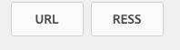

# 이미지 사전 설정 관리{#managing-image-presets}

이미지 사전 설정을 사용하면 Adobe Experience Manager Assets에서 다른 크기, 다른 형식 또는 동적으로 생성된 다른 이미지 속성으로 이미지를 동적으로 전달할 수 있습니다. 각 이미지 사전 설정은 이미지를 표시하기 위한 미리 정의된 크기 조정 및 서식 지정 명령 컬렉션을 나타냅니다. 이미지 사전 설정을 만들 때 이미지 게재 크기를 선택합니다. 또한 보기 위해 이미지가 전달될 때 이미지의 모양이 최적화되도록 서식 지정 명령을 선택합니다.

관리자는 에셋 내보내기를 위한 사전 설정을 만들 수 있습니다. 사용자는 이미지를 내보낼 때 사전 설정을 선택할 수 있으며, 이 사전 설정은 관리자가 지정하는 사양으로 이미지 형식을 다시 지정할 수도 있습니다.

응답하는 이미지 사전 설정을 만들 수도 있습니다. 반응형 이미지 사전 설정을 에셋에 적용하면 에셋이 표시되는 디바이스 또는 화면 크기에 따라 변경됩니다. RGB 또는 회색 외에도 색상 공간에서 CMYK를 사용하도록 이미지 사전 설정을 구성할 수 있습니다.

이 섹션에서는 이미지 사전 설정을 만들고, 수정하고, 일반적으로 관리하는 방법을 설명합니다. 미리 볼 때마다 이미지 사전 설정을 이미지에 적용할 수 있습니다. [이미지 사전 설정 적용](/help/assets/dynamic-media/image-presets.md)을 참조하십시오.

>[!NOTE]
>
>스마트 이미징은 기존 이미지 사전 설정에서 작동하며 마지막 전달 순간에 인텔리전스를 사용하여 브라우저 또는 네트워크 연결 속도에 따라 이미지 파일 크기를 더 줄입니다. 자세한 내용은 [스마트 이미징](/help/assets/dynamic-media/imaging-faq.md)을 참조하세요.

## 이미지 사전 설정에 대해 알아보기 {#understanding-image-presets}

매크로와 마찬가지로 이미지 사전 설정은 이름 아래에 저장된 크기 조정 및 서식 지정 명령의 미리 정의된 컬렉션입니다. 이미지 사전 설정의 작동 방식을 이해하려면 웹 사이트에서 각 제품 이미지를 데스크탑 및 모바일 게재에 대해 서로 다른 크기, 다른 형식 및 압축률로 표시해야 한다고 가정해 봅시다.

데스크탑의 경우 500 x 500픽셀, 모바일의 경우 150 x 150픽셀이라는 두 개의 이미지 사전 설정을 만들 수 있습니다. 두 개의 이미지 사전 설정을 만듭니다. 하나는 500x500픽셀로 이미지를 표시하는 `Enlarge`이고 다른 하나는 150x150픽셀로 이미지를 표시하는 `Thumbnail`입니다. `Enlarge` 및 `Thumbnail` 크기의 이미지를 전달하기 위해 Experience Manager은 `Enlarge Image Preset` 및 `Thumbnail Image Preset`의 정의를 찾습니다. 그런 다음 Experience Manager은 각 이미지 사전 설정의 크기 및 형식 지정 사양에 따라 이미지를 동적으로 생성합니다.

이미지가 동적으로 전달될 때 크기가 줄어든 이미지는 선명도와 디테일을 잃을 수 있습니다. 이러한 이유로 각 이미지 사전 설정에는 이미지가 특정 크기로 제공될 때 이를 최적화하기 위한 서식 지정 컨트롤이 포함되어 있습니다. 이러한 컨트롤은 이미지가 웹 사이트나 응용 프로그램에 전달될 때 선명하고 선명하게 나타나도록 합니다.

관리자는 이미지 사전 설정을 만들 수 있습니다. 이미지 사전 설정을 만들려면 처음부터 시작하거나 기존 이미지 사전 설정에서 시작하여 새 이름으로 저장할 수 있습니다.

## 이미지 사전 설정 관리 {#managing-image-presets-1}

Experience Manager 로고를 선택하여 전역 탐색 콘솔에 액세스한 다음 도구 아이콘을 선택하고 **[!UICONTROL Assets]** > **[!UICONTROL 이미지 사전 설정]**(으)로 이동하여 Experience Manager에서 이미지 사전 설정을 관리합니다.


>[!NOTE]
>
>만드는 모든 이미지 사전 설정은 에셋을 미리 보거나 전달할 때 동적 변환으로도 사용할 수 있습니다.
>
>이미지 사전 설정이 자동으로 게시되므로 *not*&#x200B;은(는) 이미지 사전 설정을 게시할 필요가 없습니다.
>
>[이미지 사전 설정 게시](#publishing-image-presets)를 참조하십시오.

>[!NOTE]
>
>자산의 세부 정보 보기에서 **[!UICONTROL 렌디션]**&#x200B;을 선택하면 시스템에 다양한 렌디션이 표시됩니다. 표시되는 이미지 사전 설정의 수를 늘리거나 줄일 수 있습니다. [표시되는 이미지 사전 설정 수 늘리기](#increasing-or-decreasing-the-number-of-image-presets-that-display)를 참조하십시오.

## 이미지 사전 설정과 표현물의 관계 {#how-image-presets-relate-to-renditions}

이미지 사전 설정은 크기 조정, 서식 지정, 압축 및 기타 표시 매개 변수를 포함하여 Dynamic Media가 이미지를 전달하는 방법을 정의합니다. 사전 설정은 렌디션 자체를 생성하지 않습니다. 대신 에셋이 처리될 때 생성되는 렌디션에 의존합니다.

### AEM as a Cloud Service에서 렌디션 생성{#rendition-generation-in-aemaacs}

AEM as a Cloud Service에서 렌디션은 [에셋 마이크로서비스](https://experienceleague.adobe.com/en/docs/experience-manager-cloud-service/content/assets/manage/asset-microservices-configure-and-use#)를 사용하여 생성됩니다. DAM 자산 업데이트 워크플로우를 Cloud Service에서 사용자 정의할 수 없습니다.

중요한 고려 사항은 다음과 같습니다.

* 렌디션은 업로드 시 생성됩니다.
* 처리 프로필의 변경 사항은 새로 업로드한 자산에 영향을 줍니다. 새 렌디션이 필요한 경우 기존 에셋을 재처리해야 합니다.
* 렌디션을 생성하기 위한 AEM as a Cloud Service에서는 워크플로 모델 사용자 지정이 지원되지 않습니다.

이미지 사전 설정은 전달 시 사용 가능한 렌디션을 참조합니다. 이미지 사전 설정을 구성하거나 사용하기 전에 필요한 렌디션이 있는지 확인하십시오.

**생성할 렌디션을 제어하려면:**

1. [처리 프로필](https://experienceleague.adobe.com/en/docs/experience-manager-cloud-service/content/assets/manage/asset-microservices-configure-and-use#)을 만들거나 편집합니다.
2. 필요한 렌디션 정의를 구성합니다.
3. 적절한 폴더에 처리 프로필을 적용합니다.

처리 프로필이 적용된 폴더에 에셋이 업로드되면 에셋 마이크로서비스 가 정의된 렌디션을 자동으로 생성합니다.

<!--
### Adobe Illustrator (AI), PostScript&reg; (EPS), and PDF file formats {#adobe-illustrator-ai-postscript-eps-and-pdf-file-formats}

If you intend to support the ingestion of AI, EPS, and PDF files so that you can generate dynamic renditions of these file formats, review the following information before you create Image Presets.

Adobe Illustrator's file format is a variant of PDF. The main differences, in the context of Experience Manager Assets, are the following:

* Adobe Illustrator documents consist of a single page with multiple layers. Each layer is extracted as a PNG subasset under the main Illustrator asset.
* PDF documents consist of one or more pages. Each page is extracted as a single page PDF subasset under the main multi-page PDF document.

The `Create Sub Asset process` component creates the subassets within the overall `DAM Update Asset` workflow. To see this process component within the workflow, navigate to **[!UICONTROL Tools]** > **[!UICONTROL Workflow]** > **[!UICONTROL Models]** > **[!UICONTROL DAM Update Asset]** > **[!UICONTROL Edit]**.

See also [Viewing pages of a multi-page file](/help/assets/manage-linked-subassets.md#view-pages-of-a-multi-page-file).

You can view the subassets or the pages when you open the asset, select the Content menu, and select **[!UICONTROL Subassets]** or **[!UICONTROL Pages]**. The subassets are real assets. The `Create Sub Asset` workflow component extracts the PDF pages. They are then stored as `page1.pdf`, `page2.pdf`, and so on, below the main asset. After they are stored, the `DAM Update Asset` workflow processes them.

To use Dynamic Media to preview and generate dynamic renditions for AI, EPS or PDF files, the following processing steps are required:

1. In the `DAM Update Asset` workflow, the `Rasterize PDF/AI Image Preview Rendition` process component rasterizes the first page of the original asset &ndash; using the configured resolution &ndash; into a `cqdam.preview.png` rendition.

1. The `Dynamic Media Process Image Assets` process component within the workflow optimizes the `cqdam.preview.png` rendition into a PTIFF.

>[!NOTE]
>
>In the DAM Update Asset workflow, the **[!UICONTROL EPS thumbnails]** step generates thumbnails for EPS files.

#### PDF/AI/EPS asset metadata properties {#pdf-ai-eps-asset-metadata-properties}

| **Metadata property** |**Description** |
|---|---|
| `dam:Physicalwidthininches` |Document width in inches. |
| `dam:Physicalheightininches` |Document height in inches. |

You access `Rasterize PDF/AI Image Preview Rendition` process component options by way of the `DAM Update Asset` workflow.

Select Adobe Experience Manager in the upper left, the click **[!UICONTROL Tools]** > **[!UICONTROL Workflow]** > **[!UICONTROL Models]**. On the Workflow Models page, select **[!UICONTROL DAM Update Asset]**, then on the toolbar select **[!UICONTROL Edit]**. On the DAM Update Asset workflow page, double-select the `Rasterize PDF/AI Image Preview Rendition` process component to open its Step Properties dialog box.

#### Rasterize PDF/AI Image Preview Rendition options {#rasterize-pdf-ai-image-preview-rendition-options}


Arguments to rasterize PDF or AI workflow

|Process Argument | Default setting | Description |
|---|---|---|
| Mime Types | application/pdf<br>application/postscript<br>application/illustrator| List of document mime-types that are considered to be PDF or Illustrator documents. |
| Max Width | 2048 | Maximum width of the generated preview rendition, in pixels.|
| Max Height | 2048| Maximum height of the generated preview rendition, in pixels. |
| Resolution | 72 | Resolution to rasterize the first page, in ppi (pixels per inch). |

Using the default process arguments, the first page of a PDF/AI document is rasterized at 72 ppi and the generated preview image is sized at 2048 x 2048 pixels. For a typical deployment, you can increase the resolution to a minimum of 150 ppi or more. For example, a US letter size document at 300 ppi requires a maximum width and height of 2550 x 3300 pixels, respectively.

Max Width and Max Height limit the resolution at which to rasterize. For example, if the maximums are unchanged, and Resolution is set to 300 ppi, a US Letter document is rasterized at 186 ppi. That is, the document is 1581 x 2046 pixels.

The `Rasterize PDF/AI Image Preview Rendition` process component has a maximum defined to ensure that it does not create overly large images in memory. Such large images can overflow the memory provided to the JVM (Java&trade; Virtual Machine). Care must be taken to provide the JVM with enough memory to manage the configured number of parallel workflows, with each having the potential to create an image at the maximum configured size. -->

<!--
### InDesign (INDD) file format {#indesign-indd-file-format}

If you intend to support the ingestion of INDD files so that you can generate dynamic rendition of this file format, review the following information before you create Image Presets.

For InDesign files, sub assets are extracted only if the Adobe InDesign Server is integrated with Experience Manager. Referenced assets are linked based on their metadata. InDesign Server is not required for linking. However, the referenced assets must be present within Experience Manager before the InDesign files are processed for the links to be created between the InDesign files and the referenced assets.

See [Integrate Experience Manager Assets with InDesign Server](/help/assets/indesign.md).

The Media Extraction process component in the `DAM Update Asset` workflow runs several pre-configured Extend Scripts to process InDesign files.


The ExtendScript paths in the arguments of the Media Extraction process component in the DAM Update Asset workflow.

The following scripts are used by Dynamic Media integration:


|ExtendScript name | Default | Description |
|---|---|---|
| ThumbnailExport.jsx | Yes  | Generates a 300 PPI `thumbnail.jpg` rendition that is optimized and turned into a PTIFF rendition by `Dynamic Media Process Image Assets` process component.  |
| JPEGPagesExport.jsx | Yes | Generates a 300 PPI JPEG subasset for each page. The JPEG subasset is a real asset stored under the InDesign asset. The `DAM Update Asset` workflow optimizes and converts it into a PTIFF. |
| PDFPagesExport.jsx | No | Generates a PDF subasset for each page. The PDF subasset gets processed as described earlier. Because the PDF contains a single page only, no subassets are generated. |
-->

<!--
### Configure the image thumbnail size {#configuring-image-thumbnail-size}

You can configure the size of thumbnails by configuring those settings in the **[!UICONTROL DAM Update Asset]** workflow. There are two steps in the workflow where you can configure the thumbnail size of image assets. One (**[!UICONTROL Dynamic Media Process Image Assets]**) is used for dynamic image assets. The other (**[!UICONTROL Process Thumbnails]**) is used for static thumbnail generation or when all other processes fail to generate thumbnails. Regardless, *both* must have the same settings.

The **[!UICONTROL Dynamic Media Process Image Assets]** step uses the image server to generate thumbnails, independently of the configuration applied to the **[!UICONTROL Process Thumbnails]** step. Generating thumbnails through the **[!UICONTROL Process Thumbnails]** step is the slowest and most memory intensive way to create thumbnails.

Thumbnail sizing is defined in the following format: **[!UICONTROL width:height:center]**, for example, `80:80:false`. The width and height determine the size in pixels of the thumbnail. The center value is either false or true. If set to true, it indicates that the thumbnail image has exactly the size given in the configuration. If the resized image is smaller, it is centered within the thumbnail.

>[!NOTE]
>
>* Thumbnail sizes for EPS files are configured in the **[!UICONTROL EPS thumbnails]** step, in the **[!UICONTROL Arguments]** tab under Thumbnails.
>
>* Thumbnail sizes for videos are configured in the **[!UICONTROL FFmpeg thumbnails]** step, in the **[!UICONTROL Process]** tab under **[!UICONTROL Arguments]**.
>

**To configure the image thumbnail size:**

1. Navigate to **[!UICONTROL Tools]** > **[!UICONTROL Workflow]** > **[!UICONTROL Models]** > **[!UICONTROL DAM Update Asset]** > **[!UICONTROL Edit]**.
1. Select the **[!UICONTROL Dynamic Media Process Image Assets]** step and select the **[!UICONTROL Thumbnails]** tab. Change the thumbnail size, as needed, then select **[!UICONTROL OK]**.

   

1. Select the **[!UICONTROL Process Thumbnails]** step, then select the **[!UICONTROL Thumbnails]** tab. Change the thumbnail size, as needed, then select **[!UICONTROL OK]**.

   >[!NOTE]
   >
   >The values in the thumbnails argument in the **[!UICONTROL Process Thumbnails]** step must match the thumbnails argument in the **[!UICONTROL Dynamic Media Process Image Assets]** step.

1. Select **[!UICONTROL Save]** to save the changes to the workflow.
-->

## 표시되는 이미지 사전 설정 수 증가 또는 감소 {#increasing-or-decreasing-the-number-of-image-presets-that-display}

만든 이미지 사전 설정은 에셋을 미리 볼 때 동적 변환으로 사용할 수 있습니다. Experience Manager은 **[!UICONTROL 자세히 보기 > 렌디션]**&#x200B;에서 에셋을 볼 때 다양한 동적 렌디션을 표시합니다. 표시되는 표현물의 한도를 늘리거나 줄일 수 있습니다.

**표시되는 이미지 사전 설정 수를 늘리거나 줄이려면**

1. CRXDE Lite([https://localhost:4502/crx/de](https://localhost:4502/crx/de))로 이동합니다.
1. `/libs/dam/gui/coral/content/commons/sidepanels/imagepresetsdetail/imgagepresetslist`의 이미지 사전 설정 나열 노드로 이동합니다.

   

1. In the **[!UICONTROL limit]** property, change the **[!UICONTROL Value]**, which is set to 15 by default, to the desired number.
1. `/libs/dam/gui/coral/content/commons/sidepanels/imagepresetsdetail/imgagepresetslist/datasource`의 이미지 사전 설정 데이터 원본으로 이동합니다.

   

1. limit 속성에서 숫자를 원하는 숫자(예: `{empty requestPathInfo.selectors[1] ? "20" : requestPathInfo.selectors[1]}`)로 변경합니다.
1. **[!UICONTROL 모두 저장]**&#x200B;을 선택합니다.

## 이미지 사전 설정 만들기 {#creating-image-presets}

미리 보거나 게시할 때 이미지 간에 설정을 일관되게 적용할 수 있도록 이미지 사전 설정을 만듭니다.

>[!NOTE]
>
>Internet Explorer 9를 사용하는 경우 사전 설정을 작성한 후 바로 사전 설정 목록에 표시되지 않습니다. 이 문제를 해결하려면 IE9에 대한 캐시를 비활성화하십시오.

이러한 파일 형식의 동적 렌디션을 생성할 수 있도록 AI, PDF 및 EPS 파일 수집을 지원하려면 이미지 사전 설정을 만들기 전에 다음 정보를 검토하십시오.

[Adobe Illustrator(AI), PostScript®(EPS) 및 PDF 파일 형식](#adobe-illustrator-ai-postscript-eps-and-pdf-file-formats)을 참조하세요.

이 파일 형식의 동적 변환을 생성할 수 있도록 INDD 파일 수집을 지원하려면 이미지 사전 설정을 만들기 전에 다음 정보를 검토하십시오.

[INDD(InDesign) 파일 형식](#indesign-indd-file-format)을 참조하세요.

**이미지 사전 설정을 만들려면:**

1. Experience Manager에서 Experience Manager 로고를 선택하여 전역 탐색 콘솔에 액세스한 다음 **[!UICONTROL 도구]** > **[!UICONTROL Assets]** > **[!UICONTROL 이미지 사전 설정]**(으)로 이동합니다.
1. **[!UICONTROL 만들기]**&#x200B;를 선택합니다.

   

   >[!NOTE]
   >
   >이 이미지 사전 설정을 응답형으로 설정하려면 **[!UICONTROL width]** 및 **[!UICONTROL height]** 필드의 값을 지우고 비워 두십시오.

1. **[!UICONTROL 이미지 사전 설정 편집]** 창에서 이름을 포함하여 **[!UICONTROL 기본]** 및 **[!UICONTROL 고급]** 탭에 값을 적절하게 입력합니다. 옵션은 [Image Preset Options](#image-preset-options)에 설명되어 있습니다. Presets appear in the left pane and can be used on-the-fly with other assets.

   

1. **[!UICONTROL 저장]**&#x200B;을 선택합니다.

## 응답형 이미지 사전 설정 만들기 {#creating-a-responsive-image-preset}

응답형 이미지 사전 설정을 만들려면 [이미지 사전 설정 만들기](#creating-image-presets)의 단계를 수행하십시오. **[!UICONTROL 이미지 사전 설정 편집]** 창에 높이와 너비를 입력할 때 값을 지우고 비워 둡니다.

이 필드를 비워 두면 Experience Manager에 이 이미지 사전 설정이 응답함을 알려줍니다. 다른 값은 적절하게 조정할 수 있습니다.

>[!NOTE]
>
>자산에 이미지 사전 설정을 적용할 때 **[!UICONTROL URL]** 및 **[!UICONTROL RESS]** 단추를 보려면 자산을 게시해야 합니다.
>
>
>
>이미지 사전 설정 및 이미지 에셋은 자동으로 게시됩니다.

### 이미지 사전 설정 옵션 {#image-preset-options}

이미지 사전 설정을 만들거나 편집할 때 이 섹션에 설명된 옵션이 있습니다. 또한 Adobe에서는 다음과 같은 &quot;모범 사례&quot; 옵션 선택 사항을 시작할 것을 권장합니다.

* **[!UICONTROL 형식]**(**[!UICONTROL 기본]** 탭) - **[!UICONTROL JPEG]** 또는 요구 사항에 맞는 다른 형식을 선택하십시오. 모든 웹 브라우저는 JPEG 형식을 지원하며 파일 크기와 이미지 품질의 균형이 좋습니다. 그러나 JPEG 형식은 손실 압축을 사용하므로 압축 설정이 너무 낮으면 원치 않는 아티팩트가 생길 수 있습니다. For that reason, Adobe recommends setting the compression quality to 75. 이 설정은 이미지 품질과 파일 크기 사이의 균형을 잘 맞춥니다.

* **[!UICONTROL Enable Simple Sharpening]** - Do not select **[!UICONTROL Enable Simple Sharpening]** (this sharpening filter offers less control than Unsharp Masking settings).

* **[!UICONTROL 선명하게 하기: 리샘플링 모드]** - **[!UICONTROL Sharp2]**&#x200B;을(를) 선택합니다.

### 기본 탭 옵션 {#basic-tab-options}

| 필드 | 설명 |
| --- | --- |
| **이름** | 공백 없이 수사적 이름을 입력합니다. 사용자가 이 이미지 사전 설정을 식별하는 데 도움이 되도록 이름에 이미지 크기 사양을 포함하십시오. |
| **너비 및 높이** | 이미지가 표시될 크기를 픽셀로 입력합니다. 폭과 높이는 0픽셀보다 커야 합니다. 값이 0이면 사전 설정이 만들어지지 않습니다. 두 값이 모두 비어 있으면 반응형 이미지 사전 설정이 만들어집니다. |
| **형식** | 메뉴에서 형식을 선택합니다.<br>선택 **JPEG**&#x200B;은(는) 다음과 같은 기타 옵션을 제공합니다.<br>· **품질** - JPEG 품질 기준은 1-100입니다. 슬라이더를 드래그하면 배율이 표시됩니다.<br>· **JPG 색차 다운샘플링 사용** - 눈은 고주파 광도보다 고주파 색상 정보에 덜 민감하므로 JPEG 이미지는 이미지 정보를 광도와 색상 구성 요소로 나눕니다. JPEG 이미지가 압축되면 광도 구성 요소는 최대 해상도로 유지되는 반면 색상 구성 요소는 픽셀 그룹을 함께 평균화하여 다운샘플링됩니다. 다운샘플링은 인지된 품질에 미치는 영향을 최소화하면서 데이터 양을 절반 또는 1/3로 줄입니다. 회색 음영 이미지에는 다운샘플링을 적용할 수 없습니다. 이 기법은 대비가 높은 이미지(예: 오버레이된 텍스트가 있는 이미지)에 유용한 압축의 양을 줄입니다.<br><br>알파 포함 **GIF** 또는 **GIF을 선택하면 다음과 같은 추가** GIF 색상 양자화&#x200B;**옵션이 제공됩니다.**· <br>유형&#x200B;**-**&#x200B;적응형&#x200B;**(기본값),**&#x200B;웹&#x200B;**또는** Macintosh **선택.** **Alpha과 함께 GIF**&#x200B;을(를) 선택하면 Macintosh 옵션을 사용할 수 없습니다.<br>· **디더** - **분산** 또는 **해제**&#x200B;를 선택합니다.<br>· **색상 수** - 숫자 2 - 256을 입력하십시오.<br>· **색상 목록** - 쉼표로 구분된 목록을 입력하십시오. 예를 들어 흰색, 회색 및 검은색은 `000000,888888,ffffff`을(를) 입력합니다.<br><br>알파 포함 **PDF**, **TIFF** 또는 **TIFF**&#x200B;을(를) 선택하면 다음과 같은 추가 옵션이 제공됩니다.<br>· **압축** - 압축 알고리즘을 선택합니다. PDF의 알고리즘 옵션은 **없음**, **Zip** 및 **Jpeg**&#x200B;이고, TIFF의 경우 **없음**, **LZW**, **Jpeg** 및 **Zip**&#x200B;이며, Alpha이 있는 TIFF의 경우 **없음**, **LZW** 및 **Zip**&#x200B;입니다.<br><br>추가 옵션이 없는 **PNG**, **Alpha을 사용하는 PNG** 또는 **EPS**&#x200B;을(를) 선택하십시오. |
| **선명하게 하기** | 모든 크기 조절 후 이미지에 기본 선명하게 하기 필터를 적용하려면 **단순 선명하게 하기 사용**&#x200B;을 선택하십시오. 선명하게 하기는 다른 크기의 이미지를 표시할 때 발생하는 흐릿함을 보상하는 데 도움이 될 수 있습니다. |

### 고급 탭 옵션 {#advanced-tab-options}

<table>
 <tbody>
  <tr>
   <td><strong>필드</strong></td>
   <td><strong>설명</strong></td>
  </tr>
  <tr>
   <td><strong>색상 공간</strong></td>
   <td>색상 공간으로 <strong>RGB, CMYK,</strong> 또는 <strong>회색 음영</strong>을 선택합니다.</td>
  </tr>
  <tr>
   <td><strong>색상 프로필</strong></td>
   <td>작동하는 프로필과 다른 경우 에셋을 변환할 출력 색상 공간 프로필을 선택합니다.</td>
  </tr>
  <tr>
   <td><strong>렌더링 의도</strong></td>
   <td>기본 렌더링 의도를 재정의할 수 있습니다. 렌더링 의도는 대상 색상 프로파일에서 재현할 수 없는 색상(색상 영역 밖)에 발생하는 현상을 결정합니다. ICC 프로파일과 호환되지 않으면 렌더링 의도가 무시됩니다.
    <ul>
     <li>원본 이미지에서 하나 이상의 색상이 대상 색상 공간의 색상 영역을 벗어나는 경우 한 색상 공간의 전체 색상 영역을 다른 색상 공간으로 압축하려면 <strong>Perceptual</strong>을 선택합니다.</li>
     <li>현재 색상 공간의 색상이 대상 색상 공간에서 색상 영역을 벗어난 경우 <strong>상대 색상 지표</strong>을 선택합니다. 다른 색상을 변경하지 않고 가장 가까운 대상 색역에 매핑할 수 있습니다. </li>
     <li>대상 색상 공간으로 변환할 때 원본 이미지 색상 채도를 재현하려면 <strong>채도</strong>를 선택합니다. </li>
     <li>이미지의 밝기를 변경하는 흰점이나 검정점을 조정하지 않고 색상을 정확하게 일치시키려면 <strong>절대 색도계</strong>를 선택하십시오.</li>
    </ul> </td>
  </tr>
  <tr>
   <td><strong>검은 점 보상</strong></td>
   <td>출력 프로파일이 이 기능을 지원하는 경우 이 옵션을 선택합니다. 지정된 ICC 프로파일과 호환되지 않으면 검은 점 보상이 무시됩니다.</td>
  </tr>
  <tr>
   <td><strong>디더링</strong></td>
   <td>가능한 색상 밴딩 아티팩트를 방지하거나 줄이려면 이 옵션을 선택합니다. </td>
  </tr>
  <tr>
   <td><strong>선명하게 하기 유형</strong></td>
   <td><p><strong>없음</strong>, <strong>선명 효과</strong> 또는 <strong>선명하지 않은 마스크</strong>를 선택하십시오. </p>
    <ul>
     <li>선명하게 하기를 비활성화하려면 <strong>없음</strong>을 선택하세요.</li>
     <li>모든 크기 조절 후 이미지에 기본 선명하게 하기 필터를 적용하려면 <strong>선명하게 </strong>을(를) 선택합니다. 선명하게 하기는 다른 크기의 이미지를 표시할 때 발생하는 흐릿함을 보상하는 데 도움이 될 수 있습니다. </li>
     <li>다운샘플링된 최종 이미지에서 선명하게 하기 필터 효과를 미세 조정하려면 <strong> 언샵 마스크</strong>를 선택합니다. 효과의 강도, 효과의 반경(픽셀 단위 측정) 및 무시되는 대비 임계값을 제어할 수 있습니다. 이 효과는 Photoshop의 "언샵 마스크" 필터와 동일한 옵션을 사용합니다.</li>
    </ul> <p><strong>언샵 마스크</strong>에는 다음 옵션이 있습니다.</p>
    <ul>
     <li><strong>양</strong> - 가장자리 픽셀에 적용된 대비의 양을 제어합니다. 기본 실수 값은 1.0입니다. 고해상도 이미지의 경우 최대 5.0까지 늘릴 수 있습니다. 양을 필터 강도를 나타내는 척도로 간주합니다.</li>
     <li><strong>반경</strong> - 선명하게 하기가 적용되는 가장자리 픽셀 주위의 픽셀 수를 결정합니다. 고해상도 이미지의 경우 1~2의 실제 숫자를 입력합니다. 낮은 값은 가장자리 픽셀만 선명하게 하고 높은 값은 넓은 폭의 픽셀을 선명하게 합니다. 올바른 값은 이미지의 크기에 따라 다릅니다.</li>
     <li><strong>임계값</strong> - 언샵 마스크 필터가 적용될 때 무시할 대비 범위를 결정합니다. 즉, 이 옵션은 가장자리 픽셀로 간주하여 선명하게 하기 위해 선명하게 된 픽셀이 주변 영역과 얼마나 달라야 하는지 정의합니다. 잡음이 생기는 것을 피하기 위해 2에서 20 사이의 정수 값으로 실험하세요. </li>
     <li><strong>적용 대상</strong> - 각 색상 또는 밝기에 선명하게 하기 취소를 적용할지 여부를 결정합니다.</li>
    </ul>
    <div>
      선명하게 하기는에 설명되어 있습니다.
     <a href="https://experienceleague.adobe.com/en/docs/experience-manager-learn/assets/dynamic-media/images/dynamic-media-image-sharpening-feature-video-use#dynamic-media">Experience Manager Dynamic Media에서 이미지 선명하게 하기 사용</a> 비디오, <a href="https://experienceleague.adobe.com/en/docs/dynamic-media-classic/using/master-files/sharpening-image#master-files">이미지 선명하게 하기</a> 온라인 도움말 항목 및 <a href="https://experienceleague.adobe.com/docs/dynamic-media-classic/assets/s7_sharpening_images.pdf">Dynamic Media Classic에서 이미지 선명하게 하기 모범 사례</a> 다운로드 가능한 PDF.
    </div> </td>
  </tr>
  <tr>
   <td><strong>리샘플링 모드</strong></td>
   <td><strong>리샘플링 모드</strong> 옵션을 선택하십시오. 다음 옵션을 사용하면 이미지가 다운샘플링될 때 이미지가 선명해집니다.
    <ul>
     <li><strong>이중선형</strong> - 가장 빠른 리샘플링 방법입니다. 일부 앨리어싱 아티팩트가 눈에 띕니다.</li>
     <li><strong>쌍입방</strong> - CPU 사용을 늘이지만 덜 눈에 띄는 앨리어싱 아티팩트로 더 선명한 이미지를 만듭니다.</li>
     <li><strong>Sharp2</strong> - 쌍입방보다 약간 더 선명한 결과를 만들 수 있지만, CPU 비용이 더 많이 듭니다.</li>
     <li><strong>Bi-Sharp</strong> - 이미지 크기를 줄이기 위한 Photoshop 기본 리샘플러를 선택합니다. 이 리샘플러는 Adobe Photoshop에서 <strong>bicubic sharper</strong>입니다.</li>
     <li><strong>각 색상</strong> 및 <strong>밝기</strong> - 각 메서드는 색상 또는 밝기를 기반으로 할 수 있습니다. 기본적으로 <strong>각 색상</strong>이 선택됩니다.</li>
    </ul> </td>
  </tr>
  <tr>
   <td><strong>인쇄 해상도</strong></td>
   <td>이 이미지를 인쇄할 해상도를 선택합니다. 기본값은 72픽셀입니다.</td>
  </tr>
  <tr>
   <td><strong>이미지 수정자</strong></td>
   <td><p>UI에서 사용할 수 있는 일반적인 이미지 설정 외에 Dynamic Media는 <strong>이미지 수정자</strong> 필드에서 지정할 수 있는 다양한 고급 이미지 수정 사항을 지원합니다. 이러한 매개 변수는 <a href="https://experienceleague.adobe.com/en/docs/dynamic-media-developer-resources/image-serving-api/image-serving-api/http-protocol-reference/syntax-and-features/image-serving-http/c-command-overview">이미지 서버 프로토콜 명령 참조</a>에 정의되어 있습니다.</p> <p>중요: API에 나열된 다음 기능은 지원되지 않습니다.</p>
    <ul>
     <li>기본 템플릿 및 텍스트 렌더링 명령: <code>text= textAngle= textAttr= textFlowPath= textFlowXPath= textPath=</code> 및 <code>textPs=</code></li>
     <li>지역화 명령: <code>locale=</code> 및 <code>req=xlate</code></li>
     <li><code>req=set</code> 는 일반 용도로 사용할 수 없습니다.</li>
     <li><code>req=mbrset</code></li>
     <li><code>req=saveToFile</code></li>
     <li><code>req=targets</code></li>
     <li><code>template=</code></li>
     <li>비핵심 Dynamic Media 서비스: SVG, 이미지 렌더링 및 Web-to-Print</li>
    </ul> </td>
  </tr>
 </tbody>
</table>

## 이미지 수정자를 사용하여 이미지 사전 설정 옵션 정의 {#defining-image-preset-options-with-image-modifiers}

기본 및 고급 탭에서 사용할 수 있는 옵션 외에도 이미지 사전 설정을 정의할 때 더 많은 옵션을 제공하도록 이미지 수정자를 정의할 수 있습니다. 이미지 렌더링은 Dynamic Media 이미지 렌더링 API를 사용하며 [HTTP 프로토콜 참조](https://experienceleague.adobe.com/en/docs/dynamic-media-developer-resources/image-serving-api/image-rendering-api/http-protocol-reference/c-ir-introduction#image-rendering-api)에서 자세히 정의됩니다.

다음은 이미지 수정자로 수행할 수 있는 작업의 몇 가지 기본 예입니다.

>[!NOTE]
>
>일부 이미지 수정자 [은(는) Experience Manager](#advanced-tab-options)에서 사용할 수 없습니다.

* [op_invert](https://experienceleague.adobe.com/en/docs/dynamic-media-developer-resources/image-serving-api/image-serving-api/http-protocol-reference/command-reference/r-op-invert) - 부정적인 이미지 효과에 대한 각 색상 구성 요소를 반전시킵니다.

  ```xml {.line-numbers}
  &op_invert=1
  ```

  

* [op_blur](https://experienceleague.adobe.com/en/docs/dynamic-media-developer-resources/image-serving-api/image-serving-api/http-protocol-reference/command-reference/r-op-blur) - 이미지에 흐림 효과 필터를 적용합니다.

  ```xml {.line-numbers}
  &op_blur=7
  ```

  

* 결합된 명령 - op_blur 및 op-invert

  ```xml {.line-numbers}
  &op_invert=1&op_blur=7
  ```

  

* [op_brightness](https://experienceleague.adobe.com/en/docs/dynamic-media-developer-resources/image-serving-api/image-serving-api/http-protocol-reference/command-reference/r-op-brightness) - 밝기를 줄이거나 늘립니다.

  ```xml {.line-numbers}
  &op_brightness=58
  ```

  

* [opac](https://experienceleague.adobe.com/en/docs/dynamic-media-developer-resources/image-serving-api/image-serving-api/http-protocol-reference/command-reference/r-opac) - 이미지 불투명도를 조정합니다. 전경 불투명도를 줄일 수 있습니다.

  ```xml {.line-numbers}
  opac=29
  ```

  

## 이미지 사전 설정 편집 {#modifying-image-presets}

1. Experience Manager에서 Experience Manager 로고를 선택하여 전역 탐색 콘솔에 액세스한 다음 **[!UICONTROL 도구]** > **[!UICONTROL Assets]** > **[!UICONTROL 이미지 사전 설정]**(으)로 이동합니다.

   

1. 사전 설정을 선택한 다음 **[!UICONTROL 편집]**&#x200B;을 선택합니다. **[!UICONTROL 이미지 사전 설정 편집]** 창이 열립니다.
1. 변경 내용을 적용하고 **[!UICONTROL 저장]**&#x200B;을 선택하여 변경 내용을 저장하거나 **[!UICONTROL 취소]**&#x200B;을 선택하여 변경 내용을 취소합니다.

## 이미지 사전 설정 게시 {#publishing-image-presets}

이미지 사전 설정은 자동으로 게시됩니다.

## 이미지 사전 설정 삭제 {#deleting-image-presets}

1. Experience Manager에서 Experience Manager 로고를 선택하여 전역 탐색 콘솔에 액세스하고 도구 아이콘을 선택합니다.
1. **[!UICONTROL Assets]** > **[!UICONTROL 이미지 사전 설정]**(으)로 이동합니다.
1. 사전 설정을 선택한 다음 **[!UICONTROL 삭제]**&#x200B;를 선택합니다. Dynamic Media에서 삭제할 것임을 확인합니다. **[!UICONTROL 삭제]**&#x200B;를 선택하여 제거하거나 **[!UICONTROL 취소]**&#x200B;를 선택하여 이미지 사전 설정으로 돌아갑니다.
