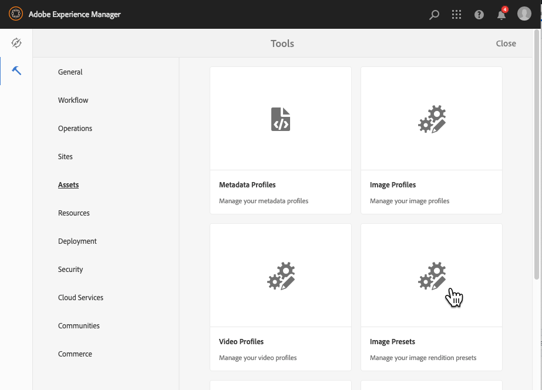
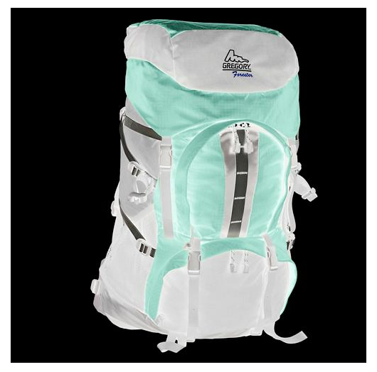

# 이미지 사전 설정 관리{#managing-image-presets}

이미지 사전 설정을 사용하면 Adobe Experience Manager 자산에서 서로 다른 크기, 서로 다른 형식 또는 동적으로 생성되는 기타 이미지 속성을 사용하여 이미지를 동적으로 제공할 수 있습니다. 각 이미지 사전 설정은 이미지 표시를 위한 크기 및 형식 지정 명령의 사전 정의된 컬렉션을 나타냅니다. 이미지 사전 설정을 만들 때 이미지 배달을 위한 크기를 선택합니다. 또한 이미지를 볼 수 있도록 전달할 때 이미지 모양이 최적화되도록 서식 명령을 선택합니다.

관리자는 에셋 내보내기를 위한 사전 설정을 만들 수 있습니다. 사용자는 이미지를 내보낼 때 사전 설정을 선택할 수 있으며, 이 사전 설정은 관리자가 지정한 사양에 맞게 이미지를 다시 포맷합니다.

반응형 이미지 사전 설정을 만들 수도 있습니다. 응답형 이미지 사전 설정을 자산에 적용하면 해당 이미지 사전 설정이 보는 장치나 화면 크기에 따라 달라집니다. RGB 또는 회색 외에 색상 공간에 CMYK를 사용하도록 이미지 사전 설정을 구성할 수 있습니다.

이 섹션에서는 이미지 사전 설정을 생성, 수정 및 일반적으로 관리하는 방법에 대해 설명합니다. 미리 볼 때 언제든지 이미지에 이미지 사전 설정을 적용할 수 있습니다. [이미지 사전 설정 적용](/help/assets/dynamic-media/image-presets.md)을 참조하십시오.

>[!NOTE]
>
>스마트 이미징은 기존 이미지 사전 설정에서 작동하며 마지막 전달 순간에 인텔리전스를 사용하여 브라우저 또는 네트워크 연결 속도에 따라 이미지 파일 크기를 더 줄입니다. 자세한 내용은 [스마트 이미징](/help/assets/dynamic-media/imaging-faq.md)을 참조하십시오.

## 이미지 사전 설정 이해 {#understanding-image-presets}

매크로와 마찬가지로 이미지 사전 설정은 이름 아래에 저장된 크기 및 서식 지정 명령의 사전 정의된 모음입니다. 이미지 사전 설정이 작동하는 방식을 이해하려면 웹 사이트에서 각 제품 이미지가 서로 다른 크기, 서로 다른 형식 및 데스크탑 및 모바일 전달에 대한 압축 비율로 표시되어야 한다고 가정합니다.

다음 두 개의 이미지 사전 설정을 만들 수 있습니다.데스크탑 버전의 경우 500 x 500픽셀, 모바일 버전의 경우 150 x 150픽셀 등 이미지를 500x500 픽셀로 표시하는 이미지 사전 설정(예: `Enlarge`) 및 150 x 150 픽셀로 표시하는 `Thumbnail` 등)이라는 두 개의 이미지 사전 설정을 만듭니다. 이미지를 `Enlarge` 및 `Thumbnail` 크기로 전달하려면 Experience Manager에서 이미지 사전 설정 확대 및 축소판 이미지 사전 설정의 정의를 찾습니다. 그런 다음 Experience Manager은 각 이미지 사전 설정의 크기와 서식 사양에 맞게 이미지를 동적으로 생성합니다.

이미지를 동적으로 전달할 때 크기가 축소되면 선명도와 세부 묘사가 손실될 수 있습니다. 이러한 이유로 각 이미지 사전 설정에는 특정 크기로 전달될 때 이미지를 최적화하기 위한 서식 컨트롤이 포함되어 있습니다. 이러한 컨트롤을 사용하면 웹 사이트 또는 애플리케이션에 이미지를 전달할 때 선명하고 선명하게 할 수 있습니다.

관리자는 이미지 사전 설정을 만들 수 있습니다. 이미지 사전 설정을 만들기 위해 처음부터 시작하거나 기존 사전 설정에서 시작하여 새 이름으로 저장할 수 있습니다.

## 이미지 사전 설정 관리 {#managing-image-presets-1}

Experience Manager 로고를 탭하거나 클릭하여 글로벌 탐색 콘솔에 액세스한 다음, 도구 아이콘을 탭하거나 클릭하고 **[!UICONTROL 자산]** > **[!UICONTROL 이미지 사전 설정]**&#x200B;으로 이동하여 Experience Manager에서 이미지 사전 설정을 관리합니다.



>[!NOTE]
>
>만드는 모든 이미지 사전 설정은 자산을 미리 보거나 전달할 때 다이내믹 표현물로 사용할 수도 있습니다.
>
>이미지 사전 설정이 자동으로 게시되므로 이미지 사전 설정을 게시할 필요가 없는 *은(는) 없습니다.*
>
>[이미지 사전 설정 게시](#publishing-image-presets)를 참조하십시오.

>[!NOTE]
>
>자산의 세부 정보 보기에서 **[!UICONTROL 표현물]**&#x200B;을 선택하면 시스템은 다양한 표현물을 보여줍니다. 표시되는 이미지 사전 설정의 수를 늘리거나 줄일 수 있습니다. [표시](#increasing-or-decreasing-the-number-of-image-presets-that-display)되는 이미지 사전 설정 수 증가를 참조하십시오.

### Adobe Illustrator(AI), PostScript®(EPS) 및 PDF 파일 형식 {#adobe-illustrator-ai-postscript-eps-and-pdf-file-formats}

이러한 파일 형식의 동적 변환을 생성할 수 있도록 AI, EPS 및 PDF 파일 전송을 지원하려는 경우 이미지 사전 설정을 만들기 전에 다음 정보를 검토하십시오.

Adobe Illustrator의 파일 형식은 PDF의 변수입니다. Experience Manager 자산 컨텍스트에서 주요 차이점은 다음과 같습니다.

* Adobe Illustrator 문서는 여러 레이어가 있는 단일 페이지로 구성됩니다. 각 레이어는 기본 Illustrator 에셋 아래의 PNG 하위 에셋으로 추출됩니다.
* PDF 문서는 하나 이상의 페이지로 구성됩니다. 각 페이지는 여러 페이지로 구성된 기본 PDF 문서 아래에 단일 페이지 PDF 하위 자산으로 추출됩니다.

하위 자산은 전체 `DAM Update Asset` 워크플로 내에서 `Create Sub Asset process` 구성 요소에 의해 만들어집니다. 워크플로우 내의 이 프로세스 구성 요소를 보려면 **[!UICONTROL 도구]** > **[!UICONTROL 워크플로우]** > **[!UICONTROL 모델]** > **[!UICONTROL DAM 자산 업데이트]** > **[!UICONTROL 편집]**&#x200B;을 탭합니다.

<!-- See also [Viewing pages of a multi-page file](/help/assets/manage-linked-subassets.md#view-pages-of-a-multi-page-file). -->

자산을 열 때 하위 자산이나 페이지를 보고, 콘텐츠 메뉴를 누른 다음 **[!UICONTROL 하위 자산]** 또는 **[!UICONTROL 페이지]**&#x200B;를 선택합니다. 하위 자산은 실제 자산입니다. 즉, PDF 페이지는 `Create Sub Asset` 워크플로우 구성 요소에 의해 추출됩니다. 그런 다음 기본 자산 아래의 `page1.pdf`, `page2.pdf` 등으로 저장됩니다. 저장된 후에는 `DAM Update Asset` 워크플로우가 처리합니다.

Dynamic Media을 사용하여 AI, EPS 또는 PDF 파일에 대한 동적 변환을 미리 보고 생성하려면 다음 처리 단계가 필요합니다.

1. `DAM Update Asset` 작업 과정에서 `Rasterize PDF/AI Image Preview Rendition` 프로세스 구성 요소는 구성된 해상도를 사용하여 원래 자산의 첫 페이지를 `cqdam.preview.png` 변환으로 래스터화합니다.

1. 그런 다음 워크플로우 내의 `Dynamic Media Process Image Assets` 프로세스 구성 요소에 의해 `cqdam.preview.png` 변환이 PTIFF에 최적화됩니다.

>[!NOTE]
>
>DAM 자산 업데이트 워크플로우에서 **[!UICONTROL EPS 축소판]** 단계에서는 EPS 파일의 축소판을 생성합니다.

#### PDF/AI/EPS 에셋 메타데이터 속성 {#pdf-ai-eps-asset-metadata-properties}

| **메타데이터 속성** | **설명** |
|---|---|
| dam:Physicalwidthin인치 | 문서 너비(인치) |
| dam:Physicalheizinch | 문서 높이(인치) |

`DAM Update Asset` 작업 과정을 통해 `Rasterize PDF/AI Image Preview Rendition` 프로세스 구성 요소 옵션에 액세스합니다.

왼쪽 상단에 있는 Adobe Experience Manager을 탭하고 **[!UICONTROL 도구]** > **[!UICONTROL 워크플로우]** > **[!UICONTROL 모델]**&#x200B;으로 이동합니다. 워크플로우 모델 페이지에서 **[!UICONTROL DAM 자산 업데이트]**&#x200B;를 선택한 다음 도구 모음에서 **[!UICONTROL 편집]**&#x200B;을 탭합니다. DAM 자산 업데이트 워크플로우 페이지에서 `Rasterize PDF/AI Image Preview Rendition` 프로세스 구성 요소를 두 번 눌러 [단계 속성] 대화 상자를 엽니다.

#### PDF/AI 이미지 미리 보기 변환 옵션 래스터화 {#rasterize-pdf-ai-image-preview-rendition-options}


PDF 또는 AI 작업 과정 래스터화를 위한 인수

| 프로세스 인수 | 기본 설정 | 설명 |
|---|---|---|
| MIME 유형 | application/pdf<br>application/postscript<br>application/illustrator | PDF 또는 Illustrator 문서로 간주되는 문서 MIME 유형 목록입니다. |
| 최대 너비 | 2048년 | 생성된 미리 보기 변환의 최대 폭(픽셀 단위)입니다. |
| 최대 높이 | 2048년 | 생성된 미리 보기 변환의 최대 높이(픽셀 단위)입니다. |
| 해상도 | 72 | 첫 번째 페이지를 래스터화하는 해상도(ppi(인치당 픽셀 수). |

기본 프로세스 인수를 사용하여 PDF/AI 문서의 첫 번째 페이지는 72ppi로 래스터화되며 생성된 미리 보기 이미지의 크기는 2048 x 2048픽셀입니다. 일반적인 배포의 경우 해상도를 최소 150ppi 이상으로 늘릴 수 있습니다. 예를 들어 미국 문자 크기 문서(300ppi)의 경우 각각 2550 x 3300픽셀의 최대 너비와 높이가 필요합니다.

[최대 폭] 및 [최대 높이]는 래스터화할 해상도를 제한합니다. 예를 들어 최대값이 변경되지 않고 해상도가 300ppi로 설정된 경우 미국 문자 문서는 186ppi로 래스터화됩니다. 즉, 문서는 1581 x 2046 픽셀입니다.

`Rasterize PDF/AI Image Preview Rendition` 프로세스 구성 요소에는 메모리에 지나치게 큰 이미지를 만들지 않도록 정의된 최대값이 있습니다. 이러한 큰 이미지는 JVM(Java™ Virtual Machine)에 제공된 메모리를 오버플로할 수 있습니다. 구성된 최대 크기의 이미지를 생성할 가능성이 있는 각 병렬 워크플로우를 관리할 수 있도록 JVM에 충분한 메모리를 제공해야 합니다.

### InDesign(INDD) 파일 형식 {#indesign-indd-file-format}

이 파일 형식의 동적 변환을 생성할 수 있도록 INDD 파일 전송을 지원하려는 경우 이미지 사전 설정을 만들기 전에 다음 정보를 검토하십시오.

InDesign 파일의 경우, 하위 자산은 Adobe InDesign Server이 Experience Manager과 통합된 경우에만 추출됩니다. 참조된 자산은 메타데이터를 기반으로 연결됩니다. 연결에 InDesign Server이 필요하지 않습니다. 그러나 InDesign 파일과 참조된 자산 간에 링크를 만들기 위해 InDesign 파일을 처리하려면 Experience Manager 내에 참조된 자산이 있어야 합니다.

<!-- See [Integrating Experience Manager Assets with InDesign Server](/help/assets/indesign.md). -->

`DAM Update Asset` 작업 과정의 미디어 추출 프로세스 구성 요소는 InDesign 파일을 처리하기 위해 미리 구성된 여러 개의 스크립트 확장을 실행합니다.


DAM 자산 업데이트 워크플로우에서 미디어 추출 프로세스 구성 요소의 인수에 ExtendScript 경로가 표시됩니다.

다음 스크립트는 Dynamic Media 통합에서 사용됩니다.


| ExtendScript 이름 | 기본값 | 설명 |
|---|---|---|
| ThumbnailExport.jsx | 예 | 최적화된 300ppi `thumbnail.jpg` 변환을 생성하여 `Dynamic Media Process Image Assets` 프로세스 구성 요소에 의해 PTIFF 변환으로 변환합니다. |
| JPEGPagesExport.jsx | 예 | 각 페이지에 대해 300ppi JPEG 하위 자산을 생성합니다. JPEG 하위 자산은 InDesign 자산 아래에 저장된 실제 자산입니다. 또한 최적화되어 `DAM Update Asset` 워크플로우에서 PTIFF로 전환됩니다. |
| PDFPagesExport.jsx | 아니오 | 각 페이지에 대한 PDF 하위 자산을 생성합니다. PDF 하위 자산은 앞서 설명한 대로 처리됩니다. PDF에는 단일 페이지만 포함되어 있으므로 하위 에셋이 생성되지 않습니다. |

### 이미지 축소판 크기 {#configuring-image-thumbnail-size} 구성

**[!UICONTROL DAM 자산 업데이트]** 작업 과정에서 이러한 설정을 구성하여 축소판의 크기를 구성할 수 있습니다. 워크플로우에서는 이미지 자산의 축소판 크기를 구성할 수 있는 두 가지 단계가 있습니다. 동적 이미지 자산에 하나(**[!UICONTROL Dynamic Media 프로세스 이미지 자산]**)가 사용됩니다. 다른 (**[!UICONTROL Process Thumbnails]**)는 정적 축소판 생성이나 다른 모든 프로세스에서 축소판을 생성하지 못할 때 사용됩니다. 관계 없이 *모두*&#x200B;의 설정이 같아야 합니다.

**[!UICONTROL Dynamic Media 프로세스 이미지 자산]** 단계에서는 축소판이 이미지 서버에 의해 생성되며 이 구성은 **[!UICONTROL 문서 축소판 처리]** 단계에 적용된 구성과 독립적입니다. **[!UICONTROL 축소판 처리]** 단계를 통해 축소판을 생성하는 것은 축소판을 만드는 데 가장 느리고 메모리 사용량이 많은 방법입니다.

축소판 크기 조정은 다음 형식으로 정의됩니다.**[!UICONTROL width:height:center]**(예: *80:80:false*). 너비와 높이는 축소판의 크기(픽셀)를 결정합니다. 가운데 값은 false 또는 true입니다. true로 설정된 경우 축소판 이미지의 크기가 구성에 정확히 지정되어 있음을 나타냅니다. 크기를 조정한 이미지가 더 작은 경우 축소판 가운데에 표시됩니다.

>[!NOTE]
>
>* EPS 파일의 축소판 크기는 축소판 아래에 있는 **[!UICONTROL 인수]** 탭의 **[!UICONTROL EPS 축소판]** 단계에서 구성됩니다.
   >
   >
* 비디오의 축소판 크기는 **[!UICONTROL 인수]**&#x200B;의 **[!UICONTROL 프로세스]** 탭에서 **[!UICONTROL FFmpeg 축소판]** 단계에서 구성됩니다.

>


**이미지 축소판 크기를 구성하려면**

1. **[!UICONTROL 도구]** > **[!UICONTROL 워크플로우]** > **[!UICONTROL 모델]** > **[!UICONTROL DAM 자산 업데이트]** > **[!UICONTROL 편집]**&#x200B;을 탭합니다.
1. **[!UICONTROL Dynamic Media Process Image Assets]** 단계를 누르고 **[!UICONTROL 축소판]** 탭을 누릅니다. 필요에 따라 축소판 크기를 변경한 다음 **[!UICONTROL 확인]**&#x200B;을 누릅니다.

   

1. **[!UICONTROL 축소판 처리]** 단계를 누른 다음 **[!UICONTROL 축소판]** 탭을 누릅니다. 필요에 따라 축소판 크기를 변경한 다음 **[!UICONTROL 확인]**&#x200B;을 누릅니다.

   >[!NOTE]
   >
   >**[!UICONTROL 축소판 처리]** 단계의 축소판 인수에 있는 값은 **[!UICONTROL Dynamic Media 이미지 자산 처리]** 단계의 축소판 인수와 일치해야 합니다.

1. **[!UICONTROL 저장]**&#x200B;을 눌러 워크플로우에 대한 변경 내용을 저장합니다.

### {#increasing-or-decreasing-the-number-of-image-presets-that-display}을(를) 표시하는 이미지 사전 설정 수 증가 또는 감소

만든 이미지 사전 설정은 자산을 미리 볼 때 다이내믹 표현물로 사용할 수 있습니다. Experience Manager은 **[!UICONTROL 세부 사항 보기 > 표현물]**&#x200B;에서 자산을 볼 때 다양한 동적 표현물을 보여줍니다. 표시되는 표현물의 제한을 늘리거나 줄일 수 있습니다.

**표시되는 이미지 사전 설정 수를 늘리거나 줄이려면:**

1. CRXDE Lite([https://localhost:4502/crx/de](https://localhost:4502/crx/de))로 이동합니다.
1. `/libs/dam/gui/coral/content/commons/sidepanels/imagepresetsdetail/imgagepresetslist`의 이미지 사전 설정 목록 노드로 이동합니다.

   

1. **[!UICONTROL limit]** 속성에서 기본적으로 15로 설정된 **[!UICONTROL 값]**&#x200B;을 원하는 수로 변경합니다.
1. `/libs/dam/gui/coral/content/commons/sidepanels/imagepresetsdetail/imgagepresetslist/datasource`의 이미지 사전 설정 데이터 소스로 이동

   

1. limit 속성에서 숫자를 원하는 숫자(예: `{empty requestPathInfo.selectors[1] ? "20" : requestPathInfo.selectors[1]}`)로 변경합니다.
1. **[!UICONTROL 모두 저장]**&#x200B;을 누릅니다.

### 이미지 사전 설정 만들기 {#creating-image-presets}

이미지 사전 설정을 만들면 미리 보거나 게시할 때 이미지에 이러한 설정을 적용할 수 있습니다.

>[!NOTE]
>
>Internet Explorer 9를 사용하는 경우 사전 설정을 만들면 저장 직후 사전 설정 목록에 사전 설정이 나타나지 않습니다. 이 문제를 해결하려면 IE9의 캐시를 비활성화하십시오.

이러한 파일 형식의 동적 변환을 생성할 수 있도록 AI, PDF 및 EPS 파일 전송을 지원하려는 경우 이미지 사전 설정을 만들기 전에 다음 정보를 검토하십시오.

[Adobe Illustrator(AI), PostScript®(EPS) 및 PDF 파일 형식](#adobe-illustrator-ai-postscript-eps-and-pdf-file-formats)을 참조하십시오.

이 파일 형식의 동적 변환을 생성할 수 있도록 INDD 파일 전송을 지원하려는 경우 이미지 사전 설정을 만들기 전에 다음 정보를 검토하십시오.

[InDesign(INDD) 파일 형식](#indesign-indd-file-format)을 참조하십시오.

**이미지 사전 설정을 만들려면:**

1. Experience Manager에서 Experience Manager 로고를 눌러 글로벌 탐색 콘솔에 액세스한 다음 **[!UICONTROL 도구]** > **[!UICONTROL 자산]** > **[!UICONTROL 이미지 사전 설정]**&#x200B;을 탭합니다.
1. **[!UICONTROL 만들기]**&#x200B;를 클릭합니다. **[!UICONTROL 이미지 사전 설정 편집]** 창이 열립니다.

   

   >[!NOTE]
   >
   >이 이미지 사전 설정을 응답형으로 만들려면 **[!UICONTROL width]** 및 **[!UICONTROL height]** 필드의 값을 지우고 비워 두십시오.

1. 이름을 포함하여 **[!UICONTROL 기본]** 및 **[!UICONTROL 고급]** 탭에 값을 적절히 입력합니다. 옵션은 [이미지 사전 설정 옵션](#image-preset-options)에 요약되어 있습니다. 사전 설정은 왼쪽 창에 표시되며 다른 에셋과 함께 즉시 사용할 수 있습니다.

   

1. **[!UICONTROL 저장]**&#x200B;을 클릭합니다.

### 반응형 이미지 사전 설정 만들기 {#creating-a-responsive-image-preset}

응답형 이미지 사전 설정을 만들려면 [이미지 사전 설정 만들기](#creating-image-presets)의 단계를 수행하십시오. **[!UICONTROL 이미지 사전 설정 편집]** 창에서 높이와 너비를 입력할 때 값을 지운 후 비워 둡니다.

이 사전 설정을 비워 두면 Experience Manager에 이 이미지 사전 설정이 응답적이라고 표시됩니다. 다른 값을 적절히 조정할 수 있습니다.

>[!NOTE]
>
>자산에 이미지 사전 설정을 적용할 때 **[!UICONTROL URL]** 및 **[!UICONTROL RESS]** 단추를 보려면 자산을 게시해야 합니다.
>
>
>
>이미지 사전 설정과 이미지 에셋은 자동으로 게시됩니다.

### 이미지 사전 설정 옵션 {#image-preset-options}

이미지 사전 설정을 만들거나 편집할 때 이 섹션에 설명된 옵션이 있습니다. 또한 Adobe은 다음과 같은 &quot;우수 사례&quot; 옵션 선택을 사용하여 시작할 것을 권장합니다.

* **[!UICONTROL 형식]** (**** 기본 탭) -  **** JPEG 또는 요구 사항을 충족하는 다른 형식을 선택합니다. 모든 웹 브라우저는 JPEG 이미지 형식을 지원합니다.작은 파일 크기와 이미지 품질 간의 적절한 균형을 제공합니다. 그러나 JPEG 형식 이미지는 압축 설정이 너무 낮으면 원치 않는 이미지 가공물을 가져올 수 있는 손실 압축 체계를 사용합니다. 이러한 이유로 Adobe은 압축 품질을 75로 설정할 것을 권장합니다. 이 설정은 이미지 품질과 작은 파일 크기 간의 적절한 균형을 제공합니다.

* **[!UICONTROL 단순 선명]**  설정 - [ **[!UICONTROL 간단한 선명 효과 사용]을 선택하지 마십시오]** (이 선명 효과 필터는 [언샵 마스킹] 설정보다 더 적은 컨트롤을 제공합니다).

* **[!UICONTROL 선명하게 하기:리샘플링 모드]**  -  **[!UICONTROL Bi-Cubic을 선택합니다]**.

#### 기본 탭 옵션 {#basic-tab-options}

<table>
 <tbody>
  <tr>
   <td><strong>필드</strong></td>
   <td><strong>설명</strong></td>
  </tr>
  <tr>
   <td><strong>이름</strong></td>
   <td>공백 없이 설명형 이름을 입력합니다. 이 이미지 사전 설정을 식별하는 데 도움이 되도록 이름에 이미지 크기 사양을 포함하십시오.</td>
  </tr>
  <tr>
   <td><strong>폭과 높이</strong></td>
   <td>이미지가 전달되는 크기의 픽셀을 입력합니다. 너비와 높이는 0픽셀보다 커야 합니다. 값이 0이면 사전 설정이 만들어지지 않습니다. 두 값이 모두 비어 있으면 응답형 이미지 사전 설정이 만들어집니다.</td>
  </tr>
  <tr>
   <td><strong>형식</strong></td>
   <td><p>메뉴에서 형식을 선택합니다.</p> <p><strong>JPEG</strong>을 선택하면 다음 다른 옵션이 제공됩니다.</p>
    <ul>
     <li><strong>품질</strong>  - JPEG 압축 수준을 제어합니다. 이 설정은 파일 크기와 이미지 품질에 모두 영향을 줍니다. JPEG 품질 척도는 1-100입니다. 슬라이더를 드래그하면 비율이 표시됩니다.</li>
     <li><strong>JPG 색차 다운샘플링</strong>  활성화 - 눈은 고주파 광도보다 고주파 색상 정보에 덜 민감하므로 JPEG 이미지는 이미지 정보를 광도 및 색상 구성 요소로 나눕니다. JPEG 이미지가 압축되면 광도 구성 요소가 전체 해상도로 남아 있고 색상 구성 요소는 픽셀 그룹을 평균화하여 다운샘플링됩니다. 다운샘플링은 인지된 품질에 거의 영향을 주지 않으면서 데이터 볼륨을 1/2 또는 1/3만큼 감소시킵니다. 다운샘플링은 회색 음영 이미지에는 적용되지 않습니다. 이 방법은 대비가 높은 이미지(예: 텍스트가 넘치는 이미지)에 유용합니다.</li>
    </ul>
    <div>
      선택
     <strong>GIF</strong> 또는
     <strong>알파</strong>가 있는 GIF는 다음과 같은 추가 정보를 제공합니다.
     <strong>GIF 색상 양자화</strong> 옵션:
    </div>
    <ul>
     <li><strong>유형  </strong>-  <strong>적응형</strong> (기본값),  <strong>웹</strong> 또는  <strong>Macintosh</strong> 선택 <strong>GIF with Alpha</strong>를 선택하면 Macintosh 옵션을 사용할 수 없습니다.</li>
     <li><strong>디더</strong>  -  <strong></strong> 디퓨저 또는  <strong>꺼짐을 선택합니다</strong>.</li>
     <li><strong>색상 수  </strong>- 2부터 256까지의 숫자를 입력합니다.</li>
     <li><strong>색상 목록</strong>  - 쉼표로 구분된 목록을 입력합니다. 예를 들어, 흰색, 회색 및 검정의 경우 00000,88888,ffffff를 입력합니다.</li>
    </ul>
    <div>
      선택
     <strong>PDF</strong>,
     <strong>TIFF</strong> 또는
     <strong>알파</strong>가 포함된 TIFF는 다음 추가 옵션을 제공합니다.
    </div>
    <ul>
     <li><strong>압축</strong>  - 압축 알고리즘을 선택합니다. PDF에 대한 알고리즘 옵션은 <strong>없음</strong>, <strong>Zip</strong> 및 <strong>Jpeg</strong>;입니다.TIFF의 경우 <strong>없음</strong>, <strong>LZW</strong>, <strong>Jpeg</strong> 및 <strong>Zip</strong>;및 알파가 있는 TIFF의 경우 <strong>없음</strong>, <strong>LZW</strong> 및 <strong>Zip</strong>입니다.</li>
    </ul> <p><strong>PNG</strong>, <strong>알파 포함 PNG,</strong> 또는 <strong>EPS</strong>를 선택하면 추가 옵션이 없습니다.</p> </td>
  </tr>
  <tr>
   <td><strong>선명하게 하기</strong></td>
   <td>모든 크기 조절이 수행된 후 이미지에 기본 선명하게 하기 필터를 적용하려면 <strong>단순 선명하게 하기 사용</strong> 옵션을 선택합니다.선명하게 하기를 사용하면 이미지를 다른 크기로 표시할 때 흐림 효과를 보상할 수 있습니다. </td>
  </tr>
 </tbody>
</table>

#### 고급 탭 옵션 {#advanced-tab-options}

<table>
 <tbody>
  <tr>
   <td><strong>필드</strong></td>
   <td><strong>설명</strong></td>
  </tr>
  <tr>
   <td><strong>색상 공간</strong></td>
   <td>색상 공간에 대해 <strong>RGB, CMYK,</strong> 또는 <strong>회색 음영</strong>을 선택합니다.</td>
  </tr>
  <tr>
   <td><strong>색상 프로필</strong></td>
   <td>작업 프로파일과 다른 경우 에셋을 변환하려는 출력 색상 공간 프로파일을 선택합니다.</td>
  </tr>
  <tr>
   <td><strong>렌더링 의도</strong></td>
   <td>기본 렌더링 의도를 재정의할 수 있습니다. 렌더링 의도는 대상 색상 프로파일(색상 영역 외)에서 재현할 수 없는 색상에 대해 결정됩니다. 렌더링 의도가 ICC 프로파일과 호환되지 않으면 무시됩니다.
    <ul>
     <li>원본 이미지의 하나 이상의 색상이 대상 색상 공간의 색상 영역을 벗어날 때 한 색상 공간의 전체 색상 영역을 다른 색상 공간으로 압축하려면 <strong>가시 범위</strong>를 선택합니다.</li>
     <li>현재 색상 공간의 색상이 대상 색상 공간의 색상 영역을 벗어나는 경우 <strong>상대 색도계</strong>를 선택합니다. 또한 다른 색상에 영향을 주지 않고 대상 색상 공간의 색상 영역 내에서 가능한 가장 가까운 색상으로 매핑하려고 합니다. </li>
     <li>대상 색상 공간으로 변환할 때 원본 이미지 색상 채도를 재현하려면 <strong>채도</strong>를 선택합니다. </li>
     <li>이미지의 밝기를 변경하는 흰색 점 또는 검은 점을 조정하지 않고 색상을 정확하게 일치시키려면 <strong>절대 색도계</strong>를 선택합니다.</li>
    </ul> </td>
  </tr>
  <tr>
   <td><strong>검은 점 보상</strong></td>
   <td>출력 프로파일이 이 기능을 지원하는 경우 이 옵션을 선택합니다. 블랙포인트 보정이 지정된 ICC 프로파일과 호환되지 않으면 무시됩니다.</td>
  </tr>
  <tr>
   <td><strong>디더링</strong></td>
   <td>색상 밴딩 아티팩트를 방지하거나 줄이려면 이 옵션을 선택합니다. </td>
  </tr>
  <tr>
   <td><strong>선명하게 하기 유형</strong></td>
   <td><p><strong>없음</strong>, <strong>선명 효과</strong> 또는 <strong>언샵 마스크</strong>를 선택합니다. </p>
    <ul>
     <li>선명하게 하기를 비활성화하려면 <strong>없음</strong>을 선택합니다.</li>
     <li>모든 크기 조정이 발생한 후 이미지에 기본 선명하게 하기 필터를 적용하려면 <strong>선명 효과 </strong>를 선택합니다. 선명하게 하기를 사용하면 이미지를 다른 크기로 표시할 때 흐림 효과를 보상할 수 있습니다. </li>
     <li>최종 다운샘플링된 이미지에서 선명하게 하기 필터 효과를 미세 조정하려면 <strong> 언샵 마스크</strong>를 선택합니다. 효과의 강도, 효과의 반경(픽셀 단위 측정) 및 무시되는 대비의 임계값을 제어할 수 있습니다. 이 효과는 Photoshop의 "언샵 마스크" 필터와 동일한 옵션을 사용합니다.</li>
    </ul> <p><strong>언샵 마스크</strong>에는 다음 옵션이 있습니다.</p>
    <ul>
     <li><strong>양</strong>  - 가장자리 픽셀에 적용되는 대비 양을 제어합니다. 기본 실제 숫자 값은 1.0입니다. 고해상도 이미지의 경우 최대 5.0까지 늘릴 수 있습니다. 필터 강도 측정값으로 [양]을 생각해 보십시오.</li>
     <li><strong>반경</strong>  - 선명하게 하기에 영향을 주는 가장자리 픽셀을 둘러싼 픽셀 수를 결정합니다. 고해상도 이미지의 경우 1부터 2까지의 실수를 입력합니다. 낮은 값은 가장자리 픽셀만 선명하게 합니다.값이 높으면 더 넓은 범위의 픽셀이 선명하게 됩니다. 올바른 값은 이미지 크기에 따라 달라집니다.</li>
     <li><strong>임계값</strong>  - 언샵 마스크 필터가 적용될 때 무시할 대비 범위를 결정합니다. 즉, 이 옵션은 가장자리 픽셀로 간주하여 선명하게 하기 전에 선명하게 된 픽셀이 주위 영역과 얼마나 달라야 하는지를 결정합니다. 노이즈가 발생하지 않도록 2부터 20까지의 정수 값을 실험해 봅니다. </li>
     <li><strong>적용 대상</strong>  - 선명하게 하지 않는 값이 각 색상이나 밝기에 적용되는지 여부를 결정합니다.</li>
    </ul>
    <div>
      선명하게 하기는
     <a href="https://experienceleague.adobe.com/docs/experience-manager-learn/assets/dynamic-media/dynamic-media-image-sharpening-feature-video-use.html#dynamic-media">Experience Manager Dynamic Media</a> 비디오에 이미지 선명하게 하기 사용, <a href="https://experienceleague.adobe.com/docs/dynamic-media-classic/using/master-files/sharpening-image.html#master-files">이미지 선명하게 하기</a> 온라인 도움말 항목 및 <a href="https://experienceleague.adobe.com/docs/dynamic-media-classic/assets/s7_sharpening_images.pdf">Dynamic Media Classic</a>다운로드 가능한 PDF에서 이미지 선명하게 하기 위한 모범 사례
    </div> </td>
  </tr>
  <tr>
   <td><strong>리샘플링 모드</strong></td>
   <td><strong>리샘플링 모드</strong> 옵션을 선택합니다. 이러한 옵션은 이미지를 다운샘플링할 때 이미지를 선명하게 합니다.
    <ul>
     <li><strong>Bi-Linear</strong>  - 가장 빠른 리샘플링 방법입니다.일부 앨리어싱 가공물은 눈에 잘 띈다.</li>
     <li><strong>Bi-Cubic</strong>  - CPU 사용을 증가시키지만 앨리어싱 가공물이 적은 경우 더 선명한 이미지를 생성합니다.</li>
     <li><strong>Sharp2</strong>  - Bi-Cubic보다 약간 더 선명하게 결과를 생성할 수 있지만 CPU 비용이 훨씬 높습니다.</li>
     <li><strong>Bi-Sharp</strong> - 이미지 크기를 줄이기 위해 Photoshop 기본 리샘플러를 선택하는데, 이를  <strong>쌍입방 </strong> 공유Adobe Photoshop라고 합니다.</li>
     <li><strong>각 </strong> 색상 및  <strong>밝기</strong>  - 각 방법은 색상 또는 밝기를 기반으로 할 수 있습니다. 기본적으로 <strong>각 색상</strong>이 선택됩니다.</li>
    </ul> </td>
  </tr>
  <tr>
   <td><strong>인쇄 해상도</strong></td>
   <td>이 이미지 인쇄를 위한 해상도를 선택하십시오.기본값은 72픽셀입니다.</td>
  </tr>
  <tr>
   <td><strong>이미지 수정자</strong></td>
   <td><p>UI에서 사용할 수 있는 일반적인 이미지 설정 외에도 Dynamic Media은 <strong>이미지 수정자</strong> 필드에서 지정할 수 있는 다양한 고급 이미지 수정을 지원합니다. 이러한 매개 변수는 <a href="https://experienceleague.adobe.com/docs/dynamic-media-developer-resources/image-serving-api/image-serving-api/http-protocol-reference/syntax-and-features/image-serving-http/c-command-overview.html">이미지 서버 프로토콜 명령 참조</a>에 정의됩니다.</p> <p>중요:API에 나열된 다음 기능은 지원되지 않습니다.</p>
    <ul>
     <li>기본 템플릿 및 텍스트 렌더링 명령:<code>text= textAngle= textAttr= textFlowPath= textFlowXPath= textPath=</code> 및 <code>textPs=</code></li>
     <li>현지화 명령:<code>locale=</code> 및 <code>req=xlate</code></li>
     <li><code>req=set</code> 은(는) 일반적인 사용에 사용할 수 없습니다.</li>
     <li><code>req=mbrset</code></li>
     <li><code>req=saveToFile</code></li>
     <li><code>req=targets</code></li>
     <li><code>template=</code></li>
     <li>비코어 Dynamic Media 서비스:SVG, 이미지 렌더링 및 Web-to-Print</li>
    </ul> </td>
  </tr>
 </tbody>
</table>

### 이미지 수정자가 있는 이미지 사전 설정 옵션 정의 {#defining-image-preset-options-with-image-modifiers}

[기본] 및 [고급] 탭에서 사용할 수 있는 옵션 외에도 이미지 사전 설정을 정의할 때 추가 옵션을 제공하는 이미지 수정자를 정의할 수 있습니다. 이미지 렌더링은 Dynamic Media 이미지 렌더링 API를 사용하며 [HTTP 프로토콜 참조](https://experienceleague.adobe.com/docs/dynamic-media-developer-resources/image-serving-api/image-rendering-api/http-protocol-reference/c-ir-introduction.html#image-rendering-api)에 자세히 정의됩니다.

다음은 이미지 수정자로 수행할 수 있는 작업의 몇 가지 기본적인 예입니다.

>[!NOTE]
>
>Experience Manager](#advanced-tab-options)에서 일부 이미지 수정자를 사용할 수 없습니다.[

* [op_invert](https://experienceleague.adobe.com/docs/dynamic-media-developer-resources/image-serving-api/image-serving-api/http-protocol-reference/command-reference/r-op-invert.html)  - 네거티브 이미지 효과에 대한 각 색상 구성 요소를 반전합니다.

   ```xml
   &op_invert=1
   ```

   

* [op_blur](https://experienceleague.adobe.com/docs/dynamic-media-developer-resources/image-serving-api/image-serving-api/http-protocol-reference/command-reference/r-op-blur.html)  - 이미지에 흐림 효과 필터를 적용합니다.

   ```xml
   &op_blur=7
   ```

   

* 결합된 명령 - op_blur 및 op-invert

   ```xml
   &op_invert=1&op_blur=7
   ```

   

* [op_brightness](https://experienceleague.adobe.com/docs/dynamic-media-developer-resources/image-serving-api/image-serving-api/http-protocol-reference/command-reference/r-op-brightness.html)  - 밝기를 줄이거나 늘립니다.

   ```xml
   &op_brightness=58
   ```

   

* [opac](https://experienceleague.adobe.com/docs/dynamic-media-developer-resources/image-serving-api/image-serving-api/http-protocol-reference/command-reference/r-opac.html)  - 이미지 불투명도를 조정합니다. 전경 불투명도를 줄일 수 있습니다.

   ```xml
   opac=29
   ```

   

### 이미지 사전 설정 편집 {#modifying-image-presets}

1. Experience Manager에서 Experience Manager 로고를 눌러 글로벌 탐색 콘솔에 액세스한 다음 **[!UICONTROL 도구]** > **[!UICONTROL 자산]** > **[!UICONTROL 이미지 사전 설정]**&#x200B;을 탭합니다.

   

1. 사전 설정을 선택한 다음 **[!UICONTROL 편집]**&#x200B;을 클릭합니다. **[!UICONTROL 이미지 사전 설정 편집]** 창이 열립니다.
1. 변경 사항을 저장하려면 **[!UICONTROL 저장]**&#x200B;을 클릭하고 변경 내용을 취소하려면 **[!UICONTROL 취소]**&#x200B;를 클릭합니다.

### 게시 이미지 사전 설정 {#publishing-image-presets}

이미지 사전 설정은 자동으로 게시됩니다.

### 이미지 사전 설정 삭제 중 {#deleting-image-presets}

1. Experience Manager에서 Experience Manager 로고를 눌러 글로벌 탐색 콘솔에 액세스하고 도구 아이콘을 탭하거나 클릭하고 **[!UICONTROL 자산]** > **[!UICONTROL 이미지 사전 설정]**&#x200B;으로 이동합니다.
1. 사전 설정을 선택한 다음 **[!UICONTROL 삭제]**&#x200B;를 클릭합니다. Dynamic Media에서 삭제할 것임을 확인합니다. **[!UICONTROL 삭제]**&#x200B;를 눌러 **[!UICONTROL 취소]**&#x200B;를 삭제하거나 탭하면 중단됩니다.
