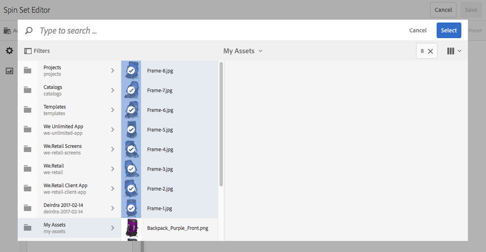

# 혼합 미디어 세트{#mixed-media-sets}

혼합 미디어 세트를 사용하면 이미지, 이미지 세트, 스핀 세트 및 비디오를 하나의 프레젠테이션에 혼합할 수 있습니다.

Mixed Media Sets are designated by a banner with the word **[!UICONTROL MixedMediaSet]**. In addition, if the Mixed Media Set is published, then the publish date, indicated by the **[!UICONTROL World]** icon is on the banner along with the last modification date, indicated by the **[!UICONTROL Pencil]** icon displays.

>[!NOTE]
>
>자산 사용자 인터페이스에 대한 자세한 내용은 [Touch UI를 사용하여 에셋 관리](/help/assets/manage-digital-assets.md).

## 빠른 시작: 혼합 미디어 집합 {#quick-start-mixed-media-sets}

혼합 미디어 세트를 사용하여 신속하게 시작하고 실행하려면 다음 단계를 따르십시오.

1. [에셋 업로드](#uploading-assets).

   Start by uploading the images and videos for your Mixed Media Sets. If necessary, create your [Image Sets](/help/assets/dynamic-media/image-sets.md) and [Spin Sets](/help/assets/dynamic-media/spin-sets.md). 사용자는 혼합 미디어 집합 뷰어에서 이미지를 확대할 수 있으므로 이미지를 선택할 때 확대/축소를 고려해야 합니다. 이미지의 크기가 가장 큰 것이 2000픽셀 이상인지 확인하십시오.

   다음을 참조하십시오 [Dynamic Media - 지원되는 래스터 이미지 형식](/help/assets/file-format-support.md#image-support-dynamic-media) 혼합 미디어 집합에서 지원하는 형식 목록입니다.

1. [혼합 미디어 집합 만들기](#creating-mixed-media-sets).

   혼합 미디어 세트를 만들려면 자산 페이지에서 로 이동합니다. **[!UICONTROL 만들기]** > **[!UICONTROL 혼합 미디어 집합]** 세트 이름을 지정하고, 에셋을 선택한 다음 이미지가 나타나는 순서를 선택합니다.

   다음을 참조하십시오 [선택기를 사용한 작업](/help/assets/dynamic-media/working-with-selectors.md).

1. 설정 [혼합 미디어 뷰어 사전 설정](/help/assets/dynamic-media/managing-viewer-presets.md), 필요한 경우.

   Administrators can create or modify Mixed Media Set Viewer Presets. To see your mixed media with a viewer preset, select the mixed media set, and in the left-rail drop-down menu, select **[!UICONTROL Viewers]**.

   뷰어 사전 설정을 만들거나 편집하려면 다음 위치로 이동합니다. **[!UICONTROL 도구]** > **[!UICONTROL 에셋]** > **[!UICONTROL 뷰어 사전 설정]**.

   다음을 참조하십시오 [뷰어 사전 설정 추가 및 편집](/help/assets/dynamic-media/managing-viewer-presets.md).

1. [혼합 미디어 집합 미리 보기](#previewing-mixed-media-sets).

   혼합 미디어 세트를 선택하면 미리 볼 수 있습니다. 선택한 뷰어에서 혼합 미디어 세트를 검사하려면 썸네일 아이콘을 선택합니다. 다음에서 다른 뷰어를 선택할 수 있습니다. **[!UICONTROL 뷰어]** 메뉴, 왼쪽 레일 드롭다운 메뉴에서 사용할 수 있습니다.

1. [혼합 미디어 집합 게시](#publishing-mixed-media-sets).

   혼합 미디어 세트를 게시하면 URL 및 포함 문자열이 활성화됩니다. 또한 [뷰어 사전 설정 게시](/help/assets/dynamic-media/managing-viewer-presets.md#publishing-viewer-presets).

1. [웹 애플리케이션에 URL 연결](/help/assets/dynamic-media/linking-urls-to-yourwebapplication.md) 또는 [비디오 또는 이미지 뷰어 포함](/help/assets/dynamic-media/embed-code.md).

   Adobe Experience Manager Assets는 혼합 미디어 세트에 대한 URL 호출을 생성하고 혼합 미디어 세트를 게시한 후 활성화합니다. 에셋을 미리 볼 때 이러한 URL을 복사할 수 있습니다. 또는 웹 사이트에 포함할 수 있습니다.

   혼합 미디어 세트를 선택한 다음 왼쪽 레일 드롭다운 메뉴에서 을(를) 선택합니다 **[!UICONTROL 뷰어]**.

   다음을 참조하십시오 [웹 페이지에 혼합 미디어 집합 연결](/help/assets/dynamic-media/linking-urls-to-yourwebapplication.md) 및 [비디오 또는 이미지 뷰어 포함](/help/assets/dynamic-media/embed-code.md).

필요한 경우 를 편집할 수 있습니다 [혼합 미디어 집합](#editing-mixed-media-sets). 또한 을 보고 수정할 수 있습니다 [혼합 미디어 집합 속성](/help/assets/manage-digital-assets.md#editing-properties).

>[!NOTE]
>
>세트를 생성하는 데 문제가 있는 경우 다음을 참조하십시오. [Dynamic Media 문제 해결](/help/assets/dynamic-media/troubleshoot-dm.md).

## 에셋 업로드 {#uploading-assets}

Start by uploading the images and videos for your Mixed Media Sets. 사용자는 혼합 미디어 집합 뷰어에서 이미지를 확대할 수 있습니다. 따라서 이러한 확대/축소 기능을 염두에 두고 이미지를 선택하십시오. 이미지의 크기가 가장 큰 것이 2000픽셀 이상인지 확인하십시오.

또한 혼합 미디어 세트에 스핀 세트 또는 이미지 세트를 추가하려면 스핀 세트 또는 이미지 세트도 만듭니다.

다음을 참조하십시오 [Dynamic Media - 지원되는 래스터 이미지 형식](/help/assets/file-format-support.md#image-support-dynamic-media) 혼합 미디어 집합에서 지원하는 형식 목록입니다.

## 혼합 미디어 집합 만들기 {#creating-mixed-media-sets}

이미지, 이미지 세트, 스핀 세트 및 비디오를 혼합 미디어 세트에 추가할 수 있습니다. 혼합 미디어 세트에 추가하기 전에 파일, 이미지 세트 및 스핀 세트를 게시할 준비가 되었는지 확인하십시오.

세트에 자산을 추가하면 영숫자 순서로 자산이 자동으로 추가됩니다. 자산이 추가된 후 수동으로 순서를 변경하거나 정렬할 수 있습니다.

**혼합 미디어 세트를 만들려면:**

1. Assets에서 혼합 미디어 세트를 만들 위치로 이동한 다음 를 선택합니다 **[!UICONTROL 만들기]**, 및 선택 **[!UICONTROL 혼합 미디어 집합]**. You can also create the set from inside a folder that contains your assets. The Mixed Media Set Editor displays.

   

1. 혼합 미디어 세트 편집기에서 **[!UICONTROL 제목]**&#x200B;혼합 미디어 세트의 이름을 입력합니다. 이름은 혼합 미디어 세트의 배너에 표시됩니다. 설명을 입력합니다(선택적).

   

   >[!NOTE]
   >
   >혼합 미디어 세트를 만들 때 혼합 미디어 세트 썸네일을 변경하거나 Experience Manager이 혼합 미디어 세트의 에셋에 따라 썸네일을 자동으로 선택하도록 할 수 있습니다. 썸네일을 선택하려면 **[!UICONTROL 썸네일 변경]** 이미지를 선택하고 다른 폴더로 이동하여 이미지를 찾을 수도 있습니다. 썸네일을 선택한 경우 Experience Manager에서 혼합 미디어 세트에서 썸네일을 생성하도록 결정한 다음 을 선택합니다. **[!UICONTROL 자동 썸네일로 전환]**.

1. 혼합 미디어 집합에 포함할 자산을 선택하려면 자산 선택기를 선택합니다. 선택한 다음 를 선택합니다. **[!UICONTROL 선택]**.

   자산 선택기를 사용하여 키워드를 입력하고 를 선택하여 자산을 검색할 수 있습니다 **[!UICONTROL 반환]**. You can also apply filters to refine your search results. You can filter by path, collection, file type, and tag. 필터를 선택한 다음 **[!UICONTROL 필터]** 아이콘을 클릭합니다. Change the view by selecting the **[!UICONTROL View]** icon and selecting **[!UICONTROL List View]**, **[!UICONTROL Column View]**, or **[!UICONTROL Card View]**.

   다음을 참조하십시오 [선택기를 사용한 작업](/help/assets/dynamic-media/working-with-selectors.md).

   

1. 목록을 위나 아래로 드래그하여 자산 순서 바꾸기(다음을 선택해야 함) **[!UICONTROL 순서 바꾸기]** 아이콘)을 클릭하여 제품에서 사용할 수 있습니다.

   

   썸네일을 추가하려면 **+** **[!UICONTROL 축소판]** 이미지 옆에 있는 아이콘을 클릭하고 원하는 썸네일로 이동합니다. 모든 썸네일 이미지 선택을 완료하면 을 선택합니다. **[!UICONTROL 저장]**.

   >[!NOTE]
   >
   >자산을 추가하려면 을 선택합니다. **[!UICONTROL 자산 추가]**.

1. 에셋을 삭제하려면 해당 확인란을 선택하고 을 선택합니다 **[!UICONTROL 자산 삭제]**.
1. 사전 설정을 적용하려면 다음을 선택합니다 **[!UICONTROL 사전 설정]** 오른쪽 상단 모서리에서 에셋에 적용할 사전 설정을 선택합니다.
1. **[!UICONTROL 저장]**&#x200B;을 선택합니다. 새로 만든 혼합 미디어 세트가 작성한 폴더에 나타납니다.

## 혼합 미디어 집합 편집 {#editing-mixed-media-sets}

사용자 인터페이스에서 직접 혼합 미디어 세트의 자산에 대한 다양한 편집 작업을 수행할 수 있습니다 [assets의 모든 에셋과 마찬가지로](/help/assets/manage-digital-assets.md). 혼합 미디어 집합에서 다음 작업을 수행할 수도 있습니다.

* 혼합 미디어 집합에 자산을 추가합니다.
* 혼합 미디어 집합에서 에셋 순서를 변경합니다.
* 혼합 미디어 집합에서 자산을 삭제합니다.
* 뷰어 사전 설정을 적용합니다.
* 기본 썸네일을 변경합니다.

**혼합 미디어 세트를 편집하려면:**

1. 다음 중 하나를 수행합니다.

   * 혼합 미디어 집합 자산을 마우스로 가리킨 다음 을 선택합니다. **[!UICONTROL 편집]** (연필 아이콘).
   * 혼합 미디어 집합 에셋 위로 마우스를 가져간 후 **[!UICONTROL 선택]** (확인 표시 아이콘)을 클릭한 다음 을 선택합니다 **[!UICONTROL 편집]** 을 클릭합니다.

   * 혼합 미디어 세트 자산을 선택한 다음 을 선택합니다. **[!UICONTROL 편집]** (연필 아이콘).

1. 혼합 미디어 세트 편집기에서 다음 중 하나를 수행합니다.

   * 에셋 순서 바꾸기 - 왼쪽 패널에서 **[!UICONTROL 에셋]** (그림 아이콘) 에셋을 새 위치로 드래그합니다.
   * 에셋을 추가하려면 - 도구 모음에서 **[!UICONTROL 자산 추가]**. 에셋으로 이동합니다. 추가할 각 에셋에 대해 에셋의 이름 대신 이미지 위로 마우스를 가져간 다음 확인 표시 아이콘을 선택합니다. 오른쪽 상단 모서리에서 을(를) 선택합니다. **[!UICONTROL 선택]**.

   * 에셋을 삭제하려면 왼쪽 패널에서 를 선택합니다. **[!UICONTROL 에셋]** (그림 아이콘)을 클릭한 다음 에셋을 선택합니다. 도구 모음 막대에서 을 선택합니다. **[!UICONTROL 자산 삭제]**.

   * 자산을 이름별로 오름차순 또는 내림차순으로 정렬하려면 왼쪽 패널에서 을 선택합니다 **[!UICONTROL 에셋]** (그림 아이콘). 의 오른쪽에 **[!UICONTROL 에셋]** 머리글에서 위쪽 또는 아래쪽 캐럿 아이콘을 선택합니다.

      >[!NOTE]
      >
      >* 전체 혼합 미디어 세트를 모든 보기 모드(예: **[!UICONTROL 카드 보기]** 또는 **[!UICONTROL 열 보기]**) 혼합 미디어 세트로 이동합니다. 자산을 마우스로 가리킨 다음, 선택할 수 있도록 확인 표시 아이콘을 선택합니다. 누르기 **[!UICONTROL 백스페이스]** 키보드에서 또는 을(를) 선택합니다 **[!UICONTROL 자세히]** (세 점) 을 클릭하여 도구 모음에서 **[!UICONTROL 삭제]**.
      >
      >* 해당 세트로 이동하여 혼합 미디어 세트의 자산을 편집할 수 있습니다. 왼쪽 레일에서 을 선택합니다. **[!UICONTROL 구성원 설정]**&#x200B;을(를) 선택한 다음 **[!UICONTROL 연필]** 아이콘을 클릭하여 편집 창을 엽니다.

1. 선택 **[!UICONTROL 저장]** 편집을 마치면

   >[!NOTE]
   >
   >* To edit the assets in a Mixed Media Set - Navigate to the Mixed Media Set. Experience Manager 세트 미리 보기 페이지에서 세트를 열 수 있도록 세트를 탭(선택하지 않음)합니다. 왼쪽 레일에서 드롭다운 캐럿을 선택하여 드롭다운 목록을 연 다음 을 선택합니다 **[!UICONTROL 구성원 설정]**. 구성원 설정 페이지에서 자산을 마우스로 가리킨 다음 을 선택합니다 **[!UICONTROL 편집]** (연필 아이콘) 을 클릭하여 편집 페이지를 엽니다.
   >
   >* To delete an entire Mixed Media Set - From any viewing mode (such as Card view or Column view), navigate to the Mixed Media Set. 세트를 마우스로 가리킨 다음 을 선택합니다 **[!UICONTROL 선택]** (확인 표시 아이콘) 누르기 **[!UICONTROL 백스페이스]** 키보드에서 또는 을(를) 선택합니다 **[!UICONTROL 자세히]** (세 점의 행), 다음 선택 **[!UICONTROL 삭제]**.

## 혼합 미디어 집합 미리 보기 {#previewing-mixed-media-sets}

다음을 참조하십시오 [에셋 미리보기](/help/assets/dynamic-media/previewing-assets.md) 혼합 미디어 세트를 미리 보는 방법에 대한 자세한 내용.

## 혼합 미디어 집합 게시 {#publishing-mixed-media-sets}

다음을 참조하십시오 [자산 게시](/help/assets/dynamic-media/publishing-dynamicmedia-assets.md) 혼합 미디어 세트를 게시하는 방법에 대한 자세한 내용을 참조하십시오.

>[!NOTE]
>
>혼합 미디어 세트를 처음 게시할 때 게재 서비스에 완전히 끝나지 않으면 혼합 미디어 세트를 두 번째로 게시합니다.
