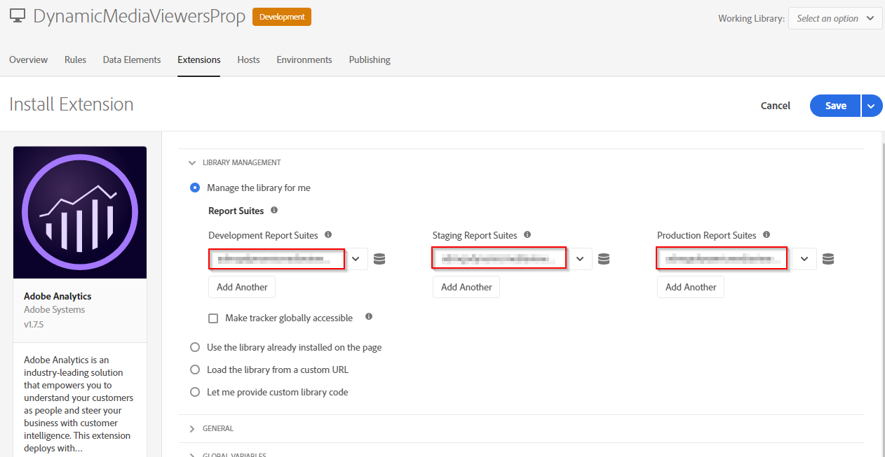
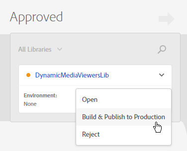
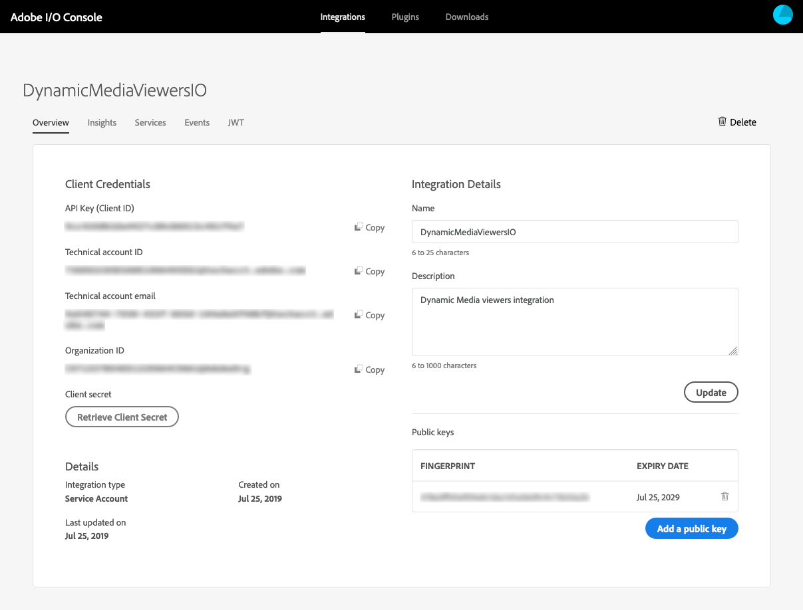

# Dynamic Media 뷰어를 Adobe Analytics 및 Experience Platform 태그와 통합 {#integrating-dynamic-media-viewers-with-adobe-analytics-and-adobe-launch}

## Adobe Analytics 및 Experience Platform 태그와 Dynamic Media Viewer 통합이란 무엇입니까? {#what-is-dynamic-media-viewers-integration-with-adobe-analytics-and-adobe-launch}

<!-- Leave this hidden path here; it points to the topic source from Sasha https://wiki.corp.adobe.com/pages/viewpage.action?spaceKey=~oufimtse&title=Dynamic+Media+Viewers+integration+with+Adobe+Launch 

name used to be Experience Platform Launch. Changed to Experience Platform Data Collection-->

*Dynamic Media 뷰어* Experience Platform 태그 및 Dynamic Media 뷰어 5.13용 확장을 사용하면 Adobe Analytics 및 Experience Platform 태그 고객이 Experience Platform 태그 구성에서 Dynamic Media 뷰어에 대한 특정 이벤트 및 데이터를 사용할 수 있습니다.

이 통합은 Adobe Analytics을 사용하여 웹 사이트에서 Dynamic Media 뷰어 사용을 추적할 수 있음을 의미합니다. 동시에 Adobe 또는 서드파티의 다른 Experience Platform 태그 확장과 함께 뷰어가 공개한 이벤트 및 데이터를 사용할 수 있습니다.

Adobe 확장 또는 타사 확장에 대한 자세한 내용은 [Adobe 확장](https://experienceleague.adobe.com/docs/experience-platform/tags/extensions/overview.html) ( Experience Platform 태그 사용 안내서)를 참조하십시오.

**이 항목은 다음에 적용됩니다.** 사이트 관리자, Adobe Experience Manager 프로그램의 개발자 및 작업 인력입니다.

### 통합의 제한 사항 {#limitations-of-the-integration}

* Dynamic Media 뷰어에 대한 Experience Platform 태그 통합이 Experience Manager 작성자 노드에서 작동하지 않습니다. WCM 페이지는 게시될 때까지 추적할 수 없습니다.
* Dynamic Media 뷰어에 대한 Experience Platform 태그 통합은 자산 세부 사항 페이지의 &quot;URL&quot; 단추를 사용하여 뷰어 URL을 가져오는 &quot;팝업&quot; 작업 모드에 대해서는 지원되지 않습니다.
* Experience Platform 태그 통합은 기존 뷰어 Analytics 통합과 동시에 사용할 수 없습니다(방법: `config2=` 매개 변수)를 참조하십시오.
* 비디오 추적에 대한 지원은에 설명된 대로 코어 재생 추적으로만 제한됩니다 [추적 개요](https://experienceleague.adobe.com/docs/media-analytics/using/tracking/track-av-playback/track-core-overview.html?lang=en#player-events). 특히 QoS, 광고, 챕터/세그먼트 또는 오류 추적이 지원되지 않습니다.
* 데이터 요소에 대한 저장 유지 시간 구성은 데이터 요소가 *Dynamic Media 뷰어* 확장명. 저장소 기간은 다음으로 설정되어야 합니다. **[!UICONTROL 없음]**.

### 통합에 대한 사용 사례 {#use-cases-for-the-integration}

Experience Platform 태그와 통합하기 위한 주요 사용 사례는 Experience Manager Assets과 Experience Manager Sites을 모두 사용하는 고객입니다. 이러한 시나리오에서는 Experience Manager 작성자 노드와 Experience Platform 태그 간에 표준 통합을 설정한 다음 Sites 인스턴스를 Experience Platform 태그 속성과 연결할 수 있습니다. 이후 Sites 페이지에 추가된 모든 Dynamic Media WCM 구성 요소는 뷰어의 데이터 및 이벤트를 추적합니다.

다음을 참조하십시오 [Experience Manager Sites에서 Dynamic Media 뷰어 추적](#tracking-dynamic-media-viewers-in-aem-sites).

통합이 지원하는 보조 사용 사례는 Experience Manager Assets 전용 또는 Dynamic Media Classic을 사용하는 고객입니다. 이러한 경우 뷰어에 대한 포함 코드를 가져와 웹 사이트 페이지에 추가합니다. 그런 다음 Experience Platform 태그에서 Experience Platform 태그 라이브러리 프로덕션 URL을 가져와 웹 페이지 코드에 수동으로 추가합니다.

다음을 참조하십시오 [포함 코드를 사용하여 Dynamic Media 뷰어 추적](#tracking-dynamic-media-viewers-using-embed-code).

## 통합에서 데이터 및 이벤트 추적이 작동하는 방식 {#how-data-and-event-tracking-works-in-the-integration}

통합은 Dynamic Media 뷰어 추적의 두 가지 독립적이고 독립적인 유형을 사용합니다. *Adobe Analytics* 및 *오디오 및 비디오용 Adobe Analytics*.

### Adobe Analytics을 사용한 추적 기본 정보  {#about-tracking-using-adobe-analytics}

Adobe Analytics을 사용하면 사용자가 웹 사이트에서 Dynamic Media 뷰어와 상호 작용할 때 수행하는 작업을 추적할 수 있습니다. Adobe Analytics을 사용하면 뷰어별 데이터를 추적할 수도 있습니다. 예를 들어, 자산 이름, 발생한 확대/축소 작업 및 비디오 재생 작업과 함께 보기 로드 이벤트를 추적하고 기록할 수 있습니다.

Experience Platform 태그에서 의 개념 *데이터 요소* 및 *규칙* 함께 작업하여 Adobe Analytics 추적을 활성화합니다.

#### Experience Platform 태그의 데이터 요소 정보 {#about-data-elements-in-adobe-launch}

Experience Platform 태그의 데이터 요소는 값이 웹 페이지나 Dynamic Media 뷰어 데이터의 상태에 따라 정적으로 정의되거나 동적으로 계산되는 명명된 속성입니다.

데이터 요소 정의에 사용할 수 있는 옵션은 Experience Platform 태그 속성에 설치된 확장 목록에 따라 다릅니다. &quot;코어&quot; 확장은 사전 설치되어 있으며 모든 구성에서 즉시 사용할 수 있습니다. 이 &quot;코어&quot; 확장을 사용하면 쿠키, JavaScript 코드, 쿼리 문자열 및 기타 여러 소스에서 가져온 데이터 요소를 정의할 수 있습니다.

Adobe Analytics 추적의 경우에서 설명한 대로 몇 가지 다른 확장을 설치해야 합니다 [확장 설치 및 설정](#installing-and-setup-of-extensions). Dynamic Media 뷰어 확장은 Dynamic Viewer 이벤트의 인수인 값을 정의하는 기능을 추가합니다. 예를 들어 뷰어 유형 또는 로드 시 뷰어에서 보고하는 자산 이름, 최종 사용자가 확대/축소할 때 보고되는 확대/축소 수준 등을 참조할 수 있습니다.

Dynamic Media 뷰어 확장은 데이터 요소의 값을 자동으로 최신 상태로 유지합니다.

데이터 요소를 정의한 후 데이터 요소 선택기 위젯을 사용하여 Experience Platform 태그 UI의 다른 위치에서 데이터 요소를 사용할 수 있습니다. 특히, Dynamic Media 뷰어 추적을 위해 정의된 데이터 요소는 규칙에서 Adobe Analytics 확장의 변수 설정 작업에서 참조합니다(아래 참조).

다음을 참조하십시오 [데이터 요소](https://experienceleague.adobe.com/docs/experience-platform/tags/ui/data-elements.html) ( Experience Platform 태그 사용 안내서)를 참조하십시오.

#### Experience Platform 태그의 규칙 정보 {#about-rules-in-adobe-launch}

Experience Platform 태그의 규칙은 규칙을 구성하는 세 가지 영역을 정의하는 독립적인 구성입니다. *이벤트*, *조건*, 및 *작업*:

* *이벤트* (if) 규칙을 트리거할 시기를 Experience Platform 태그에 알려줍니다.
* *조건* (if) Experience Platform 태그에서 규칙을 트리거할 때 허용하거나 허용하지 않을 수 있는 다른 제한 사항을 알려줍니다.
* *작업* (그런 다음) 규칙이 트리거될 때 수행할 작업을 Experience Platform 태그에 알려줍니다.

이벤트, 조건 및 작업 섹션에서 사용할 수 있는 옵션은 Experience Platform 태그 속성에 설치된 확장에 따라 다릅니다. 다음 *코어* 확장이 사전 설치되어 있으며 모든 구성에서 즉시 사용할 수 있습니다. 확장은 포커스 변경, 키 누르기 및 양식 제출을 포함하는 기본 브라우저 수준 작업과 같은 이벤트에 대한 몇 가지 옵션을 제공합니다. 쿠키 값, 브라우저 유형 등과 같은 조건에 대한 옵션도 포함되어 있습니다. 작업의 경우 사용자 지정 코드 옵션만 사용할 수 있습니다.

Adobe Analytics 추적의 경우에서 설명한 대로 다른 여러 확장을 설치해야 합니다 [확장 설치 및 설정](#installing-and-setup-of-extensions). 특히:

* Dynamic Media 뷰어 확장은 지원되는 이벤트 목록을 뷰어 로드, 에셋 교체, 확대 및 비디오 재생과 같은 Dynamic Media 뷰어와 관련된 이벤트로 확장합니다.
* Adobe Analytics 확장은 추적 서버로 데이터를 전송하는 데 필요한 두 가지 작업으로 지원되는 작업 목록을 확장합니다. *변수 설정* 및 *비콘 보내기*.

Dynamic Media 뷰어를 추적하려면 다음 유형을 사용할 수 있습니다.

* Dynamic Media 뷰어 확장, 코어 확장 또는 기타 확장의 이벤트.
* 규칙 정의의 조건. 또는 조건 영역을 비워둘 수 있습니다.

작업 섹션에서 다음을 수행해야 합니다 *변수 설정* 작업. 이 작업은 Adobe Analytics에 추적 변수를 데이터로 채우는 방법을 알려 줍니다. 동시에 *변수 설정* 작업이 추적 서버로 아무 것도 보내지 않습니다.

다음 *변수 설정* 작업 뒤에 다음 문자가 와야 합니다. *비콘 보내기* 작업. 다음 *비콘 보내기* 작업이 실제로 analytics 추적 서버로 데이터를 전송합니다. 두 작업 모두, *변수 설정* 및 *비콘 보내기*: Adobe Analytics 확장에서 가져옵니다.

다음을 참조하십시오 [규칙](https://experienceleague.adobe.com/docs/experience-platform/tags/ui/rules.html) ( Experience Platform 태그 사용 안내서)를 참조하십시오.

#### 샘플 구성 {#sample-configuration}

Experience Platform 태그 내의 다음 샘플 구성은 뷰어 로드 시 에셋 이름을 추적하는 방법을 보여 줍니다.

1. 다음에서 **[!UICONTROL 데이터 요소]** 탭, 데이터 요소 정의 `AssetName` 이 참조한 항목 `asset` 매개 변수 `LOAD` Dynamic Media 뷰어 확장의 이벤트입니다.

   

1. 다음에서 **[!UICONTROL 규칙]** 탭, 규칙 정의 *TrackAssetOnLoad*.

   이 규칙에서 **[!UICONTROL 이벤트]** 필드는 **[!UICONTROL 로드]** Dynamic Media 뷰어 확장의 이벤트입니다.

   

1. 작업 구성에는 Adobe Analytics 확장의 두 가지 작업 유형이 있습니다.

   *변수 설정*, 선택한 analytics 변수를 값에 매핑 `AssetName` 데이터 요소입니다.

   *비콘 보내기*: Adobe Analytics에 추적 정보를 보냅니다.

   

1. 결과 규칙 구성은 다음과 같이 표시됩니다.

   

### 오디오 및 비디오용 Adobe Analytics 정보 {#about-adobe-analytics-for-audio-and-video}

Experience Cloud 계정이 Adobe Analytics for Audio and Video 사용을 구독할 때 *Dynamic Media 뷰어* 확장 설정. Adobe Analytics에서 비디오 지표를 사용할 수 있게 되었습니다. 비디오 추적은 오디오 및 비디오 확장용 Adobe Medium Analytics의 존재 여부에 따라 달라집니다.

다음을 참조하십시오 [확장 설치 및 설정](#installing-and-setup-of-extensions).

현재에 설명된 대로 비디오 추적에 대한 지원은 &quot;코어 재생&quot; 추적으로만 제한됩니다 [추적 개요](https://experienceleague.adobe.com/docs/media-analytics/using/tracking/track-av-playback/track-core-overview.html?lang=en#player-events). 특히 QoS, 광고, 챕터/세그먼트 또는 오류 추적이 지원되지 않습니다.

## Dynamic Media 뷰어 확장 사용 {#using-the-dynamic-media-viewers-extension}

에서 언급된 바와 같이 [통합에 대한 사용 사례](#use-cases-for-the-integration), Experience Manager Sites의 새로운 Experience Platform 태그 통합으로 포함 코드를 사용하여 Dynamic Media 뷰어를 추적할 수 있습니다.

### Experience Manager Sites에서 Dynamic Media 뷰어 추적 {#tracking-dynamic-media-viewers-in-aem-sites}

Experience Manager Sites에서 Dynamic Media 뷰어를 추적하려면 아래에 나열된 모든 단계를 [모든 통합 부분 구성](#configuring-all-the-integration-pieces) 섹션을 수행해야 합니다. 특히 IMS 구성 및 Experience Platform 태그 클라우드 구성을 만들어야 합니다.

적절한 구성에 따라 Dynamic Media에서 지원하는 WCM 구성 요소를 사용하여 Sites 페이지에 추가하는 모든 Dynamic Media 뷰어는 Adobe Analytics나 비디오용 Adobe Analytics 또는 둘 다에 데이터를 자동으로 추적합니다.

다음을 참조하십시오 [Adobe 사이트를 사용하여 페이지에 Dynamic Media 에셋 추가](/help/assets/dynamic-media/adding-dynamic-media-assets-to-pages.md).

### 포함 코드를 사용하여 Dynamic Media 뷰어 추적 {#tracking-dynamic-media-viewers-using-embed-code}

Experience Manager Sites을 사용하지 않거나 Dynamic Media 뷰어를 Experience Manager Sites 외부의 웹 페이지에 임베드하는 고객 또는 둘 다 여전히 Experience Platform 태그 통합을 사용할 수 있습니다.

에서 구성 단계를 완료합니다. [Adobe Analytics 구성](#configuring-adobe-analytics-for-the-integration) 및 [Experience Platform 태그 구성](#configuring-adobe-launch-for-the-integration) 섹션. 그러나 Experience Manager 관련 구성 단계는 필요하지 않습니다.

적절한 구성에 따라 Dynamic Media 뷰어를 사용하여 웹 페이지에 Experience Platform 태그 지원을 추가할 수 있습니다.

다음을 참조하십시오 [Experience Platform 태그 포함 코드 추가](https://experienceleague.adobe.com/docs/platform-learn/implement-in-websites/configure-tags/add-embed-code.html) Experience Platform 태그 라이브러리 포함 코드를 사용하는 방법에 대해 자세히 알아보십시오.

Dynamic Media Experience Manager의 포함 코드 기능을 사용하는 방법에 대한 자세한 내용은 [웹 페이지에 비디오 또는 이미지 뷰어 포함](/help/assets/dynamic-media/embed-code.md).

**포함 코드를 사용하여 Dynamic Media 뷰어 추적:**

1. Dynamic Media 뷰어를 포함할 웹 페이지를 준비했습니다.
1. 먼저 Experience Platform 태그에 로그인하여 Experience Platform 태그 라이브러리에 대한 포함 코드 가져오기(참조) [Experience Platform 태그 구성](#configuring-adobe-launch-for-the-integration)).
1. 선택 **[!UICONTROL 속성]**&#x200B;을(를) 선택한 다음 **[!UICONTROL 환경]** 탭.
1. 웹 페이지의 환경과 관련된 환경 수준을 선택합니다. 그런 다음 **[!UICONTROL 설치]** 열에서 상자 아이콘을 선택합니다.
1. **[!UICONTROL 웹 설치 지침]** 대화 상자에서 전체 Experience Platform 태그 라이브러리 포함 코드를 주변 코드와 함께 복사합니다. `<script/>` 태그 사이에 코드를 삽입하지 마십시오.

## Dynamic Media 뷰어 확장에 대한 참조 안내서 {#reference-guide-for-the-dynamic-media-viewers-extension}

### Dynamic Media 뷰어 구성 정보 {#about-the-dynamic-media-viewers-configuration}

아래 조건이 충족되는 경우 Dynamic Media 뷰어 확장 기능은 Experience Platform 태그 라이브러리와 자동으로 통합됩니다.

* Experience Platform 태그 라이브러리 전역 개체( `_satellite`)가 페이지에 표시됩니다.
* Dynamic Media 뷰어 확장 기능 `_dmviewers_v001()` 다음에서 정의됨: `_satellite`.

* `config2=` viewer 매개 변수가 지정되지 않았습니다. 즉, 뷰어가 이전 Analytics 통합을 사용하지 않습니다.

또한 를 지정하여 뷰어에서 Experience Platform 태그 통합을 명시적으로 비활성화하는 옵션이 있습니다 `launch=0` 뷰어 구성의 매개 변수. 이 매개 변수의 기본값은 입니다. `1`.

### Dynamic Media 뷰어 확장 구성 {#configuring-the-dynamic-media-viewers-extension}

Dynamic Media 뷰어 확장에 대한 유일한 구성 옵션은 다음과 같습니다. **[!UICONTROL 오디오 및 비디오용 Adobe Medium Analytics 활성화]**.

이 옵션을 선택하고(활성화) 오디오 및 비디오용 Adobe Medium 분석 확장이 설치 및 구성되면 비디오 재생 지표가 오디오 및 비디오용 Adobe Analytics 솔루션으로 전송됩니다. 이 옵션을 비활성화하면 비디오 추적이 꺼집니다.

이 옵션을 활성화하면 *없이* 오디오 및 비디오용 Adobe Medium Analytics 확장 프로그램이 설치되어 있으면 옵션이 적용되지 않습니다.

### Dynamic Media 뷰어 확장의 데이터 요소 정보 {#about-data-elements-in-the-dynamic-media-viewers-extension}

The only Data Element type that the Dynamic Media Viewers extension provides is **[!UICONTROL Viewer Event]** from the **[!UICONTROL Data Element Type]** drop-down list.

선택하면 데이터 요소 편집기에서 두 개의 필드가 있는 양식을 렌더링합니다.

* **[!UICONTROL DM viewers event data type]** - a drop-down list that identifies all viewer events that are supported by the Dynamic Media Viewers extension which have arguments, plus a special **[!UICONTROL COMMON]** item. A **[!UICONTROL COMMON]** item represents a list of event parameters that are common to all type of events sent by the viewers.
* **[!UICONTROL 추적 매개 변수]** - 선택한 Dynamic Media 뷰어 이벤트의 인수

다음을 참조하십시오. [Dynamic Media 뷰어 참조 안내서](https://experienceleague.adobe.com/docs/dynamic-media-developer-resources/library/viewers-aem-assets-dmc/c-html5-s7-aem-asset-viewers.html) 각 뷰어 유형별로 지원되는 이벤트 목록을 보려면 특정 뷰어 섹션으로 이동한 다음, Adobe Analytics 추적 지원 하위 섹션을 선택하십시오. 현재 Dynamic Media 뷰어 참조 안내서에서는 이벤트 인수를 문서화하지 않습니다.

이제 Dynamic Media 뷰어의 수명 주기를 고려하겠습니다 *데이터 요소*. 이러한 데이터 요소의 값은 해당 Dynamic Media 뷰어 이벤트가 페이지에서 발생한 후에 채워집니다. 예를 들어 데이터 요소가 **[!UICONTROL 로드]** event와 해당 &quot;asset&quot; 인수 이러한 데이터 요소의 값은 뷰어가 LOAD 이벤트를 처음 실행한 후 유효한 데이터를 받습니다. 데이터 요소가 **[!UICONTROL 확대/축소]** event와 해당 &quot;scale&quot; 인수, 이러한 데이터 요소의 값은 뷰어가 **[!UICONTROL 확대/축소]** 첫 번째 이벤트입니다.

Similarly, the values of Data Elements get automatically updated when the viewer sends a corresponding event on the page. The value update happens even if the particular event is not specified in the Rule configuration. 예를 들어 데이터 요소가 **[!UICONTROL 확대/축소 비율]** 는 ZOOM 이벤트의 &quot;배율&quot; 매개변수에 대해 정의됩니다. 단, 규칙 구성에 있는 유일한 규칙은 **[!UICONTROL 로드]** 이벤트. 값: **[!UICONTROL 확대/축소 비율]** 는 사용자가 뷰어 내에서 확대/축소를 실행할 때마다 계속 업데이트됩니다.

Any Dynamic Media viewer has a unique identifier on the web page. 데이터 요소는 값 자체와 값을 채운 뷰어를 추적합니다. 예를 들어, 동일한 페이지에 여러 명의 뷰어가 있고 **[!UICONTROL AssetName]** 을 가리키는 데이터 요소 **[!UICONTROL 로드]** event와 해당 &quot;asset&quot; 인수 다음 **[!UICONTROL AssetName]** 데이터 요소는 페이지에 로드된 각 뷰어와 연결된 자산 이름의 컬렉션을 유지 관리합니다.

데이터 요소가 반환하는 정확한 값은 컨텍스트에 따라 다릅니다. Dynamic Media 뷰어 이벤트에 의해 트리거된 규칙에서 데이터 요소가 요청되면 규칙을 시작한 뷰어에 대해 데이터 요소 값이 반환됩니다. 또한 데이터 요소는 다른 일부 Experience Platform 태그 확장의 이벤트에 의해 트리거된 규칙에서 요청됩니다. 이때 데이터 요소의 값은 이 데이터 요소를 마지막으로 업데이트한 뷰어에서 가져옵니다.

**다음 샘플 설정을 고려하십시오.**

* 두 개의 Dynamic Media 확대/축소 뷰어가 있는 웹 페이지: *viewer1* 및 *viewer2*.

* **[!UICONTROL 확대/축소 비율]** 데이터 요소는 다음을 가리킵니다. **[!UICONTROL 확대/축소]** event와 해당 &quot;scale&quot; 인수
* **[!UICONTROL TrackPan]** 다음을 포함한 규칙:

   * Dynamic Media 뷰어 사용 **[!UICONTROL 패닝]** 이벤트를 트리거로 사용합니다.
   * 다음 값 전송 **[!UICONTROL 확대/축소 비율]** Adobe Analytics에 대한 데이터 요소.

* **[!UICONTROL TrackKey]** 다음을 포함한 규칙:

   * 코어 Experience Platform 태그 확장의 키 누름 이벤트를 트리거로 사용합니다.
   * 다음 값 전송 **[!UICONTROL 확대/축소 비율]** Adobe Analytics에 대한 데이터 요소.

이제 사용자가 두 명의 뷰어가 있는 웹 페이지를 로드한다고 가정합니다. 위치 *viewer1*, 50% 스케일로 확대한 다음 로 확대합니다. *viewer2*, 25% 배율로 확대됩니다. 위치 *viewer1*&#x200B;이미지를 이리저리 회전시키고 마지막으로 키보드의 키를 누릅니다.

사용자의 활동으로 인해 Adobe Analytics에 다음과 같은 두 개의 추적 호출이 수행됩니다.

* 첫 번째 호출은 다음 이유로 발생합니다. **[!UICONTROL TrackPan]** 사용자가 로그인하면 규칙이 트리거됩니다. *viewer1*. 해당 호출은 값으로 50%를 보냅니다. **[!UICONTROL 확대/축소 비율]** 데이터 요소는 규칙이 다음에 의해 트리거됨을 알기 때문입니다. *viewer1* 및 는 해당 배율 값을 가져옵니다.
* 두 번째 호출은 다음 이유로 발생합니다. **[!UICONTROL TrackKey]** 사용자가 키보드에서 키를 누르면 규칙이 트리거됩니다. 해당 호출은 값으로 25%를 보냅니다. **[!UICONTROL 확대/축소 비율]** 규칙이 뷰어에 의해 트리거되지 않았으므로 데이터 요소입니다. 따라서 데이터 요소는 최신 값을 반환합니다.

위에 설정된 샘플은 데이터 요소 값의 수명에도 영향을 줍니다. Dynamic Media 뷰어에서 관리하는 데이터 요소의 값은 뷰어 자체가 웹 페이지에 배치된 후에도 Experience Platform 태그 라이브러리 코드에 저장됩니다. 이 기능은 비 Dynamic Media 뷰어 확장에 의해 트리거되고 이러한 데이터 요소를 참조하는 규칙이 있는 경우 데이터 요소가 마지막으로 알려진 값을 반환함을 의미합니다. 뷰어가 웹 페이지에 더 이상 존재하지 않는 경우에도 마찬가지입니다.

어떤 경우든 Dynamic Media 뷰어에 의해 구동되는 데이터 요소의 값은 로컬 저장소나 서버에 저장되지 않습니다. 대신 클라이언트측 Experience Platform 태그 라이브러리에만 보관됩니다. 이러한 데이터 요소의 값은 웹 페이지가 다시 로드될 때 사라집니다.

일반적으로 데이터 요소 편집기는 [저장 기간 선택](https://experienceleague.adobe.com/docs/experience-platform/tags/ui/data-elements.html#create-a-data-element). 단, Dynamic Media 뷰어 확장을 사용하는 데이터 요소는 의 저장 유지 시간 옵션만 지원합니다. **[!UICONTROL 없음]**. 사용자 인터페이스에서 다른 값을 설정할 수 있지만 이 경우에는 데이터 요소 동작이 정의되지 않습니다. 확장은 데이터 요소의 값을 자체적으로 관리합니다. 즉, 전체 뷰어 수명 주기 동안 뷰어 이벤트 인수의 값을 유지 관리하는 데이터 요소입니다.

### Dynamic Media Viewers 확장의 규칙 정보 {#about-rules-in-the-dynamic-media-viewers-extension}

규칙 편집기에서 확장 기능은 이벤트 편집기에 대한 새 구성 옵션을 추가합니다. 또한 편집기에서는 사전 구성된 데이터 요소를 사용하는 대신 작업 편집기에서 이벤트 매개 변수를 바로 참조할 수 있는 옵션을 제공합니다.

#### 이벤트 편집기 정보 {#about-the-events-editor}

이벤트 편집기에서 Dynamic Media 뷰어 확장은 **[!UICONTROL 이벤트 유형]** 호출됨 **[!UICONTROL 뷰어 이벤트]**.

선택하면 이벤트 편집기에서 드롭다운을 렌더링합니다 **[!UICONTROL Dynamic Media 뷰어 이벤트]**: Dynamic Media 뷰어에서 지원하는 사용 가능한 모든 이벤트를 나열합니다.

#### 작업 편집기 정보 {#about-the-actions-editor}

Dynamic Media 뷰어 확장 기능을 사용하면 Dynamic Media 뷰어의 이벤트 매개 변수를 사용하여 Adobe Analytics 확장의 변수 설정 편집기에서 analytics 변수에 매핑할 수 있습니다.

이를 수행하는 가장 간단한 방법은 다음의 두 단계 프로세스를 완료하는 것입니다.

* 먼저 하나 이상의 데이터 요소를 정의합니다. 여기서 각 데이터 요소는 Dynamic Media 뷰어 이벤트의 매개 변수를 나타냅니다.
* 마지막으로 Adobe Analytics 확장의 변수 설정 편집기에서 데이터 요소 선택 아이콘(스택형 디스크 3개)을 선택하여 데이터 요소 선택 대화 상자를 연 다음, 데이터 요소를 선택합니다.

It is possible, however, to use an alternative approach and bypass Data Element creation. Dynamic Media 뷰어 이벤트에서 인수를 직접 참조할 수 있습니다. 이벤트 인수의 정규화된 이름을 **[!UICONTROL 값]** analytics 변수 할당의 입력 필드. 퍼센트(%) 기호로 둘러싸야 합니다. 예:

`%event.detail.dm.LOAD.asset%`

데이터 요소 사용과 직접 이벤트 인수 참조 간에는 중요한 차이가 있습니다. 데이터 요소의 경우 변수 설정 작업을 트리거하는 이벤트는 중요하지 않습니다. 규칙을 트리거하는 이벤트는 코어 확장에서 웹 페이지를 선택하는 것과 같이 Dynamic Viewer와 관련이 없을 수 있습니다. 그러나 직접 인수 참조를 사용할 때는 규칙을 트리거하는 이벤트가 참조하는 이벤트 인수에 해당하는지 확인하는 것이 중요합니다.

For example, referencing `%event.detail.dm.LOAD.asset%` returns the correct asset name if the Rule is triggered by the **[!UICONTROL LOAD]** event of the Dynamic Media Viewer extension. However, it returns an empty value for any other event.

다음 표에는 Dynamic Media 뷰어 이벤트와 지원되는 인수가 나와 있습니다.

<table>
 <tbody>
  <tr>
   <td>뷰어 이벤트 이름</td>
   <td>인수 참조</td>
  </tr>
  <tr>
   <td><code>COMMON</code></td>
   <td><code>%event.detail.dm.objID%</code></td>
  </tr>
  <tr>
   <td> </td>
   <td><code>%event.detail.dm.compClass%</code></td>
  </tr>
  <tr>
   <td> </td>
   <td><code>%event.detail.dm.instName%</code></td>
  </tr>
  <tr>
   <td> </td>
   <td><code>%event.detail.dm.timeStamp%</code></td>
  </tr>
  <tr>
   <td><code>BANNER</code>  </td>
   <td><code>%event.detail.dm.BANNER.asset%</code></td>
  </tr>
  <tr>
   <td> </td>
   <td><code>%event.detail.dm.BANNER.frame%</code></td>
  </tr>
  <tr>
   <td> </td>
   <td><code>%event.detail.dm.BANNER.label%</code></td>
  </tr>
  <tr>
   <td><code>HREF</code></td>
   <td><code>%event.detail.dm.HREF.rollover%</code></td>
  </tr>
  <tr>
   <td><code>ITEM</code></td>
   <td><code>%event.detail.dm.ITEM.rollover%</code></td>
  </tr>
  <tr>
   <td><code>LOAD</code></td>
   <td><code>%event.detail.dm.LOAD.applicationname%</code></td>
  </tr>
  <tr>
   <td><strong> </strong></td>
   <td><code>%event.detail.dm.LOAD.asset%</code></td>
  </tr>
  <tr>
   <td><strong> </strong></td>
   <td><code>%event.detail.dm.LOAD.company%</code></td>
  </tr>
  <tr>
   <td><strong> </strong></td>
   <td><code>%event.detail.dm.LOAD.sdkversion%</code></td>
  </tr>
  <tr>
   <td><strong> </strong></td>
   <td><code>%event.detail.dm.LOAD.viewertype%</code></td>
  </tr>
  <tr>
   <td><strong> </strong></td>
   <td><code>%event.detail.dm.LOAD.viewerversion%</code></td>
  </tr>
  <tr>
   <td><code>METADATA</code></td>
   <td><code>%event.detail.dm.METADATA.length%</code></td>
  </tr>
  <tr>
   <td> </td>
   <td><code>%event.detail.dm.METADATA.type%</code></td>
  </tr>
  <tr>
   <td><code>MILESTONE</code></td>
   <td><code>%event.detail.dm.MILESTONE.milestone%</code></td>
  </tr>
  <tr>
   <td><code>PAGE</code></td>
   <td><code>%event.detail.dm.PAGE.frame%</code></td>
  </tr>
  <tr>
   <td> </td>
   <td><code>%event.detail.dm.PAGE.label%</code></td>
  </tr>
  <tr>
   <td><code>PAUSE</code></td>
   <td><code>%event.detail.dm.PAUSE.timestamp%</code></td>
  </tr>
  <tr>
   <td><code>PLAY</code></td>
   <td><code>%event.detail.dm.PLAY.timestamp%</code></td>
  </tr>
  <tr>
   <td><code>SPIN</code></td>
   <td><code>%event.detail.dm.SPIN.framenumber%</code></td>
  </tr>
  <tr>
   <td><code>STOP</code></td>
   <td><code>%event.detail.dm.STOP.timestamp%</code></td>
  </tr>
  <tr>
   <td><code>SWAP</code></td>
   <td><code>%event.detail.dm.SWAP.asset%</code></td>
  </tr>
  <tr>
   <td><code>SWATCH</code></td>
   <td><code>%event.detail.dm.SWATCH.frame%</code></td>
  </tr>
  <tr>
   <td> </td>
   <td><code>%event.detail.dm.SWATCH.label%</code></td>
  </tr>
  <tr>
   <td><code>TARG</code></td>
   <td><code>%event.detail.dm.TARG.frame%</code></td>
  </tr>
  <tr>
   <td> </td>
   <td><code>%event.detail.dm.TARG.label%</code></td>
  </tr>
  <tr>
   <td><code>ZOOM</code></td>
   <td><code>%event.detail.dm.ZOOM.scale%</code></td>
  </tr>
 </tbody>
</table>

## 모든 통합 부분 구성 {#configuring-all-the-integration-pieces}

**시작하기 전에**

Adobe은 이 섹션 전에 모든 설명서를 충분히 검토하여 전체 통합을 이해할 것을 권장합니다.

이 섹션에서는 Dynamic Media 뷰어를 Adobe Analytics 및 Adobe Analytics for Audio and Video와 통합하는 데 필요한 구성 단계에 대해 설명합니다. Experience Platform 태그에서 다른 용도로 Dynamic Media 뷰어 확장을 사용할 수 있지만 이 설명서에서는 이러한 시나리오를 다루지 않습니다.

다음 Adobe 제품을 사용하여 통합을 구성합니다.

* Adobe Analytics - 추적 변수 및 보고서를 구성하는 데 사용됩니다.
* Experience Platform 태그 - 속성, 하나 이상의 규칙 및 하나 이상의 데이터 요소를 정의하여 뷰어 추적을 활성화하는 데 사용됩니다.

또한 이 통합 솔루션을 Experience Manager Sites과 함께 사용하는 경우 다음 구성을 수행해야 합니다.

* [Adobe Developer 콘솔](https://developer.adobe.com/console/home) - 통합이 Experience Platform 태그에 대해 생성됩니다.
* Experience Manager 작성자 노드 - IMS 구성 및 Experience Platform 태그 클라우드 구성.

구성의 일부로, Adobe Experience Cloud에서 Adobe Analytics 및 Experience Platform 태그가 이미 활성화되어 있는 회사에 액세스할 수 있어야 합니다.

## 통합을 위한 Adobe Analytics 구성 {#configuring-adobe-analytics-for-the-integration}

Adobe Analytics을 구성하면 통합에 대해 다음과 같이 설정됩니다.

* 보고서 세트 가 배치되어 선택되어 있습니다.
* Analytics 변수는 추적 데이터를 받는 데 사용할 수 있습니다.
* Adobe Analytics 내에서 수집된 데이터를 보는 데 보고서를 사용할 수 있습니다.

참조: [Analytics 구현 안내서](https://experienceleague.adobe.com/docs/analytics/implementation/home.html).

**통합을 위해 Adobe Analytics을 구성하려면 다음을 수행합니다.**

1. Experience Cloud에서 Adobe Analytics에 액세스하여 시작 [홈 페이지](https://experience.adobe.com/#/home). 메뉴 표시줄에서 페이지의 오른쪽 상단 근처에 있는 솔루션 아이콘(3 x 3 점 테이블)을 선택한 다음 을 선택합니다 **[!UICONTROL 분석]**.

   

   이제 보고서 세트를 선택합니다.

### 보고서 세트 선택 {#selecting-a-report-suite}

1. Near the upper-right corner of the Adobe Analytics page, to the right of the **[!UICONTROL Search Reports]** field, select the correct report suite from the drop-down list. If there are multiple report suites available and you are unsure which one to use, contact your Adobe Analytics administrator who can help you select which report suite to use.

   아래 예에서 사용자는 라는 보고서 세트를 만들었습니다. *DynamicMediaViewersExtensionDoc* 드롭다운 목록에서 선택합니다. 보고서 세트 이름은 단지 예시일 뿐입니다. 최종적으로 선택하는 보고서 세트의 이름은 사용자가 결정합니다.

   사용 가능한 보고서 세트가 없는 경우 구성을 계속 진행하려면 먼저 사용자 또는 Adobe Analytics 관리자가 보고서 세트를 만들어야 합니다.

   다음을 참조하십시오 [보고서 및 보고서 세트](https://experienceleague.adobe.com/docs/analytics/admin/admin-tools/manage-report-suites/report-suites-admin.html) 및 [보고서 세트 만들기](https://experienceleague.adobe.com/docs/analytics/admin/admin-tools/manage-report-suites/c-new-report-suite/t-create-a-report-suite.html).

   Adobe Analytics에서 보고서 세트는 **[!UICONTROL 관리자]** > **[!UICONTROL 보고서 세트]**.

   

   이제 Adobe Analytics 변수를 설정합니다.

### Adobe Analytics 변수 설정 {#setting-up-adobe-analytics-variables}

1. 웹 페이지에서 Adobe Analytics 뷰어 동작을 추적하는 데 사용할 Dynamic Media 변수를 하나 이상 지정합니다.

   Adobe Analytics에서 지원하는 모든 유형의 변수를 사용할 수 있습니다. 변수 유형(예: 사용자 지정 트래픽)에 대한 결정 [prop], 전환 [eVar])는 Analytics 구현의 특정 요구 사항에 따라 결정됩니다.

   다음을 참조하십시오 [prop 및 eVar 개요](https://experienceleague.adobe.com/docs/analytics/implementation/vars/page-vars/evar.html#vars).

   이 설명서에서는 웹 페이지에서 작업이 발생한 후 몇 분 안에 Analytics 보고서에서 사용할 수 있으므로 사용자 지정 트래픽(props) 변수만 사용됩니다.

   새 사용자 지정 트래픽 변수를 활성화하려면 Adobe Analytics의 도구 모음에서 **[!UICONTROL 관리자]** > **[!UICONTROL 보고서 세트]**.

1. 다음에서 **[!UICONTROL 보고서 세트 관리자]** 페이지에서 올바른 보고서를 선택한 다음 도구 모음에서 다음 위치로 이동 **[!UICONTROL 설정 편집]** > **[!UICONTROL 트래픽]** > **[!UICONTROL 트래픽 변수]**.
1. 사용하지 않는 변수를 선택하고 수사적 이름( **[!UICONTROL 뷰어 자산(prop 30)]**)를 클릭한 다음, 활성화 열에서 콤보 상자를 &quot;활성화됨&quot;으로 변경합니다.

   다음 스크린샷은 사용자 지정 트래픽 변수의 예입니다( **[!UICONTROL prop30]**) 뷰어에서 사용하는 자산 이름을 추적하려면 다음을 수행하십시오.

   

1. 변수 목록의 맨 아래에서 을 선택합니다. **[!UICONTROL 저장]**.

### 보고서 설정 {#setting-up-a-report}

1. 일반적으로 Adobe Analytics에서 보고서 설정은 특정 프로젝트 요구 사항에 의해 결정됩니다. 따라서 세부 보고서 설정은 이 통합의 범위를 벗어납니다.

   하지만 에서 사용자 지정 트래픽 변수를 설정한 후에는 Adobe Analytics에서 사용자 지정 트래픽 보고서를 자동으로 사용할 수 있다는 것을 아는 것만으로도 충분합니다 **[Adobe Analytics 변수 설정](#setting-up-adobe-analytics-variables)**.

   예를 들어 다음 보고서에 대한 **[!UICONTROL 뷰어 자산(prop 30)]** 변수는 아래의 보고서 메뉴에서 사용할 수 있습니다 **[!UICONTROL 사용자 지정 트래픽]** > **[!UICONTROL 사용자 지정 트래픽 21-30]** > **[!UICONTROL 뷰어 자산(prop 30)]**.

   Visiting this report right after **[!UICONTROL Viewer asset (prop 30)]** creation shows no data; that is expected at this point in the integration.

   

## 통합을 위한 Experience Platform 태그 구성 {#configuring-adobe-launch-for-the-integration}

Experience Platform 태그를 구성하면 통합에 대해 다음과 같이 설정됩니다.

* 모든 구성을 함께 유지하기 위한 새 속성 만들기.
* 확장 설치 및 설정. 속성에 설치된 모든 확장의 클라이언트측 코드가 라이브러리에 함께 컴파일됩니다. 이 라이브러리는 나중에 웹 페이지에서 사용됩니다.
* 데이터 요소 및 규칙 구성 이 구성은 Dynamic Media 뷰어에서 가져올 데이터, 추적 논리를 트리거할 시기 및 Adobe Analytics에서 뷰어의 데이터를 보낼 위치를 정의합니다.
* 라이브러리 게시.

**통합을 위해 Experience Platform 태그를 구성하려면 다음 작업을 수행하십시오.**

1. Experience Cloud에서 Experience Platform 태그에 액세스하여 시작 [홈 페이지](https://experience.adobe.com/#/home). 메뉴 표시줄에서 페이지의 오른쪽 위 모서리 근처에 있는 솔루션 아이콘(세 개의 점 테이블)을 선택한 다음 을 선택합니다 **[!UICONTROL 태그]**.

   다음을 수행할 수도 있습니다. [Experience Platform 태그를 직접 열기](https://launch.adobe.com/).

   

### Experience Platform 태그에서 속성 만들기 {#creating-a-property-in-adobe-launch}

Experience Platform 태그의 속성은 모든 설정을 함께 유지하는 명명된 구성입니다. 구성 설정 라이브러리가 생성되고 다른 환경 수준(개발, 스테이징 및 프로덕션)에 게시됩니다.

참조: [선택 속성 구성](https://experienceleague.adobe.com/docs/platform-learn/implement-mobile-sdk/initial-configuration/configure-tags.html).

**Experience Platform 태그에서 속성을 만들려면 다음 작업을 수행하십시오.**

1. Experience Platform 태그에서 **[!UICONTROL 새 속성]**.
1. In the **[!UICONTROL Create Property]** dialog box, in the **[!UICONTROL Name]** field, type a descriptive name, such as the title of your website. 예, `DynamicMediaViewersProp.`
1. 다음에서 **[!UICONTROL 도메인]** 필드에 웹 사이트의 도메인을 입력합니다.
1. In the **[!UICONTROL Advanced Options]** drop-down, enable **[!UICONTROL Configure for extension development (cannot be modified later)]** in case the extension you want to use—in this case, *Dynamic Media Viewers*—is not yet released.

   

1. **[!UICONTROL 저장]**&#x200B;을 선택합니다.

   생성된 속성을 선택한 다음 로 진행합니다. *확장 설치 및 설정*.

### 확장 설치 및 설정 {#installing-and-setup-of-extensions}

Experience Platform 태그에서 사용할 수 있는 모든 확장은 **[!UICONTROL 확장]** > **[!UICONTROL 카탈로그]**.

확장을 설치하려면 다음을 선택합니다 **[!UICONTROL 설치]**. 필요한 경우 1회 확장 구성을 수행한 다음 을 선택합니다 **[!UICONTROL 저장]**.

필요한 경우 다음 확장을 설치 및 구성해야 합니다.

* (필수) *Experience Cloud ID 서비스* 확장

추가 구성이 필요하지 않습니다. 제안된 값에 동의하십시오. 작업을 마쳤으면 다음을 선택하십시오. **[!UICONTROL 저장]**.

다음을 참조하십시오 [Experience Cloud ID 서비스 확장](https://experienceleague.adobe.com/docs/experience-platform/tags/extensions/client/id-service/overview.html).

* (필수) *Adobe Analytics* 확장

이 확장을 구성하려면 Adobe Analytics의 **[!UICONTROL 관리자]** > **[!UICONTROL 보고서 세트]**, **[!UICONTROL 보고서 세트 ID]** 열 머리글입니다.

(데모용으로만, 의 보고서 세트 ID **[!UICONTROL DynamicMediaViewersExtensionDoc]** 다음 스크린샷에서는 보고서 세트가 사용됩니다. This ID was created and used in [Selecting a Report Suite](#selecting-a-report-suite) earlier.)

On the Install Extension page, enter the Report Suite ID in the **[!UICONTROL Development Report Suites]** field, the **[!UICONTROL Staging Report Suites]** field, and the **[!UICONTROL Production Report Suites]** field.

*비디오 추적을 사용하려는 경우에만 다음 항목을 구성합니다.*

다음에서 **[!UICONTROL 확장 설치]** 페이지, 확장 **[!UICONTROL 일반]**&#x200B;그런 다음 추적 서버를 지정합니다. 추적 서버는 템플릿을 따릅니다 `<trackingNamespace>.sc.omtrdc.net`, 여기서 `<trackingNamespace>` 은 프로비저닝 이메일에서 얻은 정보입니다.

**[!UICONTROL 저장]**&#x200B;을 선택합니다.

다음을 참조하십시오 [Adobe Analytics 확장](https://experienceleague.adobe.com/docs/experience-platform/tags/extensions/client/analytics/overview.html).

* (선택 사항입니다. 비디오 추적이 필요한 경우에만 필요함) *오디오 및 비디오용 Adobe Medium 분석* 확장

추적 서버 필드를 입력합니다. 에 대한 추적 서버 *오디오 및 비디오용 Adobe Medium 분석* 확장 프로그램이 Adobe Analytics에 사용되는 추적 서버와 다릅니다. 템플릿을 따릅니다 `<trackingNamespace>.hb.omtrdc.net`, 여기서 `<trackingNamespace>` 은 프로비저닝 이메일의 정보입니다.

다른 모든 필드는 선택 사항입니다.

다음을 참조하십시오 [오디오 및 비디오용 Adobe Medium 분석 확장](https://experienceleague.adobe.com/docs/experience-platform/tags/extensions/client/media-analytics/overview.html).

* (필수) *Dynamic Media 뷰어* 확장

Select **[!UICONTROL enable Adobe Analytics for Video]** to enable (turn on) Video Heartbeat tracking.

이 글에서, *Dynamic Media 뷰어* 확장은 Experience Platform 태그 속성이 개발용으로 생성된 경우에만 사용할 수 있습니다.

다음을 참조하십시오 [Experience Platform 태그에서 속성 만들기](#creating-a-property-in-adobe-launch).

확장을 설치하고 설정하면 최소한 다음 5개의 확장(비디오를 추적하지 않는 경우 4개)이 Extensions > Installed 영역에 나열됩니다.

### 데이터 요소 및 규칙 설정 {#setting-up-data-elements-and-rules}

Experience Platform 태그에서 Dynamic Media 뷰어를 추적하는 데 필요한 데이터 요소 및 규칙을 만듭니다.

다음을 참조하십시오 [통합에서 데이터 및 이벤트 추적이 작동하는 방식](#how-data-and-event-tracking-works-in-the-integration) Experience Platform 태그를 사용한 추적의 개요입니다.

다음을 참조하십시오 [샘플 구성](#sample-configuration) Experience Platform 로드 시 에셋 이름을 추적하는 방법을 보여 주는 뷰어 태그의 샘플 구성.

다음을 참조하십시오 [Dynamic Media 뷰어 확장 구성](#configuring-the-dynamic-media-viewers-extension) 를 참조하십시오.

### 라이브러리 게시 {#publishing-a-library}

Experience Platform 태그 구성(속성, 확장, 규칙 및 데이터 요소 설정 포함)을 변경하려면 다음을 수행해야 합니다 *게시* 그러한 변경 사항. Experience Platform 태그의 게시는 속성 구성 아래의 게시 탭에서 수행됩니다.

Experience Platform 태그에는 잠재적으로 여러 개발 환경, 하나의 스테이징 환경 및 하나의 프로덕션 환경이 있을 수 있습니다. 기본적으로 Experience Manager의 Experience Platform 태그 클라우드 구성은 Experience Manager 작성자 노드를 Platform Tags의 스테이지 환경으로 지정합니다. Experience Manager 게시 노드는 Experience Platform 태그의 프로덕션 환경을 가리킵니다. 즉, 기본 Experience Manager 설정을 사용하여 Experience Platform 태그 라이브러리를 스테이징 환경에 게시해야 합니다. 이렇게 하면 Experience Manager 작성자에서 사용할 수 있습니다. 그런 다음 Experience Manager 게시에서 사용할 수 있도록 프로덕션 환경에 게시할 수 있습니다.

다음을 참조하십시오 [환경](https://experienceleague.adobe.com/docs/experience-platform/tags/publish/environments/environments.html?lang=ko-KR) Experience Platform 태그 환경에 대한 자세한 내용을 참조하십시오.

라이브러리 게시에는 다음 두 단계가 포함됩니다.

* 필요한 모든 변경 사항(새 변경 사항 및 업데이트)을 라이브러리에 포함하여 새 라이브러리를 추가하고 빌드합니다.
* 다른 환경 수준(개발에서 스테이징 및 프로덕션으로)을 통해 라이브러리 위로 이동합니다.

#### 새 라이브러리 추가 및 빌드 {#adding-and-building-a-new-library}

1. Experience Platform 태그에서 처음 게시 탭을 열면 라이브러리 목록이 비어 있습니다.

   왼쪽 열에서 을 선택합니다 **[!UICONTROL 새 라이브러리 추가]**.

   

1. 새 라이브러리 만들기 페이지의 **[!UICONTROL 이름]** 필드에 새 라이브러리를 설명하는 이름을 입력합니다. 예:

   *DynamicMediaViewerLib*

   환경 드롭다운 목록에서 환경 레벨을 선택합니다. 처음에는 개발 수준만 선택할 수 있습니다. 페이지의 왼쪽 아래에서 을 선택합니다. **[!UICONTROL 변경된 모든 리소스 추가]**.

   

1. 페이지의 오른쪽 상단 모서리 근처에서 을 선택합니다. **[!UICONTROL 개발을 위한 저장 및 구축]**.

   몇 분 후에 라이브러리가 만들어지고 사용할 준비가 되었습니다.

   

   >[!NOTE]
   >
   >다음에 Experience Platform 태그 구성을 변경할 때 **[!UICONTROL 게시]** 탭 아래에 있는 **[!UICONTROL 속성]** 구성을 선택한 다음 앞에서 만든 라이브러리를 선택합니다.
   >
   >
   >라이브러리 게시 화면에서 다음을 선택합니다. **[!UICONTROL 변경된 모든 리소스 추가]**&#x200B;을 선택한 다음 을 선택합니다. **[!UICONTROL 개발을 위한 저장 및 구축]**.

#### 환경 수준에서 라이브러리 위로 이동 {#moving-a-library-up-through-environment-levels}

1. 새 라이브러리가 추가되면 개발 환경에서 찾을 수 있습니다. 제출한 열에 해당하는 스테이징 환경 수준으로 이동하려면 라이브러리의 드롭다운 메뉴에서 을 선택합니다 **[!UICONTROL 승인을 위해 제출]**.

   

1. 확인 대화 상자에서 **[!UICONTROL 제출]**.

   라이브러리가 Submitted 열로 이동한 후 라이브러리의 드롭다운 메뉴에서 을(를) 선택합니다 **[!UICONTROL 스테이징용 빌드]**.

   

1. 스테이징 환경에서 프로덕션 환경(게시됨 열)으로 라이브러리를 이동하려면 유사한 프로세스를 따릅니다.

   먼저 드롭다운 메뉴에서 을(를) 선택합니다. **[!UICONTROL 게시를 위해 승인]**.

   

1. 드롭다운 메뉴에서 을(를) 선택합니다 **[!UICONTROL 빌드 및 프로덕션에 게시]**.

   

   다음을 참조하십시오 [게시](https://experienceleague.adobe.com/docs/experience-platform/tags/publish/overview.html) Experience Platform 태그의 게시 프로세스에 대한 자세한 정보.

## 통합을 위한 Adobe Experience Manager 구성 {#configuring-adobe-experience-manager-for-the-integration}

<!-- Prerequisites list below should be verified by Sasha -->

사전 요구 사항:

* Experience Manager은 작성자 및 게시 인스턴스를 모두 실행합니다.
* Experience Manager 작성자 노드가 Dynamic Media에 설정되었습니다. <!-- Scene7 run mode (dynamicmedia_s7) -->
* Dynamic Media WCM 구성 요소가 Experience Manager Sites에서 활성화됩니다.

Experience Manager 구성은 다음 두 가지 주요 단계로 구성됩니다.

* Experience Manager IMS 구성
* Experience Platform 태그 클라우드 구성

### Experience Manager IMS 구성 {#configuring-aem-ims}

1. Experience Manager 작성자에서 도구 아이콘(hammer)을 선택한 다음 로 이동합니다. **[!UICONTROL 보안]** > **[!UICONTROL Adobe IMS 구성]**.

   

1. Adobe IMC 구성 페이지의 왼쪽 상단 모서리 근처에서 을 선택합니다. **[!UICONTROL 만들기]**.
1. 다음에서 **[!UICONTROL Adobe IMS 기술 계정 구성]** 페이지, **[!UICONTROL 클라우드 솔루션]** 드롭다운 목록에서 다음을 선택합니다. **[!UICONTROL Experience Platform 데이터 수집]**.
1. 사용 **[!UICONTROL 새 인증서 만들기]**&#x200B;를 클릭한 다음 텍스트 필드에 인증서에 대한 의미 있는 값을 입력합니다. 예를 들어, *AdobeLaunchIMSCert*. 선택 **[!UICONTROL 인증서 만들기]**.

   다음 정보 메시지가 표시됩니다.

   *올바른 액세스 토큰을 검색하려면 새 인증서의 공개 키를 Adobe Developer의 기술 계정에 추가해야 합니다.*

   정보 대화 상자를 닫으려면 다음을 선택합니다 **[!UICONTROL 확인]**.

   

1. 선택 **[!UICONTROL 공개 키 다운로드]** 공개 키 파일을 다운로드하려면(`*.crt`)를 로컬 시스템에 추가합니다.

   >[!NOTE]
   >
   >이 시점에서 ***열어 두기*** 다음 **[!UICONTROL Adobe IMS 기술 계정 구성]** 페이지; ***금지*** 페이지를 닫고 ***금지*** 선택 **[!UICONTROL 다음]**. 이 페이지의 뒷부분에서 다시 시작하려 합니다.

   

1. 새 브라우저 탭에서 [Adobe Developer 콘솔](https://developer.adobe.com/console/integrations).

1. 다음에서 **[!UICONTROL Adobe Developer 콘솔 통합]** 페이지, 오른쪽 상단 모서리 근처에서 **[!UICONTROL 새로운 통합]**.
1. 다음에서 **[!UICONTROL 새 통합 만들기]** 대화 상자에서 다음을 확인합니다 **[!UICONTROL API 액세스]** 라디오 단추를 선택한 다음 을 선택합니다. **[!UICONTROL 계속]**.

1. 초 **[!UICONTROL 새 통합 만들기]** 페이지, 활성화(켜기) **[!UICONTROL Experience Platform 태그 API]** 라디오 단추. 페이지의 오른쪽 아래 모서리에서 을 선택합니다. **[!UICONTROL 계속]**.

   

1. 세 번째 **[!UICONTROL 새 통합 만들기]** 페이지, 다음을 수행합니다.

   * 다음에서 **[!UICONTROL 이름]** 필드에 수사적 이름을 입력합니다. 예를 들어, *DynamicMediaViewerIO*.

   * 다음에서 **[!UICONTROL 설명]** 필드에 통합에 대한 설명을 입력합니다.

   * 다음에서 **[!UICONTROL 공개 키 인증서]** 영역, 공개 키 파일 업로드(`*.crt`)를 입력하여 이전에 이 단계에서 다운로드한 적이 있습니다.

   * 아래 **[!UICONTROL Experience Platform 태그 API에 대한 역할 선택]** 제목, 선택 **[!UICONTROL 관리자]**.

   * 아래 **[!UICONTROL Experience Platform 태그 API에 대해 하나 이상의 제품 프로필 선택]** 제목, (이)라는 제품 프로필 선택 **[!UICONTROL 태그 - &lt;your_company_name>]**.

   

1. 선택 **[!UICONTROL 통합 만들기]**.
1. 다음에서 **[!UICONTROL 통합 생성됨]** 페이지, 선택 **[!UICONTROL 통합 세부 정보로 계속]**.

   

1. 다음과 유사한 통합 세부 정보 페이지가 나타납니다.

   >[!NOTE]
   >
   >***Leave open this Integration details page***. 에서 다양한 정보가 필요합니다. **[!UICONTROL 개요]** 및 **[!UICONTROL JWT]** 잠시 후 탭.

   
   *통합 세부 정보 페이지*

1. Return to the **[!UICONTROL Adobe IMS Technical Account Configuration]** page that you left open previously. 페이지의 오른쪽 상단 모서리에서 을(를) 선택합니다. **[!UICONTROL 다음]** 을(를) 열려면 **[!UICONTROL 계정]** 페이지의 **[!UICONTROL Adobe IMS 기술 계정 구성]** 창.

   (이전에 페이지를 닫았다면 Experience Manager 작성자로 돌아가서 **[!UICONTROL 도구]** > **[!UICONTROL 보안]** > **[!UICONTROL Adobe IMS 구성]**. **[!UICONTROL 만들기]**&#x200B;를 선택합니다. 다음에서 **[!UICONTROL 클라우드 솔루션]** 드롭다운 목록에서 다음을 선택합니다. **[!UICONTROL Experience Platform 태그]**. In the **[!UICONTROL Certificate]** drop-down list, select the name of the previously created certificate.

   
   *Adobe IMS 기술 계정 구성 - 인증서 페이지*

1. 다음 **[!UICONTROL 계정]** 페이지에는 이전 단계의 통합 세부 사항 페이지에 있는 정보를 사용하여 작성해야 하는 5개의 필드가 있습니다.

   
   *Adobe IMS 기술 계정 구성 - 계정 페이지*

1. 다음에서 **[!UICONTROL 계정]** 페이지에서 다음 필드를 채웁니다.

   * **[!UICONTROL 제목]** - 설명 계정 제목을 입력합니다.
   * **[!UICONTROL 인증 서버]** - 이전에 연 통합 세부 정보 페이지로 돌아갑니다. 다음 항목 선택 **[!UICONTROL JWT]** 탭. 아래 강조 표시된 대로 경로 없이 서버 이름을 복사합니다.

   (으)로 돌아가기 **[!UICONTROL 계정]** 페이지를 만든 다음 해당 필드에 이름을 붙여넣습니다.
예를 들어, `https://ims-na1.adobelogin.com/`
(예제 서버 이름은 설명용으로만 사용됩니다.)

   
   *통합 세부 정보 페이지 - JWT 탭*

1. **[!UICONTROL API Key]** - Return to the Integration details page. 다음 항목 선택 **[!UICONTROL 개요]** 탭을 클릭한 다음 오른쪽의 **[!UICONTROL API 키(클라이언트 ID)]** 필드, 선택 **[!UICONTROL 복사]**.

   Return to the **[!UICONTROL Account]** page, then paste the key into the respective field.

   
   *통합 세부 정보 페이지*

1. **[!UICONTROL Client Secret]**- Return to the Integration details page. 다음에서 **[!UICONTROL 개요]** 탭, 선택 **[!UICONTROL 클라이언트 암호 검색]**. 의 오른쪽에 **[!UICONTROL 클라이언트 암호]** 필드, 선택 **[!UICONTROL 복사]**.

   Return to the **[!UICONTROL Account]** page, then paste the key into the respective field.

1. **[!UICONTROL 페이로드]** - 통합 세부 정보 페이지로 돌아갑니다. 다음에서 **[!UICONTROL JWT]** 탭의 JWT 페이로드 필드에서 전체 JSON 개체 코드를 복사합니다.

   Return to the **[!UICONTROL Account]** page, then paste the code into the respective field.

   
   *통합 세부 정보 페이지 - JWT 탭*

   모든 필드가 채워진 [계정] 페이지는 다음과 유사하게 표시됩니다.

   

1. 의 오른쪽 상단 모서리 근처 **[!UICONTROL 계정]** 페이지, 선택 **[!UICONTROL 만들기]**.

   Experience Manager IMS가 구성되면 이제 아래에 새 IMSAccount가 나열됩니다. **[!UICONTROL Adobe IMS 구성]**.

   

## 통합을 위한 Experience Platform 태그 클라우드 구성 {#configuring-adobe-launch-cloud-for-the-integration}

1. Experience Manager 작성자의 왼쪽 상단 모서리 근처에서 도구 아이콘(hammer)을 선택한 다음 로 이동합니다. **[!UICONTROL Cloud Service]** > **[!UICONTROL Experience Platform 태그 구성]**.

   

1. 다음에서 **[!UICONTROL Experience Platform 태그 구성]** 페이지의 왼쪽 패널에서 Experience Platform 태그 구성을 적용할 Experience Manager 사이트를 선택합니다.

   샘플 목적으로만, **`We.Retail`** 아래 스크린샷에서 사이트가 선택되어 있습니다.

   

1. 페이지의 왼쪽 상단 모서리 근처에서 을 선택합니다. **[!UICONTROL 만들기]**.
1. 다음에서 **[!UICONTROL 일반]** 페이지 (1/3 페이지) / **[!UICONTROL Experience Platform 태그 구성 만들기]** 창에서 다음 필드를 입력합니다.

   * **[!UICONTROL 제목]** - 설명 구성 제목을 입력합니다. 예: `We.Retail Tags cloud configuration`

   * **[!UICONTROL 연계된 Adobe IMS 구성]** - 이전에 만든 IMS 구성 선택 [Experience Manager IMS 구성](#configuring-aem-ims).

   * **[!UICONTROL 회사]** - 출처: **[!UICONTROL 회사]** 드롭다운 목록에서 Experience Cloud 회사를 선택합니다. 목록이 자동으로 채워집니다.

   * **[!UICONTROL 속성]** - 속성 드롭다운 목록에서 이전에 만든 Experience Platform 태그 속성을 선택합니다. 목록이 자동으로 채워집니다.

모든 필드를 완료한 후 **[!UICONTROL 일반]** 페이지는 다음과 유사합니다.

1. 왼쪽 상단 모서리 근처에서 을 선택합니다. **[!UICONTROL 다음]**.
1. 다음에서 **[!UICONTROL 스테이징]** 페이지 (2/3 페이지) / **[!UICONTROL Experience Platform 태그 구성 만들기]** 창에서 다음 필드를 입력합니다.

   다음에서 **[!UICONTROL 라이브러리 URI]** (Uniform Resource Identifier) 필드에서 Experience Platform 태그 라이브러리의 스테이징 버전 위치를 확인합니다. Experience Manager이 이 필드를 자동으로 채웁니다.

   설명 목적으로만 이 단계에서는 Adobe CDN에 배포된 Experience Platform 태그 라이브러리를 사용합니다.

   >[!NOTE]
   >
   >자동으로 채워진 라이브러리 URI(Uniform Resource Identifier)의 형식이 잘못되지 않았는지 확인합니다. 필요한 경우 URI가 프로토콜 관련 URI를 나타내도록 수정합니다. 즉, 이중 슬래시에서 시작됩니다.
   >
   >
   >예: `//assets.adobetm.com/launch-xxxx`.

   사용자 **[!UICONTROL 스테이징]** 페이지는 다음과 비슷하게 표시됩니다. 다음 **[!UICONTROL 보관]** 및 **[!UICONTROL 라이브러리를 비동기적으로 로드]** 옵션: ***아님*** 설정:

   

1. 오른쪽 상단 모서리 근처에서 을 선택합니다. **[!UICONTROL 다음]**.
1. 다음에서 **[!UICONTROL 프로덕션]** 페이지 (3/3 페이지) / **[!UICONTROL Experience Platform 태그 구성 만들기]** 필요한 경우 자동으로 채워진 프로덕션 URI를 이전에 수행한 방법과 유사하게 수정합니다 **[!UICONTROL 스테이징]** 페이지를 가리키도록 업데이트하는 중입니다.
1. 오른쪽 상단 모서리 근처에서 을 선택합니다. **[!UICONTROL 만들기]**.

   이제 새 Experience Platform 태그 클라우드 구성이 만들어지고 웹 사이트 옆에 나열됩니다.

1. 새 Experience Platform 태그 클라우드 구성을 선택합니다(구성 제목을 선택하면 왼쪽에 확인 표시가 표시됨). 도구 모음에서 를 선택합니다. **[!UICONTROL 게시]**.

   

현재 Experience Manager 작성자는 Dynamic Media 뷰어와 Experience Platform 태그의 통합을 지원하지 않습니다.

그러나 Experience Manager 게시 노드에서 지원됩니다. Experience Platform 태그 클라우드 구성의 기본 설정을 사용하는 Experience Manager 게시는 Experience Platform 태그의 프로덕션 환경을 사용합니다. 따라서 테스트 중에 매번 Experience Platform 태그 라이브러리 업데이트를 개발에서 프로덕션 환경으로 푸시해야 합니다.

이 제한을 해결할 수 있습니다. 위의 Experience Manager 게시를 위한 Experience Platform 태그 클라우드 구성에서 Experience Platform 태그 라이브러리의 개발 또는 스테이징 URL을 지정하십시오. 이렇게 하면 Experience Manager 게시 노드가 Experience Platform 태그 라이브러리의 개발 또는 스테이징 버전을 사용하게 됩니다.

다음을 참조하십시오 [Experience Platform 태그 및 Experience Manager 통합](https://experienceleague.adobe.com/docs/experience-manager-learn/sites/integrations/experience-platform-launch/overview.html#integrations) Experience Platform 태그 클라우드 구성 설정에 대한 자세한 정보입니다.
