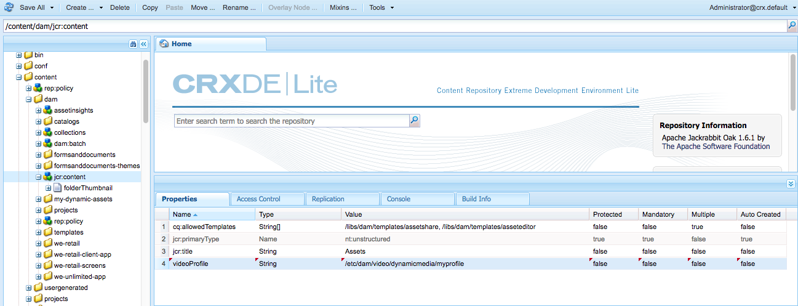

# Dynamic Media 비디오 프로필{#video-profiles}

Dynamic Media에는 이미 사전 정의된 응용 비디오 인코딩 프로필이 포함되어 있습니다. 이 기본 프로필의 설정은 고객에게 최상의 시청 환경을 제공하도록 최적화되었습니다. 응용 비디오 인코딩 프로필을 사용하여 기본 소스 비디오를 인코딩하면 재생 중에 비디오 플레이어가 고객의 인터넷 연결 속도에 따라 비디오 스트림의 품질을 자동으로 조정합니다. 이 작업을 적응형 비트율 스트리밍이라고 합니다.

다음은 비디오의 품질을 결정하는 다른 요소입니다.

* **업로드된 기본 원본 비디오의 해상도**

  MP4 영상이 240p 또는 360p와 같이 낮은 해상도로 녹화된 경우 고화질로 스트리밍할 수 없습니다.

* **비디오 플레이어 크기**

  기본적으로 응용 비디오 인코딩 프로필의 &quot;너비&quot;는 &quot;자동&quot;으로 설정됩니다. 다시 말하지만 재생 중에는 플레이어 크기에 따라 최상의 품질이 사용됩니다.

[비디오 인코딩 모범 사례](/help/assets/dynamic-media/video.md#best-practices-for-encoding-videos)를 참조하세요.

처리 프로필 사용을 위한 [디지털 Assets 구성 모범 사례](/help/assets/organize-assets.md)도 참조하세요.

>[!NOTE]
>
>비디오의 메타데이터 및 관련 비디오 이미지 썸네일을 생성하려면 비디오 자체가 Dynamic Media의 인코딩 프로세스를 거쳐야 합니다. Adobe Experience Manager에서 Dynamic Media을 활성화하고 비디오 Cloud Service을 설정한 경우 **[!UICONTROL Dynamic Media 인코딩 비디오]** 워크플로우가 비디오를 인코딩합니다. This workflow captures workflow process history and failure information. [비디오 인코딩 및 YouTube 게시 진행 모니터링](/help/assets/dynamic-media/video.md#monitoring-video-encoding-and-youtube-publishing-progress)을 참조하십시오. Dynamic Media을 사용하도록 설정하고 비디오 Cloud Service을 설정한 경우 비디오를 업로드할 때 **[!UICONTROL Dynamic Media 인코딩 비디오]** 워크플로가 자동으로 적용됩니다. (Dynamic Media을 사용하지 않는 경우 **[!UICONTROL DAM 자산 업데이트]** 워크플로우가 적용됩니다.)
>
>메타데이터는 에셋을 검색할 때 유용합니다. 썸네일은 인코딩 중에 생성되는 정적 비디오 이미지입니다. 카드 보기, 검색 결과 보기 및 에셋 목록 보기에서 비디오를 시각적으로 식별하는 데 도움이 되도록 Experience Manager 시스템에서 요구하고 사용자 인터페이스에 사용됩니다. 인코딩된 비디오의 렌디션 아이콘(Painter 팔레트)을 선택하면 생성된 썸네일을 볼 수 있습니다.

비디오 프로필을 만든 후에는 폴더 또는 여러 폴더에 적용합니다. [폴더에 비디오 프로필 적용](#applying-a-video-profile-to-folders)을 참조하세요.

다른 자산 유형에 대한 고급 처리 매개 변수를 정의하려면 [자산 처리 구성](/help/assets/dynamic-media/config-dm.md#configuring-asset-processing)을 참조하십시오.

메타데이터, 이미지 및 비디오 처리를 위한 [프로필](/help/assets/dynamic-media/about-image-video-profiles.md)도 참조하세요.

## 응용 비디오 인코딩 사전 설정 {#adaptive-video-encoding-presets}

다음 표에서는 모바일 및 태블릿 장치와 데스크탑 컴퓨터에 적응형 비디오 스트리밍을 위한 프로필을 인코딩할 때의 모범 사례를 식별합니다. 모든 종횡비 비디오에 이러한 사전 설정을 사용할 수 있습니다.

<table>
 <tbody>
  <tr>
   <td><strong>비디오 형식 코덱</strong></td>
   <td><strong>비디오 크기 - 너비(픽셀)</strong></td>
   <td><strong>비디오 크기 - 높이(픽셀)</strong></td>
   <td><strong>종횡비를 유지하시겠습니까?</strong></td>
   <td><strong>비디오 비트율(Kbps)</strong></td>
   <td><strong>비디오 프레임 속도(Fps)</strong></td>
   <td><strong>오디오 코덱</strong></td>
   <td><strong>오디오 비트율(Kbps)</strong></td>
  </tr>
  <tr>
   <td>
MP4 H.264 (mp4)
 </td>
   <td>자동</td>
   <td>360</td>
   <td>예</td>
   <td>730</td>
   <td>30</td>
   <td>Dolby HE-AAC</td>
   <td>128</td>
  </tr>
  <tr>
   <td>
MP4 H.264 (mp4)
 </td>
   <td>자동</td>
   <td>540</td>
   <td>예</td>
   <td>2000  </td>
   <td>30</td>
   <td>Dolby HE-AAC</td>
   <td>128</td>
  </tr>
  <tr>
   <td>
MP4 H.264 (mp4)
 </td>
   <td>자동</td>
   <td>720  </td>
   <td>예</td>
   <td>3000  </td>
   <td>30</td>
   <td>Dolby HE-AAC</td>
   <td>128</td>
  </tr>
 </tbody>
</table>

## 비디오 프로필에서 스마트 자르기 사용 정보 {#about-smart-crop-video}

비디오용 스마트 자르기는 비디오 프로필에서 사용할 수 있는 선택적 기능입니다. Adobe Sensei을 사용하여 크기와 상관없이 업로드한 모든 적응형 비디오 또는 점진적 비디오에서 초점을 자동으로 감지하고 자르는 도구입니다.

스마트 자르기에 지원되는 비디오 형식에는 MP4, MKV, MOV, AVI, FLV 및 WMV가 포함됩니다.

스마트 자르기에 지원되는 최대 비디오 파일 크기는 다음 기준입니다.

* 5분 동안 지속됩니다.
* 초당 30프레임(FPS).
* 파일 크기: 300MB

Adobe Sensei은 9000프레임으로 제한됩니다. 즉, 30FPS로 5분. 비디오의 FPS가 더 높으면 지원되는 최대 비디오 지속 시간이 줄어듭니다. 예를 들어 60FPS 비디오는 Adobe Sensei 및 스마트 자르기에서 지원되려면 2분 30초 정도 있어야 합니다.

>[!IMPORTANT]
>
>비디오 스마트 자르기가 작동하려면 비디오 프로필에 비디오 인코딩 사전 설정을 하나 이상 포함해야 합니다.

비디오에 스마트 자르기를 사용하려면 적응형 또는 점진적 비디오 인코딩 프로필을 만듭니다. 프로필의 일부로 **[!UICONTROL 스마트 자르기 비율]** 도구를 사용하여 미리 정의된 종횡비를 선택합니다. 예를 들어 비디오 인코딩 사전 설정을 정의한 후 종횡비가 16x9인 &quot;모바일 가로&quot; 정의와 종횡비가 9x16인 &quot;모바일 세로&quot; 정의를 추가할 수 있습니다. 1x1, 4x3 및 4x5를 포함하도록 선택할 수 있는 기타 종횡비 또는 자르기 비율입니다.

사용자 인터페이스에서 **[!UICONTROL 스마트 자르기 비율]**&#x200B;의 맨 오른쪽에 있는 슬라이더를 사용하여 비디오 프로필의 비디오 스마트 자르기 기능을 켜거나 끌 수 있습니다.

비디오 프로필을 만들어 저장한 후 원하는 폴더에 적용할 수 있습니다.

[특정 폴더에 비디오 프로필 적용](#applying-video-profiles-to-specific-folders) 또는 [비디오 프로필을 전체적으로 적용](#applying-a-video-profile-globally)을 참조하십시오.

[이미지 스마트 자르기](image-profiles.md)도 참조하세요.

## 적응형 비트율 스트리밍을 위한 비디오 프로필 만들기 {#creating-a-video-encoding-profile-for-adaptive-streaming}

Dynamic Media에는 이미 사전 정의된 응용 비디오 인코딩 프로필(MP4 H.264에 대한 비디오 업로드 설정 그룹)이 포함되어 있으며 이는 최상의 보기 환경에 최적화되어 있습니다. 비디오를 업로드할 때 이 프로필을 사용할 수 있습니다.

그러나 이 사전 정의된 프로필이 사용자의 요구를 충족하지 않으면 고유한 응용 비디오 인코딩 프로필을 만들도록 선택할 수 있습니다. **[!UICONTROL 적응형 스트리밍용 인코딩]** 설정을 사용하는 경우 프로필에 추가하는 모든 인코딩 사전 설정의 유효성을 검사하는 것이 좋습니다. 이 기능을 사용하면 모든 비디오의 종횡비가 동일합니다. 또한, 인코딩된 비디오는 스트리밍을 위해 설정된 멀티비트율로 처리됩니다.

비디오 인코딩 프로필을 만들 때 대부분의 인코딩 옵션이 사용자를 돕기 위해 권장되는 기본 설정으로 미리 채워집니다. 그러나 권장 기본값 이외의 값을 선택하면 재생 중 비디오 품질이 저하되고 기타 성능 문제가 발생할 수 있습니다.

따라서 프로필의 모든 MP4 H.264 비디오 인코딩 사전 설정에 대해 다음 값이 프로필의 개별 인코딩 사전 설정에서 동일한지 확인하여 적응형 비트율 스트리밍을 가능하게 합니다.

* 비디오 형식 코덱 - MP4 H.264(.mp4)
* 오디오 코덱
* 오디오 비트율
* 종횡비 유지
* 2회 인코딩
* 상수 비트율
* H264 프로필
* 오디오 샘플링 속도

값이 같지 않으면 그대로 프로필을 계속 만들 수 있습니다. 단, 적응형 비트율 스트리밍은 불가능합니다. 대신 사용자는 단일 비트 전송률 스트리밍을 경험합니다. 프로필의 개별 인코딩 사전 설정에서 동일한 값을 사용하도록 인코딩 설정을 편집하는 것이 좋습니다. (&quot;적응형 스트리밍을 위한 인코딩&quot;이 활성화된 경우 비디오 프로필/사전 설정 편집기는 적응형 비디오 인코딩 설정의 패리티를 적용합니다.)

[점진적 스트리밍을 위한 비디오 인코딩 프로필 만들기](#creating-a-video-encoding-profile-for-progressive-streaming)도 참조하세요.

[비디오 인코딩 모범 사례](/help/assets/dynamic-media/video.md#best-practices-for-encoding-videos)도 참조하세요.

다른 자산 유형에 대한 고급 처리 매개 변수를 정의하려면 [자산 처리 구성](/help/assets/dynamic-media/config-dm.md#configuring-asset-processing)을 참조하십시오.

**적응형 비트 전송률 스트리밍을 위한 비디오 프로필을 만들려면**,

1. Experience Manager 로고를 선택하고 **[!UICONTROL 도구]** > **[!UICONTROL Assets]** > **[!UICONTROL 비디오 프로필]**&#x200B;로 이동합니다.
1. **[!UICONTROL 만들기]**&#x200B;를 선택합니다.
1. 프로필의 이름과 설명을 입력합니다.
1. 비디오 인코딩 사전 설정 만들기/편집 페이지에서 **[!UICONTROL 비디오 인코딩 사전 설정 추가]**&#x200B;를 선택합니다.
1. **[!UICONTROL 기본]** 탭에서 비디오 및 오디오 옵션을 설정합니다.
선택한 비디오 형식 코덱에 따라 추가 설명 또는 권장 설정을 보려면 각 옵션 옆에 있는 정보 아이콘을 선택합니다.
1. 비디오 크기 제목에서 **[!UICONTROL 종횡비 유지]**&#x200B;가 선택되어 있는지 확인하십시오.
1. 비디오 프레임 크기 해상도를 픽셀 단위로 설정합니다. **[!UICONTROL Auto]** 값을 사용하여 소스 종횡비(너비 대 높이 비율)와 일치하도록 자동으로 조정합니다. 예를 들어 Auto x 480 또는 640 x Auto가 있습니다.

1. 다음 중 하나를 수행하십시오.

   * **[!UICONTROL 너비]** 필드에 **[!UICONTROL auto]**&#x200B;을(를) 입력합니다. **[!UICONTROL 높이]** 필드에 값을 픽셀 단위로 입력하십시오.

   * 비디오의 크기를 시각화하려면 **[!UICONTROL 높이]** 오른쪽에 있는 정보 아이콘(i)을 선택하여 크기 계산기 페이지를 엽니다. **[!UICONTROL 크기 계산기]**&#x200B;를 사용하여 원하는 비디오 크기(파란색 상자로 표시됨)를 설정하십시오. 완료되면 오른쪽 상단에서 **[!UICONTROL X]**&#x200B;을(를) 선택하십시오.

1. (선택 사항) **[!UICONTROL 고급]** 탭을 선택하고 **[!UICONTROL 기본값 사용]** 확인란이 선택되어 있는지 확인합니다(권장). 또는 고급 비디오 및 오디오 설정을 수정합니다.
1. 페이지의 오른쪽 상단 모서리에서 **[!UICONTROL 저장]**&#x200B;을 선택하여 사전 설정을 저장합니다.
1. 다음 중 하나를 수행하십시오.
   * 인코딩 사전 설정을 더 만들려면 4-10단계를 반복합니다. (응용 비디오 스트리밍에는 두 개 이상의 비디오 사전 설정이 필요합니다.)
   * 다음 단계로 진행합니다.

1. (선택 사항) 이 프로필이 적용되는 비디오에 비디오 스마트 자르기를 추가하려면 다음을 수행하십시오.
   * 비디오 프로필 편집 페이지의 스마트 자르기 비율 제목 오른쪽에 있는 **[!UICONTROL 새로 추가]**&#x200B;를 선택합니다.
   * 이름 필드에 자르기 비율을 쉽게 식별할 수 있도록 이름을 입력합니다.
   * **[!UICONTROL 자르기 비율]** 드롭다운 목록에서 사용할 비율을 선택합니다.

1. 다음 중 하나를 수행하십시오.

   * 필요에 따라 새 자르기 비율을 계속 추가합니다.
   * 다음 단계로 진행합니다.

1. 페이지의 오른쪽 상단 모서리에서 **[!UICONTROL 저장]**&#x200B;을 다시 선택하여 프로필을 저장합니다.

이제 비디오가 포함된 폴더에 프로필을 적용할 수 있습니다. [폴더에 비디오 프로필 적용](#applying-a-video-profile-to-folders) 또는 [비디오 프로필을 전체적으로 적용](#applying-a-video-profile-globally)을 참조하세요.

## 점진적 스트리밍을 위한 비디오 프로필 만들기 {#creating-a-video-encoding-profile-for-progressive-streaming}

**[!UICONTROL 적응형 스트리밍을 위한 인코딩]** 옵션을 사용하지 않도록 선택하면 프로필에 추가하는 모든 인코딩 사전 설정은 단일 비트 전송률 스트리밍 또는 점진적 비디오 전송을 위한 개별 비디오 표현물로 처리됩니다. Also, there is no validation to ensure that all the video renditions have the same aspect ratio.

지원되는 비디오 형식 코덱은 H.264(.mp4) 및 WebM입니다.

[적응형 비트율 스트리밍을 위한 비디오 인코딩 프로필 만들기](#creating-a-video-encoding-profile-for-adaptive-streaming)도 참조하세요.

[비디오 인코딩 모범 사례](/help/assets/dynamic-media/video.md#best-practices-for-encoding-videos)도 참조하세요.

다른 자산 유형에 대한 고급 처리 매개 변수를 정의하려면 [자산 처리 구성](/help/assets/dynamic-media/config-dm.md#configuring-asset-processing)을 참조하십시오.

**점진적 스트리밍을 위한 비디오 프로필을 만들려면:**

1. Experience Manager 로고를 선택하고 **[!UICONTROL 도구]** > **[!UICONTROL Assets]** > **[!UICONTROL 비디오 프로필]**&#x200B;로 이동합니다.
1. **[!UICONTROL 만들기]**&#x200B;를 선택합니다.
1. 프로필의 이름과 설명을 입력합니다.
1. 비디오 인코딩 사전 설정 만들기/편집 페이지에서 **[!UICONTROL 비디오 인코딩 사전 설정 추가]**&#x200B;를 선택합니다.
1. **[!UICONTROL 기본]** 탭에서 비디오 및 오디오 옵션을 설정합니다.
선택한 비디오 형식 코덱에 따라 추가 설명 또는 권장 설정을 보려면 각 옵션 옆에 있는 정보 아이콘을 선택합니다.
1. (선택 사항) [비디오 크기] 제목에서 **[!UICONTROL 종횡비 유지]**&#x200B;를 선택 취소합니다.
1. 다음 작업을 수행합니다.
   * **[!UICONTROL 너비]** 필드에 **[!UICONTROL auto]**&#x200B;을(를) 입력합니다.
   * **[!UICONTROL 높이]** 필드에 값을 픽셀 단위로 입력하십시오.
비디오의 크기를 시각화하려면 [높이] 정보 아이콘을 선택하여 **[!UICONTROL 크기 계산기]** 페이지를 엽니다. **[!UICONTROL 크기 계산기]** 페이지에서 원하는 비디오 크기(파란색 상자)를 추가로 설정하십시오. 완료되면 대화 상자의 오른쪽 상단 모서리에서 **[!UICONTROL X]**&#x200B;을(를) 선택합니다.
1. (선택 사항) 다음 중 하나를 수행합니다.

   * **[!UICONTROL 고급]** 탭을 선택하고 **[!UICONTROL 기본값 사용]** 확인란이 선택되어 있는지 확인하십시오(권장).

   * **[!UICONTROL 기본값 사용]** 확인란의 선택을 취소하고 원하는 비디오 설정과 오디오 설정을 지정합니다.
선택한 비디오 형식 코덱에 따라 추가 설명 또는 권장 설정을 보려면 각 옵션 옆에 있는 정보 아이콘을 선택합니다.

1. 페이지의 오른쪽 상단 모서리에서 **[!UICONTROL 저장]**&#x200B;을 선택하여 사전 설정을 저장합니다.
1. 다음 중 하나를 수행하십시오.

   * 인코딩 사전 설정을 더 만들려면 4-9단계를 반복합니다.
   * 다음 단계로 진행합니다.

1. (선택 사항) 이 프로필이 적용되는 비디오에 비디오 스마트 자르기를 추가하려면 다음을 수행하십시오.

   * 비디오 프로필 편집 페이지의 스마트 자르기 비율 제목 오른쪽에 있는 **[!UICONTROL 새로 추가]**&#x200B;를 선택합니다.
   * 이름 필드에 자르기 비율을 쉽게 식별할 수 있도록 이름을 입력합니다.
   * **[!UICONTROL 자르기 비율]** 드롭다운 목록에서 사용할 비율을 선택합니다.

1. 다음 중 하나를 수행하십시오.

   * 필요에 따라 새 자르기 비율을 계속 추가합니다.
   * 다음 단계로 진행합니다.

1. 페이지의 오른쪽 상단 모서리에서 **[!UICONTROL 저장]**&#x200B;을(를) 선택하여 프로필을 저장합니다.

이제 비디오가 포함된 폴더에 프로필을 적용할 수 있습니다. [폴더에 비디오 프로필 적용](#applying-a-video-profile-to-folders) 또는 [비디오 프로필 전체 적용](#applying-a-video-profile-globally)을 참조하세요.

## 사용자가 추가한 비디오 인코딩 매개 변수 사용 {#using-custom-added-video-encoding-parameters}

Experience Manager에서 비디오 프로필을 만들거나 편집할 때 사용자 인터페이스에서 볼 수 없는 고급 비디오 인코딩 매개 변수를 활용하도록 기존 비디오 인코딩 프로필을 편집할 수 있습니다. minBitrate 및 maxBitrate와 같은 하나 이상의 고급 매개 변수를 기존 프로필에 사용자 지정할 수 있습니다.

**사용자 지정 추가된 비디오 인코딩 매개 변수를 사용하려면:**

1. Experience Manager 로고를 선택한 다음 **[!UICONTROL 도구]** > **[!UICONTROL 일반]** > **[!UICONTROL CRXDE Lite]**(으)로 이동합니다.
1. CRXDE Lite 페이지의 왼쪽에 있는 탐색기 패널에서 다음과 같이 이동합니다.

   `/conf/global/settings/dam/dm/presets/video/*name_of_video_encoding_profile_to_edit`

1. In the panel on the lower-right side of the page, from the Properties tab, specify the **[!UICONTROL Name]**, **[!UICONTROL Type]**, and **[!UICONTROL Value]** of the parameter you want to use.

   다음 고급 매개 변수를 사용할 수 있습니다.

<table>
 <tbody>
  <tr>
   <td><strong>이름</strong></td>
   <td><strong>설명</strong>  </td>
   <td><strong>유형</strong>  </td>
   <td><strong>값</strong></td>
  </tr>
  <tr>
   <td><code>h264Level</code></td>
   <td>인코딩에 사용할 H.264 수준입니다. 일반적으로 이 수준은 사용 중인 인코딩 설정을 기반으로 자동으로 결정됩니다.</td>
   <td><code>String</code></td>
   <td>
10 * h264 level
 
예를 들어, 3.0 = 30, 1.3 = 13)
 
기본값이 없습니다.
 </td>
  </tr>
  <tr>
   <td><code>keyframe</code></td>
   <td>키프레임 사이의 대상 프레임 수입니다. 2~10초마다 키프레임을 생성할 수 있도록 이 값을 계산합니다. 예를 들어 초당 30프레임인 경우 키프레임 간격은 60-300입니다.    낮은 키프레임 간격은 응용 비디오 인코딩을 위한 스트림 찾기 및 스트림 전환 동작을 개선하며 많은 동작이 포함된 비디오의 품질을 향상시킬 수도 있습니다. 그러나 키프레임은 파일 크기를 늘리기 때문에 낮은 키프레임 간격은 일반적으로 주어진 비트율로 전반적인 비디오 품질이 저하됩니다.</td>
   <td><code>String</code></td>
   <td>
양수입니다.
 
기본값은 300입니다.
 
HLS 또는 DASH(적응형 비트율 스트리밍)에 대한 권장 값은 60-90입니다. (비디오에 DASH를 사용하려면 먼저 계정에서 Adobe 기술 지원 팀에서 활성화해야 합니다. <a href="/help/assets/dynamic-media/video.md#enable-dash">계정에서 DASH 사용</a>을 참조하세요.)
 </td>
  </tr>
  <tr>
   <td><code>minBitrate</code></td>
   <td>
가변 비트율 인코딩을 허용하는 최소 비트율(Kbps/초)입니다.
 
이 매개 변수는 비디오 인코딩 프로필을 만들거나 편집할 때 고급 탭에서 <strong> 상수 비트 전송률 사용</strong>을 선택 취소한 경우에만 적용됩니다.
 
<a href="/help/assets/dynamic-media/video.md#bitrate">Bitrate</a>도 참조하세요.
 </td>
   <td><code>String</code></td>
   <td>
양수, Kbps.
 
기본값이 없습니다.
 </td>
  </tr>
  <tr>
   <td><code>maxBitrate</code></td>
   <td>
가변 비트율 인코딩을 허용하는 최대 비트율(Kbps)입니다.
 
이 매개 변수는 비디오 인코딩 프로필을 만들거나 편집할 때 고급 탭에서 <strong> 상수 비트 전송률 사용</strong>을 선택 취소한 경우에만 적용됩니다.
 
<a href="/help/assets/dynamic-media/video.md#bitrate">Bitrate</a>도 참조하세요.
 </td>
   <td><code>String</code></td>
   <td>
양수, Kbps.
 
기본값이 없습니다. 하지만 권장 값은 인코딩 비트율의 최대 2배입니다.
 </td>
  </tr>
  <tr>
   <td><code>audioBitrateCustom</code></td>
   <td>오디오 코덱에서 지원하는 경우 오디오 스트림에 대한 상수 비트 전송률을 적용하려면 값을 <code>true</code>(으)로 설정하십시오.</td>
   <td><code>String</code></td>
   <td>
<code>true</code>/<code>false</code>
 
기본값은 <code>false</code>입니다.
 
HLS 또는 DASH의 권장 값은 <code>false</code>입니다. (비디오에 DASH를 사용하려면 먼저 계정에서 Adobe 기술 지원 팀에서 활성화해야 합니다. <a href="/help/assets/dynamic-media/video.md#enable-dash">계정에서 DASH 사용</a>을 참조하세요.)
 
 
 </td>
  </tr>
 </tbody>
</table>

1. 페이지의 오른쪽 아래 모서리에서 **[!UICONTROL 추가]**&#x200B;를 선택합니다.
1. 다음 중 하나를 수행하십시오.

   * 3단계와 4단계를 반복하여 비디오 인코딩 프로필에 다른 매개 변수를 추가합니다.
   * 페이지의 왼쪽 상단 모서리 근처에서 **[!UICONTROL 모두 저장]**&#x200B;을 선택합니다.

1. CRXDE Lite 페이지의 왼쪽 상단 모서리에서 **[!UICONTROL 홈으로 돌아가기]** 아이콘을 선택하여 Experience Manager으로 돌아갑니다.

### 비디오 프로필 편집 {#editing-a-video-encoding-profile}

만든 비디오 프로필을 편집하여 해당 프로필 내에서 비디오 사전 설정을 추가, 편집 또는 삭제할 수 있습니다.

기본적으로 Dynamic Media과 함께 제공되는 미리 정의된 기본 **[!UICONTROL 응용 비디오 인코딩]** 프로필을 편집할 수 없습니다. 대신 프로필을 쉽게 복사하여 새 이름으로 저장할 수 있습니다. 그런 다음 복사한 프로필에서 원하는 사전 설정을 편집할 수 있습니다.

[비디오 인코딩 모범 사례](/help/assets/dynamic-media/video.md#best-practices-for-encoding-videos)도 참조하세요.

다른 자산 유형에 대한 고급 처리 매개 변수를 정의하려면 [자산 처리 구성](/help/assets/dynamic-media/config-dm.md#configuring-asset-processing)을 참조하십시오.

**비디오 프로필을 편집하려면:**

1. Experience Manager 로고를 선택하고 **[!UICONTROL 도구]** > **[!UICONTROL Assets]** > **[!UICONTROL 비디오 프로필]**&#x200B;로 이동합니다.
1. 비디오 프로필 페이지에서 비디오 프로필 이름 하나를 선택합니다.
1. 도구 모음에서 **[!UICONTROL 편집]**&#x200B;을 선택합니다.
1. 비디오 인코딩 프로필 페이지에서 원하는 대로 이름과 설명을 편집합니다.
1. 가장 좋은 방법은 **[!UICONTROL 적응형 스트리밍을 위한 인코딩]** 확인란을 선택하는 것입니다.
적응형 비트율 스트리밍에 대한 설명을 보려면 정보 아이콘을 선택합니다. 점진적 비디오 프로필을 편집하는 경우 이 확인란을 선택하지 마십시오.
1. 비디오 인코딩 사전 설정 제목 아래에서 프로필을 구성하는 비디오 인코딩 사전 설정을 추가, 편집 또는 삭제합니다.

   선택한 비디오 형식 코덱에 따라 추가 설명 또는 권장 설정을 보려면 **[!UICONTROL 기본]** 및 **[!UICONTROL 고급]** 탭에서 각 옵션 옆에 있는 정보 아이콘을 선택하십시오.

1. 페이지의 오른쪽 상단 모서리에서 **[!UICONTROL 저장]**&#x200B;을 선택합니다.

### 비디오 프로필 복사 {#copying-a-video-encoding-profile}

1. Experience Manager 로고를 선택하고 **[!UICONTROL 도구]** > **[!UICONTROL Assets]** > **[!UICONTROL 비디오 프로필]**&#x200B;로 이동합니다.
1. 비디오 프로필 페이지에서 비디오 프로필 이름 하나를 선택합니다.
1. 도구 모음에서 **[!UICONTROL 복사]**&#x200B;를 선택합니다.
1. 비디오 인코딩 프로필 페이지에서 프로필의 새 이름을 입력합니다.
1. As a best practice, ensure that the **[!UICONTROL Encode for adaptive streaming]** check box is selected. 적응형 비트율 스트리밍에 대한 설명을 보려면 정보 아이콘을 선택합니다. 점진적 비디오 프로필을 복사하는 경우에는 확인란을 선택하지 마십시오.

   Dynamic Media - 하이브리드 모드에서 WebM 비디오 사전 설정이 비디오 프로필의 일부인 경우 모든 사전 설정이 MP4여야 하므로 **[!UICONTROL 적응형 스트리밍을 위한 인코딩]**&#x200B;을 사용할 수 없습니다.
1. 비디오 인코딩 사전 설정 제목 아래에서 프로필을 구성하는 비디오 인코딩 사전 설정을 추가, 편집 또는 삭제합니다.

   기본 및 고급 탭에서 권장 설정 및 설명을 보려면 각 옵션 옆에 있는 정보 아이콘을 선택합니다.

1. 페이지의 오른쪽 상단 모서리에서 **[!UICONTROL 저장]**&#x200B;을 선택합니다.

### 비디오 프로필 삭제 {#deleting-a-video-encoding-profile}

1. Experience Manager 로고를 선택하고 **[!UICONTROL 도구]** > **[!UICONTROL Assets]** > **[!UICONTROL 비디오 프로필]**&#x200B;로 이동합니다.
1. 비디오 프로필 페이지에서 하나 이상의 비디오 프로필 이름을 확인합니다.
1. 도구 모음에서 **[!UICONTROL 삭제]**&#x200B;를 선택합니다.
1. **[!UICONTROL 확인]**&#x200B;을 선택합니다.

## 폴더에 비디오 프로필 적용 {#applying-a-video-profile-to-folders}

폴더에 비디오 프로필을 할당하면 하위 폴더는 자동으로 상위 폴더에서 프로필을 상속합니다. 따라서 폴더에 하나의 비디오 프로필만 할당할 수 있습니다. 따라서 에셋을 업로드, 저장, 사용 및 보관하는 의 폴더 구조를 신중하게 고려하십시오.

폴더에 다른 비디오 프로필을 할당하면 새 프로필이 이전 프로필을 재정의합니다. 이전의 기존 폴더 자산은 변경되지 않습니다. 새 프로필은 나중에 폴더에 추가되는 에셋에 적용됩니다.

프로필이 할당된 폴더는 카드 이름에 나타나는 프로필 이름을 사용하여 사용자 인터페이스에 표시됩니다.

비디오 프로필을 특정 폴더에 적용하거나 모든 에셋에 전역적으로 적용할 수 있습니다.

나중에 변경한 기존 비디오 프로필이 이미 있는 폴더에서 에셋을 재처리할 수 있습니다. [폴더에서 에셋 재처리](/help/assets/dynamic-media/about-image-video-profiles.md#reprocessing-assets)를 참조하십시오.

### 특정 폴더에 비디오 프로필 적용 {#applying-video-profiles-to-specific-folders}

**[!UICONTROL 도구]** 메뉴에서 폴더에 비디오 프로필을 적용하거나, 폴더에 있는 경우 **[!UICONTROL 속성]**&#x200B;에서 폴더에 비디오 프로필을 적용할 수 있습니다. 이 섹션에서는 비디오 프로필을 두 가지 방법으로 폴더에 적용하는 방법에 대해 설명합니다.

Folders that have a profile already assigned to it are indicated by the display of the profile&#39;s name directly below the folder name.

[처리 프로필을 편집한 후 폴더에서 자산 재처리](/help/assets/dynamic-media/about-image-video-profiles.md#reprocessing-assets)도 참조하십시오.

#### 프로필 사용자 인터페이스를 통해 폴더에 비디오 프로필 적용 {#applying-video-profiles-to-folders-by-way-of-the-profiles-user-interface}

1. Experience Manager 로고를 선택하고 **[!UICONTROL 도구]** > **[!UICONTROL Assets]** > **[!UICONTROL 비디오 프로필]**&#x200B;로 이동합니다.
1. 폴더 또는 여러 폴더에 적용할 비디오 프로필을 선택합니다.
1. **[!UICONTROL 폴더에 프로필 적용]**&#x200B;을 선택하고 새로 업로드한 자산을 받는 데 사용할 폴더 또는 여러 폴더를 선택한 다음 **[!UICONTROL 적용]**&#x200B;을 선택합니다. 프로필이 이미 할당된 폴더는 **[!UICONTROL 카드 보기]**에서 폴더 이름 바로 아래에 프로필 이름이 표시됩니다.
[비디오 프로필 처리 작업의 진행 상황을 모니터링](#monitoring-the-progress-of-an-encoding-job)할 수 있습니다.

#### 속성에서 폴더에 비디오 프로필 적용 {#applying-video-profiles-to-folders-from-properties}

1. Experience Manager 로고를 선택하고 **[!UICONTROL Assets]**(으)로 이동한 다음 비디오 프로필을 적용할 폴더로 이동합니다.
1. 폴더에서 확인 표시를 선택하여 선택한 다음 **[!UICONTROL 속성]**&#x200B;을 선택합니다.
1. **[!UICONTROL 비디오 프로필]** 탭을 선택하고 드롭다운 메뉴에서 프로필을 선택한 다음 **[!UICONTROL 저장 및 닫기]**&#x200B;를 선택합니다. Folders that have a profile already assigned to it are indicated by the display of the profile&#39;s name directly below the folder name.

   
[비디오 프로필 처리 작업의 진행 상황을 모니터링](#monitoring-the-progress-of-an-encoding-job)할 수 있습니다.

### 비디오 프로필을 전체적으로 적용 {#applying-a-video-profile-globally}

폴더에 프로필을 적용하는 것 외에도, 모든 폴더의 Experience Manager 에셋에 업로드된 모든 콘텐츠에 선택한 프로필이 적용되도록 전역적으로 프로필을 적용할 수도 있습니다.

[폴더에서 에셋 재처리](/help/assets/dynamic-media/about-image-video-profiles.md#reprocessing-assets)도 참조하세요.

**비디오 프로필을 전역적으로 적용하려면:**

* `/content/dam/jcr:content` CRXDE Lite으로 이동합니다. `videoProfile:/libs/settings/dam/video/dynamicmedia/<name of video encoding profile>` 속성을 추가하고 **[!UICONTROL 모두 저장]**&#x200B;을 선택합니다.

  
* [비디오 프로필 처리 작업의 진행 상황을 모니터링](#monitoring-the-progress-of-an-encoding-job)할 수 있습니다.

## 비디오 프로필 처리 작업 진행 상황 모니터링 {#monitoring-the-progress-of-an-encoding-job}

비디오 프로필 처리 작업의 진행 상황을 시각적으로 모니터링할 수 있도록 처리 표시기(또는 진행률 표시줄)가 표시됩니다.

`error.log` 파일을 보고 인코딩 작업의 진행 상황을 모니터링하거나 인코딩이 완료되었는지 확인하거나 작업 오류를 확인할 수도 있습니다. Experience Manager 인스턴스가 설치된 `logs` 폴더에서 `error.log`을(를) 찾았습니다.

## 폴더에서 비디오 프로필 제거 {#removing-a-video-profile-from-folders}

폴더에서 비디오 프로필을 제거하면 모든 하위 폴더가 자동으로 상위 폴더에서 프로필 제거를 상속합니다. 그러나 폴더 내에서 발생한 모든 파일 처리는 그대로 유지됩니다.

**[!UICONTROL 도구]** 메뉴의 폴더 또는 **[!UICONTROL 폴더 설정]**&#x200B;에서 비디오 프로필을 제거할 수 있습니다. 이 섹션에서는 두 가지 방법으로 폴더에서 비디오 프로필을 제거하는 방법을 설명합니다.

### 프로필 사용자 인터페이스를 통해 폴더에서 비디오 프로필 제거 {#removing-video-profiles-from-folders-by-way-of-the-profiles-user-interface}

1. Experience Manager 로고를 선택하고 **[!UICONTROL 도구]** > **[!UICONTROL Assets]** > **[!UICONTROL 비디오 프로필]**&#x200B;로 이동합니다.
1. 폴더 또는 여러 폴더에서 제거할 비디오 프로필을 선택합니다.
1. **[!UICONTROL 폴더에서 프로필 제거]**&#x200B;를 선택하고 프로필을 제거하는 데 사용할 폴더 또는 여러 폴더를 선택한 다음 **[!UICONTROL 제거]**&#x200B;를 선택합니다.

   이름이 더 이상 폴더 이름 아래에 표시되지 않으므로 비디오 프로필이 더 이상 폴더에 적용되지 않는지 확인할 수 있습니다.

### 속성을 통해 폴더에서 비디오 프로필 제거 {#removing-video-profiles-from-folders-by-way-of-properties}

1. Experience Manager 로고를 선택하고 **[!UICONTROL Assets]**(으)로 이동한 다음 비디오 프로필을 제거할 폴더로 이동합니다.
1. 폴더에서 확인 표시를 선택하여 선택한 다음 **[!UICONTROL 속성]**&#x200B;을 선택합니다.
1. **[!UICONTROL 비디오 프로필]** 탭을 선택하고 드롭다운 메뉴에서 **[!UICONTROL 없음]**&#x200B;을 선택한 다음 **[!UICONTROL 저장 및 닫기]**&#x200B;를 선택합니다. Folders that have a profile already assigned to it are indicated by the display of the profile&#39;s name directly below the folder name.
