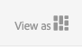

# Dynamic Media에서 선택기를 사용하여 작업 {#working-with-selectors}

대화형 이미지, 대화형 비디오 또는 회전 배너를 사용하여 작업할 때 에셋을 선택하고 핫스팟 및 이미지 맵에 대해 링크할 사이트 및 제품을 선택합니다. 이미지 세트, 스핀 세트 및 멀티미디어 세트로 작업할 때 에셋 선택기를 사용하여 에셋을 선택할 수도 있습니다.

이 항목에서는 선택기 내에서 검색, 필터링, 정렬 기능을 포함하여 제품, 사이트 및 에셋 선택기를 사용하는 방법을 다룹니다.

회전 메뉴 세트를 만들고, 핫스팟과 이미지 맵을 추가하고, 대화형 비디오와 이미지를 만드는 동안 선택기에 액세스합니다.

예를 들어 핫스팟 또는 이미지 맵을 빠른 보기 페이지에 연결하는 경우 이 회전 배너에서 제품 선택기를 사용합니다. 핫스팟 또는 이미지 맵을 하이퍼링크에 연결하는 경우 사이트 선택기를 사용합니다. 슬라이드를 만들 때는 에셋 선택기를 사용합니다.

핫스팟이나 이미지 맵이 이동할 위치를 수동으로 입력하지 않고 선택하는 경우에는 선택기를 사용합니다. 사이트 선택기는 다음 경우에만 작동합니다. [!DNL Adobe Experience Manager Sites] 고객. 제품 선택기에는 [!DNL Experience Manager Commerce].

## Dynamic Media에서 제품 선택 {#selecting-products}

핫스팟 또는 이미지 맵이 제품 카탈로그의 특정 제품에 빠른 보기를 제공하려면 제품 선택기를 사용하여 제품을 선택합니다.

1. 회전 메뉴 세트, 대화형 이미지 또는 대화형 비디오로 이동한 다음 **[!UICONTROL 작업]** 탭(핫스팟 또는 이미지 맵을 정의한 경우에만 사용 가능).

   제품 선택기는 **[!UICONTROL 작업 유형]** 영역입니다.

   

1. 다음 항목 선택 **[!UICONTROL 제품 선택기]** 아이콘(돋보기)을 클릭하고 카탈로그의 제품으로 이동합니다.

   

   을 탭하여 키워드 또는 태그로 필터링할 수 있습니다 **[!UICONTROL 필터]** 키워드 입력 또는 태그 선택 또는 둘 다를 선택할 수 있습니다.

   

   위치를 변경할 수 있습니다. [!DNL Experience Manager] 을 탭하여 제품 데이터 찾아보기 **[!UICONTROL 찾아보기]** 다른 폴더로 이동.

   

   선택 **[!UICONTROL 정렬 기준:]** 여부를 변경하려면 [!DNL Experience Manager] 가장 최근에서 가장 오래된 순으로 정렬하거나 가장 오래된 항목에서 가장 최근순으로 정렬합니다.

   

   선택 **[!UICONTROL 다음으로 보기]** 제품을 보는 방법을 변경하려면 다음 중 하나를 수행하십시오. **[!UICONTROL 목록 보기]** 또는 **[!UICONTROL 카드 보기]**.

   

1. 제품을 선택하면 필드가 제품 썸네일과 이름으로 채워집니다.

   

1. 다음 시기 **[!UICONTROL 미리 보기]** 모드에서는 핫스팟 또는 이미지 맵을 선택하고 빠른 보기가 표시되는 방식을 확인할 수 있습니다.

   

## Dynamic Media에서 사이트 선택 {#selecting-sites}

핫스팟 또는 이미지 맵이 내에서 관리되는 웹 페이지에 연결되게 하려면 사이트 선택기를 사용하여 웹 페이지를 선택합니다 [!DNL Experience Manager] 사이트.

1. 회전 메뉴 세트, 대화형 이미지 또는 대화형 비디오로 이동한 다음 **[!UICONTROL 작업]** 탭(핫스팟 또는 이미지 맵을 정의한 경우에만 사용 가능).

   The Site Selector is in the **[!UICONTROL Action Type]** area.

   

1. 다음 항목 선택 **[!UICONTROL 사이트 선택기]** 아이콘(돋보기가 있는 폴더)을 클릭하고 [!DNL Experience Manager] 핫스팟 또는 이미지 맵을 연결할 사이트입니다.

   

1. 사이트를 선택하면 필드가 경로로 채워집니다.

   

1. 다음 시기 **[!UICONTROL 미리 보기]** 모드 핫스팟 또는 이미지 맵을 선택하면 [!DNL Experience Manager] 지정한 사이트 페이지입니다.

## Dynamic Media에서 에셋 선택 {#selecting-assets}

이 선택기를 사용하여 회전 배너, 대화형 비디오, 이미지 세트, 혼합 미디어 세트 및 스핀 세트에서 사용할 이미지를 선택합니다. 대화형 비디오에서 를 선택하면 에셋 선택기를 사용할 수 있습니다. **[!UICONTROL 에셋 선택]** 다음에서 **[!UICONTROL 콘텐츠]** 탭. 슬라이드 세트에서 슬라이드를 만들 때 에셋 선택기를 사용할 수 있습니다. 이미지 세트, 혼합 미디어 세트 및 스핀 세트에서 자산 선택기는 이미지 세트, 혼합 미디어 세트 또는 스핀 세트를 각각 만들 때 사용할 수 있습니다.

참조: [자산 선택기](/help/assets/search-assets.md#asset-selector) 추가 정보.

1. 슬라이드 세트로 이동하여 슬라이드를 만듭니다. 또는 대화형 비디오로 이동하여 **[!UICONTROL 콘텐츠]** 탭을 누른 다음 에셋을 선택합니다. 또는 혼합 미디어 세트, 이미지 세트 또는 스핀 세트를 만듭니다.
1. 다음 항목 선택 **[!UICONTROL 자산 선택기]** 아이콘(돋보기가 있는 폴더)을 클릭하고 에셋으로 이동합니다.

   

   탭하여 키워드 또는 태그로 필터링 **[!UICONTROL 필터]** 키워드 입력 또는 기준 추가 또는 둘 다를 참조하십시오.

   

   위치를 변경할 수 있습니다. [!DNL Experience Manager] 에서 다른 폴더로 이동하여 에셋을 찾습니다. **[!UICONTROL 경로]** 필드.

   선택 **[!UICONTROL 컬렉션]** 컬렉션 내의 에셋만 검색할 수 있습니다.

   

   선택 **[!UICONTROL 다음으로 보기]** 제품을 보는 방법을 변경하려면 다음 중 하나를 수행하십시오. **[!UICONTROL 목록 보기]**, **[!UICONTROL 열 보기]**, 또는 **[!UICONTROL 카드 보기]**.

   

1. 에셋을 선택하려면 확인 표시를 선택합니다. 에셋이 표시됩니다.

   
—>
