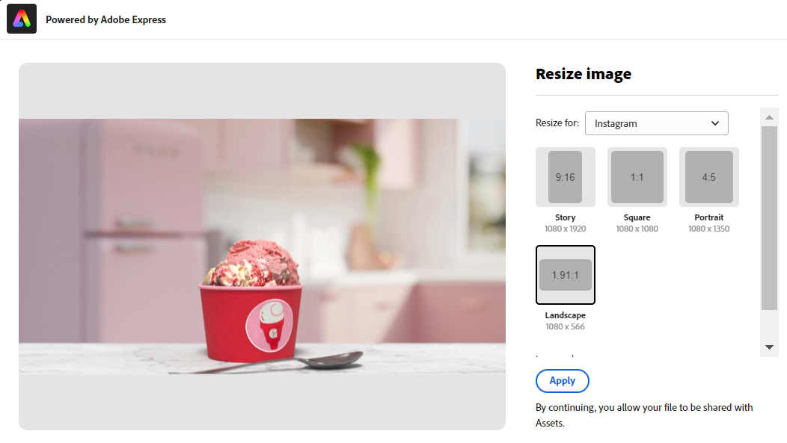
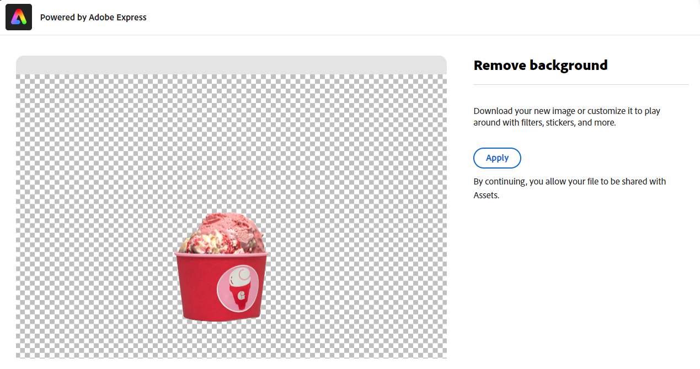
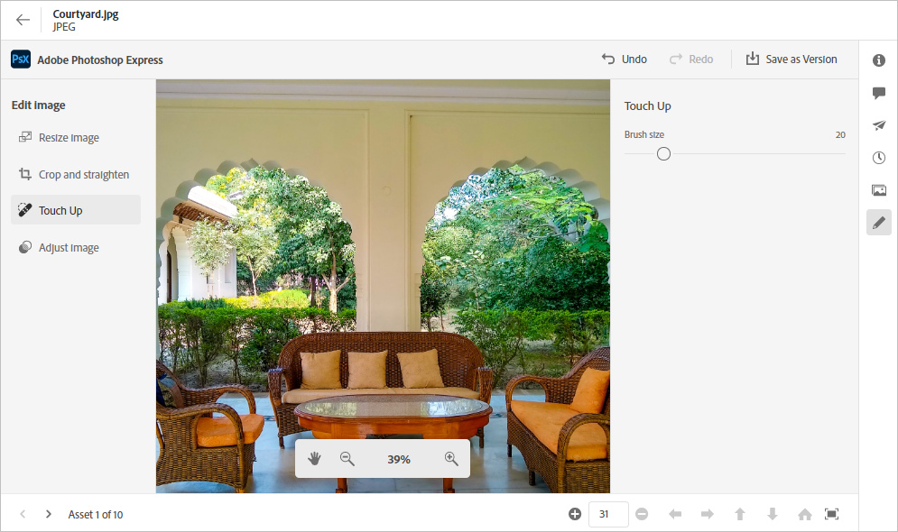

# [!DNL Assets view]에서 이미지 편집 {#edit-images}

[!DNL Assets view]는 [!DNL Adobe Express] 및 [!DNL Adobe Photoshop Express]에서 제공하는 사용자 친화적인 편집 옵션을 제공합니다. [!DNL Adobe Express]로 사용할 수 있는 편집 작업에는 이미지 크기 조정, 배경 제거, 이미지 자르기, JPEG를 PNG로 변환하기 등이 있습니다.

이미지를 편집한 후 새 이미지를 새 버전으로 저장할 수 있습니다. 필요한 경우 버전 관리를 통해 나중에 원본 자산으로 되돌릴 수 있습니다. 이미지를 편집하려면 [미리보기를 열고](/help/assets/navigate-assets-view.md) **[!UICONTROL 이미지 편집]**&#x200B;을 클릭합니다.

>[!NOTE]
>
>[!DNL Adobe Express]을 사용하여 PNG 및 JPEG 파일 형식의 이미지를 편집할 수 있습니다.

<!--The editing actions that are available are Spot healing, Crop and straighten, Resize image, and Adjust image.-->

## Adobe Express를 사용하여 이미지 편집 {#edit-using-express}

>[!CONTEXTUALHELP]
>id="assets_express_integration"
>title="Adobe Express 통합"
>abstract="AEM Assets 내에서 바로 사용할 수 있는 Adobe Express 기반의 쉽고 직관적인 이미지 편집 도구를 사용하면 콘텐츠 재사용률과 콘텐츠 속도를 높일 수 있습니다."

### 이미지 크기 조정 {#resize-image-using-express}

이미지 크기를 특정 크기로 조정하는 것이 일반적인 사용 사례입니다. [!DNL Assets view]를 사용하면 특정 사진 크기에 대해 미리 계산된 새로운 해상도를 제공하여 일반적인 사진 크기에 맞게 빠르게 이미지 크기를 조정할 수 있습니다. [!DNL Assets view]을 사용하여 이미지 크기를 조정하려면 아래 단계를 수행합니다.

1. 이미지를 선택하고 **편집**&#x200B;을 클릭합니다.
2. 왼쪽 창에서 사용할 수 있는 빠른 작업에서 **[!DNL Resize Image]**&#x200B;을 클릭합니다.
3. 드롭다운 목록의 **[!UICONTROL 크기 조정]**&#x200B;에서 적절한 소셜 미디어 플랫폼을 선택하고 표시되는 옵션에서 이미지 크기 조정을 선택합니다.
4. 필요한 경우 를 사용하여 이미지 크기 조정 **[!UICONTROL 이미지 크기 조절]** 필드.
5. **[!DNL Apply]**를 클릭하여 변경 내용을 적용합니다.
   

   편집한 이미지를 다운로드할 수 있습니다. 편집한 자산을 동일한 자산의 새 버전으로 저장하거나 새 자산으로 저장할 수 있습니다.
   

### 배경 제거 {#remove-background-using-express}

아래 설명된 몇 번의 간단한 단계를 통해 이미지에서 배경을 제거할 수 있습니다.

1. 이미지를 선택하고 **편집**&#x200B;을 클릭합니다.
2. 왼쪽 창에서 사용할 수 있는 빠른 작업에서 **[!DNL Remove Background]**&#x200B;을 클릭합니다. Experience Manager Assets에는 배경 없는 이미지가 표시됩니다.
3. **[!DNL Apply]**를 클릭하여 변경 내용을 적용합니다.
   

   편집한 이미지를 다운로드할 수 있습니다. 편집한 자산을 동일한 자산의 새 버전으로 저장하거나 새 자산으로 저장할 수 있습니다.

### 이미지 자르기 {#crop-image-using-express}

임베드된 [!DNL Adobe Express] 빠른 작업을 사용하여 이미지를 완벽한 크기로 쉽게 변환할 수 있습니다.

1. 이미지를 선택하고 **편집**&#x200B;을 클릭합니다.
2. 왼쪽 창에서 사용할 수 있는 빠른 작업에서 **[!DNL Crop Image]**&#x200B;을 클릭합니다.
3. 이미지 모퉁이의 핸들을 드래그하여 원하는 자르기를 만듭니다.
4. **[!DNL Apply]**를 클릭합니다.
   
잘린 이미지를 다운로드할 수 있습니다. 편집한 자산을 동일한 자산의 새 버전으로 저장하거나 새 자산으로 저장할 수 있습니다.

### JPEG를 PNG로 변환하기 {#convert-jpeg-to-png-using-express}

Adobe Express를 사용하여 JPEG 이미지를 PNG 형식으로 빠르게 변환할 수 있습니다. 다음 단계를 실행합니다.

1. 이미지를 선택하고 **편집**&#x200B;을 클릭합니다.
2. 왼쪽 창에서 사용할 수 있는 빠른 작업에서 **[!DNL JPEG to PNG]**을 클릭합니다.
   
3. **[!UICONTROL 다운로드]**&#x200B;를 클릭합니다.

### 제한 사항 {#limitations-adobe-express}

* 지원되는 이미지 해상도: 차원당 최소 - 50픽셀, 최대 - 6000픽셀

* 지원되는 최대 파일 크기: 17MB

## Adobe Express이 포함된 편집기를 사용하여 이미지 편집 {#edit-using-embedded-editor}

[!DNL Assets view] 는 에셋 저장소에서 직접 이미지를 포괄적인 편집을 제공합니다. 임베드된 편집기는 를 사용하여 이미지를 쉽고 직관적으로 편집할 수 있도록 해줍니다. [!DNL Adobe Express]. 템플릿을 사용하거나 기존 에셋을 수정하여 에셋의 재사용을 가속화합니다. 사전 정의된 요소를 사용하여 에셋을 멋진 모양으로 만들거나 몇 번의 클릭만으로 이미지를 편집하는 빠른 작업을 수행할 수 있습니다.

다음을 사용하여 이미지 편집하기 [!DNL Adobe Express] 포함된 편집기에서 아래 단계를 수행합니다.

1. 에서 이미지 선택 [!DNL Experience Manager] 에셋 리포지토리.
1. 클릭 **[!UICONTROL Adobe Express에서 열기]**. [!DNL Adobe Express] 화면이 나타납니다.

   

   의 기능을 활용할 수 있습니다. [!DNL Adobe Express] 모든 이미지 편집 관련 작업을 수행하려면 다음을 수행합니다. [이미지 크기 조정](https://helpx.adobe.com/in/express/using/resize-image.html), [배경색 제거 또는 변경](https://helpx.adobe.com/in/express/using/remove-background.html), [이미지 자르기](https://helpx.adobe.com/in/express/using/crop-image.html)및 기타.

1. 이미지 편집이 완료되면 에셋을 새 에셋으로 다운로드하거나 에셋을 새 버전으로 저장할 수 있습니다.

## Adobe Express을 사용하여 새 에셋 만들기 {#create-new-embedded-editor}

[!DNL Assets view] 은 을 사용하여 처음부터 새 템플릿을 만드는 기능을 제공합니다. [!DNL Adobe Express] 포함된 편집기. 을 사용하여 새 에셋을 만들려면 [!DNL Adobe Expresss]을(를) 클릭하고 아래 단계를 수행하십시오.

1. 다음으로 이동 **[!UICONTROL 내 작업 영역]** 및 클릭 **[!UICONTROL 만들기]**. [!DNL Adobe Express] 빈 캔버스 [!DNL Assets view] 사용자 인터페이스.
1. 다음을 사용하여 콘텐츠 만들기 [템플릿](https://helpx.adobe.com/in/express/using/work-with-templates.html). 그렇지 않으면 다음으로 이동합니다. **[!UICONTROL 내 항목]** 기존 컨텐츠를 수정합니다.
1. 편집을 완료했으면 **[!UICONTROL 새 자산으로 저장]**.
1. 생성된 에셋의 대상 경로를 지정합니다.

>[!NOTE]
>
>* 수정할 수만 있습니다. `JPEG` 및 `PNG` 형식.
>* 에셋 크기는 14MB 미만이어야 합니다.
>* 이미지를 다음과 같이 저장할 수 있습니다. `PDF`, `JPEG`, 또는 `PNG` 형식.

## [!DNL Adobe Photoshop Express]를 사용하여 이미지 편집 {#edit-using-photoshop-express}

<!--
After editing an image, you can save the new image as a new version. Versioning helps you to revert to the original asset later, if needed. To edit an image, [open its preview](//help/navigate-assets-view.md#preview-assets) and click **[!UICONTROL Edit Image]**  from the rail on the right.

*Figure: The options to edit images are powered by [!DNL Adobe Photoshop Express].*
-->

### 얼룩 제거 이미지 {#spot-heal-images-using-photoshop-express}

이미지에 작은 얼룩이나 작은 오브젝트가 있는 경우 Adobe Photoshop에서 제공하는 얼룩 제거 기능을 사용하여 이를 편집하고 제거할 수 있습니다.

브러시는 수정된 영역을 샘플링하고 복구된 픽셀이 이미지의 나머지 부분에 매끄럽게 혼합되도록 합니다. 수정하려는 지점보다 약간만 더 큰 브러시 크기를 사용합니다.

<!-- 
TBD: See if we should give backlinks to PS docs for these concepts.
For more information about how Spot Healing works in Photoshop, see [retouching and repairing photos](https://helpx.adobe.com/photoshop/using/retouching-repairing-images.html). 
-->

### 이미지 자르기 및 펴기 {#crop-straighten-images-using-photoshop-express}

자르기 및 바로 가기 옵션을 사용하여 기본 자르기를 수행하고, 이미지를 회전하고, 가로 또는 세로 방향으로 뒤집고, 자주 사용하는 소셜 미디어 웹 사이트에 적합한 크기로 자를 수 있습니다.

편집 내용을 저장하려면 **[!UICONTROL 이미지 자르기]**&#x200B;를 클릭합니다. 편집한 후 새 이미지를 버전으로 저장할 수 있습니다.

많은 기본 옵션을 사용하면 다양한 소셜 미디어 프로필 및 게시물에 적합한 비율로 이미지를 자를 수 있습니다.

### 이미지 크기 조정 {#resize-image-using-photoshop-express}

일반적인 사진 크기를 cm(센티미터) 또는 in(인치) 단위로 보고 치수를 알 수 있습니다. 기본적으로 크기 조정 방법은 가로 세로 비율을 유지합니다. 가로 세로 비율을 수동으로 오버라이드하려면 를 클릭하십시오.

치수를 입력하고 **[!UICONTROL 이미지 크기 조정]**&#x200B;을 클릭하여 이미지 크기를 조정합니다. 변경 사항을 버전으로 저장하기 전에 [!UICONTROL 실행 취소]를 클릭하여 저장하기 전에 수행한 모든 변경 사항을 실행 취소하거나 [!UICONTROL 되돌리기]를 클릭하여 편집 프로세스의 특정 단계를 변경할 수 있습니다.

### 이미지 조정 {#adjust-image-using-photoshop-express}

[!DNL Assets view]를 사용하면 몇 번의 클릭만으로 색상, 톤, 대비 등을 조정할 수 있습니다. 편집 창에서 **[!UICONTROL 이미지 조정]**&#x200B;을 클릭합니다. 오른쪽 사이드바에서 사용할 수 있는 옵션은 다음과 같습니다.

* **자주 찾는 항목**: [!UICONTROL 고대비 및 섬세하게], [!UICONTROL 저채도 대비], [!UICONTROL 낡은 사진], [!UICONTROL 흑백 소프트] 및 [!UICONTROL 흑백 세피아 톤]
* **색상**: [!UICONTROL 자연스럽게], [!UICONTROL 밝게], [!UICONTROL 고대비], [!UICONTROL 고대비 및 섬세하게], [!UICONTROL 선명하게] 및 [!UICONTROL 무광]
* **크리에이티브**: [!UICONTROL Desaturated Contrast], [!UICONTROL Cool Light], [!UICONTROL Turquoise &amp; Red], [!UICONTROL Soft Mist], [!UICONTROL Vintage Instant], [!UICONTROL Warm Contrast], [!UICONTROL Flat &amp; Green], [!UICONTROL Red Lift Matte], [!UICONTROL Warm Shadows] 및 [!UICONTROL Aged Photo].
* **B&amp;W**: [!UICONTROL B&amp;W Landscape], [!UICONTROL B&amp;W High Contrast], [!UICONTROL B&amp;W Punch], [!UICONTROL B&amp;W Low Contrast], [!UICONTROL B&amp;W Flat], [!UICONTROL B&amp;W Soft], [!UICONTROL B&amp;W Infrared], [!UICONTROL B&amp;W Selenium Tone], [!UICONTROL B&amp;W Sepia Tone] 및 [!UICONTROL B&amp;W Split Tone].
* **비네트 효과**: [!UICONTROL 없음], [!UICONTROL 가볍게], [!UICONTROL 중간] 및 [!UICONTROL 무겁게]

<!--
TBD: Insert a video of the available social media options.
-->

### 다음 단계 {#next-steps}

* Assets 보기 사용자 인터페이스에서 사용 가능한 [!UICONTROL 피드백] 옵션을 사용하여 제품 피드백 제공

* 오른쪽 사이드바에서 사용 가능한 [!UICONTROL 이 페이지 편집], , [!UICONTROL 문제 기록] 또는 을 사용하여 설명서 피드백 제공

* [고객 지원 센터](https://experienceleague.adobe.com/?support-solution=General#support) 문의

>[!MORELIKETHIS]
>
>* [자산의 버전 내역 보기](/help/assets/navigate-assets-view.md)
