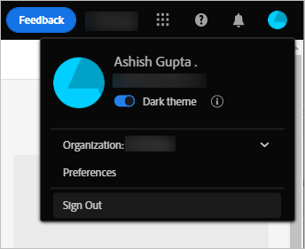

# Assets 보기 시작하기 {#assets-view-get-started}

<!-- TBD: Make links for these steps. -->

[!DNL Assets View]를 사용하여 디지털 자산을 관리하려면 다음 세 가지 간단한 단계만 거치면 됩니다.

* **1단계**: 자산을 [업로드](/help/assets/add-delete-assets-view.md)하고 [조회](/help/assets/navigate-assets-view.md)합니다.
* **2단계**: 자산을 [검색](/help/assets/search-assets-view.md)하고 [다운로드](/help/assets/manage-organize-assets-view.md#download)합니다.
* **3단계**: 자산을 [관리하고 구성](/help/assets/manage-organize-assets-view.md)합니다.

[!DNL Assets View]를 사용하려면 [https://experience.adobe.com/#/assets](https://experience.adobe.com/#/assets)에 로그인하십시오. 로그인할 때 `Company or School Account`을(를) 선택합니다. 액세스하려면 조직 관리자에게 문의하십시오.

<!--In addition, more reference information that can be helpful is [understanding of the user interface](/help/assets/navigate-assets-view.md), [list of use cases](#use-cases), [supported file types](/help/assets/supported-file-formats-assets-view.md), and [known issues](/help/assets/release-notes.md#known-issues).
-->

## Assets 보기 액세스 {#access-assets-view}

Assets 보기에 액세스하는 방법에 대한 자세한 내용은 [Assets 보기에 액세스하는 방법](/help/assets/assets-view-introduction.md#how-to-access-assets-view)을 참조하십시오.

## 구성 [!DNL Assets View] {#configuration}

환경 설정을 열려면 사용자 인터페이스의 오른쪽 상단에 있는 아바타를 클릭합니다. 솔루션 환경 설정에서 밝은 테마와 어두운 테마 사이를 전환할 수 있습니다.

다른 조직에 속해 있는 경우 조직을 변경하고 다양한 조직의 계정에 액세스할 수도 있습니다.

[!UICONTROL Experience Cloud 환경 설정]을 변경하려면 [!UICONTROL 환경 설정]을 클릭합니다.

## [!DNL Assets View] 사용 사례 {#use-cases}

[!DNL Assets View]를 사용하여 수행할 수 있는 다양한 디지털 자산 관리(DAM) 작업은 아래를 참조하십시오.

| 사용자 작업 | 기능 및 사용 방법 정보 |
|-----|------|
| 자산 검색 및 보기 | <ul> <li>[저장소 검색](/help/assets/navigate-assets-view.md#view-assets-and-details) </li> <li> [자산 미리보기](/help/assets/navigate-assets-view.md#preview-assets) <li> [자산 렌디션 보기](/help/assets/add-delete-assets-view.md#renditions) </li> <li>[자산의 버전 보기](/help/assets/manage-organize-assets-view.md#view-versions)</li></ul> |
| 새 자산 추가 | <ul> <li>[새 자산 및 폴더 업로드](/help/assets/add-delete-assets-view.md)</li> <li>[업로드 진행 상황 모니터링 및 업로드 관리](/help/assets/add-delete-assets-view.md#upload-progress)</li> <li>[중복 해결](/help/assets/add-delete-assets-view.md)</li> </ul> |
| 자산 또는 관련 정보 업데이트 | <ul> <li>[이미지 편집](/help/assets/edit-images-assets-view.md)</li> <li>[버전 제작](/help/assets/manage-organize-assets-view.md#create-versions) 및 [버전 보기](/help/assets/manage-organize-assets-view.md#view-versions)</li> <li>[이미지 편집](/help/assets/edit-images-assets-view.md)</li> </ul> |
| 자산 편집 | <ul> <li>[Adobe Photoshop Express를 사용하여 브라우저에서 편집](/help/assets/edit-images-assets-view.md)</li> <li>[소셜 미디어 프로필 자르기](/help/assets/edit-images-assets-view.md#crop-straighten-images)</li> <li>[버전 보기 및 관리](/help/assets/manage-organize-assets-view.md#view-versions)</li></ul></ul> |
| 저장소에서 자산을 검색합니다. | <ul> <li>[특정 폴더에서 검색](/help/assets/search-assets-view.md#refine-search-results)</li> <li>[저장된 검색](/help/assets/search-assets-view.md#saved-search)</li> <li>[최근에 본 자산 검색](/help/assets/search-assets-view.md)</li> <li>[전체 텍스트 검색](/help/assets/search-assets-view.md) |
| 자산 다운로드 | <ul> <li> [자산 미리보기](/help/assets/navigate-assets-view.md#preview-assets) </li> <li> [자산 다운로드](/help/assets/manage-organize-assets-view.md#download) <li> [렌디션 다운로드](/help/assets/add-delete-assets-view.md#renditions) </li></ul> |
| 메타데이터 작업 | <ul> <li>[세부 메타데이터 보기](/help/assets/metadata-assets-view.md) </li> <li> [메타데이터 업데이트](/help/assets/metadata-assets-view.md#update-metadata)</li> <li> [새 메타데이터 양식 만들기](/help/assets/metadata-assets-view.md#metadata-forms) </li> </ul> |

## 다음 단계 {#next-steps}

* [Assets 보기를 시작하려면 비디오 보기](https://experienceleague.adobe.com/docs/experience-manager-learn/assets-essentials/getting-started.html)

* Assets 보기 사용자 인터페이스에서 사용 가능한 [!UICONTROL 피드백] 옵션을 사용하여 제품 피드백 제공

* 오른쪽 사이드바에서 사용 가능한 [!UICONTROL 이 페이지 편집], , [!UICONTROL 문제 기록] 또는 을 사용하여 설명서 피드백 제공

* [고객 지원 센터](https://experienceleague.adobe.com/?support-solution=General#support) 문의

<!--TBD: Merge the below rows in the table when the use cases are documented/available.

| How do I delete assets? | <ul> <li>[Delete assets](/help/assets/manage-organize.md)</li> <li>Recover deleted assets</li> <li>Permanently delete assets</li> </ul> |
| How do I share assets or find shared assets? | <ul> <li>Shared by me</li> <li>Shared with me</li> <li>Share for comments and review</li> <li>Unshare assets</li> </ul> |
| How do I collaborate with others and get my assets reviewed | <ul> <li>Share for review</li> <li>Provide comments. Resolve and filter comments</li> <li>Annotations on images</li> <li>Assign tasks to specific users and prioritize</li> </ul> |

-->

<!-- 

##  Provide product feedback {#provide-feedback}

Adobe welcomes feedback about the solution. To provide feedback without even switching your working application, use the [!UICONTROL Feedback] option in the user interface. It also lets you attach files such as screenshots or video recording of an issue.

  

To provide feedback for documentation, click [!UICONTROL Edit this page]  or [!UICONTROL Log an issue]  from the right sidebar. You can do one of the following: 

* Make the content updates and submit a GitHub pull request.
* Create an issue or ticket in GitHub. Retain the automatically populated article name when creating an issue.

-->
<!--
>[!MORELIKETHIS]
>
>* [Understand the user interface](/help/assets/navigate-asssets-view.md).
>* [Release notes and known issues](/help/assets/release-notes.md).
>* [Supported file types](/help/assets/supported-file-formats.md).
-->
