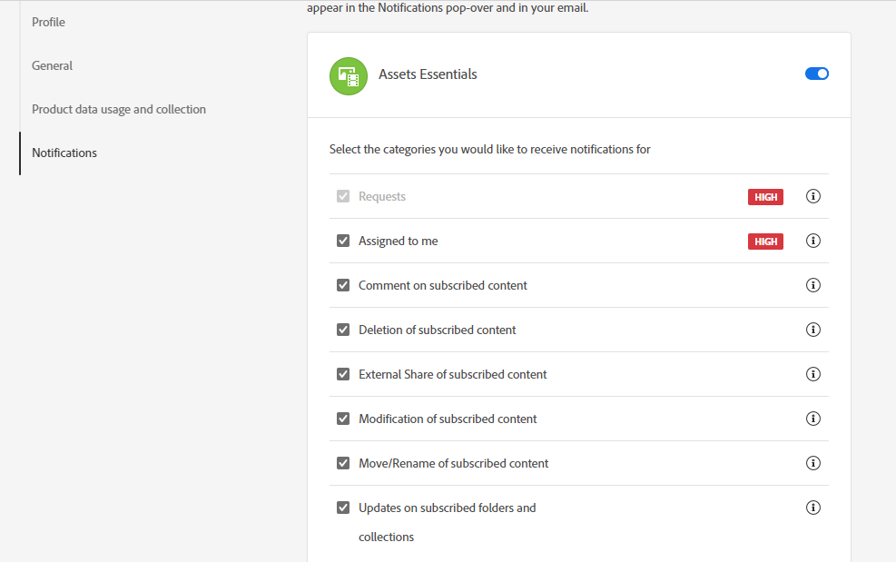

# 자산, 폴더 및 컬렉션 보기 {#watch-assets-folders}

Assets 보기 알림을 사용하면 저장소에서 사용할 수 있는 에셋, 폴더 또는 컬렉션에서 수행된 작업을 모니터링할 수 있습니다. 알림을 받을 콘텐츠를 선택하고 구독해야 합니다. 알림을 받을 범주를 구성할 수도 있습니다.

## 알림 범주 가입 {#subscribe-to-notification-categories}

범주 목록에서 알림을 선택하여 구독할 수 있습니다. Assets 보기는 사용 가능한 옵션에서 선택하는 범주에 대해서만 알림을 보냅니다.

<table>
    <tbody>
     <tr>
      <th><strong>알림 범주</strong></th>
      <th><strong>설명</strong></th>
     </tr>
     <tr>
      <td>요청</td>
      <td>사용자에게 작업을 할당하면 해당 사용자가 해당 작업에 대해 수행한 작업이 있는 경우 알림을 받습니다.</td>
     </tr>
     <tr>
      <td>나에게 할당됨</td>
      <td>다른 사용자로부터 나에게 할당된 작업이 있는 경우 알림을 받습니다.</td>
     </tr>
     <tr>
      <td>구독 콘텐츠에 대한 댓글</td>
      <td>사용자가 구독한 자산에 대해 댓글을 다는 경우 알림을 받습니다.</td>
     </tr>
     <tr>
      <td>구독한 콘텐츠 삭제</td>
      <td>사용자가 구독한 자산, 폴더 또는 컬렉션을 삭제하는 경우 알림을 받습니다.</td>
     </tr>
     <tr>
      <td>구독한 콘텐츠의 외부 공유</td>
      <td>사용자가 구독한 자산, 폴더 또는 컬렉션에 대한 공개 링크를 생성하는 경우 알림을 받습니다.</td>
     </tr>
     <tr>
      <td>구독한 콘텐츠 수정</td>
      <td>사용자가 구독한 자산에 대한 새 버전을 만드는 경우 알림을 받습니다.</td>
     </tr>
     <tr>
      <td>구독한 콘텐츠 이동/이름 바꾸기</td>
      <td>사용자가 구독한 자산 또는 폴더를 이동하거나 이름을 변경하는 경우 알림을 받습니다.</td>
     </tr>
     <tr>
      <td>구독한 폴더 및 컬렉션에 대한 업데이트</td>
      <td>사용자가 구독한 폴더 또는 컬렉션에서 자산을 추가하거나 제거하는 경우 알림을 받습니다.</td>
     </tr>    
    </tbody>
   </table>

알림 범주를 구독하려면 다음 작업을 수행하십시오.

1. Assets 보기 사용자 인터페이스의 메뉴 모음 오른쪽 끝에 있는 을 클릭합니다.

1. 을 클릭하여 [!UICONTROL Experience Cloud 환경 설정] 페이지를 봅니다.

1. 왼쪽 창에서 사용할 수 있는 **[!UICONTROL 알림]** 옵션을 클릭합니다.

1. **[!UICONTROL 알림]** 섹션에서 [!UICONTROL Assets 보기] 섹션으로 이동하여 전환 옵션이 [켜짐] 상태로 전환되어 있는지 확인하십시오.

   

1. 알림 범주를 보려면 **[!UICONTROL 맞춤화]**를 클릭합니다.
   

1. 알림을 받아야 하는 알림 범주를 선택합니다.

## 폴더, 자산 또는 컬렉션 보기 및 보기 취소 {#watch-unwatch-assets}

[알림 범주를 구독](#subscribe-to-notification-categories)한 다음에는 알림을 받기 시작할 콘텐츠를 구독해야 합니다.

>[!NOTE]
>
>* **[!UICONTROL 요청]** 및 **[!UICONTROL 나에게 할당됨]** 알림 범주의 경우 알림 범주를 구독한 다음 콘텐츠를 구독할 필요가 없습니다. 요청을 생성한 경우와 사용자에게 작업이 할당된 경우에는 자동으로 알림이 전송됩니다.
>* Assets 보기는 다른 사용자가 구독한 콘텐츠에 대해 작업을 수행할 때만 알림을 보냅니다. 사용자가 구독한 콘텐츠에서 수행하는 작업에 대한 알림은 전송하지 않습니다.

콘텐츠를 구독하려면 구독해야 하는 폴더, 자산 또는 컬렉션을 선택한 다음 **[!UICONTROL 보기]**&#x200B;를 클릭합니다.

Assets 보기에 성공 메시지가 표시됩니다. 성공 메시지에서 사용할 수 있는 **[!UICONTROL 알림 환경 설정으로 이동]**&#x200B;을 클릭하여 [알림 범주 구독](#subscribe-to-notification-categories)을 편집할 수 있습니다.

이제 Assets 보기에서 구독한 범주에 대한 알림을 보냅니다. 여러 자산, 폴더 또는 컬렉션을 선택하고 **[!UICONTROL 보기]**&#x200B;를 클릭하여 시간을 절약할 수 있습니다. 그러나 일부를 이미 구독한 여러 엔티티를 선택한 경우 **[!UICONTROL 보기]** 옵션이 표시되지 않습니다.

마찬가지로 구독을 취소하려면 구독한 자산, 폴더 또는 컬렉션을 선택하고 **[!UICONTROL 보기 취소]**&#x200B;를 클릭합니다.

## 알림 보기 {#view-notifications}

알림은 Assets 보기 사용자 인터페이스의 메뉴 모음 오른쪽 끝에 나타납니다.

알림을 클릭하면 Assets 보기에서 알림에서 참조되는 적절한 에셋 또는 폴더로 이동합니다.
