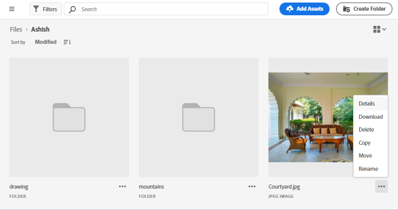

# 자산 관리 {#manage-assets}

[!DNL Assets view]의 사용자 친화적인 인터페이스를 사용하여 다양한 디지털 자산 관리(DAM) 작업을 간편하게 수행할 수 있습니다. 자산을 추가한 후 자산을 검색, 다운로드, 이동, 복사, 이름 변경, 삭제, 업데이트 및 편집할 수 있습니다.

[!DNL Assets view]를 클릭하여 다음 자산 관리 작업을 수행합니다. 자산을 선택하면 다음 옵션이 상단의 도구 모음에 표시됩니다.

*그림: 선택한 이미지에 대해 도구 모음에서 사용할 수 있는 옵션*

*  선택을 취소합니다.

*  메타데이터 및 스마트 태그를 기반으로 Assets UI에서 유사한 이미지 자산을 찾습니다.

*  자산을 미리 보고 자세한 메타데이터를 보려면 클릭하십시오. 미리보기 시 버전을 확인하고 이미지를 편집할 수 있습니다.

*  선택한 자산을 로컬 파일 시스템에 다운로드합니다.

*  선택한 자산을 컬렉션에 추가합니다.

*  나중에 필요할 때 더 빠르게 액세스할 수 있도록 자산을 고정합니다. 고정된 모든 항목은 내 작업 영역의 **바로 가기** 섹션에 표시됩니다.

*  Adobe Experience Manager Assets 내의 통합 Adobe Express에서 이미지를 편집합니다.

*  Adobe Express를 사용하여 이미지를 편집합니다.

*  다른 사용자들이 액세스하고 다운로드할 수 있도록 자산 링크를 공유합니다.

*  선택한 자산 또는 폴더를 삭제합니다.

*  선택한 파일 또는 폴더를 복사합니다.

*  선택한 자산 또는 폴더를 저장소 계층의 다른 위치로 이동합니다.

*  선택한 자산 또는 폴더의 이름을 변경합니다. 고유한 이름을 사용하지 않으면 경고 메시지가 표시되며 이름 바꾸기에 실패합니다. 새 이름으로 다시 시도할 수 있습니다.
또한 자산이나 폴더의 제목을 클릭하여 이름을 바꿀 수 있습니다. **자산 이름 바꾸기** 텍스트 상자에 새 텍스트를 입력하고 **저장**&#x200B;을 클릭합니다. 이 기능은 격자 보기, 갤러리 보기, 워터폴 보기 및 목록 보기에서 사용할 수 있습니다.

*  [!UICONTROL 워터폴 보기].

*  라이브러리에 자산을 추가합니다.

*  다른 사용자에게 작업을 할당하여 자산에 대해 공동 작업을 수행합니다.

*  자산에 대해 수행되는 작업을 모니터링합니다.

자산 썸네일에서 동일한 옵션을 볼 수 있습니다.

[!DNL Assets view]에서는 선택한 자산의 유형에 따라 도구 모음에 관련 옵션만 표시됩니다.

*그림: 선택한 폴더에 대해 도구 모음에서 사용할 수 있는 옵션*

*그림: 선택한 PDF 파일에 대해 도구 모음에서 사용할 수 있는 옵션*

## 자산 다운로드 및 배치 {#download}

하나 이상의 자산이나 폴더 또는 두 가지의 조합을 선택하고 선택 항목을 로컬 파일 시스템으로 다운로드할 수 있습니다. 자산을 편집하고 다시 업로드하거나 [!DNL Assets view] 외부에 자산을 배포할 수 있습니다. 또한 자산의 [렌디션을 다운로드](/help/assets/add-delete-assets-view.md#renditions)할 수 있습니다.

## 자산 버전 관리 {#versions-of-assets}

<!-- 
TBD: query for engineering: How many versions are maintained. What happens when we reach that limit? Are old versions automatically removed? -->

[!DNL Assets view]는 업데이트되거나 편집된 자산이 다시 업로드될 때 자산의 버전을 지정합니다. 버전 내역 및 이전 버전을 볼 수 있고 자산의 이전 버전을 최신 버전으로 복원할 수 있으며 필요한 경우 이전 버전으로 되돌릴 수 있습니다. 자산 버전은 다음 시나리오에서 생성됩니다.

* 기존 자산과 동일한 폴더에 동일한 파일 이름으로 새 자산을 업로드합니다. [!DNL Assets view]는 이전 자산을 덮어쓰거나 새 자산을 버전으로 저장하라는 메시지를 표시합니다. [중복 자산 업로드](/help/assets/add-delete-assets-view.md)를 참조하십시오.

  

  *그림: 기존 자산과 동일한 이름의 자산을 업로드할 때 자산 버전을 생성할 수 있습니다.*

* 이미지를 편집하고 **[!UICONTROL 버전으로 저장]**&#x200B;을 클릭합니다. [이미지 편집](/help/assets/edit-images-assets-view.md)을 참조하십시오.

  

  *그림: 편집된 이미지를 버전으로 저장*

* 기존 자산의 버전을 엽니다. **[!UICONTROL 새 버전]**&#x200B;을 클릭하고 저장소에 자산의 새 버전을 업로드하십시오.

  

### 자산의 버전 보기 {#view-versions}

자산의 복제된 사본 또는 수정된 사본을 업로드할 때 해당 자산의 버전을 생성할 수 있습니다. 버전 관리를 통해 이전 자산을 검토하고 필요한 경우 이전 버전으로 되돌릴 수 있습니다.

버전을 보려면 자산의 미리보기를 열고 오른쪽 사이드바에서 **[!UICONTROL 버전]**()을 클릭하십시오. 특정 버전을 미리 보려면 해당 버전을 선택합니다. 되돌리려면 **[!UICONTROL 최신 버전으로 만들기]**&#x200B;를 클릭합니다.

버전 타임라인에서 버전을 생성할 수도 있습니다. 최신 버전을 선택하고 **[!UICONTROL 새 버전]**&#x200B;을 클릭한 다음 로컬 파일 시스템에서 자산의 새로운 사본을 업로드하십시오.

*그림: 자산 버전 보기, 이전 버전으로 되돌리기 또는 다른 새로운 버전 업로드*

## 자산 상태 관리 {#manage-asset-status}

**필요한 권한:** 자산에 대한 `Can Edit`, `Owner` 또는 관리자 권한.

에셋 보기를 사용하면 저장소에서 사용 가능한 에셋의 상태를 설정할 수 있습니다. 자산 상태를 설정하여 디지털 자산의 다운스트림 소비를 보다 효과적으로 관리합니다.

자산에 대해 다음과 같은 상태를 설정할 수 있습니다.

* 승인됨

* 거부됨

* 상태 없음

### 자산 상태 설정 {#set-asset-status}

자산 상태를 설정하려면:

1. 자산을 선택하고 도구 모음에서 **[!UICONTROL 세부 정보]**&#x200B;를 클릭합니다.

1. 다음에서 **[!UICONTROL 기본]** 탭에서 에셋 상태를 선택합니다. **[!UICONTROL 상태]** 드롭다운 목록입니다. 가능한 값에는 승인됨, 거부됨 및 상태 없음(기본값)이 포함됩니다.

   >[!VIDEO](https://video.tv.adobe.com/v/342495)

### 자산 만료 날짜 설정 {#set-asset-expiration-date}

또한 에셋 보기를 사용하여 저장소에서 사용할 수 있는 에셋의 만료 날짜를 설정할 수도 있습니다. 그런 다음 `Expired` 자산 상태를 기반으로 [검색 결과를 필터링](search-assets-view.md#refine-search-results)할 수 있습니다. 또한 자산의 만료 날짜 범위를 지정하여 검색 결과를 추가로 필터링할 수 있습니다.

자산 만료 날짜를 설정하려면 다음 작업을 수행하십시오.

1. 자산을 선택하고 도구 모음에서 **[!UICONTROL 세부 정보]**&#x200B;를 클릭합니다.

1. **[!UICONTROL 기본]** 탭에서 **[!UICONTROL 만료 날짜]** 필드를 사용하여 자산의 만료 날짜를 설정합니다.

`Expired` 자산 카드 표시기는 자산에 대해 설정된 `Approved` 또는 `Rejected` 표시기보다 우선합니다.

에셋 상태에 따라 에셋을 필터링할 수도 있습니다. 자세한 내용은 [자산 보기에서 자산 검색](search-assets-view.md).

## 자산 상태 필드를 포함하도록 메타데이터 양식 맞춤화 {#customize-asset-status-metadata-form}

**필요한 권한:** 관리자

에셋 보기는 기본적으로 많은 표준 메타데이터 필드를 제공합니다. 조직에서는 추가 메타데이터가 필요하며 비즈니스별 메타데이터를 추가하려면 더 많은 메타데이터 필드가 필요합니다. 메타데이터 양식을 통해 기업은 자산의 [!UICONTROL 세부 정보] 페이지에 사용자 정의 메타데이터 필드를 추가할 수 있습니다. 비즈니스별 메타데이터는 자산의 거버넌스 및 검색 기능을 개선합니다.

메타데이터 양식에 메타데이터 필드를 추가하는 방법에 대한 자세한 내용은 [메타데이터 양식](metadata-assets-view.md#metadata-forms)을 참조하십시오.

**양식에 자산 상태 메타데이터 필드 추가**

자산 상태 메타데이터 필드를 양식에 추가하려면 **[!UICONTROL 자산 상태]** 구성 요소를 왼쪽 레일에서 양식으로 드래그하십시오. 매핑 속성은 자동으로 미리 채워집니다. 변경 사항을 확인하려면 양식을 저장하십시오.

**양식에 만료 날짜 메타데이터 필드 추가**

만료 날짜 메타데이터 필드를 양식에 추가하려면 **[!UICONTROL 날짜]** 구성 요소를 왼쪽 레일에서 양식으로 드래그하십시오. 레이블로 **만료 날짜**&#x200B;를 지정하고 매핑 속성으로 `pur:expirationDate`를 지정합니다. 변경 사항을 확인하려면 양식을 저장하십시오.

## 다음 단계 {#next-steps}

* [에셋 보기의 에셋 관리에 대한 비디오 보기](https://experienceleague.adobe.com/docs/experience-manager-learn/assets-essentials/basics/managing.html)

* Assets 보기 사용자 인터페이스에서 사용 가능한 [!UICONTROL 피드백] 옵션을 사용하여 제품 피드백 제공

* 오른쪽 사이드바에서 사용 가능한 [!UICONTROL 이 페이지 편집], , [!UICONTROL 문제 기록] 또는 을 사용하여 설명서 피드백 제공

* [고객 지원 센터](https://experienceleague.adobe.com/?support-solution=General#support) 문의

