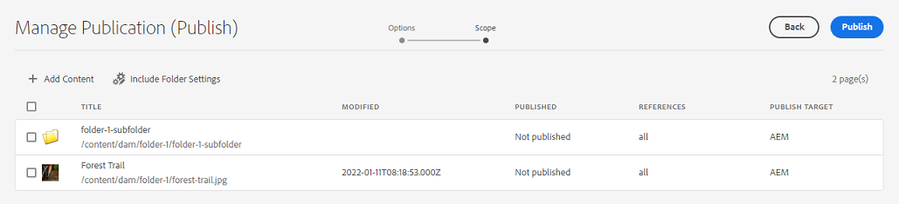

# Experience Manager Assets에서 게시 관리 {#manage-publication-in-aem}

| [모범 사례 검색](/help/assets/search-best-practices.md) | [메타데이터 모범 사례](/help/assets/metadata-best-practices.md) | [Content Hub](/help/assets/product-overview.md) | [OpenAPI 기능이 있는 Dynamic Media](/help/assets/dynamic-media-open-apis-overview.md) | [AEM Assets 개발자 설명서](https://developer.adobe.com/experience-cloud/experience-manager-apis/) |
| ------------- | --------------------------- |---------|----|-----|

[!DNL Adobe Experience Manager Assets] 관리자는 작성자 인스턴스의 자산 및 자산을 포함하는 폴더를 [!DNL Experience Manager Assets], [!DNL Dynamic Media] 및 [!DNL Brand Portal]에 게시할 수 있습니다. 나중에 에셋 또는 폴더를 게시하도록 예약할 수도 있습니다. 게시되면 사용자는 에셋에 액세스하고 다른 사용자에게 에셋을 추가로 배포할 수 있습니다. 기본적으로 에셋 및 폴더를 [!DNL Experience Manager Assets]에 게시할 수 있습니다. 그러나 [[!DNL Dynamic Media]](https://experienceleague.adobe.com/docs/experience-manager-cloud-service/content/assets/dynamicmedia/config-dm.html) 및 [[!DNL Brand Portal]](https://experienceleague.adobe.com/docs/experience-manager-cloud-service/content/assets/brand-portal/configure-aem-assets-with-brand-portal.html)에 게시하도록 [!DNL Experience Manager Assets]을(를) 구성할 수 있습니다.

[!DNL Experience Manager Assets] 인터페이스에서 사용할 수 있는 **[!UICONTROL 빠른 Publish]** 또는 **[!UICONTROL 게시 관리]** 옵션을 사용하여 에셋 또는 폴더 수준에서 에셋을 게시하거나 게시를 취소할 수 있습니다. [!DNL Experience Manager Assets]에서 원본 에셋 또는 폴더를 추가로 수정하는 경우 [!DNL Experience Manager Assets]에서 다시 게시하기 전까지 변경 내용이 게시 인스턴스에 반영되지 않습니다. 진행 중인 작업 변경 사항을 게시 인스턴스에서 사용할 수 없도록 합니다. 관리자가 게시한 승인된 변경 사항만 게시 인스턴스에서 사용할 수 있습니다.

* [빠른 Publish을 사용한 Publish assets](#quick-publish)
* [게시 관리를 사용하는 Publish 자산](#manage-publication)
* [나중에 Publish 에셋](#publish-assets-later)
* [Publish assets를 Dynamic Media으로](#publish-assets-to-dynamic-media)
* [Publish assets를 Brand Portal으로](#publish-assets-to-brand-portal)
* [게시 요청](#request-publication)
* [제한 사항 및 팁](#limitations-and-tips)

## 빠른 Publish을 사용한 Publish assets {#quick-publish}

빠른 게시를 사용하면 콘텐츠를 선택한 대상에 즉시 게시할 수 있습니다. [!DNL Experience Manager Assets] 콘솔에서 상위 폴더로 이동하여 게시할 모든 자산 또는 폴더를 선택합니다. 도구 모음에서 **[!UICONTROL 빠른 Publish]** 옵션을 클릭하고 드롭다운 목록에서 자산을 게시할 대상을 선택합니다.

## 게시 관리를 사용한 Publish assets {#manage-publication}

게시 관리를 사용하면 선택한 대상에 콘텐츠를 게시하거나 게시를 취소할 수 있고, DAM 저장소의 게시 목록에 콘텐츠를 [추가](#add-content)할 수 있으며, [폴더 설정을 포함하여](#include-folder-settings)선택한 폴더의 콘텐츠를 게시하고 필터를 적용할 수 있고, 나중에 게시할 날짜 또는 시간에 [게시 일정](#publish-assets-later)할 수 있습니다.

[!DNL Experience Manager Assets] 콘솔에서 상위 폴더로 이동하여 게시할 모든 자산 또는 폴더를 선택합니다. 도구 모음에서 **[!UICONTROL 게시 관리]** 옵션을 클릭합니다. [!DNL Experience Manager Assets] 인스턴스에 구성된 [!DNL Dynamic Media] 및 [!DNL Brand Portal]이(가) 없는 경우 [!DNL Experience Manager Assets]에만 에셋 및 폴더를 게시할 수 있습니다.

[!UICONTROL 게시 관리] 인터페이스에서 다음 옵션을 사용할 수 있습니다.

* [!UICONTROL 작업]
   * `Publish`: 선택한 대상에 Publish 에셋 및 폴더
   * `Unpublish`: 대상에서 자산 및 폴더 게시 취소

* [!UICONTROL 대상]
   * `Publish`: [!DNL Experience Manager Assets](`AEM`)에 Publish 자산 및 폴더
   * `Dynamic Media`: [!DNL Dynamic Media]에 Publish 에셋
   * `Brand Portal`: [!DNL Brand Portal]에 Publish 에셋 및 폴더

* [!UICONTROL 예약]
   * `Now`: Publish 에셋 즉시
   * `Later`: `Activation` 날짜 또는 시간을 기반으로 하는 Publish 에셋

계속하려면 **[!UICONTROL 다음]**&#x200B;을 클릭하세요. 선택한 항목에 따라 **[!UICONTROL 범위]** 탭에 다른 옵션이 반영됩니다. **[!UICONTROL 콘텐츠 추가]** 및 **[!UICONTROL 폴더 설정 포함]** 옵션은 자산 및 폴더를 [!DNL Experience Manager Assets](`Destination: Publish`)에 게시하는 경우에만 사용할 수 있습니다.

### 콘텐츠 추가 {#add-content}

[!DNL Experience Manager Assets]에 게시하면 게시 목록에 더 많은 콘텐츠(자산 및 폴더)를 추가할 수 있습니다. dam-repository의 목록에 더 많은 에셋 또는 폴더를 추가할 수 있습니다. 콘텐츠를 추가하려면 **[!UICONTROL 콘텐츠 추가]** 단추를 클릭하십시오.

폴더에서 여러 자산을 추가하거나 한 번에 여러 폴더를 추가할 수 있습니다. 그러나 한 번에 여러 폴더에서 에셋을 추가할 수는 없습니다.

### 폴더 설정 포함 {#include-folder-settings}

기본적으로 폴더를 [!DNL Experience Manager Assets]에 게시하면 모든 자산, 하위 폴더 및 해당 참조가 게시됩니다.

게시할 폴더 콘텐츠를 필터링하려면 **[!UICONTROL 폴더 설정 포함]**&#x200B;을 클릭하세요.

* `Include folder contents`

   * 활성화됨: 선택한 폴더의 모든 에셋, 하위 폴더(하위 폴더의 모든 에셋 포함) 및 참조가 게시됩니다.
   * 비활성화됨: 선택한 폴더(비어 있음) 및 참조만 게시됩니다. 선택한 폴더의 자산이 게시되지 않습니다.

* `Include folder contents` 및 `Include only immediate folder contents`

  두 옵션을 모두 선택하면 선택한 폴더의 모든 에셋, 하위 폴더(비어 있음) 및 참조가 게시됩니다. 하위 폴더의 자산은 게시되지 않습니다.

<!--
* [!UICONTROL Include only immediate folder contents]: Only the subfolders content and references are published. 

Only the selected folder content and references are published.
-->

필터를 적용한 후 **[!UICONTROL 확인]**&#x200B;을 클릭한 다음 **[!UICONTROL Publish]**&#x200B;을 클릭합니다. 게시 단추를 클릭하면 확인 메시지 `Resource(s) have been scheduled for publication`이(가) 나타납니다. 선택한 자산 및(또는) 폴더가 스케줄러(`Now` 또는 `Later`)를 기반으로 정의된 대상에 게시됩니다. 게시 인스턴스에 로그인하여 자산 및 폴더가 성공적으로 게시되었는지 확인합니다.

AEM에 

위의 그림에서는 **[!UICONTROL Publish Target]** 특성에 대해 다른 값을 볼 수 있습니다. [!DNL Experience Manager Assets](`Destination: Publish`)에 게시를 선택했다는 사실을 다시 생각해 보겠습니다. 그러면 폴더와 에셋만 `AEM`에 게시되고 다른 두 에셋은 `AEM`과(와) `Dynamic Media` 모두에 게시되는 것으로 표시되는 이유는 무엇입니까?

여기에서 폴더 속성의 역할을 이해해야 합니다. 폴더의 **[!UICONTROL Dynamic Media 게시 모드]** 속성은 게시에서 중요한 역할을 합니다. 폴더의 속성을 보려면 폴더를 선택하고 도구 모음에서 **[!UICONTROL 속성]**&#x200B;을 클릭하세요. 에셋의 경우 상위 폴더의 속성을 참조하십시오.

다음 표에서는 정의된 **[!UICONTROL 대상]** 및 **[!UICONTROL Dynamic Media Publish 모드]**&#x200B;에 따라 게시가 발생하는 방식을 설명합니다.

| [!UICONTROL 대상] | [!UICONTROL Dynamic Media Publish 모드] | [!UICONTROL Publish 대상] | 허용된 컨텐츠 |
| --- | --- | --- | --- |
| 게시 | 선택적 게시 | `AEM` | Assets 및(또는) 폴더 |
| 게시 | 즉시 | `AEM` 및 `Dynamic Media` | Assets 및(또는) 폴더 |
| 게시 | 활성화 시 | `AEM` 및 `Dynamic Media` | Assets 및(또는) 폴더 |
| Dynamic Media | 선택적 게시 | `Dynamic Media` | 자산 |
| Dynamic Media | 즉시 | `None` | 자산을 게시할 수 없음 |
| Dynamic Media | 활성화 시 | `None` | 자산을 게시할 수 없음 |

>[!NOTE]
>
>자산만 [!DNL Dynamic Media]에 게시됩니다.
>
>[!DNL Dynamic Media]에 폴더를 게시할 수 없습니다.
>
>폴더(`Selective Publish`)를 선택하고 [!DNL Dynamic Media] 대상을 선택하면 [!UICONTROL Publish 대상] 특성이 `None`을(를) 반영합니다.

이제 위의 사용 사례에서 **[!UICONTROL 대상]**&#x200B;을(를) **[!UICONTROL Dynamic Media]**(으)로 변경하고 결과를 확인해 보겠습니다. `Selective Publish` 폴더의 자산만 [!DNL Dynamic Media]에 게시됩니다. `Immediate` 및 `Upon Activation` 폴더의 자산이 게시되지 않았으며 `None`을(를) 반영합니다.

>[!NOTE]
>
>[!DNL Dynamic Media]이(가) [!DNL Experience Manager Assets] 인스턴스에 구성되어 있지 않고 **[!UICONTROL 대상]**&#x200B;이(가) **[!UICONTROL Publish]**&#x200B;인 경우 에셋 및 폴더는 항상 `AEM`에 게시됩니다.
>
>[!DNL Brand Portal]에 게시하는 것은 폴더 속성과 관련이 없습니다. 모든 에셋, 폴더 및 컬렉션을 Brand Portal에 게시할 수 있습니다. [Brand Portal에 자산 게시](#publish-assets-to-brand-portal)를 참조하십시오.

>[!NOTE]
>
>[!DNL Manage Publication] 마법사를 사용자 지정한 경우 사용자 지정은 기존 기능에서 계속 작동합니다.
>
>그러나 새 [!DNL Manager Publication] 기능을 사용하려면 기존 사용자 지정을 제거할 수 있습니다.

## 나중에 Publish 에셋 {#publish-assets-later}

자산의 게시 워크플로우를 나중 날짜 또는 시간으로 예약하려면 다음 작업을 수행하십시오.

1. [!UICONTROL Experience Manager Assets] 콘솔에서 상위 폴더로 이동하여 게시를 예약할 모든 에셋 또는 폴더를 선택합니다.
1. 도구 모음에서 **[!UICONTROL 게시 관리]** 옵션을 클릭합니다.
1. **[!UICONTROL 작업]**&#x200B;에서 **[!UICONTROL Publish]**&#x200B;을(를) 클릭한 다음 콘텐츠를 게시할 **[!UICONTROL 대상]**&#x200B;을(를) 선택합니다.
1. **[!UICONTROL 예약]**&#x200B;에서 **[!UICONTROL 나중에]**&#x200B;를 선택합니다.
1. **[!UICONTROL 활성화 날짜]**&#x200B;를 선택하고 날짜와 시간을 지정하십시오. **[!UICONTROL 다음]**&#x200B;을 클릭합니다.

   

1. **[!UICONTROL 범위]** 탭에서 **[!UICONTROL 콘텐츠를 추가]**&#x200B;합니다(필요한 경우). **[!UICONTROL 다음]**&#x200B;을 클릭합니다.
1. **[!UICONTROL 워크플로]** 탭에서 워크플로 제목을 지정합니다. **[!UICONTROL 나중에 게시]**&#x200B;를 클릭합니다.

   

   대상 인스턴스에 로그인하여 게시된 자산을 확인합니다(예약된 날짜 또는 시간에 따라 다름).

## Publish assets를 Dynamic Media으로 {#publish-assets-to-dynamic-media}

자산만 [!DNL Dynamic Media]에 게시됩니다. 그러나 게시 동작은 폴더 속성에 따라 다릅니다. 폴더에는 선택적 게시용으로 구성된 **[!UICONTROL Dynamic Media Publish 모드]**&#x200B;가 있을 수 있으며, 이 모드는 다음 중 하나일 수 있습니다.

* `Selective Publish`
* `Immediate`
* `Upon Activation`

**[!UICONTROL 즉시]** 및 **[!UICONTROL 활성화 시]** 모드의 게시 프로세스는 일관되지만 **[!UICONTROL 선택적 Publish]**&#x200B;에서는 다릅니다. [Dynamic Media의 폴더 수준에서 선택적 게시 구성](https://experienceleague.adobe.com/docs/experience-manager-cloud-service/content/assets/dynamicmedia/selective-publishing.html)을 참조하십시오. 폴더에서 선택적 게시를 구성한 후 다음 중 하나를 수행할 수 있습니다.

* [게시 관리를 사용하여 Dynamic Media 또는 Experience Manager에 자산을 선택적으로 게시합니다](https://experienceleague.adobe.com/docs/experience-manager-cloud-service/content/assets/dynamicmedia/selective-publishing.html?lang=en#selective-publish-manage-publication)
* [게시 관리를 사용하여 Dynamic Media 또는 Experience Manager에서 자산을 선택적으로 게시 취소합니다](https://experienceleague.adobe.com/docs/experience-manager-cloud-service/content/assets/dynamicmedia/selective-publishing.html?lang=en#selective-unpublish-manage-publication)
* [빠른 Publish을 사용하여 Dynamic Media 또는 Experience Manager에 Publish 에셋](https://experienceleague.adobe.com/docs/experience-manager-cloud-service/content/assets/dynamicmedia/selective-publishing.html?lang=en#quick-publish-aem-dm)
* [검색 결과를 통해 자산을 선택적으로 게시하거나 게시를 취소합니다](https://experienceleague.adobe.com/docs/experience-manager-cloud-service/content/assets/dynamicmedia/selective-publishing.html?lang=en#selective-publish-unpublish-search-results)

## Publish assets를 Brand Portal으로 {#publish-assets-to-brand-portal}

자산, 폴더 및 컬렉션을 [!DNL Experience Manager Assets Brand Portal] 인스턴스에 게시할 수 있습니다.

* [자산을 Brand Portal에 게시](https://experienceleague.adobe.com/docs/experience-manager-cloud-service/content/assets/brand-portal/publish-to-brand-portal.html?lang=en#publish-assets-to-bp)
* [폴더를 Brand Portal에 게시](https://experienceleague.adobe.com/docs/experience-manager-cloud-service/content/assets/brand-portal/publish-to-brand-portal.html?lang=en#publish-folders-to-brand-portal)
* [컬렉션을 Brand Portal에 게시](https://experienceleague.adobe.com/docs/experience-manager-cloud-service/content/assets/brand-portal/publish-to-brand-portal.html?lang=en#publish-collections-to-brand-portal)

## 게시 요청 {#request-publication}

`Request Publication` 옵션은 [!DNL AEM] Assets 환경에 게시하기 전에 Assets의 워크플로를 인증하는 데 도움이 됩니다. [!DNL AEM]은(는) 다양한 사용자에게 다양한 수준의 권한을 제공합니다. 자산을 업로드하고 있지만 업로드가 확인될 때까지 게시할 수 없는 *기여자*&#x200B;가 될 수 있습니다. 또한 *관리자*&#x200B;가 되면 Assets의 워크플로를 읽고 쓸 수 있습니다.

게시 요청 옵션은 다음 사용자가 사용할 수 있습니다.

* **기여자:** [!DNL AEM] Assets에 기여할 수 있는 사용자인 경우 [!DNL AEM] Assets 워크플로에 대한 액세스가 제한됩니다. `Manage publication` 단추가 숨겨져 있습니다. 기여자는 Assets을 추가하여 기여할 수만 있고, 게시 또는 워크플로에 대한 읽기 액세스 권한을 가질 수는 없습니다.

* **워크플로 사용자:** 이 사용자는 자산을 게시할 수 없지만 워크플로에 대한 읽기 액세스 권한이 있습니다. 워크플로 사용자는 다음과 같은 작업을 수행할 수 있습니다.
   * 발행 요청
   * `Manage publication` 단추 보기
   * 워크플로우를 예약하고 `schedule now` 및 `schedule later` 옵션을 확인합니다.

* **관리자:** 사용자의 관리자 유형으로 Assets의 전체 워크플로 단계를 관리할 수 있습니다. `Manage publication` 단추가 표시됩니다. 대상 `publish`을(를) 선택한 경우 나중에 워크플로 단계에 대한 에셋을 예약할 수 있습니다.

>[!NOTE]
>
>[!DNL Dynamic Media]을(를) 대상으로 선택하면 **워크플로 사용자** 및 **관리자** 사용자에 대해 워크플로 단계가 비활성화됩니다.
>

## 제한 사항 및 팁 {#limitations-and-tips}

* `Manage publication`은(는) 워크플로에 대해 읽기 권한이 있는 사용자가 사용할 수 있습니다.
* 빈 폴더는 게시되지 않습니다.
* 처리 중인 자산을 게시하는 경우 원래 콘텐츠만 게시됩니다. 렌디션이 누락되었습니다. 처리가 완료될 때까지 기다린 다음 처리가 완료되면 자산을 게시하거나 다시 게시합니다.
* 복잡한 에셋의 게시를 취소하는 동안 에셋만 게시 취소합니다. 게시된 다른 에셋에서 참조할 수 있으므로 참조 게시를 취소하지 마십시오.
