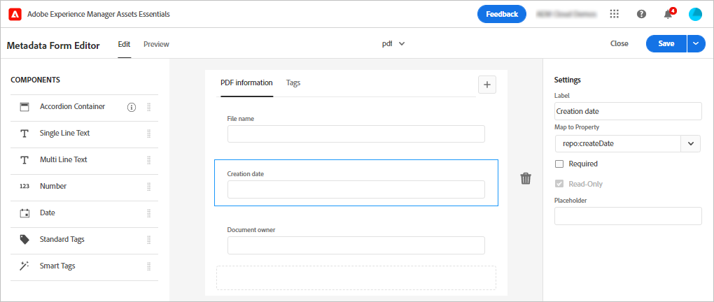
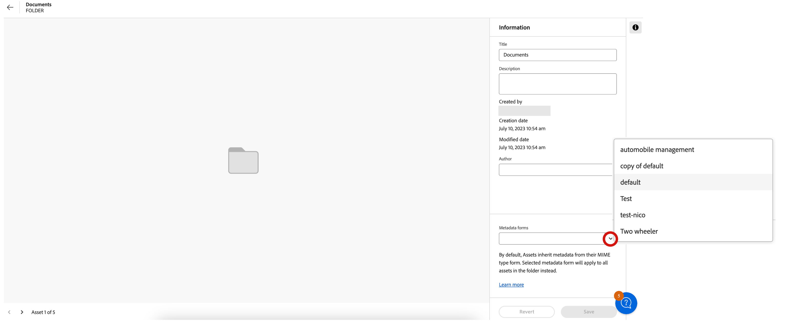

# 자산 보기의 메타데이터 {#metadata}

메타데이터는 데이터 또는 데이터에 대한 설명을 의미합니다. 예를 들어 자산 이미지에는 클릭한 카메라에 대한 정보나 저작권 정보가 포함될 수 있습니다. 이 정보는 해당 이미지의 메타데이터입니다. 메타데이터는 효율적인 자산 관리에 있어 매우 중요합니다. 메타데이터는 자산에 대해 사용 가능한 모든 데이터의 집합이지만 해당 자산에 반드시 포함되지는 않을 수 있습니다.

메타데이터는 자산을 보다 세부적으로 분류하는 데 도움이 되며 디지털 정보의 양이 증가할 때 유용합니다. 파일 이름, 미리보기 및 메모리 기준으로만 수백 개의 파일을 관리할 수 있습니다. 그러나 이 접근 방식은 확장할 수 없습니다. 관련된 사용자의 수와 관리하는 자산의 수가 증가하면 효율성이 떨어질 수 있습니다.

메타데이터를 추가하면 에셋이 다음과 같이 되기 때문에 디지털 에셋의 가치가 증가합니다.

* 접근성 향상 - 시스템과 사용자가 쉽게 찾을 수 있습니다.
* 관리 용이성 - 동일한 속성 세트를 가진 자산을 더 쉽게 찾고 변경 사항을 적용할 수 있습니다.
* 최대 효율 - 자산은 더 많은 메타데이터로 더 많은 정보와 컨텍스트를 전달합니다.

이러한 이유로 자산은 디지털 자산에 대한 메타데이터를 생성하고, 관리하고, 교환할 수 있는 적절한 수단을 제공합니다.

## 메타데이터 보기 {#view-metadata}

자산의 메타데이터를 보려면 툴바에서 해당 자산을 찾아보거나 검색한 후 자산을 선택하고 **[!UICONTROL 세부 정보]**&#x200B;를 클릭합니다.

*그림: 자산과 해당 메타데이터를 보려면&#x200B;**[!UICONTROL 세부 정보]**를 클릭하거나 자산을 더블 클릭합니다.*

[!UICONTROL 기본] 탭에서 제목, 설명 및 업로드 날짜와 같은 기본 메타데이터를 사용할 수 있습니다. [!UICONTROL 고급] 탭에는 카메라 모델, 렌즈 세부 정보 및 위치 정보 태그와 같은 고급 메타데이터가 포함되어 있습니다. [!UICONTROL 태그] 탭에는 이미지 내용에 따라 자동으로 적용된 태그가 포함되어 있습니다.

## 메타데이터 업데이트 {#update-metadata}

관리자가 메타데이터 양식을 구성하면 다른 필드를 수동으로 업데이트할 수 있습니다. 기본 메타데이터 양식을 기반으로 읽기만 하기 때문에 이 부분을 변경하는 것이 좋습니다.

## 스마트 태그 {#smart-tags}

[!DNL Experience Manager Assets]는 [Adobe Sensei](https://www.adobe.com/kr/sensei.html)에서 제공되는 인공 지능을 사용하여 업로드된 모든 자산에 관련 태그를 자동으로 적용합니다. 스마트 태그라고 명명된 이들 태그는 관련 자산을 빠르게 찾을 수 있도록 지원하여 프로젝트의 콘텐츠 속도를 높입니다. 스마트 태그는 이미지에 포함되지 않은 메타데이터의 예입니다.

스마트 태그는 실시간에 가까운 속도로 적용되며 이미지의 내용을 기반으로 생성됩니다. 자산을 업로드할 때 사용자 인터페이스는 자산 썸네일에 잠시 동안 [!UICONTROL 처리 중]을 표시합니다. 처리가 완료되면 스마트 태그와 [메타데이터를 볼 수 있습니다](#view-metadata).

*그림: 자산의 스마트 태그를 보려면&#x200B;**[!UICONTROL 세부 정보]**를 클릭하거나 자산을 더블 클릭합니다.*

스마트 태그에는 신뢰도 점수도 백분율로 포함됩니다. 이는 적용된 태그와 관련된 신뢰도를 나타냅니다. 자동으로 적용되는 스마트 태그를 조정할 수 있습니다.

## 키워드 추가 또는 업데이트 {#manually-tag}

[!DNL Adobe Sensei] 스마트 서비스를 사용하여 자동으로 추가되는 스마트 태그 외에도 자산에 태그를 추가할 수 있습니다. 미리보기를 위해 자산을 열고 [!UICONTROL 태그]를 클릭한 다음 [!UICONTROL 키워드] 필드에 원하는 키워드를 입력합니다. 태그를 추가하려면 Return 키를 누릅니다. [!DNL Assets view]는 키워드를 실시간에 가깝게 세부 조정하며, 팀은 새 키워드를 사용하여 업데이트된 자산을 곧 검색할 수 있습니다.

업로드된 모든 자산에 [!DNL Assets view]에서 자동으로 추가하는 태그를 [!UICONTROL 스마트 태그] 섹션에서 제거할 수도 있습니다.

## 분류 체계 관리 {#taxonomy-management}

카테고리 및 하위 카테고리와 같은 관계를 지원하기 위해 태그를 계층에 중첩할 수도 있습니다. 계층적 태그를 삽입해야 하는 경우 관리자가 [!UICONTROL 설정]의 [!UICONTROL 분류 체계 관리] 섹션에서 이러한 태그를 쉽게 관리할 수 있습니다. 모든 사용자가 콘텐츠를 설명할 때 사용하기 위해 액세스할 수 있는 관리형 네임스페이스 및 태그 세트를 생성할 수 있습니다. 관리자만 [!UICONTROL 분류 체계 관리자]에서 태그 계층을 설정할 수 있으므로 값이 일관되게 제어되고 사용됩니다.

## 메타데이터 양식 설정 {#metadata-forms}

>[!CONTEXTUALHELP]
>id="assets_metadata_forms"
>title="메타데이터 양식"
>abstract="[!DNL Experience Manager Assets]는 기본적으로 많은 표준 메타데이터 필드를 제공합니다. 조직에서는 추가적인 메타데이터가 필요하며 비즈니스별 메타데이터를 추가하려면 더 많은 메타데이터 필드가 필요합니다. 메타데이터 양식을 통해 기업은 자산의 [세부 정보] 페이지에 사용자 정의 메타데이터 필드를 추가할 수 있습니다. 비즈니스별 메타데이터는 자산의 거버넌스 및 검색 기능을 개선합니다."

에셋 보기는 기본적으로 많은 표준 메타데이터 필드를 제공합니다. 조직에서는 추가 메타데이터가 필요하며 비즈니스별 메타데이터를 추가하려면 더 많은 메타데이터 필드가 필요합니다. 메타데이터 양식을 통해 기업은 자산의 [!UICONTROL 세부 정보] 페이지에 사용자 정의 메타데이터 필드를 추가할 수 있습니다. 비즈니스별 메타데이터는 자산의 거버넌스 및 검색 기능을 개선합니다. 양식을 처음부터 만들거나 기존 양식의 용도를 변경할 수 있습니다.

다양한 유형의 자산(다양한 MIME 유형)에 대한 메타데이터 양식을 구성할 수 있습니다. 파일의 MIME 유형과 동일한 양식 이름을 사용합니다. 에셋 보기는 업로드된 에셋 MIME 유형을 양식 이름과 자동으로 일치시키고 양식 필드를 기반으로 업로드된 에셋의 메타데이터를 업데이트합니다.
<!--
For example, if a metadata form by the name `PDF` or `pdf` exists, then the uploaded PDF documents contain metadata fields as defined in the form.
-->
에셋 보기는 다음 시퀀스를 사용하여 기존 메타데이터 양식 이름을 검색하여 특정 유형의 업로드된 에셋에 메타데이터 필드를 적용합니다.

MIME 하위 유형 > MIME 유형 > `default` 양식 > 기본 제공 양식

예를 들어 이름이 `PDF` 또는 `pdf`인 메타데이터 양식이 있는 경우 업로드된 PDF 문서에는 양식에 정의된 메타데이터 필드가 포함됩니다. 메타데이터 양식 이름 `PDF` 또는 `pdf` 존재하지 않습니다. 이름이 인 메타데이터 양식이 있는 경우 자산 보기가 일치합니다. `application`. 이름이 `application`인 메타데이터 양식이 있는 경우 업로드된 PDF 문서에는 양식에 정의된 메타데이터 필드가 포함됩니다. 자산 보기에서 일치하는 메타데이터 양식을 찾지 못하는 경우 `default` 양식에 정의된 메타데이터 필드를 업로드된 PDF 문서에 적용하는 메타데이터 양식입니다. 이 단계 중 어느 것도 작동하지 않는 경우 에셋 보기는 기본 제공 양식에 정의된 메타데이터 필드를 업로드된 모든 PDF 문서에 적용합니다.
폴더에 메타데이터 양식을 할당하려는 경우 [참조](#assign-metadata-form-folder).

>[!IMPORTANT]
>
>특정 파일 형식에 대한 새 메타데이터 양식은 [!DNL Assets view]에서 제공하는 기본 메타데이터 양식을 완전히 대체합니다. 메타데이터 양식을 삭제하거나 이름을 변경하면 새 자산에 대한 기본 메타데이터 필드를 다시 사용할 수 있습니다.

메타데이터 양식을 만들려면 다음 단계를 따르십시오.

1. 왼쪽 레일에서 **[!UICONTROL 설정]** > **[!UICONTROL 메타데이터 양식]**&#x200B;을 클릭합니다.

   

1. 사용자 인터페이스의 오른쪽 상단에서 **[!UICONTROL 만들기]**&#x200B;를 클릭합니다.
1. 양식 이름을 입력하고 **[!UICONTROL 만들기]**&#x200B;를 클릭합니다.
1. 오른쪽 레일의 **[!UICONTROL 설정]**&#x200B;에서 탭의 이름을 입력합니다.
1. 왼쪽 레일에 있는 **[!UICONTROL 구성 요소]**&#x200B;에서 양식의 탭에 있는 필수 구성 요소를 드래그합니다. 원하는 순서대로 구성 요소를 드래그합니다.

   

   *그림: 구성 요소를 추가할 수 있는 옵션과 양식을 미리 볼 수 있는 옵션이 있는 메타데이터 양식 생성 인터페이스*

1. 각 구성 요소에 대해 오른쪽 레일의 **[!UICONTROL 설정]**&#x200B;에 이름을 입력하고 지원되는 속성이 포함된 매핑을 제공합니다.
1. 필요한 경우 구성 요소에 대해 메타데이터 필드를 필수 항목으로 만들려면 **[!UICONTROL 필수]**&#x200B;를 선택하고 자산 [!UICONTROL 세부 정보] 페이지에서 필드를 편집할 수 없도록 하려면 **[!UICONTROL 읽기 전용]**&#x200B;을 선택하십시오.
1. 필요한 경우 **[!UICONTROL 미리보기]**&#x200B;를 클릭하여 생성 중인 양식을 미리 봅니다.
1. 필요한 경우 각 탭에 더 많은 탭과 필수 구성 요소를 추가합니다.
1. 양식이 완료되면 **[!UICONTROL 저장]**&#x200B;을 클릭합니다.

이 비디오를 통해 일련의 단계를 살펴보십시오.

>[!VIDEO](https://video.tv.adobe.com/v/341275)

작성된 양식은 사용자가 일치하는 MIME 유형의 자산을 업로드할 때 자동으로 적용됩니다.

기존 양식을 재사용하여 새 양식을 만들려면 메타데이터 양식을 선택하고 도구 모음에서 **[!UICONTROL 복사]**&#x200B;를 클릭하고 이름을 입력한 다음 **[!UICONTROL 확인]**&#x200B;을 클릭합니다. 메타데이터 양식을 편집하여 변경할 수 있습니다. 양식을 변경하면 변경 후 업로드된 자산에 적용됩니다. 기존 자산은 변경되지 않습니다.

### 속성 구성 요소 {#property-components}

다음 속성 구성 요소를 사용하여 메타데이터 양식을 사용자 정의할 수 있습니다. 구성 요소 유형을 양식의 원하는 위치에 끌어다 놓고 구성 요소 설정을 수정하면 됩니다.
다음은 각 속성 유형 및 저장 방법에 대한 개요입니다.

| 구성 요소 이름 | 설명 |
|---|---|
| 아코디언 컨테이너 | 공통 구성 요소 및 속성 목록에 축소 가능한 제목을 추가합니다. 기본적으로 확장하거나 축소할 수 있습니다. |
| 한 줄 텍스트 | 한 줄 텍스트 속성을 추가합니다. |
| 여러 줄 텍스트 | 여러 줄의 텍스트 또는 단락을 추가합니다. 모든 콘텐츠를 포함하도록 사용자 유형으로 확장됩니다. |
| 다중 값 텍스트 | 다중 값 텍스트 속성을 추가합니다. |
| 숫자 | 숫자 구성 요소를 추가합니다. |
| 확인란 | 부울 값을 추가합니다. 값이 저장되면 TRUE 또는 FALSE로 저장됩니다. |
| 날짜 | 날짜 구성 요소를 추가합니다. |
| 드롭다운 | 드롭다운 목록을 추가합니다. |
| 상태 | 저장소 상태 속성 추가(repo:state에 매핑됨) |
| 자산 상태 | 기본 자산 상태 속성 추가(dam:assetStatus에 매핑됨) |
| 태그 | 분류 체계 관리에 저장된 값에서 태그를 추가합니다(xcm:tags에 매핑됨). |
| 키워드 | 자유 형식 키워드를 추가합니다(dc:subject에 매핑됨). |
| 스마트 태그 | 메타데이터 태그를 자동으로 추가하여 검색 기능을 보강합니다. |

### 폴더에 메타데이터 양식 할당 {#assign-metadata-form-folder}

자산 보기 배포 내의 폴더에 메타데이터 양식을 할당할 수도 있습니다. 메타데이터 양식을 폴더에 수동으로 적용하면 MIME 유형에 따라 폴더에 할당된 메타데이터 양식을 덮어씁니다. 하위 폴더의 자산을 포함한 폴더의 모든 자산에는 메타데이터 양식에 정의된 속성이 표시됩니다.

폴더에 메타데이터 양식을 할당하려면 다음을 수행합니다.

1. **[!UICONTROL 설정]** > **[!UICONTROL 메타데이터 양식]**&#x200B;으로 이동하여 메타데이터 양식을 선택합니다.

2. **[!UICONTROL 폴더에 할당]**&#x200B;을 선택합니다.

3. 폴더를 선택하고 **[!UICONTROL 할당]**. 폴더 이름을 클릭하여 폴더를 선택할 수 있습니다.

   

   또한 폴더 세부 정보 페이지로 이동한 다음 오른쪽 창에 있는 폴더 속성에서 메타데이터 양식을 선택하여 메타데이터 양식을 폴더에 할당할 수도 있습니다.

   

### 폴더에서 메타데이터 양식 제거 {#remove-metadata-form-folder}

메타데이터 양식을 하나 이상의 폴더에 할당한 후 Experience Manager Assets을 사용하면 선택한 폴더에서 메타데이터 양식을 제거할 수도 있습니다.

폴더에서 메타데이터 양식을 제거하려면 다음을 수행합니다.

1. **[!UICONTROL 설정]** > **[!UICONTROL 메타데이터 양식]**&#x200B;으로 이동하여 메타데이터 양식을 선택합니다.

1. 클릭 **[!UICONTROL 폴더에서 제거]**. 메타데이터 양식 표시를 위해 할당된 폴더 목록입니다.

1. 폴더를 선택하고 **[!UICONTROL 제거]**. 목록에서 여러 폴더를 선택할 수도 있습니다.

폴더 세부 정보 페이지로 이동하여 을 선택할 수도 있습니다. **[!UICONTROL 시스템 매핑 메타데이터 양식]** 다음에서 **[!UICONTROL 메타데이터 Forms]** 폴더에서 할당된 메타데이터 양식을 제거하는 필드입니다.

## 다음 단계 {#next-steps}

* [자산 보기에서 메타데이터 양식을 관리하려면 비디오 보기](https://experienceleague.adobe.com/docs/experience-manager-learn/assets-essentials/configuring/metadata-forms.html)

* Assets 보기 사용자 인터페이스에서 사용 가능한 [!UICONTROL 피드백] 옵션을 사용하여 제품 피드백 제공

* 오른쪽 사이드바에서 사용 가능한 [!UICONTROL 이 페이지 편집], , [!UICONTROL 문제 기록] 또는 을 사용하여 설명서 피드백 제공

* [고객 지원 센터](https://experienceleague.adobe.com/?support-solution=General#support) 문의

<!-- TBD: Cannot create a form using the second option. Documenting only the first option for now.
To reuse an existing form to create a form, do one of these:

* Select a metadata form and click **[!UICONTROL Copy]** from the toolbar, provide a name, and click **[!UICONTROL Confirm]**.

* Click **[!UICONTROL Create]**, select **[!UICONTROL Use existing form structure as template]** option, and select an existing form. 
-->

<!-- TBD: Queries for PM and engg.

Can we edit the existing metadata in any form?

How to moderate smart tags?

Allow or deny list for smart tags?

What about Tags displayed just above Smart Tags in the UI?

Is there a detailed metadata tab. Where do the other details of an asset go?

How can one search based strictly on the metadata. Similar to AEM Assets GQL queries.
-->

<!-- TBD: Link to related articles if any.

>[!MORELIKETHIS]
>
>* [Search assets](search.md).
-->
