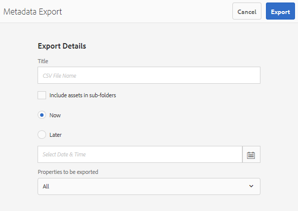

# 자산 메타데이터 일괄적으로 가져오거나 내보냅니다 {#import-and-export-asset-metadata-in-bulk}

Adobe Experience Manager Assets를 사용하면 CSV 파일을 사용하여 자산 메타데이터를 일괄적으로 가져올 수 있습니다. CSV 파일을 가져와서 최근에 업로드한 자산 또는 기존 자산에 대한 벌크 업데이트를 수행할 수 있습니다. 타사 시스템에서 CSV 형식으로 자산 메타데이터를 일괄적으로 수집할 수도 있습니다.

## 메타데이터 가져오기 {#import-metadata}

메타데이터 가져오기는 비동기적이며 시스템 성능에 영향을 주지 않습니다. 자산 마이크로서비스를 사용하는 메타데이터 쓰기 저장(writeback) 활동으로 인해 여러 자산에 대한 메타데이터를 동시에 업데이트하는 것은 리소스를 많이 사용할 수 있습니다. Adobe은 다른 사용자의 성능에 영향을 주지 않도록 서버 사용 기간 동안 대량 작업을 계획하는 것을 권장합니다.

>[!NOTE]
>
>사용자 지정 네임스페이스에 메타데이터를 가져오려면 먼저 네임스페이스를 등록합니다.

1. 다음으로 이동 [!DNL Assets] 사용자 인터페이스, 선택 **[!UICONTROL 만들기]** 도구 모음에서 를 선택하고 **[!UICONTROL 메타데이터]** 메뉴 아래의 제품에서 사용할 수 있습니다.
1. 에서 **[!UICONTROL 메타데이터 가져오기]** 페이지를 클릭한 다음 **[!UICONTROL 파일 선택]**. Select the CSV file with the metadata.
1. 다음 매개 변수를 제공합니다.

   | 매개변수 | 설명 |
   | ---------------------- | ------- |
   | 배치 크기 | 메타데이터를 가져올 일괄 처리의 자산 수입니다. 기본값은 50입니다. 최대값은 100입니다. |
   | 필드 분리 기호 | 기본값은 입니다. `,` (쉼표) 다른 문자를 지정할 수 있습니다. |
   | 다중 값 구분 기호 | 메타데이터 값에 대한 구분자입니다. 기본값은 입니다. `|`. |
   | 워크플로우 실행 | 기본적으로 False입니다. 로 설정된 경우 `true` 및 기본 설정은 DAM 메타데이터 다시 쓰기 워크플로우에 적용됩니다(이진 XMP 데이터에 메타데이터를 기록). 워크플로우를 활성화하면 시스템이 느려집니다. |
   | 자산 경로 열 이름 | 자산이 있는 CSV 파일의 열 이름을 정의합니다. |

1. 선택 **[!UICONTROL 가져오기]** 를 클릭합니다. 메타데이터를 가져오면 알림 받은 편지함으로 알림이 전송됩니다. 자산 속성 페이지로 이동하고 메타데이터 값을 자산에 대해 올바르게 가져오는지 확인합니다.

1. 날짜 및 타임스탬프를 추가하여 메타데이터를 가져오려면 `YYYY-MM-DDThh:mm:ss.fff-00:00` 날짜 및 시간에 대한 형식입니다. 날짜와 시간은 `T`, `hh` 시간은 24시간 형식으로, `fff` 은 나노 초이고, `-00:00` 시간대 오프셋입니다. 예, `2020-03-26T11:26:00.000-07:00` 은 2020년 3월 26일, 11일입니다:26:오전 00.00 PST.

   * 날짜 형식은 열 머리글과 열 형식에 따라 다릅니다. 예를 들어, 날짜가 형식이 포함된 불만 사항인 경우 `yyyy-MM-dd'T'HH:mm:ssXXX` 각 열 헤더는 `Date: DateFormat: yyyy-MM-dd'T'HH:mm:ssXXX`.
   * 기본 날짜 형식은 다음과 같습니다 `yyyy-MM-dd'T'HH:mm:ss.SSSXXX`.

<!-- Hidden via cqdoc-17869>

>[!CAUTION]
>
>If the date format does not match `YYYY-MM-DDThh:mm:ss.fff-00:00`, the date values are not set. The date formats of exported metadata CSV file is in the format `YYYY-MM-DDThh:mm:ss-00:00`. If you want to import it, convert it to the acceptable format by adding the nanoseconds value denoted by `fff`.
-->

## 메타데이터 내보내기 {#export-metadata}

여러 자산에 대한 메타데이터를 CSV 형식으로 내보낼 수 있습니다. 메타데이터는 비동기식으로 내보내지므로 시스템 성능에 영향을 주지 않습니다. 메타데이터를 내보내려면 Experience Manager이 자산 노드의 속성을 통과합니다 `jcr:content/metadata` 및 해당 하위 노드를 캡처하고 CSV 파일로 메타데이터 속성을 내보냅니다.

메타데이터를 일괄적으로 내보내는 사용 사례는 다음과 같습니다.

* 자산을 마이그레이션할 때 서드파티 시스템에서 메타데이터를 가져옵니다.
* 더 넓은 프로젝트 팀과 자산 메타데이터를 공유합니다.
* 메타데이터를 테스트하거나 감사하여 규정을 준수합니다.
* 별도의 현지화를 위한 메타데이터를 외부화합니다.

1. 메타데이터를 내보낼 자산이 들어 있는 자산 폴더를 선택합니다. 도구 모음에서 를 선택합니다 **[!UICONTROL 메타데이터 내보내기]**.
1. 메타데이터 내보내기 대화 상자에서 CSV 파일의 이름을 지정합니다. 하위 폴더의 자산에 대한 메타데이터를 내보내려면 을 선택합니다 **[!UICONTROL 하위 폴더에 자산 포함]**.

   

1. 원하는 옵션을 선택합니다. 파일 이름을 입력하고 필요한 경우 날짜를 입력합니다.

1. 에서 **[!UICONTROL 내보낼 속성]** 필드에서 모든 속성을 내보내할지 특정 속성을 내보내할지를 지정합니다. 내보낼 선택적 속성 을 선택하는 경우 원하는 속성을 추가합니다.

1. 도구 모음에서 탭/클릭 **[!UICONTROL 내보내기]**. 메타데이터가 내보내지는지 확인하는 메시지가 나타납니다. 메시지를 닫습니다.
1. Open the inbox notification for the export job. Select the job and click **[!UICONTROL Open]** from the toolbar. To download the CSV file with the metadata, tap/click **[!UICONTROL CSV Download]** from the toolbar. **[!UICONTROL 닫기]**&#x200B;를 클릭합니다.

   

   *그림: 대량으로 내보낸 메타데이터가 포함된 CSV 파일을 다운로드하는 대화 상자*

>[!MORELIKETHIS]
>
>* [자산을 일괄적으로 가져올 때 메타데이터 가져오기](/help/assets/add-assets.md#asset-bulk-ingestor)

