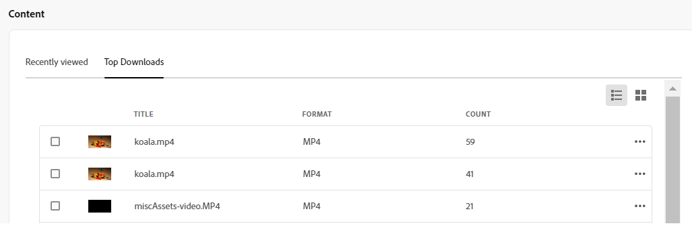

# Assets용 내 작업 영역 {#my-workspace}

| [모범 사례 검색](/help/assets/search-best-practices.md) | [메타데이터 모범 사례](/help/assets/metadata-best-practices.md) | [Content Hub](/help/assets/product-overview.md) | [OpenAPI 기능이 있는 Dynamic Media](/help/assets/dynamic-media-open-apis-overview.md) | [AEM Assets 개발자 설명서](https://developer.adobe.com/experience-cloud/experience-manager-apis/) |
| ------------- | --------------------------- |---------|----|-----|

>[!CONTEXTUALHELP]
>id="assets_my_workspace"
>title="내 작업 영역"
>abstract="이제 Assets에는 Assets 사용자 인터페이스의 주요 영역과 사용자와 가장 관련성이 높은 정보에 편리하게 액세스할 수 있는 위젯을 제공하는 사용자 정의 가능한 작업 영역이 포함됩니다. 이 페이지는 작업 항목에 대한 개요 및 주요 워크플로에 대한 빠른 액세스를 제공하는 종합적인 솔루션 역할을 합니다."

이제 Assets에는 Assets 사용자 인터페이스의 주요 영역과 사용자와 가장 관련성이 높은 정보에 편리하게 액세스할 수 있는 위젯을 제공하는 사용자 정의 가능한 작업 영역이 포함됩니다. 이 페이지는 작업 항목에 대한 개요 및 주요 워크플로에 대한 빠른 액세스를 제공하는 종합적인 솔루션 역할을 합니다. 이러한 옵션에 보다 편리하게 액세스하면 효율성과 콘텐츠 속도가 향상됩니다.

왼쪽 탐색 창에서 사용할 수 있는 항목에서 **[!UICONTROL 내 작업 영역]**&#x200B;을 클릭하여 내 작업 영역에 액세스할 수 있습니다. 내 작업 영역에는 바로 가기, 인사이트, 작업 및 콘텐츠 위젯을 보여 주는 다양한 위젯이 포함됩니다. 환경 설정에 따라 이러한 위젯이 작업 영역에 표시되는 방식을 구성할 수 있습니다.

>[!NOTE]
>
>인사이트 위젯은 관리자에게만 표시됩니다.

<!--

**New features coming soon**

Highlights upcoming features for Assets.

-->

**빠른 액세스**

나중에 필요할 때 파일, 폴더 및 컬렉션에 더 빠르게 액세스할 수 있도록 이러한 항목을 고정합니다. 고정된 모든 항목은 내 작업 영역의 **바로 가기** 섹션에 표시됩니다. 저장소 내에서 저장된 위치로 이동하는 대신 내 작업 영역을 사용하여 액세스할 수 있습니다.

자산, 폴더 또는 컬렉션을 고정하려면

1. 항목을 선택하고 **[!UICONTROL 바로 가기에 고정]**&#x200B;을 클릭합니다.

1. 사용자, 조직 전체 또는 선택한 그룹에 맞는 항목을 고정해야 하는 경우 선택합니다. **[!UICONTROL 그룹에 대해]**&#x200B;를 선택하는 경우 **[!UICONTROL 그룹에 대해 고정]** 필드에서 기존 그룹 이름을 선택하십시오.

   
1. **[!UICONTROL 핀]**&#x200B;을 클릭합니다.

   선택한 항목은 내 작업 영역의 **[!UICONTROL 바로 가기]** 섹션에 표시됩니다.
   

**인사이트**

관리자는 지난 30일 동안 Assets 환경에서 수행된 다운로드 및 업로드 수의 요약본을 볼 수 있습니다. **[!UICONTROL 모두 보기]**&#x200B;를 클릭하면 [인사이트] 페이지로 빠르게 이동하여 더 자세한 대시보드를 볼 수 있습니다.

내 Workspace의 **인사이트** 섹션을 사용하여 Assets 보기 배포 내에서 검색한 횟수와 함께 검색된 상위 용어를 볼 수도 있습니다. 세부 인사이트로 이동하여 지난 30일 또는 12개월 동안의 인기 검색어를 볼 수도 있습니다.

**작업**

사용자가 **[!UICONTROL 할당된 작업]** 탭에서 만든 **[!UICONTROL 내 작업]** 탭에서 현재 사용자에게 할당된 작업 목록과 **[!UICONTROL 완료된 작업]** 탭에서 이미 완료된 작업을 표시합니다. 작업을 선택하고 **[!UICONTROL 요청 완료]**&#x200B;를 클릭하여 작업을 승인하거나 거부할 수 있습니다. 작업을 선택하고 **[!UICONTROL 작업 세부 정보 열기]**&#x200B;를 클릭하여 작업을 보고 승인, 거부, 편집 또는 삭제할 수도 있습니다.

>[!NOTE]
>
> 자산에 대한 작업을 다른 사용자에게 할당하는 **[!UICONTROL 작업 할당]** 옵션은 자산을 선택하거나 자산 정보 보기를 열 때 사용할 수 있습니다.

**콘텐츠**

최근에 본 자산 목록을 포함하여 다양한 자산 보기를 표시합니다. 목록 보기, 격자 보기, 갤러리 보기 또는 워터폴 보기의 위젯에 자산을 표시하고 자산을 이름, 크기 및 수정일별로 정렬할 수 있습니다. 자산을 선택하여 자산 세부 정보를 보거나 최근 본 자산 목록에서 제거할 수도 있습니다.

**[!UICONTROL 상위 다운로드]** 탭에는 Assets 보기 환경에서 가장 많이 다운로드한 상위 10개의 자산이 표시됩니다. [목록 보기] 또는 [격자 보기]에서 자산이 표시되도록 할 수 있습니다. 두 보기 모두 각 자산에 대한 포맷 유형 및 다운로드 수를 표시합니다. 자산을 선택하고 **[!UICONTROL 세부 정보]**&#x200B;를 클릭하면 해당 속성을 조회할 수 있습니다.

## 내 작업 영역 사용자 정의 {#configure-widgets}

기본적으로 모든 위젯이 표시되지만 내 작업 영역에 표시되는 위젯을 활성화하거나 비활성화할 수 있습니다. 환경 설정은 각 사용자에 따라 다릅니다.

1. 왼쪽 탐색 창에서 사용할 수 있는 **[!UICONTROL 내 작업 영역]**&#x200B;을 클릭하고 **[!UICONTROL 사용자 정의]**&#x200B;를 클릭합니다.

1. 작업 영역에 표시할 필요가 없는 위젯의 토글을 끕니다. 위젯을 적절한 위치로 드래그하여 작업 영역에서 표시 순서를 업데이트할 수도 있습니다.

1. **[!UICONTROL 완료]**&#x200B;를 클릭하여 변경 내용을 저장합니다.

   
