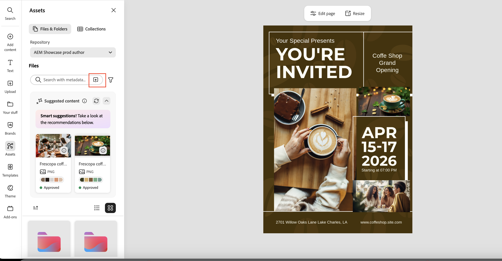
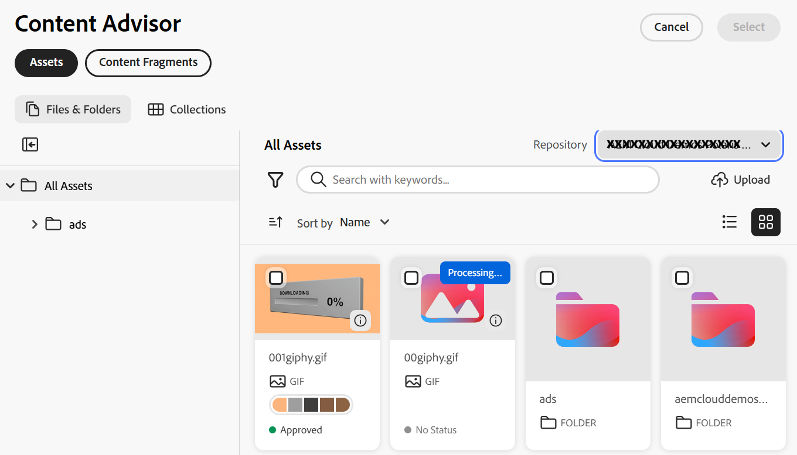

# 콘텐츠 관리자를 사용하여 Adobe Express의 AEM Assets에 액세스 {#native-integration-adobe-express-using-content-advisor}

Adobe Experience Manager(AEM) Assets은 기본적으로 Adobe Express과 통합되므로 컨텐츠 권고자를 사용하여 익스프레스 인터페이스 내에서 AEM Assets의 자산을 직접 검색, 액세스 및 사용할 수 있습니다.

Content Advisor는 컨텍스트 인식 지능형 에셋 검색을 크리에이티브 워크플로우에 직접 제공하여 Adobe Express에서 에셋을 검색하고 사용하는 방법을 변환합니다. 콘텐츠 관리자는 키워드를 입력하여 에셋을 검색하는 대신 캔버스 콘텐츠, 캠페인 개요 및 의도를 기반으로 관련성 있고 승인된 에셋을 표시하므로 적합한 에셋을 보다 빠르게 찾을 수 있습니다.

Content Advisor를 사용하면 스마트 제안, Dynamic Media 렌디션 액세스, 에셋 메타데이터에 대한 전체 가시성 기능을 통해 Adobe Express을 종료하지 않고도 AEM Assets에서 에셋을 효율적으로 찾고, 평가하고, 사용할 수 있습니다. 이를 통해 컨텐츠 생성 시간을 단축하고, 에셋 재사용을 개선하며, 승인된 브랜드 준수 에셋을 일관되게 사용할 수 있습니다.


또한 에셋을 Express 캔버스에 배치하고 새 콘텐츠 또는 편집된 콘텐츠를 AEM Assets에 다시 저장하여 중앙 집중식 에셋 관리 및 거버넌스를 보장할 수 있습니다. Adobe Express과의 기본 통합은 다음과 같은 주요 이점을 제공합니다.

* 컨텍스트 인식 에셋 검색 및 권장 사항을 통해 콘텐츠 생성 시간을 단축할 수 있습니다.

* 기존 에셋을 편집하고 새 에셋을 AEM Assets에 저장하여 콘텐츠 재사용을 늘렸습니다.

* 채널에 최적화된 승인된 Dynamic Media 표현물에 보다 빠르게 액세스할 수 있습니다.

* 브랜드 일관성을 유지하면서 새로운 에셋 또는 버전을 만드는 데 드는 시간과 노력을 줄일 수 있습니다.

## 사전 요구 사항 {#prerequisites}

Adobe Express 및 AEM Assets 내 하나 이상의 환경에 액세스할 수 있는 권한. 환경은 Assets as a Cloud Service 저장소 중 하나일 수 있습니다.

## Adobe Express 편집기 내 AEM Assets 사용 {#use-aem-assets-in-express}

Adobe Express 편집기에서 AEM Assets을 사용하려면 다음 단계를 수행하십시오.

1. Adobe Express 웹 애플리케이션을 엽니다.

2. 새 템플릿 또는 프로젝트를 로드하거나 에셋을 만들어 새 빈 캔버스를 엽니다.

3. 왼쪽 탐색 창에서 사용할 수 있는 **[!UICONTROL Assets]**&#x200B;을(를) 클릭합니다. Adobe Express은 루트 수준에서 사용할 수 있는 에셋 및 폴더 목록과 함께 액세스할 수 있는 저장소를 나열하는 [콘텐츠 관리자](#intelligent-asset-discovery-content-advisor)를 표시합니다.

4. [콘텐츠 관리자](#intelligent-asset-discovery-content-advisor)를 사용하여 저장소에서 자산을 검색하거나 검색한 다음 캔버스로 끌어서 놓습니다. 또는 에셋을 클릭하여 캔버스에 배치합니다. 승인 상태, 파일 유형, MIME 유형 및 차원과 같은 다양한 기준으로  자산을 필터링할 수도 있습니다.

   >[!NOTE]
   >
   >차원으로 필터링은 비디오에 적용되지 않습니다.

   

## Content Advisor를 통한 지능형 자산 검색 {#intelligent-asset-discovery-content-advisor}

콘텐츠 관리자는 캔버스 콘텐츠 또는 캠페인 개요를 기반으로 하는 지능적이고 상황에 맞는 권장 사항을 사용하여 관련 에셋을 검색할 수 있도록 지원합니다. 또한 사용 사례에 최적화된 채널 기반 Dynamic Media 렌디션을 선택할 수도 있습니다.


컨텐츠 권고자는 목록 및 그리드 보기에서 파일, 폴더 및 컬렉션 목록을 표시합니다. PNG, JPEG, PSD, MP4, SVG 및 PDF 형식의 에셋을 Express 캔버스에 추가할 수 있습니다. 자산 카드에서 사용할 수 있는  아이콘을 클릭하여 스크롤 가능한 PDF 파일 또는 다른 형식 유형을 미리 볼 수도 있습니다.

 아이콘을 클릭하여 **[!UICONTROL 기본]** 탭에서 사용할 수 있는 에셋 메타데이터를 보거나 [Dynamic Media](#dynamic-media-renditions-content-advisor) 탭에서 사용할 수 있는 Dynamic Media 변환을 봅니다. 제안된 콘텐츠를 캔버스로 드래그하여 놓습니다. 또는 에셋을 클릭하여 캔버스에 자동으로 배치합니다.


>[!IMPORTANT]
> 
>**저장소** 드롭다운 목록에서 **작성자** 저장소를 선택해야 합니다. **게재** 저장소에 콘텐츠 관리자 기능이 표시되지 않습니다.
>
> 또한 **게재** 리포지토리에는 폴더 및 컬렉션에 구성된 자산이 없습니다. 모든 에셋은 루트 수준에서 플랫 구조로 표시됩니다.

컨텐츠 권고자는 다음과 같은 주요 기능을 제공합니다.

* [보다 스마트한 에셋 검색을 위한 AI 검색](#content-advisor-ai-search)

* [컨텍스트 및 의도를 기반으로 한 스마트 제안](#smart-suggestions-content-advisor)

* [관련 자산을 검색하는 캠페인 개요](#campaign-briefs-content-advisor)

* [Dynamic Media 자산 렌디션 사용 가능](#dynamic-media-renditions-content-advisor)

* [Assets 보기와 일관된 에셋 메타데이터 액세스](#asset-metadata-content-advisor)

* [Assets 보기와 일치하는 필터에 액세스](#filters-content-advisor)

* [최근 검색 및 저장된 검색 액세스 및 재사용](#saved-searches-content-advisor)

* [컬렉션의 에셋 및 내부 에셋 검색](#search-collections-content-advisor)

### 보다 스마트한 에셋 검색을 위한 AI 검색 {#content-advisor-ai-search}

콘텐츠 관리자는 정확한 키워드 일치 여부에 의존하지 않고 사용자 쿼리 뒤에 있는 의미와 의도를 이해하는 고급 검색 기능을 사용합니다. 인공지능(AI)과 머신러닝을 활용해 보다 정확하고 상황에 맞는 결과를 전달한다.

정확한 용어를 찾는 기존 키워드 기반 검색과 달리 AI 검색은 단어, 개념, 사용자 의도 간 관계를 해석한다. 이렇게 하면 쿼리가 다르게 표현되거나, 오타가 있거나, 다른 언어로 되어 있더라도 사용자가 찾고 있는 항목을 찾을 수 있습니다.

Adobe Express의 자산에 대한 

몇 가지 주요 이점은 다음과 같습니다.

* 다국어 지원: 정확한 번역 없이 여러 언어를 검색할 수 있습니다. 사용자는 쿼리 언어에 관계없이 관련 콘텐츠를 찾을 수 있습니다.

* 오자 처리: 오타 및 맞춤법 오류를 해석하여 입력이 불완전해도 정확한 결과를 보장합니다.

* 동의어 이해: 관련 용어 및 구에 대한 결과를 제공하므로 사용자가 올바른 키워드를 추측할 필요가 없습니다.

* 컨텍스트 인식 검색: 정확한 단어뿐만 아니라 쿼리 뒤에 있는 의도를 인식합니다.

>[!IMPORTANT]
> 
>* 콘텐츠 관리자 내의 AI 검색에 액세스하는 데 필요한 최소 AEM 릴리스 버전은 `21994`입니다.


### 컨텍스트 및 의도를 기반으로 한 스마트 제안 {#smart-suggestions-content-advisor}

컨텐츠 권고자는 빠른 캔버스에 있는 컨텐츠의 컨텍스트와 의도를 기반으로 스마트 제안을 표시합니다. 따라서 시간이 많이 소요되는 수동 검색 없이 콘텐츠 요구 사항에 맞는 에셋을 빠르게 검색하고 사용할 수 있습니다.


>[!IMPORTANT]
> 
>* 컨텐츠 권고자는 텍스트 레이어에서 사용할 수 있는 컨텐츠의 컨텍스트 및 의도 또는 빠른 캔버스의 제목에 따라 고급 제안을 표시합니다. 캔버스에서 사용할 수 있는 이미지에 기반한 결과는 표시되지 않습니다.
>* Content Advisor 내에서 이 기능에 액세스하려면 GenAI 라이더에 서명해야 합니다. GenAI 라이더에 서명하려면 Adobe 담당자에게 문의하십시오.
>* 이 기능에 액세스하는 데 필요한 최소 AEM 릴리스 버전은 `21994`입니다.
>* 캔버스를 업데이트할 때 스마트 제안이 자동으로 업데이트되지 않습니다. **제안된 콘텐츠** 패널의 새로 고침 아이콘을 클릭하여 업데이트된 제안 목록을 봅니다.

### 관련 자산을 검색하는 캠페인 개요 {#campaign-briefs-content-advisor}

콘텐츠 관리자를 사용하면 검색 키워드를 수동으로 입력하지 않고도 캠페인 개요 문서를 업로드하여 관련 에셋을 검색할 수 있습니다. 콘텐츠 관리자는 캠페인 개요의 정보를 분석하여 캠페인의 의도를 파악하고 AEM Assets에서 사용할 수 있는 관련 에셋을 권장합니다.



>[!IMPORTANT]
>
>* 콘텐츠 관리자는 캠페인 개요에서 텍스트로 사용할 수 있는 정보를 분석하여 관련 에셋을 추천합니다. 캠페인 개요에서 이미지로 사용할 수 있는 정보는 분석하지 않습니다.
>* 캠페인 브리핑으로 업로드할 수 있는 지원되는 파일 형식에는 PDF, DOCX 및 TXT 문서가 포함됩니다.
>* Content Advisor 내에서 이 기능에 액세스하려면 GenAI 라이더에 서명해야 합니다. GenAI 라이더에 서명하려면 Adobe 담당자에게 문의하십시오.
>* 이 기능에 액세스하는 데 필요한 최소 AEM 릴리스 버전은 `21994`입니다.

### Dynamic Media 자산 렌디션 사용 가능 {#dynamic-media-renditions-content-advisor}

Dynamic Media 렌디션은 [이미지 사전 설정](/help/assets/dynamic-media/managing-image-presets.md), [스마트 자르기](/help/assets/dynamic-media/image-profiles.md), 형식 유형 및 색상 프로필을 포함하여 채널에 최적화된 사용 가능 버전을 제공합니다. 이러한 렌디션을 사용하면 수동으로 편집하거나 에셋을 복제할 필요 없이 선택한 에셋이 채널 및 디자인 요구 사항을 충족할 수 있습니다.

또한 Dynamic Media 수정자를 적용하여 빠른 캔버스에 렌디션을 배치하기 전에 실시간으로 조정 내용을 미리 볼 수 있으므로 에셋 일관성과 품질을 유지하면서 가장 적절한 렌디션을 더 빠르게 선택할 수 있습니다.

에셋 카드에서  아이콘을 클릭하고 **[!UICONTROL Dynamic Media]** 탭을 선택하여 에셋에 사용할 수 있는 렌디션을 봅니다. [Dynamic Media Scene7](/help/assets/dynamic-media/dynamic-media.md) 표현물 또는 [OpenAPI를 사용하는 Dynamic Media](/help/assets/dynamic-media-open-apis-overview.md) 표현물을 보도록 선택할 수 있습니다. 에셋에 대해 **[!UICONTROL OpenAPI]**&#x200B;를 선택하면 에셋이 승인되고 OpenAPI를 통해 Dynamic Media에 사용할 수 있는 경우에만 사용 가능한 렌디션이 표시됩니다.

Dynamic Media 탭을 보려면 유효한 AEM Dynamic Media 라이센스가 있어야 합니다.


렌디션을 미리 보려면  아이콘을 클릭하고, 캔버스에 자동으로 배치하려면 렌디션 이름을 클릭하십시오. 렌디션을 미리 본 다음 드래그하여 놓아 이미지를 캔버스에 배치할 수도 있습니다.


**[!UICONTROL 수정자 추가]**&#x200B;를 클릭하고 텍스트 상자에 수정자를 지정한 다음 Enter 키를 눌러 변환에 변형을 실시간으로 적용합니다. 마찬가지로 렌디션에 여러 수정자를 추가하고 해당 변형을 미리 볼 수 있습니다. 미리보기에서 캔버스로 에셋을 끌어다 놓습니다. 이러한 수정자를 적용한 후의 렌디션은 저장되지 않습니다. [Dynamic Media Scene7](https://experienceleague.adobe.com/en/docs/dynamic-media-developer-resources/image-serving-api/image-serving-api/http-protocol-reference/command-reference/c-command-reference) 및 [OpenAPI를 사용하는 Dynamic Media](https://developer.adobe.com/experience-cloud/experience-manager-apis/api/stable/assets/delivery/#operation/getAssetSeoFormat)에 대해 지원되는 수정자 목록을 참조하십시오.

>[!IMPORTANT]
> 
>Dynamic Media는 대규모 에셋에 대한 최적화된 변환을 제공하여 Adobe Express(웹)의 80MB 업로드 파일 크기 제한을 극복합니다. Dynamic Media 렌디션은 시각적 품질을 유지하면서 파일 크기를 크게 줄입니다. 예를 들어 300MB의 TIFF 에셋은 품질을 손상시키지 않고 2.5MB 렌디션으로 제공할 수 있어 Adobe Express에서 고해상도 에셋을 효율적으로 사용할 수 있습니다.

### Assets 보기와 일관된 에셋 메타데이터 액세스 {#asset-metadata-content-advisor}

컨텐츠 권고자는 Assets 보기에서 사용할 수 있는 메타데이터를 포함하여 AEM Assets에 정의된 자산 속성에 대한 액세스를 제공합니다. 컨텐츠 권고자는 Assets 보기와 동일한 메타데이터 구성을 사용하여 Assets 보기 자산 세부 사항 페이지의 메타데이터 탭 및 컨텐츠 목록을 복제합니다. 이렇게 하면 에셋을 선택하기 전에 제목, 설명, 형식, 크기 및 기타 메타데이터와 같은 주요 에셋 세부 사항을 검토할 수 있습니다. 에셋 속성에 액세스하면 콘텐츠에 대해 올바르고 승인된 에셋을 선택할 수 있습니다.


에셋 카드의  아이콘을 클릭하고 **[!UICONTROL 기본]** 탭을 선택하여 에셋 메타데이터를 봅니다. Assets 보기에 있는 에셋 메타데이터와 일관되게 제품, 캠페인 및 태그와 같은 다른 에셋 메타데이터 탭을 볼 수도 있습니다.

컨텐츠 권고자는 읽기 전용 보기에서 파일에 대한 속성(메타데이터)을 표시합니다. 컬렉션과 폴더의 속성은 표시되지 않습니다.

### Assets 보기와 일치하는 필터에 액세스 {#filters-content-advisor}

Content Advisor는 Assets 보기에서 사용할 수 있는 것과 동일한 필터링 기능을 Express에 제공하여 사전 정의된 필터를 사용하여 에셋을 구체화할 수 있습니다. Assets 보기에서 사용할 수 있는 것과 동일한 필터링 기능은 파일, 폴더 및 컬렉션과 같은 콘텐츠 유형과 관련된 필터에도 적용됩니다. 이를 통해 일관된 에셋 검색 환경을 보장하고 Adobe Express 내에서 관련 에셋을 효율적으로 찾을 수 있습니다.

필터 스키마를 통해 Assets 보기에 설정된 필터가 없는 경우 컨텐츠 권고자는 파일 유형, 파일 형식, 에셋 상태, 파일 크기, 이미지 너비, 이미지 높이, 수정 날짜 및 생성 날짜 등 기본 제공 필터를 표시합니다.

### 최근 검색 및 저장된 검색 액세스 및 재사용 {#saved-searches-content-advisor}

Assets 보기에서 만든 저장된 검색도 사용할 수 있으므로 사전 정의된 검색 기준을 재사용할 수 있습니다. 저장된 검색은 브라우저 전체에서 Assets 보기와 Content Advisor 간에 일관되게 작동합니다. 이렇게 하면 AEM Assets 및 Adobe Express에서 일관된 검색 패턴을 사용하여 에셋을 효율적으로 찾을 수 있습니다.

콘텐츠 관리자를 사용하여 자주 사용하는 검색을 저장하려면 다음을 수행합니다.

1. 검색어(선택 사항)를 지정하고 필터 아이콘을 클릭한 다음 요구 사항에 따라 옵션을 선택하여 검색 쿼리를 만듭니다.

1. 결과를 보려면 **[!UICONTROL 적용]**&#x200B;을 클릭하십시오.

1. 필터 아이콘 > **저장된 검색 관리** > **저장된 새 검색 만들기**&#x200B;를 클릭합니다.

1. 검색 이름을 지정하고 을 클릭하여 저장합니다. 항목 목록에 검색이 표시됩니다.

   

저장된 검색 항목을 적용하려면 필터 아이콘을 클릭하고 **[!UICONTROL 저장된 검색]** 드롭다운 목록에서 검색 항목을 선택한 다음 **[!UICONTROL 적용]**&#x200B;을 클릭하십시오.

컨텐츠 권고자를 사용하면 최근 검색을 저장할 뿐만 아니라 나중에 빠르게 액세스할 수 있도록 자주 사용하는 검색을 저장할 수 있습니다. 최근 검색 목록이 Assets 보기와 컨텐츠 권고자 간에 일치하지 않습니다. 동일한 사용자가 Assets 보기 및 콘텐츠 관리자에서 서로 다른 최근 검색 세트를 가질 수 있습니다. 시크릿 모드를 사용하여 콘텐츠 권고자에 액세스하는 경우 최근 검색 목록을 사용할 수 없습니다. 또한 최근 검색은 동일한 사용자에 대해 서로 다른 브라우저에서 공유되지 않으며 AEM 환경에 따라 다릅니다.


Assets 보기에서 사용할 수 있는 기본 저장된 검색 기능은 아직 콘텐츠 권고자에서 사용할 수 없습니다.

### 컬렉션의 에셋 및 내부 에셋 검색 {#search-collections-content-advisor}

콘텐츠 관리자를 사용하면 모든 컬렉션에서 에셋 또는 컬렉션을 검색하거나 특정 컬렉션으로 검색을 제한할 수 있습니다. 이렇게 하면 의도한 조직 컨텍스트를 유지하면서 조정된 컬렉션에서 자산을 빠르게 찾고 사용할 수 있습니다.

## AEM 업로드를 사용하여 이미지 바꾸기 {#replace-image-using-aem-upload}

또한 **[!UICONTROL AEM 업로드]**&#x200B;를 사용하여 추가된 이미지를 바꿀 수 있습니다. 이렇게 하려면 다음 단계를 실행합니다.

1. 에셋을 찾아보거나 검색하고 캔버스로 드래그 앤 드롭합니다.

1. 바꿀 이미지를 선택합니다. **[!UICONTROL 바꾸기]**&#x200B;를 클릭하고 다양한 옵션 중 **[!UICONTROL AEM Assets]**&#x200B;을(를) 선택합니다.

   

1. [콘텐츠 관리자](#intelligent-asset-discovery-content-advisor)가 왼쪽 탐색 창에 열립니다. Adobe Express은 루트 수준에서 사용할 수 있는 에셋 및 폴더 목록과 함께 액세스할 수 있는 저장소 목록을 표시합니다. 캔버스에서 대체 항목을 미리 보려면 에셋을 선택한 다음 **[!UICONTROL 바꾸기]**&#x200B;를 클릭하여 확인합니다.

   >[!NOTE]
   >
   > SVG 파일 유형은 지원되지 않습니다.

## AEM Assets에 Adobe Express 프로젝트 저장 {#save-express-projects-in-assets}

빠른 캔버스에서 적절한 수정 사항을 통합한 후 AEM Assets에 저장할 수 있습니다.

1. **[!UICONTROL 공유]**&#x200B;를 클릭하여 **[!UICONTROL 공유]** 대화 상자를 엽니다.

   

2. **AEM Assets**&#x200B;을(를) 선택합니다. Adobe Express에 업로드 대화 상자가 표시됩니다.

3. **현재 페이지** 또는 **모든 페이지**를 선택하십시오. 내보낼 자산의 이름과 형식을 지정합니다. 캔버스 컨텐츠를 PNG, JPEG, PDF, MP4, MP4+PNG 또는 MP4+JPEG 형식으로 내보낼 수 있습니다. 캔버스 페이지의 자산에 따라 형식이 자동으로 조정됩니다.
**현재 페이지**&#x200B;을(를) 선택하면 현재 페이지의 자산이 대상 폴더에 저장됩니다. **모든 페이지**&#x200B;를 선택했는데 내보내기 형식이 PDF이 아닌 경우, 모든 캔버스 페이지는 대상 폴더 내의 새 폴더에 별도의 파일로 저장됩니다. 내보내기 형식이 PDF인 경우, 모든 캔버스 페이지는 대상 폴더에 단일 PDF 파일로 저장됩니다.

4. **대상 폴더** 아래의 폴더 아이콘을 클릭하여 위치를 선택하고 에셋을 저장합니다.

   

5. 선택 사항: **프로젝트 또는 캠페인 이름** 필드를 사용하여 업로드할 캠페인 메타데이터를 추가할 수 있습니다. 기존 이름을 사용하거나 새 이름을 만들 수 있습니다. 업로드할 여러 프로젝트 또는 캠페인 이름을 정의할 수 있습니다. 이름을 등록하려면 이름을 입력하고 enter 키를 누릅니다.
Adobe에서는 업로드한 에셋에 대해 향상된 검색 환경을 만들 뿐만 아니라 나머지 필드에 값을 지정하는 것을 가장 좋습니다.

6. 마찬가지로 **[!UICONTROL 키워드]** 및 **[!UICONTROL 채널]** 필드에 대한 값을 정의하십시오.

7. 자산을 AEM Assets에 업로드하려면 **[!UICONTROL 업로드]**&#x200B;를 클릭하십시오.

   >[!NOTE]
   >
   > Content Hub 게재 저장소에 에셋을 저장하는 경우 프로젝트 또는 캠페인 이름은 필수 필드입니다. 이 경우 대상 폴더는 메타데이터에서 자동으로 파생되므로 선택할 필요가 없습니다.

## 지원되는 파일 형식 {#supported-file-formats-import-assets}

Adobe Express은 기본적으로 [최소 이미지 요구 사항 검토](https://helpx.adobe.com/express/web/image-creation-and-editing/change-file-formats/image-requirements.html)에서 사용할 수 있는 형식을 지원합니다. 하지만 AEM Assets은 다음과 같은 형식 유형을 지원합니다.

| 지원되는 형식 | 최대 크기 / 해상도 | 최대 파일 크기 |
|------------------|---------------------------------------------|---------------|
| JPEG | 65MP(예: 8K × 8K 또는 16K × 4K) | 80MB 데스크탑, 40MB 모바일 |
| PNG | 65MP(예: 8K × 8K 또는 16K × 4K) | 80MB 데스크탑, 40MB 모바일 |
| SVG | — | 250 KB |
| MP4 | 3840×3840픽셀 | 200MB |
| PSD | 65MP(예: 8K × 8K 또는 16K × 4K) | 80MB 데스크탑, 40MB 모바일 |
| PDF | — | — |


## 제한 사항 {#limitations}

1. 가져오기 및 내보내기의 경우 지원되는 비디오 파일 유형은 MP4입니다.

2. **MP4 비디오 가져오기**&#x200B;의 경우 배경이 투명한 비디오(알파 채널)가 지원되지 않습니다.
   <!--
   1. The maximum file size supported is 200 MB. If this limit exceeds, an alert message displays.
   2. The maximum supported resolution is 3840 X 3840 pixels.
   3. Videos with transparent backgrounds (alpha channel) are not supported.
   -->

3. **MP4 비디오 내보내기**&#x200B;의 경우 지원되는 최대 파일 크기는 200MB입니다. 이 제한이 초과되면 경고에 따라 비디오를 200MB 이하로 자르거나, 다운로드한 후 AEM Assets 대상 폴더에 수동으로 업로드해야 합니다.

<!--
## Content Advisor Properties {#content-advisor-props}

You can configure following properties for the content advisor:

* `featureSet` : This property enables the Content Advisor MFE.

    ```
    featureSet: [
        ...defaultFeatures, /* to include all default features */
        'advisor', /* enables Content Advisor features */
        'content-fragments', /* enables Content Fragments */
    ],
    ```

* `rail:true/false` : If marked true, Content Advisor is rendered in a left rail view. If it is marked false, the Content Advisor is rendered in modal view.

## Browse assets using Content Advisor {#browse-assets-content-advisor}

<!--In the Modal View of Content Advisor, you can access both [Assets](#using-assets-tab) and [Content Fragments](#using-content-fragments) within a unified interface.

### Assets tab{#assets-tab}

The **[!UICONTROL Assets]** tab allows you to browse or filter available assets, preview them before selection, and choose appropriate **[!UICONTROL Dynamic Media]** [renditions](renditions.md) or [smart crops](/help/assets/dynamic-media/image-profiles.md#creating-image-profiles) as needed. Assets, folders, and collections are presented together in a single, streamlined experience. The interface also provides contextual recommendations based on the integrated application context, helping you quickly identify relevant content.

Within assets tab, you can access content by browsing [Files and folders](#content-advisor-files-and-folders) or viewing [Collections](#content-advisor-collections).

### Files and Folders tab{#content-advisor-files-and-folders}

Browsing content using Files and Folders allows you navigate your assets in a familiar hierarchical structure, making it easy to locate assets within the repository. To browse assets within files and folders, navigate to the **[!UICONTROL Assets]** tab and select **[!UICONTROL Files & Folders]**. A hierarchical structure is then displayed, allowing you to easily locate and select the desired assets.



### Collections tab{#content-advisor-collections}

Browsing content using Collections allows you to access curated groups of assets within Collections. To browse assets within Collections, navigate to the **[!UICONTROL Assets]** tab and select **[!UICONTROL Collections]**. The interface then displays curated groups of assets, enabling you to browse the content you need.


<!--
### Content Fragments tab{#content-fragments}

The [Content Fragments](/help/assets/content-fragments/content-fragments.md) tab displays structured assets, allowing you to browse, search, and filter fragments efficiently within the same interface. To browse assets using Content Fragments, navigate to the **[!UICONTROL Content Fragments]** tab to access and explore the fragments available in the repository.


-->


