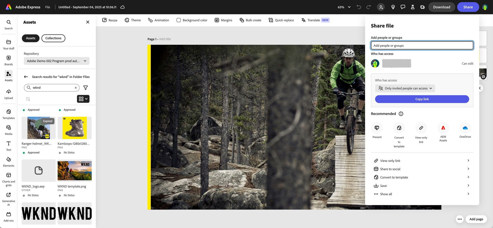

# Adobe Express과 기본 통합 {#native-integration-adobe-express}

AEM Assets는 Adobe Express에 기본적으로 통합되므로 Adobe Express 사용자 인터페이스 내에서 AEM Assets에 저장된 자산에 직접 액세스할 수 있습니다. AEM Assets에서 관리되는 콘텐츠를 Express 캔버스에 배치한 다음 AEM Assets 저장소에 새 콘텐츠 또는 편집된 콘텐츠를 저장할 수 있습니다. 통합은 다음과 같은 주요 이점을 제공합니다.

* AEM에서 새 자산을 편집하고 저장하여 콘텐츠 재사용을 개선했습니다.

* 새 에셋을 만들거나 기존 에셋의 새 버전을 만드는 데 드는 전반적인 시간과 노력이 감소했습니다.

## 사전 요구 사항 {#prerequisites}

AEM Assets 내에서 Adobe Express 및 하나 이상의 환경에 액세스할 수 있는 권한. 환경은 Assets as a Cloud Service 또는 Assets Essentials 내에 있는 저장소 중 하나일 수 있습니다.

## Adobe Express 편집기 내 AEM Assets 사용 {#use-aem-assets-in-express}

Adobe Express 편집기에서 AEM Assets을 사용하려면 다음 단계를 수행하십시오.

1. Adobe Express 웹 애플리케이션을 엽니다.

2. 새 템플릿 또는 프로젝트를 로드하거나 에셋을 만들어 새 빈 캔버스를 엽니다.

3. 클릭 **[!UICONTROL 에셋]** 왼쪽 탐색 창에서 사용할 수 있습니다. Adobe Express은 루트 수준에서 사용할 수 있는 에셋 및 폴더 목록과 함께 액세스할 수 있는 저장소 목록을 표시합니다.

4. 저장소에서 에셋을 찾아보거나 검색하여 캔버스로 드래그 앤 드롭합니다. 파일 유형, MIME 유형 및 차원과 같은 다양한 사용 가능한 필터를 사용하여 에셋을 필터링할 수 있습니다.

   >[!NOTE]
   >
   >차원으로 필터링은 비디오에 적용되지 않습니다.

   

## AEM Assets에 Adobe Express 프로젝트 저장 {#save-express-projects-in-assets}

Express 캔버스에 해당 수정 사항을 통합한 후에 AEM Assets 저장소에 저장할 수 있습니다.

1. 클릭 **[!UICONTROL 공유]** 을(를) 열려면 **[!UICONTROL 공유]** 대화 상자.

   

2. 오른쪽 창의 스토리지 섹션에서 다음을 선택합니다. **AEM Assets**. Adobe Express에 업로드 대화 상자가 표시됩니다.
3. 자산의 이름 및 형식을 지정합니다. 캔버스 내용을 PNG, JPEG, PDF, MP4, MP4+PNG 또는 MP4+JPEG 형식으로 저장할 수 있습니다. 자산에 따라 형식이 자동으로 조정됩니다.

   >[!NOTE]
   >
   >&quot;현재 페이지&quot;를 선택하면 대상 폴더에 파일이 저장됩니다. PDF 파일이 대상 폴더에 단일 파일로 저장되는 동안 &quot;모든 PDF&quot;를 선택하면 모든 비페이지 파일에 대해 대상에 새 폴더가 생성되고 여기에 저장됩니다.

4. 아래의 텍스트 영역을 클릭합니다. **대상 폴더** 위치를 선택하고 에셋을 저장합니다.

   

5. 선택 사항: 다음을 사용하여 업로드에 대한 캠페인 메타데이터를 추가할 수 있습니다. **프로젝트 또는 캠페인 이름** 필드. 기존 이름을 사용하거나 새 이름을 만들 수 있습니다. 업로드할 여러 프로젝트 또는 캠페인 이름을 정의할 수 있습니다. 이름을 등록하려면 이름을 입력하고 enter 키를 누릅니다.
업로드한 에셋에 대해 향상된 Adobe 경험을 만들 뿐만 아니라 나머지 필드에 값을 지정하는 것이 좋습니다.

6. 마찬가지로 다음에 대한 값을 정의합니다 **[!UICONTROL 키워드]** 및 **[!UICONTROL 채널]** 필드.

7. 클릭 **[!UICONTROL 업로드]** AEM Assets에 에셋을 업로드합니다.

## 제한 사항 {#limitations}

1. 가져오기 및 내보내기의 경우 지원되는 비디오 파일 유형은 MP4입니다.

2. MP4 비디오 가져오기의 경우:

   a) 지원되는 최대 파일 크기는 200MB입니다. 이 제한이 초과되면 경고 메시지가 나타납니다.
b) 지원되는 최대 해상도는 3840 X 3840픽셀입니다.
c) 배경이 투명한 비디오(알파 채널)는 지원되지 않습니다.

3. MP4 비디오 내보내기:

   a) 지원되는 최대 파일 크기는 200MB입니다. 이 제한이 초과되면 아래 그림과 같이 제안 작업이 포함된 경고 메시지가 표시됩니다.
   
