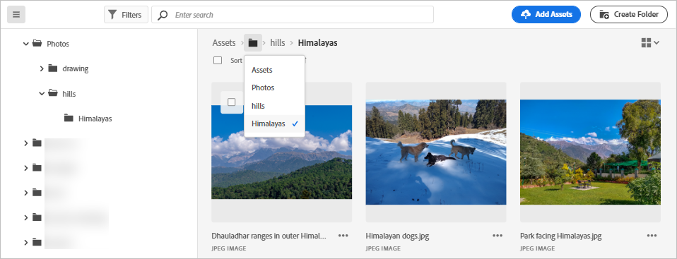

# 파일 및 폴더로 이동하여 에셋 보기 {#view-assets-and-details}

<!-- TBD: Give screenshots of all views with many assets. Zoom out to showcase how the thumbnails/tiles flow on the UI in different views. -->

<!-- TBD: The options in left sidebar may change. Shared with me and Shared by me are missing for now. Update this section as UI is updated. -->

## [!DNL Assets view] 사용자 인터페이스 이해 {#understand-interface-navigation}

[!DNL Assets view]는 직관적이고 사용하기 쉬운 사용자 인터페이스를 제공합니다. 깔끔한 인터페이스를 통해 에셋 및 관련 정보를 쉽게 찾고 기억할 수 있습니다.

[!DNL Assets view]에 로그인하면 다음 인터페이스가 표시됩니다.

![[!DNL Assets view] 사용자 인터페이스](assets/assets-view-interface.png)

    *A: 저장소를 탐색하고 몇 가지 다른 옵션에 대한 액세스를 제공하는 왼쪽 사이드바*
    *B: 왼쪽 사이드바를 표시하거나 축소하여 에셋 보기 영역 확대*
    *C: 검색 결과 필터링*
    *D: 선택한 폴더의 모든 내용 선택*
    *E: 에셋 정렬 옵션*
    *F: 검색 상자*
    *G: `Add Assets` 버튼을 사용하여 파일 업로드 또는 드래그 앤 드롭*
    *H: 새 폴더 만들기*
    *I: 다른 보기 간 전환*

<!-- TBD: Need an embedded video here with narration. It has to be hosted on MPC to be embeddable. -->

## 에셋과 폴더 검색 및 보기 {#browse-repository}

메인 사용자 인터페이스 또는 왼쪽 사이드바에서 폴더를 검색할 수 있습니다. 검색할 때 인터페이스를 사용하여 에셋 썸네일을 보고 저장소를 시각적으로 탐색하거나 에셋 세부 사항을 보고 필요한 에셋을 빠르게 찾을 수 있습니다. 왼쪽 사이드바에서 사용할 수 있는 옵션은 다음과 같습니다.

* [내 작업 영역](/help/assets/my-workspace-assets-view.md): 이제 Assets에는 Assets 사용자 인터페이스의 주요 영역과 사용자와 가장 관련성이 높은 정보에 편리하게 액세스할 수 있는 위젯을 제공하는 사용자 정의 가능한 작업 영역이 포함됩니다. 이 페이지는 작업 항목에 대한 개요 및 주요 워크플로에 대한 빠른 액세스를 제공하는 종합적인 솔루션 역할을 합니다. 이러한 옵션에 보다 편리하게 액세스하면 효율성과 콘텐츠 속도가 향상됩니다.
* [작업](/help/assets/my-workspace-assets-view.md): **내 작업** 탭 아래에서 본인에게 할당된 작업을 볼 수 있습니다. 반면 본인이 만든 작업은 **할당된 작업** 탭 아래에서 볼 수 있습니다. 또한 완료한 작업은 **완료된 작업** 탭 아래에 있습니다.
* [에셋](/help/assets/manage-organize-assets-view.md): 액세스 권한이 있는 트리 보기의 모든 폴더 목록입니다.
* **최근에 본 항목**: 최근에 미리 본 에셋 목록입니다. [!DNL Assets view] 미리 보는 에셋만 표시됩니다. 저장소 파일 또는 폴더를 탐색할 때 스크롤한 에셋은 표시되지 않습니다.
* [컬렉션](/help/assets/manage-collections-assets-view.md): 컬렉션은 Adobe Experience Manager Assets 보기 내의 에셋, 폴더 또는 기타 컬렉션 세트입니다. 컬렉션을 사용하여 사용자 간에 에셋을 공유합니다. 폴더와 달리 컬렉션에는 서로 다른 위치의 에셋이 포함될 수 있습니다. 사용자와 여러 컬렉션을 공유할 수 있습니다. 각 컬렉션에는 에셋에 대한 참조가 포함되어 있습니다. 에셋의 참조 무결성은 컬렉션에 간에 유지됩니다.

* [인사이트](/help/assets/manage-reports-assets-view.md#view-live-statistics): [!DNL Assets view]의 대시보드에서 실시간 인사이트를 볼 수 있습니다. 에셋 보기를 사용하면 인사이트 대시보드를 사용하여 에셋 보기 환경에 대한 실시간 데이터를 볼 수 있습니다. 지난 30일 동안 또는 지난 12개월 동안의 실시간 이벤트 지표를 볼 수 있습니다.
* **휴지통**: 루트 **[!UICONTROL Assets]** 폴더에서 삭제된 에셋을 나열합니다. 휴지통 폴더에서 에셋을 선택하여 원래 위치로 복원하거나 영구적으로 삭제할 수 있습니다. 키워드를 지정하거나 표준 또는 사용자 지정 필터를 적용하여 휴지통 폴더 내의 적절한 자산을 검색할 수도 있습니다. 표준 및 사용자 지정 필터 사용에 대한 자세한 내용은 [자산 보기에서 자산 검색](/help/assets/search-assets-view.md).
* **설정**: 을 사용하여 에셋 보기의 다양한 옵션을 구성할 수 있습니다 **설정**&#x200B;메타데이터 양식, 보고서 및 분류 관리 등의 데이터를 내보낼 수 있습니다.

<!-- TBD: Not sure if we want to publish these right now. CC Libs are beta as per Greg.
* **Libraries**: Access to [!DNL Adobe Creative Cloud Team] (CCT) Libraries view. This view is visible only if the user is entitled to CCT Libraries.
-->

<!-- TBD: My Work Space shows task inbox and it is not visible on AEM Cloud Demos as of now. It is the source of truth server hence not documenting My Work Space option for now.
-->

왼쪽 사이드바를 펼치거나 접고 사용 가능한 에셋 보기 영역을 늘릴 수 있습니다.

[!DNL Assets view]에서 에셋, 폴더 및 검색 결과를 네 가지 레이아웃 유형으로 볼 수 있습니다.

*  [!UICONTROL 목록 보기]
*  [!UICONTROL 격자 보기]
*  [!UICONTROL 갤러리 보기]
*  [!UICONTROL Waterfall 보기]

에셋을 찾으려면 에셋을 `Name`, `Relevancy`, `Size`, `Modified` 및 `Created`의 오름차순 또는 내림차순으로 정렬할 수 있습니다.

폴더로 이동하려면 해당 폴더의 썸네일을 더블 클릭하거나 왼쪽 사이드바에서 폴더를 선택합니다. 폴더의 세부 정보를 보려면 해당 폴더를 선택하고 상단의 도구 모음에서 세부 정보를 클릭하십시오. 계층 구조를 위아래로 탐색하려면 왼쪽 사이드바를 사용하거나 상단의 이동 경로를 사용하십시오.

*그림: 계층 구조를 탐색하려면 상단의 이동 경로 또는 왼쪽 사이드바를 사용하십시오.*

## 에셋 미리보기 {#preview-assets}

에셋을 사용, 공유 또는 다운로드하기 전에 더 자세히 볼 수 있습니다. 미리보기 기능을 사용하면 이미지뿐만 아니라 지원되는 몇 가지 에셋 유형을 볼 수 있습니다.

에셋을 미리 보려면 에셋을 선택하고 상단의 도구 모음에서 [!UICONTROL 세부 정보] ()를 클릭합니다. 에셋을 볼 수 있을 뿐만 아니라 세부 메타데이터를 보고 다른 작업을 수행할 수도 있습니다.

*A: 저장소의 현재 폴더 또는 현재 검색 결과로 돌아가기*
*B: 미리 보고 있는 파일의 이름 및 형식*
*C: 작업 할당*
*D: 에셋 다운로드*
*E: 에셋 미리보기 및 메타데이터 정보 보기*
*D: 고급 메타데이터*
*E: 키워드 및 스마트 태그*
*F: 댓글 및 주석 달기*
*G: 선택한 에셋과 관련된 작업 보기*
*H: 버전 보기 및 관리*
*I: 이미지의 렌디션 보기*
*J: 이미지 편집*
*K: 기본 메타데이터*
*L: 고급 메타데이터*
*M: 키워드 및 스마트 태그*
*N: 더 자세히 미리보기 확대/축소, 전체 화면 및 기타 옵션*
*O: 폴더로 돌아가지 않고 현재 폴더의 이전 또는 다음 에셋으로 진행*

비디오를 미리 볼 수도 있습니다.

에셋을 명시적으로 미리 보는 경우 [!DNL Assets view]는 해당 에셋을 최근에 본 에셋으로 표시합니다.

<!-- TBD: Describe the options.

Explicitly previewed assets are displayed as recently viewed assets. Give screenshot of this.
Other use cases after previewing.
-->

## 다음 단계 {#next-steps}

* 다음을 사용하여 제품 피드백 제공 [!UICONTROL 피드백] 자산 보기 사용자 인터페이스에서 사용할 수 있는 옵션

* 오른쪽 사이드바에서 사용 가능한 [!UICONTROL 이 페이지 편집], , [!UICONTROL 문제 기록] 또는 을 사용하여 설명서 피드백 제공

* [고객 지원 센터](https://experienceleague.adobe.com/?support-solution=General#support) 문의

>[!MORELIKETHIS]
>
>* [에셋의 버전 보기](/help/assets/manage-organize-assets-view.md#view-versions).
