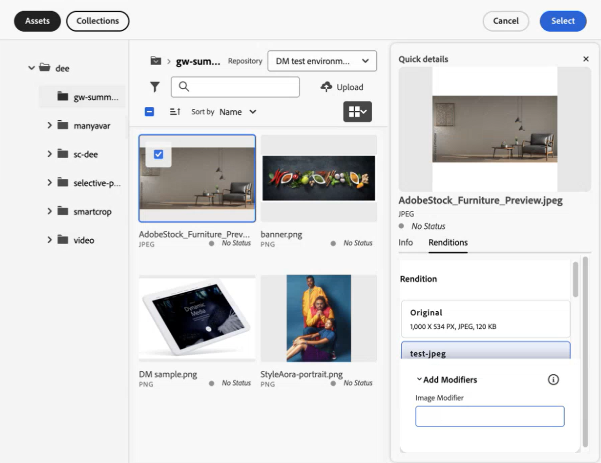
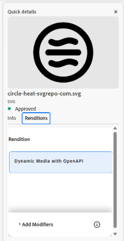

# 마이크로 프론트엔드 자산 선택기 {#Overview}

마이크로 프론트엔드 자산 선택기는 [!DNL Experience Manager Assets] 저장소와 간편하게 통합하는 사용자 인터페이스를 제공하므로 사용자는 해당 저장소에서 사용 가능한 디지털 자산을 탐색 또는 검색하고 애플리케이션 작성 경험에 사용할 수 있습니다.

자산 선택기 패키지를 사용하여 마이크로 프론트엔드 사용자 인터페이스를 애플리케이션 경험에 사용할 수 있습니다. 이렇게 하면 패키지에 대한 모든 업데이트를 자동으로 가져오고 최근 배포된 자산 선택기가 애플리케이션 내에서 자동으로 로드됩니다.


자산 선택기는 다음과 같은 많은 이점을 제공합니다.

* Vanilla JavaScript 라이브러리를 사용하여 [Adobe](/help/assets/integrate-asset-selector-adobe-app.md) 애플리케이션 또는 [Adobe 이외](/help/assets/integrate-asset-selector-non-adobe-app.md)의 애플리케이션과 쉽게 통합할 수 있습니다.
* 자산 선택기 패키지에 대한 업데이트가 애플리케이션에서 사용할 수 있는 자산 선택기에 자동으로 배포되므로 유지 관리가 간편합니다. 최신 수정 사항을 로드하기 위해 애플리케이션 내에서 업데이트를 수행하지 않아도 됩니다.
* 애플리케이션 내에서 자산 선택기 표시를 제어하는 속성을 통해 손쉽게 사용자 정의할 수 있습니다.
* 전체 텍스트 검색, 기본 제공 및 사용자 정의 필터를 통해 작성 경험 내에서 사용할 자산을 빠르게 탐색할 수 있습니다.
* IMS 조직 내에서 저장소를 전환하여 자산을 선택할 수 있습니다.
* 자산을 이름, 차원 및 크기별로 정렬하고 목록 보기, 격자 보기, 갤러리 보기 또는 워터폴 보기로 볼 수 있습니다.

<!--Perform the following tasks to integrate and use Asset Selector with your [!DNL Experience Manager Assets] repository:

1. [Install Asset Selector](#installation)
2. [Integrate Asset Selector using Vanilla JS](#integration-using-vanilla-js)
3. [Use Asset Selector](#using-asset-selector)
-->

<!--
## Setting up Asset Selector {#asset-selector-setup}


-->

## 사전 요구 사항{#prereqs}

다음 커뮤니케이션 방법을 보장해야 합니다.

* 호스트 애플리케이션이 HTTPS에서 실행 중입니다.
* 해당 애플리케이션을 `localhost`에서 실행할 수 없습니다. 로컬 컴퓨터에서 자산 선택기를 통합하려면 `[https://<your_campany>.localhost.com:<port_number>]` 등의 사용자 정의 도메인을 생성하고 이 사용자 정의 도메인을 `redirectUrl list`에 추가해야 합니다.
* clientID를 구성하여 각각의 `imsClientId`로 AEM Cloud Service 환경 변수에 추가할 수 있습니다.
<!--* You can configure and add `ADOBE_PROVIDED_CLIENT_ID` into the AEM Cloud Service environment variable with the respective `imsClientId`.
-->
* IMS 범위 목록은 환경 구성에서 정의되어야 합니다.
* 애플리케이션의 URL이 IMS 클라이언트가 허용하는 리디렉션 URL 목록에 있습니다.
* IMS 로그인 흐름은 웹 브라우저의 팝업을 사용하여 구성 및 렌더링됩니다. 따라서 타깃 브라우저에서 팝업을 활성화하거나 허용해야 합니다.

자산 선택기의 IMS 인증 워크플로가 필요한 경우 위의 사전 요구 사항을 사용합니다. 또는 이미 IMS 워크플로로 인증된 경우 대신 IMS 정보를 추가할 수 있습니다.

**더 보기**

* [자산 선택기와 Adobe 앱 통합](/help/assets/integrate-asset-selector-adobe-app.md)
* [자산 선택기와 Adobe 이외의 앱 통합](/help/assets/integrate-asset-selector-non-adobe-app.md)
* [자산 선택기 Dynamic Media 오픈 API 통합](/help/assets/integrate-asset-selector-dynamic-media-open-api.md)


>[!IMPORTANT]
>
> 이 저장소는 자산 선택기를 통합하는 데 사용할 수 있는 API와 사용 예를 설명하는 추가 문서로 사용할 수 있습니다. 자산 선택기를 설치하거나 사용하기 전에 조직에서 Experience Manager Assets as a Cloud Service 프로필의 일부로 자산 선택기에 대한 액세스 권한을 프로비저닝했는지 확인합니다. 프로비저닝되지 않은 경우 이러한 구성 요소를 통합하거나 사용할 수 없습니다. 프로비저닝을 요청하려면 프로그램 관리자가 Admin Console에서 P2로 표시된 지원 티켓을 올리고 다음 정보를 포함해야 합니다.
>
>* 통합 애플리케이션이 호스팅되는 도메인 이름.
>* 프로비저닝 후 조직에 자산 선택기 구성에 필수적인 요청 환경에 해당하는 `imsClientId`, `imsScope` 및 `redirectUrl`이 제공됩니다. 이러한 유효한 속성이 없으면 설치 단계를 실행할 수 없습니다.

## 설치 {#installation}

자산 선택기는 ESM CDN(예: [esm.sh](https://esm.sh/)/[Skypack](https://www.skypack.dev/)) 및 [UMD](https://github.com/umdjs/umd) 버전을 통해 사용할 수 있습니다.

**UMD 버전**&#x200B;을 사용하는 브라우저의 경우(권장됨):

```
<script src="https://experience.adobe.com/solutions/CQ-assets-selectors/static-assets/resources/assets-selectors.js"></script>

<script>
  const { renderAssetSelector } = PureJSSelectors;
</script>
```

**ESM CDN 버전**&#x200B;을 사용하며 `import maps`가 지원되는 브라우저의 경우:

```
<script type="module">
  import { AssetSelector } from 'https://experience.adobe.com/solutions/CQ-assets-selectors/static-assets/resources/@assets/selectors/index.js'
</script>
```

**ESM CDN 버전**&#x200B;을 사용하는 Deno/Webpack Module Federation의 경우:

```
import { AssetSelector } from 'https://experience.adobe.com/solutions/CQ-assets-selectors/static-assets/resources/@assets/selectors/index.js'
```

## 자산 선택기 사용하기 {#using-asset-selector}

자산 선택기를 설정하고 [!DNL Adobe Experience Manager] as a [!DNL Cloud Service]와 자산 선택기를 사용하도록 인증되면 자산을 선택하거나 다른 다양한 작업을 수행하여 저장소 내에 있는 자산을 검색할 수 있습니다.


* **A**: [패널 숨기기/표시](#hide-show-panel)
* **B**: [저장소 전환기](#repository-switcher)
* **C**: [자산](#repository)
* **D**: [필터](#filters)
* **E**: [검색 창](#search-bar)
* **F**: [정렬](#sorting)
* **G**: [오름차순 또는 내림차순으로 정렬](#sorting)
* **H**: [보기](#types-of-view)

### 패널 숨기기/표시 {#hide-show-panel}

왼쪽 탐색 영역에서 폴더를 숨기려면 **[!UICONTROL 폴더 숨기기]** 아이콘을 클릭합니다. 변경 내용을 실행 취소하려면 **[!UICONTROL 폴더 숨기기]** 아이콘을 다시 클릭합니다.

### 저장소 전환기 {#repository-switcher}

자산 선택기를 사용하면 자산 선택을 위해 저장소를 전환할 수도 있습니다. 왼쪽 패널에 있는 드롭다운에서 원하는 저장소를 선택할 수 있습니다. 드롭다운 목록에서 사용할 수 있는 저장소 옵션은 `index.html` 파일에 정의된 `repositoryId` 속성을 기반으로 하며, 이 속성은 로그인한 사용자가 액세스하는 선택된 IMS 조직의 환경을 기반으로 합니다. 소비자는 기본 `repositoryID`를 전달할 수 있으며 이 경우 자산 선택기는 저장소 전환기 렌더링을 중지하고 주어진 저장소의 자산만 렌더링합니다.

### 자산 저장소

작업을 수행하는 데 사용할 수 있는 자산 폴더 모음입니다.

### 기본 제공 필터 {#filters}

자산 선택기에는 검색 결과를 세분화할 수 있는 기본 필터 옵션도 제공됩니다. 사용 가능한 필터는 다음과 같습니다.

* **[!UICONTROL 상태]:** `all`, `approved`, `rejected` 또는 `no status` 중 자산의 현재 상태를 포함합니다.
* **[!UICONTROL 파일 유형]:** `folder`, `file`, `images`, `documents` 또는 `video`을 포함합니다.
* **[!UICONTROL 만료 상태]:** 만기 기간을 기준으로 자산을 나타냅니다. `[!UICONTROL Expired]` 확인란을 선택하여 만료된 자산을 필터링하거나 만료 기간을 기준으로 자산을 표시하도록 자산의 `[!UICONTROL Expiration Duration]`을 설정할 수 있습니다. 자산이 이미 만료되었거나 곧 만료될 예정인 경우 배지에 해당 내용이 표시됩니다. 또한 만료된 자산의 사용(또는 드래그 앤 드롭)을 허용할지 여부를 제어할 수 있습니다. [만료된 자산 사용자 정의](/help/assets/asset-selector-customization.md#customize-expired-assets)에 대한 자세한 내용을 참조하십시오. 기본적으로 30일 이내에 만료되는 자산의 경우 **곧 만료됨** 배지가 표시됩니다. 그러나 `expirationDate` 속성을 사용하여 만료를 구성할 수 있습니다.

  >[!TIP]
  >
  > 향후 만기일을 기준으로 자산을 보거나 필터링하려면 `[!UICONTROL Expiration Duration]` 필드의 미래 날짜 범위를 입력합니다. 자산에 **곧 만료됨** 배지가 표시됩니다.

* **[!UICONTROL MIME 유형]:** `JPG`, `GIF`, `PPTX`, `PNG`, `MP4`, `DOCX`, `TIFF`, `PDF`, `XLSX`를 포함합니다.
* **[!UICONTROL 이미지 폭]:** 이미지 최소/최대 폭, 최소/최대 높이를 포함합니다.

  

### 사용자 정의 검색

전체 텍스트 검색 외에도 자산 선택기를 사용하면 사용자 정의 검색을 사용하여 파일 내의 자산을 검색할 수 있습니다. 모달 보기 및 레일 보기 모드 모두에서 사용자 정의 검색 필터를 사용할 수 있습니다.


자주 검색하는 필드를 저장하고 나중에 사용할 수 있도록 기본 검색 필터를 생성할 수도 있습니다. 자산에 대한 사용자 정의 검색을 만들기 위해 `filterSchema` 속성을 사용할 수 있습니다.

### 검색 창 {#search-bar}

자산 선택기를 사용하면 선택한 저장소 내에서 자산의 전체 텍스트 검색을 수행할 수 있습니다. 예를 들어 검색 창에 `wave` 키워드를 입력하면 메타데이터 속성에 언급된 것 중 `wave` 키워드가 있는 모든 자산이 표시됩니다.

### 정렬 {#sorting}

자산 선택기에서 자산의 이름, 차원 또는 크기별로 자산을 정렬할 수 있습니다. 자산을 오름차순 또는 내림차순으로 정렬할 수도 있습니다.

### 보기 유형 {#types-of-view}

자산 선택기를 사용하면 네 가지 다른 보기에서 자산을 볼 수 있습니다.

*  [!UICONTROL **목록 보기**] 목록 보기에는 스크롤 가능한 파일과 폴더가 단일 열에 표시됩니다.
*  [!UICONTROL **격자 보기**] 격자 보기에는 스크롤 가능한 파일과 폴더가 행과 열의 격자로 표시됩니다.
*  [!UICONTROL **갤러리 보기**] 갤러리 보기에는 파일 또는 폴더가 중앙이 잠긴 가로 목록으로 표시됩니다.
*  [!UICONTROL **워터폴** 보기] 워터폴 보기에는 파일 또는 폴더가 Bridge 형태로 표시됩니다.

### 자산 세부 정보 및 메타데이터 {#asset-details-and-metadata}

자산 세부 정보 페이지는 특정 자산에 대한 포괄적인 보기를 제공하므로 모든 주요 정보를 한 곳에서 통합적으로 확인할 수 있습니다. 여기에는 이름, 파일 형식, 상태 및 간략한 설명이 포함된 개요와 함께 시각적 식별을 위한 미리보기 또는 썸네일이 포함됩니다. 생성 날짜, 작성자, 크기, 색상 구성표 등 자산의 메타데이터도 포함됩니다. 이들 속성은 자산을 효율적으로 검색하고, 필터링하고, 분류하는 데 도움이 됩니다. 자산 세부 정보 패널은 자산 선택기의 레일 보기와 모달 보기 모두에서 사용할 수 있습니다. 레일 보기에서는 자산을 반환하려면 `onDrop` 속성을 활성화하고 구성해야 합니다. 또는 모달 보기에서는 `handleSelection` 속성이 자산을 반환합니다. [자산 선택기 속성](asset-selector-properties.md)을 참조하십시오.

자산과 메타데이터의 세부 정보를 보려면 아래 단계를 실행합니다.

1. 자산 선택기 MFE를 열고 자산으로 이동합니다.
1. 자산 위에 마우스를 가져다 대로 을 클릭합니다.
1. **[!UICONTROL 정보]** 탭으로 이동하여 자산 세부 정보를 확인합니다. <!--Otherwise, go to the **[Renditions](#asset-renditions)** tab to see renditions of an asset.-->

자산의 세부 정보 보기 패널을 사용자 정의하려면 [모달 보기에서 정보 사용자 정의](asset-selector-customization.md#customize-info-in-modal-view)를 참조하십시오.


<!--

#### Asset renditions {#asset-renditions}

Renditions in Adobe Experience Manager (AEM) are customized versions of digital assets, such as images, designed for different devices and platforms to ensure optimal performance. See [Dynamic Media renditions](/help/assets/renditions.md#dynamic-media-renditions).

>[!NOTE]
>
>* Prerequisites to [Dynamic Media with OpenAPI Capabilities renditions](/help/assets/renditions.md##prereqs-dm-with-openapi-renditions).
>* Renditions tab in the details panel of an asset shows up if `featureSet`  props is set to `['detail-panel', 'dm-renditions']`.
>* An asset should be approved to see Dynamic Media with OpenAPI renditions and/or ensure processing/publishing of the asset to Dynamic Media is complete (for images only).



For assets that are approved and have renditions enabled, you see the **Dynamic Media with Open API** badge. 



Additionally, see [Asset Selector user interface for Dynamic Media with OpenAPI capabilities](integrate-asset-selector-dynamic-media-open-api.md##interface-dynamic-media-open-api).

##### Add modifiers {#modifiers-dm-media-renditions}

Beyond the common image settings available in the UI, Dynamic Media supports numerous advanced image modifications that you can specify in the Image Modifiers field. See [Defining image preset options with Image Modifiers](https://experienceleague.adobe.com/en/docs/experience-manager-65/content/assets/dynamic/managing-image-presets#defining-image-preset-options-with-image-modifiers).

-->

## 주요 기능에 대해 자세히 알아보기 {#key-capabilities-asset-selector}

<table>
<tr>
    <td>
        <br/>
        <a href="integrate-asset-selector.md">자산 선택기 통합</a>
        <p>
        <em>자산 선택기와 다양한 애플리케이션을 통합하는 다양한 기능에 대해 알아봅니다.
        </p>
     </td>
    <td>
        <br/>
        <a href="integrate-asset-selector-adobe-app.md">자산 선택기와 Adobe 애플리케이션 통합</a>
        <p>
        <em>자산 선택기와 다양한 Adobe 애플리케이션을 통합하는 방법을 알아봅니다.</em>
        </p>
    </td>
    <td>
        <br/>
        <a href="integrate-asset-selector-non-adobe-app.md">자산 선택기와 서드파티 애플리케이션 통합</a>
        <p>
        <em>자산 선택기와 Adobe 이외의 애플리케이션을 통합하는 기능을 살펴봅니다.</em>
        </p>
    </td>   
    <td>
        <br/>
        <a href="integrate-asset-selector-dynamic-media-open-api.md">자산 선택기와 Dynamic Media 오픈 API 통합</a>
        <p>
        <em>자산 선택기와 Dynamic Media 오픈 API를 통합하는 방법을 알아봅니다.</em>
        </p>
     </td>
     <td>
        <br/>
        <a href="asset-selector-properties.md">자산 선택기 속성</a>
        <p>
        <em>실용적인 방식으로 속성의 사용을 이해합니다. </em>
        </p>
    </td>
</tr>
<tr>
    <td>
        <br/>
        <a href="asset-selector-examples.md">자산 선택기 예시</a>
        <p>
        <em>필터, 자산 선택, 만료된 자산 등 자산 선택기의 다양한 구성 요소를 사용자 정의하는 기본 사항을 알아봅니다. </em>
        </p>
    </td>
    <td>
        <br/>
        <a href="asset-selector-customization.md">자산 선택기 사용자 정의</a>
        <p>
        <em>유용성에 따라 자산 선택기의 다양한 구성 요소를 구성하고 사용자 정의합니다. </em>
        </p>
    </td>
    <td>
        <br/>
        <a href="asset-selector-upload.md">자산 선택기 업로드</a>
        <p>
        <em>로컬 또는 서드파티 파일 시스템에서 자산 선택기에 파일이나 폴더를 업로드하는 방법을 알아봅니다. </em>
        </p>
    </td>
     <td>
        <br/>
        <a href="asset-selector-collections.md">자산 선택기 컬렉션</a>
        <p>
        <em>Experience Manager 저장소를 사용하여 자산 선택기 내에서 컬렉션을 사용하는 방법을 알아봅니다. </em>
        </p>
    </td>
    <td>
    </td>
</tr>
</table>

>[!MORELIKETHIS]
>
>* [자산 선택기 사용자 정의](/help/assets/asset-selector-customization.md)
>* [자산 선택기와 다양한 애플리케이션 통합](/help/assets/integrate-asset-selector.md)
>* [자산 선택기 속성](/help/assets/asset-selector-properties.md)
>* [자산 선택기와 OpenAPI 기능 포함 Dynamic Media 통합](/help/assets/integrate-asset-selector-dynamic-media-open-api.md)
>* [AEM Assets 통합을 통해 제공되는 상거래용 제품 비주얼](https://experienceleague.adobe.com/ko/docs/commerce/product-visuals/overview)
