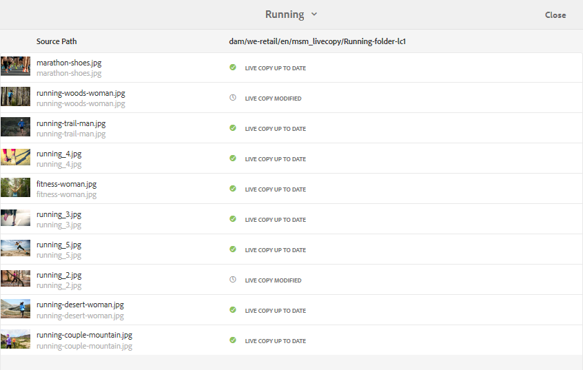
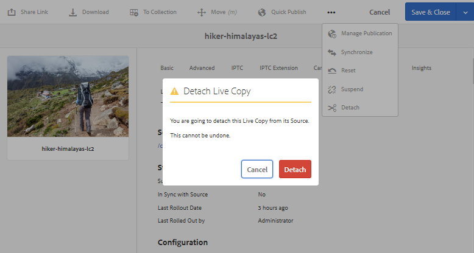

# MSM을 사용하여 자산 재사용 [!DNL Assets] {#reuse-assets-using-msm-for-assets}

의 MSM(다중 사이트 관리자) 기능 [!DNL Adobe Experience Manager] 한 번 작성되고 여러 웹 위치에서 재사용되는 컨텐츠를 사용자가 재사용할 수 있도록 합니다. MSM이라는 이름으로 디지털 자산에 대해 동일한 기능을 사용할 수 있습니다 [!DNL Assets]. 에 MSM 사용 [!DNL Assets]를 채울 수 있습니다.

* 자산을 한 번 만든 다음 이러한 자산의 사본을 만들어 사이트의 다른 영역에서 재사용할 수 있습니다.
* 동기화에 여러 사본을 유지하고 원본 기본 복사본을 한 번 업데이트하여 변경 사항을 하위 복사본에 푸시합니다.
* 상위 자산과 하위 자산 간의 연결을 일시적으로 또는 영구적으로 일시 중단하여 로컬 변경을 수행합니다.

## MSM의 이점 및 개념 이해 {#concepts}

### 작동 방법 및 이점 {#how-it-works-and-the-benefits}

여러 웹 위치에서 동일한 컨텐츠(텍스트 및 자산)를 재사용하는 사용 시나리오를 이해하려면 다음을 참조하십시오 [가능한 MSM 시나리오](/help/sites-cloud/administering/msm/overview.md). [!DNL Experience Manager] 는 LC(Live Copy)라고 하는 원래 자산과 연결된 사본 사이의 링크를 유지합니다. 유지 관리되는 링크를 사용하면 중앙 집중식 변경 사항을 여러 Live Copy에 푸시할 수 있습니다. 따라서 중복 복제본 관리 제한 사항을 그대로 유지하면서 더욱 신속하게 업데이트할 수 있습니다. 변경 사항의 전달은 오류가 없고 중앙 집중화입니다. 기능을 사용하면 선택한 Live Copy로 제한되는 업데이트를 수행할 수 있습니다. 사용자는 상속이 중단되는 연결을 분리하고, 다음에 기본 복사본을 업데이트하고 변경 사항을 롤아웃할 때 덮어쓰지 않는 로컬 편집 작업을 수행할 수 있습니다. 몇 개의 선택한 메타데이터 필드나 전체 자산에 대해 분리를 수행할 수 있습니다. 이를 통해 원래 기본 복사본에서 상속된 자산을 로컬로 업데이트할 수 있습니다.

MSM은 소스 자산과 Live Copy 간의 라이브 관계를 유지하여 다음과 같습니다.

* 소스 자산 변경 사항은 Live Copy에도 적용(롤아웃)되며, Live Copy는 소스와 동기화됩니다.
* 라이브 관계를 일시 중단하거나 일부 제한된 필드에 대한 상속을 제거하여 Live Copy를 업데이트할 수 있습니다. 소스 수정 사항은 더 이상 Live Copy에 적용되지 않습니다.

### MSM 용어집 [!DNL Assets] 약관 {#glossary}

**소스:** 원래 자산 또는 폴더입니다. Live Copy가 파생되는 기본 복사본.

**Live Copy:** 소스와 동기화 중인 소스 자산/폴더의 사본. Live Copy는 추가적인 Live Copy의 소스가 될 수 있습니다. LC를 만드는 방법을 참조하십시오.

**상속:** Live Copy 자산/폴더와 시스템이 업데이트를 보낼 위치를 기억하는 데 사용하는 소스 간의 링크/참조. 상속은 메타데이터 필드의 세부 수준에 있습니다. 소스와 라이브 카피 간의 라이브 관계를 유지하면서 선택적 메타데이터 필드에 대한 상속을 제거할 수 있습니다.

**롤아웃:** Live Copy로 소스 다운스트림에 수행된 수정 사항을 푸시하는 작업입니다. 롤아웃 작업을 사용하여 한 번에 하나 이상의 Live Copy를 업데이트할 수 있습니다. 롤아웃을 참조하십시오.

**롤아웃 구성:** 동기화되는 속성, 방법 및 시기를 결정하는 규칙입니다. 이러한 구성은 Live Copy를 만들 때 적용됩니다. 나중에 편집할 수 있습니다. 하위 자산이 상위 자산에서 롤아웃 구성을 상속할 수 있습니다. MSM의 경우 [!DNL Assets]를 채울 때는 표준 롤아웃 구성만 사용합니다. MSM에 대해 다른 롤아웃 구성을 사용할 수 없습니다 [!DNL Assets].

**동기화:** 롤아웃 외에, 소스에서 Live Copy로 업데이트를 보내어 소스와 Live Copy 간의 패리티를 제공하는 또 다른 작업입니다. 특정 Live Copy에 대한 동기화가 시작되고 작업이 소스에서 변경 사항을 가져옵니다. 이 작업을 사용하면 Live Copy 중 하나만 업데이트할 수 있습니다. 동기화 작업을 참조하십시오.

**일시 중단:** Live Copy와 소스 자산/폴더 간의 라이브 관계를 일시적으로 제거합니다. 관계를 재개할 수 있습니다. 일시 중단 작업을 참조하십시오.

**다시 시작:** Live Copy가 소스에서 업데이트를 다시 받기 시작하도록 Live Relationship을 다시 시작합니다. 작업 다시 시작 을 참조하십시오.

**재설정:** 재설정 작업을 수행하면 로컬 변경 내용을 덮어써서 Live Copy를 다시 소스의 복제본으로 만듭니다. 또한 상속 취소를 제거하고 모든 메타데이터 필드에 대한 상속을 재설정합니다. 나중에 로컬 수정 작업을 수행하려면 특정 필드의 상속을 다시 취소해야 합니다. LC에 대한 로컬 수정 사항 을 참조하십시오.

**분리:** Live Copy 자산/폴더의 Live Relationship을 제거 할 수 없습니다. 작업을 분리하면 Live Copy가 소스에서 업데이트를 받지 못하고 Live Copy가 되지 않습니다. 관계 제거 를 참조하십시오.

## 자산의 Live Copy 만들기 {#create-livecopy}

하나 이상의 소스 자산 또는 폴더에서 Live Copy를 생성하려면 다음 중 하나를 수행합니다.

* 방법 1: 소스 자산을 선택하고 을(를) 클릭합니다 **[!UICONTROL 만들기]** > **[!UICONTROL Live Copy]** 도구 모음 상단
* 방법 2: in [!DNL Experience Manager] 사용자 인터페이스, **[!UICONTROL 만들기]** > **[!UICONTROL Live Copy]** 인터페이스의 오른쪽 상단 모서리에서 을(를) 클릭합니다.

자산 또는 폴더의 Live Copy를 한 번에 하나씩 만들 수 있습니다. 자산 또는 Live Copy 자체인 폴더에서 파생된 Live Copy를 만들 수 있습니다. 컨텐츠 조각(CF)은 사용 사례에 대해 지원되지 않습니다. Live Copy를 만들려고 하면 CF가 관계 없이 그대로 복사됩니다. 복사된 CF는 시간 내에 스냅샷이며 원래 CF가 업데이트될 때 업데이트되지 않습니다.

첫 번째 방법을 사용하여 Live Copy를 만들려면 다음 단계를 수행합니다.

1. 소스 자산 또는 폴더를 선택합니다. 도구 모음에서 **[!UICONTROL 만들기]** > **[!UICONTROL Live Copy]**.

   ![에서 Live Copy 만들기 [!DNL Experience Manager] 인터페이스](assets/create_lc1.png)

   *그림: 에서 Live Copy 만들기 [!DNL Experience Manager] 인터페이스.*

1. 대상 폴더를 선택합니다. **[!UICONTROL 다음]**&#x200B;을 클릭합니다.
1. 제목과 이름을 입력합니다. 자산에 자식이 없습니다. 폴더의 Live Copy를 만들 때 하위 항목을 포함하거나 제외하도록 선택할 수 있습니다.
1. 롤아웃 구성을 선택합니다. **[!UICONTROL 만들기]**&#x200B;를 클릭합니다.

두 번째 방법을 사용하여 Live Copy를 만들려면 다음 단계를 수행합니다.

1. in [!DNL Experience Manager] 인터페이스, 오른쪽 상단 모서리에서 **[!UICONTROL 만들기]** > **[!UICONTROL Live Copy]**.

   ![에서 Live Copy 만들기 [!DNL Experience Manager] 인터페이스](assets/create_lc2.png)

   *그림: 에서 Live Copy 만들기 [!DNL Experience Manager] 인터페이스.*

1. 소스 자산 또는 폴더를 선택합니다. **[!UICONTROL 다음]**&#x200B;을 클릭합니다.
1. 대상 폴더를 선택합니다. **[!UICONTROL 다음]**&#x200B;을 클릭합니다.
1. 제목과 이름을 입력합니다. 자산에 자식이 없습니다. 폴더의 Live Copy를 만들 때 하위 항목을 포함하거나 제외하도록 선택할 수 있습니다.
1. 롤아웃 구성을 선택합니다. **[!UICONTROL 만들기]**&#x200B;를 클릭합니다.

>[!NOTE]
>
>소스 또는 Live Copy가 이동되면 관계가 유지됩니다. Live Copy가 삭제되면 관계가 제거됩니다.

## 소스 및 Live Copy의 다양한 속성 및 상태 보기 {#properties}

관계, 동기화, 롤아웃 등과 같은 Live Copy의 정보 및 MSM 관련 상태를 [!DNL Experience Manager] 사용자 인터페이스.

자산 및 폴더에 대해 다음 두 가지 방법이 작동합니다.

* Live Copy 자산을 선택하고 해당 속성 페이지에서 정보를 찾습니다.
* 소스 폴더를 선택하고 다음 위치에서 각 Live Copy의 세부 정보를 찾습니다. [!UICONTROL Live Copy 콘솔].

>[!TIP]
>
>몇 개의 개별 Live Copy의 상태를 확인하려면 첫 번째 메서드를 사용하여 를 확인합니다 **[!UICONTROL 속성]** 페이지. 많은 Live Copy의 상태를 확인하려면 두 번째 메서드를 사용하여 를 확인합니다 **[!UICONTROL 관계 상태]** 페이지.

### Live Copy의 정보 및 상태 {#status-lc-asset}

Live Copy 자산 또는 폴더의 정보 및 상태를 확인하려면 다음 단계를 수행합니다.

1. Live Copy 자산 또는 폴더를 선택합니다. 클릭 **[!UICONTROL 속성]** 를 클릭합니다. 또는 키보드 단축키를 사용합니다 `p`.
1. 클릭 **[!UICONTROL Live Copy]**. 소스의 경로, 일시 중단 상태, 동기화 상태, 마지막 롤아웃 날짜 및 마지막 롤아웃을 수행한 사용자를 확인할 수 있습니다.

   

   *그림: Live Copy 정보 및 상태.*

1. 하위 자산이 Live Copy 구성을 빌리는 경우 활성화하거나 비활성화할 수 있습니다.

1. Live Copy에 대한 옵션을 선택하여 상위 항목에서 롤아웃 구성을 상속하거나 구성을 변경할 수 있습니다.

### 폴더의 모든 Live Copy에 대한 정보 및 상태 {#status-lc-folder}

[!DNL Experience Manager] 소스 폴더의 모든 라이브 카피의 동상을 확인하는 콘솔을 제공합니다. 이 콘솔에는 모든 하위 자산의 상태가 표시됩니다.

1. 소스 폴더를 선택합니다. 클릭 **[!UICONTROL 속성]** 를 클릭합니다. 또는 키보드 단축키를 사용합니다 `p`.
1. Click **[!UICONTROL Live Copy Source]**. To open the console, click **[!UICONTROL Live Copy Overview]**. This dashboard provides a top-level status of all the child assets.

   

   *그림: 의 Live Copy 상태 보기 [!UICONTROL Live Copy 콘솔] 소스.*

1. To view the detailed information about each asset in the live copy folder, select an asset and click **[!UICONTROL Relationship Status]** from the toolbar.

   

   폴더에 있는 Live Copy 하위 자산의 세부 정보 및 상태

>[!TIP]
>
>너무 많이 탐색하지 않아도 다른 폴더의 Live Copy 상태를 빠르게 볼 수 있습니다. 폴더를 **[!UICONTROL Live Copy 개요]** 인터페이스.

### 소스에 대한 참조 레일의 빠른 작업 {#ref-rail-source}

소스 자산 또는 폴더의 경우 다음 정보를 확인하고 참조 레일에서 바로 다음 작업을 수행할 수 있습니다.

* Live Copy 경로를 참조하십시오.
* 에 특정 Live Copy를 열거나 표시합니다 [!DNL Experience Manager] 사용자 인터페이스.
* 업데이트를 특정 Live Copy에 동기화합니다.
* 특정 Live Copy에 대한 관계를 일시 중단하거나 롤아웃 구성을 변경합니다.
* Live Copy 개요 콘솔에 액세스합니다.

소스 자산 또는 폴더를 선택하고 왼쪽 레일을 연 다음 를 클릭합니다 **[!UICONTROL 참조]**. Alternatively, select an asset or folder and use the keyboard shortcut `Alt + 4`.

*그림: 선택한 소스의 참조 레일에서 사용할 수 있는 작업 및 정보.*

특정 Live Copy에 대해 **[!UICONTROL Live Copy 편집]** 관계를 일시 중단하거나 롤아웃 구성을 변경하려면 다음과 같이 하십시오.

*그림: 특정 Live Copy의 관계를 일시 중단하거나 롤아웃 구성을 변경합니다.*

### Live Copy에 대한 참조 레일의 빠른 작업 {#ref-rail-lc}

Live Copy 자산 또는 폴더의 경우 다음 정보를 확인하고 참조 레일에서 바로 다음 작업을 수행할 수 있습니다.

* 소스 경로를 참조하십시오.
* 에 특정 Live Copy를 열거나 표시합니다 [!DNL Experience Manager] 사용자 인터페이스.
* 업데이트를 롤아웃합니다.

Select a live copy asset or folder, open the left rail, and click **[!UICONTROL References]**. Alternatively, select an asset or folder and use the keyboard shortcut `Alt + 4`.

*그림: 선택한 Live Copy에 대한 참조 레일에서 사용할 수 있는 작업.*

## 소스에서 Live Copy로 수정 사항 전달 {#rollout-sync}

소스가 수정되면 동기화 작업 또는 롤아웃 작업을 사용하여 변경 사항을 Live Copy에 전파할 수 있습니다. 두 작업 간의 차이점을 이해하려면 [용어 설명](#glossary).

### 롤아웃 작업 {#rollout}

소스 자산에서 롤아웃 작업을 시작하고 전체 또는 일부 선택 Live Copy를 업데이트할 수 있습니다.

1. Live Copy 자산 또는 폴더를 선택합니다. 클릭 **[!UICONTROL 속성]** 를 클릭합니다. 또는 키보드 단축키를 사용합니다 `p`.
1. Click **[!UICONTROL Live Copy Source]**. 클릭 **[!UICONTROL 롤아웃]** 를 클릭합니다.
1. 업데이트할 Live Copy를 선택합니다. 클릭 **[!UICONTROL 롤아웃]**.
1. 하위 자산에 대한 업데이트를 롤아웃하려면 다음을 선택합니다 **[!UICONTROL 롤아웃 소스 및 모든 하위]**.

   

   *그림: 소스 수정 사항을 일부 또는 모든 Live Copy에 롤아웃합니다.*

>[!NOTE]
>
>소스 자산에서 수정한 사항은 직접 관련된 Live Copy에만 롤아웃됩니다. Live Copy가 다른 Live Copy에서 파생된 경우 수정 사항이 파생된 Live Copy로 롤아웃되지 않습니다.

또는 특정 Live Copy를 선택한 후 참조 레일에서 롤아웃 작업을 시작할 수 있습니다. 자세한 내용은 [Live Copy에 대한 참조 레일의 빠른 작업](#ref-rail-lc). 이 롤아웃 방법에서는 선택한 Live Copy 및 선택적으로 해당 하위 만 업데이트됩니다.

*그림: 소스 수정 사항을 선택한 Live Copy에 롤아웃합니다.*

### 동기화 작업 기본 정보 {#about-sync}

동기화 작업은 소스 수정 사항만 선택한 Live Copy로 가져옵니다. 동기화 작업은 상속을 취소한 후 수행된 로컬 수정 사항을 준수하며 유지 관리합니다. 로컬 수정 내용을 덮어쓰지 않고 취소된 상속이 다시 설정되지 않습니다. 세 가지 방법으로 동기화 작업을 시작할 수 있습니다.

| 위치 [!DNL Experience Manager] 인터페이스 | 사용 시기 및 이유 | 사용 방법 |
|---|---|---|
| [!UICONTROL 참조] 레일 | 소스를 이미 선택한 경우 신속하게 동기화합니다. | 자세한 내용은 [소스에 대한 참조 레일의 빠른 작업](#ref-rail-source) |
| 도구 모음 [!UICONTROL 속성] 페이지 | Live Copy 속성이 이미 열려 있으면 동기화를 시작합니다. | 자세한 내용은 [Live Copy 동기화](#sync-lc) |
| [!UICONTROL Live Copy 개요] 콘솔 | 소스 폴더를 선택하거나 선택할 때 여러 자산(반드시 모든 것은 아님)을 신속하게 동기화 [!UICONTROL Live Copy 개요] 콘솔이 이미 열려 있습니다. 한 번에 한 자산에 대해 동기화 작업이 시작되지만 한 번에 여러 자산에 대해 동기화하는 것이 더 빠릅니다. | 자세한 내용은 [Live Copy 폴더의 많은 자산에 대한 작업](#bulk-actions) |

### Live Copy 동기화 {#sync-lc}

To start a sync action, open **[!UICONTROL Properties]** page of a live copy, click **[!UICONTROL Live Copy]** and click the desired action from the toolbar.

To see the statuses and information related to a synchronize action, see [Information and status of a live copy](#status-lc-asset) and [Information and statuses of all live copies of a folder](#status-lc-folder).

*그림: 동기화 작업은 소스에 대한 변경 사항을 가져옵니다.*

>[!NOTE]
>
>관계가 일시 중단된 경우 도구 모음에서 동기화 작업을 사용할 수 없습니다. 동기화 작업은 참조 레일에서 사용할 수 있지만 성공적인 롤아웃 시에도 수정 사항은 전파되지 않습니다.

## 관계 일시 중단 및 다시 시작 {#suspend-resume}

Live Copy가 소스 자산 또는 폴더의 수정 사항을 받지 않도록 일시적으로 관계를 일시 중단할 수 있습니다. Live Copy에서 소스로부터 수정 사항을 수신하기 위해 관계를 다시 시작할 수도 있습니다.

To suspend or resume, open **[!UICONTROL Properties]** page of a live copy, click **[!UICONTROL Live Copy]** and click the desired action from the toolbar.

Alternatively, you can quickly suspend or resume relationships of multiple assets in a live copy folder from the **[!UICONTROL Live Copy Overview]** console. See [Take actions on many assets in live copy folders](#bulk-actions).

## Live Copy에 로컬 수정 {#local-mods}

Live Copy는 생성될 때 원본 소스의 복제본입니다. Live Copy의 메타데이터 값은 소스에서 상속됩니다. 메타데이터 필드는 소스 자산의 각 필드와 함께 상속을 개별적으로 유지 관리합니다.

However, you have the flexibility to make local modifications to a live copy to change a few select properties. To make local modifications, cancel the inheritance of the desired property. When inheritance of one or more metadata fields is canceled, the live relationship of the asset and the inheritance of the other metadata fields is retained. Any synchronization or rollout does not overwrite the local modifications. 이렇게 하려면 를 엽니다. **[!UICONTROL 속성]** live copy 자산의 페이지에서 **[!UICONTROL 상속 취소]** 메타데이터 필드 옆에 있는 옵션입니다.

모든 로컬 수정 사항을 실행 취소하고 자산을 소스의 상태로 되돌릴 수 있습니다. 재설정 작업은 취소할 수 없으며 모든 로컬 수정 사항을 즉시 재정의하고 모든 메타데이터 필드에 상속을 재설정합니다. 되돌리기 **[!UICONTROL 속성]** live copy 자산의 페이지에서 **[!UICONTROL 재설정]** 를 클릭합니다.

*그림: 재설정 작업은 로컬 편집 내용을 덮어쓰고, Live Copy의 일부를 해당 소스로 표시합니다.*

## 라이브 관계 제거 {#detach}

분리 작업을 사용하여 소스와 Live Copy 간의 관계를 완전히 제거할 수 있습니다. Live Copy가 분리된 후 독립형 자산 또는 폴더가 됩니다. 새 자산으로 표시됩니다 [!DNL Experience Manager] 분리 후 즉시 인터페이스 사용 소스에서 Live Copy를 분리하려면 다음 단계를 수행합니다.

1. Live Copy 자산 또는 폴더를 선택합니다. 클릭 **[!UICONTROL 속성]** 를 클릭합니다. 또는 키보드 단축키를 사용합니다 `p`.

1. 클릭 **[!UICONTROL Live Copy]**. 클릭 **[!UICONTROL 분리]** 클릭합니다. 클릭 **[!UICONTROL 분리]** 표시된 대화 상자에서 다음을 수행합니다.

   

   *그림: 분리 작업은 소스와 Live Copy 간의 관계를 완전히 제거합니다.*

   >[!CAUTION]
   >
   >를 클릭하면 관계가 즉시 제거됩니다 **[!UICONTROL 분리]** 클릭합니다. 를 클릭하여 실행 취소할 수 없습니다 **[!UICONTROL 취소]** 를 클릭합니다.

또는 Live Copy 폴더에서 여러 자산을 빠르게 분리할 수 있습니다 **[!UICONTROL Live Copy 개요]** 콘솔. See [Take actions on many assets in live copy folders](#bulk-actions).

## Live Copy 폴더의 벌크 작업 {#bulk-actions}

Live Copy 폴더에 여러 개의 자산이 있는 경우 각 자산에 대해 작업을 시작하는 것은 지루할 수 있습니다. 의 여러 자산에 대한 기본 작업을 빠르게 시작할 수 있습니다 [!UICONTROL Live Copy 콘솔]. 위의 방법은 개별 자산에 대해 계속 작동합니다.

1. 소스 폴더를 선택합니다. 클릭 **[!UICONTROL 속성]** 를 클릭합니다. 또는 키보드 단축키를 사용합니다 `p`.
1. Click **[!UICONTROL Live Copy Source]**. To open the console, click **[!UICONTROL Live Copy Overview]**.
1. In this dashboard, select a live copy asset from a live copy folder. Click the desired actions from the toolbar. The actions available are **[!UICONTROL Synchronize]**, **[!UICONTROL Reset]**, **[!UICONTROL Suspend]**, and **[!UICONTROL Detach]**. 선택한 소스 폴더와 라이브 관계가 있는 임의의 Live Copy 폴더의 모든 자산에서 이러한 작업을 빠르게 시작할 수 있습니다.

   

   *그림: Live Copy 폴더에서 많은 자산을 쉽게 업데이트할 수 있습니다. [!UICONTROL Live Copy 개요] 콘솔.*

<!-- TBD: Can MSM be extended using Java APIs in CS?

## Extend MSM for [!DNL Assets] {#extend-api}

[!DNL Experience Manager] lets you extend the functionality using the MSM Java APIs. For [!DNL Assets], the extending works just the same as it works with MSM for [!DNL Sites]. For details, see [Extending the MSM](/help/sites-developing/extending-msm.md) and the following for information about specific tasks:

* [Overview of APIs](/help/sites-developing/extending-msm.md#overview-of-the-java-api)
* [Create a synchronization action](/help/sites-developing/extending-msm.md#creating-a-new-synchronization-action)
* [Create a rollout configuration](/help/sites-developing/extending-msm.md#creating-a-new-rollout-configuration)
* [Create and use a simple LiveActionFactory class](/help/sites-developing/extending-msm.md#creating-and-using-a-simple-liveactionfactory-class)

-->

## 자산 관리 작업이 Live Copy에 미치는 영향 {#manage-assets}

Live Copy 및 소스는 디지털 자산으로서 어느 정도 관리할 수 있는 자산 또는 폴더입니다. 의 일부 자산 관리 작업 [!DNL Experience Manager] live copy에 특정 영향을 줍니다.

* Live Copy를 복사하면 첫 번째 Live Copy와 동일한 소스를 사용하는 Live Copy 자산이 만들어집니다.
* 소스 또는 해당 Live Copy를 이동하면 Live Relationship이 유지됩니다.
* Live Copy 자산에 대해 편집 작업이 작동하지 않습니다. Live Copy의 소스가 자체 Live Copy인 경우, 편집 작업은 이 소스에 대해 작동하지 않습니다.
* Live Copy 자산에 체크 아웃 작업을 사용할 수 없습니다.
* 소스 폴더의 경우 검토 작업을 만드는 옵션을 사용할 수 있습니다.
* 목록 보기 및 열 보기에서 자산 목록을 볼 때 Live Copy 자산 또는 폴더에 대해 &#39;live copy&#39;가 표시됩니다. 폴더에서 Live Copy를 쉽게 식별하는 데 도움이 됩니다.

## MSM 비교 대상 [!DNL Assets] 및 [!DNL Sites] {#comparison}

더 많은 시나리오에서 MSM은 [!DNL Assets] 는 Sites 기능에 대한 MSM 동작을 일치시킵니다. 참고 사항의 몇 가지 주요 차이점은 다음과 같습니다.

* MSM의 블루프린트 [!DNL Sites] 를 MSM의 Live Copy 소스라고 함 [!DNL Assets].
* Sites에서 블루프린트와 해당 Live Copy를 비교할 수 있지만 에서는 가능하지 않습니다 [!DNL Assets] 소스를 live copy와 비교하기 위해.
* 에서는 Live Copy를 편집할 수 없습니다 [!DNL Assets].
* 사이트는 보통 자식이 있지만 [!DNL Assets] 금지. 개별 자산의 라이브 카피를 만들 때 하위 항목을 포함하거나 제외하는 옵션이 없습니다.
* MSM에서는 사이트 만들기 마법사의 장 단계를 제거하는 작업이 지원되지 않습니다. [!DNL Assets].
* MSM에서는 페이지 속성에 대한 MSM 잠금 구성이 지원되지 않습니다 [!DNL Assets].
* MSM의 경우 [!DNL Assets]를 채울 때는 **[!UICONTROL 표준 롤아웃 구성]**. MSM에 대해 다른 롤아웃 구성을 사용할 수 없습니다 [!DNL Assets].

## 용 MSM의 제한 사항 및 알려진 문제 [!DNL Assets] {#limitations}

다음은 MSM의 제한 사항입니다 [!DNL Assets].

* 컨텐츠 조각은 지원되지 않습니다. Live Copy를 만들려고 하면 컨텐츠 조각이 관계 없이 그대로 복사됩니다. 복사된 컨텐츠 조각은 시간 내 스냅샷이며 원래 컨텐츠 조각을 업데이트할 때에는 업데이트되지 않습니다.

* MSM이 메타데이터 원본에 쓰기 기능을 사용하도록 설정되어 있지 않습니다. 원본에 쓰기 시작하면 상속이 중단됩니다.

**추가 참조**

* [에셋 번역](translate-assets.md)
* [Assets HTTP API](mac-api-assets.md)
* [자산 지원 파일 형식](file-format-support.md)
* [에셋 검색](search-assets.md)
* [연결된 자산](use-assets-across-connected-assets-instances.md)
* [에셋 보고서](asset-reports.md)
* [메타데이터 스키마](metadata-schemas.md)
* [에셋 다운로드](download-assets-from-aem.md)
* [메타데이터 관리](manage-metadata.md)
* [검색 패싯](search-facets.md)
* [컬렉션 관리](manage-collections.md)
* [벌크 메타데이터 가져오기](metadata-import-export.md)
