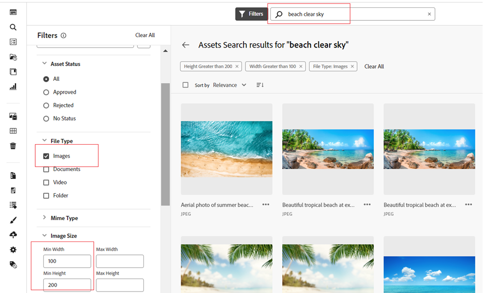

# [!DNL Assets view]에서 자산 검색 {#search-assets}

>[!CONTEXTUALHELP]
>id="assets_search"
>title="자산 검색"
>abstract="검색창에서 키워드를 지정하거나 상태, 파일 유형, MIME 유형, 크기, 생성, 수정 및 만료 일자를 기준으로 필터링하여 자산을 검색하십시오. 표준 필터 외에도 사용자 정의 필터를 적용할 수 있습니다. 필터링된 결과를 “저장된 검색” 또는 “스마트 컬렉션”으로 저장할 수 있습니다."
>additional-url="https://experienceleague.adobe.com/docs/experience-manager-assets-essentials/help/manage-collections.html?lang=ko-KR#manage-smart-collection" text="스마트 컬렉션 만들기"

[!DNL Assets view]는 기본적으로 작동하는 효과적인 검색 기능을 제공합니다. 검색 기능은 전체 텍스트 검색이므로 포괄적입니다. 강력한 검색 기능을 통해 적절한 자산을 빠르게 찾고 콘텐츠 속도를 높일 수 있습니다. [!DNL Assets view]는 스마트 태그, 제목, 생성 날짜 및 저작권과 같은 메타데이터를 통해 전체 텍스트 검색 및 다중 검색 기능을 제공합니다.

에셋을 검색하려면 다음을 수행하십시오.

* 페이지 상단의 검색 상자를 클릭합니다. 기본적으로 현재 탐색 중인 폴더 내에서 검색됩니다. 다음 중 하나를 수행하십시오.

  

   * 키워드를 사용하여 검색하고 필요한 경우 폴더를 변경합니다. Return 키를 누릅니다.

   * 직접 검색하여 최근에 본 자산으로 작업을 시작하십시오. 검색 상자를 클릭하고 제안에서 최근에 본 자산을 선택합니다.

## 검색 결과 필터링 {#refine-search-results}

다음 매개변수를 기반으로 검색 결과를 필터링할 수 있습니다.

*그림: 다양한 매개변수를 기반으로 검색된 자산을 필터링합니다.*

* 자산 상태: `Approved`, `Rejected` 또는 `No Status` 자산 상태를 사용하여 검색 결과를 필터링합니다.

* 파일 형식: 지원되는 파일 형식(`Images`, `Documents` 및 `Videos`)으로 검색 결과를 필터링합니다.
* MIME 유형: 지원되는 파일 형식 중 하나 이상을 필터링합니다. <!-- TBD:  [supported file formats](/help/assets/supported-file-formats-assets-view.md). -->
* 이미지 크기: 이미지를 필터링할 최소 및 최대 크기 중 하나 이상을 제공합니다. 크기는 픽셀 단위의 치수로 제공되며 이는 이미지의 파일 크기가 아닙니다.
* 생성 날짜: 메타데이터에 입력된 자산 생성 날짜입니다. 사용되는 표준 날짜 형식은 `yyyy-mm-dd`입니다.
* 수정 날짜: 자산이 마지막으로 수정된 날짜입니다. 사용되는 표준 날짜 형식은 `yyyy-mm-dd`입니다.

* 만료 날짜: `Expired` 자산 상태를 기반으로 검색 결과를 필터링합니다. 또한 자산의 만료 날짜 범위를 지정하여 검색 결과를 추가로 필터링할 수 있습니다.

* 사용자 지정 필터: [Assets 보기 사용자 인터페이스에 사용자 지정 필터를 추가](#custom-filters)합니다. 표준 필터 외에 맞춤형 필터를 적용하여 검색 결과를 구체화합니다.

검색된 자산을 `Name`, `Relevancy`, `Size`, `Modified` 및 `Created`의 오름차순 또는 내림차순으로 정렬할 수 있습니다.

## 맞춤형 필터 관리 {#custom-filters}

**필요한 권한:**  `Can Edit`, `Owner` 또는 관리자.

Assets 보기를 사용하면 사용자 인터페이스에 사용자 지정 필터를 추가할 수도 있습니다. 그런 다음 [표준 필터](#refine-search-results) 외에 이러한 사용자 정의 필터를 적용하여 검색 결과를 구체화할 수 있습니다.

Assets 보기는 다음과 같은 사용자 정의 필터를 제공합니다.

<table>
    <tbody>
     <tr>
      <th><strong>사용자 정의 필터 이름</strong></th>
      <th><strong>설명</strong></th>
     </tr>
     <tr>
      <td>제목</td>
      <td>자산 제목을 사용하여 자산을 필터링합니다. 대/소문자 구분 검색 기준에 지정하는 제목은 결과에 표시할 자산의 정확한 제목과 일치해야 합니다.</td>
     </tr>
     <tr>
      <td>이름</td>
      <td>자산 필터 이름을 사용하여 자산을 필터링합니다. 대/소문자 구분 검색 기준에 지정하는 이름은 결과에 표시할 자산의 정확한 파일 이름과 일치해야 합니다.</td>
     </tr>
     <tr>
      <td>자산 크기</td>
      <td>결과에 표시할 자산의 검색 기준에서 크기 범위를 바이트 단위로 정의하여 자산을 필터링합니다.</td>
     </tr>
     <tr>
      <td>예측된 태그</td>
      <td>자산 스마트 태그를 사용하여 자산을 필터링합니다. 대/소문자 구분 검색 기준에 지정하는 스마트 태그 이름은 결과에 표시할 자산의 정확한 스마트 태그 이름과 일치해야 합니다. 검색 기준에 여러 스마트 태그를 지정할 수 없습니다.</td>
     </tr>    
    </tbody>
   </table>

<!--
   You can use a wildcard operator (*) to enable Assets view to display assets in the results that partially match the search criteria. For example, if you define <b>ma*</b> as the search criteria, Assets view displays assets with title, such as, market, marketing, man, manchester, and so on in the results.

   You can use a wildcard operator (*) to enable Assets view to display assets in the results that partially match the search criteria.

   You can use a wildcard operator (*) to enable Assets view to display assets in the results that partially match the search criteria. You can specify multiple smart tags separated by a comma in the search criteria.

   -->

### 사용자 정의 필터 추가 {#add-custom-filters}

사용자 정의 필터를 추가하려면:

1. **[!UICONTROL 필터]**&#x200B;를 클릭합니다.

1. **[!UICONTROL 사용자 정의 필터]** 섹션에서 **[!UICONTROL 편집]** 또는 **[!UICONTROL 필터 추가]**&#x200B;를 클릭합니다.

   

1. **[!UICONTROL 사용자 정의 필터 관리]** 대화 상자의 기존 필터 목록에서 추가해야 하는 필터를 선택합니다. **[!UICONTROL 사용자 정의 필터]**&#x200B;를 선택하여 모든 필터를 선택합니다.

1. **[!UICONTROL 확인]**&#x200B;을 클릭하여 사용자 인터페이스에 필터를 추가합니다.

### 사용자 정의 필터 제거 {#remove-custom-filters}

사용자 정의 필터를 제거하려면:

1. **[!UICONTROL 필터]**&#x200B;를 클릭합니다.

1. **[!UICONTROL 사용자 정의 필터]** 섹션에서 **[!UICONTROL 편집]**&#x200B;을 클릭합니다.

1. **[!UICONTROL 사용자 정의 필터 관리]** 대화 상자의 기존 필터 목록에서 제거해야 하는 필터를 선택 취소합니다.

1. **[!UICONTROL 확인]**&#x200B;을 클릭하여 사용자 인터페이스에서 필터를 제거합니다.

## [!DNL Adobe Firefly]를 사용하여 자산 검색 {#search-firefly}

[!DNL Experience Manager Assets] 내에서 [!DNL Adobe Firefly] 자산 검색 기능을 활용하면 어떤 자산 폴더에서도 사용할 수 없는 자산을 검색할 수 있습니다. 이를 통해 자산 폴더에 저장되지 않은 자산을 실시간으로 효율적으로 생성할 수 있습니다.

### 시작하기에 앞서

활성 [!DNL Adobe Express] 구독이 있어야 합니다.

### 자산 생성

[!DNL Adobe Firefly]를 사용하여 새 자산을 생성하려면:

1. [!DNL AEM Assets] 작업 영역으로 이동합니다.
1. 페이지 상단의 검색창에 자산 이름을 입력합니다. 
예를 들어 `Bugatti Type 57` 키워드를 사용하여 자산을 검색할 수 있습니다. 자산을 검색할 때 자산이 자산 폴더에 없기 때문에 결과를 찾을 수 없습니다.
1. 페이지 중앙에 있는 검색창에 자산 이름을 입력하고 **[!UICONTROL 생성]**을 클릭하십시오.
   
   *그림: 자산 폴더에서 Bugatti Type 57에 대한 결과를 찾을 수 없습니다.*  
새 자산이 정상적으로 생성되었습니다.
   
   *그림: [!DNL Adobe Firefly] 자산 검색 기능을 사용하여 검색된 참조 자산.*  
손쉽게 액세스할 수 있도록 이들 자산을 원하는 폴더에 업로드할 수 있습니다.

### 자산 업로드

생성된 자산을 자산 저장소에 업로드하려면 다음 작업을 수행하십시오.

1. **[!UICONTROL 업로드]**&#x200B;를 클릭합니다.
1. 자산을 업로드해야 하는 자산 폴더를 선택하고 **[!UICONTROL 폴더 선택]**을 클릭합니다.
   
   *그림: 자산을 업로드할 폴더를 선택합니다.*

## 저장된 검색 {#saved-search}

검색 기능은 [!DNL Assets view]에서 사용하기 매우 간단합니다. 검색 상자 내에서 키워드를 입력하고 Return 키를 눌러 결과를 보거나 한 번의 클릭으로 최근에 검색한 키워드를 빠르게 다시 검색할 수 있습니다.

메타데이터 및 자산 유형에 대한 특정 기준에 따라 검색 결과를 필터링할 수도 있습니다. 자주 사용하는 필터의 경우 검색 경험을 개선하기 위해 [!DNL Assets view]을 사용하여 검색 매개변수를 저장할 수 있습니다. 그런 다음 저장된 검색을 선택하여 한 번의 클릭으로 필터를 검색하고 적용할 수 있습니다.

저장된 검색을 생성하려면 일부 자산을 검색하고 하나 이상의 필터를 적용한 다음 [!UICONTROL 필터] 패널에서 **[!UICONTROL 다른 이름으로 저장]** > **[!UICONTROL 저장된 검색]**&#x200B;을 클릭하십시오. **[!UICONTROL 다른 이름으로 저장]**&#x200B;을 클릭하고 **[!UICONTROL 스마트 컬렉션]**&#x200B;을 선택하여 결과를 스마트 컬렉션으로 저장할 수도 있습니다. 자세한 내용은 [스마트 컬렉션 만들기](manage-collections-assets-view.md#create-a-smart-collection)를 참조하십시오.

<!-- TBD: Search behavior. Full-text search. Ranking and rank boosts. Hidden assets.
Report poor UX that users can only save a filtered search and not a simple search.
.
Are other supported files fully indexed and support full-text search? Eg. audio/videos files can at best have metadata indexed.
Anything about ranking of assets displayed in search results?

What about temporarily hiding an asset (suspending search on it) from the search results? If an asset is undergoing review collaboration, should it be used by others? Should it be hidden in search?

When userA is searching and userB add an asset that matches search results, will the asset display in search as soon as userA refreshes the page? Assuming indexing is near real-time. May not be so for bulk uploads.
-->

## 검색 결과를 사용하여 작업 {#work-with-search-results}

검색 결과에 표시되는 자산을 선택하고 다음 작업을 수행할 수 있습니다.

* **유사 이미지 찾기**: 메타데이터 및 스마트 태그를 기반으로 Assets UI에서 유사한 이미지 자산을 찾습니다.

* **세부 정보**: 자산 속성을 보고 편집합니다.

* **다운로드**: 자산을 다운로드합니다.

* **컬렉션에 추가**: 선택한 자산을 컬렉션에 추가합니다.

* **바로 가기에 고정**: 나중에 필요할 때 더 빠르게 액세스할 수 있도록 [자산을 고정](my-workspace-assets-view.md)합니다. 고정된 모든 항목은 내 작업 영역의 **바로 가기** 섹션에 표시됩니다.

* **Adobe Express에서 열기**: Adobe Experience Manager Assets 화면에서 통합된 Adobe Express 이미지를 편집합니다.

* **편집**: Adobe Express를 사용하여 이미지를 편집합니다.

* **링크 공유**: 자산에 대한 [링크 공유](share-links-for-assets-view.md)를 통해 다른 사용자가 액세스하고 다운로드할 수 있도록 합니다.

* **삭제**: 자산을 삭제합니다.

* **복사**: 자산을 다른 폴더 위치에 복사합니다.

* **이동**: 자산을 다른 폴더 위치로 이동합니다.

* **이름 바꾸기**: 자산의 이름을 바꿉니다.

* **라이브러리에 복사**: 라이브러리에 자산을 추가합니다.

* **작업 할당**: 사용자에게 자산에 대한 작업을 할당합니다.

* **보기**: 자산에서 수행된 [작업을 모니터링](manage-notifications-assets-view.md)합니다.

## 검색 우선 홈 페이지 구성 {#configuring-search-first-homepage}

Experience Manager Assets을 사용하면 조직의 기본 랜딩 페이지를 선택할 수 있습니다. 검색 우선을 홈 페이지로 사용하는 경우, 브랜딩에 맞게 배경 및 로고 이미지를 구성하여 페이지 브랜딩을 맞춤화할 수 있는 옵션도 있습니다.

검색 우선 홈 페이지를 구성하려면 아래 단계를 실행하십시오.

1. **[!UICONTROL 설정]** > **[!UICONTROL 일반 설정]**&#x200B;으로 이동합니다.
1. **[!UICONTROL 검색 우선]**&#x200B;을 선택합니다. 검색 우선 관련된 구성이 열립니다. 홈 페이지의 [정렬](#setting-alignment-search-bar) 또는 [배경 및 로고 이미지 설정](#setting-background-image-and-logo)을 설정할 수 있습니다.

### 검색 창 정렬 설정 {#setting-alignment-search-bar}

[!DNL Assets view] 검색 창 정렬을 변경할 수 있습니다. 검색 창을 중앙이나 상단에 표시할 수 있습니다. 적절한 정렬을 선택하고 **[!UICONTROL 저장]**&#x200B;을 클릭합니다.

### 홈 페이지 배경 및 로고 이미지 설정 {#setting-background-image-and-logo}

검색 우선 홈 페이지에 브랜드 로고와 배경 이미지를 추가할 수 있습니다. 다음 단계를 실행합니다.

1. **[!UICONTROL 홈 페이지]** 아래의 **[!UICONTROL 배경 및 로고 이미지]** 섹션으로 이동합니다.
1. 기존의 자산 저장소에서 이미지를 찾아보려면 **[!UICONTROL 바꾸기]**&#x200B;를 클릭합니다.
1. **[!UICONTROL 저장]**&#x200B;을 클릭합니다. 수정 사항을 검토하려면 변경 사항을 [미리 봅니다](#preview-configured-homepage).

### 구성된 홈 페이지 미리보기 {#preview-configured-homepage}

검색 우선 홈 페이지의 레이아웃과 서식을 미리보기로 확인할 수 있습니다. **[!UICONTROL 미리보기]**&#x200B;를 사용하면 레이아웃을 수정하거나 요구 사항에 따라 수정할 수 있습니다. 구성된 홈 페이지를 미리 보려면 아래 단계를 수행하십시오.

1. **[!UICONTROL 일반 설정]**&#x200B;을 클릭하고 **[!UICONTROL 검색 우선]**&#x200B;을 선택합니다.
1. **[!UICONTROL 검색 우선 홈 페이지 사용자 정의]**&#x200B;로 이동하고 **[!UICONTROL 미리보기]**&#x200B;를 클릭합니다. 홈 페이지를 어둡거나 밝은 테마로 미리 보려면 **[!UICONTROL 어두운 테마]** 버튼을 전환합니다.
1. 미리보기 화면을 닫으려면 **[!UICONTROL 닫기]**&#x200B;를 클릭합니다.

   

## 상황별 검색 {#contextual-search}

텍스트 프롬프트를 정의하여 저장소에서 사용 가능한 자산을 검색할 수도 있습니다. Experience Manager Assets는 해당 텍스트 프롬프트를 검색 필터로 자동 변환하고 검색 결과를 표시합니다. 필터 창을 사용하여 자동 필터를 확인하여 수정하고 검색 결과의 범위를 더 좁힐 수 있습니다.

### 상황별 검색 액세스 {#access-contextual-search}

Experience Manager Assets에서 상황별 검색에 액세스하는 방법:

1. 왼쪽 창에서 **[!UICONTROL 검색]**&#x200B;을 클릭합니다.

   

1. 검색 텍스트 상자에서 텍스트 프롬프트를 정의하고 **[!UICONTROL 상황별 검색]**&#x200B;을 클릭합니다.

   

   [!DNL Experience Manager Assets]는 검색 결과를 표시합니다.

### 지원되는 필터 {#supported-filters}

상황별 검색은 기본적으로 다음 필터를 지원합니다. 이러한 필터를 기반으로 텍스트 프롬프트를 사용하여 적절한 검색 결과를 확인할 수 있습니다.

* 이미지 높이

* 이미지 폭

* 파일 유형: 이미지, 문서, 비디오 또는 폴더.

* MIME 유형: JPG, PNG, TIFF, GIF, MP4, PDF, PPTX, DOCX 또는 XLSX

* 생성된 일자

* 수정일

* 만료일

* 자산 상태: 승인됨, 거부됨 또는 모두

* 만료된 자산

### 텍스트 프롬프트의 예 {#text-prompts-examples}

**예 1**

**텍스트 프롬프트**: 이번 달에 생성된 이미지입니다.

[!DNL Experience Manager Assets]는 다음 필터를 자동으로 적용하고 검색 결과를 표시합니다.

**예 2**

**텍스트 프롬프트**: 해변과 맑은 하늘이 포함된 높이가 200px 이상, 너비가 100px 이상인 이미지입니다.

[!DNL Experience Manager Assets]는 다음 필터를 자동으로 적용하고 검색 결과를 표시합니다.

**예 3**

**텍스트 프롬프트**: 높이가 1500 및 2500픽셀이고 지난 달에 생성되었으며 만료 및 승인되지 않은 푸른 하늘 이미지가 필요합니다.

[!DNL Experience Manager Assets]는 다음 필터를 자동으로 적용하고 검색 결과를 표시합니다.

다음 비디오는 상황별 검색 사용자 인터페이스에 액세스하는 것부터 텍스트 프롬프트를 정의하고 검색 결과를 보는 것까지의 전체 프로세스를 보여 줍니다.

>[!VIDEO](https://video.tv.adobe.com/v/3428407)

### 상황별 검색 비활성화 {#disable-contextual-search}

관리자는 조직 내 사용자에 대해 상황별 검색을 비활성화할 수도 있습니다. 이렇게 하려면 다음 단계를 실행합니다.

1. **[!UICONTROL 설정]** > **[!UICONTROL 일반 설정]**&#x200B;으로 이동합니다.

1. [!UICONTROL 상황별 검색] 섹션에서 **[!UICONTROL 조직에 대한 상황별 검색 활성화]** 토글을 꺼서 조직의 모든 사용자에 대한 상황별 검색 기능을 비활성화합니다.

### 상황별 검색 피드백 {#contextual-search-feedback}

상황별 검색 기능에 대한 피드백을 제공해야 하는 경우 을 클릭하고 피드백 아이콘을 클릭합니다. 피드백 유형을 선택하고 제목과 설명을 지정한 후에 **[!UICONTROL 제출]**&#x200B;을 클릭합니다.

## 다음 단계 {#next-steps}

* [Assets 보기에서 에셋을 검색하는 비디오를 시청하십시오](https://experienceleague.adobe.com/docs/experience-manager-learn/assets-essentials/basics/using.html)

* Assets 보기 사용자 인터페이스에서 사용 가능한 [!UICONTROL 피드백] 옵션을 사용하여 제품 피드백 제공

* 오른쪽 사이드바에서 사용 가능한 [!UICONTROL 이 페이지 편집], , [!UICONTROL 문제 기록] 또는 을 사용하여 설명서 피드백을 제공합니다.

* [고객 지원 센터](https://experienceleague.adobe.com/?support-solution=General#support) 문의
