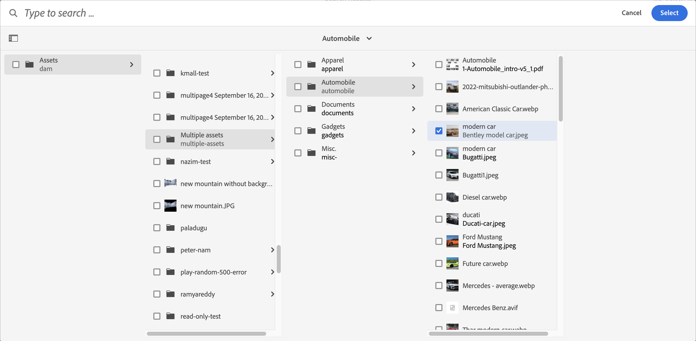
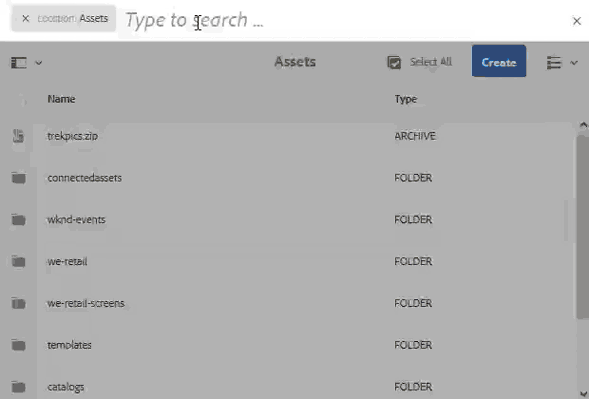

# AEM에서 자산 검색 {#search-assets-in-aem}

| 버전 | 문서 링크 |
| -------- | ---------------------------- |
| AEM 6.5 | [여기 클릭](https://experienceleague.adobe.com/docs/experience-manager-65/assets/using/search-assets.html) |
| AEM as a Cloud Service | 이 문서 |

[!DNL Adobe Experience Manager Assets] 는 더 높은 컨텐츠 속도를 달성하는 데 도움이 되는 강력한 자산 검색 방법을 제공합니다. 기본 기능과 사용자 지정 방법을 사용하여 매끄럽고 지능적인 에셋 검색 환경을 구축하여 출시 시간을 단축할 수 있습니다. 자산 검색 기능은 크리에이티브의 추가 사용, 비즈니스 사용자 및 마케터의 강력한 자산 관리 또는 DAM 관리자의 관리를 위한 디지털 자산 관리 시스템 사용의 중심입니다. 를 통해 수행할 수 있는 간단한 고급 사용자 정의 검색 [!DNL Assets] 사용자 인터페이스 또는 기타 앱 및 표면이 이러한 사용 사례를 충족하도록 도와줍니다.

AEM의 자산 검색은 다음 사용 사례를 지원하며 이 문서에서는 이러한 사용 사례의 사용, 개념, 구성, 제한 사항 및 문제 해결에 대해 설명합니다.

| 자산 검색 | 검색 기능 구성 및 관리 | 에셋 검색 결과 작업 |
|---|---|---|
| [기본 검색](#searchbasics) | [검색 색인](#searchindex) | [결과 정렬](#sort) |
| [검색 UI 이해](#searchui) | [텍스트 추출](#extracttextupload) | [에셋의 속성 및 메타데이터 확인](#checkinfo) |
| [제안 검색](#searchsuggestions) | [필수 메타데이터](#mandatorymetadata) | [다운로드](#download) |
| [검색 결과 및 동작 이해](#searchbehavior) | [검색 패싯 수정](#searchfacets) | [벌크 메타데이터 업데이트](#metadata-updates) |
| [검색 순위 및 부스팅](#searchrank) | [사용자 지정 술어](#custompredicates) | [스마트 컬렉션](#collections) |
| [고급 검색: 필터링 및 검색 범위](#scope) | | [예기치 않은 결과 이해 및 문제 해결](#unexpected-results) |
| [다른 솔루션 및 앱에서 검색](#search-assets-other-surfaces):<ul><li>[Adobe Asset Link](#aal)</li><li>[Brand Portal](#brand-portal)</li><li>[Experience Manager 데스크탑 앱](#desktop-app)</li><li>[Adobe Stock 이미지](#adobe-stock)</li><li>[Dynamic Media assets](#search-dynamic-media-assets)</li></ul> | | |
| [자산 선택기](#asset-picker) | | |
| [제한 사항](#limitations) 및 [팁](#tips) | | |
| [그림 예제](#samples) | | |

상단의 Omnisearch 필드를 사용하여 에셋을 검색합니다. [!DNL Experience Manager] 웹 인터페이스. 다음으로 이동 **[!UICONTROL 에셋]** > **[!UICONTROL 파일]** 위치: [!DNL Experience Manager], 클릭  상단 막대에서 검색 키워드를 입력하고 `Return`. 또는 키워드 단축키를 사용합니다 `/` (슬래시) Omnisearch 필드를 엽니다. `Location:Assets` 검색을 DAM 에셋으로 제한하기 위해 사전 선택됩니다. `Path:/content/dam` 또한 내의 루트 수준에서 검색을 수행할 때도 표시됩니다. **[!UICONTROL 파일]** 폴더를 삭제합니다. 다른 폴더로 이동하면 `Path:/content/dam/<folder name>` 검색 범위를 현재 폴더로 제한하기 위해 Omnisearch 필드에 를 표시합니다. [!DNL Experience Manager] 검색 키워드 입력을 시작할 때 제안 사항을 제공합니다.

사용 **[!UICONTROL 필터]** 패널 을 사용하여 에셋, 폴더, 태그 및 메타데이터를 검색할 수 있습니다. 파일 유형, 파일 크기, 마지막 수정 날짜, 에셋 상태, 인사이트 데이터 및 Adobe Stock 라이선싱과 같은 다양한 옵션(술어)을 기반으로 검색 결과를 필터링할 수 있습니다. 필터 패널을 사용자 정의하고 다음을 사용하여 검색 술어를 추가하거나 제거할 수 있습니다. [검색 패싯](/help/assets/search-facets.md). 다음 [!UICONTROL 파일 유형] 에서 필터링 [!UICONTROL 필터] 패널에 혼합 상태 확인란이 있습니다. 따라서 중첩된 술어(또는 형식)를 모두 선택하지 않으면 첫 번째 수준의 확인란이 부분적으로 선택됩니다.

[!DNL Experience Manager] 검색 기능은 컬렉션 검색 및 컬렉션 내의 자산 검색을 지원합니다. 다음을 참조하십시오 [컬렉션 검색](/help/assets/manage-collections.md).

## 에셋 검색 인터페이스 이해 {#searchui}

에셋 검색 인터페이스 및 사용 가능한 작업에 대해 숙지하십시오.
<!--

-->

*그림: 이해 [!DNL Experience Manager Assets] 검색 결과 인터페이스.*

**A.** 검색을 스마트 컬렉션으로 저장합니다.
**B.** 검색 결과의 범위를 좁히기 위한 필터 또는 술어입니다.
**C.** 파일, 폴더 또는 둘 다를 표시합니다.
**D.** 검색 위치는 DAM입니다.
**E.** 저장된 검색에 액세스합니다.
**F** 필터 를 클릭하여 왼쪽 레일을 열거나 닫습니다.
**G.** 자산을 기본 검색으로 표시합니다.
**H.** 검색 위치는 DAM입니다.
**난..** 사용자가 제공한 검색 키워드가 있는 Omnisearch 필드.
**J.** 로드된 검색 결과를 선택합니다.
**K.** 생성됨, 수정됨, 이름, 없음으로 정렬합니다.
**.** 오름차순 또는 내림차순으로 정렬합니다.
**M.** 총 검색 결과 중 표시된 검색 결과 수. **N.** 검색을 닫습니다.
**아..** 카드 보기와 목록 보기 간에 전환합니다.

### 동적 검색 패싯 {#dynamicfacets}

검색 패싯에서 동적으로 업데이트된 예상 검색 결과 수를 사용하여 검색 결과 페이지에서 원하는 에셋을 보다 빠르게 검색할 수 있습니다. 예상 에셋 수는 검색 필터를 적용하기 전에도 업데이트됩니다. 필터에 대한 예상 수를 확인하면 검색 결과를 빠르고 효율적으로 탐색할 수 있습니다.

*그림: 검색 패싯에서 검색 결과를 필터링하지 않고 대략적인 자산 수를 확인합니다.*

Experience Manager Assets은 기본적으로 다음 두 속성에 대한 Facet 수를 표시합니다.

* 자산 유형(jcr:content/metadata/dc:format)

* 승인 상태(jcr:content/metadata/dam:status)

2023년 8월 현재 Experience Manager Assets에는 의 새 버전 9가 포함되어 있습니다. `damAssetLucene` 색인입니다. 이전 버전, `damAssetLucene-8` 및 아래에서 `statistical` 각 검색 패싯 수에 대한 항목 샘플에 대한 액세스 제어를 확인하는 모드입니다.

`damAssetLucene-9` Oak 쿼리 패싯 계산의 동작을 로 변경하여 더 이상 기본 검색 색인에서 반환된 패싯 수에 대한 액세스 제어를 평가하지 않도록 합니다. 이로써 색 응답 시간이 빨라집니다. 그 결과, 사용자에게 액세스 권한이 없는 에셋을 포함하는 Facet 카운트 값이 표시될 수 있습니다. 이러한 사용자는 해당 에셋의 경로를 포함하여 다른 세부 정보에 액세스, 다운로드 또는 읽거나 에셋에 대한 추가 정보를 얻을 수 없습니다.

이전 동작으로 전환해야 하는 경우(`statistical` mode), 참조 [콘텐츠 검색 및 색인화](https://experienceleague.adobe.com/docs/experience-manager-cloud-service/content/operations/indexing.html) 의 사용자 지정 버전을 만들려면 `damAssetLucene-9` 색인입니다. Adobe은 로 전환하지 않는 것이 좋습니다. `secure` 검색 응답 시간에 미치는 영향(결과 세트 크기가 큰 경우)으로 인한 모드입니다.

이러한 모드에 대한 자세한 설명을 포함하여 Oak의 Facet 기능에 대한 자세한 내용은 를 참조하십시오. [이 문서](https://jackrabbit.apache.org/oak/docs/query/lucene.html#facets).

## 입력할 때 제안 사항 검색 {#searchsuggestions}

키워드를 입력하기 시작하면 Experience Manager에서 가능한 검색 키워드나 구를 제안합니다. 제안은 Experience Manager의 에셋을 기반으로 합니다. Experience Manager은 검색에 도움이 되도록 모든 메타데이터 필드를 인덱싱합니다. 검색 제안을 제공하기 위해 시스템에서는 다음 몇 가지 메타데이터 필드의 값을 사용합니다. 검색 제안을 제공하려면 적절한 키워드로 다음 필드를 채우는 것이 좋습니다.

* 자산 태그. (다음으로 매핑) `jcr:content/metadata/cq:tags`)
* 자산 제목입니다. (다음으로 매핑) `jcr:content/metadata/dc:title`)
* 자산 설명. (다음으로 매핑) `jcr:content/metadata/dc:description`)
* JCR 저장소의 제목입니다. 값이 자산 제목에 매핑될 수 있습니다. (다음으로 매핑) `jcr:content/jcr:title`)
* JCR 저장소의 설명입니다. 값이 자산 설명에 매핑될 수 있습니다. (다음으로 매핑) `jcr:content/jcr:description`)

## 검색 결과 및 동작 이해 {#searchbehavior}

### 기본 검색어 및 결과 {#searchbasics}

OmniSearch 필드에서 키워드 검색을 실행할 수 있습니다. 키워드 검색은 대/소문자를 구분하지 않으며 인기 있는 메타데이터 필드에서 전체 텍스트 검색입니다. 두 개 이상의 키워드를 사용하는 경우 `AND` 는 키워드 사이의 기본 연산자입니다.

결과는 가장 가까운 일치로 시작하여 관련성을 기준으로 정렬됩니다. 여러 키워드의 경우 메타데이터에 두 용어를 모두 포함하는 자산이 더 관련성이 높습니다. 메타데이터 내에서 스마트 태그로 나타나는 키워드는 다른 메타데이터 필드에 나타나는 키워드보다 순위가 높습니다. [!DNL Experience Manager] 를 사용하면 특정 검색어에 높은 가중치를 부여할 수 있습니다. 또한 다음을 수행할 수도 있습니다. [순위 높이기](#searchrank) 특정 검색어에 대해 타겟팅된 몇 개의 에셋.

관련 에셋을 신속하게 찾을 수 있도록 리치 인터페이스는 필터링, 정렬 및 선택 메커니즘을 제공합니다. 여러 기준에 따라 결과를 필터링하고 다양한 필터에 대해 검색된 에셋 수를 볼 수 있습니다. 또는 Omnisearch 필드에서 쿼리를 변경하여 검색을 다시 실행할 수 있습니다. 검색어 또는 필터를 변경할 때 검색 컨텍스트를 유지하기 위해 다른 필터는 계속 적용됩니다.

결과가 많은 에셋인 경우 [!DNL Experience Manager] 는 카드 보기에 처음 100개를 표시하고 목록 보기에 200개를 표시합니다. 사용자가 스크롤하면 더 많은 에셋이 로드됩니다. 이는 성능을 향상시키기 위한 것입니다. 의 비디오 데모 보기 [표시된 에셋 수](https://www.youtube.com/watch?v=LcrGPDLDf4o).

검색 결과에 예기치 않은 에셋이 표시되는 경우가 있습니다. 자세한 내용은 [예기치 않은 결과](#unexpected-results).

[!DNL Experience Manager] 에서는 다양한 파일 형식을 검색할 수 있으며, 비즈니스 요구 사항에 맞게 검색 필터를 사용자 정의할 수 있습니다. DAM 저장소에 사용할 수 있는 검색 옵션과 계정에 적용되는 제한 사항을 알아보려면 관리자에게 문의하십시오.

<!-- 
### Results with and without enhanced Smart Tags {#withsmarttags}

By default, [!DNL Experience Manager] search combines the search terms with an AND clause. For example, consider searching for keywords woman running. Only the assets with both woman and running keywords in the metadata appear in the search results by default. The same behavior is retained when special characters (periods, underscores, or dashes) are used with the keywords. The following search queries return the same results:

* `woman running`
* `woman.running`
* `woman-running`

However, the query `woman -running` returns assets without `running` in their metadata.
Using Smart Tags adds an extra `OR` clause to find any of the search terms as the applied smart tags. An asset tagged with either `woman` or `running` using Smart Tags also appear in such a search query. So the search results are a combination of,

* Assets with `woman` and `running` keywords in the metadata (default behavior).

* Assets smart tagged with either of the keywords (Smart Tags behavior).
-->

### 검색 순위 및 부스팅 {#searchrank}

메타데이터 필드의 모든 검색어와 일치하는 검색 결과가 먼저 표시되고, 스마트 태그의 검색어와 일치하는 검색 결과가 표시됩니다. 위의 예에서 검색 결과가 표시되는 대략적인 순서는 다음과 같습니다.

1. 의 일치 `woman running` 을 참조하십시오.
1. 의 일치 `woman running` 스마트 태그에서 사용됩니다.
1. 의 일치 `woman` 또는 `running` 스마트 태그에서 사용됩니다.

특정 에셋에 대한 키워드의 관련성을 개선하여 키워드를 기반으로 검색을 강화할 수 있습니다. 즉, 특정 키워드를 홍보하는 이미지는 해당 키워드를 기반으로 검색할 때 검색 결과의 맨 위에 나타납니다.

1. 다음에서 [!DNL Assets] 사용자 인터페이스에서 에셋에 대한 속성 페이지를 엽니다. 클릭 **[!UICONTROL 고급]** 및 클릭 **[!UICONTROL 추가]** 아래에 **[!UICONTROL 검색 키워드에 대한 개선]**.
1. 다음에서 **[!UICONTROL Search Promote]** 상자에서 이미지 검색을 강화할 키워드를 지정한 다음 **[!UICONTROL 추가]**. 동일한 방법으로 여러 키워드를 지정할 수 있습니다.
1. **[!UICONTROL 저장 및 닫기]**&#x200B;를 클릭합니다. 이 키워드에 대해 홍보한 자산이 상위 검색 결과 중에 나타납니다.

타겟팅된 키워드에 대한 검색 결과에서 일부 에셋의 등급을 높여 이점을 활용할 수 있습니다. 아래 예제 비디오를 참조하십시오. 자세한 내용은 [에서 검색 [!DNL Experience Manager]](https://experienceleague.adobe.com/docs/experience-manager-learn/assets/search-and-discovery/search-boost.html).

>[!VIDEO](https://video.tv.adobe.com/v/16766/?quality=6)

*비디오: 검색 결과의 등급이 지정되는 방식과 등급이 영향을 받는 방식을 이해합니다.*

## 검색 결과를 표시하도록 자산 배치 크기 구성 {#configure-asset-batch-size}

관리자는 검색을 수행할 때 표시되는 자산의 배치 크기를 구성할 수 있습니다. 아래로 스크롤하여 결과를 로드하는 경우 자산 검색 결과는 구성된 여러 배치 크기 번호로 표시됩니다. 200, 500, 1,000개 자산의 사용 가능한 배치 크기 중에서 선택할 수 있습니다. 낮은 배치 크기 번호를 설정하면 검색 응답 시간이 빨라집니다.

예를 들어 결과 개수 제한을 200개의 에셋으로 배치 크기로 설정한 경우, Experience Manager Assets은 검색 수행을 시작할 때 200개의 에셋의 배치 크기를 검색 결과에 표시합니다. 아래로 스크롤하여 검색 결과를 탐색하면 다음 200개의 자산 배치가 표시됩니다. 검색 쿼리와 일치하는 모든 에셋이 표시될 때까지 프로세스가 계속됩니다.

자산 배치 크기를 구성하려면 다음을 수행합니다.

1. 다음으로 이동 **[!UICONTROL 도구]** > **[!UICONTROL 에셋]** > **[!UICONTROL 에셋 구성]** > **[!UICONTROL Assets Omnisearch 구성]**.

1. 결과 개수 제한을 선택하고 **[!UICONTROL 저장]**.

   

## 고급 검색 {#scope}

[!DNL Experience Manager] 에서는 검색된 에셋에 적용되는 필터와 같은 다양한 방법을 제공하여 원하는 에셋을 보다 빠르게 찾을 수 있도록 합니다. 일반적으로 사용되는 몇 가지 방법이 아래에 설명되어 있습니다. 일부 [예시](#samples) 은(는) 아래에 공유됩니다.

**파일 또는 폴더 검색**: 검색 결과에서 파일, 폴더 또는 둘 다를 참조하십시오. 출처: **[!UICONTROL 필터]** 패널, 적절한 옵션을 선택할 수 있습니다. 다음을 참조하십시오 [검색 인터페이스](#searchui).

**폴더 내 에셋 검색**: 검색을 특정 폴더로 제한할 수 있습니다. 다음에서 **[!UICONTROL 필터]** 패널, 폴더의 경로를 추가합니다. 폴더는 한 번에 하나만 선택할 수 있습니다.

<!--

-->

*그림: 필터 패널에서 폴더 경로를 추가하여 검색 결과를 폴더로 제한합니다.*

### 유사한 이미지 찾기 {#visualsearch}

To find images that are visually similar to a user-selected image, click **[!UICONTROL Find Similar]** option from the card view of an image or from the toolbar. [!DNL Experience Manager]는 사용자가 선택한 이미지와 유사한 DAM 저장소에서 스마트 태그가 지정된 이미지를 표시합니다. 

*그림: 카드 보기에서 옵션을 사용하여 유사한 이미지를 찾습니다.*

### Adobe Stock 이미지 {#adobe-stock}

다음 범위 내에서 [!DNL Experience Manager] 사용자 인터페이스, 사용자가 검색 가능 [Adobe Stock assets](/help/assets/aem-assets-adobe-stock.md) 필요한 에셋에 라이센스를 부여할 수 있습니다. 추가 `Location: Adobe Stock` Omnisearch 막대에서. 필터 패널을 사용하여 라이선스가 있거나 라이선스가 없는 모든 에셋을 찾거나 Adobe Stock 파일 번호를 사용하여 특정 에셋을 검색할 수도 있습니다.

### Dynamic Media assets {#dmassets}

You can filter for Dynamic Media images by selecting **[!UICONTROL Dynamic Media]** > **[!UICONTROL Sets]** from the **[!UICONTROL Filters]** panel. It filters and displays assets such as image sets, carousels, mixed media sets, and spin sets.

### 메타데이터 필드의 특정 값을 사용하는 GQL 검색 {#gql-search}

제목, 설명 및 작성자와 같은 메타데이터 필드의 정확한 값을 기반으로 에셋을 검색할 수 있습니다. GQL 전체 텍스트 검색 기능은 메타데이터 값이 검색 쿼리와 정확히 일치하는 에셋만 가져옵니다. 속성 이름(작성자, 제목 등)과 값은 대/소문자를 구분합니다.

| 메타데이터 필드 | Facet 값 및 사용 |
|---|---|
| 제목 | title:John |
| 작성자 | creator:John |
| 위치 | 위치:NA |
| 설명 | description:&quot;샘플 이미지&quot; |
| 작성자 도구 | creatortool:&quot;Adobe Photoshop&quot; |
| 저작권 소유자 | 저작권 소유자:&quot;Adobe Systems&quot; |
| 참여자 | 기여자:존 |
| 사용 약관 | usageterms:&quot;CopyRights Reserved&quot; |
| 작성일 | created:YYYY-MM-DDTHH |
| 만료 날짜 | 만료: YYYY-MM-DDTHH |
| 정시 | ontime:YYYY-MM-DDTHH |
| 해제 시간 | offtime:YYYY-MM-DDTHH |
| 시간 범위(expires dateontime,offtime) | 패싯 필드: 하한..우세하 |
| 경로 | /content/dam/&lt;folder name=&quot;&quot;> |
| PDF 제목 | pdftitle:&quot;Adobe 문서&quot; |
| 제목 | 제목:&quot;교육&quot; |
| 태그 | 태그:&quot;위치 및 여행&quot; |
| 유형 | type:&quot;image\png&quot; |
| 이미지 폭 | 너비:하한..우세하 |
| 이미지 높이 | 높이:하한..우세하 |
| 개인 | person:John |

속성 `path`, `limit`, `size`, 및 `orderby` 을 사용하여 결합할 수 없습니다. `OR` 다른 속성을 사용하는 연산자입니다.

<!-- TBD: Where are the limit, size, orderby properties defined?
-->

사용자 생성 속성에 대한 키워드는 속성 편집기의 필드 레이블이며 공백은 제거됩니다.

다음은 복잡한 쿼리에 대한 검색 형식의 몇 가지 예입니다.

* 여러 패싯 필드가 있는 모든 자산을 표시하려면 다음을 수행합니다(예: title=John Doe 및 creator tool = Adobe Photoshop). `title:"John Doe" creatortool:Adobe*`
* Facet 값이 단일 단어가 아닌 문장인 경우 모든 자산을 표시하려면(예: title=Scott Reynolds): `title:"Scott Reynolds"`
* 단일 속성의 여러 값이 있는 자산을 표시하려면 다음을 수행합니다(예: title=Scott Reynolds 또는 John Doe). `title:"Scott Reynolds" OR "John Doe"`
* 특정 문자열로 시작하는 속성 값으로 자산을 표시하려면 다음을 수행합니다(예: 제목은 Scott Reynolds). `title:Scott*`
* 특정 문자열로 끝나는 속성 값이 있는 자산을 표시하려면 다음을 수행합니다(예: 제목은 Scott Reynolds). `title:*Reynolds`
* 특정 문자열을 포함하는 속성 값으로 에셋을 표시하려면(예: title = Basel Meeting Room): `title:*Meeting*`
* 특정 문자열이 들어 있고 특정 속성 값이 있는 에셋을 표시하려면(예: title=John Doe인 에셋에서 문자열 Adobe 검색): `*Adobe* title:"John Doe"`

## 다른 항목에서 자산 검색 [!DNL Experience Manager] 제공 또는 인터페이스 {#search-assets-other-surfaces}

[!DNL Adobe Experience Manager] dam 저장소를 다양한 다른 저장소에 연결 [!DNL Experience Manager] 디지털 에셋에 보다 빠르게 액세스하고 크리에이티브 워크플로를 간소화하기 위한 솔루션입니다. 모든 에셋 검색은 찾아보기 또는 검색으로 시작됩니다. 검색 비헤이비어는 다양한 서피스와 솔루션에서 대체로 동일하게 유지됩니다. 일부 검색 방법은 대상, 사용 사례 및 사용자 인터페이스가 [!DNL Experience Manager] 솔루션. 특정 방법은 아래 링크에 개별 솔루션에 대해 설명되어 있습니다. 보편적으로 적용 가능한 팁과 행동은 이 문서에 문서화되어 있습니다.

### Asset Link Adobe 패널에서 에셋 검색 {#aal}

이제 크리에이티브 전문가는 Adobe 에셋 링크를 사용하여에 저장된 콘텐츠에 액세스할 수 있습니다. [!DNL Experience Manager Assets]: 지원되는 Adobe Creative Cloud 앱을 종료하지 않고 사용할 수 있습니다. 광고 팀은 의 인앱 패널을 사용하여 자산을 원활하게 탐색, 검색, 체크아웃 및 체크인할 수 있습니다. [!DNL Adobe Creative Cloud] 앱: [!DNL Adobe Photoshop], [!DNL Adobe Illustrator], 및 [!DNL Adobe InDesign]. Asset Link를 통해 사용자는 시각적으로 유사한 결과를 검색할 수도 있습니다. 시각적 검색 디스플레이 결과는 Adobe Sensei의 머신 러닝 알고리즘으로 제공되며 사용자가 미적으로 유사한 이미지를 찾을 수 있도록 도와줍니다. 다음을 참조하십시오 [에셋 검색 및 찾아보기](https://helpx.adobe.com/kr/enterprise/using/manage-assets-using-adobe-asset-link.html#UseAdobeAssetLink) Adobe 자산 링크를 사용합니다.

### 에서 에셋 검색 [!DNL Experience Manager] 데스크탑 앱 {#desktop-app}

크리에이티브 전문가는 데스크탑 앱을 사용하여 [!DNL Experience Manager Assets] 로컬 데스크톱(Win 또는 Mac)에서 쉽게 검색하고 사용할 수 있습니다. 크리에이티브는 Mac 파인더 또는 Windows 탐색기에서 원하는 자산을 쉽게 표시하고, 데스크탑 애플리케이션에서 열고, 로컬로 변경할 수 있습니다. 변경 사항은 다음에 다시 저장됩니다. [!DNL Experience Manager] 저장소에서 새 버전을 만들 수 있습니다. 하나 이상의 키워드를 사용하는 기본 검색을 지원합니다. `*` 및 `?` 와일드카드 및 `AND` 연산자. 다음을 참조하십시오 [에셋 검색 및 미리보기](https://experienceleague.adobe.com/docs/experience-manager-desktop-app/using/using.html#browse-search-preview-assets) 데스크탑 앱에서.

### [!DNL Brand Portal]에서 자산 검색 {#brand-portal}

LOB(Line of Business) 사용자 및 마케터는 Brand Portal을 사용하여 승인된 디지털 에셋을 확장된 내부 팀, 파트너 및 리셀러와 효율적이고 안전하게 공유합니다. 다음을 참조하십시오 [Brand Portal에서 에셋 검색](https://experienceleague.adobe.com/docs/experience-manager-brand-portal/using/search-capabilities/brand-portal-searching.html).

### 검색 [!DNL Adobe Stock] 이미지 {#adobe-stock1}

다음 범위 내에서 [!DNL Experience Manager] 사용자 인터페이스에서 사용자는 Adobe Stock 에셋을 검색하고 필요한 에셋에 라이선스를 제공할 수 있습니다. 추가 `Location: Adobe Stock` Omnisearch 필드. 다음을 사용할 수도 있습니다. **[!UICONTROL 필터]** 패널 을 클릭하여 라이선스가 있거나 라이선스가 없는 모든 에셋을 찾거나 Adobe Stock 파일 번호를 사용하여 특정 에셋을 검색할 수 있습니다. 다음을 참조하십시오 [관리 [!DNL Adobe Stock] 의 이미지 [!DNL Experience Manager]](/help/assets/aem-assets-adobe-stock.md#usemanage).

### 검색 [!DNL Dynamic Media] assets {#search-dynamic-media-assets}

You can filter for Dynamic Media images by selecting **[!UICONTROL Dynamic Media]** > **[!UICONTROL Sets]** from the **[!UICONTROL Filters]** panel. It filters and displays assets such as image sets, carousels, mixed media sets, and spin sets. While authoring web pages, the authors can search for sets from within the Content Finder. A filter for sets is available in a pop-up menu.

### 웹 페이지 작성 시 콘텐츠 파인더에서 자산 검색 {#content-finder}

작성자는 콘텐츠 파인더를 사용하여 DAM 저장소에서 관련 에셋을 검색하고 만든 웹 페이지의 에셋을 사용할 수 있습니다. 작성자는 연결된 에셋 기능을 사용하여 원격으로 사용할 수 있는 에셋을 검색할 수도 있습니다 [!DNL Experience Manager] 배포. 그런 다음 작성자는 로컬 웹 페이지에서 이러한 자산을 사용할 수 있습니다 [!DNL Experience Manager] 배포. 다음을 참조하십시오 [원격 자산 사용](/help/assets/use-assets-across-connected-assets-instances.md#use-remote-assets).

### 컬렉션 검색 {#collections}

[!DNL Experience Manager] 검색 기능은 컬렉션 검색 및 컬렉션 내의 자산 검색을 지원합니다. 다음을 참조하십시오 [컬렉션 검색](/help/assets/manage-collections.md).

## 자산 선택기 {#asset-picker}

자산 선택기(이전 버전의 자산 선택기라고 함) [!DNL Adobe Experience Manager])를 사용하면 특별한 방식으로 DAM 에셋을 검색하고, 필터링하고, 검색할 수 있습니다. 에셋 선택기는 다음에서 사용할 수 있습니다. `https://[aem_server]:[port]/aem/assetpicker.html`. 에셋 선택기를 사용하여 선택한 에셋의 메타데이터를 가져올 수 있습니다. 에셋 유형(이미지, 비디오, 텍스트) 및 선택 모드(단일 또는 다중 선택)와 같은 지원되는 요청 매개 변수로 시작할 수 있습니다. 이러한 매개 변수는 특정 검색 인스턴스에 대한 에셋 선택기의 컨텍스트를 설정하며 선택 항목 전체에서 그대로 유지됩니다.

에셋 선택기는 HTML5를 사용합니다 `Window.postMessage` 선택한 자산에 대한 데이터를 수신자에게 보내는 메시지입니다. 찾아보기 모드에서만 작동하며 Omnisearch 결과 페이지에서만 작동합니다.

URL에 다음 요청 매개 변수를 전달하여 특정 컨텍스트에서 자산 선택기를 실행합니다.

| 이름 | 값 | 예 | 용도 |
|---|---|---|---|
| 리소스 접미사(B) | URL의 리소스 접미사 폴더 경로: [https://localhost:4502/aem/assetpicker.html/&lt;folder_path>](https://localhost:4502/aem/assetpicker.html) | 특정 폴더(예: 폴더 포함)가 선택된 상태로 자산 선택기를 실행하려면 `/content/dam/we-retail/en/activities` 선택한 경우 URL의 형식은 다음과 같아야 합니다. `https://localhost:4502/aem/assetpicker.html/content/dam/we-retail/en/activities?assettype=images` | 자산 선택기를 시작할 때 특정 폴더를 선택해야 하는 경우 리소스 접미사로 전달합니다. |
| `mode` | 단일, 다중 | <ul><li>`https://localhost:4502/aem/assetpicker.html?mode=single`</li><li>`https://localhost:4502/aem/assetpicker.html?mode=multiple`</li></ul> | 다중 모드에서는 에셋 선택기를 사용하여 여러 에셋을 동시에 선택할 수 있습니다. |
| `dialog` | true, false | [https://localhost:4502/aem/assetpicker.html?dialog=true](https://localhost:4502/aem/assetpicker.html?dialog=true) | 이러한 매개 변수를 사용하여 자산 선택기를 [Granite] 대화 상자로 엽니다. 이 옵션은 Granite 경로 필드를 통해 자산 선택기를 시작하고 pickerSrc URL로 구성하는 경우에만 적용할 수 있습니다. |
| `root` | &lt;folder_path> | `https://localhost:4502/aem/assetpicker.html?assettype=images&root=/content/dam/we-retail/en/activities` | 이 옵션을 사용하여 자산 선택기의 루트 폴더를 지정합니다. 이 경우 에셋 선택기를 사용하면 루트 폴더 아래에서 하위 에셋(직접/간접)만 선택할 수 있습니다. |
| `viewmode` | 검색 | | 검색 모드에서 자산 선택기를 실행하려면 `assettype` 및 `mimetype` 매개 변수. |
| `assettype` | 이미지, 문서, 멀티미디어, 아카이브. | <ul><li>`https://localhost:4502/aem/assetpicker.html?viewmode=search&assettype=images`</li><li> `https://localhost:4502/aem/assetpicker.html?viewmode=search&assettype=documents` </li><li> `https://localhost:4502/aem/assetpicker.html?viewmode=search&assettype=multimedia` </li><li> `https://localhost:4502/aem/assetpicker.html?viewmode=search&assettype=archives` </li></ul> | 제공된 값을 기반으로 자산 유형을 필터링하려면 옵션을 사용합니다. |
| `mimetype` | MIME 유형(`/jcr:content/metadata/dc:format`) 에셋(와일드카드도 지원됨)의 | <ul><li>`https://localhost:4502/aem/assetpicker.html?mimetype=image/png`</li><li>`https://localhost:4502/aem/assetpicker.html?mimetype=*png`</li><li>`https://localhost:4502/aem/assetpicker.html?mimetype=*presentation`</li><li>`https://localhost:4502/aem/assetpicker.html?mimetype=*presentation&mimetype=*png`</li></ul> | MIME 유형을 기반으로 자산을 필터링하는 데 사용합니다. |

자산 선택기 인터페이스에 액세스하려면 로 이동합니다. `https://[aem_server]:[port]/aem/assetpicker`. 원하는 폴더로 이동하고 하나 이상의 에셋을 선택합니다. 또는 Omnisearch 상자에서 원하는 에셋을 검색하고 필요에 따라 필터를 적용한 다음 선택합니다.

<!---->

*그림: 에셋 선택기에서 에셋을 찾아보고 선택합니다.*

## 제한 사항 {#limitations}

의 검색 기능 [!DNL Experience Manager Assets] 에는 다음 제한 사항이 있습니다.

* 검색 쿼리에 선행 공백을 입력하지 마십시오. 그렇지 않으면 검색이 작동하지 않습니다.
* [!DNL Experience Manager] 검색된 결과에서 에셋의 속성을 선택한 다음 검색을 취소하면 검색어를 계속 표시할 수 있습니다. <!-- (CQ-4273540) -->
* 폴더 또는 파일 및 폴더를 검색할 때 매개 변수를 기준으로 검색 결과를 정렬할 수 없습니다.
* 다음을 선택하는 경우 `Return` Omnisearch 막대에 입력하지 않고, [!DNL Experience Manager] 는 폴더는 제외하고 파일만 목록을 반환합니다. 키워드를 사용하지 않고 특정 폴더를 검색하는 경우 [!DNL Experience Manager] 는 결과를 반환하지 않습니다.
* 폴더에 대해 전체 텍스트 검색을 수행할 수 있습니다. 검색할 검색어를 지정합니다.

시각적 검색 또는 유사성 검색에는 다음과 같은 제한 사항이 있습니다.

* 시각적 검색은 큰 저장소에서 가장 잘 작동합니다. 좋은 결과를 얻기 위해 필요한 최소 이미지 수는 없지만 몇 개의 이미지와 일치하는 항목의 품질은 대형 저장소의 일치 항목보다 좋지 않습니다.
* 모델이나 기차는 변경할 수 없습니다 [!DNL Experience Manager] 유사한 이미지를 찾습니다. 예를 들어 스마트 태그를 일부 자산에 추가하거나 제거해도 모델이 변경되지 않습니다. 에셋이 시각적으로 유사한 검색 결과에서 제외됩니다.

검색 기능은 다음 시나리오에서 성능 제한을 가질 수 있습니다.

* 카드 보기는 검색 결과를 표시하는 목록 보기보다 로드 시간이 빠릅니다.

## 검색 팁 {#tips}

* 에셋의 검토 상태를 모니터링할 때 적절한 옵션을 사용하여 승인되는 에셋 또는 승인 보류 중인 에셋을 찾습니다.
* 인사이트 조건자를 사용하여 다양한 Creative 앱에서 얻은 사용 통계를 기반으로 지원되는 에셋을 검색할 수 있습니다. 사용 데이터는 에셋이 범주로 표시되는 사용 점수, 노출 횟수, 클릭 수 및 미디어 채널 아래에 그룹화됩니다.
* 사용 **[!UICONTROL 모두 선택]** 검색된 에셋을 선택하려면 확인란을 선택합니다. [!DNL Experience Manager] 처음에는 카드 보기에 100개의 자산이 표시되고 목록 보기에 200개의 자산이 표시됩니다. 검색 결과를 스크롤하면 더 많은 에셋이 로드됩니다. 로드된 에셋보다 더 많은 에셋을 선택할 수 있습니다. 선택한 에셋의 수가 검색 결과 페이지의 오른쪽 위 모서리에 표시됩니다. 예를 들어 선택한 에셋을 다운로드하거나, 선택한 에셋에 대해 메타데이터 속성을 일괄적으로 업데이트하거나, 선택한 에셋을 컬렉션에 추가할 수 있습니다. 표시된 에셋보다 더 많은 에셋을 선택한 경우 선택한 모든 에셋에 작업이 적용되거나 적용된 에셋 수가 대화 상자에 표시됩니다. 로드되지 않은 에셋에 작업을 적용하려면 모든 에셋을 명시적으로 선택해야 합니다.
* 필수 메타데이터가 포함되지 않은 에셋을 검색하려면 [필수 메타데이터](#mandatorymetadata).
* 검색은 모든 메타데이터 필드를 사용합니다. 12에 대한 검색과 같은 일반 검색은 일반적으로 많은 결과를 반환합니다. 더 나은 결과를 얻으려면 큰따옴표(작은 따옴표가 아님)를 사용하거나 숫자가 특수 문자 없이 단어에 인접해 있는지 확인하십시오(예: `shoe12`).
* 전체 텍스트 검색은 다음과 같은 연산자를 지원합니다. `-` 및 `^`. 이러한 문자를 문자열 리터럴로 검색하려면 검색 표현식을 큰따옴표로 묶습니다. 예를 들어, `"Notebook - Beauty"` 대신 `Notebook - Beauty`.
* 검색 결과가 너무 많으면 [검색 범위](#scope) 을 눌러 원하는 에셋에 대해 제로인을 수행합니다. 특정 파일 유형, 특정 위치, 특정 메타데이터 등과 같은 원하는 에셋을 더 잘 찾는 방법에 대한 아이디어가 있을 때 가장 잘 작동합니다.

* **태깅**: 태그를 사용하여 보다 효율적으로 검색 및 검색할 수 있는 에셋을 분류할 수 있습니다. 태그 지정은 적절한 분류 체계를 다른 사용자 및 워크플로에 전파하는 데 도움이 됩니다. [!DNL Experience Manager] 은 사용 및 교육으로 자산에 태그를 지정하는 데 계속 더 능숙해지는 Adobe Sensei의 인위적인 인텔리전트 서비스를 사용하여 자산에 자동으로 태그를 지정하는 메서드를 제공합니다. 에셋을 검색할 때 스마트 태그가 팩토링됩니다. 기본 제공 검색 기능과 함께 작동합니다. 다음을 참조하십시오 [검색 동작](#searchbehavior). 검색 결과가 표시되는 순서를 최적화하려면 다음을 수행할 수 있습니다 [검색 순위 높이기](#searchrank) 몇 개 중 일부 자산을 선택합니다.

* **색인화**: 인덱싱된 메타데이터 및 에셋만 검색 결과에 반환됩니다. 더 나은 적용 범위와 성능을 위해 적절한 색인화를 보장하고 모범 사례를 따르십시오. 다음을 참조하십시오 [색인화](#searchindex).

## 검색을 설명하는 몇 가지 예 {#samples}

키워드 주위에 큰따옴표를 사용하여 사용자가 지정한 정확한 순서로 정확한 구가 포함된 자산을 찾습니다.

*그림: 따옴표가 있거나 없는 검색 동작*

**별표 와일드카드로 검색**: 검색 범위를 넓히려면 검색어 앞이나 뒤에 별표를 사용하여 문자 수를 일치시킵니다. 예를 들어 별표 없이 실행 을 검색해도 메타데이터에 포함된 단어의 변형이 포함된 자산은 반환되지 않습니다. 별표는 임의의 문자 수를 대체합니다. 예:

* `run` 정확하게 실행 키워드가 있는 자산 반환
* `run*` 자산 반환: `running`, `run`, `runaway`등.
* `*run` 자산 반환: `outrun`, `rerun`등.
* `*run*` 가능한 모든 조합을 반환합니다.

*그림: 예를 사용하여 자산 검색에서 별표 와일드카드의 사용을 보여 줍니다.*

**물음표 와일드카드로 검색**: 검색 범위를 넓히려면 하나 이상의 &quot;?&quot;를 사용합니다 문자 수를 정확히 일치시킵니다. 예를 들어 다음 그림에서는

* `run???` 쿼리가 어떤 에셋과도 일치하지 않습니다.

* `run????` 쿼리가 단어와 일치함 `running` 뒤에 4자가 있음 `run`.

* `??run` 쿼리가 단어와 일치함 `rerun` 앞에 두 문자 `run`.

*그림: 예를 사용하여 자산 검색에서 물음표 와일드카드의 사용을 보여 줍니다.*

**키워드 제외**: 대시를 사용하여 키워드가 포함되지 않은 에셋을 검색합니다. 예를 들어, `running -shoe` 쿼리가 포함된 자산을 반환합니다. `running`, 그러나 아님 `shoe`. 마찬가지로, `camp -night` 쿼리가 포함된 자산을 반환합니다. `camp` 그러나 아님 `night`. 쿼리 `camp-night` 둘 다 포함하는 자산을 반환합니다. `camp` 및 `night`.

*그림: 대시를 사용하여 제외된 키워드가 포함되지 않은 에셋을 검색합니다.*

<!--
## Configuration and administration tasks related to search functionality {#configadmin}

### Search index configurations {#searchindex}

Asset discovery relies on indexing of DAM contents, including the metadata. Faster and accurate asset discovery relies on optimized indexing and appropriate configurations. See [indexing](/help/operations/indexing.md).
-->

<!--
### Visual or similarity search {#configvisualsearch}

Visual search uses Smart Tags. After configuring smart tagging functionality, follow these steps.

1. In [!DNL Experience Manager] CRXDE, in `/oak:index/lucene` node, add the following properties and values and save the changes.

    * `costPerEntry` property of type `Double` with the value `10`.

    * `costPerExecution` property of type `Double` with the value `2`.

    * `refresh` property of type `Boolean` with the value `true`.

   This configuration allows searches from the appropriate index.

1. To create Lucene index, in CRXDE, at `/oak:index/damAssetLucene/indexRules/dam:Asset/properties`, create node named `imageFeatures` of type `nt-unstructured`. In `imageFeatures` node,

    * Add `name` property of type `String` with the value `jcr:content/metadata/imageFeatures/haystack0`.

    * Add `nodeScopeIndex` property of type `Boolean` with the value of `true`.

    * Add `propertyIndex` property of type `Boolean` with the value of `true`.

    * Add `useInSimilarity` property of type `Boolean` with the value `true`.

   Save the changes.

1. Access `/oak:index/damAssetLucene/indexRules/dam:Asset/properties/predictedTags` and add `similarityTags` property of type `Boolean` with the value of `true`.
1. Apply Smart Tags to the assets in your [!DNL Experience Manager] repository. See [how to configure smart tags](https://experienceleague.adobe.com/docs/experience-manager-learn/assets/configuring/tagging.html#configuring).
1. In CRXDE, in `/oak-index/damAssetLucene` node, set the `reindex` property to `true`. Save the changes.
1. (Optional) If you have customized search form then copy the `/libs/settings/dam/search/facets/assets/jcr%3Acontent/items/similaritysearch` node to `/conf/global/settings/dam/search/facets/assets/jcr:content/items`. Save the changes.

For related information, see [understand smart tags in Experience Manager](https://experienceleague.adobe.com/docs/experience-manager-learn/assets/metadata/image-smart-tags.html) and [how to manage smart tags](/help/assets/smart-tags.md).
-->

<!--
### Mandatory metadata {#mandatorymetadata}

Business users, administrators, or DAM librarians can define some metadata as mandatory metadata that is a must for the business processes to work. For various reasons, some assets may be missing this metadata, such as legacy assets or assets migrated in bulk. Assets with missing or invalid metadata are detected and reported based on the indexed metadata property. To configure it, see [mandatory metadata](/help/assets/metadata-schemas.md#defining-mandatory-metadata).

### Modify search facets {#searchfacets}

To improve the speed of discovery, [!DNL Experience Manager Assets] offers search facets using which you can filter the search results. The Filters panel includes a few standard facets by default. Administrators can customize the Filters panel to modify the default facets using the in-built predicates. [!DNL Experience Manager] provides a good collection of in-built predicates and an editor to customize the facets. See [search facets](/help/assets/search-facets.md).

### Extract text when uploading assets {#extracttextupload}

You can configure [!DNL Experience Manager] to extract the text from the assets when users upload assets, such as PSD or PDF files. [!DNL Experience Manager] indexes the extracted text and helps users search these assets based on the extracted text. See [upload assets](/help/assets/manage-digital-assets.md#uploading-assets).
-->

### 검색 결과를 필터링하기 위한 사용자 지정 술어 {#custompredicates}

술어는 패싯을 만드는 데 사용됩니다. 관리자는 사전 구성된 술어를 사용하여 필터 패널에서 검색 패싯을 사용자 정의할 수 있습니다. 이러한 술어는 오버레이를 사용하여 사용자 정의할 수 있습니다. 다음을 참조하십시오 [사용자 지정 술어 만들기](/help/assets/search-facets.md).

다음 속성 중 하나 이상을 기반으로 디지털 에셋을 검색할 수 있습니다. 이러한 속성 중 일부에 적용되는 필터는 기본적으로 사용할 수 있으며, 다른 일부 필터는 사용자 정의하여 다른 속성에 적용할 수 있습니다.

| 검색 필드 | 속성 값 검색 |
|-----------------|----------------------------------------------------------------------------------------------------------------------------------------|
| MIME 유형 | 이미지, 문서, 멀티미디어, 아카이브 또는 기타 |
| 마지막 수정 날짜 | 시간, 일, 주, 월 또는 년. |
| 파일 크기 | Small, Medium 또는 Large |
| 게시 상태 | 게시 또는 게시 취소. |
| 승인됨 상태 | 승인 또는 거부됨. |
| 방향 | 가로, 세로 또는 사각형. |
| 스타일 | 색상 또는 흑백 중에서 선택할 수 있습니다. |
| 비디오 높이 | 최소값 및 최대값으로 지정됩니다. 값은 비디오 표현물의 메타데이터에만 저장됩니다. |
| 비디오 폭 | 최소값 및 최대값으로 지정됩니다. 값은 비디오 표현물의 메타데이터에만 저장됩니다. |
| 비디오 형식 | DVI, Flash, MPEG4, MPEG, OGG Theora, QuickTime, Windows Media. 값은 소스 비디오 및 모든 표현물의 메타데이터에 저장됩니다. |
| 비디오 코덱 | x264. 값은 비디오 표현물의 메타데이터에만 저장됩니다. |
| 비디오 비트율 | 최소값 및 최대값으로 지정됩니다. 값은 비디오 표현물의 메타데이터에만 저장됩니다. |
| 오디오 코덱 | Libvorbis, Rame MP3, AAC 인코딩. 값은 비디오 표현물의 메타데이터에만 저장됩니다. |
| 오디오 비트율 | 최소값 및 최대값으로 지정됩니다. 값은 비디오 표현물의 메타데이터에만 저장됩니다. |

## 에셋 검색 결과 작업 {#aftersearch}

검색한 자산을 사용하여 다음 작업을 수행할 수 있습니다 [!DNL Experience Manager]:

* 메타데이터 속성 및 기타 정보를 봅니다.
* 하나 이상의 자산을 다운로드합니다.
* 데스크탑 작업을 사용하여 데스크탑 앱에서 이러한 자산을 엽니다.
* 스마트 컬렉션을 만듭니다.
* 버전 만들기
* 워크플로 시작
* 에셋 연결 또는 연결 해제
* 검색을 수행한 후 자동으로 표시되는 필터 패널을 사용하여 필터를 적용하여 검색 결과의 범위를 좁힐 수 있습니다.
* 자산 위치로 이동

### 검색 결과 정렬 {#sort}

필요한 에셋을 더 빨리 검색하려면 검색 결과를 정렬하십시오. 검색 결과를 목록 보기에서 정렬할 수 있으며 다음을 선택할 때만 가능합니다. **[[!UICONTROL 파일]](#searchui)** 다음에서 **[!UICONTROL 필터]** 패널. [!DNL Assets] uses server-side sorting to quickly sort all the assets (howsoever numerous) within a folder or results of a search query. Server-side sorting provides faster and more accurate results than client-side sorting.

목록 보기에서 모든 폴더의 에셋을 정렬할 수 있는 것처럼 검색 결과를 정렬할 수 있습니다. 정렬은 이름, 제목, 상태, Dimension, 크기, 등급, 사용량, (날짜) 생성됨, (날짜) 수정됨, (날짜) 게시됨, 워크플로우 및 체크아웃됨 열에서 작동합니다.

정렬 기능의 제한 사항에 대해서는 [제한 사항](#limitations).

### 에셋의 세부 정보 확인 {#checkinfo}

검색 결과 페이지에서 검색된 에셋의 세부 정보를 확인할 수 있습니다.

에셋의 모든 메타데이터를 보려면 에셋을 선택하고 **[!UICONTROL 속성]** 을 클릭합니다.

To check the comments on an asset or version history of an asset, click the asset to open large-sized preview. Open timeline in the left rail and select **[!UICONTROL Comments]** or **[!UICONTROL Versions]**. You can also sort the timeline activity like comments or versions in a chronological order.

*그림: 검색 에셋에 대한 타임라인 항목을 정렬합니다.*

### 검색된 에셋 다운로드 {#download}

폴더에서 일반 에셋을 다운로드하는 것처럼 검색된 에셋 및 해당 렌디션을 다운로드할 수 있습니다. 검색 결과에서 하나 이상의 에셋을 선택하고 **[!UICONTROL 다운로드]** 을 클릭합니다.

### 메타데이터 속성 벌크 업데이트 {#metadata-updates}

여러 에셋의 공통 메타데이터 필드를 대량 업데이트할 수 있습니다. 검색 결과에서 하나 이상의 에셋을 선택합니다. 클릭 **[!UICONTROL 속성]** 을 클릭하고 필요에 따라 메타데이터를 업데이트합니다. 클릭 **[!UICONTROL 저장 및 닫기]** 완료 시. 업데이트된 필드의 기존 메타데이터를 덮어씁니다.

단일 폴더 또는 컬렉션에서 사용할 수 있는 에셋의 경우 다음과 같은 작업이 더 쉬워집니다 [메타데이터를 일괄적으로 업데이트](/help/assets/manage-metadata.md#manage-assets-metadata) 검색 기능을 사용하지 않습니다. 여러 폴더에서 사용할 수 있거나 공통 기준과 일치하는 에셋의 경우 검색을 통해 메타데이터를 대량 업데이트하는 것이 더 빠릅니다.

### 스마트 컬렉션 {#smart-collections}

컬렉션에는 이러한 에셋에 대한 참조만 포함되어 있으므로 컬렉션은 다른 위치의 에셋을 포함할 수 있는 순서가 지정된 에셋 세트입니다. 컬렉션은 다음 두 가지 유형입니다.

* 자산, 폴더 및 기타 컬렉션의 정적 참조 목록입니다.
* 검색 기준에 따라 컬렉션의 에셋을 채우는 동적 목록(스마트 컬렉션)입니다.

You can create smart collections based on the search criteria. From the **[!UICONTROL Filters]** panel, select **[!UICONTROL Files]** and click **[!UICONTROL Save Smart Collection]**. See [manage collections](/help/assets/manage-collections.md).

### 버전 만들기 {#create-version}

검색 결과에 표시되는 에셋의 버전을 만듭니다. 에셋을 선택하고 **[!UICONTROL 만들기]** > **[!UICONTROL 버전]**. 선택적 레이블 또는 댓글을 추가하고 **[!UICONTROL 만들기]**. 여러 에셋을 선택하고 해당 에셋의 버전을 동시에 만들 수도 있습니다.

### 워크플로 만들기 {#create-workflow}

버전 만들기 기능과 마찬가지로 검색 결과에 표시되는 에셋에 대한 워크플로우를 만들 수도 있습니다. 에셋을 선택하고 **[!UICONTROL 만들기]** > **[!UICONTROL 워크플로]**. 워크플로 모델을 선택하고 워크플로의 제목을 지정한 다음 **[!UICONTROL 시작]**.

### 에셋 연결 및 연결 해제 {#relate-unrelate-assets}

검색 결과에 표시되는 에셋의 관계를 지정하거나 관계를 해제합니다. 에셋을 선택하고 **[!UICONTROL 관계 설정]** 또는 **[!UICONTROL 관계 해제]**.

### 자산 폴더 위치로 이동 {#navigate-asset-folder-location}

검색 결과에 표시된 에셋의 폴더 위치로 이동합니다. 에셋을 선택하고 **[!UICONTROL 파일 위치 표시]**.

## 예기치 않은 검색 결과 및 문제 {#unexpected-results}

<!--
**Partially related or unrelated search results**: Experience Manager may display seemingly partially related or unrelated assets, alongside the desired assets in the search results. If you enable Enhanced Smart Tags, the search behavior changes slightly. See how it changes [after smart tagging](#withsmarttags).
-->

| 오류, 문제, 증상 | 가능한 이유 | 가능한 문제 해결 또는 이해 |
|---|---|---|
| 메타데이터가 누락된 자산을 검색할 때 잘못된 결과가 표시됩니다. | 필수 메타데이터가 누락된 에셋을 검색할 때 [!DNL Experience Manager] 유효한 메타데이터가 있는 일부 에셋을 표시할 수 있습니다. 결과는 인덱싱된 메타데이터 속성을 기반으로 합니다. | 메타데이터가 업데이트된 후 에셋 메타데이터의 올바른 상태를 반영하도록 다시 인덱싱해야 합니다. 다음을 참조하십시오 [필수 메타데이터](metadata-schemas.md#define-mandatory-metadata). |
| 검색 결과가 너무 많습니다. | 광범위한 검색 매개 변수. | 제한 고려: [검색 범위](#scope). 스마트 태그를 사용하면 예상보다 많은 검색 결과를 얻을 수 있습니다. 다음을 참조하십시오 [스마트 태그를 사용한 검색 동작](#withsmarttags). |
| 관련이 없거나 부분적으로 관련된 검색 결과. | 스마트 태깅으로 검색 동작이 변경됩니다. | 이해 [스마트 태그 지정 후 검색 변경 방법](#withsmarttags). |
| 자산에 대한 자동 완성 제안이 없습니다. | 새로 업로드한 자산은 아직 색인화되지 않았습니다. Omnisearch 막대에 검색 키워드를 입력할 때 메타데이터를 즉시 제안으로 사용할 수 없습니다. | [!DNL Experience Manager] 는 배경 작업을 실행하여 새로 업로드되거나 업데이트된 모든 에셋의 메타데이터를 인덱싱한 다음 제안 목록에 메타데이터를 추가하기 전에 시간 초과 기간(기본적으로 1시간)이 만료될 때까지 대기합니다. |
| 검색 결과 없음. | <ul><li>쿼리와 일치하는 에셋이 없습니다. </li><li> 검색 쿼리 앞에 공백을 추가했습니다. </li><li> 지원되지 않는 메타데이터 필드에 검색한 키워드가 포함되어 있습니다.</li><li> 에셋의 휴무 중 검색. </li></ul> | <ul><li>다른 키워드를 사용하여 검색합니다. 또는 스마트 태깅 또는 유사성 검색을 사용하여 검색 결과를 향상시킬 수 있습니다. </li><li>[알려진 제한 사항](#limitations).</li><li>모든 메타데이터 필드는 검색용으로 고려되지 않습니다. 다음을 참조하십시오 [범위](#scope).</li><li>필요한 에셋에 대해 나중에 검색하거나 정시 및 휴무를 수정합니다.</li></ul> |
| 검색 필터 또는 술어를 사용할 수 없습니다. | <ul><li>검색 필터가 구성되지 않았습니다.</li><li>로그인에 사용할 수 없습니다.</li><li>(가능성이 낮음) 사용 중인 배포에서 검색 옵션이 사용자 지정되지 않습니다.</li></ul> | <ul><li>관리자에게 문의하여 검색 사용자 지정을 사용할 수 있는지 확인하십시오.</li><li>관리자에게 문의하여 계정에 사용자 지정을 사용할 수 있는 권한/권한이 있는지 확인하십시오.</li><li>관리자에게 문의하여 다음에 사용할 수 있는 사용자 지정 사항을 확인하십시오. [!DNL Assets] 사용 중인 배포.</li></ul> |
| 시각적으로 유사한 이미지를 검색할 때 예상 이미지가 누락됩니다. | <ul><li>에서 이미지를 사용할 수 없음 [!DNL Experience Manager].</li><li>이미지가 인덱싱되지 않았습니다. 일반적으로 최근에 업로드된 경우.</li><li>이미지가 스마트 태그가 지정되지 않았습니다.</li></ul> | <ul><li>에 이미지 추가 [!DNL Assets].</li><li>관리자에게 문의하여 저장소를 다시 색인화하십시오. 또한 적절한 색인을 사용하고 있는지 확인하십시오.</li><li>관련 에셋에 스마트 태그를 지정하려면 관리자에게 문의하십시오.</li></ul> |
| 시각적으로 유사한 영상을 검색할 때, 무관한 영상이 표시된다. | 시각적 검색 동작. | [!DNL Experience Manager] 는 관련성이 있을 수 있는 에셋을 가능한 한 많이 표시합니다. 연관성이 낮은 이미지가 있는 경우 결과에 추가되지만 검색 순위가 낮습니다. 검색 결과를 아래로 스크롤하면 검색된 에셋의 일치 품질과 관련성이 감소합니다. |
| 검색 결과를 선택하고 작업할 때 검색된 모든 자산이 작동되지 않습니다. | 다음 [!UICONTROL 모두 선택] 옵션은 카드 보기에서 처음 100개의 검색 결과와 목록 보기에서 처음 200개의 검색 결과만 선택합니다. | |

**추가 참조**

* [검색 모범 사례](search-best-practices.md)
* [자산 번역](translate-assets.md)
* [Assets HTTP API](mac-api-assets.md)
* [자산이 지원되는 파일 형식](file-format-support.md)
* [연결된 자산](use-assets-across-connected-assets-instances.md)
* [자산 보고서](asset-reports.md)
* [메타데이터 스키마](metadata-schemas.md)
* [자산 다운로드](download-assets-from-aem.md)
* [메타데이터 관리](manage-metadata.md)
* [검색 패싯](search-facets.md)
* [컬렉션 관리](manage-collections.md)
* [일괄 메타데이터 가져오기](metadata-import-export.md)

>[!MORELIKETHIS]
>
>* [[!DNL Experience Manager] 검색 구현 안내서](https://experienceleague.adobe.com/docs/experience-manager-learn/sites/developing/search-tutorial-develop.html)
>* [검색 결과를 높이기 위한 고급 구성](https://experienceleague.adobe.com/docs/experience-manager-learn/assets/search-and-discovery/search-boost.html)
>* [스마트 번역 검색 구성](https://experienceleague.adobe.com/docs/experience-manager-learn/assets/translation/smart-translation-search-technical-video-setup.html)
