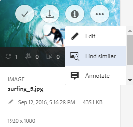

# AEM에서 자산 검색 {#search-assets-in-aem}

[!DNL Adobe Experience Manager Assets] 는 컨텐츠 속도를 높이는 데 도움이 되는 강력한 자산 검색 방법을 제공합니다. 팀은 기본 기능과 사용자 지정 방법을 사용하여 매끄럽고 지능적인 자산 검색 경험을 통해 출시 시간을 단축할 수 있습니다. 자산 검색 기능은 디지털 자산 관리 시스템의 사용에 핵심입니다. 크리에이티브, 비즈니스 사용자 및 마케터의 강력한 자산 관리 또는 DAM 관리자가 관리하는 데 사용할 수 있습니다. 를 통해 수행할 수 있는 단순, 고급 및 사용자 지정 검색 [!DNL Assets] 사용자 인터페이스 또는 기타 앱과 표면은 이러한 사용 사례를 이행하는 데 도움이 됩니다.

[!DNL Experience Manager Assets] 에서는 자산을 검색할 수 있는 다음 사용 사례를 지원하며 이 문서에서는 이러한 사용 사례에 대한 사용, 개념, 구성, 제한 사항 및 문제 해결에 대해 설명합니다.

| 에셋 검색 | 검색 기능 구성 및 관리 | 자산 검색 결과 작업 |
|---|---|---|
| [기본 검색](#searchbasics) | [검색 색인](#searchindex) | [결과 정렬](#sort) |
| [검색 UI 이해](#searchui) | [텍스트 추출](#extracttextupload) | [자산의 속성 및 메타데이터 확인](#checkinfo) |
| [추천 검색](#searchsuggestions) | [필수 메타데이터](#mandatorymetadata) | [다운로드](#download) |
| [검색 결과 및 동작 이해](#searchbehavior) | [검색 패싯 수정](#searchfacets) | [벌크 메타데이터 업데이트](#metadata-updates) |
| [검색 순위 및 증가](#searchrank) | [사용자 지정 설명](#custompredicates) | [스마트 컬렉션](#collections) |
| [고급 검색: 검색 필터링 및 범위](#scope) |  | [예기치 않은 결과 이해 및 문제 해결](#unexpected-results) |
| [다른 솔루션 및 앱에서 검색](#search-assets-other-surfaces):<ul><li>[Adobe Asset Link](#aal)</li><li>[Brand Portal](#brand-portal)</li><li>[Experience Manager 데스크탑 앱](#desktop-app)</li><li>[Adobe Stock 이미지](#adobe-stock)</li><li>[Dynamic Media 자산](#search-dynamic-media-assets)</li></ul> |  |  |
| [자산 선택기](#asset-picker) |  |  |
| [제한 사항](#limitations) 및 [팁](#tips) |  |  |
| [그림 설명](#samples) |  |  |

맨 위에 있는 Omnisearch 필드를 사용하여 자산을 검색합니다. [!DNL Experience Manager] 웹 인터페이스. 이동 **[!UICONTROL 자산]** > **[!UICONTROL 파일]** in [!DNL Experience Manager]를 클릭합니다.  상단 막대에서 검색 키워드를 입력하고 을(를) 선택합니다. `Return`. 또는 키워드 바로 가기를 사용합니다 `/` (슬래시)를 사용하여 Omnisearch 필드를 엽니다. `Location:Assets` 은 검색을 DAM 자산으로 제한하려면 미리 선택합니다. [!DNL Experience Manager] 검색 키워드 입력을 시작할 때 제안 사항을 제공합니다.

를 사용하십시오 **[!UICONTROL 필터]** 자산, 폴더, 태그 및 메타데이터를 검색할 패널입니다. 파일 유형, 파일 크기, 마지막 수정 날짜, 자산 상태, 통찰력 데이터 및 Adobe Stock 라이센스와 같은 다양한 옵션(예측)을 기반으로 검색 결과를 필터링할 수 있습니다. 필터 패널을 사용자 지정하고 다음을 사용하여 검색 설명을 추가하거나 제거할 수 있습니다 [검색 패싯](/help/assets/search-facets.md). 다음 [!UICONTROL 파일 유형] 에서 필터링 [!UICONTROL 필터] 패널에 혼합 상태 확인란이 있습니다. 따라서 중첩된 설명(또는 형식)을 모두 선택하지 않는 한 첫 번째 수준 확인란은 부분적으로 선택됩니다.

[!DNL Experience Manager] 검색 기능은 컬렉션 검색 및 컬렉션 내 자산 검색을 지원합니다. 자세한 내용은 [컬렉션 검색](/help/assets/manage-collections.md).

## 검색 인터페이스 이해 {#searchui}

검색 인터페이스 및 사용 가능한 작업에 대해 숙지하십시오.

*그림: 이해 [!DNL Experience Manager Assets] 검색 결과 인터페이스.*

**A.** 검색을 스마트 컬렉션으로 저장합니다. **B.** 검색 결과 범위를 좁히려면 필터 또는 조건자를 사용합니다. **C.** 파일, 폴더 또는 둘 다를 표시합니다. **D.** Click Filters to open or close the left rail. **E.** Search location is DAM. **F.** 사용자가 제공한 검색 키워드가 있는 Omnisearch 필드. **G.** 로드된 검색 결과를 선택합니다. **H.** 총 검색 결과 중 표시된 검색 결과 수입니다. **나.** 검색을 닫습니다. **J.** 카드 보기와 목록 보기 간을 전환합니다.

### 동적 검색 패싯 {#dynamicfacets}

검색 패싯에서 동적으로 업데이트된 예상 검색 결과 수를 사용하여 검색 결과 페이지에서 원하는 자산을 더 빨리 발견할 수 있습니다. 검색 필터를 적용하기 전에도 예상되는 자산 수가 업데이트됩니다. 필터에 대한 예상 수를 확인하면 검색 결과를 빠르고 효율적으로 탐색할 수 있습니다.

*그림: 검색 패싯에서 검색 결과를 필터링하지 않고 대략적인 자산 수를 참조하십시오.*

## 입력할 때 제안 검색 {#searchsuggestions}

키워드 입력을 시작하면 Experience Manager에서 가능한 검색 키워드나 구문을 제안합니다. 제안은 Experience Manager의 자산을 기반으로 합니다. Experience Manager 는 검색에 도움이 되도록 모든 메타데이터 필드를 인덱싱합니다. 검색 제안을 제공하기 위해 시스템에서는 다음 몇 가지 메타데이터 필드의 값을 사용합니다. 검색 제안을 제공하려면 적절한 키워드로 다음 필드를 채우는 것이 좋습니다.

* 자산 태그. (에 매핑) `jcr:content/metadata/cq:tags`)
* 자산 제목. (에 매핑) `jcr:content/metadata/dc:title`)
* 자산 설명. (에 매핑) `jcr:content/metadata/dc:description`)
* JCR 저장소의 제목입니다. 값이 자산 제목에 매핑될 수 있습니다. (에 매핑) `jcr:content/jcr:title`)
* JCR 저장소의 설명입니다. 값이 자산 설명에 매핑될 수 있습니다. (에 매핑) `jcr:content/jcr:description`)

## 검색 결과 및 동작 이해 {#searchbehavior}

### 기본 검색어 및 결과 {#searchbasics}

OmniSearch 필드에서 키워드 검색을 실행할 수 있습니다. 키워드 검색은 대/소문자를 구분하지 않으며 인기 있는 메타데이터 필드에서 전체 텍스트 검색입니다. 두 개 이상의 키워드를 사용하는 경우, `AND` 는 키워드 간의 기본 연산자입니다.

결과는 가장 가까운 일치부터 시작하여 관련성을 기준으로 정렬됩니다. 여러 키워드의 경우 더 관련성이 있는 결과는 메타데이터에 두 용어를 모두 포함하는 자산입니다. 메타데이터 내에서 스마트 태그로 나타나는 키워드는 다른 메타데이터 필드에 나타나는 키워드보다 순위가 높습니다. [!DNL Experience Manager] 특정 검색어에 더 높은 가중치를 부여할 수 있습니다. 또한, [순위 증가](#searchrank) 특정 검색어에 대해 몇 개의 타깃팅된 자산 중 하나입니다.

관련 자산을 빠르게 찾기 위해 리치 인터페이스에서 필터링, 정렬 및 선택 메커니즘을 제공합니다. 여러 기준에 따라 결과를 필터링하고 다양한 필터에 대해 검색된 자산 수를 볼 수 있습니다. 또는 Omnisearch 필드에서 쿼리를 변경하여 검색을 다시 실행할 수 있습니다. 검색어 또는 필터를 변경하면 다른 필터가 검색 컨텍스트를 유지하기 위해 계속 적용됩니다.

결과가 많은 경우, [!DNL Experience Manager] 카드 보기에서 처음 100을 표시하고 목록 보기에서 200을 표시합니다. 사용자가 스크롤할 때 더 많은 자산이 로드됩니다. 이것은 성능을 향상시키기 위한 것입니다. 비디오 데모 보기 [표시된 자산 수](https://www.youtube.com/watch?v=LcrGPDLDf4o).

경우에 따라 검색 결과에 예기치 않은 자산이 표시될 수 있습니다. 자세한 내용은 [예기치 않은 결과](#unexpected-results).

[!DNL Experience Manager] 여러 파일 형식을 검색할 수 있으며 비즈니스 요구 사항에 맞게 검색 필터를 사용자 지정할 수 있습니다. DAM 저장소에서 사용할 수 있는 검색 옵션과 계정의 제한 사항을 이해하려면 관리자에게 문의하십시오.

<!-- 
### Results with and without enhanced Smart Tags {#withsmarttags}

By default, [!DNL Experience Manager] search combines the search terms with an AND clause. For example, consider searching for keywords woman running. Only the assets with both woman and running keywords in the metadata appear in the search results by default. The same behavior is retained when special characters (periods, underscores, or dashes) are used with the keywords. The following search queries return the same results:

* `woman running`
* `woman.running`
* `woman-running`

However, the query `woman -running` returns assets without `running` in their metadata.
Using Smart Tags adds an extra `OR` clause to find any of the search terms as the applied smart tags. An asset tagged with either `woman` or `running` using Smart Tags also appear in such a search query. So the search results are a combination of,

* Assets with `woman` and `running` keywords in the metadata (default behavior).

* Assets smart tagged with either of the keywords (Smart Tags behavior).
-->

### 검색 순위 및 증폭 {#searchrank}

메타데이터 필드의 모든 검색어와 일치하는 검색 결과가 먼저 표시되고, 그 뒤에는 스마트 태그의 검색어와 일치하는 검색 결과가 표시됩니다. 위의 예에서 검색 결과의 대략적인 표시 순서는 다음과 같습니다.

1. 일치 항목 `woman running` 를 입력합니다.
1. 일치 항목 `woman running` 를 참조하십시오.
1. 일치 항목 `woman` 또는 `running` 를 참조하십시오.

특정 자산에 대한 키워드의 관련성을 개선하여 키워드를 기반으로 검색을 높일 수 있습니다. 즉, 특정 키워드를 프로모션하는 이미지가 이러한 키워드를 기반으로 검색할 때 검색 결과 맨 위에 나타납니다.

1. 에서 [!DNL Assets] 사용자 인터페이스에서 자산의 속성 페이지를 엽니다. 클릭 **[!UICONTROL 고급]** 을(를) 클릭합니다. **[!UICONTROL 추가]** 아래에 **[!UICONTROL 검색 키워드 승격]**.
1. 에서 **[!UICONTROL Search Promote]** 상자에서 이미지 검색을 강화할 키워드를 지정한 다음 를 클릭합니다 **[!UICONTROL 추가]**. 동일한 방법으로 여러 키워드를 지정할 수 있습니다.
1. **[!UICONTROL 저장 및 닫기]**&#x200B;를 클릭합니다. 이 키워드에 대해 홍보한 자산이 상위 검색 결과 내에 나타납니다.

타깃팅된 키워드에 대한 검색 결과에 있는 일부 자산의 등급을 강화하여 이 기능을 활용할 수 있습니다. 아래 예제 비디오를 참조하십시오. 자세한 내용은 [검색 위치 [!DNL Experience Manager]](https://experienceleague.adobe.com/docs/experience-manager-learn/assets/search-and-discovery/search-boost.html).

>[!VIDEO](https://video.tv.adobe.com/v/16766/?quality=6)

*비디오: 검색 결과의 등급 및 등급에 영향을 줄 수 있는 방법을 이해합니다.*

## 고급 검색 {#scope}

[!DNL Experience Manager] 에서는 원하는 자산을 더 빨리 찾을 수 있도록 검색된 자산에 적용되는 필터와 같은 다양한 방법을 제공합니다. 다음은 자주 사용하는 몇 가지 방법에 대해 설명합니다. 일부 [그림 예제](#samples) 공유한 모든 세그먼트를 표시합니다.

**파일 또는 폴더 검색**: 검색 결과에서 파일, 폴더 또는 둘 다 확인합니다. From **[!UICONTROL 필터]** 패널에서는 적절한 옵션을 선택할 수 있습니다. 자세한 내용은 [검색 인터페이스](#searchui).

**폴더 내에서 자산 검색**: 검색을 특정 폴더로 제한할 수 있습니다. 에서 **[!UICONTROL 필터]** 패널에서 폴더의 경로를 추가합니다. 한 번에 하나의 폴더만 선택할 수 있습니다.

*그림: 필터 패널에서 폴더 경로를 추가하여 검색 결과를 폴더로 제한합니다.*

### 유사한 이미지 찾기 {#visualsearch}

To find images that are visually similar to a user-selected image, click **[!UICONTROL Find Similar]** option from the card view of an image or from the toolbar. [!DNL Experience Manager]는 사용자가 선택한 이미지와 유사한 DAM 저장소에서 스마트 태그가 지정된 이미지를 표시합니다. 

*그림: 카드 보기에서 옵션을 사용하여 유사한 이미지를 찾습니다.*

### Adobe Stock 이미지 {#adobe-stock}

에서 [!DNL Experience Manager] 사용자 인터페이스, 사용자가 검색 가능 [Adobe Stock 자산](/help/assets/aem-assets-adobe-stock.md) 필요한 자산에 대한 라이선스를 부여합니다. 추가 `Location: Adobe Stock` Omnisearch 바에서 필터 패널을 사용하여 라이선스가 부여된 또는 라이선스가 없는 모든 자산을 찾거나 Adobe Stock 파일 번호를 사용하여 특정 자산을 검색할 수도 있습니다.

### Dynamic Media 자산 {#dmassets}

You can filter for Dynamic Media images by selecting **[!UICONTROL Dynamic Media]** > **[!UICONTROL Sets]** from the **[!UICONTROL Filters]** panel. It filters and displays assets such as image sets, carousels, mixed media sets, and spin sets.

### 메타데이터 필드에서 특정 값을 사용하여 GQL 검색 {#gql-search}

, 제목, 설명 및 작성자와 같은 메타데이터 필드의 정확한 값을 기반으로 자산을 검색할 수 있습니다. GQL 전체 텍스트 검색 기능은 메타데이터 값이 검색 쿼리와 정확히 일치하는 자산만 가져옵니다. 속성 이름(작성자, 제목 등)과 값은 대/소문자를 구분합니다.

| 메타데이터 필드 | 패싯 값 및 사용 |
|---|---|
| 제목 | title:John |
| 작성자 | 작성자:John |
| 위치 | 위치:NA |
| 설명 | description:&quot;샘플 이미지&quot; |
| 작성자 도구 | creatortool:&quot;Adobe Photoshop&quot; |
| 저작권 소유자 | copyrightowner:&quot;Adobe Systems&quot; |
| 참여자 | 기여자:John |
| 사용 약관 | usagterms:&quot;CopyRights Reserved&quot; |
| 작성일 | created:YYYY-MM-DDHH |
| 만료 날짜 | expires:YYYY-MM-DDHH |
| 시간 | ontime:YYYY-MM-DDTHH |
| 해제 시간 | offtime:YYYY-MM-DDTHH |
| 시간 범위(expires dateontime,offtime) | 패싯 필드 : 소행..상단 |
| 경로 | /content/dam/&lt;folder name=&quot;&quot;> |
| PDF 제목 | pdftitle:&quot;Adobe 문서&quot; |
| 제목 | 제목:&quot;교육&quot; |
| 태그 | 태그:&quot;위치 및 여행&quot; |
| 유형 | 유형:&quot;image\png&quot; |
| 이미지 너비 | width:lower bound..상단 |
| 이미지 높이 | height:lowbound.상단 |
| 개인 | 사람: John |

속성 `path`, `limit`, `size`, 및 `orderby` 를 사용하여 결합할 수 없습니다. `OR` 연산자를 사용할 수 있습니다.

<!-- TBD: Where are the limit, size, orderby properties defined?
-->

사용자가 생성한 속성의 키워드는 속성 편집기의 필드 레이블이며 공백이 제거되어 있습니다.

다음은 복잡한 쿼리에 대한 검색 형식의 예입니다.

* 여러 패싯 필드가 있는 모든 자산을 표시하려면(예: title=John Doe 및 creator tool = Adobe Photoshop): `title:"John Doe" creatortool:Adobe*`
* 패싯 값이 단일 단어가 아닌 문장이 될 때 모든 자산을 표시하려면(예: title=Scott Reynolds) `title:"Scott Reynolds"`
* 단일 속성의 여러 값이 있는 자산을 표시하려면(예: title=스캇 레이놀즈 또는 존 도): `title:"Scott Reynolds" OR "John Doe"`
* 특정 문자열로 시작하는 속성 값이 있는 자산을 표시하려면(예: 제목이 스콧 레이놀즈)입니다. `title:Scott*`
* 특정 문자열로 끝나는 속성 값이 있는 자산을 표시하려면(예: 제목이 스콧 레이놀즈)입니다. `title:*Reynolds`
* 특정 문자열을 포함하는 속성 값이 있는 자산을 표시하려면 다음을 수행하십시오. title = Basel Meeting Room): `title:*Meeting*`
* 특정 문자열을 포함하고 특정 속성 값을 갖는 자산을 표시하려면(예: title=John Doe가 있는 자산에서 문자열 Adobe 검색: `*Adobe* title:"John Doe"`

## 다른 항목에서 자산 검색 [!DNL Experience Manager] 서비스 또는 인터페이스 {#search-assets-other-surfaces}

[!DNL Adobe Experience Manager] DAM 저장소를 다른 여러 저장소에 연결 [!DNL Experience Manager] 디지털 자산에 대한 빠른 액세스를 제공하고 광고 워크플로우를 간소화하는 솔루션을 제공합니다. 모든 자산 검색은 검색 또는 검색으로 시작합니다. 검색 동작은 다양한 표면과 솔루션에서 대체로 동일하게 유지됩니다. 일부 검색 방법은 타겟 대상, 사용 사례 및 사용자 인터페이스가 다음을 비롯한 여러 항목에 따라 달라집니다 [!DNL Experience Manager] 솔루션. 구체적인 방법은 아래 링크에서 개별 솔루션에 대해 문서화됩니다. 일반적으로 적용 가능한 팁과 행동이 이 문서에 설명되어 있습니다.

### Adobe 자산 링크 패널에서 자산 검색 {#aal}

이제 크리에이티브 전문가가 Adobe 자산 링크를 사용하여에 저장된 컨텐츠에 액세스할 수 있습니다 [!DNL Experience Manager Assets], 지원되는 Adobe Creative Cloud 앱을 종료하지 않은 채. 광고 팀은 의 앱 내 패널을 사용하여 자산을 원활하게 탐색, 검색, 체크아웃 및 체크인할 수 있습니다 [!DNL Adobe Creative Cloud] 앱: [!DNL Adobe Photoshop], [!DNL Adobe Illustrator], 및 [!DNL Adobe InDesign]. Asset Link를 사용하면 사용자가 시각적으로 유사한 결과를 검색할 수도 있습니다. 시각적 검색 표시 결과는 Adobe Sensei의 기계 학습 알고리즘에 의해 수행되며 사용자가 미적으로 유사한 이미지를 찾을 수 있도록 도와줍니다. 자세한 내용은 [자산 검색 및 찾아보기](https://helpx.adobe.com/kr/enterprise/using/manage-assets-using-adobe-asset-link.html#UseAdobeAssetLink) Adobe 자산 링크 사용.

### 에서 자산 검색 [!DNL Experience Manager] 데스크탑 앱 {#desktop-app}

크리에이티브 전문가가 데스크탑 앱을 사용하여 [!DNL Experience Manager Assets] 로컬 데스크탑에서 손쉽게 검색 및 사용 가능(Win 또는 Mac) 광고 팀은 Mac Finder 또는 Windows 탐색기에 원하는 자산을 쉽게 표시하고 데스크탑 애플리케이션에서 열고 로컬로 변경할 수 있습니다. 변경 사항은 다시 [!DNL Experience Manager] 저장소에서 생성된 새 버전을 사용하여 새 버전을 만들 수 있습니다. 응용 프로그램은 하나 이상의 키워드를 사용하여 기본 검색을 지원합니다. `*` 및 `?` 와일드카드 및 `AND` 연산자를 사용할 수 있습니다. 자세한 내용은 [자산 찾아보기, 검색 및 미리 보기](https://experienceleague.adobe.com/docs/experience-manager-desktop-app/using/using.html#browse-search-preview-assets) 데스크탑 앱에서 생성합니다.

### [!DNL Brand Portal]에서 에셋 검색 {#brand-portal}

LOB(Line of Business) 사용자 및 마케터는 Brand Portal을 사용하여 승인된 디지털 자산을 확장 내부 팀, 파트너 및 리셀러와 효율적이고 안전하게 공유할 수 있습니다. 자세한 내용은 [Brand Portal에서 자산 검색](https://experienceleague.adobe.com/docs/experience-manager-brand-portal/using/search-capabilities/brand-portal-searching.html).

### 검색 [!DNL Adobe Stock] 이미지 {#adobe-stock1}

에서 [!DNL Experience Manager] 사용자 인터페이스에서 사용자는 Adobe Stock 자산을 검색하고 필요한 자산의 라이선스를 제공할 수 있습니다. 추가 `Location: Adobe Stock` ( Omnisearch 필드). 를 사용할 수도 있습니다 **[!UICONTROL 필터]** 패널에서는 라이선스가 부여된 또는 라이선스가 없는 모든 자산을 찾거나 Adobe Stock 파일 번호를 사용하여 특정 자산을 검색할 수 있습니다. 자세한 내용은 [관리 [!DNL Adobe Stock] 이미지 [!DNL Experience Manager]](/help/assets/aem-assets-adobe-stock.md#usemanage).

### 검색 [!DNL Dynamic Media] assets {#search-dynamic-media-assets}

You can filter for Dynamic Media images by selecting **[!UICONTROL Dynamic Media]** > **[!UICONTROL Sets]** from the **[!UICONTROL Filters]** panel. It filters and displays assets such as image sets, carousels, mixed media sets, and spin sets. While authoring web pages, the authors can search for sets from within the Content Finder. A filter for sets is available in a pop-up menu.

### 웹 페이지를 작성할 때 컨텐츠 파인더에서 자산 검색 {#content-finder}

작성자는 컨텐츠 파인더를 사용하여 DAM 저장소에서 관련 자산을 검색하고 웹 페이지에서 자산을 사용할 수 있습니다. 작성자는 연결된 자산 기능을 사용하여 원격에서 사용할 수 있는 자산을 검색할 수도 있습니다 [!DNL Experience Manager] 배포. 그런 다음 작성자가 로컬 웹 페이지에서 이러한 자산을 사용할 수 있습니다 [!DNL Experience Manager] 배포. 자세한 내용은 [원격 자산 사용](/help/assets/use-assets-across-connected-assets-instances.md#use-remote-assets).

### 컬렉션 검색 {#collections}

[!DNL Experience Manager] 검색 기능은 컬렉션 검색 및 컬렉션 내 자산 검색을 지원합니다. 자세한 내용은 [컬렉션 검색](/help/assets/manage-collections.md).

## 자산 선택기 {#asset-picker}

자산 선택기(이전 버전에서 자산 선택기라고 함) [!DNL Adobe Experience Manager])을 사용하면 DAM 자산을 특별한 방식으로 검색, 필터링 및 검색할 수 있습니다. 자산 선택기는 다음에서 사용할 수 있습니다. `https://[aem_server]:[port]/aem/assetpicker.html`. 자산 선택기를 사용하여 선택한 자산의 메타데이터를 가져올 수 있습니다. 자산 유형(이미지, 비디오, 텍스트) 및 선택 모드(단일 또는 여러 선택)와 같은 지원되는 요청 매개 변수를 사용하여 시작할 수 있습니다. 이러한 매개 변수는 특정 검색 인스턴스에 대한 자산 선택기의 컨텍스트를 설정하고 선택 전체에서 그대로 유지됩니다.

자산 선택기에서 HTML 5을 사용합니다 `Window.postMessage` 선택한 자산의 데이터를 수신자에게 보내는 메시지입니다. 검색 모드에서만 작동하며 Omnisearch 결과 페이지에서만 작동합니다.

다음 요청 매개 변수를 URL에 전달하여 특정 컨텍스트에서 자산 선택기를 시작합니다.

| 이름 | 값 | 예 | 용도 |
|---|---|---|---|
| 리소스 접미사(B) | 폴더 경로는 URL에 리소스 접미사로 사용됩니다. [https://localhost:4502/aem/assetpicker.html/&lt;folder_path>](https://localhost:4502/aem/assetpicker.html) | 예를 들어 폴더를 선택한 특정 폴더가 있는 자산 선택기를 시작하려면 `/content/dam/we-retail/en/activities` 선택한 경우 URL은 다음과 같은 형식이어야 합니다. `https://localhost:4502/aem/assetpicker.html/content/dam/we-retail/en/activities?assettype=images` | 자산 선택기를 시작할 때 특정 폴더를 선택해야 하는 경우 이 폴더를 리소스 접미사로 전달합니다. |
| `mode` | 단일, 다중 | <ul><li>`https://localhost:4502/aem/assetpicker.html?mode=single`</li><li>`https://localhost:4502/aem/assetpicker.html?mode=multiple`</li></ul> | 여러 모드에서 자산 선택기를 사용하여 여러 자산을 동시에 선택할 수 있습니다. |
| `dialog` | true, false | [https://localhost:4502/aem/assetpicker.html?dialog=true](https://localhost:4502/aem/assetpicker.html?dialog=true) | 이러한 매개 변수를 사용하여 자산 선택기를 Granite 대화 상자로 엽니다. 이 옵션은 Granite Path Field를 통해 자산 선택기를 시작하고 pickerSrc URL로 구성하는 경우에만 적용할 수 있습니다. |
| `root` | &lt;folder_path> | `https://localhost:4502/aem/assetpicker.html?assettype=images&root=/content/dam/we-retail/en/activities` | 이 옵션을 사용하여 자산 선택기의 루트 폴더를 지정합니다. 이 경우 자산 선택기를 사용하여 루트 폴더 아래에 하위 자산(직접/간접)만 선택할 수 있습니다. |
| `viewmode` | 검색 |  | 검색 모드에서 자산 선택기를 실행하려면 `assettype` 및 `mimetype` 매개 변수. |
| `assettype` | 이미지, 문서, 멀티미디어, 아카이브 | <ul><li>`https://localhost:4502/aem/assetpicker.html?viewmode=search&assettype=images`</li><li> `https://localhost:4502/aem/assetpicker.html?viewmode=search&assettype=documents` </li><li> `https://localhost:4502/aem/assetpicker.html?viewmode=search&assettype=multimedia` </li><li> `https://localhost:4502/aem/assetpicker.html?viewmode=search&assettype=archives` </li></ul> | 제공된 값에 따라 자산 유형을 필터링하려면 옵션을 사용합니다. |
| `mimetype` | MIME 유형 (`/jcr:content/metadata/dc:format`) of an asset(와일드카드)도 지원됩니다. | <ul><li>`https://localhost:4502/aem/assetpicker.html?mimetype=image/png`</li><li>`https://localhost:4502/aem/assetpicker.html?mimetype=*png`</li><li>`https://localhost:4502/aem/assetpicker.html?mimetype=*presentation`</li><li>`https://localhost:4502/aem/assetpicker.html?mimetype=*presentation&mimetype=*png`</li></ul> | MIME 유형에 따라 자산을 필터링하려면 사용하십시오. |

자산 선택기 인터페이스에 액세스하려면 다음 위치로 이동하십시오. `https://[aem_server]:[port]/aem/assetpicker`. 원하는 폴더로 이동하고 하나 이상의 자산을 선택합니다. 또는 Omnisearch 상자에서 원하는 자산을 검색하고, 필요에 따라 필터를 적용한 다음 선택합니다.

*그림: 자산 선택기에서 자산을 찾아보고 선택합니다.*

## 제한 사항 {#limitations}

의 검색 기능 [!DNL Experience Manager Assets] 에는 다음과 같은 제한 사항이 있습니다.

* 검색 쿼리에 선행 공백을 입력하지 마십시오. 그렇지 않으면 검색이 작동하지 않습니다.
* [!DNL Experience Manager] 검색된 결과에서 자산의 속성을 선택한 다음 검색을 취소한 후에도 검색어를 계속 표시할 수 있습니다. <!-- (CQ-4273540) -->
* 폴더 또는 파일 및 폴더를 검색할 때 검색 결과를 매개 변수에서 정렬할 수 없습니다.
* 선택하는 경우 `Return` Omnisearch 표시줄에 입력하지 않고 [!DNL Experience Manager] 폴더만 반환하고 파일 목록만 반환합니다. 키워드를 사용하지 않고 특별히 폴더를 검색하는 경우, [!DNL Experience Manager] 결과는 반환하지 않습니다.
* 폴더에서 전체 텍스트 검색을 수행할 수 있습니다. 검색이 작동할 검색어를 지정합니다.

시각적 검색 또는 유사성 검색에는 다음과 같은 제한 사항이 있습니다.

* 시각적 검색은 큰 저장소에서 가장 잘 작동합니다. 좋은 결과를 얻기 위해 필요한 최소 이미지 수는 없지만, 몇 개의 이미지가 있는 일치 화질은 큰 저장소의 일치 이미지와 같지 않습니다.
* 모델이나 기차를 변경할 수 없습니다 [!DNL Experience Manager] 유사한 이미지를 찾으려면 예를 들어 일부 자산에 스마트 태그를 추가하거나 제거해도 모델이 변경되지 않습니다. 자산은 시각적으로 유사한 검색 결과에서 제외됩니다.

검색 기능에는 다음 시나리오에서 성능 제한이 있을 수 있습니다.

* 카드 보기에서는 검색 결과를 표시하기 위해 목록 보기와 비교하여 로드 시간이 더 빠릅니다.

## 검색 팁 {#tips}

* 자산의 검토 상태를 모니터링할 때 적절한 옵션을 사용하여 승인 중인 자산 또는 승인 보류 중인 자산을 찾습니다.
* 인사이트 설명을 사용하여 다양한 크리에이티브 앱에서 가져온 사용 통계를 기반으로 지원되는 자산을 검색합니다. 사용 데이터는 자산이 카테고리를 나타내는 사용량 점수, 노출 횟수, 클릭 수 및 미디어 채널 아래에 그룹화됩니다.
* 를 사용하십시오 **[!UICONTROL 모두 선택]** 확인란을 선택하여 검색된 자산을 선택합니다. [!DNL Experience Manager] 처음에는 카드 보기에 100개의 자산을 표시하고 목록 보기에는 200개의 자산을 표시합니다. 검색 결과를 스크롤할 때 더 많은 자산이 로드됩니다. 로드된 자산보다 더 많은 자산을 선택할 수 있습니다. 선택한 자산의 수가 검색 결과 페이지의 오른쪽 위 모서리에 표시됩니다. 선택 영역에서 작업을 수행할 수 있습니다. 예를 들어 선택한 자산을 다운로드하거나, 선택한 자산에 대해 메타데이터 속성을 일괄적으로 업데이트하거나, 선택한 자산을 컬렉션에 추가할 수 있습니다. 표시된 자산보다 많은 자산을 선택하면 선택한 모든 자산에 작업이 적용되거나 대화 상자에 적용된 자산 수가 표시됩니다. 로드되지 않은 자산에 작업을 적용하려면 모든 자산이 명시적으로 선택되어 있는지 확인합니다.
* 필수 메타데이터가 포함되지 않은 자산을 검색하려면 을(를) 참조하십시오 [필수 메타데이터](#mandatorymetadata).
* 검색은 모든 메타데이터 필드를 사용합니다. 12를 검색하는 것과 같은 일반 검색은 일반적으로 많은 결과를 반환합니다. 더 좋은 결과를 얻으려면 큰따옴표(작은 따옴표가 아님)를 사용하거나 특수 문자 없이 해당 숫자가 단어에 인접하도록 하십시오(예: `shoe12`).
* 전체 텍스트 검색은 다음과 같은 연산자를 지원합니다 `-` 및 `^`. 이러한 문자를 문자열 리터럴으로 검색하려면 검색 표현식을 큰따옴표로 묶습니다. 예를 들어 `"Notebook - Beauty"` 대신 `Notebook - Beauty`.
* 검색 결과가 너무 많으면 를 제한합니다. [검색 범위](#scope) 원하는 자산에 대해 0을 입력합니다. 특정 파일 유형, 특정 위치, 특정 메타데이터 등과 같이 원하는 자산을 더 잘 찾는 방법을 알고 있을 때 가장 잘 작동합니다.

* **태깅**: 태그를 사용하면 보다 효율적으로 검색하고 찾을 수 있는 자산을 분류할 수 있습니다. 태깅은 다른 사용자 및 워크플로우에 적절한 분류법을 전파하는 데 도움이 됩니다. [!DNL Experience Manager] 에서는 사용 및 트레이닝을 통해 자산에 태그 지정 작업을 보다 효과적으로 수행할 수 있도록 Adobe Sensei의 인공적인 지능형 서비스를 사용하여 자산에 자동으로 태그를 지정하는 방법을 제공합니다. 자산을 검색할 때 스마트 태그가 팩터링됩니다. 내장된 검색 기능과 함께 작동합니다. 자세한 내용은 [검색 동작](#searchbehavior). 검색 결과가 표시되는 순서를 최적화하려면 다음을 수행할 수 있습니다 [검색 순위 증가](#searchrank) 몇 가지 자산 중에서 선택합니다.

* **색인 지정**: 인덱싱된 메타데이터 및 자산만 검색 결과에 반환됩니다. 더 나은 서비스 및 성능을 위해 적절한 색인 지정 및 우수 사례를 따르십시오. 자세한 내용은 [색인 지정](#searchindex).

## 검색을 보여주는 몇 가지 예 {#samples}

키워드 주위에 이중 인용구를 사용하여 사용자가 지정한 정확한 순서로 정확한 구문을 포함하는 자산을 찾습니다.

*그림: 따옴표가 있는 검색 동작과 없는 검색 동작입니다.*

**별표 와일드카드를 사용하여 검색**: 검색을 확장하려면 검색어 앞이나 뒤에 별표를 사용하여 어떤 수의 문자든 일치시킵니다. 예를 들어 별표 없이 실행을 검색하면 단어의 변형이 포함된 자산(메타데이터에 포함)이 반환되지 않습니다. 별표는 여러 문자를 대체합니다. 예를 들어

* `run` 정확히 실행 키워드가 있는 자산 반환
* `run*` 자산 반환 `running`, `run`, `runaway`등
* `*run` 자산 반환 `outrun`, `rerun`등
* `*run*` 가능한 모든 조합을 반환합니다.

*그림: 예를 사용하여 자산 검색에서 별표 와일드카드의 사용을 보여 줍니다.*

**물음표 와일드카드로 검색**: 검색을 확장하려면 하나 이상의 &#39;?&#39; 문자를 정확히 몇 자 수와 일치시킵니다. 예를 들어 다음 그림에서

* `run???` 쿼리가 자산과 일치하지 않습니다.

* `run????` 쿼리는 단어 `running` 뒤에 4자 `run`.

* `??run` 쿼리는 단어 `rerun` 앞에 두 문자 사용 `run`.

*그림: 예를 사용하여 자산 검색에서 물음표 와일드카드의 사용을 보여 줍니다.*

**키워드 제외**: 키워드를 포함하지 않는 자산을 검색하려면 대시를 사용하십시오. 예, `running -shoe` query가 포함된 자산을 반환합니다. `running`, 하지만 아님 `shoe`. 마찬가지로 `camp -night` query가 포함된 자산을 반환합니다. `camp` 하지만 `night`. 쿼리 `camp-night` 둘 다 포함하는 자산 반환 `camp` 및 `night`.

*그림: 제외된 키워드를 포함하지 않는 자산을 검색하려면 대시를 사용하십시오.*

<!--
## Configuration and administration tasks related to search functionality {#configadmin}

### Search index configurations {#searchindex}

Asset discovery relies on indexing of DAM contents, including the metadata. Faster and accurate asset discovery relies on optimized indexing and appropriate configurations. See [indexing](/help/operations/indexing.md).
-->

<!--
### Visual or similarity search {#configvisualsearch}

Visual search uses Smart Tags. After configuring smart tagging functionality, follow these steps.

1. In [!DNL Experience Manager] CRXDE, in `/oak:index/lucene` node, add the following properties and values and save the changes.

    * `costPerEntry` property of type `Double` with the value `10`.

    * `costPerExecution` property of type `Double` with the value `2`.

    * `refresh` property of type `Boolean` with the value `true`.

   This configuration allows searches from the appropriate index.

1. To create Lucene index, in CRXDE, at `/oak:index/damAssetLucene/indexRules/dam:Asset/properties`, create node named `imageFeatures` of type `nt-unstructured`. In `imageFeatures` node,

    * Add `name` property of type `String` with the value `jcr:content/metadata/imageFeatures/haystack0`.

    * Add `nodeScopeIndex` property of type `Boolean` with the value of `true`.

    * Add `propertyIndex` property of type `Boolean` with the value of `true`.

    * Add `useInSimilarity` property of type `Boolean` with the value `true`.

   Save the changes.

1. Access `/oak:index/damAssetLucene/indexRules/dam:Asset/properties/predictedTags` and add `similarityTags` property of type `Boolean` with the value of `true`.
1. Apply Smart Tags to the assets in your [!DNL Experience Manager] repository. See [how to configure smart tags](https://experienceleague.adobe.com/docs/experience-manager-learn/assets/configuring/tagging.html#configuring).
1. In CRXDE, in `/oak-index/damAssetLucene` node, set the `reindex` property to `true`. Save the changes.
1. (Optional) If you have customized search form then copy the `/libs/settings/dam/search/facets/assets/jcr%3Acontent/items/similaritysearch` node to `/conf/global/settings/dam/search/facets/assets/jcr:content/items`. Save the changes.

For related information, see [understand smart tags in Experience Manager](https://experienceleague.adobe.com/docs/experience-manager-learn/assets/metadata/image-smart-tags.html) and [how to manage smart tags](/help/assets/smart-tags.md).
-->

<!--
### Mandatory metadata {#mandatorymetadata}

Business users, administrators, or DAM librarians can define some metadata as mandatory metadata that is a must for the business processes to work. For various reasons, some assets may be missing this metadata, such as legacy assets or assets migrated in bulk. Assets with missing or invalid metadata are detected and reported based on the indexed metadata property. To configure it, see [mandatory metadata](/help/assets/metadata-schemas.md#defining-mandatory-metadata).

### Modify search facets {#searchfacets}

To improve the speed of discovery, [!DNL Experience Manager Assets] offers search facets using which you can filter the search results. The Filters panel includes a few standard facets by default. Administrators can customize the Filters panel to modify the default facets using the in-built predicates. [!DNL Experience Manager] provides a good collection of in-built predicates and an editor to customize the facets. See [search facets](/help/assets/search-facets.md).

### Extract text when uploading assets {#extracttextupload}

You can configure [!DNL Experience Manager] to extract the text from the assets when users upload assets, such as PSD or PDF files. [!DNL Experience Manager] indexes the extracted text and helps users search these assets based on the extracted text. See [upload assets](/help/assets/manage-digital-assets.md#uploading-assets).
-->

### 검색 결과를 필터링할 사용자 지정 설명 {#custompredicates}

설명 은 패싯을 만드는 데 사용됩니다. 관리자는 사전 구성된 설명을 사용하여 필터 패널에서 검색 패싯을 사용자 정의할 수 있습니다. 이러한 설명은 오버레이를 사용하여 사용자 지정할 수 있습니다. 자세한 내용은 [사용자 지정 설명 만들기](/help/assets/search-facets.md).

다음 속성 중 하나 이상을 기반으로 디지털 자산을 검색할 수 있습니다. 이러한 속성 중 일부에 적용되는 필터는 기본적으로 사용할 수 있으며, 일부 다른 필터는 사용자 지정하여 다른 속성에 적용할 수 있습니다.

| 검색 필드 | 속성 값 검색 |
|-----------------|----------------------------------------------------------------------------------------------------------------------------------------|
| MIME 유형 | 이미지, 문서, 멀티미디어, 아카이브 또는 기타 |
| 마지막 수정 날짜 | 시간, 일, 주, 월 또는 년입니다. |
| 파일 크기 | 작은, 중간 또는 큰. |
| 게시 상태 | 게시됨 또는 게시 취소됨. |
| 승인됨 상태 | 승인됨 또는 거부됨. |
| 방향 | 가로, 세로 또는 정사각형입니다. |
| 스타일 | 색상 또는 흑백 |
| 비디오 높이 | 최소값과 최대값으로 지정되었습니다. 값은 비디오 표현물의 메타데이터에만 저장됩니다. |
| 비디오 폭 | 최소값과 최대값으로 지정되었습니다. 값은 비디오 표현물의 메타데이터에만 저장됩니다. |
| 비디오 형식 | DVI, Flash, MPEG4, MPEG, OGG Theora, QuickTime, Windows Media. 값은 소스 비디오 및 모든 표현물의 메타데이터에 저장됩니다. |
| 비디오 코덱입니다 | x264. 값은 비디오 표현물의 메타데이터에만 저장됩니다. |
| 비디오 비트율 | 최소값과 최대값으로 지정되었습니다. 값은 비디오 표현물의 메타데이터에만 저장됩니다. |
| 오디오 코덱 | Libvorbis, MP3, AAC 인코딩. 값은 비디오 표현물의 메타데이터에만 저장됩니다. |
| 오디오 비트율 | 최소값과 최대값으로 지정되었습니다. 값은 비디오 표현물의 메타데이터에만 저장됩니다. |

## 자산 검색 결과 작업 {#aftersearch}

검색한 자산으로 다음을 수행할 수 있습니다 [!DNL Experience Manager]:

* 메타데이터 속성 및 기타 정보를 봅니다.
* 하나 이상의 자산을 다운로드합니다.
* 데스크탑 작업을 사용하여 데스크탑 앱에서 이러한 자산을 엽니다.
* 스마트 컬렉션을 만듭니다.

### 검색 결과 정렬 {#sort}

검색 결과를 정렬하여 필요한 자산을 더 빨리 검색합니다. 목록 보기에서 선택한 경우에만 검색 결과를 정렬할 수 있습니다 **[[!UICONTROL 파일]](#searchui)** 에서 **[!UICONTROL 필터]** 패널. [!DNL Assets] uses server-side sorting to quickly sort all the assets (howsoever numerous) within a folder or results of a search query. Server-side sorting provides faster and more accurate results than client-side sorting.

목록 보기에서 임의의 폴더에 있는 자산을 정렬할 수 있는 것처럼 검색 결과를 정렬할 수 있습니다. 정렬은 이름, 제목, 상태, Dimension, 크기, 등급, 사용, (날짜) 작성됨, (날짜) 수정됨, (날짜) 게시됨, 워크플로우 및 체크 아웃됨 등의 열에서 작동합니다.

정렬 기능의 제한 사항에 대해서는 [제한 사항](#limitations).

### 자산의 세부 정보 확인 {#checkinfo}

검색 결과 페이지에서 검색된 자산의 세부 정보를 확인할 수 있습니다.

자산의 모든 메타데이터를 보려면 자산을 선택하고 를 클릭합니다 **[!UICONTROL 속성]** 를 클릭합니다.

To check the comments on an asset or version history of an asset, click the asset to open large-sized preview. Open timeline in the left rail and select **[!UICONTROL Comments]** or **[!UICONTROL Versions]**. You can also sort the timeline activity like comments or versions in a chronological order.

*그림: 검색 자산에 대한 타임라인 항목을 정렬합니다.*

### 검색된 자산 다운로드 {#download}

폴더에서 일반 자산을 다운로드하는 것처럼 검색된 자산 및 해당 표현물을 다운로드할 수 있습니다. 검색 결과에서 하나 이상의 자산을 선택하고 를 클릭합니다 **[!UICONTROL 다운로드]** 를 클릭합니다.

### 메타데이터 속성 벌크 업데이트 {#metadata-updates}

여러 자산의 공통 메타데이터 필드에 대한 벌크 업데이트를 수행할 수 있습니다. 검색 결과에서 하나 이상의 자산을 선택합니다. 클릭 **[!UICONTROL 속성]** 도구 모음에서 를 선택하고 필요에 따라 메타데이터를 업데이트합니다. 클릭 **[!UICONTROL 저장 후 닫기]** 완료 시. 업데이트된 필드의 기존 메타데이터를 덮어씁니다.

단일 폴더 또는 컬렉션에서 사용할 수 있는 자산의 경우 더 쉽게 수행할 수 있습니다 [메타데이터 일괄적으로 업데이트](/help/assets/manage-metadata.md#manage-assets-metadata) 검색 기능을 사용하지 않습니다. 여러 폴더에서 사용할 수 있거나 일반적인 기준과 일치하는 자산의 경우 검색을 통해 메타데이터를 벌크로 업데이트하는 것이 더 빠릅니다.

### 스마트 컬렉션 {#smart-collections}

컬렉션은 컬렉션에는 이러한 자산에 대한 참조만 포함되므로 다른 위치의 자산을 포함할 수 있는 순서가 지정된 자산 세트입니다. 컬렉션은 다음 두 가지 유형입니다.

* 자산, 폴더 및 기타 컬렉션의 정적 참조 목록입니다.
* 검색 기준을 기반으로 컬렉션의 자산을 채우는 동적 목록(스마트 컬렉션)입니다.

You can create smart collections based on the search criteria. From the **[!UICONTROL Filters]** panel, select **[!UICONTROL Files]** and click **[!UICONTROL Save Smart Collection]**. See [manage collections](/help/assets/manage-collections.md).

## 예기치 않은 검색 결과 및 문제 {#unexpected-results}

<!--
**Partially related or unrelated search results**: Experience Manager may display seemingly partially related or unrelated assets, alongside the desired assets in the search results. If you enable Enhanced Smart Tags, the search behavior changes slightly. See how it changes [after smart tagging](#withsmarttags).
-->

| 오류, 문제, 증상 | 가능한 이유 | 문제에 대한 수정 또는 이해 가능 |
|---|---|---|
| 누락된 메타데이터가 있는 자산을 검색할 때 결과가 올바르지 않습니다. | 필수 메타데이터가 누락된 자산을 검색할 때, [!DNL Experience Manager] 유효한 메타데이터가 있는 일부 자산을 표시할 수 있습니다. 결과는 인덱싱된 메타데이터 속성을 기반으로 합니다. | 메타데이터가 업데이트되면 자산 메타데이터의 올바른 상태를 반영하려면 재색인화가 필요합니다. 자세한 내용은 [필수 메타데이터](metadata-schemas.md#define-mandatory-metadata). |
| 검색 결과가 너무 많습니다. | 광범위한 검색 매개 변수입니다. | 제한 사항 사용 [검색 범위](#scope). 스마트 태그를 사용하면 예상보다 더 많은 검색 결과를 얻을 수 있습니다. 자세한 내용은 [스마트 태그를 사용한 검색 동작](#withsmarttags). |
| 관련 없거나 일부 관련 검색 결과가 없습니다. | 스마트 태그 지정을 사용하여 검색 동작이 변경됩니다. | 이해 [스마트 태그 지정 후 검색 변경 방법](#withsmarttags). |
| 자산에 대한 자동 완성 제안이 없습니다. | 새로 업로드한 자산이 아직 색인화되지 않았습니다. Omnisearch 막대에서 검색 키워드 입력을 시작할 때 메타데이터를 제안 사항으로 즉시 사용할 수 없습니다. | [!DNL Experience Manager] 는 백그라운드 작업을 실행하기 전에 시간 제한 기간(기본적으로 1시간)이 만료될 때까지 기다렸다가 새로 업로드하거나 업데이트된 모든 자산에 대한 메타데이터를 색인화한 다음, 메타데이터를 제안 목록에 추가합니다. |
| 검색 결과 없음. | <ul><li>쿼리와 일치하는 자산이 없습니다. </li><li> 검색 쿼리 앞에 공백이 추가되었습니다. </li><li> 지원되지 않는 메타데이터 필드에 검색한 키워드가 포함되어 있습니다.</li><li> 자산의 비오프 시간 동안 검색이 수행되었습니다. </li></ul> | <ul><li>다른 키워드를 사용하여 검색합니다. 또는 스마트 태깅 또는 유사성 검색을 사용하여 검색 결과를 개선할 수 있습니다. </li><li>[알려진 제한 사항](#limitations).</li><li>모든 메타데이터 필드는 검색으로 간주되지 않습니다. 자세한 내용은 [범위](#scope).</li><li>나중에 검색하거나 필요한 자산에 대한 정시 및 비시간을 수정합니다.</li></ul> |
| 검색 필터 또는 설명을 사용할 수 없습니다. | <ul><li>검색 필터가 구성되지 않았습니다.</li><li>로그인할 수 없습니다.</li><li>(거의 사용 안 함) 사용 중인 배포에서 검색 옵션이 사용자 지정되지 않습니다.</li></ul> | <ul><li>검색 사용자 지정을 사용할 수 있는지 여부를 확인하려면 관리자에게 문의하십시오.</li><li>계정에 사용자 지정을 사용할 수 있는 권한/권한이 있는지 확인하려면 관리자에게 문의하십시오.</li><li>관리자에게 문의하여 [!DNL Assets] 사용 중인 배포.</li></ul> |
| 시각적으로 유사한 이미지를 검색할 때 예상 이미지가 누락됩니다. | <ul><li>에서 이미지를 사용할 수 없습니다. [!DNL Experience Manager].</li><li>이미지가 인덱싱되지 않았습니다. 일반적으로 최근에 업로드된 경우입니다.</li><li>이미지에 스마트 태그가 지정되어 있지 않습니다.</li></ul> | <ul><li>이미지를 [!DNL Assets].</li><li>관리자에게 문의하여 리포지토리를 다시 색인화하십시오. 또한 적절한 인덱스를 사용하고 있는지 확인합니다.</li><li>관리자에게 문의하여 관련 자산에 스마트 태그를 지정합니다.</li></ul> |
| 시각적으로 유사한 이미지를 검색할 때 관련이 없는 이미지가 표시됩니다. | 시각적 검색 동작입니다. | [!DNL Experience Manager] 가능한 한 많은 관련 자산을 표시합니다. 관련성이 낮은 이미지가 있는 경우 결과에 추가되지만 검색 등급이 낮습니다. 검색 결과를 아래로 스크롤하면 검색된 자산의 일치 항목 및 관련성이 줄어듭니다. |
| 검색 결과를 선택하고 실행할 때 검색된 모든 자산이 작동하지 않습니다. | 다음 [!UICONTROL 모두 선택] 선택 사항은 카드 보기에서 처음 100개의 검색 결과와 목록 보기에서 처음 200개의 검색 결과만 선택합니다. |  |

**추가 참조**

* [에셋 번역](translate-assets.md)
* [Assets HTTP API](mac-api-assets.md)
* [자산 지원 파일 형식](file-format-support.md)
* [연결된 자산](use-assets-across-connected-assets-instances.md)
* [에셋 보고서](asset-reports.md)
* [메타데이터 스키마](metadata-schemas.md)
* [에셋 다운로드](download-assets-from-aem.md)
* [메타데이터 관리](manage-metadata.md)
* [검색 패싯](search-facets.md)
* [컬렉션 관리](manage-collections.md)
* [벌크 메타데이터 가져오기](metadata-import-export.md)

>[!MORELIKETHIS]
>
>* [[!DNL Experience Manager] 검색 구현 안내서](https://experienceleague.adobe.com/docs/experience-manager-learn/sites/developing/search-tutorial-develop.html)
>* [검색 결과 향상을 위한 고급 구성](https://experienceleague.adobe.com/docs/experience-manager-learn/assets/search-and-discovery/search-boost.html)
>* [스마트 번역 검색 구성](https://experienceleague.adobe.com/docs/experience-manager-learn/assets/translation/smart-translation-search-technical-video-setup.html)

