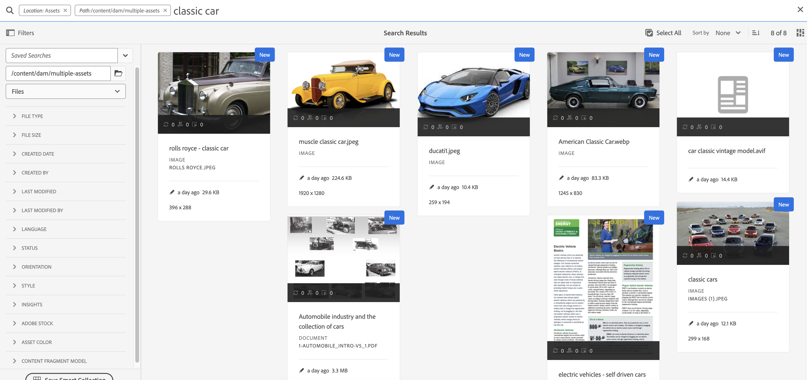
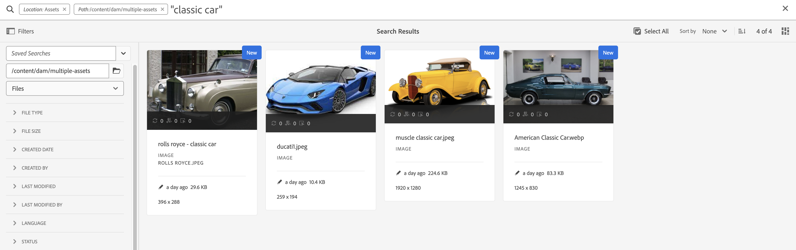

# AEM Assets 검색 우수 사례

| [메타데이터 모범 사례](/help/assets/metadata-best-practices.md) | [Content Hub](/help/assets/product-overview.md) | [OpenAPI 기능이 있는 Dynamic Media](/help/assets/dynamic-media-open-apis-overview.md) | [AEM Assets 개발자 설명서](https://developer.adobe.com/experience-cloud/experience-manager-apis/) |
| --------------------------- |---------|----|-----|

[!DNL Adobe Experience Manager Assets]은(는) 콘텐츠 속도를 높이는 데 도움이 되는 강력한 에셋 검색 방법을 제공합니다. 경우에 따라 적절한 자산을 찾는 것은 어렵고 시간이 많이 걸릴 수 있습니다. 따라서 [!DNL Adobe Experience Manager Assets]의 자산 검색 기능은 크리에이티브의 추가 사용, 비즈니스 사용자 및 마케터의 강력한 자산 관리 또는 DAM 관리자의 관리를 위한 디지털 자산 관리 시스템 사용의 중심입니다.

이 도움말 문서에는 AEM 사용자가 기본에서 고급 수준까지 검색을 수행하는 데 도움이 되는 다양한 시나리오의 도움말과 함께 AEM 검색 모범 사례가 포함되어 있습니다.

## Experience Manager 검색 액세스 {#access-experience-manager-search}

다음은 검색을 시작하기 전에 Experience Manager에서 수행하는 기본 단계입니다.

* **관리자 보기**에서 Assets > Experience Manager의 파일 로 이동하여 상단 막대의 검색 아이콘을 클릭합니다. 또는 슬래시(/)를 사용하여 옴니 검색 필드를 엽니다.
**Assets 보기**&#x200B;에서 검색 창이 맨 위에 표시되어 바로 액세스할 수 있습니다.
* 검색 범위를 Experience Manager Assets 저장소로 제한하기 위해 `Location:Assets` 및 `Path:/content/dam`을(를) 미리 선택했습니다. 다른 폴더로 이동하면 `Path:/content/dam/<folder name>`이(가) 옴니 검색 필드에 표시되어 검색 범위를 현재 폴더로 제한합니다.

## 기본 검색 {#basic-search}

**시나리오 1: `classic car`을(를) 검색 키워드로 사용하여 기본 검색을 수행합니다.**

키워드 검색은 대/소문자를 구분하지 않으며, Asset *전체 텍스트 검색* 인덱스에 포함된 메타데이터 필드(인덱스 정의에서 구성 가능)의 전체 텍스트 검색입니다. 두 개 이상의 키워드를 사용하는 경우 **AND가 키워드 사이의 기본 연산자이므로 &#39;classic car&#39; 검색은 &#39;classic AND car&#39;로 간주됩니다**.

메타데이터 필드의 모든 검색어와 일치하는 검색 결과가 먼저 표시되고, 스마트 태그의 검색어와 일치하는 검색 결과가 표시됩니다. 검색 결과가 표시되는 대략적인 순서는 다음과 같습니다.

1. 다양한 메타데이터 필드에 있는 `Classic Car`과(와) 일치합니다.
2. 스마트 태그의 `Classic Car` 일치 항목.
3. 스마트 태그의 `Classic` 또는 `Car`과(와) 일치

`classic car`을(를) 검색 키워드로 지정하고 [검색]을 클릭하십시오. 키워드를 입력할 때 드롭다운 목록에서 검색 제안을 볼 수 있습니다. 검색 제안은 Experience Manager 배포에 있는 검색 색인의 콘텐츠를 기반으로 합니다. 드롭다운 메뉴에서 적절한 에셋을 볼 수 없는 경우 Enter 키를 눌러 결과 목록을 확인합니다. 결과는 가장 가까운 일치부터 시작하여 관련성을 기준으로 정렬됩니다.

<!---->

큰따옴표(&quot; &quot;)로 검색 키워드를 추가하여 검색을 보다 구체적으로 지정할 수 있습니다. 이 검색에는 지정된 용어를 함께 포함하는 Assets만 포함됩니다. 검색 기준은 `"classic car"`과(와) 비슷합니다. 따라서 `classic`와(과) `car` 검색어가 모두 포함된 검색 결과가 표시됩니다.

<!---->

**[!UICONTROL Assets 보기]**&#x200B;에서도 작업하는 경우 유사한 검색 결과가 표시됩니다.

>[!VIDEO](https://video.tv.adobe.com/v/3425489)

## 파일 및 폴더 {#files-folders}

**시나리오 2: `automobile` 폴더 내에서 `classic car` 키워드를 사용하여 모든 파일을 검색합니다.**

파일 및 폴더 필터는 검색 범위를 좁히는 데 도움이 됩니다. 요구 사항에 따라 드롭다운 목록에서 사용할 수 있는 파일, 폴더 또는 파일 및 폴더 옵션을 사용합니다. 파일, 폴더 또는 파일 및 폴더 중에서 선택하는 옵션은 **[!UICONTROL 관리자 보기]**&#x200B;에서만 액세스할 수 있습니다. **[!UICONTROL Assets 보기]**&#x200B;에서 [!UICONTROL 경로](으)로 이동하여 검색을 수행할 폴더를 찾습니다.

* 저장소 내의 특정 경로에 있는 파일을 특별히 검색해야 하는 경우 **[!UICONTROL 파일]** 옵션을 사용하십시오. 정의된 경로 내에서 폴더를 검색할 필요는 없습니다.
* 특정 경로에 있는 폴더로 검색을 제한하려면 **[!UICONTROL 폴더]** 옵션을 사용하십시오.
* 저장소 내의 지정된 경로에서 사용 가능한 모든 자산을 검색해야 하는 경우에는 **[!UICONTROL 파일 및 폴더]** 옵션을 사용하십시오.

이 시나리오를 달성하려면 아래 단계를 수행하십시오.

1. `classic car`을(를) 검색 키워드로 지정하고 [검색]을 클릭하십시오.
2. 필터 를 클릭하고 `automobile` 폴더의 폴더 경로를 정의합니다. 예: `/content/dam/multiple-assets/automobile`
경로에서 폴더를 선택하고 특정 폴더에서 검색하려면 필요한 폴더로 이동합니다.
3. 키워드 `classic car`이(가) 있는 모든 파일을 표시하려면 드롭다운 목록에서 파일 을 선택합니다.

<!---->

>[!VIDEO](https://video.tv.adobe.com/v/3425487)

## 연산자 {#operators}

**시나리오 3: 검색 범위를 좁히기 위해 다양한 연산자 조합을 사용하여 `Classic Car` 또는 `Car` 키워드를 검색합니다.**

**[!UICONTROL 관리자 보기]**&#x200B;에서 위의 시나리오를 실행하려면 다양한 연산자의 조합을 사용하여 검색 환경을 개선할 수 있습니다. 지원되는 연산자는 다음과 같습니다.

### AND 연산자 {#and-operator}

AND 연산자는 옴니 검색에서 두 키워드 사이의 기본 연산자입니다. 예를 들어 검색 창에 `classic car`을(를) 입력하면 기본적으로 `classic` 및 `car` 키워드가 있는 결과가 검색 결과에 나타납니다.

### OR 연산자 {#or-operator}

검색 결과를 구체화하고 검색 결과에 옵션을 사용하려는 경우 OR 연산자를 사용할 수 있습니다. 예를 들어 `classic OR car` 키워드는 메타데이터에 있는 키워드 중 하나를 사용하여 검색 결과를 제공합니다.

### NOT 연산자 {#not-operator}

일부 키워드를 제외한 결과를 검색하려는 경우 NOT 연산자를 사용할 수 있습니다. NOT 연산자는 하이픈(-) 기호를 사용하여 검색 결과에서 제외할 항목을 AEM 검색으로 보냅니다. 예를 들어 `car`이(가) 포함되어 있지만 `classic`을(를) 제외한 메타데이터를 지정하는 `car - classic` 검색 쿼리입니다.

마찬가지로 모든 자동차를 검색할 수 있지만 지프는 검색할 수 없습니다. 쿼리는 `car - jeep`과(와) 같습니다. 메타데이터가 `car`인 모든 자산을 표시하지만 메타데이터가 `jeep`인 자산은 제외합니다.

**[!UICONTROL Assets 보기]**&#x200B;에서는 연산자 사용을 지원하지 않습니다.

## 와일드카드 {#wildcards}

와일드카드는 검색에서 하나 이상의 문자를 바꾸는 데 사용됩니다. **[!UICONTROL 관리자 보기]**&#x200B;에서 위의 시나리오를 실행하려면 다양한 와일드카드를 조합하여 검색 환경을 개선할 수 있습니다. 검색을 수행하는 데 사용되는 와일드카드에는 물음표(?)가 있습니다. 및 별표(*)를 사용할 수 있습니다. 물음표 기호는 단일 문자를 검색하는 데 사용되는 반면 별표 기호는 여러 문자를 검색하는 데 사용됩니다.

### 물음표(?) {#question-mark}

물음표 기호는 Experience Manager에서 쉽게 검색할 수 있도록 조건부 연산자로 사용할 수 있습니다.

* `car?` 쿼리가 단어 뒤에 한 문자가 있는 단어와 일치합니다. 예: 장바구니
* `?car` 쿼리가 단어 앞에 한 문자가 있는 단어와 일치합니다. 예를 들면, 흉터.
* `car????` 쿼리가 car 뒤에 4자가 있는 단어와 일치합니다. 예를 들면 세차입니다.

### 별표(*) {#asterisk}

별표는 적은 문자를 입력하여 검색 범위를 넓히는 데 사용되는 와일드카드 연산자입니다. 검색 중인 에셋의 시작 문자는 알고 있지만 나머지 문자는 모르는 경우 검색에 별표 연산자를 사용할 수 있습니다. 예를 들어 `*car` 쿼리는 메타데이터에 사용 가능한 후위 자동차가 있는 모든 자산을 반환합니다. 그 결과는 클래식 카, 스포츠 카, 클래식 및 스포츠 카 등이 될 수 있습니다. 다음은 다양한 방법으로 별표 연산자를 사용하는 몇 가지 예입니다.

* `*car*`은(는) 가능한 모든 조합을 반환합니다.
* `car*`은(는) 세차, 통신사, 캐리지 등이 있는 자산을 반환합니다.
* `*car`이(가) 최신 자동차, 스포츠 자동차 등으로 자산을 반환합니다.

>[!VIDEO](https://video.tv.adobe.com/v/3425488)

**[!UICONTROL Assets 보기]**&#x200B;에서는 와일드카드 사용을 지원하지 않습니다.

## 필터 {#filters}

Adobe Experience Manager은 범위 쿼리를 사용하여 검색을 구체화하고 세그먼트화하는 데 사용할 수 있는 다양한 검색 필터를 제공합니다. 에셋의 제목이나 메타 설명에 대해 잘 모르는 경우 다양한 검색 필터를 사용하여 검색의 관련성을 높일 수 있습니다. 키워드를 입력하거나 입력하지 않고 검색 필터를 사용할 수 있습니다. **[!UICONTROL 관리자 보기]**&#x200B;에서 필터 패널을 열려면 **GlobalNav** 아이콘을 클릭하고 **[!UICONTROL 필터]**&#x200B;를 선택하십시오. 반면, **[!UICONTROL Assets 보기]**&#x200B;에서 필터 패널을 열려면 검색 창 옆의 [!UICONTROL 필터]을 클릭하세요.

단일 또는 여러 필터를 선택하여 Adobe Experience Manager에서 검색을 개선할 수 있습니다.
<!--The following filters are available out of the box for all the users of Experience Manager:

* File Type Search Filters  
* File Size Search Filters 
* Date of Creation 
* Created by 
* Last Modified date 
* Last Modified by 
* Search by Language 
* Search by Status 
* Search based on Orientation 
* Search by Style 
* Search based on insights 
* Search by Adobe Stock 
* Color specific Asset search 
* Content fragment model 
 -->

<!--**Scenario 5: Search for an Asset named 'classic car' in Black color which has either meta description or a similar asset in Japanese language.**  
 
To perform a search on such a requirement, type 'classic car' in the search bar.  Navigate to the filters panel and expand the language search filter drop-down. Type "ja-jp", which represents the Japanese language. Expand the 'Asset Color' filter and select black color or add the hexadecimal code for the black color (#000000).

-->

**시나리오 4: `classic car` 키워드가 포함된 게시되지 않은 PDF 파일 형식 문서를 검색합니다.**

**[!UICONTROL 관리자 보기]**&#x200B;에서 다음 단계를 실행하십시오.

1. 검색 창에 `classic car`을(를) 입력합니다.
1. 필터로 이동합니다. [!UICONTROL 파일 형식]에서 [!UICONTROL 문서]를 확장하고 [!UICONTROL 워드 프로세싱]을 추가로 확장합니다.
1. [!UICONTROL PDF]을(를) 선택하십시오.
1. [!UICONTROL 상태] > [!UICONTROL Publish] > [!UICONTROL 게시 취소](으)로 이동합니다.

<!---->

**[!UICONTROL Assets 보기]**&#x200B;에서 다음 단계를 실행하십시오.

1. 검색 창에 `classic car`을(를) 입력합니다.
1. 필터로 이동합니다. [!UICONTROL MIME 유형]에서 [!UICONTROL PDF]을(를) 선택합니다.
1. [!UICONTROL 에셋 상태](으)로 이동하고 [!UICONTROL 모두]를 선택하여 게시된 에셋과 게시되지 않은 에셋을 모두 포함합니다.

**시나리오 5: PNG를 제외한 모든 이미지 검색**

에셋의 제목이나 메타 설명에 대해 잘 모르는 경우 다양한 검색 필터를 사용하여 검색의 관련성을 높일 수 있습니다. 예를 들어 **[!UICONTROL 관리자 보기]**&#x200B;에서 자산을 검색하려면 아래 단계를 따르십시오.

1. 검색 필터로 이동합니다.
1. 필터로 이동합니다. [!UICONTROL 파일 형식]에서 [!UICONTROL 이미지]를 확장하고 [!UICONTROL 웹 사용]을 선택합니다.
1. PNG를 선택 취소합니다.

<!---->

**[!UICONTROL Assets 보기]**&#x200B;에서 언급된 시나리오를 사용하여 자산을 검색하려면 아래 단계를 수행하십시오.

1. 검색 필터로 이동합니다.
1. 필터로 이동합니다. [!UICONTROL MIME 유형]에서 제공된 모든 MIME 유형을 선택하되 PNG는 선택 취소합니다.

>[!VIDEO](https://video.tv.adobe.com/v/3425486)

## 고급 검색 {#advanced-search}

AEM 검색을 사용하면 적은 노력으로 복잡한 검색 쿼리를 만들 수 있습니다. 다음은 복잡한 검색 쿼리를 만드는 데 도움이 되는 다양한 예입니다.

**시나리오 6: 메타데이터에서 `classic car`을(를) 사용하여 Experience Manager 저장소의 모든 문서를 검색합니다. 문서의 내용에 `classic car` 키워드가 포함되어야 합니다.**

Adobe Experience Manager을 사용하면 검색에 여러 기준을 추가할 수 있습니다. 키워드, 연산자 및 필터의 조합을 사용하여 검색 결과의 범위를 좁힐 수 있습니다.

시나리오 6에 대한 검색을 수행하려면 다음을 수행합니다.

1. 검색 창에 `classic car` 키워드를 입력합니다.
2. 필터 패널로 이동하고 파일 형식에서 문서 를 선택합니다.
3. 별표 와일드카드를 사용하여 검색을 구체화합니다. `classic car` 키워드가 포함된 모든 자산을 검색하려면 `"classic car"`을(를) 입력하십시오.

<!---->

시나리오 6은 와일드카드 사용을 지원하지 않으므로 **[!UICONTROL Assets 보기]**&#x200B;에서 실행할 수 없습니다.

**시나리오 7: Experience Manager 리포지토리에서 문서 내용에 `car`을(를) 포함하고 `classic`은(는) 제외해야 하는 모든 문서를 검색합니다. 자산의 메타데이터에도 같은 조건이 적용됩니다.**

시나리오 7에 대한 검색을 수행하려면 다음을 수행합니다.

검색 창에 `car - classic` 키워드를 입력합니다. 필터 패널로 이동하고 파일 형식에서 문서 를 선택합니다. 검색 우선 순위는 다음을 기반으로 합니다.
우선 순위 1: 메타데이터
우선 순위 2: 스마트 태그

<!---->

시나리오 7은 와일드카드 사용을 지원하지 않으므로 **[!UICONTROL Assets 보기]**&#x200B;에서 실행할 수 없습니다.

<!--
**Scenario 9: Search for all images except PNG**

When you are unsure about the title or meta description of an asset, you can use various search filters to make your search more relevant. Follow the steps below:

1. Go to search filters. 
1. Under [!UICONTROL File Type], expand [!UICONTROL Images] and select [!UICONTROL Web enabled]
1. Deselect PNG.

**Method 1:** Go to search bar and type `images - PNG`. All the images appear excluding PNG.

**Method 2:** Go to search filters. Under [!UICONTROL File Type], expand [!UICONTROL Images] > select [!UICONTROL Web enabled] > deselect PNG.

-->

**시나리오 8: 메타데이터 지프를 사용하여 메타데이터 태그 검색**

다양한 검색 필터를 사용하여 특정 기준을 캡처할 수 있습니다. 태그는 많은 에셋 간에 식별할 수 있도록 에셋에 할당되는 키워드입니다. 예를 들어 이 시나리오에서는 *jeep* 태그가 포함된 자산을 검색합니다. 이렇게 하려면 검색 창에 `tags:jeep`을(를) 입력하십시오. 이 기준을 충족하는 에셋만 검색 결과에 나열됩니다.

<!---->

**[!UICONTROL Assets 보기]**&#x200B;에서도 작업하는 경우 유사한 검색 결과가 표시됩니다.

>[!VIDEO](https://video.tv.adobe.com/v/3425490)

**시나리오 9: 빨간색 자동차에 대해 유사한 항목 찾기**

AEM에서 검색을 수행하는 동안 선택한 에셋과 유사한 에셋을 표시하여 결과를 필터링할 수 있습니다. **유사 항목 찾기** 옵션을 사용하여 검색된 에셋과 정확히 일치하거나 유사한 항목 검색 범위를 좁힐 수 있습니다. 이렇게 하면 선택한 에셋과 스마트 태그가 유사한 에셋을 찾을 수 있습니다. 예를 들어 동일한 에셋을 검색하려면 다음 단계를 수행하십시오.

1. 요구 사항에 따라 에셋을 검색합니다.
1. 자산 위로 마우스를 가져간 후 줄임표를 클릭하고 [!UICONTROL 유사 항목 찾기]를 선택합니다.
또는
에셋을 선택하고 오른쪽 상단의 생략 부호를 탐색한 다음 [!UICONTROL 유사 항목 찾기]를 선택합니다.

   

1. 검색 창을 확인합니다. 선택한 에셋의 썸네일이 검색 요구 사항을 나타내는 검색 막대에 표시됩니다. 그 결과 유사한 스마트 태그가 있는 에셋을 반환합니다.

**[!UICONTROL Assets 보기]**&#x200B;에서 다음 단계를 실행하십시오.

1. 요구 사항에 따라 에셋을 검색합니다.
1. 이미지 > 맨 위의 탐색 막대에서 [!UICONTROL 유사한 이미지 찾기] 옵션으로 이동합니다.
색상 및 메타데이터가 유사한 에셋 컬렉션으로 이동합니다.

## 사용자 정의 검색 패싯 {#custom-search-facets}

Adobe Experience Manager의 검색 패싯을 사용하면 단일, 사전 결정된 또는 분류 순서가 아닌 다양한 방법으로 자산을 검색할 수 있습니다. 필요에 따라 검색 패싯을 사용자 정의하고 술어를 추가할 수 있습니다. 사용자 지정 술어 추가에 대한 단계별 안내서는 [검색 패싯](https://experienceleague.adobe.com/docs/experience-manager-cloud-service/content/assets/admin/search-facets.html?lang=en#)을 읽어 보십시오.

<!--**Scenario 10: Search assets based on Sku ID**
to be added later
-->

**시나리오 10: 마지막 수정 날짜 또는 만료 날짜를 기준으로 특정 자산을 검색합니다**

날짜 제한을 사용하면 기간 검색 필터를 사용하여 사용자 정의 검색 범위를 특정 기간으로 좁힐 수 있습니다. 위의 요구 사항을 검색하려면 검색 창에 `classic car`을(를) 입력하십시오. [!UICONTROL 만든 날짜] 및 [!UICONTROL 마지막으로 수정한 날짜] 날짜 필터에서 날짜 범위를 선택하십시오.

[!UICONTROL Assets 보기]에서도 작업하는 경우 유사한 검색 결과가 표시됩니다.

## 키워드 관련성 높이기 {#boosting-keywords}

특정 에셋에 대한 키워드의 관련성을 개선하여 키워드를 기반으로 검색을 강화할 수 있습니다. 즉, 특정 키워드를 홍보하는 이미지는 해당 키워드를 기반으로 검색할 때 검색 결과의 맨 위에 나타납니다.

1. From the Assets user interface, open the properties page for the asset. [!UICONTROL 고급]을 클릭하고 [!UICONTROL 검색 키워드에 대한 개선]에서 [!UICONTROL 추가]을 클릭합니다.
2. [검색 승격] 상자에서 이미지 검색을 강화할 키워드를 지정한 다음 [!UICONTROL 추가]를 클릭합니다. 동일한 방법으로 여러 키워드를 지정할 수 있습니다.
3. [!UICONTROL 저장 및 닫기]를 클릭합니다. 이 키워드에 대해 홍보한 자산이 상위 검색 결과 중에 나타납니다.

## Experience Manager에서 검색 수행 중 주목할 만한 사항 {#notable-things}

* 옴니 검색 알고리즘으로 검색할 수 있는 에셋을 준비하려면 에셋의 메타데이터 정보를 제공합니다. 에셋의 메타데이터 정보가 업데이트되었는지 확인합니다.
* 큰 따옴표(&quot; &quot;)를 사용하여 정확하게 검색되도록 합니다.
* 찾고 있는 경로를 상호 확인합니다. 적절한 위치에서 검색 쿼리를 실행하려면 폴더, 파일 또는 파일 및 폴더 중에서 적절한 옵션을 선택합니다.
* 옴니 검색 창에서 검색에 적용하는 필터를 확인할 수 있습니다.
* 결과를 얻지 못한 경우 들여다보고 있는 경로를 상호 확인하십시오. 또한 검색을 수행하는 폴더를 확인합니다. 예를 들어 &#39;자동차 폴더&#39; 내에서 검색을 수행하고 있지만 사용 중인 키워드가 &#39;apparels&#39;와 관련된 경우 검색 결과가 부적절합니다.
* 검색 중인 키워드 앞에 공백을 추가한 경우 체크 인합니다.
* 키워드, 연산자 및 필터를 혼합하여 사용하면 검색 환경을 더욱 쉽고 평평하게 만들 수 있습니다.

<!--
* Use stemming search approach while searching for the asset. It means using an exact keyword that you are looking for.
* Specify Smart tags to the asset properties to boost the ranking of the search results.
The newly added assets are not indexed.
-->

## [!UICONTROL 관리자 보기]와(과) [!UICONTROL Assets 보기] 검색 간의 차이점 {#differences-asset-and-admin-view}

<table>
    <tr>
        <th> 매개변수 </th>
        <th> 관리자 보기 </th>
        <th> 자산 보기 </th>
    </tr>
    <tr>
        <td> 사용자 지정 패싯 </td>
        <td> 요구 사항에 따라 <a href="https://experienceleague.adobe.com/docs/experience-manager-cloud-service/content/assets/admin/search-facets.html?lang=en">사용자 지정 검색 패싯을 추가할 수 있습니다.</td>
        <td> 사용자 지정 패싯은 Assets 보기에서 부분적으로 지원됩니다. 지원되는 패싯은 다음과 같습니다.
            <ul>
            <li> 예측된 태그
            <li> 이름
            <li> 예측된 태그 신뢰도
            <li> 자산 크기
            <li> 제목
            </ul>
        </td>
    </tr>
    <tr>
        <td> 연산자 </td>
        <td> 지원 AND, OR 및 NOT </td>
        <td> 지원되지 않음 </td>
    </tr>
    <tr>
        <td> 와일드카드 </td>
        <td> 물음표(?)를 지원합니다. 별표(*)를 포함합니다.</td>
        <td> 지원되지 않음 </td>
    </tr>
    <tr>
        <td> 검색 결과 증폭 </td>
        <td> 지원됨 </td>
        <td> 지원되지 않음 </td>
    </tr>
     <tr>
        <td> 한 번에 모든 필터 지우기 </td>
        <td> 지원되지 않음 </td>
        <td> 지원됨</td>
    </tr>
     <tr>
        <td> 파일/폴더/파일 및 폴더 </td>
        <td> 지원됨 </td>
        <td> 폴더를 선택하는 옵션은 "파일 유형"에서 사용할 수 있습니다. </td>
    </tr>
     <tr>
        <td> 자산 상태 </td>
        <td> 
            지원되는 옵션은 다음과 같습니다.
            <ul>
            <li> 게시
            <li> 게시한 날짜
            <li> 마지막으로 게시한 사람
            <li> 승인 
            <li> 체크아웃
            <li> 만료
            <li> Dynamic Media
            </ul>
        </td>
        <td>
        지원되는 옵션은 다음과 같습니다.
            <ul>
            <li> 모두
            <li> 승인됨
            <li> 거부됨
            <li> 상태 없음
            </ul> 
        </td>
    </tr>
     <tr>
        <td> 파일 유형 </td>
        <td>
        지원되는 옵션은 다음과 같습니다.
            <ul>
            <li> 이미지
            <li> 문서
            <li> 멀티미디어
            <li> 아카이브 
            </ul>
            여기에는 추가적인 계층 옵션이 있습니다.
        </td>
        <td>
        지원되는 옵션은 다음과 같습니다.
            <ul>
            <li> 이미지
            <li> 문서
            <li> 비디오
            <li> 폴더 
            </ul> 
        추가 옵션은 MIME 유형 아래에 나열됩니다.
        </td>
    </tr>
     <tr>
        <td> 파일 크기 </td>
        <td>
        지원되는 옵션은 다음과 같습니다.
            <ul>
            <li> 시작 - 종료
            <li> 크기(바이트, KB, MB, GB)
            </ul> 
        </td>
        <td> 지원되지 않음 </td>
    </tr>
     <tr>
        <td> 기타 필터 </td>
        <td>
            <ul>
            <li> 언어
            <li> 상태
            <li> 방향
            <li> 스타일 
            <li> Insights
            <li> 재고
            <li> 에셋 색상
            <li> 콘텐츠 조각 모델
            </ul> 
        </td>
        <td> 지원되지 않음 </td>
    </tr>
</table>

>[!MORELIKETHIS]
>
>* [자산 검색](https://experienceleague.adobe.com/docs/experience-manager-cloud-service/content/assets/manage/search-assets.html?lang=en)
>* [검색 패싯](https://experienceleague.adobe.com/docs/experience-manager-cloud-service/content/assets/admin/search-facets.html?lang=en)
