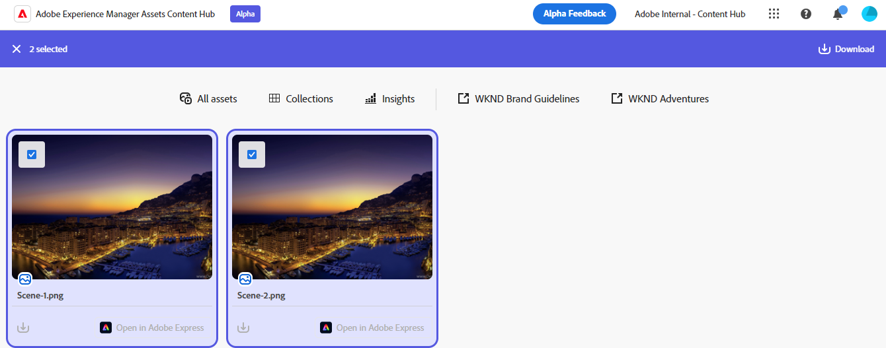

# Content Hub에서 자산 공유 {#search-assets-as-a-link}

| [모범 사례 검색](/help/assets/search-best-practices.md) | [메타데이터 모범 사례](/help/assets/metadata-best-practices.md) | [Content Hub](/help/assets/product-overview.md) | [OpenAPI 기능이 있는 Dynamic Media](/help/assets/dynamic-media-open-apis-overview.md) | [AEM Assets 개발자 설명서](https://developer.adobe.com/experience-cloud/experience-manager-apis/) |
| ------------- | --------------------------- |---------|----|-----|

링크를 통해 자산을 공유하면 [!DNL the Content Hub]명의 사용자가 리소스를 편리하게 사용할 수 있습니다. 이 기능을 사용하면 인가된 사용자가 공유된 에셋에 액세스하고 다운로드할 수 있습니다. 공유 링크에서 자산을 다운로드할 때 [!DNL the Content Hub]은(는) 더 빠르고 중단 없는 다운로드를 제공하는 비동기 서비스를 사용합니다.

## 사전 요구 사항 {#prerequisites}

[Content Hub 사용자](deploy-content-hub.md#onboard-content-hub-users)는 이 문서에 언급된 작업을 수행할 수 있습니다.

## 단일 자산 공유 {#share-a-single-asset}

다음 단계를 실행하여 단일 자산을 공유할 수 있습니다.

1. 에셋을 선택하고  아이콘을 클릭하여 에셋을 공유하십시오.

   

1. **[!UICONTROL Expiration]** 필드를 사용하여 링크의 만료 날짜를 지정하십시오. 사용 가능한 옵션(예: 24시간, 1주, 30일, 90일, 1년) 중 하나를 선택하거나 사용자 지정 날짜를 지정합니다.

1. **[!UICONTROL 공유 링크 복사]**&#x200B;를 클릭합니다. 그런 다음 복사한 링크를 수신자와 공유할 수 있습니다.

## 여러 에셋 공유 {#share-multiple-assets}

[!DNL The Content Hub]에서 공유 링크를 통해 여러 자산을 공유할 수 있습니다. 다음 단계를 실행합니다.

1. 승인된 수신자와 공유해야 하는 자산을 선택합니다. 여러 자산을 하나씩 선택하거나 **[!UICONTROL 모두 선택]**&#x200B;을 클릭하여 사용 가능한 모든 자산을 한 번에 선택할 수 있습니다. **[!UICONTROL 모두 선택]** 옵션은 하나 이상의 자산을 선택하는 경우에만 표시됩니다.

1.  아이콘을 클릭합니다.

   

1. 미리보기 섹션에서 요구 사항에 따라 에셋을 삭제할 수도 있습니다. **[!UICONTROL Expiration]** 필드를 사용하여 링크의 만료 날짜를 지정하십시오. 사용 가능한 옵션(예: 24시간, 1주, 30일, 90일, 1년) 중 하나를 선택하거나 사용자 지정 날짜를 지정합니다.

1. **[!UICONTROL 공유 링크 복사]**&#x200B;를 클릭합니다. 그런 다음 복사한 링크를 수신자와 공유할 수 있습니다.

## 에셋 미리보기 및 공유 {#preview-assets}

링크 수신자와 공유하기 전에 공유하려는 디지털 에셋이 어떻게 보이는지 미리 볼 수 있습니다. 미리 보아야 하는 에셋을 클릭합니다. [!DNL Content Hub]은(는) 에셋에 대한 [자세히 보기를 표시합니다](asset-properties-content-hub.md).

자산을 공유하려면  아이콘을 클릭하십시오. **[!UICONTROL Expiration]** 필드를 사용하여 링크의 만료 날짜를 지정하십시오. 사용 가능한 옵션(예: 24시간, 1주, 30일, 90일, 1년) 중 하나를 선택하거나 사용자 지정 날짜를 지정합니다. **[!UICONTROL 공유 링크 복사]**&#x200B;를 클릭합니다. 그런 다음 복사한 링크를 수신자와 공유할 수 있습니다.

## 공유 자산에 액세스 {#access-shared-assets}

에셋에 대한 링크를 공유하면 승인된 수신자는 해당 링크를 클릭하여 웹 브라우저에서 공유 에셋을 미리 보거나 다운로드할 수 있습니다.

공유 링크를 클릭하고 에셋 카드에 있는 다운로드 아이콘 을 클릭하여 에셋을 다운로드합니다.  여러 자산을 선택하고 **[!UICONTROL 다운로드]**&#x200B;를 클릭할 수도 있습니다. <!--You can either download original assets or Original+Renditions of an asset.--> [!DNL The Content Hub]이(가) 로컬 파일 시스템에 각 자산을 하나씩 다운로드합니다.

