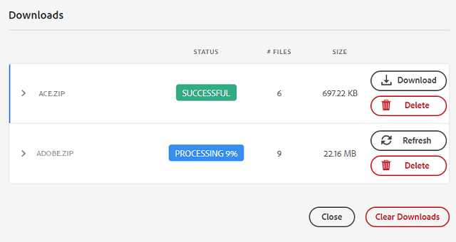

# 에서 관리되는 에셋 공유 및 분배 [!DNL Experience Manager] {#share-assets-from-aem}

| 버전 | 문서 링크 |
| -------- | ---------------------------- |
| AEM 6.5 | [여기 클릭](https://experienceleague.adobe.com/docs/experience-manager-65/assets/administer/link-sharing.html?lang=en) |
| AEM as a Cloud Service | 이 문서 |

[!DNL Adobe Experience Manager Assets] 에셋, 폴더 및 컬렉션을 조직 구성원 및 외부 엔터티(파트너 및 공급업체 포함)와 공유할 수 있습니다. 다음 메서드를 사용하여 자산 공유 [!DNL Experience Manager Assets] as a [!DNL Cloud Service]:

* [링크로 공유](#sharelink).
* [에셋 다운로드](/help/assets/download-assets-from-aem.md) 따로 나눠주세요
* 다음을 사용하여 공유 [[!DNL Experience Manager] 데스크탑 앱](https://experienceleague.adobe.com/docs/experience-manager-desktop-app/using/introduction.html).
* 다음을 사용하여 공유 [[!DNL Adobe Asset Link]](https://www.adobe.com/kr/creativecloud/business/enterprise/adobe-asset-link.html).
* 다음을 사용하여 공유 [[!DNL Brand Portal]](https://experienceleague.adobe.com/docs/experience-manager-brand-portal/using/introduction/brand-portal.html).

## 링크로 자산 공유 {#sharelink}

링크를 통해 에셋을 공유하면 외부 당사자, 마케터 및 기타 사용자가 리소스를 사용할 수 있는 편리한 방법입니다 [!DNL Experience Manager] 사용자. 이 기능을 사용하면 익명 사용자가 공유된 에셋에 액세스하고 다운로드할 수 있습니다. 공유 링크에서 에셋을 다운로드할 때 [!DNL Experience Manager Assets] 는 빠르고 중단 없는 다운로드를 제공하는 비동기 서비스를 사용합니다. 다운로드할 자산은 관리 가능한 파일 크기의 ZIP 아카이브에 백그라운드로 대기됩니다. 대규모 다운로드의 경우 다운로드는 파일 크기당 100GB의 여러 파일로 번들로 제공됩니다.

<!--
Users with administrator privileges or with read permissions at `/var/dam/share` location are able to view the links shared with them. 
-->

>[!NOTE]
>
>* 링크로 공유할 폴더 또는 에셋에 대한 ACL 편집 권한이 필요합니다.
>* [아웃바운드 이메일 활성화](/help/implementing/developing/introduction/development-guidelines.md#sending-email) 을(를) 방문자와 공유하기 전에.

링크 공유 기능을 사용하여 에셋을 공유하는 방법에는 두 가지가 있습니다.

1. 공유 링크 생성, [에셋 링크 복사 및 공유](#copy-and-share-assets-link) (다른 사용자와 함께) 링크의 기본 만료 시간은 1일입니다. 복사된 링크를 다른 사용자와 공유할 때 만료 시간을 변경할 수 없습니다.

1. 공유 링크 생성 및 [이메일을 통해 에셋 링크 공유](#share-assets-link-through-email). 이 경우 만료 날짜 및 시간과 같은 기본값을 수정하고 원본 에셋과 렌디션을 다운로드할 수 있습니다. 이메일 주소를 추가하여 여러 사용자에게 이메일을 보낼 수 있습니다.

   

### 에셋 링크 복사 및 공유{#copy-and-share-asset-link}

자산을 공개 URL로 공유하려면 다음을 수행하십시오.

1. 에 로그인 [!DNL Experience Manager Assets] 다음 위치로 이동 **[!UICONTROL 파일]**.
1. 에셋 또는 에셋을 포함하는 폴더를 선택합니다. 도구 모음에서 를 클릭합니다 **[!UICONTROL 링크 공유]**.
1. 다음 **[!UICONTROL 링크 공유]** 에서 자동 생성된 에셋 링크가 포함된 대화 상자가 나타납니다. **[!UICONTROL 링크 공유]** 필드.
1. 에셋 링크를 복사하여 사용자와 공유합니다.

### 이메일 알림을 통해 에셋 링크 공유 {#share-assets-link-through-email}

이메일을 통해 에셋을 공유하려면:

1. 에셋 또는 에셋을 포함하는 폴더를 선택합니다. 도구 모음에서 를 클릭합니다 **[!UICONTROL 링크 공유]**.
1. 다음 **[!UICONTROL 링크 공유]** 에서 자동 생성된 에셋 링크가 포함된 대화 상자가 나타납니다. **[!UICONTROL 링크 공유]** 필드.

   * 이메일 주소 상자에 링크를 공유할 사용자의 이메일 ID를 입력합니다. You can share the link with multiple users. 사용자가 조직의 멤버인 경우 드롭다운 목록에 표시되는 제안 사항에서 이메일 ID를 선택합니다. 사용자가 외부 사용자인 경우 전체 이메일 ID를 입력하고 키를 누릅니다 **[!UICONTROL 입력]**; 이메일 ID가 사용자 목록에 추가됩니다.

   * 다음에서 **[!UICONTROL 제목]** 상자에 제목을 입력하여 공유된 에셋의 용도를 지정합니다.
   * 다음에서 **[!UICONTROL 메시지]** 필요한 경우 상자에 메시지를 입력합니다.
   * 다음에서 **[!UICONTROL 만료]** 필드에서 날짜 선택기를 사용하여 링크의 만료 날짜 및 시간을 지정합니다.
   * 활성화 **[!UICONTROL 원본 파일 다운로드 허용]** 수신자가 원본 렌디션을 다운로드할 수 있도록 하려면 이 확인란을 선택합니다.

1. 클릭 **[!UICONTROL 공유]**. 링크가 사용자와 공유되었음을 확인하는 메시지가 표시됩니다. 사용자는 공유 링크가 포함된 이메일을 받습니다.

   

### 에셋 링크를 사용하여 에셋 다운로드

공유 에셋 링크에 대한 액세스 권한이 있는 모든 사용자는 zip 폴더에 번들로 제공된 에셋을 다운로드할 수 있습니다. 사용자가 복사된 에셋 링크에 액세스하든 아니면 이메일을 통해 공유된 에셋 링크를 사용하든 다운로드 프로세스는 동일합니다.

* 에셋 링크를 클릭하거나 브라우저에 URL을 붙여넣습니다. 다음 [!UICONTROL 링크 공유] 로 전환할 수 있는 인터페이스가 열립니다 [!UICONTROL 카드 보기] 또는 [!UICONTROL 목록 보기].

* 다음에서 [!UICONTROL 카드 보기]에서 공유 에셋 또는 공유 에셋 폴더에 마우스를 가져다 대고 에셋을 선택하거나 다운로드하도록 대기열에 추가할 수 있습니다.

* 기본적으로 사용자 인터페이스에는 **[!UICONTROL 받은 편지함 다운로드]** 옵션을 선택합니다. 상태는 다운로드 큐에 있는 모든 공유 에셋 또는 폴더의 목록을 반영합니다.

* 에셋 또는 폴더 선택 시 **[!UICONTROL 대기열 다운로드]** 옵션이 화면에 나타납니다. 다음을 클릭합니다. **[!UICONTROL 대기열 다운로드]** 옵션을 사용하여 다운로드 프로세스를 시작할 수 있습니다.

  

* 다운로드 파일이 준비되는 동안 **[!UICONTROL 받은 편지함 다운로드]** 다운로드 상태를 보는 옵션입니다. 대량 다운로드의 경우 **[!UICONTROL 새로 고침]** 상태를 업데이트하는 단추입니다.

  

* 처리가 완료되면 **[!UICONTROL 다운로드]** zip 파일을 다운로드하는 단추입니다.

<!--
You can also copy the auto-generated link and share it with the users. The default expiration time for the link is one day.
-->

>[!NOTE]
>
>공유 에셋을 다른 위치로 이동하면 해당 링크가 작동하지 않습니다. 링크를 다시 만들고 사용자와 다시 공유합니다.

<!--
## Share assets as a link {#sharelink}

To generate the URL for assets you want to share with users, use the Link Sharing dialog. Users with administrator privileges or with read permissions at `/var/dam/share` location are able to view the links shared with them. Sharing assets through a link is a convenient way of making resources available to external parties without them having to first log in to Experience Manager Assets.

>[!NOTE]
>
>* You need Edit ACL permission on the folder or the asset that you want to share as a link.
>* Before you share a link with users, ensure that Day CQ Mail Service is configured. Otherwise, an error occurs.

1. In the Assets user interface, select the asset to share as a link.
1. From the toolbar, click/tap the **[!UICONTROL Share Link]**.

   An asset link is auto-created in the **[!UICONTROL Share Link]** field. Copy this link and share it with the users. The default expiration time for the link is one day.

   Alternatively, proceed to perform steps 3-7 of this procedure to add email recipients, configure the expiration time for the link, and send it from the dialog.

   >[!NOTE]
   >
   >If a shared asset is moved to a different location, its link stops working. Re-create the link and re-share with the users.

1. From the web console, open the **[!UICONTROL Day CQ Link Externalizer]** configuration and modify the following properties in the **[!UICONTROL Domains]** field with the values mentioned against each:

    * local
    * author
    * publish

   For the local and author properties, provide the URL for the local and author instance respectively. Both local and author properties have the same value if you run a single Experience Manager author instance. For publish, provide the URL for the publish instance.

1. In the email address box of the **[!UICONTROL Link Sharing]** dialog, type the email ID of the user you want to share the link with. You can also share the link with multiple users.

   If the user is a member of your organization, select the user's email ID from the suggested email IDs that appear in the list below the typing area. For an external user, type the complete email ID and then select it from the list.

   To enable emails to be sent out to users, configure the SMTP server details in [Day CQ Mail Service](/help/assets/configure-asset-sharing.md#configmailservice).

   >[!NOTE]
   >
   >If you enter an email ID of a user that is not a member of your organization, the words "External User" are prefixed with the email ID of the user.

1. In the **[!UICONTROL Subject]** box, enter a subject for the asset you want to share.
1. In the **[!UICONTROL Message]** box, enter an optional message.
1. In the **[!UICONTROL Expiration]** field, specify an expiration date and time for the link using the date picker. By default, the expiration date is set for a week from the date you share the link.
1. To let users download the original image along with the renditions, select **[!UICONTROL Allow download of original file]**.

   >[!NOTE]
   >
   >By default, users can only download the renditions of the asset that you share as a link.

1. Click **[!UICONTROL Share]**. A message confirms that the link is shared with the users through an email.
1. To view the shared asset, click/tap the link in the email that is sent to the user. The shared asset is displayed in the **[!UICONTROL Adobe Marketing Cloud]** page.

   To toggle to the list view, click/tap the layout icon in the toolbar.

1. To generate a preview of the asset, click/tap the shared asset. To close the preview and return to the **[!UICONTROL Marketing Cloud]** page, click/tap **[!UICONTROL Back]** in the toolbar. If you have shared a folder, click/tap **[!UICONTROL Parent Folder]** to return to the parent folder.

   >[!NOTE]
   >
   >Experience Manager supports generating the preview of assets of these MIME types: JPG, PNG, GIF, BMP, INDD, PDF, and PPT. You can only download the assets of the other MIME types.

1. To download the shared asset, click/tap **[!UICONTROL Select]** from the toolbar, click/tap the asset, and then click/tap **[!UICONTROL Download]** from the toolbar.
1. To view the assets you shared as links, go to the Assets user interface and click/tap the GlobalNav icon. Choose **[!UICONTROL Navigation]** from the list to display the Navigation pane.
1. From the Navigation pane, choose **[!UICONTROL Shared Links]** to display a list of shared assets.
1. To un-share an asset, select it and tap/click **[!UICONTROL Unshare]** from the toolbar.

A message confirms that you unshared the asset. In addition, the entry for the asset is removed from the list.
-->

## 에셋 다운로드 및 개별 공유 {#download-and-share-assets}

사용자는 필요한 에셋을 다운로드하고 외부에서 공유할 수 있습니다. [!DNL Experience Manager]. 자세한 내용은 [에셋 검색 방법](/help/assets/search-assets.md), [에셋 다운로드 방법](/help/assets/download-assets-from-aem.md), 및 [컬렉션을 다운로드하는 방법](manage-collections.md#download-a-collection)

## 크리에이티브 전문가와 자산 공유 {#share-with-creatives}

마케터와 사업 부문 사용자는 다음을 사용하여 승인된 자산을 크리에이티브 전문가와 쉽게 공유할 수 있습니다.

* **Experience Manager 데스크탑 앱**: 앱이 Windows 및 Mac에서 작동합니다. 다음을 참조하십시오 [데스크탑 앱 개요](https://experienceleague.adobe.com/docs/experience-manager-desktop-app/using/introduction.html). 인증된 데스크탑 사용자가 공유 에셋에 쉽게 액세스할 수 있는 방법을 알려면 다음을 참조하십시오. [에셋 검색 및 미리보기](https://experienceleague.adobe.com/docs/experience-manager-desktop-app/using/using.html#browse-search-preview-assets). 데스크탑 사용자는 예를 들어 새 이미지를 업로드하여 에셋을 만든 후 Experience Manager 사용자인 상대 사용자와 다시 공유할 수 있습니다. 다음을 참조하십시오 [데스크탑 앱을 사용하여 자산 업로드](https://experienceleague.adobe.com/docs/experience-manager-desktop-app/using/using.html#upload-and-add-new-assets-to-aem).

* **Adobe 에셋 링크**: 크리에이티브 전문가는 내에서 직접 에셋을 검색하고 사용할 수 있습니다 [!DNL Adobe InDesign], [!DNL Adobe Illustrator], 및 [!DNL Adobe Photoshop].

## 자산 공유 구성 {#configure-sharing}

에셋을 공유하는 다양한 옵션은 특정 구성이 필요하며 특정 사전 요구 사항이 있습니다.

### 자산 링크 공유 구성 {#asset-link-sharing}

<!-- TBD: Web Console is not there so how to configure Day CQ email service? Or is it not required now? -->

사용자와 공유할 자산의 URL을 생성하려면 링크 공유 대화 상자를 사용합니다. 다음 위치에 관리자 권한이 있거나 읽기 권한이 있는 사용자: `/var/dam/share` 위치에서는 공유된 링크를 볼 수 있습니다. 링크를 통해 에셋을 공유하면 외부인에 먼저 로그인할 필요 없이 리소스를 사용할 수 있는 편리한 방법입니다 [!DNL Assets].

>[!NOTE]
>
>작성자 인스턴스의 링크를 외부 엔터티에 공유하려면 다음 URL만 노출해야 합니다 `GET` 요청. 작성자 인스턴스가 안전한지 확인하기 위해 다른 URL을 차단합니다.
>
>* `[aem_server]:[port]/linkshare.html`
>* `[aem_server]:[port]/linksharepreview.html`
>* `[aem_server]:[port]/linkexpired.html`

<!--
## Configure Day CQ mail service {#configmailservice}

Before you can share assets as links, configure the email service.

1. Click or tap the Experience Manager logo, and then navigate to **[!UICONTROL Tools]** &gt; **[!UICONTROL Operations]** &gt; **[!UICONTROL Web Console]**.
1. From the list of services, locate **[!UICONTROL Day CQ Mail Service]**.
1. Click the **[!UICONTROL Edit]** icon beside the service, and configure the following parameters for **Day CQ Mail Service]** with the details mentioned against their names:

    * SMTP server host name: email server host name
    * SMTP server port: email server port
    * SMTP user: email server user name
    * SMTP password: email server password

1. Click/tap **[!UICONTROL Save]**.
-->

<!-- TBD: Commenting as Web Console is not available. Document the appropriate OSGi config method if available in CS.
### Configure maximum data size {#maxdatasize}

When you download assets from the link shared using the Link Sharing feature, Experience Manager compresses the asset hierarchy from the repository and then returns the asset in a ZIP file. However, in the absence of limits to the amount of data that can be compressed in a ZIP file, huge amounts of data is subjected to compression, which causes out of memory errors in JVM. To secure the system from a potential denial of service attack due to this situation, you can configure the maximum size of the downloaded files. If uncompressed size of the asset exceeds the configured value, asset download requests are rejected. The default value is 100 MB.

1. Click/Tap the Experience Manager logo and then go to **[!UICONTROL Tools]** &gt; **[!UICONTROL Operations]** &gt; **[!UICONTROL Web Console]**.
1. From the web console, locate the **[!UICONTROL Day CQ DAM Adhoc Asset Share Proxy Servlet]** configuration.
1. Open the configuration in edit mode, and modify the value of the **[!UICONTROL Max Content Size (uncompressed)]** parameter.
1. Save the changes.
-->

<!--
Add content or link about how to configure sharing via BP, DA, AAL, etc.
-->

### 데스크탑 앱에서 사용할 데스크탑 작업 활성화 {#desktop-actions}

다음 범위 내에서 [!DNL Assets] 사용자 인터페이스 브라우저에서 자산 위치를 탐색하거나 데스크탑 애플리케이션에서 편집할 자산을 체크아웃하고 열 수 있습니다. 이러한 옵션을 데스크탑 작업이라고 하며 이를 활성화하려면 다음을 참조하십시오. [에서 데스크탑 작업 활성화 [!DNL Assets] 웹 인터페이스](https://experienceleague.adobe.com/docs/experience-manager-desktop-app/using/using.html#desktopactions-v2).

### 사용할 구성 [!DNL Adobe Asset Link] {#configure-asset-link}

Adobe Asset Link는 콘텐츠 작성 프로세스에서 크리에이티브와 마케터 간의 협업을 간소화합니다. 그것은 다음을 연결합니다 [!DNL Adobe Experience Manager Assets] 포함 [!DNL Creative Cloud] 데스크탑 앱 [!DNL Adobe InDesign], [!DNL Adobe Photoshop], 및 [!DNL Adobe Illustrator]. 다음 [!DNL Adobe Asset Link] 패널을 통해 크리에이티브가에 저장된 컨텐츠에 액세스하고 이를 수정할 수 있습니다. [!DNL Assets] 가장 익숙한 크리에이티브 앱을 종료하지 않고

다음을 참조하십시오 [구성 방법 [!DNL Assets] 함께 사용 [!DNL Adobe Asset Link]](https://helpx.adobe.com/kr/enterprise/using/configure-aem-assets-for-asset-link.html).

## 우수 사례 및 문제 해결 {#bestpractices}

* 이름에 공백이 포함된 에셋 폴더 또는 컬렉션은 공유되지 않을 수 있습니다.
* 사용자가 공유 에셋을 다운로드할 수 없는 경우 Experience Manager 관리자에게 다운로드 제한 사항을 확인하십시오. 기본값은 100MB입니다.
* 사용자가 링크 공유를 사용하여 공유되는 비디오를 미리 보려면 비디오에 사용할 수 있는 정적 비디오 렌디션이 있어야 합니다. `/jcr:content/renditions` 저장소의 비디오 노드에 있는 위치입니다. 미리보기는 의 가용성에 따라 달라지지 않습니다. [!DNL Dynamic Media] 렌디션.
* 링크 공유를 통해 비디오 에셋을 다운로드할 때 [!DNL Dynamic Media] 렌디션은 다운로드한 아카이브에 포함되지 않습니다.

<!--
* If you cannot send email with links to shared assets or if the other users cannot receive your email, check with your Experience Manager administrator if the [email service](/help/assets/configure-asset-sharing.md#configmailservice) is configured or not. 
* If you cannot share assets using link sharing functionality, ensure that you have the appropriate permissions. See [share assets](#sharelink).
-->

<!-- TBD: Add content or link about how to share using Brand Portal when it is available on [!DNL Cloud Service].
-->

**추가 참조**

* [자산 번역](translate-assets.md)
* [Assets HTTP API](mac-api-assets.md)
* [자산이 지원되는 파일 형식](file-format-support.md)
* [자산 검색](search-assets.md)
* [연결된 자산](use-assets-across-connected-assets-instances.md)
* [자산 보고서](asset-reports.md)
* [메타데이터 스키마](metadata-schemas.md)
* [자산 다운로드](download-assets-from-aem.md)
* [메타데이터 관리](manage-metadata.md)
* [검색 패싯](search-facets.md)
* [컬렉션 관리](manage-collections.md)
* [일괄 메타데이터 가져오기](metadata-import-export.md)