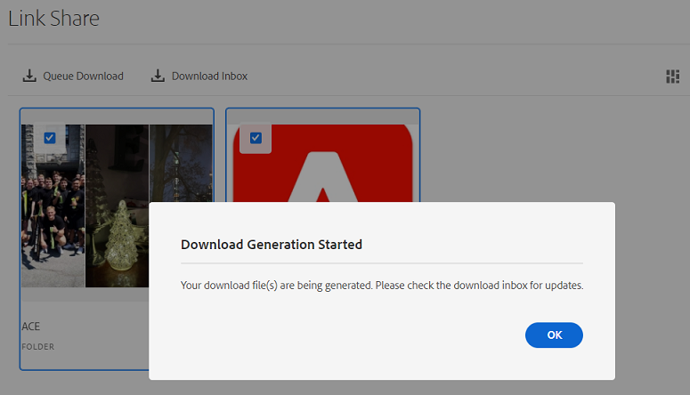

# [!DNL Experience Manager]에서 관리되는 에셋 공유 및 배포 {#share-assets-from-aem}

| 버전 | 문서 링크 |
| -------- | ---------------------------- |
| AEM 6.5 | [여기 클릭](https://experienceleague.adobe.com/docs/experience-manager-65/assets/administer/link-sharing.html?lang=en) |
| AEM as a Cloud Service | 이 문서 |

[!DNL Adobe Experience Manager Assets]을(를) 사용하면 조직 구성원 및 외부 엔터티(파트너 및 공급업체 포함)와 자산, 폴더 및 컬렉션을 공유할 수 있습니다. [!DNL Experience Manager Assets]의 자산을 [!DNL Cloud Service](으)로 공유하려면 다음 메서드를 사용하십시오.

* [링크로 공유](#sharelink).
* [자산을 다운로드](/help/assets/download-assets-from-aem.md)하고 별도로 공유합니다.
* [[!DNL Experience Manager] 데스크톱 앱](https://experienceleague.adobe.com/docs/experience-manager-desktop-app/using/introduction.html)을 사용하여 공유하세요.
* [[!DNL Adobe Asset Link]](https://www.adobe.com/kr/creativecloud/business/enterprise/adobe-asset-link.html)을(를) 사용하여 공유합니다.
* [[!DNL Brand Portal]](https://experienceleague.adobe.com/docs/experience-manager-brand-portal/using/introduction/brand-portal.html)을(를) 사용하여 공유합니다.

## 사전 요구 사항 {#prerequisites}

[링크로 자산을 공유하기 위한 설정을 구성](#config-link-share-settings)하려면 관리자 권한이 필요합니다.

## 링크 공유 설정 구성 {#config-link-share-settings}

[!DNL Experience Manager Assets]에서 기본 링크 공유 설정을 구성할 수 있습니다.

1. [!DNL Experience Manager] 로고를 클릭한 다음 **[!UICONTROL 도구]** > **[!UICONTROL Assets]** > **[!UICONTROL Assets 구성]** > **[!UICONTROL 링크 공유]**&#x200B;로 이동합니다.
1. 초기 설정:

   * **원본 포함:**

      * 링크 공유 대화 상자에서 기본적으로 `Include Originals` 옵션을 선택하려면 `Select Include Originals`을(를) 선택하십시오.
      * 링크 공유 대화 상자에서 `Include Originals` 옵션이 표시되는 방식을 선택하십시오. [!UICONTROL 편집 가능]을(를) 사용하면 초기 설정에서 정의된 설정을 변경할 수 있습니다. `Read-only`을(를) 사용하면 설정이 표시되지만 수정할 수 없습니다. `Hidden`은(는) 설정을 숨기고 초기 설정에서 여기에 구성된 값을 사용합니다.
   * **렌디션 포함:**
      * 링크 공유 대화 상자에서 기본적으로 `Include Renditions` 옵션을 선택하려면 `Select Include Renditions` 옵션을 선택하십시오.
      * 링크 공유 대화 상자에서 `Include Renditions` 옵션이 표시되는 방식을 선택하십시오. [!UICONTROL 편집 가능]을(를) 사용하면 초기 설정에서 정의된 설정을 변경할 수 있습니다. `Read-only`을(를) 사용하면 설정이 표시되지만 수정할 수 없습니다. `Hidden`은(는) 설정을 숨기고 초기 설정에서 여기에 구성된 값을 사용합니다.

1. `Expiration date` 섹션의 `Validity Period` 필드에 있는 링크에 대한 기본 유효 기간을 지정하십시오.

1. 작업 표시줄의 **[!UICONTROL 공유 연결]** 단추:
   * `jcr:modifyAccessControl` 권한이 있는 모든 사용자는 [!UICONTROL 공유 링크] 옵션을 볼 수 있습니다. 기본적으로 모든 관리자가 볼 수 있습니다. 기본적으로 [!UICONTROL 공유 연결] 단추가 모든 사람에게 표시됩니다. 정의된 그룹에 대해서만 이 옵션을 표시하도록 구성하거나 특정 그룹에서 이 옵션을 거부할 수도 있습니다. 특정 그룹에서 `Share Link` 옵션을 볼 수 있도록 하려면 `Allow only for groups`을(를) 선택하십시오. 특정 그룹의 `Share Link` 옵션을 거부하려면 `Deny from groups`을(를) 선택하십시오. 이러한 옵션 중 하나를 선택하면 `Select Groups` 필드를 사용하여 그룹 이름을 지정하여 허용하거나 거부해야 하는 그룹 이름을 추가합니다.

전자 메일 구성 관련 설정은 [전자 메일 서비스 설명서](https://experienceleague.adobe.com/docs/experience-manager-learn/cloud-service/networking/examples/email-service.html)를 참조하세요.


## 링크로 자산 공유 {#sharelink}

링크를 통해 자산을 공유하면 외부 당사자, 마케터 및 기타 [!DNL Experience Manager] 사용자가 리소스를 편리하게 사용할 수 있습니다. 이 기능을 사용하면 익명 사용자가 공유된 에셋에 액세스하고 다운로드할 수 있습니다. 공유 링크에서 자산을 다운로드할 때 [!DNL Experience Manager Assets]은(는) 더 빠르고 중단 없는 다운로드를 제공하는 비동기 서비스를 사용합니다. 다운로드할 자산은 관리 가능한 파일 크기의 ZIP 아카이브에 백그라운드로 대기됩니다. 대규모 다운로드의 경우 다운로드는 파일 크기당 100GB의 여러 파일로 번들로 제공됩니다.

<!--
Users with administrator privileges or with read permissions at `/var/dam/share` location are able to view the links shared with them. 
-->

>[!NOTE]
>
>* 링크로 공유할 폴더 또는 에셋에 대한 ACL 편집 권한이 필요합니다.
>* 사용자와 링크를 공유하기 전에 [아웃바운드 전자 메일 사용](/help/implementing/developing/introduction/development-guidelines.md#sending-email).

링크 공유 기능을 사용하여 에셋을 공유하는 방법에는 두 가지가 있습니다.

1. 공유 링크 [복사 및 자산 링크 ](#copy-and-share-assets-link)를 다른 사용자와 공유합니다.
1. 공유 링크를 생성하고 [이메일을 통해 자산 링크를 공유](#share-assets-link-through-email)합니다. 만료 날짜 및 시간과 같은 기본값을 수정하고 원본 에셋과 렌디션을 다운로드할 수 있습니다. 이메일 주소를 추가하여 여러 사용자에게 이메일을 보낼 수 있습니다.

   

두 경우 모두 만료 날짜 및 시간과 같은 기본값을 수정하고 원본 에셋과 렌디션을 다운로드할 수 있습니다.

### 에셋 링크 복사 및 공유{#copy-and-share-asset-link}

자산을 공개 URL로 공유하려면 다음을 수행하십시오.

1. [!DNL Experience Manager Assets]에 로그인하고 **[!UICONTROL 파일]**(으)로 이동합니다.
1. 에셋 또는 에셋을 포함하는 폴더를 선택합니다. 도구 모음에서 **[!UICONTROL 링크 공유]**&#x200B;를 클릭합니다.
1. **[!UICONTROL 링크 공유]** 필드에 자동 생성된 자산 링크가 포함된 **[!UICONTROL 링크 공유]** 대화 상자가 나타납니다.
1. 필요에 따라 공유 링크의 만료 날짜를 설정합니다.
1. **[!UICONTROL 링크 설정]**&#x200B;에서 `Include Originals` 또는 `Include Renditions`을(를) 선택하거나 선택 취소하여 둘 중 하나를 포함하거나 제외합니다. 최소 옵션 선택은 필수입니다.
1. 선택한 Assets의 이름이 [!DNL Share Link] 대화 상자의 오른쪽 열에 나타납니다.
1. 에셋 링크를 복사하여 사용자와 공유합니다.

### 이메일 알림을 통해 에셋 링크 공유 {#share-assets-link-through-email}

이메일을 통해 에셋을 공유하려면:

1. 에셋 또는 에셋을 포함하는 폴더를 선택합니다. 도구 모음에서 **[!UICONTROL 링크 공유]**&#x200B;를 클릭합니다.
1. **[!UICONTROL 링크 공유]** 필드에 자동 생성된 자산 링크가 포함된 **[!UICONTROL 링크 공유]** 대화 상자가 나타납니다.

   * 이메일 주소 상자에 링크를 공유할 사용자의 이메일 주소를 입력합니다. 여러 사용자와 링크를 공유할 수 있습니다. 사용자가 조직의 멤버인 경우 드롭다운 목록에 표시되는 제안 사항에서 이메일 주소를 선택합니다. 전자 메일 주소 텍스트 필드에 링크를 공유할 사용자의 전자 메일 주소를 입력하고 [!UICONTROL Enter]를 클릭합니다. 여러 사용자와 링크를 공유할 수 있습니다.

   * **[!UICONTROL 제목]** 상자에 제목을 입력하여 공유된 에셋의 용도를 지정합니다.
   * 필요한 경우 **[!UICONTROL 메시지]** 상자에 메시지를 입력하십시오.
   * **[!UICONTROL 만료]** 필드에서 날짜 선택기를 사용하여 링크의 만료 날짜와 시간을 지정합니다.
   * **[!UICONTROL 원본 파일 다운로드 허용]** 확인란을 사용하여 받는 사람이 원본 렌디션을 다운로드할 수 있도록 합니다.

1. **[!UICONTROL 공유]**&#x200B;를 클릭합니다. 링크가 사용자와 공유되었음을 확인하는 메시지가 표시됩니다. 사용자는 공유 링크가 포함된 이메일을 받습니다.

   

### 이메일 템플릿 사용자 지정 {#customize-email-template}

잘 설계된 템플릿은 전문성과 역량을 전달하여 메시지와 조직의 신뢰성을 향상시킵니다. [!DNL Adobe Experience Manager]을(를) 사용하면 공유 링크가 포함된 전자 메일을 받는 받는 사람에게 보낼 전자 메일 템플릿을 사용자 지정할 수 있습니다. 또한 사용자 지정된 이메일 템플릿을 사용하면 수신자의 이름을 지정하고 수신자와 관련된 특정 세부 정보를 참조하여 이메일 콘텐츠를 개인화할 수 있습니다. 이러한 개인적 접촉은 수신자로 하여금 가치를 느끼게 하고 참여를 높일 수 있다. 뿐만 아니라 맞춤형 템플릿을 사용하면 이메일이 로고, 색상 및 글꼴을 포함하여 브랜드 정체성과 일관성을 유지할 수 있습니다. 일관성은 수신자들 간의 브랜드 인지도와 신뢰를 강화합니다.

#### 사용자 지정된 이메일 템플릿 형식 {#format-of-custom-email-template}

이메일 템플릿은 일반 텍스트 또는 HTML을 사용하여 사용자 지정할 수 있습니다. 기본 편집 가능한 템플릿 링크는 `/libs/settings/dam/adhocassetshare/en.txt`에서 찾을 수 있습니다. `/apps/settings/dam/adhocassetshare/en.txt` 파일을 만들어 템플릿을 재정의할 수 있습니다. 이메일 템플릿은 필요한 만큼 수정할 수 있습니다.

| 플레이스홀더 | 설명 |
|---|-----|
| `${emailSubject}` | 이메일 제목 |
| `${emailInitiator}` | 이메일을 만든 사용자의 이메일 ID |
| `${emailMessage}` | 이메일 본문 |
| `${pagePath}` | 공유 링크의 URL |
| `${linkExpiry}` | 공유 링크 만료일 |

<!--| `${host.prefix}` | Origin of the [!DNL Experience Manager] instance, for example `http://www.adobe.com"` |-->

#### 사용자 지정된 이메일 템플릿 예 {#custom-email-template-example}

```
subject: ${emailSubject}

<!DOCTYPE html>
<html><body>
<p><strong>${emailInitiator}</strong> invited you to review assets.</p>
<p>${emailMessage}</p>
<p>The shared link will be available until ${linkExpiry}.
<p>
    <a href="${pagePath}" target="_blank"><strong>Open</strong></a>
</p>

</body></html>
```

<!--Sent from instance: ${host.prefix}-->

### 에셋 링크를 사용하여 에셋 다운로드 {#download-assets-using-asset-link}

공유 에셋 링크에 대한 액세스 권한이 있는 모든 사용자는 zip 폴더에 번들로 제공된 에셋을 다운로드할 수 있습니다. 사용자가 복사된 에셋 링크에 액세스하든 아니면 이메일을 통해 공유된 에셋 링크를 사용하든 다운로드 프로세스는 동일합니다.

* 에셋 링크를 클릭하거나 브라우저에 URL을 붙여넣습니다. [!UICONTROL 카드 보기] 또는 [!UICONTROL 목록 보기](으)로 전환할 수 있는 [!UICONTROL 링크 공유] 인터페이스가 열립니다.

* [!UICONTROL 카드 보기]에서 공유 에셋 또는 공유 에셋 폴더에 마우스를 가져다 대고 에셋을 선택하거나 다운로드하도록 대기열에 추가할 수 있습니다.

* 기본적으로 사용자 인터페이스는 **[!UICONTROL 받은 편지함 다운로드]** 옵션을 표시합니다. 상태는 다운로드 큐에 있는 모든 공유 에셋 또는 폴더의 목록을 반영합니다.

* 자산 또는 폴더를 선택하면 **[!UICONTROL 다운로드 큐]** 옵션이 화면에 나타납니다. 다운로드 프로세스를 시작하려면 **[!UICONTROL 다운로드 큐]** 옵션을 클릭하십시오.

  

* 다운로드 파일이 준비되는 동안 **[!UICONTROL 받은 편지함 다운로드]** 옵션을 클릭하여 다운로드 상태를 확인합니다. 대량 다운로드의 경우 **[!UICONTROL 새로 고침]** 단추를 클릭하여 상태를 업데이트하십시오.

  

* 처리가 완료되면 **[!UICONTROL 다운로드]** 단추를 클릭하여 zip 파일을 다운로드합니다.

<!--
You can also copy the auto-generated link and share it with the users. The default expiration time for the link is one day.
-->

>[!NOTE]
>
>공유 에셋을 다른 위치로 이동하면 해당 링크가 작동하지 않습니다. 링크를 다시 만들고 사용자와 다시 공유합니다.


<!--
## Share assets as a link {#sharelink}

To generate the URL for assets you want to share with users, use the Link Sharing dialog. Users with administrator privileges or with read permissions at `/var/dam/share` location are able to view the links shared with them. Sharing assets through a link is a convenient way of making resources available to external parties without them having to first log in to Experience Manager Assets.

>[!NOTE]
>
>* You need Edit ACL permission on the folder or the asset that you want to share as a link.
>* Before you share a link with users, ensure that Day CQ Mail Service is configured. Otherwise, an error occurs.

1. In the Assets user interface, select the asset to share as a link.
1. From the toolbar, click/tap the **[!UICONTROL Share Link]**.

   An asset link is auto-created in the **[!UICONTROL Share Link]** field. Copy this link and share it with the users. The default expiration time for the link is one day.

   Alternatively, proceed to perform steps 3-7 of this procedure to add email recipients, configure the expiration time for the link, and send it from the dialog.

   >[!NOTE]
   >
   >If a shared asset is moved to a different location, its link stops working. Re-create the link and re-share with the users.

1. From the web console, open the **[!UICONTROL Day CQ Link Externalizer]** configuration and modify the following properties in the **[!UICONTROL Domains]** field with the values mentioned against each:

    * local
    * author
    * publish

   For the local and author properties, provide the URL for the local and author instance respectively. Both local and author properties have the same value if you run a single Experience Manager author instance. For publish, provide the URL for the publish instance.

1. In the email address box of the **[!UICONTROL Link Sharing]** dialog, type the email ID of the user you want to share the link with. You can also share the link with multiple users.

   If the user is a member of your organization, select the user's email ID from the suggested email IDs that appear in the list below the typing area. For an external user, type the complete email ID and then select it from the list.

   To enable emails to be sent out to users, configure the SMTP server details in [Day CQ Mail Service](/help/assets/configure-asset-sharing.md#configmailservice).

   >[!NOTE]
   >
   >If you enter an email ID of a user that is not a member of your organization, the words "External User" are prefixed with the email ID of the user.

1. In the **[!UICONTROL Subject]** box, enter a subject for the asset you want to share.
1. In the **[!UICONTROL Message]** box, enter an optional message.
1. In the **[!UICONTROL Expiration]** field, specify an expiration date and time for the link using the date picker. By default, the expiration date is set for a week from the date you share the link.
1. To let users download the original image along with the renditions, select **[!UICONTROL Allow download of original file]**.

   >[!NOTE]
   >
   >By default, users can only download the renditions of the asset that you share as a link.

1. Click **[!UICONTROL Share]**. A message confirms that the link is shared with the users through an email.
1. To view the shared asset, click/tap the link in the email that is sent to the user. The shared asset is displayed in the **[!UICONTROL Adobe Marketing Cloud]** page.

   To toggle to the list view, click/tap the layout icon in the toolbar.

1. To generate a preview of the asset, click/tap the shared asset. To close the preview and return to the **[!UICONTROL Marketing Cloud]** page, click/tap **[!UICONTROL Back]** in the toolbar. If you have shared a folder, click/tap **[!UICONTROL Parent Folder]** to return to the parent folder.

   >[!NOTE]
   >
   >Experience Manager supports generating the preview of assets of these MIME types: JPG, PNG, GIF, BMP, INDD, PDF, and PPT. You can only download the assets of the other MIME types.

1. To download the shared asset, click/tap **[!UICONTROL Select]** from the toolbar, click/tap the asset, and then click/tap **[!UICONTROL Download]** from the toolbar.
1. To view the assets you shared as links, go to the Assets user interface and click/tap the GlobalNav icon. Choose **[!UICONTROL Navigation]** from the list to display the Navigation pane.
1. From the Navigation pane, choose **[!UICONTROL Shared Links]** to display a list of shared assets.
1. To un-share an asset, select it and tap/click **[!UICONTROL Unshare]** from the toolbar.

A message confirms that you unshared the asset. In addition, the entry for the asset is removed from the list.
-->

## 에셋 다운로드 및 개별 공유 {#download-and-share-assets}

필요한 에셋을 다운로드하고 [!DNL Experience Manager] 외부에서 공유할 수 있습니다. 자세한 내용은 [에셋을 검색하는 방법](/help/assets/search-assets.md), [에셋을 다운로드하는 방법](/help/assets/download-assets-from-aem.md) 및 [컬렉션을 다운로드하는 방법](manage-collections.md#download-a-collection)을 참조하십시오.

## 크리에이티브 전문가와 자산 공유 {#share-with-creatives}

마케터와 사업 부문 사용자는 다음을 사용하여 승인된 자산을 크리에이티브 전문가와 쉽게 공유할 수 있습니다.

* **Experience Manager 데스크톱 앱**: 앱이 Windows 및 Mac에서 작동합니다. [데스크톱 앱 개요](https://experienceleague.adobe.com/docs/experience-manager-desktop-app/using/introduction.html)를 참조하세요. 권한이 있는 데스크톱 사용자가 공유 자산에 쉽게 액세스할 수 있는 방법을 알아보려면 [자산 검색, 검색 및 미리 보기](https://experienceleague.adobe.com/docs/experience-manager-desktop-app/using/using.html#browse-search-preview-assets)를 참조하세요. 데스크탑 사용자는 예를 들어 새 이미지를 업로드하여 에셋을 만든 후 Experience Manager 사용자인 상대 사용자와 다시 공유할 수 있습니다. [데스크톱 앱을 사용하여 에셋 업로드](https://experienceleague.adobe.com/docs/experience-manager-desktop-app/using/using.html#upload-and-add-new-assets-to-aem)를 참조하십시오.

* **자산 링크 Adobe**: 크리에이티브 전문가는 [!DNL Adobe InDesign], [!DNL Adobe Illustrator] 및 [!DNL Adobe Photoshop] 내에서 직접 자산을 검색하고 사용할 수 있습니다.

## 자산 공유 구성 {#configure-sharing}

에셋을 공유하는 다양한 옵션은 특정 구성이 필요하며 특정 사전 요구 사항이 있습니다.

### 자산 링크 공유 구성 {#asset-link-sharing}

<!-- TBD: Web Console is not there so how to configure Day CQ email service? Or is it not required now? -->

사용자와 공유할 자산의 URL을 생성하려면 링크 공유 대화 상자를 사용합니다. 관리자 권한이 있거나 `/var/dam/share` 위치에서 읽기 권한이 있는 사용자는 사용자와 공유된 링크를 볼 수 있습니다. 링크를 통해 자산을 공유하면 [!DNL Assets]에 처음 로그인할 필요 없이 외부 당사자가 리소스를 사용할 수 있는 편리한 방법입니다.

>[!NOTE]
>
>작성자 인스턴스의 링크를 외부 엔터티에 공유하려면 `GET` 요청에 대해 다음 URL만 노출해야 합니다. 작성자 인스턴스가 안전한지 확인하기 위해 다른 URL을 차단합니다.
>
>* `[aem_server]:[port]/linkshare.html`
>* `[aem_server]:[port]/linksharepreview.html`
>* `[aem_server]:[port]/linkexpired.html`

<!--
1. From the list of services, locate **[!UICONTROL Day CQ Mail Service]**.
1. Click the **[!UICONTROL Edit]** icon beside the service, and configure the following parameters for **Day CQ Mail Service** with the details mentioned against their names:

    * SMTP server host name: email server host name
    * SMTP server port: email server port
    * SMTP user: email server user name
    * SMTP password: email server password
-->

<!-- TBD: Commenting as Web Console is not available. Document the appropriate OSGi config method if available in CS.
### Configure maximum data size {#maxdatasize}

When you download assets from the link shared using the Link Sharing feature, Experience Manager compresses the asset hierarchy from the repository and then returns the asset in a ZIP file. However, in the absence of limits to the amount of data that can be compressed in a ZIP file, huge amounts of data is subjected to compression, which causes out of memory errors in JVM. To secure the system from a potential denial of service attack due to this situation, you can configure the maximum size of the downloaded files. If uncompressed size of the asset exceeds the configured value, asset download requests are rejected. The default value is 100 MB.

1. Click/Tap the Experience Manager logo and then go to **[!UICONTROL Tools]** &gt; **[!UICONTROL Operations]** &gt; **[!UICONTROL Web Console]**.
1. From the web console, locate the **[!UICONTROL Day CQ DAM Adhoc Asset Share Proxy Servlet]** configuration.
1. Open the configuration in edit mode, and modify the value of the **[!UICONTROL Max Content Size (uncompressed)]** parameter.
1. Save the changes.
-->

<!--
Add content or link about how to configure sharing via BP, DA, AAL, etc.
-->

### 데스크탑 앱에서 사용할 데스크탑 작업 활성화 {#desktop-actions}

브라우저의 [!DNL Assets] 사용자 인터페이스 내에서 자산 위치를 탐색하거나 데스크탑 애플리케이션에서 편집할 자산을 체크아웃하고 열 수 있습니다. 이러한 옵션을 데스크톱 작업이라고 하며 사용하려면 [웹 인터페이스에서 데스크톱 작업 사용 [!DNL Assets] 2}을 참조하세요.](https://experienceleague.adobe.com/docs/experience-manager-desktop-app/using/using.html#desktopactions-v2)


### [!DNL Adobe Asset Link]을(를) 사용할 구성 {#configure-asset-link}

Adobe Asset Link는 콘텐츠 작성 프로세스에서 크리에이티브와 마케터 간의 협업을 간소화합니다. [!DNL Adobe Experience Manager Assets]을(를) [!DNL Creative Cloud] 데스크톱 앱, [!DNL Adobe InDesign], [!DNL Adobe Photoshop] 및 [!DNL Adobe Illustrator]과(와) 연결합니다. [!DNL Adobe Asset Link] 패널을 사용하면 크리에이티브 사용자가 가장 익숙한 크리에이티브 앱을 종료하지 않고도 [!DNL Assets]에 저장된 콘텐츠에 액세스하고 콘텐츠를 수정할 수 있습니다.

[구성 방법 [!DNL Assets] 함께 사용하기 [!DNL Adobe Asset Link]](https://helpx.adobe.com/kr/enterprise/using/configure-aem-assets-for-asset-link.html)를 참조하세요.

## 우수 사례 및 문제 해결 {#bestpractices}

* 이름에 공백이 포함된 에셋 폴더 또는 컬렉션은 공유되지 않을 수 있습니다.
* 사용자가 공유 에셋을 다운로드할 수 없는 경우 Experience Manager 관리자에게 다운로드 제한 사항을 확인하십시오. 기본값은 100MB입니다.
* 사용자가 링크 공유를 사용하여 공유되는 비디오를 미리 보려면 저장소의 비디오 노드 `/jcr:content/renditions` 위치에서 사용할 수 있는 정적 비디오 렌디션이 비디오에 있어야 합니다. 미리 보기는 [!DNL Dynamic Media] 렌디션의 사용 가능 여부에 따라 달라지지 않습니다.
* 링크 공유를 통해 비디오 에셋을 다운로드할 때 [!DNL Dynamic Media] 렌디션이 다운로드된 아카이브에 포함되지 않습니다.

<!--
* If you cannot send email with links to shared assets or if the other users cannot receive your email, check with your Experience Manager administrator if the [email service](/help/assets/configure-asset-sharing.md#configmailservice) is configured or not. 
* If you cannot share assets using link sharing functionality, ensure that you have the appropriate permissions. See [share assets](#sharelink).
-->

<!-- TBD: Add content or link about how to share using Brand Portal when it is available on [!DNL Cloud Service].
-->

**추가 참조**

* [자산 번역](translate-assets.md)
* [Assets HTTP API](mac-api-assets.md)
* [자산이 지원되는 파일 형식](file-format-support.md)
* [자산 검색](search-assets.md)
* [연결된 자산](use-assets-across-connected-assets-instances.md)
* [자산 보고서](asset-reports.md)
* [메타데이터 스키마](metadata-schemas.md)
* [자산 다운로드](download-assets-from-aem.md)
* [메타데이터 관리](manage-metadata.md)
* [검색 패싯](search-facets.md)
* [컬렉션 관리](manage-collections.md)
* [일괄 메타데이터 가져오기](metadata-import-export.md)
* [AEM 및 Dynamic Media에 자산 게시](/help/assets/publish-assets-to-aem-and-dm.md)

