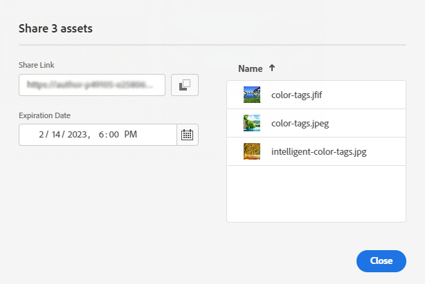

# 자산으로의 링크 공유 {#share-links-assets}

[!DNL Assets view]에서 링크를 생성하고 [!DNL Assets view] 애플리케이션에 대한 액세스 권한이 없는 외부 관련자와 자산을 공유할 수 있습니다. 해당 링크에 대한 만료일을 정의한 다음 이메일 또는 메시징 서비스와 같이 선호하는 커뮤니케이션 수단을 사용하여 다른 사용자와 공유할 수 있습니다. 링크 수신자는 자산을 미리 보고 다운로드할 수 있습니다.

## 자산에 대한 링크 생성 {#generate-link-for-assets}

자산 또는 자산을 포함하는 폴더에 대한 링크를 생성하려면:

1. 에셋이 들어 있는 에셋, 폴더 또는 둘 다를 선택하고 **[!UICONTROL 링크 공유]**&#x200B;를 클릭합니다.

1. 이를 조정하려면 [캘린더] 아이콘을 클릭한 다음 **[!UICONTROL 만료일]** 필드를 사용하여 해당 링크에 대한 만료일을 정의하십시오. `yyyy-mm-dd` 형식으로 날짜를 직접 지정할 수도 있습니다. 링크에 대한 기본적으로 만료일은 공유일로부터 2주로 설정되어 있습니다.

1. **[!UICONTROL 링크 공유]** 필드에서 링크를 복사합니다.

   

1. **[!UICONTROL 닫기]**&#x200B;를 클릭한 다음 이메일 또는 기타 공동 작업 도구를 사용하여 링크를 공유합니다.

## 공유 에셋에 액세스 {#access-shared-assets}

에셋에 대한 공개 링크를 공유하면 수신자는 해당 링크를 클릭하여 [!DNL Assets view]에 로그인할 필요 없이 웹 브라우저에서 공유 에셋을 미리 보거나 다운로드할 수 있습니다.

링크를 클릭하고, 에셋으로 이동할 폴더를 클릭한 다음 에셋을 클릭하여 미리 봅니다. [목록 보기] 또는 [카드 보기]에서 공유 자산을 보도록 선택할 수 있습니다.

공유 자산 또는 공유 자산 폴더에 마우스를 가져다 대고 자산을 선택하거나 다운로드할 수 있습니다.

여러 자산을 선택한 다음 **[!UICONTROL 다운로드]**&#x200B;를 선택할 수도 있습니다. [!DNL Assets view]은 선택한 자산을 zip 파일로 다운로드합니다. 그런 다음 [!DNL Assets view]은 상위 zip 파일에 다운로드하도록 선택한 각 자산별로 자산 이름과 동일한 이름의 하위 폴더를 생성합니다.

모든 자산을 한 번에 다운로드하려면 **[!UICONTROL 목록 보기]**&#x200B;로 전환하고 **[!UICONTROL 모두 선택]**&#x200B;을 클릭한 다음 **[!UICONTROL 다운로드]**&#x200B;를 선택하십시오.

## 다음 단계 {#next-steps}

* [Assets 보기에서 에셋에 대한 링크를 공유하려면 비디오를 시청하십시오](https://experienceleague.adobe.com/docs/experience-manager-learn/assets-essentials/basics/link-sharing.html)

* Assets 보기 사용자 인터페이스에서 사용 가능한 [!UICONTROL 피드백] 옵션을 사용하여 제품 피드백 제공

* 오른쪽 사이드바에서 사용 가능한 [!UICONTROL 이 페이지 편집], , [!UICONTROL 문제 기록] 또는 을 사용하여 설명서 피드백 제공

* [고객 지원 센터](https://experienceleague.adobe.com/?support-solution=General#support) 문의
