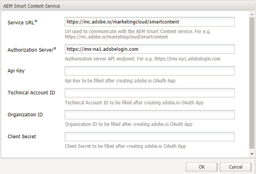

# Experience Manager를 구성하여 에셋 스마트 태그 지정 {#configure-aem-for-smart-tagging}

분류 제어 어휘를 사용하여 자산에 태그를 지정하면 태그 기반 검색으로 자산을 쉽게 식별하고 검색할 수 있습니다. Adobe는 이미지 트레이닝을 위해 인공 지능과 머신 러닝 알고리즘을 사용하는 스마트 태그를 제공합니다. 스마트 태그는 [Adobe Sensei의](https://www.adobe.com/sensei/experience-cloud-artificial-intelligence.html) 인공 지능 프레임워크를 사용하여 태그 구조 및 비즈니스 분류 체계에 대한 이미지 인식 알고리즘을 교육합니다.

스마트 태그 기능은 추가 기능으로 구입할 수 있습니다 [!DNL Experience Manager]. 구입하면 Adobe I/O 링크가 포함된 이메일이 조직 관리자에게 전송됩니다. 관리자는 링크에 액세스하여 Adobe I/O를 [!DNL Experience Manager] 사용하여 스마트 태그를 연결합니다.

<!-- TBD: 
1. Can a similar flowchart be created about how training works in CS? 
2. Is there a link to buy SCS or initiate a sales call.
3. Keystroke all steps and check all screenshots.
4. Post-GA, if time permits, create a video.
-->

## Adobe I/O와 통합 {#aio-integration}

SCS를 사용하여 이미지에 태그를 지정하려면 Adobe I/O를 사용하여 스마트 태그 서비스 [!DNL Adobe Experience Manager] 와 통합합니다. 백엔드 [!DNL Experience Manager] 는 요청을 서비스로 전달하기 전에 Adobe I/O 게이트웨이로 서비스 자격 증명을 인증합니다.

* 공개 키 [!DNL Experience Manager] 를 생성하기 위한 구성을 만듭니다. OAuth 통합에 대한 공용 인증서를 얻습니다.
* Adobe I/O에서 통합을 만들고 생성된 공개 키를 업로드합니다.
* Adobe I/O의 API 키 및 기타 자격 증명을 사용하여 인스턴스를 구성합니다. [!DNL Experience Manager]
* 자산 업로드 시 자동 태그 지정을 활성화합니다(선택 사항).

### Adobe I/O 통합을 위한 사전 요구 사항 {#prerequisite-for-aio-integration}

스마트 태그를 사용하려면 먼저 Adobe I/O에 통합을 만들려면 다음을 확인하십시오.

* 조직에 대한 관리자 권한이 있는 Adobe ID 계정
* 조직에서 스마트 태그를 사용할 수 있습니다.

### Obtain a public certificate {#obtain-public-certificate}

공용 인증서를 사용하면 Adobe I/O에서 프로필을 인증할 수 있습니다.

1. 사용자 [!DNL Experience Manager] 인터페이스에서 **[!UICONTROL 도구]** > **[!UICONTROL 클라우드 서비스]** > **[!UICONTROL 기존 클라우드 서비스에 액세스합니다]**.

1. 클라우드 서비스 페이지에서 자산 스마트 태그 아래의 **[!UICONTROL 지금]** 구성을 **[!UICONTROL 클릭합니다]**.

1. 구성 **[!UICONTROL 만들기]** 대화 상자에서 스마트 태그 구성의 제목과 이름을 지정합니다. **[!UICONTROL 만들기]**&#x200B;를 클릭합니다.

1. AEM **[!UICONTROL 스마트 콘텐츠 서비스]** 대화 상자에서 다음 값을 사용하십시오.

   **[!UICONTROL 서비스 URL]**: `https://mc.adobe.io/marketingcloud/smartcontent`

   **[!UICONTROL 인증 서버]**: `https://ims-na1.adobelogin.com`

   다른 필드는 비워 둡니다(나중에 제공). **[!UICONTROL 확인]**&#x200B;을 클릭합니다.

   

1. OAuth **[!UICONTROL 통합용]**&#x200B;공용 인증서 다운로드를 클릭하고 공용 인증서 파일을 다운로드합니다 `AEM-SmartTags.crt`.

   

### 인증서가 만료된 경우 다시 구성 {#certrenew}

인증서가 만료되면 더 이상 신뢰되지 않습니다. 새 인증서를 추가하려면 다음 단계를 따르십시오. 만료된 인증서는 갱신할 수 없습니다.

1. 관리자로 [!DNL Experience Manager] 배포 로그인 도구 **** > **[!UICONTROL 보안]** > **[!UICONTROL 사용자를]**&#x200B;클릭합니다.

1. dam-update-service **** 사용자를 찾아 클릭합니다. Keystore **[!UICONTROL 탭을]** 클릭합니다.
1. 만료된 인증서로 기존 **[!UICONTROL 유사한 검색]** 키 저장소를 삭제합니다. Click **[!UICONTROL Save &amp; Close]**.

   

   *그림: 새 보안 인증서를 추가하려면 Keystore의 기존`similaritysearch`항목을 삭제합니다.*

1. 도구 **[!UICONTROL > 클라우드]** 서비스 **** > **[!UICONTROL 기존 클라우드 서비스로]**&#x200B;이동합니다. 자산 **[!UICONTROL 스마트 태그]** > 구성 **[!UICONTROL 표시]** > 사용 가능한 구성 **[!UICONTROL 을 클릭합니다]**. 필요한 구성을 클릭합니다.

1. 공용 인증서를 다운로드하려면 OAuth 통합에 **[!UICONTROL 대한 공용 인증서 다운로드를 클릭합니다]**.

1. https://console.adobe.io [에](https://console.adobe.io) 액세스하여 프로젝트의 기존 서비스로 이동합니다. 새 인증서를 업로드합니다. 자세한 내용은 Adobe I/O 통합 [만들기의 지침을 참조하십시오](#create-aio-integration).

### 통합 만들기 {#create-aio-integration}

스마트 태그 API를 사용하려면 Adobe I/O에서 통합을 만들어 API 키, 기술 계정 ID, 조직 ID 및 클라이언트 암호를 생성합니다.

1. https://console.adobe.io [에 액세스합니다](https://console.adobe.io/).
1. 적절한 계정을 선택하고 관련 조직 역할이 시스템 관리자인지 확인합니다. 프로젝트를 만들거나 기존 프로젝트를 엽니다. 프로젝트 페이지에서 API **[!UICONTROL 추가를 클릭합니다]**.
1. API **[!UICONTROL 추가]** 페이지에서 **[!UICONTROL Experience Cloud]** 를 **[!UICONTROL 선택하고]**&#x200B;스마트 콘텐츠를 선택합니다. 계속을 **[!UICONTROL 클릭합니다]**.
1. 다음 페이지에서 **[!UICONTROL 새 통합을 선택합니다]**. 계속을 **[!UICONTROL 클릭합니다]**.
1. [ **[!UICONTROL 통합 세부 사항]** ] 페이지에서 통합 게이트웨이의 이름을 지정하고 설명을 추가합니다.
1. 공개 키 인증서 **[!UICONTROL 에서]**&#x200B;위에 다운로드한 `AEM-SmartTags.crt` 파일을 업로드합니다.
1. **[!UICONTROL 통합 만들기]**&#x200B;를 클릭합니다.
1. 통합 정보를 보려면 **[!UICONTROL 계속을 클릭하여 통합 세부 사항을 확인합니다]**.

   

### 스마트 태그 구성 {#configure-smart-content-service}

통합을 구성하려면 Adobe I/O 통합에서 기술 계정 ID, 조직 ID, 클라이언트 암호, 인증 서버 및 API 키 필드의 값을 사용하십시오. 스마트 태그 클라우드 구성을 만들면 인스턴스에서 API 요청을 인증할 수 [!DNL Experience Manager] 있습니다.

1. 에서 [!DNL Experience Manager]도구 > 클라우드 서비스 > 기존 클라우드 서비스 **[!UICONTROL 로 이동하여]** 클라우드 서비스 [!UICONTROL 콘솔을] 엽니다.
1. 자산 **[!UICONTROL 스마트 태그]**&#x200B;아래에서 위에서 만든 구성을 엽니다. 서비스 설정 페이지에서 편집을 **[!UICONTROL 클릭합니다]**.
1. [ **[!UICONTROL AEM 스마트 콘텐츠 서비스]** ] 대화 상자에서 **[!UICONTROL 서비스 URL]** 및 **[!UICONTROL 인증 서버]** 필드에 대해 미리 채워진 값을사용합니다.
1. 필드 API 키, **[!UICONTROL 기술 계정]** ID **[!UICONTROL ,]**&#x200B;조직 ID **[!UICONTROL 및 클라이언트 암호]**&#x200B;의 경우 위에서 생성된 값을 ****&#x200B;사용합니다.

### 구성 유효성 확인 {#validate-the-configuration}

구성을 완료한 후 JMX MBean을 사용하여 구성을 확인할 수 있습니다. 유효성을 확인하려면 다음 단계를 따르십시오.

1. 에서 [!DNL Experience Manager] 서버에 액세스합니다 `https://[aem_server]:[port]`.

1. 도구 > **[!UICONTROL 작업 > 웹 콘솔로]** 이동하여 OSGi 콘솔을 엽니다. 기본 **[!UICONTROL > JMX를 클릭합니다]**.
1. com.day.cq.da **[!UICONTROL m.similaritysearch.internal.impl을 클릭합니다]**. SimilitiesSearch **[!UICONTROL Miscellaneous Tasks.]**.
1. 유효성 **[!UICONTROL 검사 구성()을 클릭합니다]**. 구성 유효성 **[!UICONTROL 확인]** 대화 상자에서 호출 **[!UICONTROL 을 클릭합니다]**.

   유효성 검사 결과가 동일한 대화 상자에 표시됩니다.

## 새로 업로드한 자산에 대한 스마트 태그 지정 사용(선택 사항) {#enable-smart-tagging-for-uploaded-assets}

1. 에서 [!DNL Experience Manager]도구 > 워크플로우 > 모델 **[!UICONTROL 으로 이동합니다]**.
1. 워크플로우 **[!UICONTROL 모델]** 페이지에서 **[!UICONTROL DAM 자산]** 업데이트 워크플로우 모델을선택합니다.
1. 도구 **[!UICONTROL 모음에서]** 편집을 클릭합니다.
1. 사이드 패널을 확장하여 단계를 표시합니다. DAM 워크플로우 섹션에서 **[!UICONTROL 사용할 수 있는 스마트 태그]** 자산 **[!UICONTROL 단계를 드래그하여]** 축소판 처리단계 뒤에 놓습니다.

   

   *그림: DAM 자산 업데이트 워크플로우에서 프로세스 축소판 단계 후에 스마트 태그 자산 단계를 추가합니다.*

1. 구성할 단계를 엽니다. [ **[!UICONTROL 고급 설정]**] 아래에서 [ **[!UICONTROL 처리기 고급]** ] 옵션을 선택해야 합니다.

   

1. 태그를 **[!UICONTROL 예측할 때 오류를 무시하도록 워크플로우에]** 하려면 인수 탭에서 오류 **** 무시를 선택합니다. 폴더에서 스마트 태그 지정 사용 여부에 관계없이 업로드될 때 자산에 태그를 지정하려면 스마트 태그 플래그 **[!UICONTROL 무시]**&#x200B;를 선택합니다.

1. 확인 **[!UICONTROL 을]** 클릭하여 프로세스 단계를 닫은 다음 워크플로우를 저장합니다. 동기화를 **[!UICONTROL 클릭합니다]**.

>[!MORELIKETHIS]
>
>* [스마트 서비스를 사용하여 에셋에 태그 지정](smart-tags.md)

