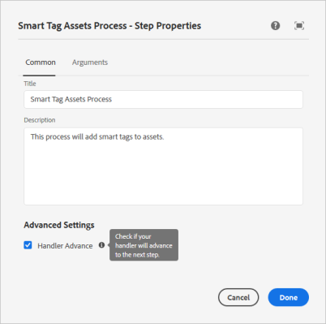

# 자산의 스마트 태그 지정을 위한 Experience Manager 구성 {#configure-aem-for-smart-tagging}

분류 제어 어휘를 사용하여 자산에 태그를 지정하면 태그 기반 검색으로 자산을 쉽게 식별하고 검색할 수 있습니다. Adobe는 이미지 트레이닝을 위해 인공 지능과 머신 러닝 알고리즘을 사용하는 스마트 태그를 제공합니다. 스마트 태그는 [Adobe Sensei](https://www.adobe.com/kr/sensei/experience-cloud-artificial-intelligence.html)의 인공 지능 프레임워크를 사용하여 태그 구조 및 비즈니스 분류에 대한 이미지 인식 알고리즘을 교육합니다.

스마트 태그 기능은 [!DNL Experience Manager]에 대한 추가 기능으로 구입할 수 있습니다. 구입하고 나면 Adobe 개발자 콘솔로 연결되는 링크가 포함된 이메일이 조직 관리자에게 전송됩니다. 관리자는 링크에 액세스하여 Adobe 개발자 콘솔을 사용하여 [!DNL Experience Manager]와 스마트 태그를 통합합니다.

<!-- TBD: 
1. Can a similar flowchart be created about how training works in CS? 
2. Is there a link to buy SCS or initiate a sales call.
3. Keystroke all steps and check all screenshots.
-->

>[!IMPORTANT]
>
>새로운 [!DNL Experience Manager Assets] 배포는 기본적으로 [!DNL Adobe Developer Console] 통합되어 있습니다. 이 기능은 스마트 태그 기능을 보다 빠르게 구성하는 데 도움이 됩니다. 기존 배포에서 관리자는 다음 단계에 따라 구성합니다.

## Adobe 개발자 콘솔과 통합 {#aio-integration}

SCS를 사용하여 이미지에 태그를 지정하려면 Adobe 개발자 콘솔을 사용하여 스마트 태그 서비스와 [!DNL Adobe Experience Manager]를 통합합니다. 백 엔드에서 [!DNL Experience Manager] 서버는 요청을 서비스로 전달하기 전에 Adobe 개발자 콘솔 게이트웨이로 서비스 자격 증명을 인증합니다.

* 공개 키를 생성하기 위해 [!DNL Experience Manager]에서 구성을 만듭니다. OAuth 통합을 위한 [공개 인증서를 받습니다](#obtain-public-certificate).
* [Adobe 개발자 콘솔에서 통합을 만들고](#create-aio-integration) 생성된 공개 키를 업로드합니다.
* [API 키 및 Adobe 개발자 콘솔의 기타 자격 증명을 사용하여](#configure-smart-content-service) [!DNL Experience Manager] 인스턴스에서 스마트 태그를 구성합니다.
* [구성을 테스트합니다](#validate-the-configuration).
* [인증서가 만료된 후 다시 구성합니다](#certrenew).

### Adobe 개발자 콘솔 통합을 위한 사전 요구 사항 {#prerequisite-for-aio-integration}

스마트 태그를 사용하려면 먼저 Adobe 개발자 콘솔에서 통합을 만들기 위해 다음을 확인하십시오.

* 조직에 대한 관리자 권한이 부여된 Adobe ID 계정이 있습니다.
* 조직에서 스마트 태그를 사용할 수 있습니다.

### 공개 인증서 받기 {#obtain-public-certificate}

공개 인증서를 사용하면 Adobe 개발자 콘솔에서 프로필을 인증할 수 있습니다. [!DNL Experience Manager] 내에서 인증서를 만듭니다.

1. [!DNL Experience Manager] 사용자 인터페이스에서 **[!UICONTROL 도구]** > **[!UICONTROL 보안]** > **[!UICONTROL Adobe IMS 구성]**&#x200B;에 액세스합니다.

1. [!UICONTROL Adobe IMS 구성] 페이지에서 **[!UICONTROL 만들기]**&#x200B;를 클릭합니다. **[!UICONTROL 클라우드 솔루션]** 메뉴에서 **[!UICONTROL 스마트 태그]**&#x200B;를 선택합니다.

1. **[!UICONTROL 새 인증서 만들기]**&#x200B;를 선택합니다. 이름을 입력하고 **[!UICONTROL 인증서 만들기]**&#x200B;를 클릭합니다. **[!UICONTROL 확인]**&#x200B;을 클릭합니다.

1. **[!UICONTROL 공개 키 다운로드]**&#x200B;를 클릭합니다.

   

### 통합 만들기 {#create-aio-integration}

스마트 태그를 사용하려면 Adobe 개발자 콘솔에서 통합을 만들어 API 키, 기술 계정 ID, 조직 ID 및 클라이언트 암호를 생성합니다.

1. 브라우저에서 [https://console.adobe.io](https://console.adobe.io/)에 액세스합니다. 적절한 계정을 선택하고 관련 조직 역할이 시스템 관리자인지 확인합니다.
1. 원하는 이름으로 프로젝트를 만듭니다. **[!UICONTROL API 추가]**&#x200B;를 클릭합니다.
1. **[!UICONTROL API 추가]** 페이지에서 **[!UICONTROL Experience Cloud]**&#x200B;를 선택하고 **[!UICONTROL 스마트 컨텐츠]**&#x200B;를 선택합니다. **[!UICONTROL 다음]**&#x200B;을 클릭합니다.
1. **[!UICONTROL 공개 키 업로드]**&#x200B;를 선택합니다. [!DNL Experience Manager]에서 다운로드한 인증서 파일을 제공합니다. [!UICONTROL 공개 키가 업로드되었습니다] 메시지가 표시됩니다. **[!UICONTROL 다음]**&#x200B;을 클릭합니다.
1. [!UICONTROL 새 서비스 계정(JWT) 자격 증명 만들기] 페이지에는 방금 구성된 서비스 계정에 대한 공개 키가 표시됩니다. **[!UICONTROL 다음]**&#x200B;을 클릭합니다.
1. **[!UICONTROL 제품 프로필 선택]** 페이지에서 **[!UICONTROL 스마트 컨텐츠 서비스]**&#x200B;를 선택합니다. **[!UICONTROL 구성된 API 저장]**&#x200B;을 클릭합니다. 페이지에 구성에 대한 자세한 정보가 표시됩니다. [!DNL Experience Manager]에서 스마트 태그를 추가로 구성할 때 Experience Manager에서 이러한 값을 복사하고 추가하려면 이 페이지를 열어 둡니다.

   

### 스마트 태그 구성 {#configure-smart-content-service}

통합을 구성하려면 Adobe 개발자 콘솔 통합에서 페이로드, 클라이언트 암호, 인증 서버 및 API 키 필드 값을 사용합니다.

1. [!DNL Experience Manager] 사용자 인터페이스에서 **[!UICONTROL 도구]** > **[!UICONTROL 보안]** > **[!UICONTROL Adobe IMS 구성]**&#x200B;에 액세스합니다.
1. **[!UICONTROL Adobe IMS 기술 계정 구성]** 페이지에 액세스하여 원하는 **[!UICONTROL 제목]**&#x200B;을 입력합니다.
1. **[!UICONTROL 인증 서버]** 필드에서 `https://ims-na1.adobelogin.com` URL을 입력합니다.
1. **[!UICONTROL API 키]** 필드에서 **[!UICONTROL 클라이언트 ID]**&#x200B;를 [!DNL Adobe Developer Console]에서 제공합니다.
1. **[!UICONTROL 클라이언트 암호]** 필드에서 **[!UICONTROL 클라이언트 암호]**&#x200B;를 [!DNL Adobe Developer Console]에서 제공합니다. **[!UICONTROL 클라이언트 암호 검색]** 옵션을 클릭하여 확인합니다.
1. 프로젝트에서 [!DNL Adobe Developer Console]의 왼쪽 여백에 있는 **[!UICONTROL 서비스 계정(JWT)]**&#x200B;을 클릭합니다. **[!UICONTROL JWT 생성]** 탭을 클릭합니다. **[!UICONTROL 복사]**&#x200B;를 클릭하여 표시된 **[!UICONTROL JWT 페이로드]**&#x200B;를 복사합니다. **[!UICONTROL 의]**&#x200B;페이로드[!DNL Experience Manager]에 이 값을 입력합니다. **[!UICONTROL 만들기]**&#x200B;를 클릭합니다.

### 구성 유효성 확인 {#validate-the-configuration}

구성을 완료한 후 다음 단계에 따라 구성을 확인합니다.

1. [!DNL Experience Manager] 사용자 인터페이스에서 **[!UICONTROL 도구]** > **[!UICONTROL 보안]** > **[!UICONTROL Adobe IMS 구성]**&#x200B;에 액세스합니다.

1. 스마트 태그 구성을 선택합니다. 도구 모음에서 **[!UICONTROL 상태 확인]**&#x200B;을 클릭합니다. **[!UICONTROL 확인]**&#x200B;을 클릭합니다. [!UICONTROL 정상 구성] 메시지가 표시된 대화 상자에서 구성이 작동하는지 확인합니다.

### 인증서가 만료된 경우 다시 구성 {#certrenew}

인증서가 만료되면 더 이상 신뢰할 수 없습니다. 새 인증서를 추가하려면 다음 단계를 따르십시오. 만료된 인증서는 갱신할 수 없습니다.

1. 관리자로 [!DNL Experience Manager] 배포에 로그인합니다. **[!UICONTROL 도구]** > **[!UICONTROL 보안]** > **[!UICONTROL 사용자]**&#x200B;를 클릭합니다.

1. **[!UICONTROL dam-update-service]** 사용자를 찾아 클릭합니다. **[!UICONTROL 키 저장소]** 탭을 클릭합니다.
1. 만료된 인증서로 기존의 **[!UICONTROL 유사 검색]** 키 저장소를 삭제합니다. **[!UICONTROL 저장 후 닫기]**&#x200B;를 클릭합니다.

   

   *그림: 새 보안 인증서를 추가하려면 키 저장소에서 기존`similaritysearch`항목을 삭제합니다.*

1. [!DNL Experience Manager] 사용자 인터페이스에서 **[!UICONTROL 도구]** > **[!UICONTROL 보안]** > **[!UICONTROL Adobe IMS 구성]**&#x200B;에 액세스합니다. 사용 가능한 스마트 태그 구성을 엽니다. 공개 인증서를 다운로드하려면 **[!UICONTROL 공개 인증서 다운로드]**&#x200B;를 클릭합니다.

1. [https://console.adobe.io](https://console.adobe.io)에 액세스하여 프로젝트의 기존 서비스로 이동합니다. 새 인증서를 업로드하고 구성합니다. 구성에 대한 자세한 내용은 [Adobe 개발자 콘솔 통합 만들기](#create-aio-integration)의 지침을 참조하십시오.

## 새로 업로드한 자산에 대한 스마트 태그 지정 사용(선택 사항) {#enable-smart-tagging-for-uploaded-assets}

1. [!DNL Experience Manager]에서 **[!UICONTROL 도구 > 워크플로우 > 모델]**&#x200B;로 이동합니다.
1. **[!UICONTROL 워크플로우 모델]** 페이지에서 **[!UICONTROL DAM 자산 업데이트]** 워크플로우 모델을 선택합니다.
1. 도구 모음에서 **[!UICONTROL 편집]**&#x200B;을 클릭합니다.
1. 사이드 패널을 확장하여 단계를 표시합니다. DAM 워크플로우 섹션에서 사용할 수 있는 **[!UICONTROL 스마트 태그 자산]** 단계를 드래그하여 **[!UICONTROL 프로세스 썸네일]** 단계 이후에 배치합니다.

   

   *그림: DAM 자산 업데이트 워크플로우에서 프로세스 썸네일 단계 이후에 스마트 태그 자산 단계를 추가합니다.*

1. 구성할 단계를 엽니다. **[!UICONTROL 고급 설정]**&#x200B;에서 **[!UICONTROL 핸들러 고급]** 옵션을 선택해야 합니다.

   

1. **[!UICONTROL 인수]** 탭에서 태그를 예측할 때 오류를 무시할 워크플로우를 원하는 경우 **[!UICONTROL 오류 무시]**&#x200B;를 선택합니다. 폴더에서 스마트 태그 지정 사용 여부와 관계없이 업로드될 때 자산에 태그를 지정하려면 **[!UICONTROL 스마트 태그 플래그 무시]**&#x200B;를 선택합니다.

1. **[!UICONTROL 확인]**&#x200B;을 클릭하여 프로세스 단계를 닫은 다음 워크플로우를 저장합니다. **[!UICONTROL 동기화]**&#x200B;를 클릭합니다.

>[!MORELIKETHIS]
>
>* [스마트 서비스를 사용하여 자산에 태그 지정](smart-tags.md)

