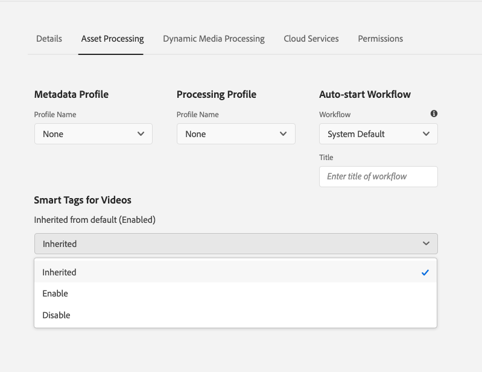

# 비디오 자산에 스마트 태그 지정 {#video-smart-tags}

| [모범 사례 검색](/help/assets/search-best-practices.md) | [메타데이터 모범 사례](/help/assets/metadata-best-practices.md) | [Content Hub](/help/assets/product-overview.md) | [OpenAPI 기능이 있는 Dynamic Media](/help/assets/dynamic-media-open-apis-overview.md) | [AEM Assets 개발자 설명서](https://developer.adobe.com/experience-cloud/experience-manager-apis/) |
| ------------- | --------------------------- |---------|----|-----|

새로운 콘텐츠에 대한 필요성이 증가함에 따라 매력적인 디지털 경험을 즉시 제공하기 위한 수작업 노력이 감소해야 합니다. [!DNL Adobe Experience Manager] as a [!DNL Cloud Service]은(는) 인공 지능을 사용하여 비디오 자산의 자동 태깅을 지원합니다. 비디오를 수동으로 태깅하는 데에는 시간이 많이 걸릴 수 있습니다. 그러나 [!DNL Adobe Sensei] 기반 비디오 스마트 태그 지정 기능은 인공 지능 모델을 사용하여 비디오 콘텐츠를 분석하고 태그를 비디오 자산에 추가합니다. 이를 통해 DAM 사용자가 고객에게 풍부한 경험을 전달하는 시간을 단축할 수 있습니다. Adobe의 머신 러닝 서비스는 비디오에 대해 두 세트의 태그를 생성합니다. 반면, 한 세트는 해당 비디오에 있는 객체, 장면 및 속성에 해당되며, 다른 세트는 음주, 달리기, 조깅 등의 작업에 관한 것입니다.

비디오 태깅은 [!DNL Adobe Experience Manager]에서 [!DNL Cloud Service](으)로 기본적으로 사용됩니다. 그러나 폴더에서 [비디오 스마트 태그 지정을 옵트아웃](#opt-out-video-smart-tagging)할 수 있습니다. 새 비디오를 업로드하거나 기존 비디오를 재처리할 때 비디오가 자동으로 태그됩니다. [!DNL Experience Manager]은(는) 또한 비디오 파일의 썸네일을 만들고 메타데이터를 추출합니다. 스마트 태그가 자산 [!UICONTROL 속성]에서 [신뢰도 점수](#confidence-score-video-tag)의 내림차순으로 표시됩니다.

## 업로드 시 스마트 태깅 비디오 {#smart-tag-assets-on-ingestion}

[비디오 자산을 [!DNL Adobe Experience Manager]에 [!DNL Cloud Service](으)로 업로드](add-assets.md#upload-assets)하면 비디오가 처리됩니다. 처리가 완료되면 자산 [!UICONTROL 속성] 페이지의 [!UICONTROL 기본] 탭을 참조하십시오. 스마트 태그는 [!UICONTROL 스마트 태그]의 비디오에 자동으로 추가됩니다. 자산 마이크로서비스 [!DNL Adobe Sensei]을(를) 사용하여 이러한 스마트 태그를 만듭니다.


적용된 스마트 태그는 [!UICONTROL 스마트 태그] 내에서 개체 및 작업 태그에 대해 결합된 [신뢰도 점수](#confidence-score-video-tag)의 내림차순으로 정렬됩니다.

>[!IMPORTANT]
>
>이렇게 자동 생성된 태그를 검토하여 브랜드와 해당 값을 준수하는지 확인하는 것이 좋습니다.

## DAM의 기존 비디오에 스마트 태그 지정 {#smart-tag-existing-videos}

DAM에 이미 있는 비디오 자산은 자동으로 스마트 태그가 지정되지 않습니다. 스마트 태그를 생성하려면 [!UICONTROL Assets을 다시 처리]해야 합니다.

비디오 에셋 또는 에셋 저장소에 이미 있는 에셋의 폴더(하위 폴더 포함)에 스마트 태그를 지정하려면 다음 단계를 수행하십시오.

1. [!DNL Adobe Experience Manager] 로고를 선택한 다음 [!UICONTROL 탐색] 페이지에서 자산을 선택하십시오.

1. Assets 인터페이스를 표시하려면 [!UICONTROL 파일]을(를) 선택하십시오.

1. 스마트 태그를 적용할 폴더로 이동합니다.

1. 전체 폴더 또는 특정 비디오 자산을 선택합니다.

1.  [!UICONTROL Assets 재처리] 아이콘을 선택하고 [!UICONTROL 전체 처리] 옵션을 선택합니다.

<!-- TBD: Limit size -->


프로세스가 완료되면 폴더 내 비디오 자산의 [!UICONTROL 속성] 페이지로 이동합니다. 자동으로 추가된 태그는 [!UICONTROL 기본] 탭의 [!UICONTROL 스마트 태그] 섹션에 표시됩니다. 적용된 스마트 태그는 [신뢰도 점수](#confidence-score-video-tag)의 내림차순으로 정렬됩니다.

## 태그가 지정된 비디오 검색 {#search-smart-tagged-videos}

자동 생성된 스마트 태그를 기반으로 비디오 자산을 검색하려면 [Omnisearch](search-assets.md#search-assets-in-aem)을(를) 사용하십시오.

1. 검색 아이콘 을 선택하여 Omnisearch 필드를 표시합니다.

1. 비디오에 명시적으로 추가하지 않은 태그를 Omnisearch 필드에 지정합니다.

1. 태그를 기반으로 검색합니다.

지정한 태그를 기반으로 비디오 에셋이 검색 결과에 표시됩니다.

검색 결과는 메타데이터에서 검색된 키워드가 있는 비디오 에셋과 검색된 키워드로 스마트 태그가 지정된 비디오 에셋의 조합입니다. 그러나 메타데이터 필드의 모든 검색어와 일치하는 검색 결과가 먼저 표시되고, 스마트 태그의 검색어 중 하나와 일치하는 검색 결과가 표시됩니다. 자세한 내용은 [스마트 태그를 사용한 결과 이해 [!DNL Experience Manager] 검색](smart-tags.md#understand-search)를 참조하십시오.

## 비디오 스마트 태그 중재 {#moderate-video-smart-tags}

[!DNL Adobe Experience Manager]을(를) 통해 스마트 태그를 큐레이션하여 다음 작업을 수행할 수 있습니다.

* 브랜드 비디오에 지정된 부정확한 태그를 제거합니다.

* 비디오가 가장 관련성이 높은 태그에 대한 검색 결과에 나타나도록 하여 태그 기반의 비디오 검색을 세분화합니다. 따라서 관련 없는 비디오가 검색 결과에 나타날 가능성을 제거합니다.

* 태그에 높은 등급을 할당하면 비디오와 관련된 연관성이 높아집니다. 비디오에 대한 태그를 프로모션하면 해당 태그를 기반으로 검색이 수행될 때 검색 결과에 비디오가 표시될 가능성이 높아집니다.

자산의 스마트 태그를 중재하는 방법에 대한 자세한 내용은 [스마트 태그 관리](smart-tags.md#manage-smart-tags-and-searches)를 참조하십시오.


>[!NOTE]
>
>[스마트 태그 관리](smart-tags.md#manage-smart-tags-and-searches)의 단계를 사용하여 중재된 모든 태그는 자산 재처리 시 기억되지 않습니다. 원래 태그 세트가 다시 표시됩니다.

## 비디오 스마트 태그 지정 옵트아웃 {#opt-out-video-smart-tagging}

비디오의 자동화된 태깅은 썸네일 생성 및 메타데이터 추출과 같은 다른 에셋 처리 작업과 동시에 실행되므로 시간이 오래 걸릴 수 있습니다. 에셋 처리를 신속하게 수행하기 위해 폴더 수준에서 업로드 시 비디오 스마트 태그 지정을 옵트아웃할 수 있습니다.

특정 폴더에 업로드된 자산에 대해 자동화된 비디오 스마트 태그 생성을 옵트아웃하려면 다음을 수행하십시오.

1. [!UICONTROL 속성] 폴더에서 [!UICONTROL 자산 처리] 탭을 엽니다.

1. [!UICONTROL 비디오용 스마트 태그] 메뉴에서 [!UICONTROL 상속됨] 옵션이 기본적으로 선택되어 있으며 비디오 스마트 태그가 활성화되어 있습니다.

   [!UICONTROL 상속됨] 옵션을 선택하면 상속된 폴더 경로가 [!UICONTROL 사용] 또는 [!UICONTROL 사용 안 함] 중 어느 것으로 설정되어 있는지에 대한 정보와 함께 표시됩니다.

   

1. 폴더에 업로드된 비디오의 스마트 태그 지정을 취소하려면 [!UICONTROL 사용 안 함]을(를) 선택하십시오.

>[!IMPORTANT]
>
>업로드 시 폴더에 있는 비디오에 태그를 지정하도록 선택하고 업로드 후 비디오에 스마트 태그를 지정하려면 [!UICONTROL 속성] 폴더의 [!UICONTROL 자산 처리] 탭에서 **[!UICONTROL 비디오에 스마트 태그를 사용]**&#x200B;하고 [[!UICONTROL 자산 재처리] 옵션](#smart-tag-existing-videos)을 사용하여 비디오에 스마트 태그를 추가하십시오.

## 신뢰도 점수 {#confidence-score-video-tag}

[!DNL Adobe Experience Manager]은(는) 개체 및 동작 스마트 태그에 대한 최소 신뢰 임계값을 적용하여 각 비디오 자산에 대해 태그가 너무 많아 인덱싱이 느려지지 않도록 합니다. 에셋 검색 결과는 신뢰 점수를 기반으로 등급이 매겨지며, 이는 일반적으로 비디오 에셋의 할당된 태그 검사 결과 이상의 검색 결과를 향상시킵니다. 부정확한 태그는 신뢰 점수가 낮은 경우가 많기 때문에 자산의 스마트 태그 목록 맨 위에 표시되는 경우가 거의 없습니다.

[!DNL Adobe Experience Manager]의 작업 및 개체 태그에 대한 기본 임계값은 0.7(0과 1 사이의 값이어야 함)입니다. 일부 비디오 자산이 특정 태그에 의해 태깅되지 않는 경우, 이는 알고리즘이 예측된 태그에서 70% 미만으로 신뢰됨을 나타낸다. 기본 임계값이 모든 사용자에게 항상 최적이 아닐 수 있습니다. 따라서 OSGI 구성에서 신뢰 점수 값을 변경할 수 있습니다.

[!DNL Adobe Experience Manager]에 [!DNL Cloud Service] - [!DNL Cloud Manager](으)로 배포된 프로젝트에 신뢰도 점수 OSGI 구성을 추가하려면 다음을 수행하십시오.

* [!DNL Adobe Experience Manager] 프로젝트( Archetype 24 이후 `ui.config` 또는 이전 `ui.apps`)에서 `config.author` OSGi 구성에 다음 내용이 포함된 구성 파일 `com.adobe.cq.assetcompute.impl.senseisdk.SenseiSdkImpl.cfg.json`을(를) 포함하십시오.

```json
{
  "minVideoActionConfidenceScore":0.5,
  "minVideoObjectConfidenceScore":0.5,
}
```

>[!NOTE]
>
>수동 태그에는 100%의 신뢰도(최대 신뢰도)가 할당됩니다. 따라서 검색 쿼리와 일치하는 수동 태그가 있는 비디오 자산이 있는 경우 검색 쿼리와 일치하는 스마트 태그 앞에 표시됩니다.

## 제한 사항 {#video-smart-tagging-limitations}

* 특정 비디오를 사용하여 비디오에 스마트 태그를 적용하는 서비스를 교육할 수 없습니다. 기본 [!DNL Adobe Sensei] 설정에서 작동합니다.

* 태그 지정 진행률이 표시되지 않습니다.

* 파일 크기가 300MB보다 작은 비디오만 자동 태그가 지정됩니다. [!DNL Adobe Sensei] 서비스는 크기가 더 큰 비디오 파일을 건너뜁니다.

* [스마트 태그](/help/assets/smart-tags.md#smart-tags-supported-file-formats)에 언급된 파일 형식의 비디오와 지원되는 코덱에만 태그가 지정됩니다.

**추가 참조**

* [자산 번역](translate-assets.md)
* [Assets HTTP API](mac-api-assets.md)
* [자산이 지원되는 파일 형식](file-format-support.md)
* [자산 검색](search-assets.md)
* [연결된 자산](use-assets-across-connected-assets-instances.md)
* [자산 보고서](asset-reports.md)
* [메타데이터 스키마](metadata-schemas.md)
* [자산 다운로드](download-assets-from-aem.md)
* [메타데이터 관리](manage-metadata.md)
* [검색 패싯](search-facets.md)
* [컬렉션 관리](manage-collections.md)
* [일괄 메타데이터 가져오기](metadata-import-export.md)
* [AEM 및 Dynamic Media에 자산 게시](/help/assets/publish-assets-to-aem-and-dm.md)

>[!MORELIKETHIS]
>
>* [스마트 태그 및 자산 검색 관리](smart-tags.md#manage-smart-tags-and-searches)
>* [스마트 태그 서비스 교육 및 이미지에 태그 지정](smart-tags.md)
