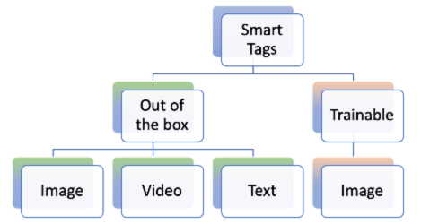

# AEM Assets용 스마트 태그 {#using-smart-tags}

조직은 수많은 디지털 자산을 보유하고 있으며 이 숫자는 계속 빠르게 증가하고 있습니다. 이러한 방대한 데이터 속에서 특정 자산을 검색하는 것은 중요한 과제를 안고 있다. 이 문제를 해결하기 위해 `metadata` 및 `tags`을(를) 사용하여 디지털 에셋의 검색 기능을 개선합니다. 조직은 에셋 메타데이터에 분류 제어 어휘를 사용합니다. 일반적으로 직원, 파트너 및 고객이 디지털 에셋을 참조하고 찾는 데 일반적으로 사용하는 키워드 목록으로 구성됩니다.

스마트 태그는 텍스트에만 나타나는 것이 아니라 에셋을 가장 잘 설명하는 키워드입니다. 분류 제어 어휘로 자산에 태그를 지정하면 검색을 통해 쉽게 식별하고 검색할 수 있습니다.

예를 들어, 사전에 알파벳순으로 배열된 단어들은 무작위로 흩어져 있는 단어들보다 더 쉽게 발견된다. 태깅도 유사한 용도로 사용됩니다. 비즈니스 분류법에 따라 에셋을 구성하여 가장 관련성이 높은 에셋이 검색 결과에 나타나도록 합니다. 예를 들어 자동차 제조업체는 모델 이름으로 자동차 이미지에 태그를 지정할 수 있으므로 판촉 캠페인을 디자인할 때 관련 이미지만 표시됩니다. &quot;러너&quot; 또는 &quot;러닝 슈즈&quot;에 태그를 지정하든, 사용자는 오타, 철자 변형 또는 대체 검색어에 대해 걱정할 필요가 없습니다. 스마트 태그가 이를 모두 인식합니다.

배경에서 이 기능은 [Adobe Sensei](https://business.adobe.com/kr/products/sensei/adobe-sensei.html)의 인위적인 지능형 프레임워크를 사용하여 비즈니스 분류법에 정렬된 텍스트와 함께 업로드된 자산에 기본적으로 스마트 태그를 자동으로 적용합니다.

## 사전 요구 사항 및 구성 {#smart-tags-prereqs-config}

스마트 태그가 [!DNL Adobe Experience Manager]에 대해 [!DNL Cloud Service]&#x200B;(으)로 자동 프로비저닝되므로 구성이 필요하지 않습니다.

## 스마트 태그 워크플로 {#smart-tags-workflow}

[!DNL Adobe Sensei] 기반 스마트 태깅은 인공 지능 모델을 사용하여 콘텐츠를 분석하고 태그를 자산에 추가합니다. 따라서 DAM 사용자가 고객에게 풍부한 경험을 제공하는 데 드는 시간을 줄일 수 있습니다. 스마트 태그는 자산 속성에서 [신뢰도 점수](#confidence-score)의 내림차순으로 표시됩니다.

* **이미지 기반 자산**
이미지의 경우 스마트 태그는 일부 시각적 측면을 기반으로 합니다. 스마트 컨텐츠 서비스를 사용하여 다양한 형식의 이미지에 태그를 지정합니다. 스마트 태그는 JPG 및 PNG 형식의 변환을 생성하는 [지원되는 파일 형식](#supported-file-formats)에 적용됩니다.

  <!-- -->

* **비디오 기반 자산**
비디오 기반 자산의 경우 태깅은 기본적으로 [!DNL Adobe Experience Manager]에서 [!DNL Cloud Service]&#x200B;(으)로 활성화됩니다. 마찬가지로 이미지 및 텍스트 기반 태그와 마찬가지로 새 비디오를 업로드하거나 기존 비디오를 재처리할 때 비디오도 자동 태그가 지정됩니다. [!DNL Adobe Sensei]은(는) 비디오에 대해 두 개의 태그 집합을 생성합니다. 한 집합은 해당 비디오의 개체, 장면 및 특성에 해당하는 반면, 다른 집합은 음주, 실행 및 조깅과 같은 작업에 해당합니다. [비디오 스마트 태그 지정 옵트아웃](#opt-out-video-smart-tagging)도 확인하세요.

* **텍스트 기반 에셋**
지원되는 에셋의 경우 [!DNL Experience Manager]에서 이미 텍스트를 추출하여 인덱싱하고 에셋 검색에 사용합니다. 그러나 텍스트의 키워드를 기반으로 하는 스마트 태그는 전용, 구조화된 우선순위가 높은 검색 패싯을 제공합니다. 후자는 검색 색인에 비해 에셋 발견을 개선하는 데 도움이 됩니다.
텍스트 기반 에셋의 경우 스마트 태그의 효능은 에셋의 텍스트 양에 따라 달라지지 않고 에셋의 텍스트에 있는 관련 키워드나 엔티티에 따라 달라집니다.

  

스마트 태그는 다음 워크플로를 사용하여 AEM Assets에서 구현됩니다.

1. AEM에서 에셋을 만들거나 업로드합니다. 이미지, 비디오 및 텍스트 기반 Assets에 대해 기본 제공 태그가 생성됩니다.

1. 특정 태그가 생성되지 않은 경우 그에 따라 이미지 유형 태그를 교육할 수 있습니다. [스마트 태그 교육](#smart-tags-training.md)을 참조하세요.

## 스마트 태그에 지원되는 파일 형식 {#supported-file-formats}

| 이미지(MIME 유형) | 텍스트 기반 에셋(파일 형식) | 비디오 자산(파일 형식 및 코덱) |
|----|-----|------|
| image/jpeg | CSV | MP4 (H264/AVC) |
| image/tiff | DOC | MKV (H264/AVC) |
| image/png | DOCX | MOV (H264/AVC, Motion JPEG) |
| image/bmp | HTML | AVI(indeo4) |
| image/gif | PDF | FLV (H264/AVC, vp6f) |
| image/pjpeg | PPT | WMV (WMV2) |
| image/x-portable-anymap | PPTX |  |
| image/x-portable-bitmap | RTF |  |
| image/x-portable-graymap | SRT |  |
| image/x-portable-pixmap | TXT |  |
| image/x-rgb | VTT |  |
| image/x-xbitmap | |  |
| image/x-xpixmap | |  |
| image/x-icon |  |  |
| image/photoshop |  |  |
| image/x-photoshop |  |  |
| image/psd |  |  |
| image/vnd.adobe.photoshop |  |  |

## 즉시 사용 가능한 스마트 태그 지정을 위한 자산 준비

[자산을 &#x200B;](add-assets.md#upload-assets)에 [!DNL Adobe Experience Manager]&#x200B;(으)로 업로드[!DNL Cloud Service]하면 업로드된 자산이 처리됩니다. 처리가 완료되면 자산 [!UICONTROL 속성] 페이지의 [!UICONTROL 기본] 탭을 참조하십시오. 스마트 태그는 [!UICONTROL 스마트 태그]의 자산에 자동으로 추가됩니다. 자산 마이크로서비스 [!DNL Adobe Sensei]을(를) 사용하여 이러한 스마트 태그를 만듭니다.


<!--
The applied smart tags are sorted in descending order of [confidence score](#confidence-score), combined for object and action tags, within [!UICONTROL Smart Tags].
-->

>[!IMPORTANT]
>
>이렇게 자동 생성된 태그를 검토하여 브랜드와 해당 값을 준수하는지 확인하는 것이 좋습니다.

## DAM에서 태그가 지정되지 않은 Assets {#smart-tag-existing-assets}

DAM의 기존 또는 이전 에셋은 자동으로 스마트 태그가 지정되지 않습니다. 스마트 태그를 생성하려면 Assets을 수동으로 [재처리](https://experienceleague.adobe.com/docs/experience-manager-cloud-service/content/assets/admin/about-image-video-profiles.html?lang=ko#adjusting-load)해야 합니다. 프로세스가 완료되면 폴더 내 에셋의 [!UICONTROL 속성] 페이지로 이동합니다. 자동으로 추가된 태그는 [!UICONTROL 기본] 탭의 [!UICONTROL 스마트 태그] 섹션에 표시됩니다. 적용된 스마트 태그는 [신뢰도 점수](#confidence-score)의 내림차순으로 정렬됩니다.

<!--
To smart tag assets, or folders (including subfolders) of assets that exist in assets repository, follow these steps:

1. Select the [!DNL Adobe Experience Manager] logo and then select assets from the [!UICONTROL Navigation] page.

1. Select [!UICONTROL Files] to display the Assets interface.

1. Navigate to the folder to which you want to apply Smart Tags.

1. Select the assets and click  [!UICONTROL Reprocess Assets] icon and select the [!UICONTROL Full Process] option.

-->

## 신뢰도 점수 {#confidence-score}

에셋 검색 결과는 신뢰도 점수에 따라 등급이 매겨지며, 일반적으로 에셋의 할당된 태그 검사 결과 이상으로 검색 결과가 향상됩니다. 부정확한 태그는 신뢰 점수가 낮은 경우가 많기 때문에 자산의 스마트 태그 목록 맨 위에 표시되는 경우가 거의 없습니다.
<!--
[!DNL Adobe Experience Manager] as a [!DNL Cloud Service] applies a minimum confidence threshold for object and action-smart tags to avoid having too many tags for each asset, which slows down indexing. 

The default threshold for action and object tags in [!DNL Adobe Experience Manager] for an image is 0.5 and for video it is 0.7 (should be value from 0 through 1). If some assets are not tagged by a specific tag, then it indicates that the algorithm is less than 70% confident in the predicted tags. The default threshold might not always be optimal for all the users. You can, therefore, change the confidence score value in OSGI configuration.

To add the confidence score OSGI configuration to the project deployed to [!DNL Adobe Experience Manager] as a [!DNL Cloud Service] through [!DNL Cloud Manager]:

In the [!DNL Adobe Experience Manager] project (`ui.config` since Archetype 24, or previously `ui.apps`) the `config.author` OSGi configuration, include a config file named `com.adobe.cq.assetcompute.impl.senseisdk.SenseiSdkImpl.cfg.json` with the following contents:

```json
{
  "minVideoActionConfidenceScore":0.5,
  "minVideoObjectConfidenceScore":0.5,
}
```
-->

>[!NOTE]
>
>수동 태그에는 100%의 신뢰도(최대 신뢰도)가 할당됩니다. 따라서 검색 쿼리와 일치하는 수동 태그가 있는 자산이 있으면 검색 쿼리와 일치하는 스마트 태그 앞에 표시됩니다.

## 스마트 태그 중재 {#moderate-smart-tags}

[!DNL Adobe Experience Manager]을(를) [!DNL Cloud Service]&#x200B;(으)로 사용하면 스마트 태그를 큐레이션하여 다음을 수행할 수 있습니다.

* 브랜드 자산에 지정된 부정확한 태그를 제거합니다.

* 태그 기반 검색을 세분화하여 가장 관련성이 높은 태그에 대한 검색 결과에 자산이 나타나도록 합니다. 따라서 관련 없는 자산이 검색 결과에 나타날 가능성을 제거합니다.

* 태그에 더 높은 등급을 할당하면 에셋과 관련성이 높아집니다. 에셋에 대한 태그를 프로모션하면 해당 태그를 기반으로 검색이 수행될 때 특정 에셋이 검색 결과에 나타날 가능성이 높아집니다.

자산의 스마트 태그를 중재하는 방법에 대한 자세한 내용은 [스마트 태그 관리](smart-tags.md#manage-smart-tags-and-searches)를 참조하십시오.


>[!NOTE]
>
>[스마트 태그 관리](smart-tags.md#manage-smart-tags-and-searches)의 단계를 사용하여 중재된 모든 태그는 자산 재처리 시 기억되지 않습니다. 원래 태그 세트가 다시 표시됩니다.

## 스마트 태그 및 자산 검색 관리 {#manage-smart-tags-and-searches}

스마트 태그를 조정하여 브랜드 에셋에 지정되었을 수 있는 부정확한 태그를 제거하여 가장 관련성이 높은 태그만 표시되도록 할 수 있습니다.

스마트 태그를 중재하면 가장 관련성이 높은 태그에 대한 검색 결과에 자산이 표시되도록 하여 자산을 찾는 태그 기반 검색을 개선하는 데도 도움이 됩니다. 기본적으로 관련 없는 에셋이 검색 결과에 나타날 가능성을 제거하는 데 도움이 됩니다.

태그에 더 높은 등급을 할당하여 에셋에 대한 태그의 관련성을 높일 수도 있습니다. 에셋에 대한 태그를 프로모션하면 특정 태그를 기반으로 검색이 수행될 때 에셋이 검색 결과에 표시될 가능성이 증가합니다.

디지털 에셋의 스마트 태그를 중재하려면 다음을 수행하십시오.

1. 검색 필드에서 태그를 기반으로 디지털 에셋을 검색합니다.

1. 검색과 관련이 없는 디지털 에셋을 식별하려면 검색 결과를 검사하십시오.

1. 에셋을 선택한 다음 도구 모음에서 을 선택합니다.

1. **[!UICONTROL 태그 관리]** 페이지에서 태그를 검사합니다. 특정 태그를 기준으로 자산을 검색하지 않으려면 태그를 선택하고 도구 모음에서 을 선택합니다. 또는 레이블 옆에 있는 을 선택합니다.

1. 태그에 더 높은 등급을 할당하려면 태그를 선택하고 도구 모음에서 을 선택합니다. 승격하는 태그가 **[!UICONTROL 태그]** 섹션으로 이동됩니다.

1. **[!UICONTROL 저장]**&#x200B;을 선택한 다음 **[!UICONTROL 확인]**&#x200B;을 선택하여 [!UICONTROL 성공] 대화 상자를 닫습니다.

1. 에셋의 [!UICONTROL 속성] 페이지로 이동합니다. 프로모션한 태그는 높은 관련성이 할당되므로 검색 결과에 더 높게 표시됩니다.

### 스마트 태그를 사용하여 [!DNL Experience Manager]개 검색 결과 이해 {#understand-search}

기본적으로 [!DNL Experience Manager]은(는) 검색어와 `AND` 또는 `OR` 절을 결합하여 적용된 스마트 태그에서 검색어를 찾습니다. 스마트 태그를 사용해도 이 기본 동작은 변경되지 않습니다. 예를 들어 `woman running`을(를) 검색해 보십시오. 메타데이터에 `woman` 또는 `running` 키워드만 있는 Assets은 기본적으로 검색 결과에 표시되지 않습니다. 그러나 스마트 태그를 사용하여 `woman` 또는 `running` 중 하나로 태그가 지정된 자산이 이러한 검색 쿼리에 나타납니다. 그래서 검색 결과는

* 메타데이터에 `woman` 및 `running` 키워드가 있는 Assets.

* Assets이 키워드 중 하나를 사용하여 스마트 태그를 지정했습니다.

메타데이터 필드의 모든 검색어와 일치하는 검색 결과가 먼저 표시되고, 스마트 태그의 검색어와 일치하는 검색 결과가 표시됩니다. 위의 예에서 검색 결과가 표시되는 대략적인 순서는 다음과 같습니다.

1. 다양한 메타데이터 필드에 있는 `woman running`과(와) 일치합니다.
1. 스마트 태그의 `woman running`과(와) 일치합니다.
1. 스마트 태그의 일치 항목: `woman` 또는 `running`.

## 스마트 태그 지정 옵트아웃 {#opt-out-smart-tagging}

자산에 대한 자동화된 태깅은 썸네일 생성 및 메타데이터 추출과 같은 다른 자산 처리 작업과 동시에 실행되므로 시간이 오래 걸릴 수 있습니다. 에셋 처리를 신속하게 수행하기 위해 폴더 수준에서 업로드 시 스마트 태그 지정을 옵트아웃할 수 있습니다. 특정 폴더에 업로드된 자산에 대해 자동화된 스마트 태그 생성을 옵트아웃하려면 다음을 수행하십시오.

1. [!UICONTROL 속성] 폴더에서 [!UICONTROL 자산 처리] 탭을 엽니다.
1. [!UICONTROL 비디오용 스마트 태그] 메뉴에서 [!UICONTROL 상속됨] 옵션이 기본적으로 선택되어 있고 비디오 스마트 태그가 활성화되어 있습니다.

   [!UICONTROL 상속됨] 옵션을 선택하면 상속된 폴더 경로가 [!UICONTROL 사용] 또는 [!UICONTROL 사용 안 함] 중 어느 것으로 설정되어 있는지에 대한 정보와 함께 표시됩니다.

   

1. 폴더에 업로드된 스마트 태그 지정을 옵트아웃하려면 [!UICONTROL 사용 안 함]을(를) 선택하십시오.

1. 마찬가지로 [!UICONTROL 텍스트용 스마트 태그], [!UICONTROL 이미지용 스마트 태그] 및 [!UICONTROL 이미지용 색상 태그]에 대한 스마트 태그 지정을 거부할 수 있습니다.

>[!IMPORTANT]
>
>업로드 시 폴더에 대한 태그 지정을 옵트아웃하고 업로드 후 스마트 태그를 지정하려는 경우 **[!UICONTROL 속성]** 폴더의 [!UICONTROL 자산 처리] 탭에서 [!UICONTROL 스마트 태그를 사용]하고 [[!UICONTROL 자산 재처리] 옵션](#smart-tag-existing-assets)을 사용하여 자산에 스마트 태그를 추가하십시오.

<!--
## Benefits of Smart Tags to your assets {#benefits-of-smart-tags}

Following are the benefits of using Smart Tags in your AEM Assets:
*  Makes an asset searchable.
*  Smart Tags are generated automatically to your assets, thus, it minimizes your effort to perform tagging manually.
*  It allows the usage of the same vocabulary, tag structure, and taxonomy so that you need not to worry about tagging if by chance you miss tagging at first.
*  Whether you are tagging "runners" or "running" shoes, you do not need to worry about typos, wrong spellings, or alternative search terms as Smart Tags know it already!
*  Helps your assets to become organized and categorized.
-->

## 스마트 태그와 관련된 제한 사항 및 우수 사례 {#limitations-best-practices-smart-tags}

이러한 모델이 태그를 식별하는 데 항상 완벽하지는 않습니다. 현재 버전의 스마트 태그에는 다음과 같은 제한 사항이 있습니다.

* 이미지의 미묘한 차이를 인식할 수 없음. 예를 들어, 슬림형 셔츠와 일반 셔츠가 있습니다.
* 작은 패턴이나 이미지 부분을 기반으로 태그를 식별할 수 없음. 예를 들어 셔츠의 로고.
* 처리되지 않은 태그는 다음과 관련이 있습니다.

   * 비시각적, 추상적인 측면. 예를 들어 제품의 출시 연도 또는 시즌, 이미지에 의해 유발되는 기분 또는 감정, 비디오의 주관적 함축 등이 있습니다.
   * 색상 또는 작은 제품 로고가 제품에 임베드되어 있는 셔츠와 같은 제품의 미세한 시각적 차이.

* 파일 크기가 300MB보다 작은 비디오만 자동 태그가 지정됩니다. [!DNL Adobe Sensei] 서비스는 크기가 더 큰 비디오 파일을 건너뜁니다.
* 스마트 태그가 있는 파일(일반 또는 고급)을 검색하려면 [!DNL Assets] 검색(전체 텍스트 검색)을 사용하십시오. 스마트 태그에 대한 별도의 검색 조건자는 없습니다.
* 일반 태그를 비교하면 비즈니스 분류법을 사용하여 태그가 지정된 에셋은 태그 기반 검색으로 더 쉽게 식별하고 검색할 수 있습니다.

## 자주 묻는 질문{#faq-smart-tags}

+++**스마트 태그가 에셋의 검색 환경을 어떻게 개선합니까?**

업로드하면 [!DNL Adobe] Sensei에서 에셋에 자동으로 태그를 지정합니다. 자동화된 프로세스는 백엔드에서 매우 빠르게 실행되므로 업로드가 완료되면 몇 초 후에 에셋에 추가된 태그를 볼 수 있습니다.

+++

+++**스마트 태그 목록이 정확하지 않거나 원치 않는 태그가 표시되면 어떻게 됩니까?**

부정확하거나 원하지 않는 태그는 목록에서 제거할 수 있습니다. 예를 들어 자동차 판매점의 경우 목록에서 &quot;손상된&quot; 태그를 제거할 수 있습니다.

+++

+++**같은 태그가 들어 있는 자산의 우선 순위를 어떻게 정할 수 있습니까?**

예. 동일한 태그가 포함된 에셋의 우선 순위를 지정할 수 있습니다. 자산의 스마트 태그 목록으로 태그를 홍보하여 우선 순위를 수행할 수 있습니다. 태그를 홍보하면 해당 특정 태그에 대한 검색 결과에 나타나는 이미지의 우선 순위를 지정할 수 있습니다.

+++

+++**스마트 태그 응용 프로그램이 특정 폴더로 제한되어 있습니까?**

스마트 태그는 구성이 가능하며 DAM 내의 모든 폴더에 적용할 수 있습니다.

+++

+++**태그 지정에 교육이 필요한지 어떻게 알 수 있습니까?**

[스마트 태그 교육의 요구 사항 확인](#smart-tags-training.md#smart-tag-training-requirement)을 참조하세요.

+++

+++**자산에 태그를 지정하는 데 지원되는 파일 형식은 무엇입니까?**

[지원되는 파일 형식](#supported-file-formats)을 참조하세요.

+++

+++**어떤 언어 스마트 태그를 생성합니까?**

스마트 태그는 영어로만 생성됩니다. 메타데이터를 포함한 전체 에셋을 번역하여 다른 언어로 번역할 수 있습니다.

+++

+++**더 이상 스마트 태그 지정을 사용하지 않습니다.**

중단할 때마다 [스마트 태그 지정을 옵트아웃](#opt-out-smart-tagging)할 수 있습니다.

+++
