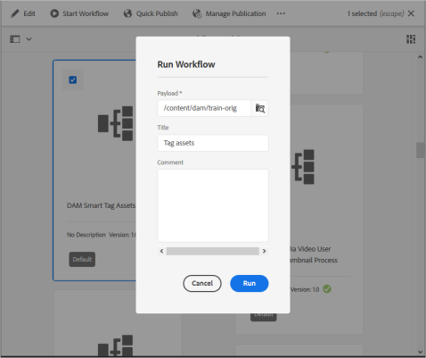

# AEM의 자산에 스마트 태그 추가 {#smart-tags-assets-aem}

| 버전 | 문서 링크 |
| -------- | ---------------------------- |
| AEM 6.5 | [여기 클릭](https://experienceleague.adobe.com/docs/experience-manager-65/assets/using/enhanced-smart-tags.html?lang=en) |
| AEM as a Cloud Service | 이 문서 |

디지털 에셋을 다루는 조직은 에셋 메타데이터에서 분류 제어 어휘를 사용하는 경우가 점점 늘어나고 있습니다. 기본적으로 직원, 파트너 및 고객이 디지털 에셋을 참조하고 검색하는 데 일반적으로 사용하는 키워드 목록을 포함합니다. 분류 제어 어휘로 자산에 태그를 지정하면 검색에서 자산을 쉽게 식별하고 검색할 수 있습니다.

자연어 어휘와 비교하여 비즈니스 분류법에 따른 태깅은 자산을 회사의 비즈니스에 맞추는 데 도움이 되며 가장 관련성이 높은 자산이 검색에 나타나도록 합니다. 예를 들어 자동차 제조업체는 모델 이름으로 자동차 이미지에 태그를 지정할 수 있으므로 프로모션 캠페인을 디자인하기 위해 검색할 때 관련 이미지만 표시됩니다.

배경에서 이 기능은 [Adobe Sensei](https://business.adobe.com/why-adobe/experience-cloud-artificial-intelligence.html)의 인위적인 지능형 프레임워크를 사용하여 태그 구조 및 비즈니스 분류법에 대한 이미지 인식 알고리즘을 교육합니다. 그런 다음 이 콘텐츠 인텔리전스를 사용하여 다른 에셋 세트에 관련 태그를 적용합니다. AEM은 기본적으로 업로드된 에셋에 스마트 태그를 자동으로 적용합니다.

<!-- TBD: Create a flowchart for how training works in CS.
 
-->

## AEM의 스마트 태그에 대해 지원되는 자산 유형 {#smart-tags-supported-file-formats}

다음 유형의 자산에 태그를 지정할 수 있습니다.

* **이미지**: Adobe Sensei의 스마트 컨텐츠 서비스를 사용하여 다양한 형식의 이미지에 태그를 지정합니다. [교육 모델을 만들고](#train-model) 업로드한 이미지에 자동으로 태그가 지정됩니다. 스마트 태그는 JPG 및 PNG 형식의 변환을 생성하는 지원되는 파일 유형에 적용됩니다.
* **텍스트 기반 에셋**: [!DNL Experience Manager Assets]은(는) 업로드할 때 지원되는 텍스트 기반 에셋에 자동 태그를 지정합니다.
* **비디오 자산**: [!DNL Adobe Experience Manager]에서 기본적으로 [!DNL Cloud Service](으)로 비디오 태그 지정을 사용할 수 있습니다. 새 비디오를 업로드하거나 기존 비디오를 재처리할 때 [비디오에 자동 태그가 지정됩니다](/help/assets/smart-tags-video-assets.md).

| 이미지(MIME 유형) | 텍스트 기반 에셋(파일 형식) | 비디오 자산(파일 형식 및 코덱) |
|----|-----|------|
| image/jpeg | CSV | MP4 (H264/AVC) |
| image/tiff | DOC | MKV (H264/AVC) |
| image/png | DOCX | MOV (H264/AVC, 모션 JPEG) |
| image/bmp | HTML | AVI(indeo4) |
| image/gif | PDF | FLV (H264/AVC, vp6f) |
| image/pjpeg | PPT | WMV (WMV2) |
| image/x-portable-anymap | PPTX |  |
| image/x-portable-bitmap | RTF |  |
| image/x-portable-graymap | SRT |  |
| image/x-portable-pixmap | TXT |  |
| image/x-rgb | VTT |  |
| image/x-xbitmap | |  |
| image/x-xpixmap | |  |
| image/x-icon |  |  |
| image/photoshop |  |  |
| image/x-photoshop |  |  |
| image/psd |  |  |
| image/vnd.adobe.photoshop |  |  |

AEM은 기본적으로 스마트 태그를 텍스트 기반 에셋 및 비디오에 자동으로 추가합니다. 이미지에 스마트 태그를 자동으로 추가하려면 다음 작업을 완료하십시오.

* [태그 모델 및 지침 이해](#understand-tag-models-guidelines).
* [모델을 교육합니다](#train-model).
* [디지털 자산에 태그 지정](#tag-assets).
* [태그 및 검색 관리](#manage-smart-tags-and-searches).

## 태그 모델 및 지침 이해 {#understand-tag-models-guidelines}

태그 모델은 태그가 지정되는 이미지의 다양한 시각적 측면과 연관된 관련 태그의 그룹입니다. 태그는 이미지의 뚜렷하게 다른 시각적 측면과 관련이 있으므로 태그를 적용하면 특정 유형의 이미지를 검색하는 데 도움이 됩니다. 예를 들어 신발 컬렉션에는 서로 다른 태그가 있을 수 있지만 모든 태그는 신발과 관련되어 있으며 동일한 태그 모델에 속할 수 있습니다. 태그를 적용하면 디자인 또는 사용 사례와 같이 다양한 유형의 신발을 찾는 데 도움이 됩니다. [!DNL Experience Manager]에 있는 교육 모델의 콘텐츠 표현을 이해하려면 교육 모델을 수동으로 추가된 태그 그룹과 각 태그에 대한 예제 이미지로 구성된 최상위 수준의 엔티티로 시각화하십시오. 각 태그는 이미지에 독점적으로 적용할 수 있습니다.

태그 모델을 만들고 서비스를 교육하기 전에 비즈니스 컨텍스트에서 이미지에 있는 개체를 가장 잘 설명하는 고유 태그 세트를 식별하십시오. 조정된 집합의 자산이 [교육 지침](#training-guidelines)을 준수하는지 확인하십시오.

### 교육 지침 {#training-guidelines}

교육 세트의 이미지가 다음 지침을 준수하는지 확인합니다.

**수량 및 크기:** 태그당 최소 10개 및 최대 50개의 이미지.

**일관성**: 태그의 이미지가 시각적으로 유사한지 확인하십시오. 동일한 시각적 측면(예: 이미지의 동일한 오브젝트 유형)에 대한 태그를 단일 태그 모델에 함께 추가하는 것이 가장 좋습니다. 예를 들어 이러한 이미지는 시각적으로 유사하지 않으므로 `my-party`(교육용)로 태깅하는 것은 좋지 않습니다.

**적용 범위**: 교육에 있는 이미지에 충분한 종류가 있어야 합니다. 이 아이디어는 [!DNL Experience Manager]이(가) 올바른 것에 집중하는 방법을 배울 수 있도록 몇 가지 다양하지만 합리적으로 다양한 예제를 제공하는 것입니다. 시각적으로 다른 이미지에 동일한 태그를 적용하는 경우 각 종류의 예제를 5개 이상 포함하십시오. 예를 들어 태그 *모델-아래-포즈*&#x200B;의 경우 태그 지정 중에 유사한 이미지를 더 정확하게 식별하기 위해 서비스에 대해 아래 강조 표시된 이미지와 유사한 교육 이미지를 더 포함하십시오.

**주의 산만함/방해**: 서비스는 주의 산만함이 적은 이미지(주요 주체가 있는 개체/사람과 같이 눈에 띄는 배경, 관련 없는 반주)에서 더 잘 훈련합니다. 예를 들어 태그 *캐주얼 신발*&#x200B;의 경우 두 번째 이미지는 좋은 교육 후보가 아닙니다.

**Completeness:** If an image qualifies for more than one tag, add all applicable tags before including the image for training. For example, for tags, such as *raincoat* and *model-side-view*, add both the tags on the eligible asset before including it for training.

**태그 수**: Adobe은 두 개 이상의 고유한 태그와 각 태그에 대해 10개 이상의 서로 다른 이미지를 사용하여 모델을 교육할 것을 권장합니다. 단일 태그 모델에서는 태그를 50개 이상 추가하지 마십시오.

**예제 수**: 각 태그에 대해 최소 10개 이상의 예제를 추가하십시오. 그러나 Adobe에서는 약 30개의 예제를 권장합니다. 태그당 최대 50개의 예제가 지원됩니다.

**긍정 오류 및 충돌 방지**: Adobe은 단일 시각적 측면에 대해 단일 태그 모델을 만들 것을 권장합니다. 모델 간에 태그가 겹치지 않도록 태그 모델을 구조화합니다. 예를 들어, 두 개의 서로 다른 태그 모델 이름 `shoes` 및 `footwear`에서 `sneakers`과(와) 같은 일반적인 태그를 사용하지 마십시오. 트레이닝 프로세스는 공통 키워드에 대해 트레이닝된 하나의 태그 모델을 다른 모델과 덮어씁니다.

**예**: 자세한 지침 예는 다음과 같습니다.

* 다음을 포함하는 태그 모델 만들기

   * 자동차 모델과 관련된 태그입니다.
   * 성인과 어린이용 자켓 관련 태그입니다.

* 만들지 않음,

   * 2019년 및 2020년에 출시된 자동차 모델이 포함된 태그 모델입니다.
   * 동일한 소수의 자동차 모델을 포함하는 여러 태그 모델.

**교육에 사용되는 이미지**: 동일한 이미지를 사용하여 다른 태그 모델을 교육할 수 있습니다. 그러나 이미지를 태그 모델에서 두 개 이상의 태그와 연결해서는 안 됩니다. 상이한 태그 모델에 속하는 상이한 태그를 갖는 동일한 이미지에 태그를 지정할 수 있다.

교육을 실행 취소할 수 없습니다. 위의 지침은 교육할 좋은 이미지를 선택하는 데 도움이 됩니다.

## 사용자 정의 태그에 대한 모델 교육 {#train-model}

비즈니스별 태그에 대한 모델을 만들고 교육하려면 다음 단계를 따르십시오.

1. 필요한 태그와 적절한 태그 구조를 만듭니다. DAM 저장소에서 관련 이미지를 업로드합니다.
1. [!DNL Experience Manager] 사용자 인터페이스에서 **[!UICONTROL Assets]** > **[!UICONTROL 스마트 태그 교육]**&#x200B;에 액세스합니다.
1. **[!UICONTROL 만들기]**&#x200B;를 클릭합니다. **[!UICONTROL 제목]**, **[!UICONTROL 설명]**&#x200B;을 입력하십시오.
1. **[!UICONTROL 태그]** 필드에서 폴더 아이콘을 클릭합니다. 팝업 창이 열립니다.
1. `cq-tags`의 기존 태그 중 모델에 추가할 태그를 검색하거나 선택합니다. **[!UICONTROL 다음]**&#x200B;을 클릭합니다.

   >[!NOTE]
   >
   >**[!UICONTROL 이름]**(알파벳 순서), **[!UICONTROL 생성됨]** 날짜 또는 **[!UICONTROL 수정됨]** 날짜를 기준으로 태그 구조를 오름차순 또는 내림차순으로 정렬할 수 있습니다.

1. **[!UICONTROL Assets 선택]** 대화 상자에서 각 태그에 대해 **[!UICONTROL Assets 추가]**&#x200B;를 클릭합니다. DAM 저장소에서 검색하거나 저장소를 탐색하여 최소 10개 이상 최대 50개 이하의 이미지를 선택합니다. 폴더가 아닌 에셋을 선택합니다. 이미지를 선택한 후 **[!UICONTROL 선택]**&#x200B;을 클릭하세요.

   

1. 선택한 이미지의 썸네일을 미리 보려면 태그 앞의 아코디언을 클릭합니다. **[!UICONTROL Assets 추가]**&#x200B;를 클릭하여 선택 항목을 수정할 수 있습니다. 선택 항목이 만족스러우면 **[!UICONTROL 제출]**&#x200B;을 클릭하세요. 사용자 인터페이스는 교육이 시작되었음을 나타내는 통지를 페이지 하단에 표시합니다.
1. 각 태그 모델의 **[!UICONTROL 상태]** 열에서 교육 상태를 확인하십시오. 가능한 상태는 [!UICONTROL 보류 중], [!UICONTROL 훈련됨] 및 [!UICONTROL 실패]입니다.

*그림: 태그 지정 모델을 교육하는 교육 워크플로의 단계입니다.*

### 교육 상태 및 보고서 보기 {#training-status}

스마트 태그 서비스가 교육 에셋 세트의 태그에 대해 교육되었는지 확인하려면 보고서 콘솔에서 교육 워크플로우 보고서를 검토하십시오.

1. [!DNL Experience Manager] 인터페이스에서 **[!UICONTROL 도구]** > **[!UICONTROL Assets]** > **[!UICONTROL 보고서]**(으)로 이동합니다.
1. **[!UICONTROL 자산 보고서]** 페이지에서 **[!UICONTROL 만들기]**&#x200B;를 클릭합니다.
1. **[!UICONTROL 스마트 태그 교육]** 보고서를 선택한 다음 도구 모음에서 **[!UICONTROL 다음]**&#x200B;을 클릭합니다.
1. Specify a title and description for the report. Under **[!UICONTROL Schedule Report]**, leave the **[!UICONTROL Now]** option selected. If you want to schedule the report for later, select **[!UICONTROL Later]** and specify a date and time. 그런 다음 도구 모음에서 **[!UICONTROL 만들기]**&#x200B;를 클릭합니다.
1. In the **[!UICONTROL Asset Reports]** page, select the report you generated. 보고서를 보려면 도구 모음에서 **[!UICONTROL 보기]**&#x200B;를 클릭하십시오.
1. 보고서의 세부 사항을 검토합니다. The report displays the training status for the tags you trained. **[!UICONTROL 교육 상태]** 열의 녹색 색상은 스마트 태그 서비스가 태그에 대해 교육되었음을 나타냅니다. 노란색 색상은 서비스가 특정 태그에 대해 부분적으로 트레이닝되었음을 나타냅니다. 태그에 대한 서비스를 완전히 교육하려면 특정 태그로 이미지를 더 추가하고 교육 워크플로우를 실행하십시오. 이 보고서에 태그가 표시되지 않으면 이러한 태그에 대한 교육 워크플로우를 다시 실행하십시오.태그
1. 보고서를 다운로드하려면 목록에서 선택한 다음 도구 모음에서 **[!UICONTROL 다운로드]**&#x200B;를 클릭하십시오. 보고서는 스프레드시트로 다운로드됩니다.

<!--
### Tag assets from the workflow console {#tagging-assets-from-the-workflow-console}

1. In [!DNL Experience Manager] interface, go to **[!UICONTROL Tools]** > **[!UICONTROL Workflow]** > **[!UICONTROL Models]**.
1. From the **[!UICONTROL Workflow Models]** page, select the **[!UICONTROL DAM Smart Tags Assets]** workflow and then click **[!UICONTROL Start Workflow]** from the toolbar.

   

1. In the **[!UICONTROL Run Workflow]** dialog, browse to the payload folder containing assets on which you want to apply your tags automatically.
1. Specify a title for the workflow and an optional comment. Click **[!UICONTROL Run]**.

   

   *Figure: Navigate to the asset folder and review the tags to verify whether your assets are tagged properly. For details, see [manage smart tags](#manage-smart-tags-and-searches).*

### Tag assets from the timeline {#tagging-assets-from-the-timeline}

1. From the [!DNL Assets] user interface, select the folder containing assets or specific assets to which you want to apply smart tags.
1. From upper-left corner, open the **[!UICONTROL Timeline]**.
1. Open actions from the bottom of the left sidebar and click **[!UICONTROL Start Workflow]**.

   

1. Select the **[!UICONTROL DAM Smart Tag Assets]** workflow, and specify a title for the workflow.
1. Click **[!UICONTROL Start]**. The workflow applies your tags on assets. Navigate to the asset folder and review the tags to verify that your assets are tagged properly. For details, see [manage smart tags](#manage-smart-tags-and-searches).

>[!NOTE]
>
>In the subsequent tagging cycles, only the modified assets are tagged again with newly trained tags. However, even unaltered assets are tagged if the gap between the last and current tagging cycles for the tagging workflow exceeds 24 hours. For periodic tagging workflows, unaltered assets are tagged when the time gap exceeds six months.

### Tag uploaded assets {#tag-uploaded-assets}

[!DNL Experience Manager] can automatically tag the assets that users upload to DAM. To do so, administrators configure a workflow to add an available step that tags assets. See [how to enable Smart Tags for uploaded assets](/help/assets/smart-tags-configuration.md#enable-smart-tagging-for-uploaded-assets).
-->

## AEM에서 스마트 태그로 자산에 태그 지정 {#tag-assets}

[!DNL Experience Manager Assets]이(가) 업로드할 때 지원되는 모든 유형의 자산에 자동으로 태그를 지정합니다. 태깅은 기본적으로 활성화되어 있으며 작동합니다. AEM은 적절한 스마트 태그를 실시간에 가깝게 적용합니다. <!-- TBD: You can also apply the tagging workflow on-demand. The workflow applies to both, assets and folders. -->

* 이미지 및 비디오의 경우 스마트 태그는 일부 시각적 측면을 기반으로 합니다.

* 텍스트 기반 에셋의 경우 스마트 태그의 효능은 에셋의 텍스트 양에 따라 달라지지 않고 에셋의 텍스트에 있는 관련 키워드나 엔티티에 따라 달라집니다. 텍스트 기반 에셋의 경우 스마트 태그는 텍스트에 나타나는 키워드이지만 에셋을 가장 잘 설명하는 키워드입니다. 지원되는 자산의 경우 [!DNL Experience Manager]에서 이미 텍스트를 추출하여 인덱싱하고 자산을 검색하는 데 사용합니다. 그러나 텍스트의 키워드를 기반으로 하는 스마트 태그는 전용, 구조화된 우선순위가 높은 검색 패싯을 제공합니다. 후자는 검색 색인에 비해 에셋 발견을 개선하는 데 도움이 됩니다.

## 스마트 태그 및 자산 검색 관리 {#manage-smart-tags-and-searches}

스마트 태그를 조정하여 브랜드 에셋에 지정되었을 수 있는 부정확한 태그를 제거하여 가장 관련성이 높은 태그만 표시되도록 할 수 있습니다.

스마트 태그를 중재하면 가장 관련성이 높은 태그에 대한 검색 결과에 자산이 표시되도록 하여 자산을 찾는 태그 기반 검색을 구체화하는 데에도 도움이 됩니다. 기본적으로 관련 없는 에셋이 검색 결과에 나타날 가능성을 제거하는 데 도움이 됩니다.

태그에 더 높은 등급을 할당하여 에셋에 대한 태그의 관련성을 높일 수도 있습니다. 에셋에 대한 태그를 프로모션하면 특정 태그를 기반으로 검색이 수행될 때 에셋이 검색 결과에 표시될 가능성이 증가합니다.

디지털 에셋의 스마트 태그를 중재하려면 다음을 수행하십시오.

1. 검색 필드에서 태그를 기반으로 디지털 에셋을 검색합니다.

1. 검색과 관련이 없는 디지털 에셋을 식별하려면 검색 결과를 검사하십시오.

1. 에셋을 선택한 다음 도구 모음에서 을 선택합니다.

1. **[!UICONTROL 태그 관리]** 페이지에서 태그를 검사합니다. 특정 태그를 기준으로 자산을 검색하지 않으려면 태그를 선택하고 도구 모음에서 을 선택합니다. 또는 레이블 옆에 있는 `X` 기호를 선택합니다.

1. 태그에 더 높은 등급을 할당하려면 태그를 선택하고 도구 모음에서 을 선택합니다. 승격하는 태그가 **[!UICONTROL 태그]** 섹션으로 이동됩니다.

1. **[!UICONTROL 저장]**&#x200B;을 선택한 다음 **[!UICONTROL 확인]**&#x200B;을 선택하여 [!UICONTROL 성공] 대화 상자를 닫습니다.

1. 에셋의 [!UICONTROL 속성] 페이지로 이동합니다. 홍보한 태그에 높은 관련성이 할당되어 있으므로 검색 결과에서 더 높게 표시되는지 확인하십시오.

### 스마트 태그를 사용하여 [!DNL Experience Manager]개 검색 결과 이해 {#understand-search}

기본적으로 [!DNL Experience Manager] 검색에서는 검색어와 `AND` 절을 결합합니다. 스마트 태그를 사용해도 이 기본 동작은 변경되지 않습니다. 스마트 태그를 사용하면 `OR` 절이 추가되어 적용된 스마트 태그에서 검색어를 찾을 수 있습니다. 예를 들어 `woman running`을(를) 검색해 보십시오. 메타데이터에 `woman` 또는 `running` 키워드만 있는 Assets은 기본적으로 검색 결과에 표시되지 않습니다. 그러나 스마트 태그를 사용하는 `woman` 또는 `running` 중 하나로 태그가 지정된 자산이 이러한 검색 쿼리에 나타납니다. 그래서 검색 결과는

* 메타데이터에 `woman` 및 `running` 키워드가 있는 Assets.

* Assets이 키워드 중 하나를 사용하여 스마트 태그를 지정했습니다.

메타데이터 필드의 모든 검색어와 일치하는 검색 결과가 먼저 표시되고, 스마트 태그의 검색어와 일치하는 검색 결과가 표시됩니다. 위의 예에서 검색 결과가 표시되는 대략적인 순서는 다음과 같습니다.

1. 다양한 메타데이터 필드에 있는 `woman running`과(와) 일치합니다.
1. 스마트 태그의 `woman running`과(와) 일치합니다.
1. 스마트 태그의 일치 항목: `woman` 또는 `running`.

## 태그 지정 관련 제한 사항 및 우수 사례 {#limitations}

향상된 스마트 태깅은 이미지 및 해당 태그의 학습 모델을 기반으로 합니다. 이러한 모델이 태그를 식별하는 데 항상 완벽하지는 않습니다. 현재 버전의 스마트 태그에는 다음과 같은 제한 사항이 있습니다.

* 이미지의 미묘한 차이를 인식할 수 없음. 예를 들어, 슬림형 셔츠와 일반 셔츠가 있습니다.
* 작은 패턴이나 이미지 부분을 기반으로 태그를 식별할 수 없음. 예를 들어 셔츠의 로고.
* 태깅은 [!DNL Experience Manager]에서 지원하는 언어로 지원됩니다.
* 처리되지 않은 태그는 다음과 관련이 있습니다.

   * 비시각적, 추상적인 측면. 예를 들어 제품 출시 연도 또는 시즌, 이미지에 의해 유발되는 기분 또는 감정, 비디오의 주관적 함축 등이 있습니다.
   * 색상 또는 작은 제품 로고가 제품에 임베드되어 있는 셔츠와 같은 제품의 미세한 시각적 차이.

모델을 교육하려면 가장 적절한 이미지를 사용하십시오. 교육을 되돌리거나 교육 모델을 제거할 수 없습니다. 태그 지정 정확도는 현재 교육에 따라 다르므로 주의해서 수행합니다.

<!-- TBD: Add limitations related to text files. -->

스마트 태그가 있는 파일(일반 또는 고급)을 검색하려면 [!DNL Assets] 검색(전체 텍스트 검색)을 사용하십시오. 스마트 태그에 대한 별도의 검색 조건자는 없습니다.

>[!NOTE]
>
>태그에 대해 교육하고 다른 이미지에 적용하는 스마트 태그의 기능은 교육에 사용하는 이미지의 품질에 따라 다릅니다.
>Adobe 최상의 결과를 얻으려면 시각적으로 유사한 이미지를 사용하여 각 태그에 대한 서비스를 교육하는 것이 좋습니다.

**추가 참조**

* [자산 번역](translate-assets.md)
* [Assets HTTP API](mac-api-assets.md)
* [자산이 지원되는 파일 형식](file-format-support.md)
* [자산 검색](search-assets.md)
* [연결된 자산](use-assets-across-connected-assets-instances.md)
* [자산 보고서](asset-reports.md)
* [메타데이터 스키마](metadata-schemas.md)
* [자산 다운로드](download-assets-from-aem.md)
* [메타데이터 관리](manage-metadata.md)
* [검색 패싯](search-facets.md)
* [컬렉션 관리](manage-collections.md)
* [일괄 메타데이터 가져오기](metadata-import-export.md)
* [AEM 및 Dynamic Media에 자산 게시](/help/assets/publish-assets-to-aem-and-dm.md)

>[!MORELIKETHIS]
>
>* [스마트 태그가 디지털 파일 관리에 어떻게 도움이 되는지 이해](https://medium.com/adobetech/efficient-asset-management-with-enhanced-smart-tags-887bd47dbb3f)
>* [비디오에 스마트 태그 사용](smart-tags-video-assets.md)
