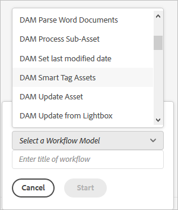

# 자산에 스마트 태그를 추가하고 검색 경험을 개선합니다 {#smart-tag-assets-for-faster-search}

디지털 자산을 처리하는 조직은 자산 메타데이터에서 분류 제어 어휘를 점점 더 많이 사용합니다. 기본적으로 디지털 자산을 참조하고 검색하는 데 일반적으로 사용하는 키워드 목록이 포함되어 있습니다. 분류 제어 어휘를 사용하여 자산에 태그를 지정하면 검색에서 자산을 쉽게 식별하고 검색할 수 있습니다.

자연어 어휘와 비교하여 비즈니스 분류 체계를 기반으로 한 태깅은 자산을 회사의 비즈니스에 맞게 조정하고 가장 관련성이 높은 자산이 검색에 나타나도록 합니다. 예를 들어, 자동차 제조업체는 자동차 이미지에 모델 이름을 사용하여 태그를 지정할 수 있으므로 프로모션 캠페인을 디자인하기 위해 검색할 때 관련 이미지만 표시됩니다.

백그라운드에서 기능은 인공적으로 지능적인 [Adobe Sensei](https://business.adobe.com/why-adobe/experience-cloud-artificial-intelligence.html) 태그 구조 및 비즈니스 분류에 대한 이미지 인식 알고리즘을 교육할 수 있습니다. 그런 다음 이 컨텐츠 인텔리전스를 사용하여 다른 자산 세트에 관련 태그를 적용하는 데 사용됩니다. [!DNL Experience Manager Assets] 기본적으로 업로드된 자산에 스마트 태그를 자동으로 적용합니다.

<!-- TBD: Create a flowchart for how training works in CS.
 
-->

## 지원되는 자산 유형 {#smart-tags-supported-file-formats}

다음 유형의 자산에 태그를 지정할 수 있습니다.

* **이미지**: Adobe Sensei의 스마트 컨텐츠 서비스를 사용하여 여러 형식의 이미지에 태그를 지정합니다. 사용자 [교육 모델 만들기](#train-model) 그러면 업로드된 이미지에 자동으로 태그가 지정됩니다. 스마트 태그는 JPG 및 PNG 형식으로 렌디션을 생성하는 지원되는 파일 유형에 적용됩니다.
* **텍스트 기반 자산**: [!DNL Experience Manager Assets] 업로드할 때 지원되는 텍스트 기반 자산에 태그를 자동으로 지정합니다.
* **비디오 자산**: 비디오 태깅은 기본적으로 [!DNL Adobe Experience Manager] 로서의 [!DNL Cloud Service]. [비디오에 자동 태그가 지정되어 있음](/help/assets/smart-tags-video-assets.md) 새 비디오를 업로드하거나 기존 비디오를 재처리하는 경우.

| 이미지(MIME 유형) | 텍스트 기반 자산(파일 형식) | 비디오 자산(파일 형식 및 코덱스) |
|----|-----|------|
| image/jpeg | CSV | MP4(H264/AVC) |
| image/tiff | DOC | MKV(H264/AVC) |
| image/png | DOCX | MOV(H264/AVC, 동작 JPEG) |
| image/bmp | HTML | AVI(indfo4) |
| image/gif | PDF | FLV(H264/AVC, vp6f) |
| image/pjpeg | PPT | WMV(WMV2) |
| image/x-portable-anymap | PPTX |  |
| image/x-portable-bitmap | RTF |  |
| image/x-portable-graymap | SRT |  |
| image/x-portable-pixmap | TXT |  |
| image/x-rgb | VTT |  |
| image/x-xbitmap |  |  |
| image/x-xpixmap |  |  |
| image/x-icon |  |  |
| 이미지/photoshop |  |  |
| image/x-photoshop |  |  |
| 이미지/psd |  |  |
| image/vnd.adobe.photoshop |  |  |

[!DNL Experience Manager] 기본적으로 텍스트 기반 자산 및 비디오에 스마트 태그를 자동으로 추가합니다. 이미지에 스마트 태그를 자동으로 추가하려면 다음 작업을 완료하십시오.

* [태그 모델 및 지침 이해](#understand-tag-models-guidelines).
* [모델 교육](#train-model).
* [디지털 자산에 태그 지정](#tag-assets).
* [태그 및 검색 관리](#manage-smart-tags-and-searches).

## 태그 모델 및 지침 이해 {#understand-tag-models-guidelines}

태그 모델은 태그가 지정된 이미지의 다양한 시각적 측면과 연관된 관련 태그의 그룹입니다. 태그는 이미지의 다른 시각적 측면과 관련이 있으므로 적용될 때 태그가 특정 유형의 이미지를 검색하는 데 도움이 됩니다. 예를 들어 신발 컬렉션에는 다른 태그가 있을 수 있지만 모든 태그는 신발과 관련되어 있고 동일한 태그 모델에 속할 수 있습니다. 적용되는 경우 태그는 디자인 또는 용도별 등 다양한 유형의 신발을 찾는 데 도움이 됩니다. 에서 교육 모델의 내용 표현을 이해하기 위해 [!DNL Experience Manager]를 클릭하고, 교육 모델을 수동으로 추가한 태그 그룹과 각 태그에 대한 예제 이미지로 구성된 최상위 엔티티로 시각화합니다. 각 태그는 이미지에 대해서만 적용할 수 있습니다.

태그 모델을 만들고 서비스를 교육하기 전에 비즈니스 컨텍스트에서 이미지에 있는 개체를 가장 잘 설명하는 고유한 태그 세트를 식별합니다. 조정된 세트의 자산이 [교육 지침](#training-guidelines).

### 교육 지침 {#training-guidelines}

교육 세트의 이미지가 다음 지침을 따르는지 확인합니다.

**수량 및 크기:** 태그당 최소 10개의 이미지와 최대 50개의 이미지.

**일관성**: 태그의 이미지가 시각적으로 유사한지 확인합니다. 동일한 시각적 측면(예: 이미지에 있는 동일한 유형의 개체)에 대한 태그를 단일 태그 모델에 추가하는 것이 가장 좋습니다. 예를 들어 이러한 모든 이미지에 태그를 지정하는 것은 좋지 않습니다 `my-party` (교육용) 이러한 템플릿은 시각적으로 유사하지 않습니다.

**적용 범위**: 훈련 중에는 다양한 이미지가 있어야 합니다. 그 아이디어는 몇 가지 하지만 상당히 다양한 예를 제공하여 [!DNL Experience Manager] 올바른 것에 초점을 맞추는 법을 배웁니다. 시각적으로 다른 이미지에 동일한 태그를 적용하는 경우 각 종류의 최소 5개의 예를 포함합니다. 예를 들어, 태그의 경우 *모델 다운 포즈*&#x200B;를 채울 때는 태깅 중에 비슷한 이미지를 더 정확하게 식별할 수 있도록 아래 강조 표시된 이미지와 유사한 더 많은 교육 이미지를 포함합니다.

**방해/방해**: 이 서비스는 집중을 덜 하는 이미지(잘 보이는 배경, 주제와 함께 있는 개체/사람과 같은 관련이 없는 인물)에서 더 잘 훈련한다. 예를 들어, 태그의 경우 *캐주얼 신발*&#x200B;두 번째 이미지는 좋은 훈련 후보가 아닙니다.

**Completeness:** If an image qualifies for more than one tag, add all applicable tags before including the image for training. For example, for tags, such as *raincoat* and *model-side-view*, add both the tags on the eligible asset before including it for training.

**태그 수**: Adobe은 각 태그에 대해 적어도 두 개의 개별 태그와 최소 10개의 서로 다른 이미지를 사용하여 모델을 교육할 것을 권장합니다. 단일 태그 모델에서 50개를 초과하는 태그를 추가하지 마십시오.

**예 수**: 각 태그에 대해 최소 10개의 예를 추가합니다. 그러나 Adobe은 약 30개의 예를 권장합니다. 태그당 최대 50개의 예가 지원됩니다.

**긍정 오류 및 충돌 방지**: Adobe은 단일 시각적 측면에 대해 단일 태그 모델을 만드는 것을 권장합니다. 모델 간에 태그가 겹치지 않도록 태그 모델을 구조화합니다. 예를 들어 다음과 같은 공통 태그를 사용하지 마십시오 `sneakers` 두 개의 다른 태그 모델 이름 `shoes` 및 `footwear`. 교육 프로세스는 하나의 훈련된 태그 모델을 공통 키워드로 덮어씁니다.

**예**: 지침은 다음과 같습니다.

* 다음을 포함하는 태그 모델을 만듭니다.

   * 자동차 모델과 관련된 태그입니다.
   * 어른과 아이들을 위한 재킷과 관련된 태그들.

* 만들지 마십시오.

   * 2019년과 2020년에 출시된 자동차 모델을 포함하는 태그 모델.
   * 동일한 몇 개의 자동차 모델을 포함하는 여러 태그 모델.

**교육하는 데 사용되는 이미지**: 동일한 이미지를 사용하여 다른 태그 모델을 교육할 수 있습니다. 하지만, 이미지를 태그 모델에서 두 개 이상의 태그와 연결하지 마십시오. 다른 태그 모델에 속하는 다른 태그로 동일한 이미지에 태그를 지정할 수 있습니다.

교육을 취소할 수 없습니다. 위의 지침은 교육할 좋은 이미지를 선택하는 데 도움이 되어야 합니다.

## 사용자 지정 태그의 모델 교육 {#train-model}

비즈니스 특정 태그에 대한 모델을 만들고 교육하려면 다음 단계를 수행합니다.

1. 필요한 태그 및 적절한 태그 구조를 만듭니다. DAM 저장소에서 관련 이미지를 업로드합니다.
1. in [!DNL Experience Manager] 사용자 인터페이스, 액세스 **[!UICONTROL 자산]** > **[!UICONTROL 스마트 태그 교육]**.
1. **[!UICONTROL 만들기]**&#x200B;를 클릭합니다. 다음을 제공합니다. **[!UICONTROL 제목]**, **[!UICONTROL 설명]**.
1. 에서 폴더 아이콘을 클릭합니다. **[!UICONTROL 태그]** 필드. 팝업 창이 열립니다.
1. 의 기존 태그에서 적절한 태그를 검색하거나 선택합니다 `cq-tags` 모델에 추가하려는 참조. **[!UICONTROL 다음]**&#x200B;을 클릭합니다.

   >[!NOTE]
   >
   >태그 구조를 **[!UICONTROL 이름]** (알파벳 순서), **[!UICONTROL 생성됨]** 날짜 또는 **[!UICONTROL 수정됨]** 날짜.

1. 에서 **[!UICONTROL 자산 선택]** 대화 상자 **[!UICONTROL 자산 추가]** 를 반환합니다. DAM 저장소에서 검색하거나 리포지토리를 찾아 10개 이상 50개 이상의 이미지를 선택합니다. 폴더가 아니라 자산을 선택합니다. 이미지를 선택하면 **[!UICONTROL 선택]**.

   

1. 선택한 이미지의 축소판을 미리 보려면 태그 앞에 있는 아코디언을 클릭합니다. 을 클릭하여 선택 항목을 수정할 수 있습니다 **[!UICONTROL 자산 추가]**. 선택 사항에 만족하면 을 클릭합니다. **[!UICONTROL 제출]**. 사용자 인터페이스에서는 페이지 하단에 교육이 시작되었음을 나타내는 알림이 표시됩니다.
1. 에서 교육 상태를 확인합니다 **[!UICONTROL 상태]** 각 태그 모델에 대한 열입니다. 가능한 상태는 다음과 같습니다 [!UICONTROL 보류 중], [!UICONTROL 훈련됨], 및 [!UICONTROL 실패].

*그림: 태깅 모델을 교육하는 교육 워크플로우의 단계입니다.*

### 교육 상태 및 보고서 보기 {#training-status}

스마트 태그 서비스가 자산 교육 세트의 태그에서 훈련되었는지 확인하려면 보고서 콘솔에서 교육 워크플로우 보고서를 검토하십시오.

1. in [!DNL Experience Manager] 인터페이스, **[!UICONTROL 도구]** > **[!UICONTROL 자산]** > **[!UICONTROL 보고서]**.
1. 에서 **[!UICONTROL 자산 보고서]** 페이지를 클릭한 다음 **[!UICONTROL 만들기]**.
1. 을(를) 선택합니다 **[!UICONTROL 스마트 태그 교육]** 보고서를 작성한 다음 **[!UICONTROL 다음]** 를 클릭합니다.
1. Specify a title and description for the report. Under **[!UICONTROL Schedule Report]**, leave the **[!UICONTROL Now]** option selected. If you want to schedule the report for later, select **[!UICONTROL Later]** and specify a date and time. 그런 다음 **[!UICONTROL 만들기]** 를 클릭합니다.
1. In the **[!UICONTROL Asset Reports]** page, select the report you generated. 보고서를 보려면 **[!UICONTROL 보기]** 를 클릭합니다.
1. 보고서의 세부 사항을 검토합니다. The report displays the training status for the tags you trained. 의 녹색 색상 **[!UICONTROL 교육 상태]** 열은 스마트 태그 서비스가 태그에 대해 훈련되었음을 나타냅니다. 노란색 색상은 서비스가 특정 태그에 대해 부분적으로 학습되었음을 나타냅니다. 태그에 대해 서비스를 완전히 교육하려면 특정 태그로 이미지를 더 추가하고 교육 워크플로우를 실행합니다. 이 보고서에 태그가 표시되지 않으면 이러한 태그에 대해 교육 워크플로우를 다시 실행하십시오.태그
1. 보고서를 다운로드하려면 목록에서 보고서를 선택하고 를 클릭합니다 **[!UICONTROL 다운로드]** 를 클릭합니다. 보고서는 스프레드시트로 다운로드됩니다.

<!--
### Tag assets from the workflow console {#tagging-assets-from-the-workflow-console}

1. In [!DNL Experience Manager] interface, go to **[!UICONTROL Tools]** > **[!UICONTROL Workflow]** > **[!UICONTROL Models]**.
1. From the **[!UICONTROL Workflow Models]** page, select the **[!UICONTROL DAM Smart Tags Assets]** workflow and then click **[!UICONTROL Start Workflow]** from the toolbar.

   

1. In the **[!UICONTROL Run Workflow]** dialog, browse to the payload folder containing assets on which you want to apply your tags automatically.
1. Specify a title for the workflow and an optional comment. Click **[!UICONTROL Run]**.

   

   *Figure: Navigate to the asset folder and review the tags to verify whether your assets are tagged properly. For details, see [manage smart tags](#manage-smart-tags-and-searches).*

### Tag assets from the timeline {#tagging-assets-from-the-timeline}

1. From the [!DNL Assets] user interface, select the folder containing assets or specific assets to which you want to apply smart tags.
1. From upper-left corner, open the **[!UICONTROL Timeline]**.
1. Open actions from the bottom of the left sidebar and click **[!UICONTROL Start Workflow]**.

   

1. Select the **[!UICONTROL DAM Smart Tag Assets]** workflow, and specify a title for the workflow.
1. Click **[!UICONTROL Start]**. The workflow applies your tags on assets. Navigate to the asset folder and review the tags to verify that your assets are tagged properly. For details, see [manage smart tags](#manage-smart-tags-and-searches).

>[!NOTE]
>
>In the subsequent tagging cycles, only the modified assets are tagged again with newly trained tags. However, even unaltered assets are tagged if the gap between the last and current tagging cycles for the tagging workflow exceeds 24 hours. For periodic tagging workflows, unaltered assets are tagged when the time gap exceeds six months.

### Tag uploaded assets {#tag-uploaded-assets}

[!DNL Experience Manager] can automatically tag the assets that users upload to DAM. To do so, administrators configure a workflow to add an available step that tags assets. See [how to enable Smart Tags for uploaded assets](/help/assets/smart-tags-configuration.md#enable-smart-tagging-for-uploaded-assets).
-->

## 스마트 태그를 사용하여 자산에 태그 지정 {#tag-assets}

지원되는 모든 유형의 자산에는 [!DNL Experience Manager Assets] 업로드 시 태깅은 기본적으로 활성화되어 있으며 작동합니다. [!DNL Experience Manager] 적절한 태그를 거의 실시간으로 적용합니다. <!-- TBD: You can also apply the tagging workflow on-demand. The workflow applies to both, assets and folders. -->

* 이미지 및 비디오의 경우 스마트 태그는 몇 가지 시각적 측면을 기반으로 합니다.

* 텍스트 기반 자산의 경우, 스마트 태그의 효과는 자산의 텍스트 양보다는 자산의 텍스트에 있는 관련 키워드 또는 엔티티에 따라 다릅니다. 텍스트 기반 자산의 경우, 스마트 태그는 텍스트에 나타나는 키워드지만 자산을 가장 잘 설명하는 키워드입니다. 지원되는 자산의 경우, [!DNL Experience Manager] 은 이미 텍스트를 추출하고 인덱싱하며 자산을 검색하는 데 사용됩니다. 하지만 텍스트에 있는 키워드를 기반으로 하는 스마트 태그는 전용, 구조화된 상위 우선 순위 검색 패싯을 제공합니다. 후자는 검색 색인에 비해 자산 검색을 개선하는 데 도움이 됩니다.

## 스마트 태그 및 자산 검색 관리 {#manage-smart-tags-and-searches}

스마트 태그를 조정하여 브랜드 자산에 지정되었을 수 있는 부정확한 태그를 제거하여 가장 관련성이 높은 태그만 표시할 수 있습니다.

스마트 태그를 중재하면 가장 관련성이 높은 태그를 검색 결과에 표시하는 방식으로 태그 기반 검색을 통해 자산을 검색할 수 있습니다. 기본적으로, 이것은 관련 없는 자산이 검색 결과에 나타날 가능성을 제거하는데 도움이 됩니다.

태그에 높은 등급을 할당하여 자산에 대한 태그의 관련성을 높일 수도 있습니다. 자산에 대한 태그를 승격하면 특정 태그를 기반으로 검색을 수행할 때 검색 결과에 자산이 표시될 가능성이 높아집니다.

디지털 자산의 스마트 태그를 중재하려면 다음을 수행하십시오.

1. 검색 필드에서 태그를 기반으로 디지털 자산을 검색합니다.

1. 검색과 관련이 없는 디지털 자산을 식별하려면 검색 결과를 검사합니다.

1. 자산을 선택한 다음 을(를) 선택합니다  를 클릭합니다.

1. 에서 **[!UICONTROL 태그 관리]** 페이지에서 태그를 검사합니다. 특정 태그를 기준으로 자산을 검색하지 않으려면 태그를 선택하고 을(를) 선택합니다  를 클릭합니다. 또는 을 선택합니다 `X` 레이블 옆에 있는 기호입니다.

1. 태그에 높은 등급을 지정하려면 태그를 선택하고 을 선택합니다  를 클릭합니다. 프로모션하는 태그는 **[!UICONTROL 태그]** 섹션을 참조하십시오.

1. 선택 **[!UICONTROL 저장]** 그런 다음 **[!UICONTROL 확인]** 를 [!UICONTROL 성공] 대화 상자.

1. 로 이동합니다 [!UICONTROL 속성] 페이지에 표시할 수 있습니다. 프로모션한 태그에 높은 관련성이 할당되므로 검색 결과에서 더 높게 표시됩니다.

### 이해 [!DNL Experience Manager] 스마트 태그가 있는 결과 검색 {#understand-search}

기본적으로 [!DNL Experience Manager] 검색은 검색어와 `AND` 절. 스마트 태그를 사용하면 이 기본 동작이 변경되지 않습니다. 스마트 태그를 사용하면 `OR` 적용된 스마트 태그에서 검색어를 찾기 위한 절. 예를 들어 `woman running`. 자산 전용 `woman` 또는 `running` 메타데이터의 키워드는 기본적으로 검색 결과에 표시되지 않습니다. 그러나 다음 중 하나가 태그된 자산 `woman` 또는 `running` 이러한 검색 쿼리에 스마트 태그를 사용하는 것이 나타납니다. 따라서 검색 결과는

* 자산 `woman` 및 `running` 메타데이터에 있는 키워드입니다.

* 두 키워드 중 하나로 스마트 태그가 지정된 자산.

메타데이터 필드의 모든 검색어와 일치하는 검색 결과가 먼저 표시되고, 그 뒤에는 스마트 태그의 검색어와 일치하는 검색 결과가 표시됩니다. 위의 예에서 검색 결과의 대략적인 표시 순서는 다음과 같습니다.

1. 일치 `woman running` 를 입력합니다.
1. 일치 `woman running` 를 참조하십시오.
1. 일치 `woman` 또는 `running` 를 참조하십시오.

## 태깅 관련 제한 사항 및 우수 사례 {#limitations}

향상된 스마트 태깅은 이미지 및 해당 태그의 학습 모델을 기반으로 합니다. 이러한 모델이 태그를 식별하는 데 항상 완벽하지는 않습니다. 현재 버전의 스마트 태그는 다음과 같은 제한 사항이 있습니다.

* 이미지의 미묘한 차이를 인식하지 못합니다. 예를 들어, 슬림형 셔츠와 보통형 셔츠입니다.
* 이미지의 작은 패턴이나 부분을 기반으로 태그를 식별할 수 없음 예를 들어 셔츠에 로고들이 있습니다.
* 태깅은 [!DNL Experience Manager] 을 지원합니다.
* 처리되지 않는 태그는 다음과 관련이 있습니다.

   * 비시각적이고 추상적인 측면. 예컨대, 출시 연도, 출시 시기는 이미지에 의한 감정, 감정을 분출시키는 의미와 비디오의 주관적인 의미가 담긴 개념이다.
   * 색상 없음 또는 제품에 포함된 작은 제품 로고나 셔츠가 있는 셔츠 등의 제품에 미세한 시각적 차이가 있습니다.

모델을 교육하려면 가장 적합한 이미지를 사용합니다. 교육을 되돌릴 수 없거나 교육 모델을 제거할 수 없습니다. 태깅 정확성은 현재 교육에 따라 다르므로 주의하십시오.

<!-- TBD: Add limitations related to text files. -->

스마트 태그(일반 또는 고급)가 있는 파일을 검색하려면 [!DNL Assets] 검색(전체 텍스트 검색). 스마트 태그에 대한 별도의 검색 설명이 없습니다.

>[!NOTE]
>
>태그를 학습하고 다른 이미지에 적용하는 스마트 태그의 기능은 교육에 사용하는 이미지의 품질에 따라 다릅니다.
>최상의 결과를 얻으려면 Adobe에서 시각적으로 유사한 이미지를 사용하여 각 태그에 대한 서비스를 교육하는 것이 좋습니다.

**추가 참조**

* [에셋 번역](translate-assets.md)
* [Assets HTTP API](mac-api-assets.md)
* [자산 지원 파일 형식](file-format-support.md)
* [에셋 검색](search-assets.md)
* [연결된 자산](use-assets-across-connected-assets-instances.md)
* [에셋 보고서](asset-reports.md)
* [메타데이터 스키마](metadata-schemas.md)
* [에셋 다운로드](download-assets-from-aem.md)
* [메타데이터 관리](manage-metadata.md)
* [검색 패싯](search-facets.md)
* [컬렉션 관리](manage-collections.md)
* [벌크 메타데이터 가져오기](metadata-import-export.md)

>[!MORELIKETHIS]
>
>* [스마트 태그가 디지털 파일을 관리하는 데 어떻게 도움이 되는지 이해](https://medium.com/adobetech/efficient-asset-management-with-enhanced-smart-tags-887bd47dbb3f)
>* [비디오에 스마트 태그 사용](smart-tags-video-assets.md)

