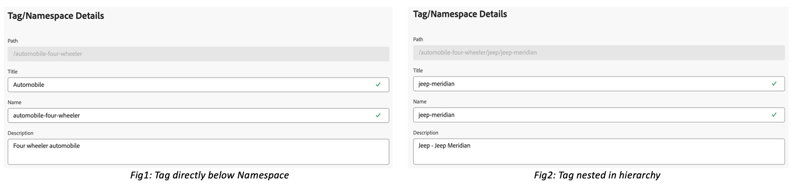

# 자산 보기에서 태그 관리 {#view-assets-and-details}

>[!CONTEXTUALHELP]
>id="assets_taxonomy_management"
>title="태그 관리"
>abstract="태그는 보다 효율적으로 찾아보고 검색할 수 있는 자산을 분류하는 데 유용합니다. 관리자는 관련 메타데이터의 적용, 자산 분류, 검색 지원, 태그 재사용, 검색 기능 개선 등을 용이하게 하는 계층적 태그 지정 구조를 사용할 수 있습니다."

태그는 보다 효율적으로 찾아보고 검색할 수 있는 자산을 분류하는 데 유용합니다. 태그 지정은 적절한 분류 체계를 다른 사용자 및 워크플로에 전파하는 데 도움이 됩니다.

제어된 어휘의 단순 목록은 시간이 지남에 따라 관리하기 까다로워질 수 있습니다. 관리자는 관련 메타데이터의 적용, 자산 분류, 검색 지원, 태그 재사용, 검색 기능 개선 등을 용이하게 하는 계층적 태그 지정 구조를 사용할 수 있습니다.

루트 수준에서 네임스페이스를 만들고 네임스페이스 내에서 하위 태그의 계층 구조를 만들 수 있습니다. 예를 들어 루트 수준에서 `Activities` 네임스페이스를 만들고 네임스페이스 내에 `Cycling`, `Hiking`, `Running`을 둘 수 있습니다. `Running` 내에는 추가 하위 태그 `Clothing` 및 `Shoes`를 둘 수 있습니다.

태그 지정은 다음과 같은 다양한 이점을 제공합니다.

* 태그 지정을 사용하면 작성자가 공통 분류 체계를 통해 서로 다른 자산을 쉽게 구성할 수 있습니다. 작성자는 공통 태그로 자산을 빠르게 검색하고 구성할 수 있습니다.

* 계층적 태그는 매우 유연하며 논리적인 방식으로 용어를 구성하는 훌륭한 방법입니다. 네임스페이스, 태그 및 서브태그를 통해 전체 분류 체계를 표현할 수 있다.

* 태그는 시간이 지나면서 조직의 어휘가 변경됨에 따라 발전할 수 있습니다.

* Assets에서 as a Cloud Service으로 관리되는 태그는 Assets 보기에서 관리되는 태그와 동기화 상태를 유지하므로 메타데이터 거버넌스와 무결성을 보장합니다.

자산에 태그를 적용하려면 먼저 네임스페이스를 만든 다음 태그를 만들고 추가해야 합니다. 태그를 만들어 기존 네임스페이스에 추가할 수도 있습니다. 루트 수준에서 만드는 모든 태그는 표준 태그 네임스페이스에 자동으로 추가됩니다. 그런 다음 태그 필드를 메타데이터 양식에 추가하여 자산 세부 정보 페이지에 표시할 수 있습니다. 이러한 설정을 구성하고 나면 자산에 태그 적용을 시작할 수 있습니다.

>[!NOTE]
>
>기본 메타데이터 양식을 사용하지 않는 경우에만 태그 필드를 메타데이터 양식에 추가해야 합니다.

태그 병합, 이름 바꾸기, 지역화 및 게시를 포함하여 이 문서에서 언급된 것 이상의 추가 기능을 Assets as a Cloud Service에서 사용할 수 있습니다.

## 네임스페이스 만들기 {#creating-a-namespace}

네임스페이스는 루트 수준에만 존재할 수 있는 태그의 컨테이너입니다. 네임스페이스의 논리적 이름을 먼저 정의하여 태그의 계층 구조 설정을 시작할 수 있습니다. 기존 네임스페이스에 태그를 추가하지 않으면 태그가 자동으로 표준 태그로 이동합니다.

네임스페이스를 만들려면 다음 단계를 수행하십시오.

1. `Settings` 아래의 `Taxonomy Management`로 이동하여 기존 네임스페이스 목록을 봅니다. 마지막으로 수정한 날짜, 네임스페이스 또는 그 아래의 태그를 수정한 사용자, 자산에서 태그가 사용된 횟수도 볼 수 있습니다.
1. `Create Namespace`를 클릭합니다.
1. 네임스페이스의 `Title`, `Name` 및 `Description`을 추가합니다. `Title` 필드에서 지정하는 입력 내용은 계층의 맨 위에 표시됩니다. 예를 들어 다음 이미지에서 **Activities**&#x200B;는 네임스페이스의 제목을 나타냅니다.

   

   <!--
    >[!NOTE]
    >You can use `Name` as a primary key if you are using any other metadata management tool is the source of truth for taxonomy values, you can use the name as a primary key.
    >
    -->

1. `Save`를 클릭합니다.

## 네임스페이스에 태그 추가 {#adding-tags-to-namespace}

네임스페이스에 태그를 추가하려면 다음 단계를 수행하십시오.

1. `Taxonomy Management`로 이동합니다.
1. 네임스페이스를 선택하고 `Create`를 클릭하여 네임스페이스 아래의 최상위 수준에서 태그를 만듭니다. 네임스페이스에 존재하는 태그 아래에 하위 태그를 만들어야 하는 경우 태그를 선택한 다음 `Create`를 클릭합니다.
   

   이 예에서 왼쪽 이미지는 `Path` 경로에 표시된 네임스페이스 `automobile-four-wheeler` 바로 아래에 있는 태그를 나타냅니다. 오른쪽 이미지는 태그 내에 하위 태그를 추가한 예입니다. 네임스페이스 외에 `Path` 필드에 다른 태그 이름 `jeep` 및 `jeep-meridian`이 있습니다.
1. 태그의 제목, 이름, 설명을 지정하고 `Save`를 클릭합니다.

## 표준 태그에 태그 추가 {#adding-tags-to-standard-tags}

구조화되지 않은 태그 또는 계층이 없는 태그는 `Standard Tags` 네임스페이스 아래에 저장됩니다. 또한 관리되는 분류 체계에 영향을 주지 않고 추가 설명 용어를 추가하려는 경우 해당 값을 `Standard Tags` 아래에 저장할 수 있습니다. 시간이 지남에 따라 구조화된 네임스페이스에서 이러한 값을 이동할 수 있습니다. 또한 `Standard Tags` 네임스페이스를 키워드에 대한 자유 형식 항목으로 사용할 수 있습니다.

표준 태그를 만들려면 루트 수준에서 `Create Tag`를 클릭합니다. 제목, 이름, 설명을 지정한 다음 `Save`를 클릭합니다.

<!--
>[!NOTE]
>
>If you delete `Standard Tags` namespace using Assets as a Cloud Service, the tags created at the root-level do not display in the list of available tags. 
-->

## 태그로 이동 {#moving-tags}

잘못된 계층 아래에 태그를 저장하거나 시간이 지남에 따라 분류 체계가 변경되는 경우 선택한 태그를 이동하여 데이터 무결성을 유지할 수 있습니다. 태그를 이동할 때는 다음 조건을 고려해야 합니다.

* 태그는 기존 네임스페이스 아래 또는 기존 태그 계층 내에서만 이동할 수 있습니다.
* 태그는 루트로 이동하여 네임스페이스가 될 수 없습니다.
* 상위 태그를 이동하면 계층에 저장된 모든 하위 태그도 이동됩니다.

한 위치에서 다른 위치로 태그를 이동하려면 다음 단계를 수행하십시오.

1. 적절한 네임스페이스 아래에서 태그 또는 태그의 전체 계층을 선택하고 `Move`를 클릭합니다.
1. 이동 대화 상자에서 `Select Tag` 섹션을 사용하여 새 대상 태그 또는 네임스페이스를 선택합니다.
1. `Save`를 클릭합니다. 태그가 새 위치에 표시됩니다.

## 태그 편집 {#editing-tags}

태그의 제목을 편집하려면 태그를 선택하고 `Edit`을 클릭합니다. 새 제목을 지정하고 `Save`를 클릭합니다.

>[!NOTE]
>
>* 태그의 `Name`은 업데이트할 수 없습니다. 태그의 루트 경로도 태그 이름을 기반으로 합니다. `Title` 필드를 업데이트해도 경로는 동일하게 유지됩니다.
>* 병합, 지역화 및 게시와 같은 추가 작업은 Assets as a Cloud Service에서 가능합니다.

## 태그 삭제 {#deleting-tags}

여러 네임스페이스 또는 태그를 동시에 삭제할 수 있습니다. 삭제 작업은 취소할 수 없습니다.

태그를 삭제하려면 다음 단계를 수행하십시오.

1. 네임스페이스 또는 태그를 선택하고 `Delete`를 클릭합니다.
1. `Confirm`을 클릭합니다.

>[!NOTE]
>
>* 상위 태그 또는 네임스페이스를 삭제하면 계층에 저장된 하위 태그도 삭제됩니다. 상위 네임스페이스를 삭제하거나 업데이트해야 하는 경우 새 대상으로 [태그를 이동](#moving-tags)한 후 상위 계층을 삭제하는 것이 좋습니다.
>* 태그를 삭제하면 자산의 모든 참조도 삭제됩니다.
>* 루트 수준에 있는 표준 태그는 삭제할 수 없습니다.

## 메타데이터 양식에 태그 구성 요소 추가 {#adding-tags-to-metadata-form}

태그 구성 요소는 `default` 메타데이터 양식에 자동으로 추가됩니다. 템플릿을 사용하거나 처음부터 직접 [메타데이터 양식](https://experienceleague.adobe.com/docs/experience-manager-assets-essentials/help/metadata.html?lang=en#metadata-forms)을 설계할 수 있습니다. 기존 메타데이터 양식 템플릿을 사용하지 않는 경우 메타데이터 양식을 수정하고 태그 구성 요소를 추가할 수 있습니다. 메타데이터 속성 매핑은 자동으로 채워지며 현재로서는 수정할 수 없습니다. Assets as a Cloud Service 사용자는 사용자 정의 네임스페이스를 사용하여 태그 값을 저장하도록 매핑을 업데이트하고 루트 경로를 사용하여 계층의 하위 집합만 노출할 수 있습니다.

메타데이터 양식에 태그 구성 요소를 추가하는 방법을 보려면 이 빠른 비디오를 시청하십시오.

>[!VIDEO](https://video.tv.adobe.com/v/3420452)

### 자산에 태그 추가 {#adding-tags-to-assets}

1. 자산 세부 정보 페이지에서 메타데이터 양식의 `Tags` 섹션으로 이동합니다.
1. 태그 필드 옆에 있는 태그 선택기 아이콘을 선택하거나 태그 이름을 입력하여 제안된 결과를 확인합니다.

   

1. 하나 이상의 태그를 선택합니다. 하위 태그는 상위 태그 또는 네임스페이스와 함께 자동으로 선택됩니다.
에셋 보기에서 수정된 태그는 에셋 as a Cloud Service으로 적용됩니다.

>[!NOTE]
>
>* `Title` 및 `Name` 필드는 필수이며 `Description` 필드는 선택 사항입니다.
>* 기본적으로 이 도구는 제목 필드에 입력한 텍스트를 복사하고 공백이나 특수 문자(. &amp; / \ : * ? [ ] | &quot; %)를 제거한 후 이름으로 저장합니다.
>* `Title` 필드는 나중에 업데이트할 수 있지만 `Name` 필드는 읽기 전용입니다.
