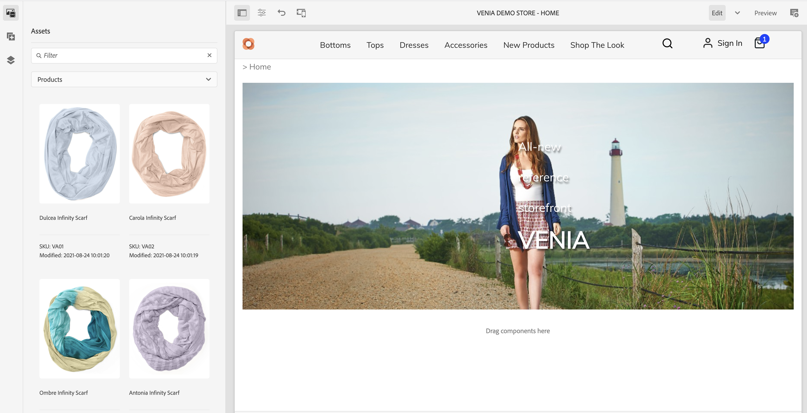

# 상거래 경험 작성 {#authoring-commerce-experiences}

## 개요 {#overview}

CIF 추가 기능은 상업용 기능으로 AEM 작성을 확장합니다. 이를 통해 작성자는 컨텍스트를 벗어나지 않고 제품 데이터 및 콘텐츠에 액세스하여 상거래 관련 경험을 효율적으로 구축하고 관리할 수 있습니다.

## 선택기 {#pickers}

제품 및 카테고리 선택기 는 AEM 작성자가 필요할 때 제품 또는 카테고리를 찾아 선택할 수 있는 편안한 방법을 제공하는 모달 UI 대화 상자입니다. 핵심 구성 요소, 콘텐츠 연결 및 제품 템플릿은 제품 카탈로그 데이터가 필요한 구성을 갖는 일반적인 영역입니다. 선택기는 다중 선택, 변형 선택 및 값의 사전 선택과 같은 다양한 구성 옵션을 지원합니다.

### 제품 선택기 {#product-picker}

이 선택기는 카탈로그 구조 또는 전체 텍스트 검색을 탐색하여 제품을 찾을 수 있도록 제공합니다. 변형이 있는 제품은 &#39;유형&#39; 열에 폴더 아이콘을 제공합니다. 폴더 아이콘을 클릭하면 선택한 제품의 변형이 열립니다.

상위 카테고리를 클릭하면 작성자가 제품 수준으로 돌아갑니다.

**예제 제품 티저**

이 구성 요소의 구성 대화 상자에는 제품이 필요합니다. CIF는 제품 식별자로 SKU를 사용합니다. 작성자가 직접 sku를 입력하거나 폴더 아이콘을 클릭하여 제품 선택기를 열 수 있습니다. 선택기를 선택하고 닫으면 구성 요소 대화 상자에 선택한 제품의 이름이 표시됩니다

### 범주 선택기 {#category-picker}

이 선택기는 카탈로그 구조를 탐색하여 범주를 찾는 기능을 제공합니다.

**예제 카테고리 캐러셀**

이 구성 요소의 구성 대화 상자에는 1 : n 카테고리가 필요합니다. CIF는 UID/ID를 범주 식별자로 사용합니다. 작성자가 직접 UID를 입력하거나 폴더 아이콘을 클릭하여 범주 선택기를 열 수 있습니다. 선택기를 선택하고 닫으면 구성 요소 대화 상자에 선택한 범주의 이름이 표시됩니다.

## Universal Editor {#universal-editor}

범용 편집기는 실시간 제품 데이터 및 관련 제품 콘텐츠에 액세스할 수 있는 기능으로 확장되었습니다.

### 제품 데이터 액세스 {#access-product-data}

편집기 사이드 패널의 &#39;에셋&#39; 탭에서는 &#39;제품&#39; 유형을 선택하여 제품 데이터에 액세스할 수 있습니다. 데이터는 구성된 상거래 끝점에서 실시간으로 가져옵니다. 필터는 특정 제품을 찾기 위한 상거래 끝점의 전체 텍스트 검색입니다.

에셋에 아날로그로 연결되는 제품은 페이지에서 다운로드할 수 있습니다(제품 티저 구성 요소는 기본적으로 생성됨). 또는 구성 요소(현재 지원되는 것은 제품 티저 및 제품 캐러셀임).

### RTE를 사용하여 텍스트 필드에 링크 추가 {#rte}

CIF 제품 카탈로그 페이지는 즉시 렌더링되는 가상 페이지입니다. 따라서 일반 AEM 페이지처럼 하이퍼링크를 포함할 수 없습니다. CIF는 새 작업 &quot;Commerce Links&quot;를 RTE(리치 텍스트 편집기)에 추가합니다. 이 작업은 일반적인 &quot;하이퍼링크&quot; 작업과 정확히 비슷하게 작동하지만 작성자가 선택기를 사용하여 제품이나 카테고리를 선택할 수 있습니다.

    >[!NOTE]
    >
    > 카테고리와 제품을 모두 선택하면 제품이 가져옵니다.

이렇게 하면 페이지가 렌더링될 때 실제 링크로 대체되는 자리 표시자 링크가 만들어집니다.

### 관련 제품 콘텐츠 액세스 {#associated-content}

유니버설 편집기가 페이지에서 1:n 제품을 인식하면 사이드 패널에 &quot;관련 상거래 콘텐츠&quot; 탭이 자동으로 표시됩니다. 이 탭을 사용하면 작성자가 제품과 함께 태그가 지정된 AEM 콘텐츠에 빠르게 액세스할 수 있습니다(참조) [관련 AEM 콘텐츠를 사용하여 제품 데이터 강화](./enrich-product-associated-content.md) 을 참조하십시오. 이 탭은 페이지에 여러 제품이 있는 경우 콘텐츠 유형 및 특정 제품을 필터링할 수 있는 드롭다운을 제공합니다. 콘텐츠 사용은 &quot;에셋&quot; 탭의 콘텐츠를 사용하는 것과 정확히 동일하게 작동합니다.

### 준비된 제품 데이터 미리 보기 {#staged-data}

편집기의 타임워프 모드를 사용하면 작성자가 타임워프 날짜를 기반으로 스테이징된 제품 카탈로그 데이터로 AEM 경험을 미리 보고 검색할 수 있습니다.

사용된 날짜가 준비되면 구성 요소에 시각적 표시기가 표시됩니다.

## Omnisearch {#omnisearch}

Omnisearch를 사용하면 전문가가 전체 텍스트 검색을 사용하여 AEM 콘텐츠 및 제품 카탈로그 데이터를 쉽게 찾을 수 있습니다. Omnisearch는 AEM 및 상거래 백엔드에서 전체 텍스트 검색을 실행하여 상거래 백엔드 및 AEM 콘텐츠에서 제품 카탈로그 개체를 찾습니다. AEM 결과에는 제품/카테고리 데이터로 태그가 지정된 콘텐츠도 포함됩니다.

결과는 유형별로 그룹화됩니다.

>[!NOTE]
>
> Omnisearch의 전체 텍스트 검색은 연결된 콘텐츠 조각을 지원하지 않습니다. SKU 또는 UID를 사용하여 관련 콘텐츠 조각을 찾습니다.
