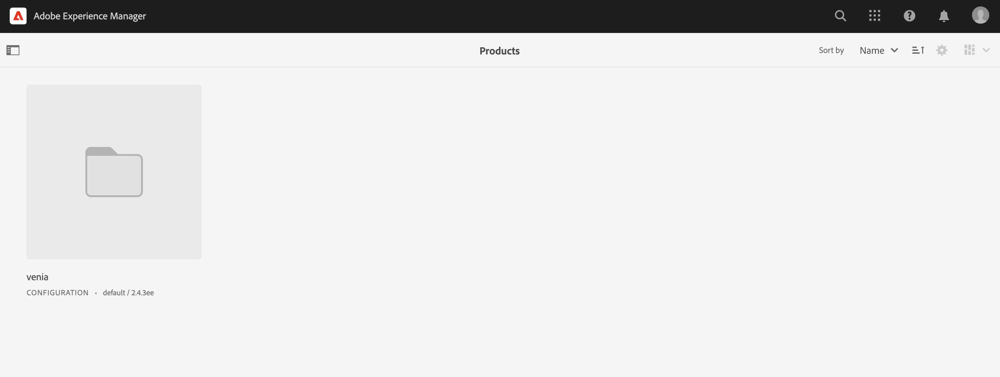
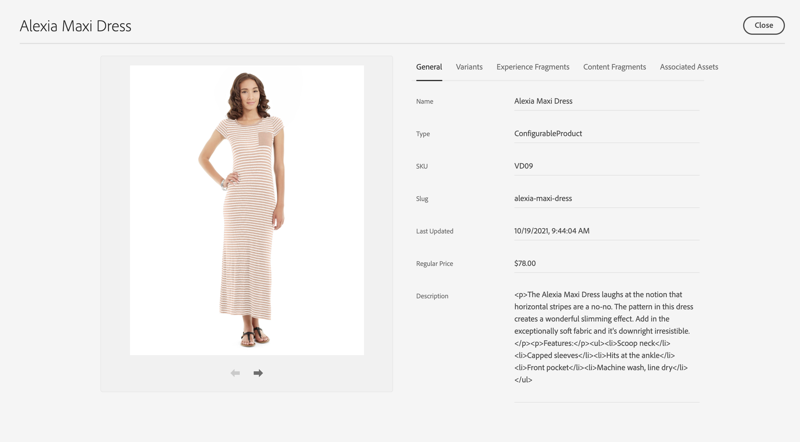

# 제품 관리실 {#product-cockpit}

## 개요 {#overview}

제품 관리실에서는 연결된 제품 카탈로그 및 관련 컨텐츠에 대한 통합 개요를 제공합니다. 모든 관련 콘텐츠에는 조종석에서 빠르게 액세스할 수 있는 링크가 있습니다.

스테이징된 제품 데이터에는 새 카테고리, 제품 또는 업데이트된 속성과 같은 향후 모든 돌연변이가 포함됩니다.

>[!NOTE]
>
>제품 카탈로그라는 용어는 상거래 상점, 스토어 보기 및 유사한 표현식과 상호 호환됩니다.

## 구성 {#configuration}

제품 카탈로그는 AEM에서 구성해야 합니다. 다음을 참조하십시오 [스토어 및 카탈로그 구성](https://experienceleague.adobe.com/docs/experience-manager-cloud-service/content/content-and-commerce/storefront/getting-started.html#catalog) 추가 정보.

단계적 카탈로그 기능을 활성화하려면 인증이 필요합니다. 다음을 참조하십시오 [시작](https://experienceleague.adobe.com/docs/experience-manager-cloud-service/content/content-and-commerce/storefront/getting-started.html) 추가 정보.

>[!NOTE]
>
>단계적 카탈로그 기능은 토큰 기반 인증을 지원하는 Adobe Commerce 및 서드파티 커넥터에서만 사용할 수 있습니다.

## 제품 관리실 열기 {#opening-product-cockpit}

제품 관리실에 액세스하는 가장 쉬운 방법은 AEM 메인 메뉴의 &#39;상거래&#39; 메뉴를 통해 확인할 수 있습니다. Omnisearch(상거래 검색) 또는 열기 를 사용할 수도 있습니다 `https://<yourAEMInstance>/commerce.html`.

## 제품 카탈로그 찾아보기 {#browsing-product-catalogs}

제품 관리실은 제품 카탈로그 구조에 따라 계층적으로 구성됩니다. 첫 번째 수준은 상거래 백엔드의 메타 정보를 포함하여 구성된 모든 제품 카탈로그의 카탈로그 루트 수준을 보여줍니다.

카테고리를 클릭하면 클릭한 카테고리의 하위 항목이 로드됩니다.

사용 가능한 경우 제품을 클릭하면 제품 변형이 로드됩니다.

>[!NOTE]
>
>AEM의 제품 카탈로그 데이터는 구성된 상거래 끝점을 통해 실시간으로 검색되는 데이터입니다. AEM에 저장된 제품 카탈로그 데이터가 없습니다.

## 제품 카탈로그 검색 중 {#searching-product-catalog}

왼쪽 필터 탭에 전체 제품 카탈로그에 대한 전체 텍스트 검색이 제공되어 제품을 빠르게 찾을 수 있습니다.

## 단계적 제품 카탈로그 찾아보기 {#staged-product-catalogs}

기본적으로 제품 관리실에는 라이브 제품 카탈로그 데이터가 표시됩니다. 왼쪽 필터 탭에서 &quot;준비된 카탈로그&quot;를 사용하면 선택한 날짜에 대한 제품 카탈로그가 로드됩니다.

## 제품 카탈로그 속성 {#catalog-properties}

제품 또는 범주의 속성 아이콘을 클릭하면 선택한 객체의 속성 보기가 열립니다. 제품 변형의 열린 속성은 기본 제품 속성을 연 것과 같습니다.

### 상거래 탭 {#tabs}

일반 및 변형 탭에는 상거래 백엔드에서 가져오는 사전 정의된 상거래 속성이 표시됩니다. 이 데이터(포함) 레코드 시스템이 상거래 백엔드이므로 variables)는 AEM에서 읽기 전용 데이터입니다. 변형 탭은 변형이 있는 제품에만 표시되며 모든 변형 목록을 표시합니다.

### AEM 컨텐츠 탭 {#content-tabs}

AEM 콘텐츠 유형(경험 조각, 콘텐츠 조각, 관련 에셋)별로 그룹화된 이 탭에는 상거래 개체와 연결된 AEM 콘텐츠가 표시됩니다. &#39;세부 정보 보기&#39; 작업을 수행하면 선택한 콘텐츠로 새 브라우저 탭이 열립니다.

