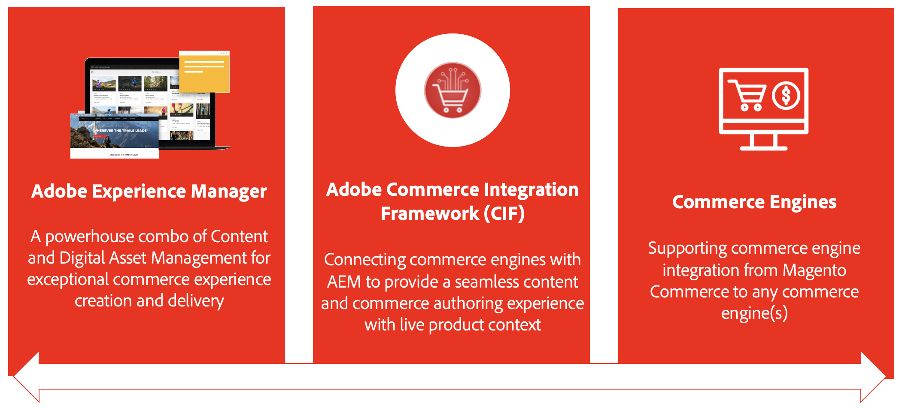

# AEM 전자 상거래 통합 프레임워크(CIF) 소개 {#cif-intro}

상거래 솔루션은 Adobe Commerce Cloud와 같은 상업용 솔루션부터 일련의 사용자 정의 상거래 서비스에 이르기까지 다양할 수 있습니다. 통합은 사용 사례와 생태계에 크게 의존하고 있다. 이는 일반적으로 다양한 시스템에 영향을 미치며 다양한 형태로 제공됩니다.

* 복잡하고 동적인 에코시스템(예: 제품 카탈로그) 통합
* 비즈니스는 효율적이고 옴니채널 방식으로 자체 수명 주기를 통해 제품 콘텐츠를 관리해야 합니다
* 헤드를 다양화하기 위해 복잡하고 개인화된 쇼핑 여정 구축
* 백엔드와 프론트엔드에서 빠르게 적응하고 혁신할 수 있는 기능
* 통합 검색 및 캐시 관리를 포함하여 최고의 성능(플래시 판매, 블랙 프라이데이 등)을 위해 구축된 확장 가능하고 안정적인 E2E 인프라 실행

이러한 복잡성으로 인해 잠재적 오류 지점, TCO 증가 및 지연이 발생하고 가치 실현이 축소될 수 있습니다. 이러한 이유로 Experience Manager의 추가 기능인 Commerce Integration Framework(CIF)를 개발하게 되었습니다. CIF는 상거래 기능을 사용하여 Experience Manager를 확장하고 상거래 엔진과의 통합을 표준화합니다. 따라서 TCO(총 소유 비용)가 절감되고 미래에도 대비할 수 있고 안정적이며 확장 가능한 솔루션이 됩니다. 애자일 도구와 완벽하게 통합된 기능을 통해 기술 및 비즈니스 혁신을 실현하여 멋진 상거래 경험을 구축하게 되었습니다.

## CIF 이점 {#cif-benefits}

CIF는 사용자 정의 코드의 필요성을 줄이고 브랜드의 시장 출시 기간을 가속화하는 즉시 사용 가능한 상거래 핵심 구성 요소를 제공합니다. 모든 핵심 구성 요소는 Adobe의 클라이언트측 데이터 레이어와 즉시 통합되어 통합 프로필 등 고객 프로필을 하이드레이션합니다. 이 프로필은 구체적으로 방문자 행동을 캡처하고 이를 사용하여 실시간으로 고객 여정을 예측하고 개인화할 수 있습니다.

CIF 추가 기능은 Experience Manager로 제품 컨텍스트를 가져오고, 마케터가 개발자에 의존하지 않고 Experience Manager에서 쇼핑 가능한 경험을 만들고 제공할 수 있도록 제품 콘솔과 제품/카테고리 선택기 등 작성 도구를 제공합니다. 이점은 다음과 같습니다.

* [매력적인 경험](#experiences)
* [가치 창출 시간 단축](#ttv)
* [강력한 통합](#integrations)

### 경험 {#experiences}

AEM의 강력한 CIF 도구를 통해 콘텐츠 제작자는 확장 가능하고 게재와 무관하게 다양하고 개인화된 상거래 경험을 신속하게 구축하여 비즈니스 기회를 활용할 수 있습니다.

### 가치 창출 시간 (TTV) {#ttv}

CIF은 [AEM 핵심 구성 요소](https://www.aemcomponents.dev/), [AEM Venia 참조 상점](https://github.com/adobe/aem-cif-guides-venia), [AEM Project Archetype](https://experienceleague.adobe.com/docs/experience-manager-core-components/using/developing/archetype/overview.html) 및 PWA(Headless 콘텐츠 및 상거래)용 통합 패턴을 통해 프로젝트 개발을 가속화합니다.

CIF은 항상 최신의 추가 기능을 통해 새롭고 개선된 기능에 액세스할 수 있도록 지속적인 혁신을 위해 빌드되었습니다.

### 통합 {#integrations}

[Adobe I/O Runtime](https://www.adobe.io/apis/experienceplatform/runtime.html), 마이크로서비스 기반의 서버를 사용하지 않는 PaaS와 [CIF의 참조 구현](https://github.com/adobe/commerce-cif-graphql-integration-reference)을 사용하여 생태계(예: 상거래 솔루션)을 Experience Cloud에 연결합니다.

## 입증된 패턴 및 모범 사례 {#proven}

CIF에서는 모범 사례를 기반으로 표준화된 통합 패턴을 지원합니다. 이를 통해 현재의 성공적인 성과를 거둘 수 있으며 향후 요구 사항에 맞게 유연하게 확장하고 조정할 수 있습니다.

* 다음과 같이 발생할 수 있는 제품 카탈로그 통합과 관련된 일반적인 문제를 해결합니다.
   * 카탈로그 볼륨 또는 복잡성이 높아진 성능 문제
   * 스테이징된 데이터에 대한 액세스 권한 없음
   * 실시간 제품 데이터 및 경험이 필요함
* 디지털 성숙도가 높아지면서 경험 관리가 필요하게 되었습니다
* &#x200B;
   * CIF는 추가 IT 작업 없이 점진적으로 통합 가능한 제품 경험 관리 기능과 함께 제공됩니다.
* 옴니채널 준비 완료
   * CIF은 패턴, 가속기 및 핵심 구성 요소가 있는 다양한 터치포인트 기술(서버측, 하이브리드, 클라이언트측)을 지원합니다.

## 여정 {#journey}

Commerce 여정을 따르는 경우 다음 단계로 이동하십시오.

* [AEM 콘텐츠 작성자 여정](/help/commerce-cloud/cif-storefront/commerce-journeys/aem-commerce-content-author/getting-started.md)
