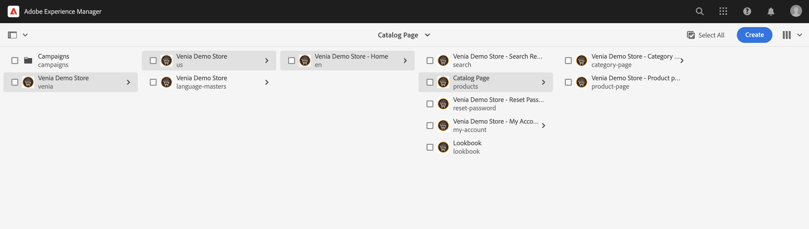
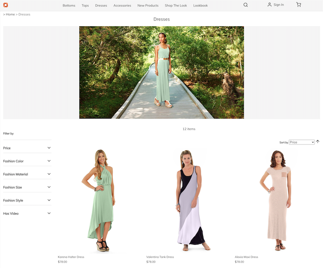
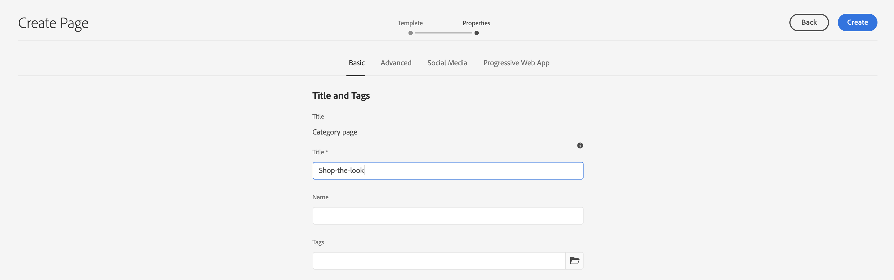

# 제품 카탈로그 페이지 및 템플릿 관리 {#product-catalog}

제품 카탈로그 페이지 및 템플릿을 관리하는 방법에 대해 알아봅니다.

## 지금까지의 스토리 {#story-so-far}

AEM Content and Commerce 작성 여정의 이전 문서에서는 [AEM CIF 작성 기본 사항 시작하기](getting-started.md), CIF 작성의 기본 사항에 대해 배웠습니다.

이 문서는 이러한 기본 사항을 기반으로 합니다.

## 목표 {#objective}

이 문서는 제품 카탈로그 페이지 및 템플릿을 관리하는 방법을 이해하는 데 도움이 됩니다. 문서를 읽고 나면

* 카탈로그 템플릿의 개념 이해
* 일반 템플릿 작동 방식
* 개별 템플릿을 만들었습니다.

## 기본 개념 {#basic-concept}

Venia storefront는 탐색, 랜딩, 카테고리(PLP), 제품 세부 사항 페이지(PDP)와 함께 일반적인 제품 카탈로그 경험을 제공합니다.

카탈로그 페이지는 AEM CIF 카탈로그 템플릿과 필요할 때 상거래 끝점에서 가져오는 실시간 제품 데이터를 사용하여 동적으로 작성됩니다. 모든 카탈로그에는 제품 및 범주 페이지에 대한 일반 템플릿이 있습니다.

탐색 구성 요소는 콘텐츠 및 카탈로그 페이지를 보여 줍니다. 탐색에서 카탈로그 랜딩 페이지 또는 첫 번째 수준 범주를 표시할 수 있습니다. 마우스로 범주를 가리키면 두 번째 수준의 범주가 두 번째 선으로 표시됩니다.

카테고리를 클릭하면 카테고리 페이지(또는 제품 목록 페이지)가 열립니다.

제품을 클릭하면 제품 세부 사항 페이지가 열립니다.

## 템플릿 {#templates}

### 일반 템플릿 {#generic}

일반 Venia 카탈로그 템플릿은 제품 목록 핵심 구성 요소를 사용합니다. 이 구성 요소는 사용 가능한 경우 카테고리 이미지를 표시하고 카테고리의 제품을 표시합니다.

일반 Venia 제품 템플릿은 제품 세부 사항 핵심 구성 요소를 사용합니다. 이 구성 요소는 다양한 제품 유형 및 장바구니에 추가 작업에 대한 제품 정보를 표시합니다.

### 템플릿 편집 {#edit-templates}

템플릿 페이지를 직접 열거나 제품 카탈로그 페이지를 탐색하는 동안 편집 모드로 전환하여 템플릿을 편집할 수 있습니다. 페이지를 변경하면 제품/카테고리의 특정 페이지뿐만 아니라 템플릿도 변경된다는 점을 기억하십시오.

### 범주 또는 제품별 템플릿 {#specific}

CIF은 몇 번의 클릭만으로 여러 템플릿을 지원합니다. 다른 템플릿을 만들려면 각 카테고리에서 일반 템플릿을 선택하고 **만들기** 작업.

해당 제품 또는 범주 템플릿을 선택합니다.

제목을 입력하고 페이지를 만듭니다.

이제 일반 템플릿 아래에 특정 템플릿이 있습니다.

템플릿을 엽니다. 이는 일반 범주 템플릿과 매우 유사합니다.

페이지 맨 위에 이미지를 추가합니다.

템플릿은 모든 범주/제품으로 미리 볼 수 있습니다. 열기 **페이지 정보** 다음을 선택합니다. **범주/제품으로 보기**. 선택기에서 제품/범주를 선택하여 이 제품/범주로 미리 보기를 가져옵니다. 선택 **룩을 쇼핑하다** 업데이트된 템플릿의 미리 보기를 가져올 수 있습니다.

이제 이 템플릿을 특정 카테고리에 할당해야 합니다. 에서 속성 열기 **페이지 정보** 메뉴를 클릭하고 commerce 탭으로 전환합니다. 폴더 아이콘을 클릭하여 **룩을 쇼핑하다** 카테고리 선택기의 카테고리입니다. 확인란을 활성화하여 템플릿에 여러 카테고리를 할당하고 하위 카테고리를 포함할 수도 있습니다.

기본 홈페이지로 돌아가서 **룩을 쇼핑하다** 특정 템플릿을 보려면 범주를 선택합니다. 다른 모든 범주는 여전히 일반 템플릿을 사용합니다.

동일한 워크플로우를 적용하여 개별 제품 템플릿을 만들 수 있습니다.

## 다음 단계 {#what-is-next}

이 여정 부분을 완료했으므로

* 카탈로그 템플릿의 개념 이해
* 일반 템플릿 작동 방식
* 개별 템플릿을 만들었습니다.

이 지식을 기반으로 다음 문서를 검토하여 여정을 계속하십시오. [단계적 제품 카탈로그 경험 관리](staged-catalog.md): 단계적인 제품 데이터 및 AEM Launch로 작업하는 방법을 배울 수 있습니다.

## 추가 리소스 {#additional-resources}

문서를 검토하여 여정의 다음 부분으로 넘어가는 것이 좋습니다 [단계적 제품 카탈로그 경험 관리](staged-catalog.md): 다음은 이 문서에 나열된 몇 가지 개념을 자세히 알아보는 추가적인 옵션 리소스이며, headless 여정을 계속 진행할 필요는 없습니다.

* [여러 범주 및 제품 페이지 만들기](/help/commerce-cloud/authoring/multi-template-usage.md)
* [Experience Manager Cloud Service에 대한 마이그레이션 안내서](/help/commerce-cloud/migration.md) - 이전 버전에서 AEM Commerce integration framework(CIF) 추가 기능으로 마이그레이션하는 방법
