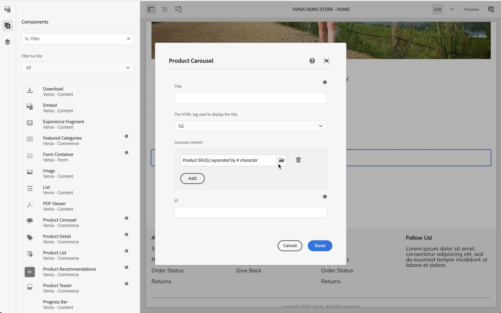

# AEM CIF 작성 시작하기 {#getting-started}

Adobe Experience Manager(AEM) CIF 작성에 대해 알아봅니다.

## 지금까지의 스토리 {#story-so-far}

이 AEM Content 및 Commerce 여정의 이전 문서인 [AEM Content 및 Commerce에 대해 알아보기](/help/commerce-cloud/introduction.md)에서는 headless CMS 및 AEM Content 및 Commerce에 대한 기본 이론과 개념을 배웠습니다.

이 문서는 이러한 기본 사항을 기반으로 합니다.

## 목표 {#objective}

이 문서는 CIF for Content 및 Commerce 특정 작성을 사용하는 방법을 이해하는 데 도움이 됩니다. 문서를 읽고 나면

* AEM에서 페이지 편집기를 사용하여 CIF 작성의 개념 이해
* 제품 및 카테고리 선택기를 사용하여 AEM에서 제품 카탈로그 데이터에 액세스하는 방법
* 제품 관리실 및 AEM Omnisearch를 사용하여 콘텐츠 및 상거래 데이터에 액세스하는 방법

## AEM 페이지 편집기에서 CIF 작성 {#cif-authoring}

CIF은 AEM의 페이지 편집기를 확장하여 컨텍스트를 종료하지 않고 실시간 제품 데이터에 액세스합니다.

사이드 패널을 열고 드롭다운 목록에서 &#39;제품&#39;을 선택합니다.

제품 카탈로그를 검색하거나 전체 텍스트 검색 필드를 사용하여 제품을 찾을 수 있습니다.

제품 티저 구성 요소를 자동으로 만드는 페이지에서 바로 제품 드롭을 지원하는 구성 요소(예: 제품 티저, 제품 캐러셀)에 제품을 드롭할 수 있습니다.

## 제품 및 카테고리 선택기 {#pickers}

상거래 구성 요소 또는 AEM 백오피스 대화 상자에 제품 및 카테고리 데이터가 필요한 경우 AEM 작성자는 UI 요소인 선택기를 사용하여 제품 카탈로그 데이터를 편안하게 검색 및 선택할 수 있습니다.

### 제품 선택기

폴더 아이콘을 클릭하면 선택기 모달 UI(예: 제품 티저)가 열립니다

왼쪽의 카탈로그 구조를 탐색하거나 검색하면 제품을 찾을 수 있습니다. 전체 텍스트 검색은 선택한 카테고리를 준수하고 검색 결과를 이 카테고리로 제한합니다.

변형이 있는 제품은 모든 변형을 표시하기 위해 클릭할 수 있는 폴더 아이콘으로 표시됩니다.

### 범주 선택기

제품 선택기처럼 작동합니다. 폴더 아이콘을 클릭하면 선택기 모달 UI가 열립니다(예: 카테고리 캐러셀)

왼쪽의 카탈로그 구조를 탐색하고 범주를 선택합니다.

## 제품 관리실 {#cockpit}

제품 관리실은 모든 풍부한 콘텐츠와 함께 제품 카탈로그에 빠르게 액세스할 수 있는 중앙 위치입니다. 다음 모듈 중 하나에서 콘텐츠를 사용하여 제품 데이터를 보강하는 방법을 배웁니다. 지금은 제품 데이터 액세스에 초점을 맞추겠습니다.

메인 메뉴에서 상거래를 클릭하여 첨부된 모든 제품 카탈로그 목록을 확인합니다.

연결된 모든 제품 카탈로그 목록이 표시됩니다.

제품 카탈로그에는 기본적으로 모든 제품과 함께 모든 첫 번째 수준 카테고리가 표시됩니다. 카테고리를 클릭하면 해당 카테고리가 모든 관련 제품 및 하위 카테고리(해당 제품 포함)와 함께 열립니다.

속성 아이콘을 클릭하여 제품 속성을 열 수 있습니다. 제품 타일 위로 마우스를 가져가면 아이콘이 표시됩니다.

연결된 백엔드에서 실시간으로 데이터가 로드되기 때문에 모든 제품 속성은 읽기 전용입니다. 제품 속성 변경은 기록 시스템인 백엔드 시스템에서 수행해야 합니다. 제품에 변형이 있는 경우에만 **변형** 탭이 표시됩니다. 탭을 클릭하면 해당 속성이 있는 모든 변형이 표시됩니다.

나머지 탭에는 제품과 연결된 모든 AEM 콘텐츠가 표시됩니다. 이러한 탭은 다음 모듈 중 하나에서 설명합니다.

## AEM Omnisearch {#omnisearch}

Omnisearch를 사용하면 전체 텍스트 검색을 사용하여 AEM 콘텐츠를 쉽게 찾을 수 있습니다. CIF은 연결된 AEM 콘텐츠와 함께 제품 카탈로그의 전체 텍스트 검색으로 Omnisearch를 확장합니다.

Omnisearch는 상거래 백엔드에서 전체 텍스트 검색을 실행하여 모든 관련 제품을 검색합니다. 결과는 **모든 제품 보기**&#x200B;에 나열됩니다. Omnisearch는 또한 AEM에서 검색된 제품과 관련된 콘텐츠를 검색합니다. 결과는 해당 AEM 카테고리 아래에 나열됩니다. 이 예에서 하나의 콘텐츠 조각은 제품과 관련되어 있습니다.

## 다음 단계 {#what-is-next}

이 여정 부분을 완료했으므로

* 페이지 편집기를 사용한 CIF 작성의 개념 이해
* 제품 및 카테고리 선택기를 사용하여 AEM에서 제품 카탈로그에 액세스하는 방법
* 제품 관리실 및 AEM Omnisearch를 사용하여 콘텐츠 및 상거래 데이터에 액세스하는 방법

이 지식을 기반으로 다음 문서인 [제품 카탈로그 여정 및 템플릿 관리](catalog-templates.md)를 검토하여 을 계속하십시오. 여기에서는 첫 번째 제품 카탈로그 경험을 빌드하고 사용자 지정하는 방법에 대해 알아봅니다.

## 추가 리소스 {#additional-resources}

여정의 다음 부분인 [제품 카탈로그 페이지 및 템플릿 관리](catalog-templates.md)(으)로 넘어가는 것이 좋습니다. 다음은 여기에 나열된 몇 가지 개념을 자세히 알아보는 선택적 리소스입니다. 그러나 이러한 선택적 리소스는 여정에서 계속 진행할 필요가 없습니다.

* [저장소 및 카탈로그 구성](/help/commerce-cloud/getting-started.md#catalog)
