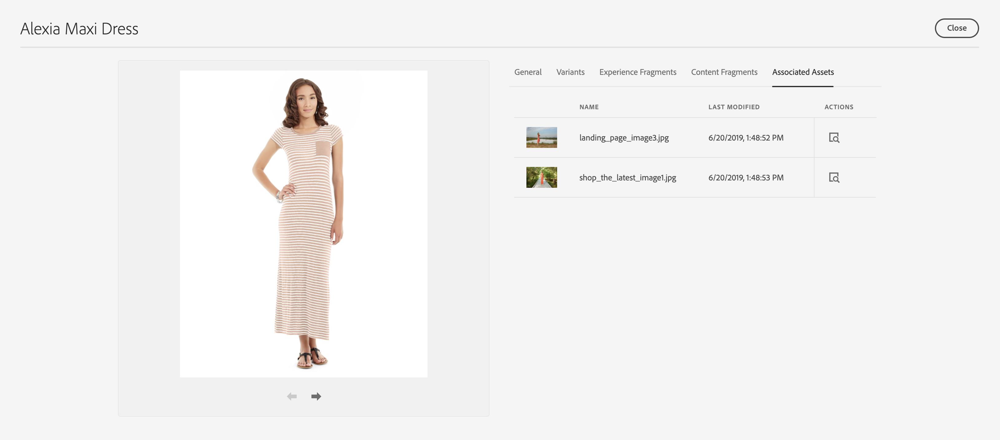

# 제품 경험 빌드 {#building-experiences}

제품 경험을 관리하는 방법을 알아봅니다.

## 지금까지의 스토리 {#story-so-far}

AEM Content and Commerce 여정의 이전 문서에서는 [단계적 제품 카탈로그 경험 관리](staged-catalog.md)를 통해 단계적 제품 카탈로그 경험을 관리하는 방법을 배웠습니다.

## 목표 {#objective}

이 문서는 제품 콘텐츠 및 경험을 구축하는 방법을 이해하는 데 도움이 됩니다.

## 제품 경험 관리 {#management}

제품 경험 관리는 제품 데이터(PIM 또는 상거래 솔루션이 소유)를 AEM의 마케팅 콘텐츠로 장식하는 방법입니다. 이렇게 콘텐츠가 포함된 풍부한 제품 데이터를 다양한 채널에서 사용하여 몰입형 쇼핑 경험을 만들 수 있습니다.

AEM에서 다양한 유형의 콘텐츠를 만들고 제품 카탈로그에 연결할 수 있습니다. 연관된 콘텐츠를 쉽게 검색하고 사용할 수 있으므로 생산성이 높습니다.

### 자산 {#assets}

높은 수준에서 제품과 관련된 자산에는 두 가지 유형이 있습니다. 제품 자산은 일반적으로 판매자가 관리하며 제품 표시(대부분 중립적인 배경 앞)에 중점을 둡니다. 자산은 상거래 솔루션 또는 AEM Assets(commerce / pim 솔루션에 대한 자산 통합 포함)에서 관리됩니다.

마케팅 에셋은 일반적으로 마케팅이 소유한 제품을 홍보하고 사용하는 것과 관련이 있습니다. 예를 들어 여러 제품(&quot;모양 보기&quot;), 특정 컨텍스트(&quot;야외 가을 컬렉션&quot;) 또는 방법 pdf를 보여 주는 경우가 있습니다. CIF는 모든 AEM 에셋을 제품 카탈로그 개체와 연결하는 쉬운 방법을 제공합니다.

자산 속성을 열고 로 전환합니다. **상거래** 탭. 이 탭에서는 제품과의 연결을 관리할 수 있습니다. 선택기 아래의 표에서는 링크된 객체에 대한 추가 정보를 제공합니다(선택 항목에만 표시됨). 세부 정보 아이콘을 클릭하면 제품 관리실에 전체 보기가 표시됩니다. 새 객체를 연결하려면 제품 선택기 아이콘(폴더 아이콘)을 클릭하고 객체를 선택한 다음 선택기를 닫습니다.

### 경험 조각 {#experience-fragments}

경험 조각 은 재사용 가능한 또는 개별 제품 콘텐츠를 대규모로 생성하는 좋은 방법입니다. 연결은 자산과 유사하게 작동합니다. 속성을 열고 로 전환합니다 **상거래** 탭. 이 탭에서는 제품 및 범주와의 연결을 관리할 수 있습니다. 선택기 아래의 표에서는 링크된 객체에 대한 추가 정보를 제공합니다(선택 항목에만 표시). 세부 정보 아이콘을 클릭하면 제품 관리실에 전체 보기가 표시됩니다. 새 객체를 연결하려면 제품 선택기 아이콘(폴더 아이콘)을 클릭하고 객체를 선택한 다음 선택기를 닫습니다.

### 콘텐츠 조각 {#content-fragments}

콘텐츠 조각 은 구조화된 콘텐츠에 가장 적합한 콘텐츠 유형입니다. 추가 마케팅 데이터로 외부 제품 데이터를 보강하거나 Headless 방식으로 콘텐츠를 만드는 데 사용할 수 있습니다. 콘텐츠 조각을 제품 카탈로그 개체와 연결하는 작업은 콘텐츠 조각 모델 편집기의 제품 또는 카테고리 참조 유형을 통해 수행됩니다. 모델에 올바른 참조 유형을 끌어다 놓고 필드를 구성하기만 하면 됩니다. 이러한 유형은 단일 또는 다중 선택을 지원합니다.

이 모델을 기반으로 새 콘텐츠 조각을 만드는 경우 이러한 참조 유형을 사용하면 각 선택기를 사용하여 올바른 개체를 쉽게 선택할 수 있습니다.

### 제품 관리실 {#product-cockpit}

이전 모듈 중 하나에 제품 관리실(또는 콘솔)을 도입했습니다. 관리실은 제품 카탈로그를 탐색할 뿐만 아니라 관련된 모든 AEM 콘텐츠를 한 곳에서 볼 수 있는 쉬운 방법입니다. 제품 콘솔로 이동하여 콘텐츠가 연결된 제품의 속성을 엽니다. 관련 콘텐츠를 보려면 해당 탭으로 전환하십시오.

작업 아이콘을 클릭하면 새 브라우저 탭에서 해당 콘텐츠가 열립니다.

## 개별 제품 및 범주 페이지 강화 {#enrich}

이전 모듈에서는 여러 제품 카탈로그 템플릿을 사용하여 작업하는 방법을 배웠습니다. 여러 템플릿을 사용하면 다양한 템플릿을 만들 수 있지만, 대부분의 경우에는 이러한 템플릿을 만들 필요가 없습니다. 많은 경우 개별 콘텐츠에 대해 동일한 템플릿을 자리 표시자와 함께 사용할 수 있습니다. CIF는 콘텐츠 조각 및 경험 조각에 대한 자리 표시자를 지원합니다.

경험 조각 자리 표시자부터 시작하겠습니다. AEM 편집기에서 제품 템플릿을 엽니다. 을(를) 끌어다 놓습니다. **상거래 경험 조각** 구성 요소를 템플릿에 적용한 다음 구성 대화 상자를 엽니다.

구성 요소의 대화 상자를 열고 이 자리 표시자의 이름을 입력합니다. 자리 표시자 이름이 필요하며, 자리 표시자를 필요한 수만큼 추가할 수 있습니다.

이전 단계에서 제품에 연결한 경험 조각을 엽니다. 속성을 열고 상거래 탭으로 전환합니다. 아래에 동일한 자리 표시자 이름을 입력하십시오. **카탈로그 자리 표시자 위치**.

이제 을(를) 끌어서 놓습니다 **Commerce 콘텐츠 조각** 구성 요소를 템플릿에 추가하고 구성 대화 상자를 엽니다.

이 대화 상자는 핵심 구성 요소의 콘텐츠 조각 대화 상자를 다시 사용합니다. 추가 리소스에서 자세한 정보를 확인하십시오. 유일한 차이점은 **링크 요소** 콘텐츠 조각 모델에서 식별자 필드(제품 SKU 또는 카테고리 UID)를 구성하는 속성입니다.

이제 관련 콘텐츠 조각 및/또는 경험 조각이 있는 제품 페이지를 미리 봅니다. AEM은 페이지를 렌더링할 때 경험 조각의 유형(콘텐츠 또는 경험 조각), 식별자 및 자리 표시자 이름을 기반으로 모든 자리 표시자에 대해 조회를 수행합니다. AEM은 URL 확인자를 사용하여 식별자(제품의 경우 SKU, 범주의 경우 UID)를 가져옵니다. 경험 또는 콘텐츠 조각이 반환되면 자리 표시자 위치에 렌더링되고, 그렇지 않으면 자리 표시자가 무시됩니다.

## 콘텐츠 구매 가능 {#making-shoppable}

상거래 구성 요소를 추가하여 일반 AEM 페이지를 구매 가능하도록 할 수도 있습니다. AEM에서 새 컨텐츠 페이지를 만들고 편집기에서 빈 페이지를 엽니다.

먼저 페이지에서 제품 세부 사항 구성 요소를 드래그하여 놓습니다. 그런 다음 에셋 사이드바로 전환하고 제품으로 전환한 다음 제품을 선택합니다. 제품 구성 요소에 해당 제품을 드래그하여 놓습니다. 콘텐츠 페이지에 일반 제품 구성 요소가 표시됩니다.

해당 제품에 대한 관련 컨텐츠를 만든 경우 에셋 사이드바에서 로 전환합니다. **연계된 상거래 컨텐츠**. 이 탭에는 이 제품과 연결된 모든 AEM 콘텐츠가 표시됩니다. 이제 관련 콘텐츠를 사용하여 페이지를 빠르게 장식할 수 있습니다.

## 여정의 끝 {#end-of-journey}

축하합니다! AEM Content and Commerce 개발자 여정을 완료했습니다! 이제 다음과 같은 작업을 수행할 수 있습니다.

* AEM 콘텐츠를 제품 카탈로그 개체에 연결하는 방법 이해
* 자리 표시자를 사용하여 제품 및 범주 페이지를 개별적으로 보강
* 콘텐츠를 구매 가능하게 하고 관련 콘텐츠 탭을 사용하는 방법을 이해할 수 있습니다.

이제 AEM Content 및 Commerce를 사용하여 제품 경험을 관리할 준비가 되었습니다. 그러나 AEM Content 및 Commerce에는 다양한 추가 옵션이 있습니다. 이 여정에서 확인한 기능들에 대한 자세한 내용은 [추가 리소스 섹션](#additional-resources)에서 사용할 수 있는 몇 가지 추가 리소스를 확인하십시오.

## 추가 리소스 {#additional-resources}

* [상거래 경험 작성](/help/commerce-cloud/authoring/authoring-commerce-experiences.md)
* [제품 관리실](/help/commerce-cloud/authoring/product-cockpit.md)
* [콘텐츠 조각 구성 요소](https://experienceleague.adobe.com/docs/experience-manager-core-components/using/components/content-fragment-component.html?lang=en)
