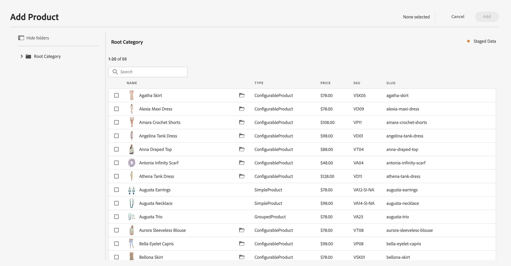

# 단계적 제품 카탈로그 경험 빌드 {#building-experiences}

단계적 제품 카탈로그 경험을 관리하는 방법을 알아봅니다.

## 지금까지의 스토리 {#story-so-far}

AEM Content and Commerce 여정의 이전 문서에서는 [제품 카탈로그 페이지 및 템플릿 관리](catalog-templates.md)를 통해 템플릿을 기반으로 제품 카탈로그 경험을 관리하고 구축하는 방법에 대해 알아보았습니다.

이 문서는 이러한 기본 사항을 기반으로 합니다.

## 목표 {#objective}

이 문서는 스테이징된 제품 데이터 및 AEM Launches를 기반으로 제품 카탈로그 경험을 관리하는 방법을 이해하는 데 도움이 됩니다. 많은 경우, 작성자는 예정된 제품 출시(예: 새로운 의류 컬렉션)를 동시에 준비해야 합니다. 이를 위해서는 스테이징된 제품 데이터(아직 라이브가 아님)에 대한 액세스와 콘텐츠 준비 기능이 필요합니다. 이 새로운 콘텐츠는 제품 출시에 맞춰 활성화됩니다.

    >[!NOTE]
    >
    >이 기능은 토큰 기반 인증을 지원하는 Adobe Commerce 또는 Cloud Edition 및 타사 커넥터에서만 사용할 수 있습니다. 자세한 내용은 [시작하기](https://experienceleague.adobe.com/docs/experience-manager-cloud-service/content-and-commerce/storefront/getting-started.html)를 참조하십시오.

먼저 작성자가 CIF를 사용하여 준비된 제품 데이터에 액세스하는 방법을 살펴보겠습니다.

## 단계적 제품 데이터 작업 {#staged-product-data}

단계적 제품 데이터에 액세스하는 한 가지 방법은 제품 관리실을 사용하는 것입니다. 기본 AEM 메뉴에서 Commerce 아이콘을 클릭하여 제품 카탈로그를 엽니다. 이렇게 하면 라이브 제품 데이터에 액세스할 수 있습니다. 왼쪽의 필터 탭을 열고 를 확장합니다. **준비된 카탈로그**. 이제 미리보기 데이터를 사용하여 원하는 시점에 스테이징된 제품 데이터에 액세스할 수 있습니다. 스테이징된 데이터에는 새 카테고리, 제품 또는 가격과 같은 업데이트된 필드가 포함됩니다.

타임워프 보기를 사용하여 스테이징된 데이터로 상점 전면을 미리 볼 수 있습니다. 편집기를 열고 모드를 타임워프로 전환합니다. 미래 날짜를 선택합니다. 편집기 맨 위에 특정 날짜에 페이지를 본다는 정보가 있습니다.

이제 준비된 데이터로 카탈로그를 검색할 수 있습니다. 준비된 카테고리나 제품 페이지를 열면 편집기에 시각적 표시기가 표시됩니다.

    >[!NOTE]
    >
    >Omnisearch에는 컨텍스트가 없으므로 라이브 제품 카탈로그 데이터만 반환합니다.

## AEM 런치 {#launches}

AEM Launches를 사용하면 스테이징된 제품 데이터에 대한 콘텐츠를 만들 수 있습니다. 론치에 익숙하지 않은 경우 다음 문서 링크를 따르십시오. [추가 리소스 섹션](#additional-resources). 그런 다음 론치 날짜 를 사용하여 스테이징된 제품 데이터에 액세스합니다.

선택기는 시작 날짜를 오른쪽의 준비된 표시기와 함께 확인합니다.

## 다음 단계 {#what-is-next}

이 여정 부분을 완료했으므로

* launches에서 스테이징된 제품 카탈로그 및 콘텐츠의 개념 이해
* 제품 관리실 및 편집기를 통해 준비된 제품 카탈로그 데이터에 액세스할 수 있습니다.

이제 관리할 준비가 되었습니다. [제품 경험](product-experience-management.md). 그러나 AEM Content 및 Commerce에는 다양한 추가 옵션이 있습니다. 이 여정에서 확인한 기능들에 대한 자세한 내용은 [추가 리소스 섹션](#additional-resources)에서 사용할 수 있는 몇 가지 추가 리소스를 확인하십시오.

## 추가 리소스 {#additional-resources}

* [제품 관리실](/help/commerce-cloud/authoring/product-cockpit.md)
* [시작하기](/help/commerce-cloud/getting-started.md)
* [론치](/help/sites-cloud/authoring/launches/overview.md)
