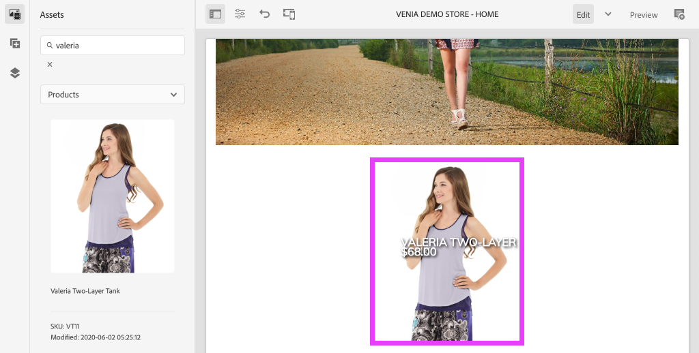
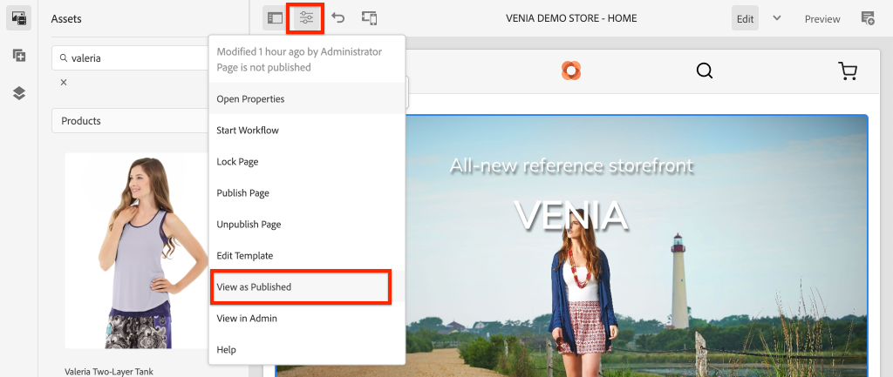

# AEM CIF 핵심 구성 요소 스타일 지정 {#style-aem-cif-core-components}

다음 [CIF 베니아 프로젝트](https://github.com/adobe/aem-cif-guides-venia) 는 사용을 위한 참조 코드 베이스입니다. [CIF 핵심 구성 요소](https://github.com/adobe/aem-core-cif-components). 이 자습서에서는 Venia 참조 프로젝트를 검사하고 AEM CIF 코어 구성 요소에서 사용되는 CSS 및 JavaScript를 구성하는 방법을 알아봅니다. 또한 CSS를 사용하여 새 스타일을 만들어 의 기본 스타일을 업데이트합니다. **제품 티저** 구성 요소.

>[!TIP]
>
> 사용 [AEM 프로젝트 원형](https://github.com/adobe/aem-project-archetype) 고유한 상거래 구현을 시작할 때.

## 빌드할 내용

이 자습서에서는 카드와 유사한 제품 티저 구성 요소에 대해 새로운 스타일이 구현됩니다. 자습서에서 배운 내용을 다른 CIF 핵심 구성 요소에 적용할 수 있습니다.


## 사전 요구 사항 {#prerequisites}

이 자습서를 완료하려면 로컬 개발 환경이 필요합니다. 여기에는 Adobe Commerce 인스턴스에 구성 및 연결된 AEM의 실행 중인 인스턴스가 포함됩니다. 에 대한 요구 사항 및 단계 검토 [AEM as a Cloud Service SDK를 사용하여 로컬 개발 설정](../develop.md).

## Venia 프로젝트 복제 {#clone-venia-project}

다음을 복제합니다. [베니아 프로젝트](https://github.com/adobe/aem-cif-guides-venia) 기본 스타일을 재정의합니다.

>[!NOTE]
>
> **기존 프로젝트를 마음껏 사용** (CIF가 포함된 AEM Project Archetype 기반) 이 섹션을 건너뜁니다.

1. 다음 git 명령을 실행하여 프로젝트를 복제합니다.

   ```shell
   $ git clone git@github.com:adobe/aem-cif-guides-venia.git
   ```

1. 프로젝트를 빌드하여 AEM의 로컬 인스턴스에 배포합니다.

   ```shell
   $ cd aem-cif-guides-venia/
   $ mvn clean install -PautoInstallPackage,cloud
   ```

1. AEM 인스턴스를 Adobe Commerce 인스턴스에 연결하는 데 필요한 OSGi 구성을 추가하거나 새로 만든 프로젝트에 구성을 추가합니다.

1. 이 시점에서 Adobe Commerce 인스턴스에 연결된 상점 첫 화면의 작동 버전이 있어야 합니다. 다음 위치로 이동 `US` > `Home` 페이지 위치: [http://localhost:4502/editor.html/content/venia/us/en.html](http://localhost:4502/editor.html/content/venia/us/en.html).

   당신은 상점이 현재 베니아 테마를 사용하고 있다는 것을 볼 수 있습니다. 상점 첫 화면의 메인 메뉴를 확장하면 Adobe Commerce에 대한 연결이 작동하고 있음을 나타내는 다양한 카테고리가 표시됩니다.

   

## 클라이언트 라이브러리 및 ui.frontend 모듈 {#introduction-to-client-libraries}

Storefront의 테마/스타일을 렌더링하는 CSS 및 JavaScript는 AEM에서 [클라이언트 라이브러리](/help/implementing/developing/introduction/clientlibs.md) 또는 clientlibs 를 참조하십시오. 클라이언트 라이브러리는 프로젝트 코드에서 CSS와 Javascript를 구성한 다음 페이지에 전달하는 메커니즘을 제공합니다.

이러한 클라이언트 라이브러리에서 관리하는 CSS를 추가하고 무시하여 브랜드별 스타일을 AEM CIF 핵심 구성 요소에 적용할 수 있습니다. 클라이언트 라이브러리가 구조화되고 페이지에 포함되는 방식을 이해하는 것은 중요합니다.

다음 [ui.frontend](https://experienceleague.adobe.com/docs/experience-manager-core-components/using/developing/archetype/uifrontend.html) 은(는) 전용입니다 [webpack](https://webpack.js.org/) 프로젝트 를 통해 프로젝트의 모든 프론트엔드 에셋을 관리할 수 있습니다. 이를 통해 프론트엔드 개발자는 다음과 같은 다양한 언어 및 기술을 사용할 수 있습니다. [TypeScript](https://www.typescriptlang.org/), [Sass](https://sass-lang.com/) 그리고 훨씬 더.

다음 `ui.frontend` 모듈 은 Maven 모듈이며 NPM 모듈 을 사용하여 대규모 프로젝트와 통합됩니다. [aem-clientlib-generator](https://github.com/wcm-io-frontend/aem-clientlib-generator). 빌드 중에 `aem-clientlib-generator` 컴파일된 CSS 및 JavaScript 파일을 `ui.apps` 모듈.


*컴파일된 CSS 및 Javascript는 `ui.frontend` 에 대한 모듈 `ui.apps` Maven 빌드 중 클라이언트 라이브러리로 사용된 모듈*

## 티저 스타일 업데이트 {#ui-frontend-module}

그런 다음 티저 스타일을 약간 변경하여 `ui.frontend` 모듈 및 클라이언트 라이브러리가 작동합니다. 사용 [선택한 IDE](https://experienceleague.adobe.com/docs/experience-manager-learn/cloud-service/local-development-environment-set-up/development-tools.html#set-up-the-development-ide) Venia 프로젝트를 가져옵니다. 사용된 스크린샷은 [Visual Studio 코드 IDE](https://experienceleague.adobe.com/docs/experience-manager-learn/cloud-service/local-development-environment-set-up/development-tools.html#microsoft-visual-studio-code).

1. 탐색 및 확장 **ui.frontend** 모듈을 만들고 폴더 계층 구조를 확장합니다. `ui.frontend/src/main/styles/commerce`:

   

   여러 Sass(`.scss`) 폴더 아래에 있는 파일입니다. 각 Commerce 구성 요소에 대한 Commerce 관련 스타일입니다.

1. 파일 열기 `_productteaser.scss`.

1. 업데이트 `.item__image` 규칙을 정의하고 테두리 규칙을 수정합니다.

   ```scss
   .item__image {
       border: #ea00ff 8px solid; /* <-- modify this rule */
       display: block;
       grid-area: main;
       height: auto;
       opacity: 1;
       transition-duration: 512ms;
       transition-property: opacity, visibility;
       transition-timing-function: ease-out;
       visibility: visible;
       width: 100%;
   }
   ```

   위의 규칙은 제품 티저 구성 요소에 매우 굵은 분홍색 테두리를 추가해야 합니다.

1. 새 터미널 창을 열고 다음으로 이동 `ui.frontend` 폴더:

   ```shell
   $ cd <project-location>/aem-cif-guides-venia/ui.frontend
   ```

1. 다음 Maven 명령을 실행합니다.

   ```shell
   $ mvn clean install
   ...
   [INFO] ------------------------------------------------------------------------
   [INFO] BUILD SUCCESS
   [INFO] ------------------------------------------------------------------------
   [INFO] Total time:  29.497 s
   [INFO] Finished at: 2020-08-25T14:30:44-07:00
   [INFO] ------------------------------------------------------------------------
   ```

   Inspect 터미널 출력입니다. Maven 명령이 다음을 포함한 여러 NPM 스크립트를 실행했음을 알 수 있습니다. `npm run build`. 다음 `npm run build` 명령은에 정의되어 있습니다 `package.json` 및 는 webpack 프로젝트를 컴파일하고 클라이언트 라이브러리 생성을 트리거하는 효과가 있습니다.

1. 파일 Inspect `ui.frontend/dist/clientlib-site/site.css`:

   

   이 파일은 프로젝트에 있는 모든 Sass 파일의 컴파일되고 축소된 버전입니다.

   >[!NOTE]
   >
   > 이러한 파일은 빌드 시간 동안 생성되어야 하므로 소스 제어에서 무시됩니다.

1. 파일 Inspect `ui.frontend/clientlib.config.js`.

   ```js
   /* clientlib.config.js*/
   ...
   // Config for `aem-clientlib-generator`
   module.exports = {
       context: BUILD_DIR,
       clientLibRoot: CLIENTLIB_DIR,
       libs: [
           {
               ...libsBaseConfig,
               name: 'clientlib-site',
               categories: ['venia.site'],
               dependencies: ['venia.dependencies', 'aem-core-cif-react-components'],
               assets: {
   ...
   ```

   다음에 대한 구성 파일입니다. [aem-clientlib-generator](https://github.com/wcm-io-frontend/aem-clientlib-generator) 및 은 컴파일된 CSS 및 JavaScript가 AEM 클라이언트 라이브러리로 변환되는 위치와 방법을 결정합니다.

1. 다음에서 `ui.apps` 모듈은 파일을 검사합니다. `ui.apps/src/main/content/jcr_root/apps/venia/clientlibs/clientlib-site/css/site.css`:

   

   이렇게 복사되었습니다. `site.css` 파일을 `ui.apps` 프로젝트. 이제 이름이 인 클라이언트 라이브러리의 일부입니다. `clientlib-site` 의 범주로 `venia.site`. 파일이 `ui.apps` 모듈을 AEM에 배포할 수 있습니다.

   >[!NOTE]
   >
   > 이러한 파일은 빌드 시간 동안 생성되어야 하므로 소스 제어에서도 무시됩니다.

1. 다음으로 프로젝트에서 생성된 다른 클라이언트 라이브러리를 검사합니다.

   

   이러한 클라이언트 라이브러리는 `ui.frontend` 모듈. 대신 이러한 클라이언트 라이브러리에는 Adobe에서 제공하는 CSS 및 JavaScript 종속성이 포함됩니다. 이러한 클라이언트 라이브러리에 대한 정의는 `.content.xml` 각 폴더 아래에 있는 파일입니다.

   **clientlib-base** - 다음의 필요한 종속성을 임베드하는 빈 클라이언트 라이브러리입니다. [AEM 핵심 구성 요소](https://experienceleague.adobe.com/docs/experience-manager-core-components/using/introduction.html). 범주는 다음과 같습니다 `venia.base`.

   **clientlib-cif** - 또한 이 라이브러리는 필요한 종속성을 임베드하는 빈 클라이언트 라이브러리입니다. [AEM CIF 핵심 구성 요소](https://github.com/adobe/aem-core-cif-components). 범주는 다음과 같습니다 `venia.cif`.

   **clientlib-grid** - 여기에는 AEM 반응형 그리드 기능을 활성화하는 데 필요한 CSS가 포함됩니다. AEM 그리드를 사용하면 [레이아웃 모드](/help/sites-cloud/authoring/features/responsive-layout.md) 를 AEM 편집기에서 사용하면 콘텐츠 작성자가 구성 요소를 다시 크기를 조정할 수 있습니다. 범주는 다음과 같습니다 `venia.grid` 및 가 `venia.base` 라이브러리입니다.

1. Inspect the files `customheaderlibs.html` 및 `customfooterlibs.html` 아래에 `ui.apps/src/main/content/jcr_root/apps/venia/components/page`:

   

   이러한 스크립트는 다음과 같습니다. **venia.base** 및 **venia.cif** 모든 페이지의 일부로 라이브러리.

   >[!NOTE]
   >
   > 기본 라이브러리만 페이지 스크립트의 일부로 &quot;하드 코딩&quot;됩니다. `venia.site` 는 이러한 파일에 포함되지 않고 대신 유연성을 높이기 위해 페이지 템플릿의 일부로 포함됩니다. 이 프로세스는 나중에 검사됩니다.

1. 터미널에서 AEM의 로컬 인스턴스에 전체 프로젝트를 빌드 및 배포합니다.

   ```shell
   $ cd aem-cif-guides-venia/
   $ mvn clean install -PautoInstallPackage,cloud
   ```

## 제품 티저 작성 {#author-product-teaser}

코드 업데이트가 배포되었으므로 AEM 제작 도구를 사용하여 제품 티저 구성 요소의 새 인스턴스를 사이트의 홈 페이지에 추가합니다. 이렇게 하면 업데이트된 스타일을 볼 수 있습니다.

1. 새 브라우저 탭을 열고 다음으로 이동 **홈 페이지** 사이트: [http://localhost:4502/editor.html/content/venia/us/en.html](http://localhost:4502/editor.html/content/venia/us/en.html).

1. 에서 에셋 파인더(측면 레일)를 확장합니다. **편집** 모드. 에셋 필터 전환 **제품**.

   

1. 새 제품을 메인 레이아웃 컨테이너의 홈 페이지로 끌어다 놓습니다.

   

   이제 제품 티저에 이전에 만든 CSS 규칙 변경 사항을 기반으로 하는 밝은 분홍색 테두리가 표시됩니다.

## 페이지에서 클라이언트 라이브러리 확인 {#verify-client-libraries}

그런 다음 페이지에 클라이언트 라이브러리가 포함되어 있는지 확인합니다.

1. 다음 위치로 이동 **홈 페이지** 사이트: [http://localhost:4502/editor.html/content/venia/us/en.html](http://localhost:4502/editor.html/content/venia/us/en.html).

1. 다음 항목 선택 **페이지 정보** 메뉴 및 클릭 **게시됨으로 보기**:

   

   이렇게 하면 게시된 사이트에 표시되므로 AEM 작성자 Javascript가 로드되지 않은 페이지가 열립니다. URL에는 쿼리 매개 변수가 있습니다. `?wcmmode=disabled` 추가됨. CSS 및 Javascript를 개발할 때 이 매개 변수를 사용하여 AEM 작성자의 항목을 제외하고 페이지를 간소화하는 것이 좋습니다.

1. 페이지 소스를 보면 여러 클라이언트 라이브러리가 포함되어 있음을 식별할 수 있습니다.

   ```html
   <!DOCTYPE html>
   <html lang="en-US">
   <head>
       ...
       <link rel="stylesheet" href="/etc.clientlibs/venia/clientlibs/clientlib-base.min.css" type="text/css">
       <link rel="stylesheet" href="/etc.clientlibs/venia/clientlibs/clientlib-site.min.css" type="text/css">
   </head>
   ...
       <script type="text/javascript" src="/etc.clientlibs/venia/clientlibs/clientlib-site.min.js"></script>
       <script type="text/javascript" src="/etc.clientlibs/core/wcm/components/commons/site/clientlibs/container.min.js"></script>
       <script type="text/javascript" src="/etc.clientlibs/venia/clientlibs/clientlib-base.min.js"></script>
   <script type="text/javascript" src="/etc.clientlibs/core/cif/clientlibs/common.min.js"></script>
   <script type="text/javascript" src="/etc.clientlibs/venia/clientlibs/clientlib-cif.min.js"></script>
   </body>
   </html>
   ```

   클라이언트 라이브러리가 페이지에 전달될 때 접두사가 붙습니다. `/etc.clientlibs` 를 통해 제공됩니다. [프록시](/help/implementing/developing/introduction/clientlibs.md) 에 민감한 내용을 노출하지 않도록 하려면 `/apps` 또는 `/libs`.

   공지 `venia/clientlibs/clientlib-site.min.css` 및 `venia/clientlibs/clientlib-site.min.js`. 이러한 파일은 컴파일된 CSS 및 `ui.frontend` 모듈.

## 페이지 템플릿과 함께 클라이언트 라이브러리 포함 {#client-library-inclusion-pagetemplates}

클라이언트측 라이브러리를 포함하는 방법에는 몇 가지 옵션이 있습니다. 다음으로 생성된 프로젝트에 `clientlib-site` 를 통한 라이브러리 [페이지 템플릿](/help/implementing/developing/components/templates.md).

1. 다음 위치로 이동 **홈 페이지** AEM 편집기 내 사이트: [http://localhost:4502/editor.html/content/venia/us/en.html](http://localhost:4502/editor.html/content/venia/us/en.html).

1. 다음 항목 선택 **페이지 정보** 메뉴 및 클릭 **템플릿 편집**:

   

   이렇게 하면 **랜딩 페이지** 템플릿 **홈** 페이지는 을 기반으로 합니다.

   >[!NOTE]
   >
   > AEM 시작 화면에서 사용 가능한 모든 템플릿을 보려면 다음 위치로 이동합니다. **도구** > **일반** > **템플릿**.

1. 왼쪽 상단 모서리에서 을(를) 선택합니다 **페이지 정보** 아이콘 및 클릭 **페이지 정책**.

   

1. 그러면 랜딩 페이지 템플릿에 대한 페이지 정책이 열립니다.

   

   오른쪽에는 클라이언트 라이브러리 목록이 표시됩니다 **카테고리** 이 템플릿을 사용하는 모든 페이지에 포함됩니다.

   * `venia.dependencies` - 는 다음과 같은 공급업체 라이브러리를 제공합니다. `venia.site` 다음에 따라 다릅니다.
   * `venia.site` - 다음에 대한 카테고리입니다. `clientlib-site` 해당 `ui.frontend` 모듈이 생성됩니다.

   다른 템플릿에서도 동일한 정책을 사용합니다. **컨텐츠 페이지**, **랜딩 페이지**&#x200B;등.. 동일한 정책을 다시 사용하면 동일한 클라이언트 라이브러리가 모든 페이지에 포함되도록 할 수 있습니다.

   템플릿 및 페이지 정책을 사용하여 클라이언트 라이브러리 포함을 관리할 수 있는 이점은 템플릿별로 정책을 변경할 수 있다는 것입니다. 예를 들어 동일한 AEM 인스턴스 내에서 두 개의 다른 브랜드를 관리하는 것일 수 있습니다. 각 브랜드는 고유한 스타일 또는 *테마* 그러나 기본 라이브러리와 코드는 동일합니다. 또 다른 예로, 특정 페이지에만 표시하려는 클라이언트 라이브러리가 더 큰 경우 해당 템플릿에 대해서만 고유한 페이지 정책을 만들 수 있습니다.

## 로컬 Webpack 개발 {#local-webpack-development}

이전 연습에서는 의 Sass 파일이 업데이트되었습니다. `ui.frontend` 모듈을 작성한 후 Maven 빌드를 수행하면 변경 사항이 AEM에 배포됩니다. 다음으로 Webpack-dev-server를 활용하여 프론트엔드 스타일을 신속하게 개발하는 방법을 살펴보겠습니다.

Webpack-dev-server는 AEM의 로컬 인스턴스에서 이미지 및 CSS/JavaScript의 일부를 프록시하지만 개발자는 의 스타일 및 JavaScript를 수정할 수 있습니다. `ui.frontend` 모듈.

1. 브라우저에서 다음 위치로 이동합니다. **홈** 페이지 및 **게시됨으로 보기**: [http://localhost:4502/content/venia/us/en.html?wcmmode=disabled](http://localhost:4502/content/venia/us/en.html?wcmmode=disabled).

1. 페이지 및 의 소스 보기 **복사** 페이지의 원시 HTML.

1. 아래에서 선택한 IDE로 돌아갑니다. `ui.frontend` 모듈이 파일을 엽니다. `ui.frontend/src/main/static/index.html`

   

1. 콘텐츠 덮어쓰기 `index.html` 및 **붙여넣기** 이전 단계에서 복사한 HTML.

1. 에 대한 포함 찾기 `clientlib-site.min.css`, `clientlib-site.min.js` 및 **제거** 그들이요.

   ```html
   <head>
       <!-- remove this link -->
       <link rel="stylesheet" href="/etc.clientlibs/venia/clientlibs/clientlib-base.min.css" type="text/css">
       ...
   </head>
   <body>
       ...
        <!-- remove this link -->
       <script type="text/javascript" src="/etc.clientlibs/venia/clientlibs/clientlib-site.min.js"></script>
   </body>
   ```

   이러한 구성 요소는에 의해 생성된 CSS 및 JavaScript의 컴파일된 버전을 나타내므로 제거됩니다. `ui.frontend` 모듈. 실행 중인 AEM 인스턴스에서 프록싱할 다른 클라이언트 라이브러리를 그대로 둡니다.

1. 새 터미널 창을 열고 `ui.frontend` 폴더를 삭제합니다. 명령 실행 `npm start`:

   ```shell
   $ cd ui.frontend
   $ npm start
   ```

   에서 webpack-dev-server가 시작됩니다. [http://localhost:8080/](http://localhost:8080/)

   >[!CAUTION]
   >
   > Sass 관련 오류가 발생하면 서버를 중지하고 명령을 실행합니다 `npm rebuild node-sass` 위의 단계를 반복합니다. 이 문제는 의 다른 버전이 있는 경우 발생할 수 있습니다 `npm` 및 `node` 프로젝트에 지정됨 `aem-cif-guides-venia/pom.xml`.

1. 다음 위치로 이동 [http://localhost:8080/](http://localhost:8080/) AEM의 로그인 인스턴스와 동일한 브라우저가 있는 새 탭에서. webpack-dev-server를 통해 Venia 홈 페이지가 표시됩니다.

   

   Webpack-dev-server를 실행 상태로 둡니다. 다음 연습에서 사용됩니다.

## 제품 티저에 대한 카드 스타일 구현 {#update-css-product-teaser}

다음으로 의 Sass 파일을 수정합니다. `ui.frontend` 모듈 : 제품 티저에 대해 카드와 유사한 스타일을 구현합니다. webpack-dev-server는 변경 사항을 빠르게 확인하는 데 사용됩니다.

IDE 및 생성된 프로젝트로 돌아갑니다.

1. 다음에서 **ui.frontend** 모듈이 파일을 다시 엽니다. `_productteaser.scss` 위치: `ui.frontend/src/main/styles/commerce/_productteaser.scss`.

1. 제품 티저 테두리를 다음과 같이 변경합니다.

   ```diff
       .item__image {
   -       border: #ea00ff 8px solid;
   +       border-bottom: 1px solid #c0c0c0;
           display: block;
           grid-area: main;
           height: auto;
           opacity: 1;
           transition-duration: 512ms;
           transition-property: opacity, visibility;
           transition-timing-function: ease-out;
           visibility: visible;
           width: 100%;
       }
   ```

   변경 사항을 저장하면 Webpack-dev-server가 자동으로 새 스타일로 새로 고침됩니다.

1. 그림자를 추가하고 제품 티저에 둥근 모서리를 포함합니다.

   ```scss
    .item__root {
        position: relative;
        box-shadow: 0 4px 8px 0 rgba(0,0,0,0.2);
        transition: 0.3s;
        border-radius: 5px;
        float: left;
        margin-left: 12px;
        margin-right: 12px;
   }
   
   .item__root:hover {
      box-shadow: 0 8px 16px 0 rgba(0,0,0,0.2);
   }
   ```

1. 티저 하단에 표시되도록 제품 이름을 업데이트하고 텍스트 색상을 수정합니다.

   ```css
   .item__name {
       color: #000;
       display: block;
       float: left;
       font-size: 22px;
       font-weight: 900;
       line-height: 1em;
       padding: 0.75em;
       text-transform: uppercase;
       width: 75%;
   }
   ```

1. 티저의 아래쪽에도 나타나도록 제품 가격을 업데이트하고 텍스트 색상을 수정합니다.

   ```css
   .price {
       color: #000;
       display: block;
       float: left;
       font-size: 18px;
       font-weight: 900;
       padding: 0.75em;
       padding-bottom: 2em;
       width: 25%;
   
       ...
   ```

1. 맨 아래에 있는 미디어 쿼리를 업데이트하여 다음보다 작은 화면에 이름과 가격을 스택합니다. **992픽셀**.

   ```css
   @media (max-width: 992px) {
       .productteaser .item__name {
           font-size: 18px;
           width: 100%;
       }
       .productteaser .item__price {
           font-size: 14px;
           width: 100%;
       }
   }
   ```

   이제 webpack-dev-server에 반영된 카드 스타일이 표시됩니다.

   

   그러나 변경 사항이 아직 AEM에 배포되지 않았습니다. 다음을 다운로드할 수 있습니다. [솔루션 파일 위치](../assets/style-cif-component/_productteaser.scss).

1. 명령줄 터미널에서 Maven 기술을 사용하여 AEM에 업데이트를 배포합니다.

   ```shell
   $ cd aem-cif-guides-venia/
   $ mvn clean install -PautoInstallPackage,cloud
   ```

   >[!NOTE]
   >추가 항목이 있습니다. [IDE 설정 및 도구](https://experienceleague.adobe.com/docs/experience-manager-learn/foundation/development/set-up-a-local-aem-development-environment.html#set-up-an-integrated-development-environment) 전체 Maven 빌드를 수행하지 않고도 로컬 AEM 인스턴스로 프로젝트 파일을 직접 동기화할 수 있습니다.

## 업데이트된 제품 티저 보기 {#view-updated-product-teaser}

프로젝트에 대한 코드가 AEM에 배포되면 이제 제품 티저에 대한 변경 사항을 볼 수 있습니다.

1. 브라우저로 돌아가서 홈 페이지를 다시 새로 고칩니다. [http://localhost:4502/editor.html/content/venia/us/en.html](http://localhost:4502/editor.html/content/venia/us/en.html). 업데이트된 제품 티저 스타일이 적용된 것이 표시됩니다.

   

1. 추가 제품 티저를 추가하여 실험합니다. 여러 티저를 한 행에 표시하도록 구성 요소의 너비와 오프셋을 변경하려면 레이아웃 모드 를 사용합니다.

   

## 문제 해결 {#troubleshooting}

에서 확인할 수 있습니다. [CRXDE-Lite](http://localhost:4502/crx/de/index.jsp) 업데이트된 CSS 파일이 배포되었는지 확인: [http://localhost:4502/crx/de/index.jsp#/apps/venia/clientlibs/clientlib-site/css/site.css](http://localhost:4502/crx/de/index.jsp#/apps/venia/clientlibs/clientlib-site/css/site.css)

새 CSS 및/또는 JavaScript 파일을 배포할 때 브라우저가 오래된 파일을 제공하고 있지 않은지 확인하는 것도 중요합니다. 브라우저 캐시를 지우거나 새 브라우저 세션을 시작하여 이를 제거할 수 있습니다.

AEM은 성능을 위해 클라이언트 라이브러리를 캐시하려고 시도합니다. 코드 배포 후 이전 파일이 제공되는 경우가 있습니다. 다음을 사용하여 AEM 클라이언트 라이브러리 캐시를 수동으로 무효화할 수 있습니다. [클라이언트 라이브러리 다시 빌드 도구](http://localhost:4502/libs/granite/ui/content/dumplibs.rebuild.html). *Invalidate Caches는 AEM이 클라이언트 라이브러리의 이전 버전을 캐시했다고 의심되는 경우 선호되는 방법입니다. 라이브러리 리빌딩은 비효율적이고 시간이 많이 소요됩니다.*

## 축하합니다 {#congratulations}

첫 번째 AEM CIF 핵심 구성 요소를 스타일링하고 Webpack 개발 서버를 사용했습니다!

## 보너스 챌린지 {#bonus-challenge}

사용 [AEM 스타일 시스템](/help/sites-cloud/authoring/features/style-system.md) 콘텐츠 작성자가 설정/해제할 수 있는 두 가지 스타일을 만듭니다. [스타일 시스템을 사용하여 개발](https://experienceleague.adobe.com/docs/experience-manager-learn/getting-started-wknd-tutorial-develop/style-system.html) 에는 이를 수행하는 방법에 대한 자세한 단계 및 정보가 포함되어 있습니다.


## 추가 리소스 {#additional-resources}

* [AEM Project Archetype](https://github.com/adobe/aem-project-archetype)
* [AEM CIF 핵심 구성 요소](https://github.com/adobe/aem-core-cif-components)
* [로컬 AEM 개발 환경 설정](https://experienceleague.adobe.com/docs/experience-manager-learn/cloud-service/local-development-environment-set-up/overview.html)
* [클라이언트측 라이브러리](/help/implementing/developing/introduction/clientlibs.md)
* [AEM Sites 시작하기](https://experienceleague.adobe.com/docs/experience-manager-learn/getting-started-wknd-tutorial-develop/overview.html)
* [스타일 시스템을 사용하여 개발](https://experienceleague.adobe.com/docs/experience-manager-learn/getting-started-wknd-tutorial-develop/style-system.html)
