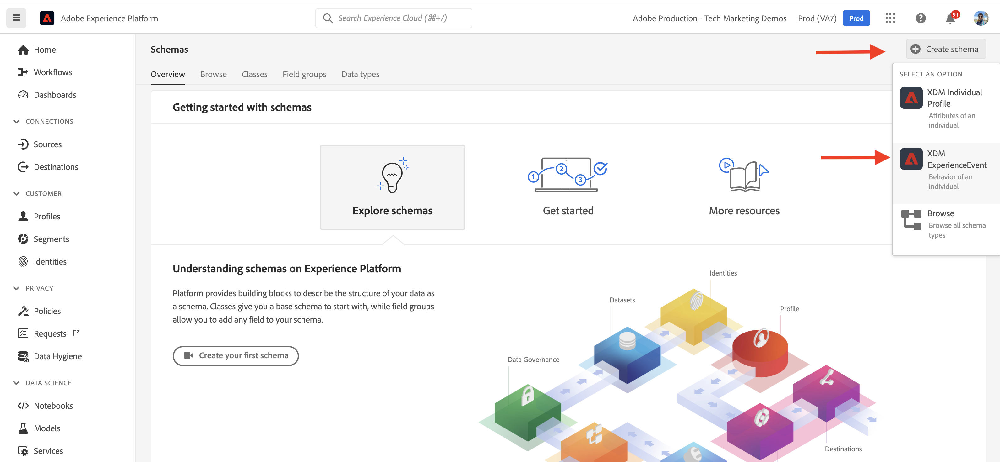

# AEM-CIF 핵심 구성 요소 및 Adobe Experience Platform 통합 {#aem-cif-aep-integration}

다음 [CIF(Commerce Integration Framework)](https://github.com/adobe/aem-core-cif-components) 핵심 구성 요소는 원활한 통합을 제공합니다 [Adobe Experience Platform](https://experienceleague.adobe.com/docs/experience-platform/landing/platform-overview.html?lang=en) storefront 이벤트 및 해당 데이터를 __장바구니에 추가__.

다음 [AEM CIF 코어 구성 요소](https://github.com/adobe/aem-core-cif-components) 프로젝트는 [Adobe Commerce용 Adobe Experience Platform 커넥터](https://github.com/adobe/aem-core-cif-components/tree/master/extensions/experience-platform-connector) commerce storefront에서 이벤트 데이터를 수집하기 위해 이 이벤트 데이터는 고객 여정을 포함하는 360도 프로필을 빌드하기 위해 Adobe Analytics 및 Adobe Target과 같은 다른 Adobe Experience Cloud 제품에서 사용되는 Experience Platform으로 전송됩니다. 상거래 데이터를 Adobe Experience Cloud의 다른 제품에 연결하여 사이트에서 사용자 행동을 분석하고 AB 테스트를 수행하고 개인화된 캠페인을 만드는 등의 작업을 수행할 수 있습니다.

추가 정보 [Experience Platform 데이터 수집](https://experienceleague.adobe.com/docs/experience-platform/collection/home.html) 클라이언트측 소스에서 고객 경험 데이터를 수집할 수 있는 기술 세트.

## 보내기 `addToCart` 이벤트 데이터를 Experience Platform {#send-addtocart-to-aep}

다음 단계는 `addToCart` AEM이 렌더링한 제품 페이지의 이벤트 데이터를 CIF - Experience Platform 커넥터를 사용하여 Experience Platform에 보냅니다. Adobe Experience Platform Debugger 브라우저 확장 프로그램을 사용하여 제출된 데이터를 테스트하고 검토할 수 있습니다.


## 사전 요구 사항 {#prerequisites}

이 데모를 완료하려면 로컬 개발 환경을 사용해야 합니다. 여기에는 Adobe Commerce 인스턴스에 구성 및 연결된 AEM의 실행 인스턴스가 포함됩니다. 다음 요구 사항 및 단계를 검토하십시오 [AEM as a Cloud Service SDK를 사용하여 로컬 개발 설정](../develop.md).

또한 [Adobe Experience Platform](https://experienceleague.adobe.com/docs/experience-platform/landing/platform-ui/ui-guide.html) 및 데이터 수집을 위한 스키마, 데이터 세트 및 데이터 세트를 만들 수 있는 권한. 자세한 내용은 [권한 관리](https://experienceleague.adobe.com/docs/experience-platform/collection/permissions.html).

## AEM Commerce as a Cloud Service 설정 {#aem-setup}

일을 하다 __AEM Commerce as a Cloud Service__ 필요한 코드 및 구성을 사용하여 로컬 환경에서 다음 단계를 완료하십시오.

### 로컬 설정

다음을 수행합니다 [로컬 설정](https://experienceleague.adobe.com/docs/experience-manager-cloud-service/content/content-and-commerce/storefront/developing/develop.html?#local-setup) 작업 AEM Commerce as a Cloud Service 환경을 사용하는 절차.

### 프로젝트 설정

다음을 수행합니다 [AEM 프로젝트 원형](https://experienceleague.adobe.com/docs/experience-manager-cloud-service/content/content-and-commerce/storefront/developing/develop.html?#project) 새 AEM Commerce(CIF) 프로젝트를 만드는 절차.

>[!TIP]
>
>다음 예에서는 AEM Commerce 프로젝트의 이름이 지정됩니다. `My Demo Storefront`그러나 고유한 프로젝트 이름을 선택할 수 있습니다.


프로젝트의 루트 디렉토리에서 다음 명령을 실행하여 새로 만든 AEM Commerce 프로젝트를 로컬 AEM SDK에 빌드하고 배포합니다.

```bash
$ mvn clean install -PautoInstallSinglePackage
```

로컬로 배포되는 `My Demo StoreFront` 기본 코드와 콘텐츠가 있는 상거래 사이트는 다음과 같습니다.


### Peregrine 및 CIF-AEP 커넥터 종속성 설치

이 AEM Commerce 사이트의 카테고리 및 제품 페이지에서 이벤트 데이터를 수집하고 전송하려면 키를 설치해야 합니다 `npm` 패키지 `ui.frontend` AEM Commerce 프로젝트의 모듈입니다.

로 이동합니다 `ui.frontend` 명령줄에서 다음 명령을 실행하여 필요한 패키지를 설치하고 설치합니다.

```bash
npm i --save lodash.get@^4.4.2 lodash.set@^4.3.2
npm i --save apollo-cache-persist@^0.1.1
npm i --save redux-thunk@~2.3.0
npm i --save @adobe/apollo-link-mutation-queue@~1.1.0
npm i --save @magento/peregrine@~12.5.0
npm i --save @adobe/aem-core-cif-react-components --force
npm i --save-dev @magento/babel-preset-peregrine@~1.2.1
npm i --save @adobe/aem-core-cif-experience-platform-connector --force
```

>[!IMPORTANT]
>
>다음 `--force` 인수는 경우에 따라 필수입니다. [PWA Studio](https://developer.adobe.com/commerce/pwa-studio/) 는 지원되는 피어 종속성으로 제한됩니다. 일반적으로 이로 인해 문제가 발생하지 않습니다.


### 사용할 Maven 구성 `--force` 인수

Maven 빌드 프로세스의 일부로 npm 정리 설치(사용 `npm ci`)가 트리거됩니다. 이 작업을 수행하려면 `--force` 변합니다.

프로젝트의 루트 POM 파일로 이동합니다 `pom.xml` 그리고 `<id>npm ci</id>` 실행 블록. 블록을 다음과 같이 업데이트합니다.

```xml
<execution>
    <id>npm ci</id>
    <goals>
    <goal>npm</goal>
    </goals>
    <configuration>
    <arguments>ci --force</arguments>
    </configuration>
</execution>
```

### Barback 구성 형식 변경

기본값에서 전환 `.babelrc` 파일 상대 구성 파일 형식 `babel.config.js` 형식 지정 이 형식은 프로젝트 전체에서 구성 형식이며 `node_module` 더 강력한 제어

1. 로 이동합니다 `ui.frontend` 모듈 및 기존 `.babelrc` 파일.

1. 만들기 `babel.config.js` 를 사용하는 파일 `peregrine` 사전 설정.

   ```javascript
   const peregrine = require('@magento/babel-preset-peregrine');
   
   module.exports = (api, opts = {}) => {
       const config = {
           ...peregrine(api, opts),
           sourceType: 'unambiguous'
       } 
   
       config.plugins = config.plugins.filter(plugin => plugin !== 'react-refresh/babel');
   
       return config;
   }
   ```

### Barback을 사용하도록 웹 팩 구성

Barel 로더를 사용하여 JavaScript 파일을 전달하려면`babel-loader`) 및 webpack을 사용하려면 을 수정해야 합니다 `webpack.common.js` 파일.

로 이동합니다 `ui.frontend` 모듈 및 업데이트 `webpack.common.js` 파일에 다음 규칙을 넣을 수 있습니다. `module` 속성 값:

```javascript
{
    test: /\.jsx?$/,
    exclude: /node_modules\/(?!@magento\/)/,
    loader: 'babel-loader'
}
```

### Apollo 클라이언트 구성

다음 [아폴로 클라이언트](https://www.apollographql.com/docs/react/) GraphQL을 사용하여 로컬 데이터와 원격 데이터를 모두 관리하는 데 사용됩니다. 또한 GraphQL 쿼리 결과를 로컬에서 정규화된 인메모리 캐시에 저장합니다.

대상 [`InMemoryCache`](https://www.apollographql.com/docs/react/caching/cache-configuration/) 효과적으로 작업하려면 `possibleTypes.js` 파일. 이 파일을 생성하려면 [가능한 유형 자동 생성](https://www.apollographql.com/docs/react/data/fragments/#generating-possibletypes-automatically). 또한 [PWA Studio 참조 구현](https://github.com/magento/pwa-studio/blob/1977f38305ff6c0e2b23a9da7beb0b2f69758bed/packages/pwa-buildpack/lib/Utilities/graphQL.js#L106-L120) 그리고 [`possibleTypes.js`](../assets/aep-integration/possibleTypes.js) 파일.


1. 로 이동합니다 `ui.frontend` 모듈 및 다른 이름으로 파일 저장 `./src/main/possibleTypes.js`

1. 업데이트 `webpack.common.js` 파일 `DefinePlugin` 섹션을 참조하십시오.

   ```javascript
   const { DefinePlugin } = require('webpack');
   const { POSSIBLE_TYPES } = require('./src/main/possibleTypes');
   
   ...
   
   plugins: [
       ...
       new DefinePlugin({
           'process.env.USE_STORE_CODE_IN_URL': false,
           POSSIBLE_TYPES
       })
   ]
   ```

### Peregrine 및 CIF 핵심 구성 요소 초기화

React 기반 Peregrine 및 CIF 핵심 구성 요소를 초기화하려면 필요한 구성 및 JavaScript 파일을 만듭니다.

1. 로 이동합니다 `ui.frontend` 모듈 및 다음 폴더를 만듭니다. `src/main/webpack/components/commerce/App`

1. 만들기 `config.js` 다음 컨텐츠가 있는 파일:

   ```javascript
   // get and parse the CIF store configuration from the <head>
   const storeConfigEl = document.querySelector('meta[name="store-config"]');
   const storeConfig = storeConfigEl ? JSON.parse(storeConfigEl.content) : {};
   
   // the following global variables are needed for some of the peregrine features
   window.STORE_VIEW_CODE = storeConfig.storeView || 'default';
   window.AVAILABLE_STORE_VIEWS = [
       {
           code: window.STORE_VIEW_CODE,
           base_currency_code: 'USD',
           default_display_currency_code: 'USD',
           id: 1,
           locale: 'en',
           secure_base_media_url: '',
           store_name: 'My Demo StoreFront'
       }
   ];
   window.STORE_NAME = window.STORE_VIEW_CODE;
   window.DEFAULT_COUNTRY_CODE = 'en';
   
   export default {
       storeView: window.STORE_VIEW_CODE,
       graphqlEndpoint: storeConfig.graphqlEndpoint,
       // Can be GET or POST. When selecting GET, this applies to cache-able GraphQL query requests only.
       // Mutations will always be executed as POST requests.
       graphqlMethod: storeConfig.graphqlMethod,
       headers: storeConfig.headers,
   
       mountingPoints: {
           // TODO: define the application specific mount points as they may be used by <Portal> and <PortalPlacer>
       },
       pagePaths: {
           // TODO: define the application specific paths/urls as they may be used by the components
           baseUrl: storeConfig.storeRootUrl
       },
       eventsCollector: {
           // Enable the Experience Platform Connector and define the org and datastream to use
           aep: {
               orgId: // TODO: add your orgId
               datastreamId: // TODO: add your datastreamId
           }
       }
   };
   ```

   >[!IMPORTANT]
   >
   >아직 이 [`config.js`](https://github.com/adobe/aem-cif-guides-venia/blob/main/ui.frontend/src/main/components/App/config.js) 파일 위치 __AEM 안내서 - CIF Venia 프로젝트__&#x200B;로 지정하는 경우 이 파일을 몇 가지 변경해야 합니다. 먼저, 다음 사항을 검토합니다. __TODO__ 댓글. 그런 다음 `eventsCollector` 속성을 찾아 `eventsCollector > aed` 개체 및 업데이트 `orgId` 및 `datastreamId` 속성을 올바른 값으로 설정합니다. [추가 정보](./aep.md#add-aep-values-to-aem).

1. 만들기 `App.js` 다음 컨텐츠가 있는 파일입니다. 이 파일은 일반적인 React 애플리케이션 시작 지점 파일과 유사하며 Experience Platform 통합을 용이하게 하기 위해 React 및 사용자 정의 후크와 React Context 사용을 포함합니다.

   ```javascript
   import config from './config';
   
   import React, { useEffect } from 'react';
   import ReactDOM from 'react-dom';
   import { IntlProvider } from 'react-intl';
   import { BrowserRouter as Router } from 'react-router-dom';
   import { combineReducers, createStore } from 'redux';
   import { Provider as ReduxProvider } from 'react-redux';
   import { createHttpLink, ApolloProvider } from '@apollo/client';
   import { ConfigContextProvider, useCustomUrlEvent, useReferrerEvent, usePageEvent, useDataLayerEvents, useAddToCartEvent } from '@adobe/aem-core-cif-react-components';
   import { EventCollectorContextProvider, useEventCollectorContext } from '@adobe/aem-core-cif-experience-platform-connector';
   import { useAdapter } from '@magento/peregrine/lib/talons/Adapter/useAdapter';
   import { customFetchToShrinkQuery } from '@magento/peregrine/lib/Apollo/links';
   import { BrowserPersistence } from '@magento/peregrine/lib/util';
   import { default as PeregrineContextProvider } from '@magento/peregrine/lib/PeregrineContextProvider';
   import { enhancer, reducers } from '@magento/peregrine/lib/store';
   
   const storage = new BrowserPersistence();
   const store = createStore(combineReducers(reducers), enhancer);
   
   storage.setItem('store_view_code', config.storeView);
   
   const App = () => {
       const [{ sdk: mse }] = useEventCollectorContext();
   
       // trigger page-level events
       useCustomUrlEvent({ mse });
       useReferrerEvent({ mse });
       usePageEvent({ mse });
       // listen for add-to-cart events and enable forwarding to the magento storefront events sdk
       useAddToCartEvent(({ mse }));
       // enable CIF specific event forwarding to the Adobe Client Data Layer
       useDataLayerEvents();
   
       useEffect(() => {
           // implement a proper marketing opt-in, for demo purpose we hard-set the consent cookie
           if (document.cookie.indexOf('mg_dnt') < 0) {
               document.cookie += '; mg_dnt=track';
           }
       }, []);
   
       // TODO: use the App to create Portals and PortalPlaceholders to mount the CIF / Peregrine components to the server side rendered markup
       return <></>;
   };
   
   const AppContext = ({ children }) => {
       const { storeView, graphqlEndpoint, graphqlMethod = 'POST', headers = {}, eventsCollector } = config;
       const { apolloProps } = useAdapter({
           apiUrl: new URL(graphqlEndpoint, window.location.origin).toString(),
           configureLinks: (links, apiBase) =>
               // reconfigure the HTTP link to use the configured graphqlEndpoint, graphqlMethod and storeView header
   
               links.set('HTTP', createHttpLink({
                   fetch: customFetchToShrinkQuery,
                   useGETForQueries: graphqlMethod !== 'POST',
                   uri: apiBase,
                   headers: { ...headers, 'Store': storeView }
               }))
       });
   
       return (
           <ApolloProvider {...apolloProps}>
               <IntlProvider locale='en' messages={{}}>
                   <ConfigContextProvider config={config}>
                       <ReduxProvider store={store}>
                           <PeregrineContextProvider>
                               <EventCollectorContextProvider {...eventsCollector}>
                                   {children}
                               </EventCollectorContextProvider>
                           </PeregrineContextProvider>
                       </ReduxProvider>
                   </ConfigContextProvider>
               </IntlProvider>
           </ApolloProvider>
       );
   };
   
   window.onload = async () => {
       const root = document.createElement('div');
       document.body.appendChild(root);
   
       ReactDOM.render(
           <Router>
               <AppContext>
                   <App />
               </AppContext>
           </Router>,
           root
       );
   };
   ```

   다음 `EventCollectorContext` 는 다음과 같은 React Context를 내보냅니다.

   - commerce-events-sdk 및 commerce-events-collector 라이브러리를 로드합니다.
   - Experience Platform 및/또는 ACDS에 대해 지정된 구성으로 초기화합니다.
   - 페레그리에서 모든 이벤트를 구독하여 이벤트 SDK에 전달합니다

   의 구현 세부 사항을 검토할 수 있습니다 `EventCollectorContext` [여기](https://github.com/adobe/aem-core-cif-components/blob/3d4e44d81fff2f398fd2376d24f7b7019f20b31b/extensions/experience-platform-connector/src/events-collector/EventCollectorContext.js).

### 업데이트된 AEM 프로젝트 빌드 및 배포

위의 패키지 설치, 코드 및 구성 변경 사항이 올바른지 확인하려면 다음 Maven 명령을 사용하여 업데이트된 AEM Commerce 프로젝트를 다시 빌드하고 배포합니다. `$ mvn clean install -PautoInstallSinglePackage`.

## Experience Platform 설정 {#aep-setup}

카테고리 및 제품과 같은 AEM Commerce 페이지에서 오는 이벤트 데이터를 받고 저장하려면 다음 단계를 완료하십시오.

>[!AVAILABILITY]
>
>자신이 올바른 구성원인지 확인합니다 __제품 프로필__ 아래에 __Adobe Experience Platform__ 및 __Adobe Experience Platform 데이터 수집__. 필요한 경우 시스템 관리자에게 문의하여 생성, 업데이트 또는 할당합니다 __제품 프로필__ 아래에 [Admin Console](https://adminconsole.adobe.com/).

### 상거래 필드 그룹을 사용하여 스키마 만들기

상거래 이벤트 데이터의 구조를 정의하려면 XDM(Experience Data Model) 스키마를 만들어야 합니다. 스키마는 데이터의 구조와 형식을 나타내고 유효성을 검사하는 규칙 세트입니다.

1. 브라우저에서 __Adobe Experience Platform__ 제품 홈 페이지. (예: <https://experience.adobe.com/#/@YOUR-ORG-NAME/sname:prod/platform/home>)

1. 을(를) 찾습니다 __스키마__ 왼쪽 탐색 섹션의 메뉴에서 __스키마 만들기__ 오른쪽 상단 섹션에서 버튼을 클릭하고 __XDM ExperienceEvent__.

   

1. 를 사용하여 스키마의 이름을 지정합니다. __스키마 속성 > 표시 이름__ 필드를 작성하고  __컴포지션 > 필드 그룹 > 추가__ 버튼을 클릭합니다.

   

1. 에서 __필드 그룹 추가__ 대화 상자, 검색 `Commerce`에서 을(를) 선택합니다. __상거래 세부 사항__ 확인란을 선택하고 __필드 그룹 추가__.

   


>[!TIP]
>
>자세한 내용은 [스키마 작성 기본 사항](https://experienceleague.adobe.com/docs/experience-platform/xdm/schema/composition.html) 추가 정보.

### 데이터 집합 만들기

이벤트 데이터를 저장하려면 스키마 정의를 준수하는 데이터 세트를 만들어야 합니다. 데이터 집합은 스키마(열) 및 필드(행)를 포함하는 데이터 수집을 위한 저장소 및 관리 구성입니다.

1. 브라우저에서 __Adobe Experience Platform__ 제품 홈 페이지. (예: <https://experience.adobe.com/#/@YOUR-ORG-NAME/sname:prod/platform/home>)

1. 을(를) 찾습니다 __데이터 세트__ 왼쪽 탐색 섹션의 메뉴를 클릭하고 __데이터 집합 만들기__ 오른쪽 위 섹션의 단추.

   

1. 새 페이지에서 __스키마에서 데이터 집합 만들기__ 카드.

   

- 새 페이지에서 __검색 및 선택__ 이전 단계에서 만든 스키마를 클릭하고 __다음__ 버튼을 클릭합니다.

   

1. 를 사용하여 데이터 세트에 이름을 지정합니다. __데이터 집합 구성 > 이름__ 필드를 클릭하고 __완료__ 버튼을 클릭합니다.

   

>[!TIP]
>
>자세한 내용은 [데이터 세트 개요](https://experienceleague.adobe.com/docs/experience-platform/catalog/datasets/overview.html) 추가 정보.


### 데이터 스트림 만들기

다음 단계를 완료하여 Experience Platform에 데이터 스트림을 만듭니다.

1. 브라우저에서 __Adobe Experience Platform__ 제품 홈 페이지. (예: <https://experience.adobe.com/#/@YOUR-ORG-NAME/sname:prod/platform/home>)

1. 을(를) 찾습니다 __데이터 스트림__ 왼쪽 탐색 섹션의 메뉴를 클릭하고 __새 데이터 스트림__ 오른쪽 위 섹션의 단추.

   

1. 다음 아이콘을 사용하여 데이터 스트림에 이름을 지정합니다. __이름__ 필수 필드입니다. 아래에 __이벤트 스키마__ 필드에서 새로 만든 스키마를 선택하고 __저장__.

   

1. 새로 만든 데이터 스트림을 열고 __서비스 추가__.

   

1. 아래에 __서비스__ 필드에서 __Adobe Experience Platform__ 선택 사항입니다. 아래 __이벤트 데이터 세트__ 필드에서 이전 단계에서 데이터 세트 이름을 선택하고 를 클릭합니다. __저장__.

   

>[!TIP]
>
>자세한 내용은 [데이터 스트림 개요](https://experienceleague.adobe.com/docs/experience-platform/edge/datastreams/overview.html) 추가 정보.

## AEM Commerce 구성에 데이터 스트림 값 추가 {#add-aep-values-to-aem}

위의 Experience Platform 설정을 완료한 후에는 `datastreamId` 데이터 스트림 세부 사항 및 `orgId` 의 오른쪽 상단 모서리에서 __프로필 사진 > 계정 정보 > 사용자 정보__ 모달.


1. AEM Commerce 프로젝트의 `ui.frontend` 모듈, 업데이트 `config.js` 파일 및 특히 `eventsCollector > aep` 개체 등록 정보입니다.

1. 업데이트된 AEM Commerce 프로젝트를 빌드 및 배포합니다.


## 트리거 `addToCart` 이벤트 및 데이터 수집 확인 {#event-trigger-verify}

위의 단계는 AEM Commerce 및 Experience Platform 설정을 완료합니다. 이제 을(를) 트리거할 수 있습니다 `addToCart` 이벤트 및 Experience Platform 디버거 및 데이터 세트를 사용하여 데이터 수집 확인 __지표 및 그래프__ 제품 UI에서 전환합니다.

이벤트를 트리거하려면 로컬 설정에서 AEM 작성자 또는 게시 서비스를 사용할 수 있습니다. 이 예제에서는 계정에 로그인하여 AEM 작성자를 사용합니다.

1. 사이트 페이지에서 __내 Demo StoreFront > us > en__ 페이지를 클릭하고 __편집__ 를 클릭합니다.

1. 맨 위 작업 표시줄에서 __게시됨으로 보기__&#x200B;를 클릭한 다음 저장소 탐색에서 원하는 카테고리를 클릭합니다.

1. 기본 설정 제품 카드를 클릭합니다. __제품 페이지__&#x200B;를 선택하고 을 선택합니다. __색상, 크기__ 를 __장바구니에 추가__ 버튼을 클릭합니다.


1. 를 엽니다. __Adobe Experience Platform Debugger__ 브라우저의 확장 패널에서 확장을 선택하고 __Experience Platform 수 SDK__ 왼쪽 레일에 있습니다.

   


1. 로 돌아갑니다. __제품 페이지__ 을(를) 클릭합니다. __장바구니에 추가__ 버튼을 클릭합니다. 이렇게 하면 데이터가 Experience Platform으로 전송됩니다. 다음 __Adobe Experience Platform Debugger__ 확장은 이벤트 세부 사항을 보여줍니다.

   


1. Experience Platform 제품 UI 내에서 __데이터 세트 > 내 데모 StoreFront__&#x200B;아래에 있는 __데이터 집합 활동__ 탭. 만약 __지표 및 그래프__ 토글이 활성화되면 이벤트 데이터 통계가 표시됩니다.

   


## 구현 세부 사항 {#implementation-details}

다음 [CIF Experience Platform 커넥터](https://github.com/adobe/aem-core-cif-components/tree/master/extensions/experience-platform-connector) 이(가) [Adobe Commerce용 Experience Platform 커넥터](https://marketplace.magento.com/magento-experience-platform-connector.html): 의 일부 [PWA Studio](https://developer.adobe.com/commerce/pwa-studio/) 프로젝트.

PWA Studio 프로젝트를 사용하면 Adobe Commerce 또는 Magento Open Source에서 제공하는 Progressive Web Application(PWA) 저장소를 만들 수 있습니다. 프로젝트에는 다음과 같은 구성 요소 라이브러리가 포함되어 있습니다. [페레그린](https://developer.adobe.com/commerce/pwa-studio/api/peregrine/) 시각적 구성 요소에 논리를 추가합니다. 다음 [페레그린 도서관](https://developer.adobe.com/commerce/pwa-studio/api/peregrine/) 또한, [Experience Platform 커넥터](https://github.com/adobe/aem-core-cif-components/tree/master/extensions/experience-platform-connector) 을 추가하여 Experience Platform과 원활하게 통합할 수 있습니다.


## 지원되는 이벤트 {#supported-events}

현재 다음 이벤트가 지원됩니다.

__Experience XDM 이벤트:__

1. 장바구니에 추가(AEM)
1. 페이지 보기(AEM)
1. 제품 보기(AEM)
1. 검색 요청이 전송됨(AEM)
1. 검색 응답 수신(AEM)

When [페레그린 구성 요소](https://developer.adobe.com/commerce/pwa-studio/guides/packages/peregrine/) AEM Commerce 프로젝트에서 재사용됩니다.

__Experience XDM 이벤트:__

1. 장바구니에서 제거
1. 장바구니 열기
1. 장바구니 보기
1. 즉시 구매
1. 체크아웃 시작
1. 전체 체크아웃

__프로필 XDM 이벤트:__

1. 로그인
1. 계정 만들기
1. 계정 편집


## 추가 리소스 {#additional-resources}

자세한 내용은 다음 리소스를 참조하십시오.

- [PWA Studio](https://developer.adobe.com/commerce/pwa-studio/)
- [Experience Platform 커넥터 개요](https://experienceleague.adobe.com/docs/commerce-merchant-services/experience-platform-connector/overview.html)
- [Experience Platform 커넥터 이벤트](https://experienceleague.adobe.com/docs/commerce-merchant-services/experience-platform-connector/event-forwarding/events.html)
- [Adobe Experience Platform 개요](https://experienceleague.adobe.com/docs/experience-platform/landing/home.html)
