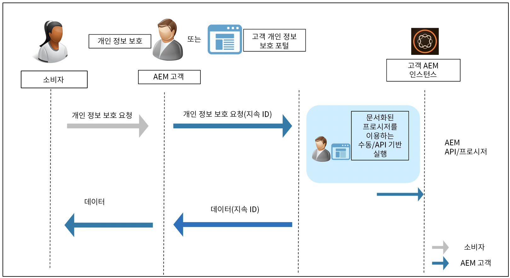

# 데이터 보호 및 데이터 개인정보 보호 규정을 위한 Adobe Experience Manager as a Cloud Service 준비 {#aem-readiness-for-data-protection-and-data-privacy-regulations}

>[!WARNING]
>
>이 문서의 콘텐츠는 법률적인 조언을 포함하지 않으며, 법률적인 조언을 대체하지 않습니다.
>
>데이터 보호 및 데이터 개인정보 보호 규정에 대한 자세한 내용은 귀사의 법무 부서에 문의하십시오.

>[!NOTE]
>
>개인정보 보호 문제에 대한 Adobe의 대응과 Adobe 고객에게 의미하는 바에 대한 자세한 내용은 [Adobe 개인정보 보호 센터](https://www.adobe.com/privacy.html)를 참조하십시오.

Adobe는 고객 개인정보 보호 관리자 및 AEM 관리자가 Adobe 고객의 규정 준수를 지원하도록 문서 및 절차를 제공하고 있습니다(가능한 경우 API 포함).

* 이 설명서는 관리자가 데이터 보호 및 데이터 개인정보 보호 요청을 처리하도록 지원합니다.
* 고객은 문서화된 절차를 통해 수동으로 또는 가능한 경우 외부 포털이나 서비스에서 API에 호출하여 규제 요청을 실행할 수 있습니다.

>[!CAUTION]
>
>해당 문서에 설명된 세부 내용은 Adobe Experience Manager as a Cloud Service로 제한됩니다.
>
>다른 Adobe 온디맨드 서비스의 데이터 및 관련 개인정보 보호 요청 시 해당 서비스에 대한 조치가 필요합니다.
>
>자세한 내용은 [Adobe의 개인정보 보호 센터](https://www.adobe.com/privacy.html)를 참조하십시오.

## 소개 {#introduction}

Adobe Experience Manager as a Cloud Service의 인스턴스 및 해당 인스턴스에서 실행되는 애플리케이션은 Adobe 고객이 소유 및 운영합니다.

따라서 GDPR, CCPA 및 기타 데이터 보호 규정에 대한 책임은 고객에게 있습니다.

간략하게 소개하면 데이터 개인정보 보호 및 보호에 대한 규정에는 다음 역할이 따라야 할 새 규칙이 포함되어 있습니다.

* 비즈니스 엔티티(CCPA) 및/또는 데이터 컨트롤러(GDPR)

* 서비스 공급자(CCPA) 및/또는 데이터 프로세서(GDPR)

이들 규정에서의 주요 프로비전은 다음과 같습니다.

1. 직접 또는 간접적으로 식별 가능한 데이터와 같이 모든 고유 ID를 포함하도록 개인 데이터의 정의 확장

2. 동의 요구 사항 강화

3. 삭제 권한(데이터 삭제)에 대한 집중 강화

4. 데이터 판매 옵트아웃

Adobe Experience Manager as a Cloud Service에 대해

* 인스턴스 및 해당 인스턴스에서 실행되는 애플리케이션은 고객이 소유 및 운영합니다.

   * 소유권은 고객이 비즈니스 엔티티, 서비스 공급자, 데이터 컨트롤러 및 데이터 프로세서를 포함한 규제 역할을 담당함을 의미합니다.

   * 아래 다이어그램에 표시된 바와 같이 Adobe Experience Platform Privacy Service는 AEM용 워크플로의 일부가 아닙니다.

* AEM에는 고객의 개인정보 보호 관리자 및/또는 AEM 관리자가 수동으로 또는 가능한 경우 API를 통해 개인정보 보호 규정 요청을 실행하도록 하는 문서 및 절차가 포함되어 있습니다.

* 새 서비스나 UI는 추가되지 않았습니다.

   * 대신 개인정보 보호 규정 요청을 처리하는 고객 UI/포털에서 사용할 수 있도록 절차 및 API가 문서화되었습니다.

* AEM에는 개인정보 보호 요청 워크플로 지원을 위한 맞춤형 툴링이 포함되지 않습니다.

   * Adobe는 고객의 개인정보 보호 관리자, AEM 관리자 또는 둘 다 수동으로 개인정보 보호 규정 관련 요청을 실행할 수 있는 설명서 및 절차를 제공합니다.

Adobe는 Adobe Experience Manager as a Cloud Service에 대한 액세스, 삭제 또는 옵트아웃과 관련된 개인정보 보호 요청 처리를 위한 절차를 제공하고 있습니다. 경우에 따라 고객 개발 포털 또는 스크립트에서 호출하여 자동화를 지원할 수 있는 API도 사용할 수 있습니다.

다음 다이어그램은 개인정보 보호 요청 워크플로의 형태를 보여 줍니다(Adobe Experience Manager 6.5를 사용하여 설명함).

## Adobe Experience Manager as a Cloud Service 및 규제 준비 {#aem-as-a-cloud-service-and-regulatory-readiness}

AEM as a Cloud Service의 제품 영역에 대한 아래의 규제 설명서 섹션을 참조하십시오.

## Adobe Experience Manager as a Cloud Service Foundation {#aem-foundation}

[데이터 보호 및 데이터 개인정보 보호 규정을 위한 AEM Foundation 준비](/help/compliance/data-privacy-and-protection-readiness/foundation-readiness.md)를 참조하십시오.

## Adobe Experience Manager as a Cloud Service Sites {#aem-sites}

[데이터 보호 및 데이터 개인정보 보호 규정을 위한 AEM Sites 준비](/help/compliance/data-privacy-and-protection-readiness/sites-readiness.md)를 참조하십시오

## Adobe Target 및 Adobe Analytics와의 Adobe Experience Manager as a Cloud Service 통합 {#aem-integration-with-adobe-target-adobe-analytics}

Adobe Experience Manager as a Cloud Service와 Adobe Target 및 Adobe Analytics의 통합은 데이터 보호 및 개인정보 보호(예: GDPR) 지원 서비스로 구현됩니다. 해당 통합과 관련하여 어떠한 Adobe Target 또는 Adobe Analytics의 개인 데이터도 AEM에 저장되지 않습니다.
자세한 내용은 다음 문서를 참조하십시오.

* [Adobe Target - 개인정보 보호 개요](https://experienceleague.adobe.com/docs/target-dev/developer/implementation/privacy/cmp-privacy-and-general-data-protection-regulation.html)

* [Adobe Analytics 데이터 개인정보 보호 워크플로](https://experienceleague.adobe.com/docs/analytics/admin/admin-tools/data-governance/an-gdpr-workflow.html)
