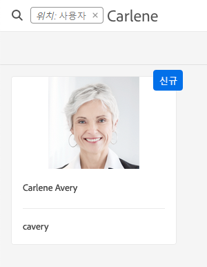
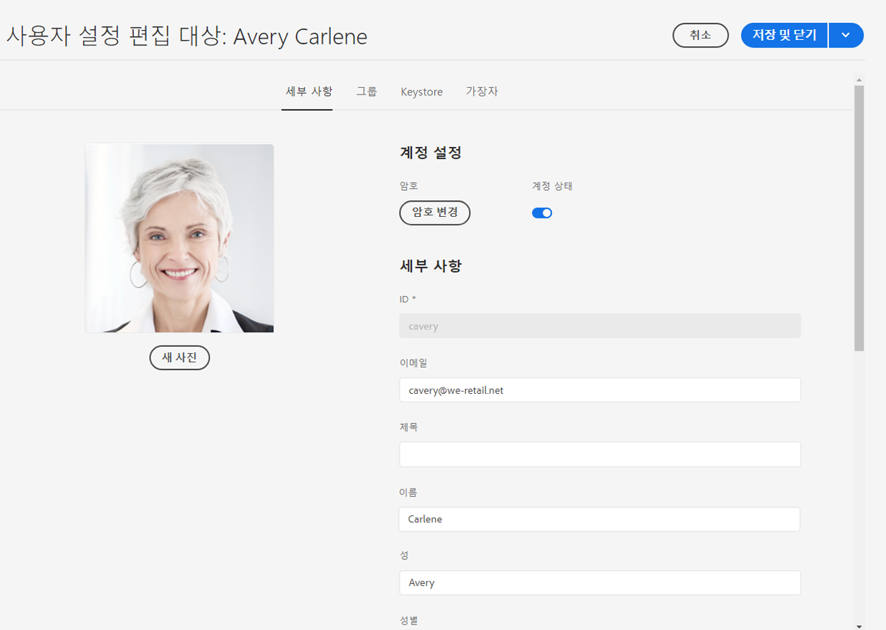
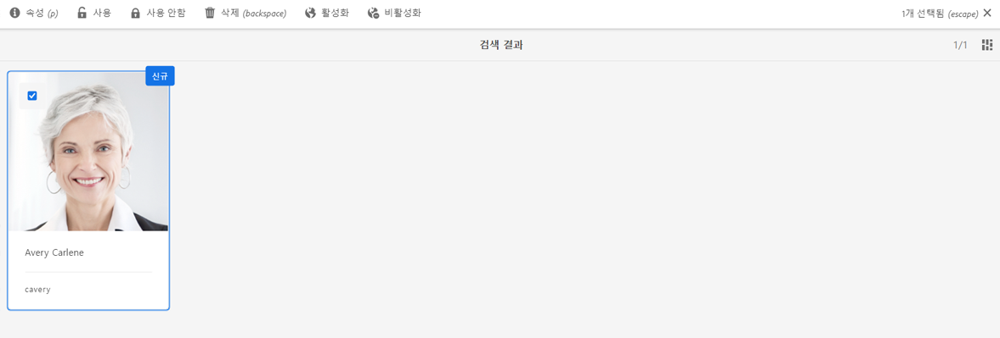
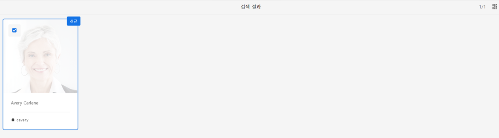

# 데이터 보호 및 데이터 개인정보 보호 규정을 위한 Adobe Experience Manager as a Cloud Service Foundation 준비 {#aem-foundation-readiness-for-data-protection-and-data-privacy-regulations}

>[!WARNING]
>
>이 문서의 콘텐츠는 법률적인 조언을 포함하지 않으며, 법률적인 조언을 대체하지 않습니다.
>
>데이터 보호 및 데이터 개인정보 보호 규정에 대한 자세한 내용은 귀사의 법무 부서에 문의하십시오.

>[!NOTE]
>
>개인 정보 보호 문제에 대한 Adobe의 대응 및 Adobe 고객으로서의 의미에 대한 자세한 내용은 다음을 참조하십시오. [Adobe 개인정보 보호 센터](https://www.adobe.com/privacy.html).

## AEM Foundation 데이터 개인정보 보호 및 보호 지원 {#aem-foundation-data-privacy-and-protection-support}

AEM Foundation 수준에서 저장되는 개인 데이터는 사용자 프로필에 보관됩니다. 따라서 이 문서의 정보는 주로 사용자 프로필에 액세스하고 삭제하는 방법을 다루므로 액세스 및 삭제 요청을 각각 처리할 수 있습니다.

## 사용자 프로필에 액세스 {#accessing-a-user-profile}

### 설명서 단계 {#manual-steps}

1. **[!UICONTROL 도구 - 보안 - 사용자]**&#x200B;를 검색하거나 `https://<serveraddress>:<serverport>/security/users.html`을 바로 검색하여 사용자 관리 콘솔을 엽니다.

<!--
   
-->

1. 그런 다음 페이지 상단의 검색 창에서 해당 사용자의 이름을 입력하여 검색합니다.

   

1. 마지막으로 사용자 프로필을 클릭하여 연 다음 **[!UICONTROL 세부 정보]** 탭을 선택합니다.

   

### HTTP API {#http-api}

앞에서 언급한 바와 같이 Adobe는 용이한 자동화를 위해 사용자 데이터 액세스에 대한 API를 제공합니다. 다음은 사용할 수 있는 여러 유형의 API입니다.

**UserProperties API**

```shell
curl -u user:password http://localhost:4502/libs/granite/security/search/profile.userproperties.json\?authId\=cavery
```

**Sling API**

**사용자 홈 탐색:**

```xml
curl -g -u user:password 'http://localhost:4502/libs/granite/security/search/authorizables.json?query={"condition":[{"named":"cavery"}]}'
     {"authorizables":[{"type":"user","authorizableId_xss":"cavery","authorizableId":"cavery","name_xss":"Carlene Avery","name":"Carlene Avery","home":"/home/users/we-retail/DSCP-athB1NYLBXvdTuN"}],"total":1}
```

**사용자 데이터 검색:**

위 명령에서 반환된 JSON 페이로드의 홈 속성에서 노드 경로 사용:

```shell
curl -u user:password  'http://localhost:4502/home/users/we-retail/DSCP-athB1NYLBXvdTuN/profile.-1.json'
```

```shell
curl -u user:password  'http://localhost:4502/home/users/we-retail/DSCP-athB1NYLBXvdTuN/profiles.-1.json'
```

## 사용자 비활성화 및 관련 프로필 삭제 {#disabling-a-user-and-deleting-the-associated-profiles}

### 사용자 비활성화 {#disable-user}

1. 위에서 설명한 대로 사용자 관리 콘솔을 연 다음 해당 사용자를 검색합니다.
2. 해당 사용자에 마우스를 가져다 대고 [선택] 아이콘을 클릭합니다. 프로필이 회색으로 바뀌어 선택되었음을 나타냅니다.

3. 상단 메뉴에서 **사용 안 함** 사용자를 비활성화(끄기)하려면 다음을 수행합니다.

   

4. 마지막으로, 작업을 확인합니다.

   사용자 인터페이스는 회색으로 표시되고 프로필 카드에 잠금이 추가되어 사용자 계정이 비활성화되었음을 나타냅니다.

   

### 사용자 프로필 정보 삭제 {#delete-user-profile-information}

>[!NOTE]
>
>AEM as a Cloud Service의 경우 CRXDE에 액세스할 수 없으므로 UI에서 사용자 프로필을 삭제하는 데 사용할 수 있는 수동 절차가 없습니다.

### HTTP API {#http-api-1}

다음 절차는 `curl` 를 사용하여 사용자를 비활성화하는 방법을 보여 주는 명령줄 도구 **[!UICONTROL 은폐]** `userId` 기본 위치에서 사용할 수 있는 사용자 프로필을 삭제합니다.

**사용자 홈 탐색:**

```shell
curl -g -u user:password 'http://localhost:4502/libs/granite/security/search/authorizables.json?query={"condition":[{"named":"cavery"}]}'
     {"authorizables":[{"type":"user","authorizableId_xss":"cavery","authorizableId":"cavery","name_xss":"Carlene Avery","name":"Carlene Avery","home":"/home/users/we-retail/DSCP-athB1NYLBXvdTuN"}],"total":1}
```

**사용자 비활성화:**

위 명령에서 반환된 JSON 페이로드의 홈 속성에서 노드 경로 사용:

```shell
curl -X POST -u user:password -FdisableUser="describe the reasons for disabling this user (Data Privacy in this case)" 'http://localhost:4502/home/users/we-retail/DSCP-athB1NYLBXvdTuN.rw.userprops.html'
```

**사용자 프로필 삭제**

계정 탐색 명령에서 반환된 JSON 페이로드의 홈 속성에서 노드 경로 및 알려진 맞춤형 프로필 노드 위치 사용:

```shell
curl -X POST -u user:password -H "Accept: application/json,**/**;q=0.9" -d ':operation=delete' 'http://localhost:4502/home/users/we-retail/DSCP-athB1NYLBXvdTuN/profile'
```

```shell
curl -X POST -u user:password -H "Accept: application/json,**/**;q=0.9" -d ':operation=delete' 'http://localhost:4502/home/users/we-retail/DSCP-athB1NYLBXvdTuN/profile'
```
